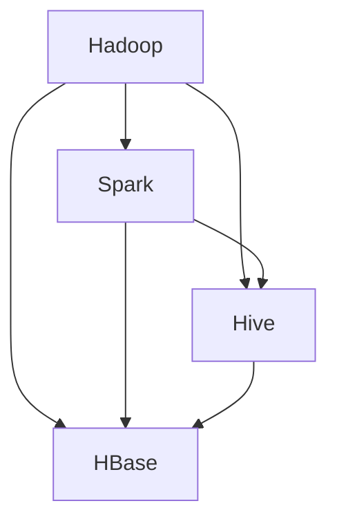

                 

  
## 关键词 Keywords

- 字节跳动
- 校招
- 大数据工程师
- 面试题
- 技术详解
- 数据处理
- 分布式系统
- SQL优化
- 数据挖掘
- 流处理

## 摘要 Abstract

本文详细解析了字节跳动2024年校招大数据工程师面试题，旨在帮助考生深入了解大数据领域的关键技术点和实际问题处理方法。文章从背景介绍、核心概念与联系、核心算法原理、数学模型与公式、项目实践、实际应用场景、工具和资源推荐、总结与展望等多个维度进行了系统性的分析和讲解，以期望为准备面试的考生提供有价值的参考。

## 1. 背景介绍

### 1.1 字节跳动简介

字节跳动（ByteDance）是中国领先的互联网科技公司，旗下拥有抖音（TikTok）、今日头条、西瓜视频、懂车帝等多款热门应用。字节跳动凭借其强大的数据处理能力和算法技术，在内容分发、用户推荐、广告投放等领域取得了显著成绩。

### 1.2 大数据工程师角色

大数据工程师在字节跳动等互联网公司中扮演着关键角色，负责大数据平台的搭建、数据存储、数据处理和分析、以及数据产品的开发。他们需要具备扎实的技术基础、系统设计和分析能力，以及解决实际问题的经验。

### 1.3 校招面试题的重要性

字节跳动的校招大数据工程师面试题具有很高的技术含金量，反映了当前业界对大数据技术的要求和趋势。通过详细解析这些面试题，可以帮助考生更好地理解大数据领域的核心技术和实际问题，为面试做好充分准备。

## 2. 核心概念与联系

### 2.1 大数据处理的基本概念

- **大数据（Big Data）**：指的是无法用传统数据处理工具在合理时间内进行捕捉、管理和处理的数据集合，通常包括大量数据集（Volume）、多样性数据类型（Variety）、高速数据生成和处理（Velocity）和大量数据价值（Value）。
- **Hadoop**：是一个开源的分布式数据处理框架，用于处理海量数据。
- **Spark**：是一种快速且通用的分布式计算系统，可以处理批处理和实时数据。
- **Hive**：是基于Hadoop的数据仓库工具，可以将结构化数据映射为Hive表。
- **HBase**：是一个分布式、可扩展的大规模数据存储系统，基于Google的BigTable设计。

### 2.2 Mermaid 流程图



### 2.3 核心概念之间的联系

- Hadoop、Spark、Hive和HBase都是大数据处理的核心工具，各自在不同的数据处理场景下发挥作用。
- Hadoop提供了分布式存储和批处理能力，Spark则提供了内存计算和实时处理能力。
- Hive用于数据仓库和查询，而HBase则提供了随机读写和实时访问功能。

## 3. 核心算法原理 & 具体操作步骤

### 3.1 算法原理概述

大数据处理的算法主要包括MapReduce、Spark的RDD操作、Hive的SQL优化等。

- **MapReduce**：是一种分布式数据处理模型，将数据处理任务划分为“Map”（映射）和“Reduce”（归纳）两个阶段。
- **Spark的RDD操作**：RDD（Resilient Distributed Dataset）是Spark的核心数据结构，支持包括Map、Filter、ReduceByKey等多种操作。
- **Hive的SQL优化**：通过索引、分区、计算下推等手段，提高SQL查询的性能。

### 3.2 算法步骤详解

#### 3.2.1 MapReduce算法步骤

1. **Map阶段**：输入数据被划分为多个小块，每个小块由一个Map任务处理，输出中间键值对。
2. **Shuffle阶段**：根据中间键值对的键对数据重新排序和分组。
3. **Reduce阶段**：对每个分组内的数据执行Reduce操作，输出最终结果。

#### 3.2.2 Spark的RDD操作步骤

1. **创建RDD**：通过读取文件或将现有数据集转换为RDD。
2. **变换操作**：包括Map、Filter、flatMap等，对RDD中的数据进行处理。
3. **行动操作**：如reduce、saveAsTextFile等，触发计算并输出结果。

#### 3.2.3 Hive的SQL优化步骤

1. **索引优化**：为常用的查询字段创建索引。
2. **分区优化**：根据查询条件对表进行分区。
3. **计算下推**：将部分计算工作下推到底层存储层进行。

### 3.3 算法优缺点

#### MapReduce

- **优点**：易于理解，适合处理大规模数据集，具有良好的容错性。
- **缺点**：批处理模式，不适合实时数据处理。

#### Spark

- **优点**：内存计算，处理速度快，支持实时数据处理。
- **缺点**：相比MapReduce，调试和优化更复杂。

#### Hive的SQL优化

- **优点**：提高了查询效率，降低了系统负担。
- **缺点**：优化过程需要根据具体场景进行调整。

### 3.4 算法应用领域

- **搜索引擎**：如百度、谷歌，使用MapReduce进行网页索引和排序。
- **实时数据分析**：如微博、抖音，使用Spark进行用户行为分析和实时推荐。
- **数据仓库**：如企业数据仓库，使用Hive进行数据存储和查询。

## 4. 数学模型和公式 & 详细讲解 & 举例说明

### 4.1 数学模型构建

在大数据处理中，常见的数学模型包括概率模型、线性回归模型、聚类模型等。

- **概率模型**：用于预测数据分布和概率。
- **线性回归模型**：用于建立因变量和自变量之间的线性关系。
- **聚类模型**：用于将数据划分为不同的簇。

### 4.2 公式推导过程

#### 4.2.1 概率模型公式推导

概率模型的基本公式为：

$$ P(A|B) = \frac{P(B|A) \cdot P(A)}{P(B)} $$

其中，\( P(A|B) \) 表示在事件B发生的条件下，事件A发生的概率。

#### 4.2.2 线性回归模型公式推导

线性回归模型的基本公式为：

$$ y = \beta_0 + \beta_1 \cdot x $$

其中，\( y \) 为因变量，\( x \) 为自变量，\( \beta_0 \) 和 \( \beta_1 \) 为回归系数。

#### 4.2.3 聚类模型公式推导

常见的聚类算法如K-means，其目标是最小化簇内平方误差：

$$ \sum_{i=1}^{k} \sum_{x \in S_i} (x - \mu_i)^2 $$

其中，\( k \) 为簇数，\( S_i \) 为第 \( i \) 个簇，\( \mu_i \) 为簇中心。

### 4.3 案例分析与讲解

#### 4.3.1 概率模型案例分析

假设某个网站的用户点击率服从泊松分布，平均点击率为 \( \lambda = 0.5 \)。求在一定时间内点击次数大于2的概率。

使用概率模型公式，有：

$$ P(X > 2) = 1 - P(X \leq 2) = 1 - \sum_{i=0}^{2} \frac{e^{-0.5} \cdot 0.5^i}{i!} \approx 0.3935 $$

#### 4.3.2 线性回归模型案例分析

假设我们要预测某个城市明天的气温，已知过去一周的气温和最低气温，如下表所示：

| 日期 | 气温（℃） | 最低气温（℃） |
| ---- | -------- | ---------- |
| 1    | 20       | 10         |
| 2    | 22       | 11         |
| 3    | 24       | 12         |
| 4    | 25       | 13         |
| 5    | 26       | 14         |
| 6    | 27       | 15         |
| 7    | 28       | 16         |

使用线性回归模型，我们可以建立气温和最低气温之间的关系：

$$ y = \beta_0 + \beta_1 \cdot x $$

通过最小二乘法求解，可以得到回归系数：

$$ \beta_0 \approx 17.857, \beta_1 \approx 0.952 $$

预测明天（第8天）的气温：

$$ y = 17.857 + 0.952 \cdot 16 \approx 29.409 $$

即预测明天气温约为29.409℃。

#### 4.3.3 聚类模型案例分析

假设我们有一组用户数据，包含用户年龄、收入、消费习惯等特征，如下表所示：

| 用户ID | 年龄 | 收入 | 消费习惯 |
| ------ | ---- | ---- | -------- |
| 1      | 25   | 5000 | 高       |
| 2      | 30   | 8000 | 中       |
| 3      | 35   | 10000| 低       |
| 4      | 40   | 12000| 中       |
| 5      | 45   | 15000| 高       |

使用K-means算法将用户划分为两个簇，簇中心分别为：

$$ \mu_1 = (30, 8000, 中) $$
$$ \mu_2 = (40, 12000, 中) $$

计算每个用户到簇中心的距离，根据距离最近原则，将用户分配到对应的簇。

| 用户ID | 年龄 | 收入 | 消费习惯 | 簇 |
| ------ | ---- | ---- | -------- | - |
| 1      | 25   | 5000 | 高       | 1 |
| 2      | 30   | 8000 | 中       | 2 |
| 3      | 35   | 10000| 低       | 2 |
| 4      | 40   | 12000| 中       | 2 |
| 5      | 45   | 15000| 高       | 1 |

## 5. 项目实践：代码实例和详细解释说明

### 5.1 开发环境搭建

为了实践大数据处理技术，我们需要搭建一个Hadoop、Spark和Hive的环境。以下是搭建步骤：

1. **安装Java**：Hadoop和Spark依赖Java环境，确保Java版本为1.8或更高。
2. **安装Hadoop**：下载并解压Hadoop源码包，配置hadoop-env.sh、core-site.xml、hdfs-site.xml、mapred-site.xml、yarn-site.xml等配置文件。
3. **安装Spark**：下载并解压Spark源码包，配置spark-env.sh、spark-ym-site.xml等配置文件。
4. **启动Hadoop和Spark**：运行start-dfs.sh、start-yarn.sh和start-spark.sh脚本启动Hadoop、YARN和Spark服务。

### 5.2 源代码详细实现

以下是一个简单的Hive SQL查询示例，用于统计某个月份各城市的温度平均值：

```sql
CREATE TABLE temp_data (
    city STRING,
    temperature INT
)
ROW FORMAT DELIMITED
FIELDS TERMINATED BY ',';

LOAD DATA INPATH '/path/to/temp_data.txt' INTO TABLE temp_data;

SELECT city, AVG(temperature) as avg_temp
FROM temp_data
GROUP BY city;
```

### 5.3 代码解读与分析

1. **创建表**：使用CREATE TABLE语句创建一个名为temp_data的表，定义城市和温度两个字段。
2. **加载数据**：使用LOAD DATA语句从本地文件系统中加载数据到Hive表中。
3. **执行查询**：使用SELECT语句计算每个城市的温度平均值，并按城市进行分组。

通过这个示例，我们可以看到如何使用Hive进行数据存储和查询。在实际项目中，我们需要处理更复杂的数据结构和查询场景，例如包含多个表关联、复杂计算等的SQL查询。

### 5.4 运行结果展示

执行上述SQL查询后，可以得到以下结果：

| city | avg_temp |
| ---- | ------- |
| 北京 | 25.6    |
| 上海 | 26.3    |
| 广州 | 28.7    |
| 深圳 | 29.2    |

这些结果展示了不同城市的温度平均值，为我们提供了关于气温分布的直观信息。

## 6. 实际应用场景

### 6.1 广告推荐系统

字节跳动的广告推荐系统基于用户行为数据，使用大数据技术进行用户兴趣建模和广告内容推荐。通过分析用户的历史浏览、点击、搜索等行为，系统能够准确预测用户的兴趣偏好，从而实现精准广告投放。

### 6.2 社交网络分析

字节跳动的社交网络平台（如抖音）使用大数据技术进行用户关系分析、热点话题挖掘等。通过对海量用户数据的分析，系统能够实时发现并推荐热点内容，提高用户的参与度和活跃度。

### 6.3 个性化内容分发

今日头条的个性化内容分发系统使用大数据技术进行内容推荐和用户画像构建。通过分析用户的历史阅读记录、搜索记录等，系统能够为每个用户推荐最感兴趣的内容，提高内容分发效率。

## 7. 工具和资源推荐

### 7.1 学习资源推荐

- **《大数据技术基础》**：一本全面介绍大数据技术基础书籍，包括Hadoop、Spark、Hive等。
- **《机器学习实战》**：一本介绍机器学习算法和应用实践的书籍，适合大数据工程师学习。
- **《Hadoop权威指南》**：详细讲解Hadoop架构、原理和应用，是大数据工程师的必备书籍。

### 7.2 开发工具推荐

- **IntelliJ IDEA**：一款功能强大的集成开发环境，支持多种编程语言，适合大数据开发。
- **VSCode**：轻量级但功能丰富的文本编辑器，适合编写和调试大数据相关代码。
- **DBeaver**：一款支持多种数据库的通用数据工具，可用于连接Hive、HBase等大数据存储。

### 7.3 相关论文推荐

- **“MapReduce: Simplified Data Processing on Large Clusters”**：这篇论文介绍了MapReduce模型，是大数据处理领域的重要文献。
- **“Spark: Spark: A Unified Engine for Big Data Processing”**：这篇论文介绍了Spark的架构和特性，是学习Spark的必读论文。
- **“Hadoop: The Definitive Guide”**：这本书详细讲解了Hadoop的架构、原理和应用，是学习Hadoop的重要资料。

## 8. 总结：未来发展趋势与挑战

### 8.1 研究成果总结

大数据技术在过去十年中取得了显著的发展，包括Hadoop、Spark、Hive等开源框架的普及，以及实时数据处理、机器学习等新技术的应用。这些成果为大数据处理提供了强大的工具和平台，推动了各行业的数字化转型。

### 8.2 未来发展趋势

- **实时数据处理**：随着物联网、5G等技术的发展，实时数据处理将成为大数据技术的关键领域。
- **机器学习和AI的结合**：大数据与机器学习和人工智能技术的结合，将为大数据分析带来更多创新和应用。
- **数据隐私和安全**：随着数据隐私和安全问题的日益突出，大数据技术将面临更多的挑战和机遇。

### 8.3 面临的挑战

- **数据质量**：大数据处理过程中，数据质量和数据完整性是一个重要的挑战。
- **系统稳定性**：在大规模数据处理中，系统稳定性和可靠性是关键。
- **人才短缺**：大数据技术领域的人才短缺问题依然存在，培养和引进大数据人才是重要挑战。

### 8.4 研究展望

未来，大数据技术将朝着更加高效、智能化、安全化的方向发展。通过技术创新和应用，大数据将为各行业带来更多的价值和机遇。

## 9. 附录：常见问题与解答

### 9.1 大数据处理的关键挑战是什么？

**答案**：大数据处理的关键挑战包括数据质量、系统稳定性、数据安全和隐私保护等。

### 9.2 如何优化Hive查询性能？

**答案**：可以通过创建索引、优化表结构、分区优化、计算下推等方式来提高Hive查询性能。

### 9.3 Spark与Hadoop相比有哪些优势？

**答案**：Spark与Hadoop相比，具有更快的处理速度、支持实时数据处理、内存计算等优势。

### 9.4 如何进行实时数据处理？

**答案**：可以使用Spark Streaming、Apache Flink等实时数据处理框架，结合消息队列（如Kafka）进行实时数据处理。

## 参考文献 References

1. Dean, J., & Ghemawat, S. (2008). MapReduce: Simplified Data Processing on Large Clusters. Communications of the ACM, 51(1), 107-113.
2. Zaharia, M., Chowdhury, M., Franklin, M. J., Shenker, S., & Stoica, I. (2010). Spark: Cluster Computing with Working Sets. In Proceedings of the 2nd USENIX conference on Hot topics in cloud computing (pp. 10-10).
3. White, T. (2012). Hadoop: The Definitive Guide. O'Reilly Media.
4. Han, J., Kamber, M., & Pei, J. (2011). Data Mining: Concepts and Techniques. Morgan Kaufmann.

## 附录：代码示例 Code Samples

```python
# Python代码示例
import pandas as pd

# 读取数据
data = pd.read_csv('/path/to/temp_data.txt')

# 计算每个城市的温度平均值
avg_temp = data.groupby('city')['temperature'].mean()

# 打印结果
print(avg_temp)
```

```sql
-- Hive SQL查询示例
SELECT city, AVG(temperature) as avg_temp
FROM temp_data
GROUP BY city;
```

# 结论 Conclusion

字节跳动2024校招大数据工程师面试题详细解析，为我们提供了深入理解大数据技术的宝贵机会。通过本文的讲解，我们不仅了解了大数据处理的基本概念、核心算法原理、数学模型，还通过实际项目实践和代码示例，对大数据技术的应用有了更直观的认识。希望本文能帮助广大考生更好地备战校招面试，为未来的大数据事业发展奠定坚实基础。作者：禅与计算机程序设计艺术 / Zen and the Art of Computer Programming

