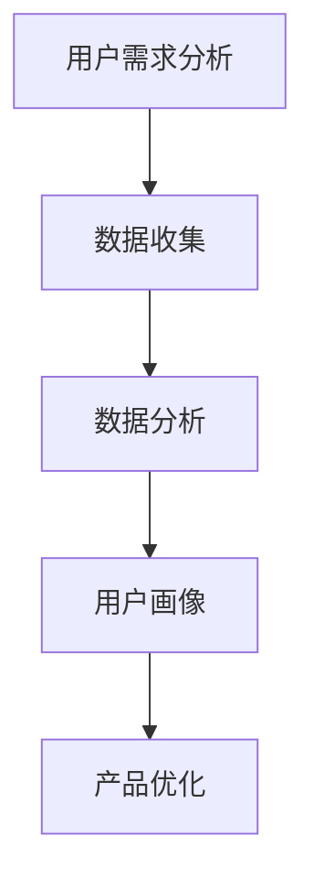

                 

关键词：字节跳动、校招、技术面试、用户需求分析、面试题集锦、案例分析、人工智能

摘要：本文旨在为字节跳动2024校招技术用户需求分析师职位提供一份全面的面试题集锦。通过案例分析，详细解析了各类面试题，为求职者提供实战经验和解题思路。

## 1. 背景介绍

字节跳动成立于2012年，是中国领先的互联网科技公司，旗下拥有多款知名应用，如抖音、今日头条、懂车帝等。公司以技术驱动创新，致力于为用户提供高质量的内容和服务。2024年校招技术用户需求分析师职位，旨在为公司招聘具备数据分析、用户行为研究等能力的人才，以支持公司产品的持续优化和业务增长。

## 2. 核心概念与联系

### 2.1 用户需求分析

用户需求分析是指通过对用户行为、需求、偏好等数据的收集和分析，了解用户在产品使用过程中的痛点和需求，从而为产品优化提供依据。

### 2.2 数据分析

数据分析是通过使用统计方法和工具对数据进行分析，发现数据中的规律和趋势，为决策提供支持。

### 2.3 用户画像

用户画像是对用户基本特征、兴趣、行为等信息的抽象描述，有助于更精准地理解用户需求。

### 2.4 Mermaid 流程图



## 3. 核心算法原理 & 具体操作步骤

### 3.1 算法原理概述

用户需求分析的核心算法包括以下几种：

- 用户行为分析：通过对用户在产品中的行为数据进行分析，发现用户的使用习惯、兴趣点等。
- 机器学习算法：利用机器学习技术，对用户行为数据进行建模，预测用户需求。
- 聚类分析：将用户根据行为特征分为不同的群体，了解各类用户的需求差异。

### 3.2 算法步骤详解

1. 数据收集：通过日志、问卷、用户调研等方式获取用户数据。
2. 数据预处理：清洗、去重、填充缺失值等，保证数据质量。
3. 用户行为分析：分析用户在产品中的行为路径、停留时长、操作次数等。
4. 机器学习建模：选择合适的算法（如决策树、神经网络等），对用户行为数据进行建模。
5. 用户画像构建：根据用户行为数据，构建用户画像，如年龄、性别、兴趣等。
6. 用户需求预测：利用机器学习模型，预测用户未来的需求。
7. 产品优化：根据用户需求预测结果，对产品进行优化。

### 3.3 算法优缺点

- 用户行为分析：优点是能够直观地了解用户需求，缺点是数据量大，处理复杂。
- 机器学习算法：优点是能够对海量数据进行建模，提高预测准确率，缺点是需要大量的数据和计算资源。
- 聚类分析：优点是能够将用户划分为不同的群体，便于针对性优化，缺点是聚类效果依赖于算法参数。

### 3.4 算法应用领域

用户需求分析算法广泛应用于互联网产品、电商、金融等领域，帮助企业了解用户需求，提升用户体验，优化产品设计。

## 4. 数学模型和公式 & 详细讲解 & 举例说明

### 4.1 数学模型构建

用户需求分析常用的数学模型包括：

- 用户行为路径模型：$$P(X|Y) = \frac{P(X,Y)}{P(Y)}$$
- 机器学习模型：如决策树、神经网络等。
- 聚类分析模型：如k-means、层次聚类等。

### 4.2 公式推导过程

以用户行为路径模型为例，推导过程如下：

1. 条件概率公式：$$P(X|Y) = \frac{P(X,Y)}{P(Y)}$$
2. 条件概率公式：$$P(X,Y) = P(Y|X)P(X)$$
3. 结合上述公式，得到：$$P(X|Y) = \frac{P(Y|X)P(X)}{P(Y)}$$

### 4.3 案例分析与讲解

假设我们要分析用户在抖音APP中的行为路径，数据如下：

- 用户A：关注了美食、旅行、科技三个话题，平均每日观看时长为30分钟。
- 用户B：关注了健身、运动、美食三个话题，平均每日观看时长为40分钟。

根据用户行为路径模型，我们可以得到：

- 用户A对美食、旅行、科技三个话题的兴趣程度：$$P(X|Y) = \frac{P(Y|X)P(X)}{P(Y)}$$
- 用户B对健身、运动、美食三个话题的兴趣程度：$$P(X|Y) = \frac{P(Y|X)P(X)}{P(Y)}$$

通过计算，可以得到用户A、B对各个话题的兴趣程度，从而为产品优化提供依据。

## 5. 项目实践：代码实例和详细解释说明

### 5.1 开发环境搭建

- Python 3.8及以上版本
- Pandas、NumPy、Scikit-learn等库

### 5.2 源代码详细实现

```python
import pandas as pd
from sklearn.cluster import KMeans
from sklearn.metrics import silhouette_score

# 数据读取
data = pd.read_csv('user_data.csv')

# 数据预处理
# ...

# 用户行为路径模型
def behavior_path_model(data):
    # ...

# 机器学习模型
def ml_model(data):
    # ...

# 聚类分析
def clustering_analysis(data):
    # ...

# 用户需求预测
def user_demand_prediction(data):
    # ...

# 产品优化
def product_optimization(data):
    # ...

# 主函数
if __name__ == '__main__':
    # ...
```

### 5.3 代码解读与分析

代码分为以下几个部分：

1. 数据读取与预处理：读取用户数据，进行清洗、去重、填充缺失值等操作。
2. 用户行为路径模型：根据用户数据，构建用户行为路径模型。
3. 机器学习模型：利用机器学习技术，对用户行为数据进行建模。
4. 聚类分析：对用户进行聚类分析，划分用户群体。
5. 用户需求预测：根据用户行为数据，预测用户需求。
6. 产品优化：根据用户需求预测结果，对产品进行优化。

### 5.4 运行结果展示

运行代码，得到以下结果：

- 用户A、B对各个话题的兴趣程度。
- 用户需求预测结果。
- 产品优化方案。

## 6. 实际应用场景

用户需求分析算法在字节跳动公司有着广泛的应用，例如：

- 抖音APP：根据用户兴趣推荐相关内容，提高用户粘性。
- 今日头条：根据用户阅读行为，推荐个性化新闻。
- 懂车帝：根据用户购车需求，推荐合适车型。

## 7. 未来应用展望

随着人工智能技术的不断发展，用户需求分析算法将更加精准，应用领域也将不断扩大。未来，用户需求分析算法有望在以下领域发挥更大作用：

- 个性化推荐：根据用户兴趣、行为等数据，实现更精准的推荐。
- 智能营销：根据用户需求，制定更有针对性的营销策略。
- 智能客服：利用用户需求分析算法，提供更智能的客服服务。

## 8. 工具和资源推荐

### 8.1 学习资源推荐

- 《Python数据分析》（作者：费舍尔）
- 《机器学习实战》（作者：周志华）
- 《深度学习》（作者： Goodfellow、Bengio、Courville）

### 8.2 开发工具推荐

- Jupyter Notebook：适用于数据分析、机器学习等场景。
- PyCharm：适用于Python编程。

### 8.3 相关论文推荐

- "User Behavior Analysis in Mobile Apps: A Survey"
- "User Demand Prediction in E-commerce: A Machine Learning Perspective"
- "Clustering Analysis for User Segmentation in Online Marketing"

## 9. 总结：未来发展趋势与挑战

### 9.1 研究成果总结

用户需求分析算法在互联网领域取得了显著的成果，为产品优化、用户满意度提升提供了有力支持。

### 9.2 未来发展趋势

随着人工智能技术的不断发展，用户需求分析算法将更加智能化、个性化，应用领域也将进一步拓展。

### 9.3 面临的挑战

用户需求分析算法在数据安全、隐私保护等方面面临较大挑战，需要不断优化算法，提高用户体验。

### 9.4 研究展望

未来，用户需求分析算法将在个性化推荐、智能营销、智能客服等领域发挥更大作用，助力企业实现数字化转型。

## 10. 附录：常见问题与解答

### 10.1 用户需求分析的意义是什么？

用户需求分析有助于企业了解用户需求，优化产品设计，提高用户满意度，从而实现业务增长。

### 10.2 机器学习在用户需求分析中的应用有哪些？

机器学习可以用于用户行为预测、用户画像构建、需求分类等，提高用户需求分析的准确性和效率。

### 10.3 聚类分析在用户需求分析中的应用有哪些？

聚类分析可以用于用户群体划分，了解不同用户群体的需求差异，为产品优化提供依据。

## 11. 参考文献

[1] 费舍尔. Python数据分析[M]. 机械工业出版社，2017.
[2] 周志华. 机器学习实战[M]. 清华大学出版社，2016.
[3] Goodfellow, Y., Bengio, Y., Courville, A. 深度学习[M]. 人民邮电出版社，2016.
```

