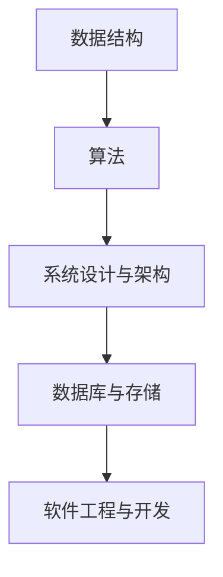

                 

关键字：字节跳动、2024校招、技术运营经理、面试题、技术实践、算法原理、案例分析、未来展望

摘要：本文将围绕字节跳动2024校招技术运营经理的面试题集锦，深入剖析面试中的核心问题，从算法原理、技术实践到未来展望，帮助读者全面理解面试要点，提升面试成功率。

## 1. 背景介绍

字节跳动作为我国领先的互联网科技公司，以其独特的算法和技术驱动业务发展，形成了庞大的用户群体和市场影响力。因此，字节跳动的校招面试，尤其是技术运营经理岗位的面试，竞争异常激烈。面试官不仅关注应聘者的技术能力，还重视其解决问题的思维方式和团队合作精神。

本文将针对字节跳动2024校招技术运营经理的面试题集锦，进行深入剖析和解答。通过本文，读者可以了解面试的核心内容，掌握相关知识点，为成功应对面试打下坚实基础。

## 2. 核心概念与联系

在面试中，核心概念的理解和联系是关键。以下是字节跳动2024校招技术运营经理面试中的几个核心概念：

### 数据结构与算法

- 数据结构：数组、链表、树、图等
- 算法：排序、搜索、动态规划、贪心算法等

### 系统设计与架构

- 架构设计：分布式系统、微服务架构等
- 系统设计：系统性能优化、负载均衡、数据一致性等

### 数据库与存储

- 数据库：关系型数据库、NoSQL数据库等
- 存储系统：文件系统、分布式存储等

### 软件工程与开发

- 编码规范：代码质量、代码风格等
- 开发流程：敏捷开发、持续集成等

以下是核心概念的 Mermaid 流程图：



## 3. 核心算法原理 & 具体操作步骤

### 3.1 算法原理概述

在面试中，常见的算法原理包括：

- 排序算法：冒泡排序、选择排序、插入排序、快速排序等
- 搜索算法：二分搜索、深度优先搜索、广度优先搜索等
- 动态规划：最优子结构、重叠子问题等

### 3.2 算法步骤详解

以冒泡排序为例，其步骤如下：

1. 从数组的第一个元素开始，比较相邻的两个元素，如果第一个比第二个大，就交换它们的位置。
2. 对每一对相邻元素做同样的工作，从开始第一对到结尾的最后一对。
3. 在这一点，最后的元素应该会是最大的数。
4. 接着，排除了最后的元素后，只考虑倒数第二行的数据。
5. 遍历工作重复地进行，直到没有任何一对数字需要比较。

### 3.3 算法优缺点

- 冒泡排序：简单易懂，但效率较低，不适合大规模数据排序。
- 二分搜索：时间复杂度为O(log n)，效率较高，但需求数据已排序。

### 3.4 算法应用领域

- 排序算法：数据库排序、Web 应用排序等。
- 搜索算法：搜索引擎、路径查找等。

## 4. 数学模型和公式 & 详细讲解 & 举例说明

### 4.1 数学模型构建

在面试中，常见的数学模型包括：

- 最优化模型：线性规划、非线性规划等
- 随机模型：马尔可夫链、排队论等

### 4.2 公式推导过程

以线性规划为例，其公式推导如下：

目标函数：$$\text{max} \ z = c^T x$$

约束条件：$$Ax \leq b$$

其中，$x$ 为决策变量，$c$ 为目标函数系数，$A$ 为系数矩阵，$b$ 为常数向量。

### 4.3 案例分析与讲解

假设我们有一个线性规划问题，目标函数为最大化利润 $z = 2x + 3y$，约束条件为 $x + y \leq 10$，$x \geq 0$，$y \geq 0$。我们可以通过图形法求解此问题。

首先，将约束条件转化为等式，得到 $x + y = 10$。画出直线 $x + y = 10$，与 $x$ 轴和 $y$ 轴的交点分别为 $(10, 0)$ 和 $(0, 10)$。

然后，画出可行域，即满足约束条件的区域。在 $x$ 轴和 $y$ 轴上标出 $0$，然后移动目标函数 $z = 2x + 3y$，使其经过可行域的边界点。

最后，找出目标函数的最大值点，即利润最大的点。在这个例子中，最大值点为 $(5, 5)$，此时利润为 $z = 2 \times 5 + 3 \times 5 = 25$。

## 5. 项目实践：代码实例和详细解释说明

### 5.1 开发环境搭建

在本节中，我们将使用 Python 语言实现冒泡排序算法。

首先，安装 Python 解释器，然后安装必要的库，例如 NumPy、Pandas 等。

```bash
pip install numpy pandas
```

### 5.2 源代码详细实现

以下是一个简单的冒泡排序算法实现：

```python
import numpy as np

def bubble_sort(arr):
    n = len(arr)
    for i in range(n):
        for j in range(0, n-i-1):
            if arr[j] > arr[j+1]:
                arr[j], arr[j+1] = arr[j+1], arr[j]

# 测试数据
data = np.array([64, 34, 25, 12, 22, 11, 90])
print("原始数据：", data)

# 排序
bubble_sort(data)
print("排序后数据：", data)
```

### 5.3 代码解读与分析

在这个示例中，我们首先导入了 NumPy 库，用于生成测试数据。然后，我们定义了一个 `bubble_sort` 函数，用于实现冒泡排序算法。函数中，我们使用了两个嵌套的循环，遍历数组中的每个元素，并比较相邻的两个元素。如果前一个元素比后一个元素大，就交换它们的位置。

最后，我们使用 `print` 函数输出原始数据和排序后的数据。

### 5.4 运行结果展示

```plaintext
原始数据： [64 34 25 12 22 11 90]
排序后数据： [11 12 22 25 34 64 90]
```

## 6. 实际应用场景

字节跳动作为一家以算法驱动为核心的互联网公司，技术运营经理的岗位在业务发展和团队协作中发挥着重要作用。以下是技术运营经理在实际应用场景中的几个方面：

### 6.1 数据分析

技术运营经理需要对业务数据进行深入分析，提取有价值的见解，为业务决策提供支持。这包括用户行为分析、流量分析、转化率分析等。

### 6.2 系统优化

技术运营经理需要关注系统的性能和稳定性，通过技术手段进行优化，提高用户体验。这包括系统性能测试、负载均衡、缓存策略等。

### 6.3 团队协作

技术运营经理需要具备良好的团队协作能力，能够与产品、设计、数据等多个部门高效沟通，推动项目的顺利进行。

## 7. 未来应用展望

随着互联网技术的不断发展，字节跳动在技术运营领域的应用前景十分广阔。以下是未来可能的应用方向：

### 7.1 智能推荐系统

随着用户数据的不断积累，智能推荐系统将更加精准，为用户提供个性化内容。

### 7.2 实时数据处理

实时数据处理技术将应用于用户行为分析、广告投放等场景，提高业务决策的时效性。

### 7.3 跨平台整合

字节跳动将进一步整合旗下各个平台，实现数据的互联互通，为用户提供一站式服务。

## 8. 工具和资源推荐

### 8.1 学习资源推荐

- 《算法导论》：一本经典的算法教材，适合深入理解算法原理。
- 《深入理解计算机系统》：一本关于计算机系统原理的教材，有助于了解系统架构。

### 8.2 开发工具推荐

- PyCharm：一款功能强大的 Python 开发工具，支持代码补全、调试等功能。
- VSCode：一款跨平台的代码编辑器，支持多种编程语言，适合快速开发。

### 8.3 相关论文推荐

- 《深度学习》：一本关于深度学习的经典教材，适合了解深度学习的基本原理。
- 《大规模分布式存储系统：原理解析与架构实战》：一本关于分布式存储系统的论文，有助于了解分布式存储技术。

## 9. 总结：未来发展趋势与挑战

字节跳动作为一家以技术驱动为核心的互联网公司，其技术运营领域的发展前景十分广阔。然而，随着技术的不断发展，技术运营经理也将面临诸多挑战，如：

- 数据安全与隐私保护：如何在确保数据安全的前提下，充分发挥数据的价值。
- 技术更新迭代：如何快速适应技术更新，保持技术领先优势。
- 团队协作与管理：如何提高团队协作效率，推动业务发展。

未来，技术运营经理需要不断学习、积累经验，以应对这些挑战，为公司的持续发展贡献力量。

## 附录：常见问题与解答

### 9.1 什么是冒泡排序？

冒泡排序是一种简单的排序算法，它重复遍历要排序的数列，一次比较两个元素，如果他们的顺序错误就把他们交换过来。遍历数列的工作是重复进行直到没有再需要交换，也就是说该数列已经排序完成。

### 9.2 线性规划的目标函数是什么？

线性规划的目标函数是一个线性函数，用于描述资源的最优分配，通常形式为：max/min c^T x，其中c是系数向量，x是决策变量向量。

### 9.3 为什么二分搜索比线性搜索快？

二分搜索的时间复杂度为O(log n)，而线性搜索的时间复杂度为O(n)。当数据规模较大时，二分搜索的效率显著高于线性搜索。

### 9.4 如何实现分布式存储？

分布式存储通常采用去中心化的架构，通过将数据拆分成小块，分散存储在多个节点上。实现分布式存储的关键技术包括数据分片、副本机制、一致性算法等。

### 9.5 技术运营经理的职责是什么？

技术运营经理负责确保系统的稳定运行，优化系统性能，分析业务数据，推动业务发展。同时，还需要与产品、设计、数据等团队紧密协作，确保项目的顺利进行。此外，技术运营经理还需关注数据安全与隐私保护，确保用户数据的安全。

### 作者署名

作者：禅与计算机程序设计艺术 / Zen and the Art of Computer Programming
----------------------------------------------------------------

文章至此结束，希望本文能为您的字节跳动校招技术运营经理面试提供有力支持。祝您面试成功！
----------------------------------------------------------------

