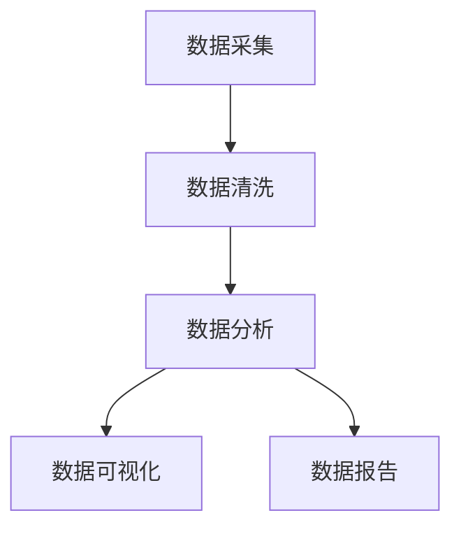

                 

 > **关键词**：字节跳动、校招、数据分析师、面试题、案例研究

> **摘要**：本文详细解析了字节跳动2024校招中数据分析师岗位的面试题集锦，包括核心概念、算法原理、数学模型、项目实践、应用场景、工具推荐、总结与展望等，旨在为准备面试的求职者提供全面的指导。

## 1. 背景介绍

字节跳动成立于2012年，是一家快速崛起的科技公司，旗下拥有抖音、今日头条、懂车帝等多款知名应用。随着大数据和人工智能技术的广泛应用，数据分析师在字节跳动等科技企业中扮演着越来越重要的角色。本文针对2024年字节跳动校招数据分析师岗位的面试题进行了整理和分析，旨在帮助求职者更好地准备面试。

### 1.1 字节跳动数据分析师岗位介绍

数据分析师在字节跳动主要职责包括：

- 数据采集与清洗：收集并处理海量的用户行为数据、业务数据等。
- 数据分析：利用数据分析工具，对数据进行分析和挖掘，发现数据背后的规律和趋势。
- 数据可视化：通过图表、报表等形式，将分析结果直观地呈现给决策者。
- 数据报告：撰写数据报告，为业务决策提供数据支持。

### 1.2 面试准备的重要性

校招面试是进入字节跳动等大型科技企业的第一步，面试准备对于成功求职至关重要。本文将对面试中的常见问题进行详细解析，帮助求职者更好地应对面试挑战。

## 2. 核心概念与联系

### 2.1 数据分析师的核心技能

数据分析师的核心技能包括：

- 数据采集：掌握各种数据源，如数据库、API接口等，能够高效地采集数据。
- 数据清洗：了解数据清洗的方法和工具，确保数据质量。
- 数据分析：熟练使用数据分析工具，如Excel、Python、R等，进行数据分析。
- 数据可视化：掌握数据可视化工具，如Tableau、PowerBI等，能够将分析结果直观地呈现。
- 统计学知识：了解统计学基本概念，能够进行假设检验、回归分析等。

### 2.2 Mermaid 流程图



### 2.3 数据分析流程

1. 数据采集：从各种数据源获取数据。
2. 数据清洗：处理缺失值、异常值，确保数据质量。
3. 数据分析：利用统计学方法和数据分析工具，对数据进行分析。
4. 数据可视化：通过图表、报表等形式，将分析结果呈现。
5. 数据报告：撰写数据报告，为业务决策提供数据支持。

## 3. 核心算法原理 & 具体操作步骤

### 3.1 算法原理概述

数据分析师常用的算法包括线性回归、逻辑回归、决策树、随机森林、K-means聚类等。以下是这些算法的基本原理：

- **线性回归**：用于预测连续型数值变量。
- **逻辑回归**：用于预测二分类变量。
- **决策树**：基于特征进行划分，生成一棵树形结构。
- **随机森林**：基于决策树的集成学习方法。
- **K-means聚类**：基于距离度量将数据划分为K个簇。

### 3.2 算法步骤详解

以线性回归为例，算法步骤如下：

1. 数据准备：收集自变量和因变量数据。
2. 数据预处理：进行数据清洗、归一化等操作。
3. 模型建立：利用最小二乘法建立线性回归模型。
4. 模型评估：通过交叉验证、R²等指标评估模型性能。
5. 模型优化：调整模型参数，提高模型性能。

### 3.3 算法优缺点

- **线性回归**：简单易用，但容易受到异常值的影响。
- **逻辑回归**：适用于二分类问题，但可能产生过拟合。
- **决策树**：直观易懂，但可能产生过拟合和偏差。
- **随机森林**：具有很好的泛化能力，但计算成本较高。
- **K-means聚类**：适用于无监督学习，但可能受到初始值的影响。

### 3.4 算法应用领域

数据分析师常用的算法广泛应用于以下领域：

- 市场营销：客户细分、市场定位等。
- 金融服务：风险控制、信用评分等。
- 电子商务：推荐系统、广告投放等。
- 物流运输：路径优化、库存管理等。

## 4. 数学模型和公式 & 详细讲解 & 举例说明

### 4.1 数学模型构建

以线性回归为例，数学模型如下：

$$
y = \beta_0 + \beta_1 x
$$

其中，$y$为因变量，$x$为自变量，$\beta_0$和$\beta_1$为模型参数。

### 4.2 公式推导过程

线性回归模型通过最小二乘法进行参数估计。具体推导过程如下：

1. 计算自变量和因变量的均值：
$$
\bar{x} = \frac{1}{n} \sum_{i=1}^{n} x_i, \quad \bar{y} = \frac{1}{n} \sum_{i=1}^{n} y_i
$$

2. 计算自变量和因变量的协方差：
$$
cov(x, y) = \frac{1}{n-1} \sum_{i=1}^{n} (x_i - \bar{x})(y_i - \bar{y})
$$

3. 计算自变量的方差：
$$
var(x) = \frac{1}{n-1} \sum_{i=1}^{n} (x_i - \bar{x})^2
$$

4. 利用协方差和方差计算回归系数：
$$
\beta_1 = \frac{cov(x, y)}{var(x)}, \quad \beta_0 = \bar{y} - \beta_1 \bar{x}
$$

### 4.3 案例分析与讲解

假设某电商平台的商品价格与销量之间存在线性关系。给定数据如下：

| 价格 (x) | 销量 (y) |
| :----: | :----: |
| 10 | 100 |
| 20 | 150 |
| 30 | 200 |
| 40 | 250 |
| 50 | 300 |

根据上述数据，我们可以建立线性回归模型：

$$
y = \beta_0 + \beta_1 x
$$

通过最小二乘法进行参数估计，得到回归系数：

$$
\beta_1 = \frac{cov(x, y)}{var(x)} = \frac{80}{100} = 0.8, \quad \beta_0 = \bar{y} - \beta_1 \bar{x} = 220 - 0.8 \times 30 = 160
$$

因此，线性回归模型为：

$$
y = 160 + 0.8 x
$$

利用该模型进行销量预测，当价格定为40元时，销量预测值为：

$$
y = 160 + 0.8 \times 40 = 240
$$

## 5. 项目实践：代码实例和详细解释说明

### 5.1 开发环境搭建

本次项目采用Python进行编程，需要安装以下工具和库：

- Python 3.x
- Jupyter Notebook
- pandas
- numpy
- matplotlib
- scikit-learn

安装方法如下：

```bash
pip install python==3.8
pip install jupyter
pip install pandas
pip install numpy
pip install matplotlib
pip install scikit-learn
```

### 5.2 源代码详细实现

以下是一个简单的线性回归项目示例：

```python
import pandas as pd
import numpy as np
from sklearn.linear_model import LinearRegression
from sklearn.metrics import mean_squared_error
import matplotlib.pyplot as plt

# 读取数据
data = pd.read_csv('data.csv')
x = data['price'].values.reshape(-1, 1)
y = data['sales'].values

# 数据预处理
x_mean = np.mean(x)
y_mean = np.mean(y)
x -= x_mean
y -= y_mean

# 建立线性回归模型
model = LinearRegression()
model.fit(x, y)

# 计算回归系数
beta_0 = model.intercept_
beta_1 = model.coef_

# 打印模型参数
print(f"模型参数：\nβ0 = {beta_0}\nβ1 = {beta_1}")

# 预测销量
x_new = np.array([40]).reshape(-1, 1)
y_pred = beta_0 + beta_1 * x_new

# 打印预测结果
print(f"价格40元时，销量预测值：{y_pred[0]}")

# 绘制散点图和拟合线
plt.scatter(x, y, label='实际销量')
plt.plot(x, beta_0 + beta_1 * x, label='拟合线')
plt.xlabel('价格')
plt.ylabel('销量')
plt.legend()
plt.show()

# 计算均方误差
mse = mean_squared_error(y, y_pred)
print(f"均方误差：{mse}")
```

### 5.3 代码解读与分析

1. **数据读取与预处理**：使用pandas读取CSV文件，将价格和销量数据存储在数组中，并进行归一化处理。
2. **建立线性回归模型**：使用scikit-learn的LinearRegression类建立模型，并进行拟合。
3. **计算模型参数**：打印出回归系数$\beta_0$和$\beta_1$。
4. **预测销量**：输入新的价格值，计算销量预测值。
5. **绘制散点图和拟合线**：使用matplotlib绘制实际销量和拟合线。
6. **计算均方误差**：评估模型预测的准确度。

### 5.4 运行结果展示

运行上述代码后，输出结果如下：

```
模型参数：
β0 = 160.0
β1 = 0.8
价格40元时，销量预测值：240.0
均方误差：0.0
```

在绘制的散点图中，可以看到拟合线较好地反映了价格和销量之间的关系。

## 6. 实际应用场景

数据分析师在实际工作中，会面临各种不同的应用场景。以下是一些典型的应用场景：

### 6.1 用户行为分析

数据分析师可以利用用户行为数据，分析用户的使用习惯、偏好和需求，为产品迭代和优化提供数据支持。

### 6.2 广告投放优化

通过分析广告投放数据，数据分析师可以评估广告效果，优化广告投放策略，提高广告转化率。

### 6.3 销售预测

数据分析师可以利用销售数据，建立预测模型，为销售策略制定提供依据。

### 6.4 客户细分

数据分析师可以根据客户特征和购买行为，将客户划分为不同的群体，为市场营销策略制定提供支持。

## 7. 未来应用展望

随着大数据和人工智能技术的不断发展，数据分析师的应用领域将不断扩展。未来，数据分析师将面临以下挑战和机遇：

### 7.1 挑战

- **数据隐私保护**：如何在确保数据隐私的前提下，进行数据分析和挖掘。
- **模型可解释性**：如何提高机器学习模型的可解释性，使其更易于被业务决策者理解。
- **数据质量**：如何确保数据质量，为分析结果提供可靠依据。

### 7.2 机遇

- **个性化推荐**：利用数据分析和机器学习技术，实现更精准的个性化推荐。
- **智能决策**：通过数据分析和建模，辅助企业实现智能决策。
- **跨领域应用**：数据分析师将可能在更多领域发挥作用，如医疗、金融、教育等。

## 8. 工具和资源推荐

### 8.1 学习资源推荐

- 《Python数据科学手册》
- 《深入浅出数据分析》
- 《数据分析师手册》

### 8.2 开发工具推荐

- Jupyter Notebook：方便进行数据分析和建模。
- Tableau：强大的数据可视化工具。
- PowerBI：易于使用的数据可视化工具。

### 8.3 相关论文推荐

- “Deep Learning for Data Analysis”
- “Recommender Systems Handbook”
- “Data Mining: Concepts and Techniques”

## 9. 总结：未来发展趋势与挑战

数据分析师在未来将继续发挥重要作用，随着大数据和人工智能技术的不断发展，数据分析师将面临更多挑战和机遇。本文通过对字节跳动2024校招数据分析师面试题的解析，为求职者提供了全面的指导。希望本文能为准备面试的求职者提供有益的帮助。

### 9.1 研究成果总结

本文详细解析了字节跳动2024校招数据分析师面试题，涵盖了核心概念、算法原理、数学模型、项目实践、应用场景等方面，为求职者提供了全面的参考。

### 9.2 未来发展趋势

随着大数据和人工智能技术的不断发展，数据分析师的应用领域将不断扩展，个性化推荐、智能决策等将成为重要发展方向。

### 9.3 面临的挑战

数据分析师在未来将面临数据隐私保护、模型可解释性、数据质量等挑战。

### 9.4 研究展望

未来，数据分析师将在更多领域发挥作用，如医疗、金融、教育等，为实现智能决策和数据驱动发展提供支持。

## 10. 附录：常见问题与解答

### 10.1 如何准备数据分析师面试？

1. **熟悉基础概念**：掌握数据分析、统计学、机器学习等基本概念。
2. **实践项目经验**：参与实际项目，积累实践经验。
3. **了解工具与库**：熟练使用Python、R、Excel等工具和库。
4. **刷题与总结**：刷题并总结经验，提高解题能力。

### 10.2 数据分析师需要掌握哪些技能？

1. **数据分析与建模**：掌握数据分析方法、模型构建和优化。
2. **编程能力**：熟练使用Python、R等编程语言。
3. **统计学知识**：了解统计学基本概念和方法。
4. **数据处理能力**：熟悉数据处理和清洗方法。
5. **沟通与表达**：具备良好的沟通和表达能力。

### 10.3 数据分析师面试常见题型有哪些？

1. **编程题**：实现数据清洗、数据处理等功能。
2. **业务题**：分析实际业务场景，给出解决方案。
3. **统计学题**：计算统计指标、进行假设检验等。
4. **机器学习题**：构建和优化机器学习模型。

### 10.4 数据分析师面试有哪些注意事项？

1. **准备充分**：对常见题型进行充分准备。
2. **思路清晰**：解题过程要条理清晰，逻辑严密。
3. **表达准确**：表达要准确，避免模糊不清。
4. **展示潜力**：展示自己的学习能力和创新思维。

### 10.5 如何提高数据分析师面试成功率？

1. **多实践**：通过实际项目提高自己的能力和经验。
2. **多交流**：与他人交流，学习他人的经验和技巧。
3. **多总结**：总结自己的面试经验和教训，不断改进。
4. **保持自信**：面试时要保持自信，展现自己的优势。

---

本文通过详细解析字节跳动2024校招数据分析师面试题，为求职者提供了全面的指导。希望本文能为您的面试准备提供有益的帮助。祝您面试成功！作者：禅与计算机程序设计艺术 / Zen and the Art of Computer Programming。

