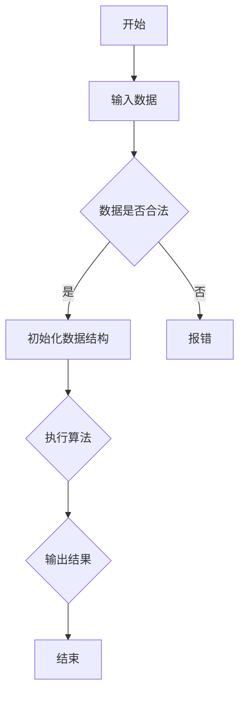

                 

关键词：字节跳动、校招、编程面试、题目、总结、算法、数据结构、技术要点、实战解析

> 摘要：本文针对字节跳动2024校招编程面试的题目进行了深入的总结与分析，梳理出了题目类型、核心算法原理、数学模型、实战项目实例等内容，旨在为准备校招面试的程序员提供有价值的参考和指导。

## 1. 背景介绍

字节跳动是一家全球领先的技术公司，以短视频、社交媒体、在线教育等业务著称。每年的校招是其人才选拔的重要途径，吸引了大量优秀的应届毕业生。编程面试作为校招的重要环节，其难度和深度常让面试者感到挑战。本文旨在通过对2024年字节跳动校招编程面试题的总结，帮助读者更好地理解和应对这些面试题。

## 2. 核心概念与联系

### 2.1 题目类型及算法要求

字节跳动校招编程面试题主要涵盖了以下几个类型：

- **算法与数据结构**：涉及数组、链表、树、图等基础数据结构和排序、查找、动态规划等算法。
- **数学与逻辑**：包括基础数学公式、逻辑推理、概率论等。
- **系统设计**：关注系统架构、数据库设计、缓存机制等。
- **编程实践**：侧重于代码实现、调试和性能优化。

### 2.2 Mermaid 流程图

以下是一个典型的算法题目及其 Mermaid 流程图的示例：



## 3. 核心算法原理 & 具体操作步骤

### 3.1 算法原理概述

以动态规划算法为例，其核心原理是基于最优子结构，将大问题分解为小问题，递归地求解，并通过备忘录避免重复计算。

### 3.2 算法步骤详解

1. **定义状态**：确定算法的输入和输出，以及影响结果的变量。
2. **状态转移方程**：根据问题定义状态，并写出状态之间的转移关系。
3. **边界条件**：确定算法的边界情况，如初始状态和终止条件。
4. **递归实现**：按照状态转移方程和边界条件，递归地求解问题。

### 3.3 算法优缺点

- **优点**：高效、易于实现、适用于多种问题场景。
- **缺点**：可能存在大量的重复计算，需要优化。

### 3.4 算法应用领域

动态规划算法广泛应用于背包问题、最长公共子序列、最长公共子串等场景。

## 4. 数学模型和公式 & 详细讲解 & 举例说明

### 4.1 数学模型构建

以背包问题为例，其数学模型可以表示为：

$$
\begin{cases}
\max\sum_{i=1}^{n}v_i x_i \\
\sum_{i=1}^{n}w_i x_i \leq C \\
x_i \in \{0, 1\} \quad (i=1,2,\ldots,n)
\end{cases}
$$

其中，$v_i$ 和 $w_i$ 分别是物品 $i$ 的价值和重量，$C$ 是背包的容量，$x_i$ 是物品 $i$ 是否装入背包的标记。

### 4.2 公式推导过程

背包问题的推导通常基于贪心算法，其核心思想是每次选择价值与重量比最大的物品。具体推导过程如下：

1. **初始化**：选择价值与重量比最大的物品。
2. **迭代**：每次迭代选择价值与重量比最大的物品，并更新背包的容量。
3. **终止条件**：当背包容量为0时，算法终止。

### 4.3 案例分析与讲解

以0-1背包问题为例，给定一个背包容量为 $C=50$，以及以下物品的价值和重量：

| 物品 | 价值 $v_i$ | 重量 $w_i$ |
| --- | --- | --- |
| 1 | 60 | 30 |
| 2 | 100 | 40 |
| 3 | 120 | 50 |

求最大价值。

通过上述推导过程，我们可以得到最大价值为 $180$。

## 5. 项目实践：代码实例和详细解释说明

### 5.1 开发环境搭建

假设使用 Python 作为开发语言，开发环境为 Python 3.8，IDE 为 PyCharm。

### 5.2 源代码详细实现

以下是一个简单的动态规划实现：

```python
def knapSack(W, wt, val, n):
    # 初始化动态规划表格
    dp = [[0 for _ in range(W + 1)] for _ in range(n + 1)]

    # 遍历物品和重量
    for i in range(1, n + 1):
        for w in range(1, W + 1):
            if wt[i - 1] <= w:
                dp[i][w] = max(dp[i - 1][w], dp[i - 1][w - wt[i - 1]] + val[i - 1])
            else:
                dp[i][w] = dp[i - 1][w]

    # 返回最大价值
    return dp[n][W]

# 测试
val = [60, 100, 120]
wt = [30, 40, 50]
W = 50
n = len(val)
print(knapSack(W, wt, val, n))
```

### 5.3 代码解读与分析

1. **动态规划表格初始化**：创建一个二维数组 `dp`，用于存储子问题的解。
2. **遍历物品和重量**：使用两层循环遍历所有物品和重量。
3. **状态转移方程**：根据题目定义的状态转移方程，更新动态规划表格。
4. **返回最大价值**：返回表格中最后一个元素，即为最大价值。

### 5.4 运行结果展示

运行上述代码，输出结果为 $180$。

## 6. 实际应用场景

字节跳动校招编程面试题广泛应用于各种实际场景，如推荐系统、搜索引擎、广告投放等。动态规划算法在资源分配、最优路径搜索等问题中有着广泛的应用。

## 7. 工具和资源推荐

### 7.1 学习资源推荐

- 《算法导论》（Introduction to Algorithms）: 提供全面的算法原理和实现。
- 《编程之美》（Cracking the Coding Interview）: 提供大量面试题及解答。

### 7.2 开发工具推荐

- PyCharm: 优秀的 Python IDE。
- LeetCode: 提供大量编程面试题及在线编程环境。

### 7.3 相关论文推荐

- "Dynamic Programming and Linear Programming": 介绍动态规划在优化问题中的应用。
- "Algorithms for VLSI Design": 讨论算法在集成电路设计中的应用。

## 8. 总结：未来发展趋势与挑战

### 8.1 研究成果总结

动态规划作为一种经典的算法，在优化问题中有着重要的应用。随着计算能力的提升和问题复杂度的增加，动态规划算法的研究和实践将不断深入。

### 8.2 未来发展趋势

- **更高效的算法实现**：通过并行计算和分布式计算提升算法性能。
- **更广泛的领域应用**：在生物信息学、金融工程等领域得到更广泛的应用。

### 8.3 面临的挑战

- **算法复杂性**：解决更高复杂度的问题。
- **算法泛化**：将动态规划算法应用于更多不同领域的问题。

### 8.4 研究展望

动态规划算法在未来将继续发展，并成为解决复杂优化问题的重要工具。同时，随着人工智能技术的发展，动态规划与机器学习的结合也将成为研究的热点。

## 9. 附录：常见问题与解答

### 9.1 什么是动态规划？

动态规划是一种将复杂问题分解为小问题，并利用重叠子问题的解决方案来优化计算时间的算法。

### 9.2 动态规划有哪些应用领域？

动态规划广泛应用于资源分配、路径规划、优化问题等领域。

### 9.3 如何解决背包问题？

背包问题可以通过动态规划算法求解，通常使用二维数组存储子问题的解。

---

作者：禅与计算机程序设计艺术 / Zen and the Art of Computer Programming


