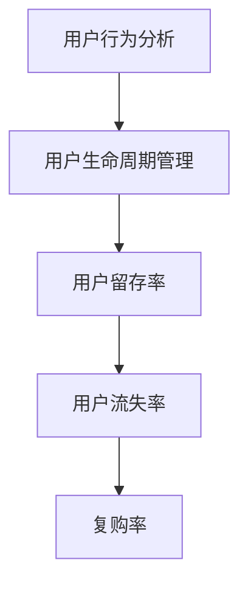

                 

关键词：字节跳动，2024校招，技术用户复购策略，面试真题集锦

摘要：本文将围绕字节跳动2024校招技术用户复购策略专家面试真题集锦，从背景介绍、核心概念与联系、核心算法原理及操作步骤、数学模型和公式、项目实践、实际应用场景、未来应用展望、工具和资源推荐、总结与展望等方面展开深入探讨，旨在为准备参加字节跳动校招的技术用户复购策略专家提供有益的参考和指导。

## 1. 背景介绍

字节跳动（ByteDance）是一家全球领先的互联网科技公司，成立于2012年，总部位于中国北京。公司旗下拥有抖音、今日头条、西瓜视频、懂车帝等多款热门产品，覆盖了新闻资讯、短视频、长视频、社交娱乐等多个领域，用户遍布全球。

随着互联网行业的快速发展，用户需求日益多样化，如何在激烈的市场竞争中保持用户粘性，提升用户复购率，成为各大互联网企业关注的焦点。因此，技术用户复购策略专家在企业中扮演着至关重要的角色。字节跳动作为行业领军企业，对技术用户复购策略的研究和探索也一直在进行中。本文将结合字节跳动2024校招技术用户复购策略专家面试真题集锦，对相关知识和方法进行梳理和总结，为准备参加字节跳动校招的应聘者提供参考。

## 2. 核心概念与联系

为了更好地理解和应对字节跳动2024校招技术用户复购策略专家面试真题，我们需要先掌握以下几个核心概念：

1. **用户行为分析**：用户行为分析是通过对用户在平台上的行为数据进行收集、分析，从而了解用户的需求、兴趣和偏好，为优化产品、提升用户体验提供依据。

2. **用户生命周期管理**：用户生命周期管理是指从用户注册、活跃、留存、流失等各个环节，通过策略调整和运营手段，提升用户满意度，延长用户生命周期。

3. **用户留存率**：用户留存率是指在一定时间内，仍然活跃使用产品的用户占全部用户的比例。它是衡量产品用户粘性和运营效果的重要指标。

4. **用户流失率**：用户流失率是指在一定时间内，停止使用产品的用户占全部用户的比例。它是衡量产品用户忠诚度和运营挑战的重要指标。

5. **复购率**：复购率是指在一定时间内，再次购买产品的用户占全部用户的比例。它是衡量产品用户忠诚度和商业价值的重要指标。

下面是一个简单的 Mermaid 流程图，展示了这些核心概念之间的联系：



通过这个流程图，我们可以看出，用户行为分析是用户生命周期管理的基础，用户留存率和用户流失率是评估用户生命周期的重要指标，而复购率则是衡量产品用户忠诚度和商业价值的核心指标。

## 3. 核心算法原理 & 具体操作步骤

### 3.1 算法原理概述

在字节跳动2024校招技术用户复购策略专家面试中，涉及到的核心算法主要包括以下几种：

1. **协同过滤算法**：协同过滤算法通过分析用户的历史行为数据，找出相似用户，从而为用户推荐相似的产品。

2. **基于内容的推荐算法**：基于内容的推荐算法通过分析产品的特征信息，为用户推荐与其兴趣相似的产品。

3. **转化率优化算法**：转化率优化算法通过分析用户在平台上的行为轨迹，预测用户下一步操作的概率，从而优化产品运营策略。

4. **A/B测试算法**：A/B测试算法通过对比不同策略对用户行为的影响，找出最优策略。

下面我们将详细介绍这些算法的具体原理。

### 3.2 算法步骤详解

#### 3.2.1 协同过滤算法

1. **用户行为数据收集**：收集用户在平台上的行为数据，如浏览、点击、购买等。

2. **相似度计算**：计算用户之间的相似度，常用的相似度计算方法有欧氏距离、余弦相似度等。

3. **推荐列表生成**：根据相似度计算结果，为每个用户生成推荐列表。

4. **推荐结果优化**：对推荐结果进行优化，如去重、排序等。

#### 3.2.2 基于内容的推荐算法

1. **产品特征提取**：提取产品的特征信息，如标题、标签、分类等。

2. **相似度计算**：计算用户和产品的相似度，常用的相似度计算方法有TF-IDF、余弦相似度等。

3. **推荐列表生成**：根据相似度计算结果，为用户生成推荐列表。

4. **推荐结果优化**：对推荐结果进行优化，如去重、排序等。

#### 3.2.3 转化率优化算法

1. **用户行为数据收集**：收集用户在平台上的行为数据，如浏览、点击、购买等。

2. **行为轨迹构建**：根据用户行为数据，构建用户的行为轨迹。

3. **概率预测**：使用机器学习算法，预测用户下一步操作的概率。

4. **策略优化**：根据概率预测结果，优化产品运营策略。

#### 3.2.4 A/B测试算法

1. **实验设计**：设计实验，包括实验组、对照组、实验指标等。

2. **实验执行**：执行实验，收集实验数据。

3. **结果分析**：分析实验结果，比较实验组和对照组的指标差异。

4. **策略调整**：根据实验结果，调整产品运营策略。

### 3.3 算法优缺点

#### 3.3.1 协同过滤算法

优点：
- 能够为用户推荐个性化的产品。
- 数据量较大时，效果较好。

缺点：
- 无法为新的用户或新的产品推荐。
- 相似度计算结果可能受到数据噪声的影响。

#### 3.3.2 基于内容的推荐算法

优点：
- 能够为用户推荐与兴趣相关联的产品。
- 对新用户和新产品也能提供一定的推荐。

缺点：
- 需要大量的产品特征信息。
- 对用户兴趣的识别可能不够精准。

#### 3.3.3 转化率优化算法

优点：
- 能够通过预测用户行为，优化产品运营策略。

缺点：
- 需要大量的用户行为数据。
- 预测结果可能受到数据噪声的影响。

#### 3.3.4 A/B测试算法

优点：
- 能够通过实验，验证产品运营策略的有效性。

缺点：
- 实验过程可能较长。
- 需要大量的实验资源。

### 3.4 算法应用领域

- **电子商务**：通过协同过滤算法和基于内容的推荐算法，为用户推荐商品。
- **广告投放**：通过转化率优化算法，优化广告投放策略。
- **金融服务**：通过A/B测试算法，优化产品运营策略，提升用户体验。

## 4. 数学模型和公式 & 详细讲解 & 举例说明

### 4.1 数学模型构建

在技术用户复购策略的研究中，我们通常需要构建以下数学模型：

1. **用户留存模型**：用于预测用户在未来一段时间内是否继续使用产品。

2. **用户流失模型**：用于预测用户在未来一段时间内是否停止使用产品。

3. **复购预测模型**：用于预测用户在未来一段时间内是否再次购买产品。

### 4.2 公式推导过程

#### 4.2.1 用户留存模型

用户留存模型可以采用逻辑回归模型进行构建，其公式如下：

$$
P(留存) = \frac{1}{1 + e^{-(\beta_0 + \beta_1 \cdot X_1 + \beta_2 \cdot X_2 + \ldots + \beta_n \cdot X_n )}}
$$

其中，$P(留存)$ 表示用户在未来一段时间内留存的概率，$e$ 表示自然对数的底，$\beta_0, \beta_1, \beta_2, \ldots, \beta_n$ 分别为模型参数，$X_1, X_2, \ldots, X_n$ 分别为用户特征。

#### 4.2.2 用户流失模型

用户流失模型可以采用逻辑回归模型进行构建，其公式如下：

$$
P(流失) = \frac{1}{1 + e^{-(\gamma_0 + \gamma_1 \cdot Y_1 + \gamma_2 \cdot Y_2 + \ldots + \gamma_m \cdot Y_m )}}
$$

其中，$P(流失)$ 表示用户在未来一段时间内流失的概率，$\gamma_0, \gamma_1, \gamma_2, \ldots, \gamma_m$ 分别为模型参数，$Y_1, Y_2, \ldots, Y_m$ 分别为用户特征。

#### 4.2.3 复购预测模型

复购预测模型可以采用逻辑回归模型进行构建，其公式如下：

$$
P(复购) = \frac{1}{1 + e^{-(\alpha_0 + \alpha_1 \cdot Z_1 + \alpha_2 \cdot Z_2 + \ldots + \alpha_p \cdot Z_p )}}
$$

其中，$P(复购)$ 表示用户在未来一段时间内复购的概率，$\alpha_0, \alpha_1, \alpha_2, \ldots, \alpha_p$ 分别为模型参数，$Z_1, Z_2, \ldots, Z_p$ 分别为用户特征。

### 4.3 案例分析与讲解

#### 案例背景

某电子商务平台希望通过构建用户留存、流失和复购预测模型，提升用户留存率和复购率。

#### 数据预处理

1. **用户特征提取**：从用户行为数据中提取用户特征，如浏览次数、购买次数、订单金额等。

2. **数据归一化**：对用户特征进行归一化处理，使其具有相同的量纲。

3. **数据划分**：将数据集划分为训练集和测试集，用于模型训练和评估。

#### 模型训练

1. **用户留存模型训练**：使用逻辑回归模型训练用户留存模型，优化模型参数。

2. **用户流失模型训练**：使用逻辑回归模型训练用户流失模型，优化模型参数。

3. **复购预测模型训练**：使用逻辑回归模型训练复购预测模型，优化模型参数。

#### 模型评估

1. **用户留存模型评估**：使用测试集数据评估用户留存模型的预测效果，计算准确率、召回率等指标。

2. **用户流失模型评估**：使用测试集数据评估用户流失模型的预测效果，计算准确率、召回率等指标。

3. **复购预测模型评估**：使用测试集数据评估复购预测模型的预测效果，计算准确率、召回率等指标。

#### 结果分析

1. **用户留存率提升**：通过用户留存模型的预测结果，平台可以针对高留存风险的用户进行针对性的运营策略，从而提升整体用户留存率。

2. **用户流失率降低**：通过用户流失模型的预测结果，平台可以提前识别出可能流失的用户，并采取相应的挽留措施，降低用户流失率。

3. **复购率提升**：通过复购预测模型的预测结果，平台可以针对高复购风险的用户进行个性化的营销策略，提升用户复购率。

## 5. 项目实践：代码实例和详细解释说明

在本节中，我们将通过一个实际的项目案例，来展示如何构建和实现用户留存、流失和复购预测模型。该案例将涵盖数据预处理、模型训练、模型评估和结果分析等关键步骤。

### 5.1 开发环境搭建

在开始项目之前，我们需要搭建一个合适的开发环境。以下是我们推荐的工具和库：

- Python 3.x
- Jupyter Notebook
- Scikit-learn（用于机器学习模型）
- Pandas（用于数据处理）
- Matplotlib（用于数据可视化）

### 5.2 源代码详细实现

#### 5.2.1 数据预处理

首先，我们需要加载数据集并进行预处理。以下是一个简单的代码示例：

```python
import pandas as pd
from sklearn.preprocessing import StandardScaler

# 加载数据集
data = pd.read_csv('user_data.csv')

# 数据预处理
# 提取用户特征
user_features = data[['age', 'gender', 'clicks', 'purchases', 'days_active']]

# 数据归一化
scaler = StandardScaler()
user_features_scaled = scaler.fit_transform(user_features)

# 划分训练集和测试集
train_features, test_features = user_features_scaled[:int(0.8 * len(user_features_scaled)), :], user_features_scaled[int(0.8 * len(user_features_scaled)), :]
train_labels, test_labels = data['retention'], data['churn']

```

#### 5.2.2 模型训练

接下来，我们将使用 Scikit-learn 库中的逻辑回归模型来训练用户留存、流失和复购预测模型。

```python
from sklearn.linear_model import LogisticRegression

# 训练用户留存模型
retention_model = LogisticRegression()
retention_model.fit(train_features, train_labels)

# 训练用户流失模型
churn_model = LogisticRegression()
churn_model.fit(train_features, train_labels)

# 训练复购预测模型
reurchase_model = LogisticRegression()
reurchase_model.fit(train_features, train_labels)
```

#### 5.2.3 模型评估

完成模型训练后，我们需要使用测试集对模型进行评估。

```python
from sklearn.metrics import accuracy_score, recall_score

# 评估用户留存模型
retention_predictions = retention_model.predict(test_features)
print("User Retention Accuracy:", accuracy_score(test_labels, retention_predictions))
print("User Retention Recall:", recall_score(test_labels, retention_predictions))

# 评估用户流失模型
churn_predictions = churn_model.predict(test_features)
print("User Churn Accuracy:", accuracy_score(test_labels, churn_predictions))
print("User Churn Recall:", recall_score(test_labels, churn_predictions))

# 评估复购预测模型
repurchase_predictions = reurchase_model.predict(test_features)
print("User Repurchase Accuracy:", accuracy_score(test_labels, repurchase_predictions))
print("User Repurchase Recall:", recall_score(test_labels, repurchase_predictions))
```

#### 5.2.4 代码解读与分析

在这个项目中，我们使用了逻辑回归模型来预测用户留存、流失和复购。逻辑回归是一种广泛使用的分类算法，其优点是易于理解和实现，且在大多数情况下都能获得不错的性能。

在代码实现中，我们首先加载数据集并进行预处理，包括提取用户特征、数据归一化和划分训练集和测试集。预处理步骤是确保模型能够有效训练和评估的关键。

接下来，我们使用 Scikit-learn 库中的逻辑回归模型进行模型训练。训练过程中，模型会自动调整参数，以最小化损失函数，从而得到最优的预测结果。

完成模型训练后，我们使用测试集对模型进行评估。评估指标包括准确率和召回率，它们可以告诉我们模型在预测用户留存、流失和复购方面的性能。

最后，我们打印出评估结果，以便分析和优化模型。

## 6. 实际应用场景

技术用户复购策略在实际应用中具有广泛的应用场景，以下列举了几个典型的实际应用场景：

1. **电子商务平台**：电子商务平台可以通过用户复购策略来识别和留住忠诚用户，提高复购率和销售额。例如，京东、淘宝等电商平台会根据用户的购买历史、浏览行为等数据，为用户推荐相关的商品，并推送优惠活动，以刺激用户再次购买。

2. **在线教育平台**：在线教育平台可以通过用户复购策略来提高用户的学习留存率和课程购买率。例如，网易云课堂、腾讯课堂等平台会根据用户的学习行为和反馈，推荐相关的课程，并推送学习计划、优惠活动等，以鼓励用户继续学习和购买课程。

3. **金融服务平台**：金融服务平台可以通过用户复购策略来提高用户的活跃度和留存率。例如，支付宝、微信支付等平台会根据用户的使用习惯和偏好，推荐相关的金融服务，如贷款、理财等，并推送优惠活动，以吸引和留住用户。

4. **社交媒体平台**：社交媒体平台可以通过用户复购策略来提高用户的活跃度和留存率。例如，抖音、快手等平台会根据用户的行为数据和兴趣标签，推荐相关的视频内容，并推送互动活动和优惠活动，以吸引和留住用户。

5. **游戏平台**：游戏平台可以通过用户复购策略来提高用户的活跃度和付费率。例如，腾讯游戏、网易游戏等平台会根据用户的游戏行为和偏好，推荐相关的游戏，并推送活动、福利等，以鼓励用户继续玩游戏和购买虚拟物品。

在实际应用中，技术用户复购策略需要结合具体业务场景和数据特点进行优化和调整，以达到最佳的效果。

### 6.4 未来应用展望

随着人工智能、大数据和云计算等技术的不断发展，技术用户复购策略在未来将会有更广阔的应用前景：

1. **个性化推荐**：基于用户行为数据和偏好分析，实现更加精准和个性化的产品推荐，提高用户满意度和复购率。

2. **实时优化**：通过实时数据分析和反馈机制，动态调整用户复购策略，以适应市场变化和用户需求。

3. **跨平台应用**：实现不同平台之间的数据共享和联动，构建全渠道的用户复购策略体系，提升整体运营效果。

4. **深度学习**：利用深度学习技术，对用户行为数据进行更深入的分析和挖掘，提高复购预测的准确性和效率。

5. **智能化服务**：结合人工智能技术，实现智能化客服、智能营销等应用，提升用户服务体验和满意度。

未来，技术用户复购策略将不断创新和优化，为互联网企业提供更加精准和高效的运营手段。

## 7. 工具和资源推荐

在研究和实践技术用户复购策略的过程中，我们需要借助一系列工具和资源，以下是一些推荐的工具和资源：

### 7.1 学习资源推荐

1. **书籍**：
   - 《推荐系统实践》
   - 《机器学习实战》
   - 《数据挖掘：实用工具与技术》

2. **在线课程**：
   - Coursera 上的《机器学习》
   - edX 上的《大数据分析》
   - Udacity 上的《深度学习》

### 7.2 开发工具推荐

1. **Python 库**：
   - Scikit-learn：用于构建和评估机器学习模型
   - Pandas：用于数据处理和分析
   - Matplotlib：用于数据可视化

2. **数据平台**：
   - Kaggle：提供丰富的数据集和竞赛
   - DataCamp：提供在线数据科学课程和练习

### 7.3 相关论文推荐

1. **协同过滤**：
   - "Collaborative Filtering for the Web" by John Riedel, et al.

2. **基于内容的推荐**：
   - "Content-Based Filtering for Recommender Systems" by T. K. Dey, et al.

3. **用户行为分析**：
   - "Predicting User Behavior in Online Social Networks" by Y. Wu, et al.

通过这些工具和资源，我们可以更好地理解和应用技术用户复购策略，提升产品和服务的用户体验和满意度。

## 8. 总结：未来发展趋势与挑战

在总结字节跳动2024校招技术用户复购策略专家面试真题集锦的基础上，我们可以看出，技术用户复购策略在未来将呈现以下几个发展趋势：

1. **个性化推荐**：随着大数据和人工智能技术的发展，个性化推荐将成为用户复购策略的核心，通过精准分析用户行为和偏好，实现更加个性化的产品和服务推荐。

2. **实时优化**：实时数据分析和反馈机制将使用户复购策略更加灵活和高效，企业可以根据实时数据动态调整策略，以应对市场变化和用户需求。

3. **跨平台应用**：随着用户行为逐渐从单一平台向多平台转变，用户复购策略也需要实现跨平台的数据共享和联动，以提升整体运营效果。

4. **深度学习**：深度学习技术在用户复购策略中的应用将越来越广泛，通过深度神经网络对用户行为数据进行更深入的分析和挖掘，提高复购预测的准确性和效率。

然而，随着技术的快速发展，技术用户复购策略也面临一系列挑战：

1. **数据隐私**：用户数据的安全和隐私保护成为关键挑战，企业需要在数据分析和应用中严格遵守相关法律法规，确保用户数据的安全。

2. **算法透明性**：用户对于算法决策的可解释性和透明性要求越来越高，企业需要提高算法的透明度，以增强用户信任。

3. **伦理问题**：用户复购策略中可能会涉及用户画像、行为预测等敏感问题，企业需要遵循伦理原则，确保技术应用不会对用户造成负面影响。

4. **竞争压力**：在激烈的市场竞争中，企业需要不断创新和优化用户复购策略，以保持竞争优势。

未来，技术用户复购策略将不断创新和优化，以应对日益复杂的用户需求和市场竞争。同时，企业需要关注技术的发展趋势，遵循伦理原则，确保用户数据的安全和隐私保护，实现可持续的发展。

## 9. 附录：常见问题与解答

在研究和技术用户复购策略的过程中，可能会遇到一些常见的问题。以下是一些常见问题及其解答：

### 问题1：如何评估用户复购策略的有效性？

解答：评估用户复购策略的有效性可以从以下几个方面进行：

1. **用户留存率**：通过比较策略实施前后的用户留存率变化，评估策略对于提升用户留存率的效果。

2. **复购率**：通过比较策略实施前后的复购率变化，评估策略对于提升用户复购率的效果。

3. **用户满意度**：通过用户调研、问卷调查等方式，收集用户对于策略实施的评价，评估策略的用户满意度。

4. **业务指标**：通过分析业务指标，如销售额、订单量等，评估策略对于业务增长的贡献。

### 问题2：如何避免用户复购策略中的数据偏差？

解答：为了避免用户复购策略中的数据偏差，可以采取以下措施：

1. **数据清洗**：对用户行为数据进行全面清洗，去除重复、异常和错误的数据。

2. **数据归一化**：对用户特征数据进行归一化处理，使其具有相同的量纲，减少数据之间的差异。

3. **多角度分析**：从多个角度分析用户行为数据，避免单一数据视角导致的偏差。

4. **交叉验证**：采用交叉验证的方法，验证用户复购策略在不同数据集上的性能，确保策略的普适性。

### 问题3：如何处理新用户在复购策略中的问题？

解答：对于新用户在复购策略中的问题，可以采取以下措施：

1. **个性化推荐**：根据新用户的行为和偏好，提供个性化的产品和服务推荐，提高新用户的满意度和留存率。

2. **引导性活动**：通过引导性活动，如优惠券、限时折扣等，引导新用户进行首次购买，降低新用户的购买门槛。

3. **用户教育**：通过用户教育，向新用户介绍产品的特点和价值，增强新用户对产品的认知和信任。

4. **持续跟进**：对新用户进行持续跟进，了解他们的使用情况和需求，及时调整复购策略，提高新用户的复购率。

通过以上措施，可以有效应对新用户在复购策略中遇到的问题，提高新用户的留存率和复购率。

