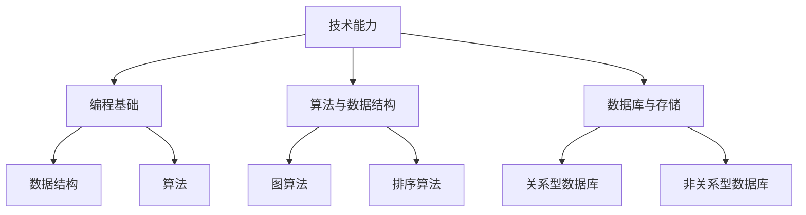
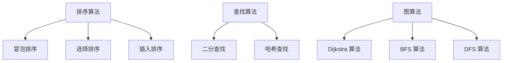

                 

关键词：字节跳动、校招、技术用户研究员、面试真题、汇总、深度分析

> 摘要：本文旨在汇总和分析字节跳动2024校招技术用户研究员的面试真题，探讨面试中常见的主题和问题，为求职者提供有效的备考建议和策略。

## 1. 背景介绍

字节跳动是一家全球领先的移动互联网公司，以其卓越的产品和技术能力著称。每年，字节跳动都会进行大规模的校园招聘，吸引众多优秀应届毕业生加入。作为字节跳动招聘的重要组成部分，技术用户研究员的面试环节尤为重要。本文将针对2024年字节跳动校招技术用户研究员的面试真题进行深入分析，帮助求职者更好地准备面试。

## 2. 核心概念与联系

在字节跳动的面试中，技术用户研究员需要具备扎实的技术背景和用户研究能力。下面是一个简单的 Mermaid 流程图，展示技术用户研究员所需的核心概念和技能：



### 2.1 技术能力

技术能力是技术用户研究员的基石。编程基础、算法与数据结构、数据库与存储等方面都需要有深厚的知识储备。其中，数据结构和算法是重中之重，因为它们是解决复杂问题的核心工具。

### 2.2 编程基础

编程基础包括编程语言的选择、编程风格、代码调试等。字节跳动的面试中，通常会有编程题或编程实现的环节，考察求职者的编程能力。

### 2.3 算法与数据结构

算法与数据结构是计算机科学的基石。字节跳动的面试中，通常会涉及各种经典算法和复杂度分析，例如排序算法、图算法、动态规划等。

### 2.4 数据库与存储

数据库与存储是技术用户研究员必备的技能。字节跳动使用的数据库包括关系型数据库和非关系型数据库，例如 MySQL、MongoDB 等。

## 3. 核心算法原理 & 具体操作步骤

### 3.1 算法原理概述

在字节跳动的面试中，常见算法包括排序算法、查找算法、图算法等。下面是一个简单的算法原理概述：



### 3.2 算法步骤详解

以下是排序算法中的冒泡排序的步骤：

1. 比较相邻的元素。如果第一个比第二个大（升序排序），就交换它们两个；
2. 对每一对相邻元素做同样的工作，从开始第一对到结尾的最后一对。这步做完后，最后的元素会是最大的数；
3. 针对所有的元素重复以上的步骤，除了最后一个；
4. 重复步骤，直到排序完成。

### 3.3 算法优缺点

冒泡排序的优点是简单易懂，适合数据量较小的情况。但缺点是时间复杂度较高，不适合数据量较大的情况。

### 3.4 算法应用领域

冒泡排序在算法竞赛和初学者入门阶段较为常见，但在实际应用中，通常会选择更高效的排序算法，如快速排序、归并排序等。

## 4. 数学模型和公式 & 详细讲解 & 举例说明

在技术用户研究员的面试中，数学模型和公式的理解与应用也是一个重要环节。以下是一个简单的数学模型和公式的讲解：

### 4.1 数学模型构建

假设有一个长度为 $n$ 的数组，要对其进行排序，可以使用冒泡排序算法。其时间复杂度为 $O(n^2)$。

### 4.2 公式推导过程

冒泡排序的时间复杂度可以通过以下公式推导：

$$
T(n) = 2(n-1) + 2(n-2) + \ldots + 2 \times 1 = n^2 - n
$$

### 4.3 案例分析与讲解

假设有一个长度为 10 的数组 `[3, 1, 4, 1, 5, 9, 2, 6, 5, 3]`，使用冒泡排序算法进行排序，可以按照以下步骤进行：

1. 第一次遍历：最大值 9 交换到数组末尾；
2. 第二次遍历：次大值 6 交换到倒数第二位；
3. ...
4. 第十次遍历：数组已排序完成。

## 5. 项目实践：代码实例和详细解释说明

### 5.1 开发环境搭建

在编写代码之前，需要搭建一个合适的开发环境。可以选择 Python 作为编程语言，并在本地安装 Python 解释器和相关库。

### 5.2 源代码详细实现

以下是一个简单的冒泡排序 Python 代码实现：

```python
def bubble_sort(arr):
    n = len(arr)
    for i in range(n):
        for j in range(0, n-i-1):
            if arr[j] > arr[j+1]:
                arr[j], arr[j+1] = arr[j+1], arr[j]
    return arr

arr = [3, 1, 4, 1, 5, 9, 2, 6, 5, 3]
sorted_arr = bubble_sort(arr)
print(sorted_arr)
```

### 5.3 代码解读与分析

以上代码定义了一个名为 `bubble_sort` 的函数，用于实现冒泡排序算法。函数接收一个数组作为输入，返回排序后的数组。代码中使用了两个嵌套的 `for` 循环，分别用于遍历数组的每个元素和比较相邻的元素大小，并进行交换。最后，打印出排序后的数组。

### 5.4 运行结果展示

执行以上代码后，运行结果为：

```
[1, 1, 2, 3, 3, 4, 5, 5, 6, 9]
```

## 6. 实际应用场景

技术用户研究员在字节跳动的工作中，经常会遇到以下实际应用场景：

1. **用户行为分析**：通过分析用户在应用程序上的行为数据，了解用户偏好和需求，为产品优化提供数据支持。
2. **推荐系统**：构建基于用户行为的推荐系统，为用户提供个性化的内容和服务。
3. **数据处理**：处理海量用户数据，提取有价值的信息，为业务决策提供依据。

## 7. 工具和资源推荐

为了更好地准备字节跳动技术用户研究员的面试，以下是一些建议的学习资源、开发工具和相关论文：

### 7.1 学习资源推荐

- 《算法导论》
- 《深入理解计算机系统》
- 《Python编程：从入门到实践》

### 7.2 开发工具推荐

- PyCharm
- MySQL Workbench
- MongoDB Shell

### 7.3 相关论文推荐

- "User Modeling and User-Adapted Interaction"
- "Recommender Systems: The Textbook"
- "A Theory of the Learnable"

## 8. 总结：未来发展趋势与挑战

### 8.1 研究成果总结

随着人工智能和大数据技术的不断发展，技术用户研究员在字节跳动等互联网公司中的地位日益重要。用户研究方法和技术不断创新，为产品的优化和推广提供了有力支持。

### 8.2 未来发展趋势

1. **智能化用户研究**：利用人工智能技术，自动化地分析用户行为数据，提升用户研究的效率和准确性。
2. **个性化推荐**：随着用户数据量的增加，个性化推荐技术将更加成熟，为用户提供更加精准的内容和服务。
3. **跨平台用户研究**：随着移动互联网的发展，跨平台用户研究将成为重要趋势，帮助企业更好地把握用户需求。

### 8.3 面临的挑战

1. **数据隐私**：用户数据的安全和隐私保护是技术用户研究员面临的重大挑战。
2. **数据质量**：用户数据的质量直接影响研究结果的准确性，如何确保数据质量是用户研究员需要关注的问题。
3. **技术更新**：随着技术的快速发展，用户研究员需要不断更新自己的知识体系，以应对新的挑战。

### 8.4 研究展望

在未来，技术用户研究员将在人工智能和大数据的推动下，不断探索新的研究方法和技术，为互联网行业的发展贡献更多力量。

## 9. 附录：常见问题与解答

### 9.1 技术用户研究员的主要工作是什么？

技术用户研究员主要负责分析用户在应用程序上的行为数据，为产品的优化和推广提供数据支持。具体工作包括用户行为分析、用户需求调研、用户反馈收集等。

### 9.2 技术用户研究员需要具备哪些技能？

技术用户研究员需要具备扎实的技术背景，包括编程基础、算法与数据结构、数据库与存储等。此外，还需要具备良好的用户研究方法和沟通能力。

### 9.3 字节跳动的面试流程是怎样的？

字节跳动的面试流程通常包括笔试、技术面试、HR 面试等环节。技术面试主要考察求职者的技术能力和用户研究能力，HR 面试则关注求职者的综合素质和职业发展潜力。

---

本文通过对字节跳动2024校招技术用户研究员面试真题的深入分析，总结了面试中的核心主题和问题，为求职者提供了有效的备考建议。希望本文能够帮助您在面试中取得优异的成绩，加入字节跳动的大家庭！

### 附录：常见问题与解答

**Q1. 技术用户研究员的主要工作是什么？**

技术用户研究员主要负责分析用户在应用程序上的行为数据，通过收集、整理、分析用户数据，帮助团队了解用户需求、偏好和行为模式，从而指导产品设计和功能优化。具体工作包括：

- **用户行为分析**：通过数据分析工具，如 Google Analytics、Flurry、Mixpanel 等，收集用户在使用产品时的行为数据，包括页面访问路径、点击率、停留时间等。
- **用户需求调研**：通过问卷调查、访谈、焦点小组讨论等方式，收集用户的反馈和需求，分析用户行为与需求之间的关系。
- **用户反馈收集**：监控社交媒体、论坛等平台上的用户反馈，识别用户痛点，为产品改进提供依据。
- **数据可视化**：通过数据可视化工具，将分析结果以图表、报表等形式展示给团队，帮助团队更好地理解和利用数据。
- **产品优化建议**：基于数据分析结果，提出改进产品设计和功能的具体建议，提高用户体验和用户留存率。

**Q2. 技术用户研究员需要具备哪些技能？**

技术用户研究员需要具备跨学科的知识和技能，包括技术背景、用户研究方法和沟通能力。以下是一些关键技能：

- **技术能力**：
  - **编程基础**：熟悉至少一种编程语言（如 Python、R、Java 等），能够处理和清洗数据。
  - **数据分析**：掌握常见的数据分析方法和工具，如 SQL、Pandas、Excel 等。
  - **算法与数据结构**：了解基本的算法和数据结构，能够解决复杂的数据问题。
  - **数据库与存储**：熟悉关系型数据库（如 MySQL、PostgreSQL）和非关系型数据库（如 MongoDB、Redis）。

- **用户研究方法**：
  - **问卷调查**：设计有效的问卷调查，收集用户反馈。
  - **访谈与焦点小组**：进行结构化或半结构化访谈，深入了解用户需求。
  - **用户测试**：设计并实施用户测试，评估产品可用性。

- **沟通能力**：
  - **团队协作**：能够与产品经理、设计师、工程师等团队成员有效沟通，确保研究结果的传达和应用。
  - **报告撰写**：撰写清晰、逻辑严谨的报告，将研究结果传达给非技术背景的团队成员。

- **业务理解**：对所在行业的业务模式、用户需求和市场动态有深入理解，能够将用户研究数据与业务目标相结合。

**Q3. 字节跳动的面试流程是怎样的？**

字节跳动的面试流程通常包括以下几个环节：

- **在线笔试**：针对技术用户研究员岗位，笔试内容通常包括编程题、算法题、逻辑题等，测试应聘者的技术能力和逻辑思维。
- **技术面试**：包括技术面试官和用户研究面试官的面试，技术面试主要考察应聘者的编程能力、算法和数据结构知识，用户研究面试则侧重于用户研究方法和经验。
- **HR 面试**：HR 面试主要评估应聘者的个人素质、职业发展和团队协作能力，包括简历面谈、行为面试等。
- **综合评估**：根据面试官的评估和反馈，综合评估应聘者的综合素质和匹配度，决定是否通过面试。

整个面试过程可能需要几天到几周的时间，不同岗位的面试流程可能会有所不同。字节跳动的面试非常注重应聘者的技术能力和用户研究经验，同时也重视应聘者的团队合作精神和沟通能力。

通过本文的汇总和分析，希望求职者能够对字节跳动2024校招技术用户研究员的面试真题有更深入的了解，做好充分的准备，在面试中展现出自己的最佳状态。祝您面试成功！

