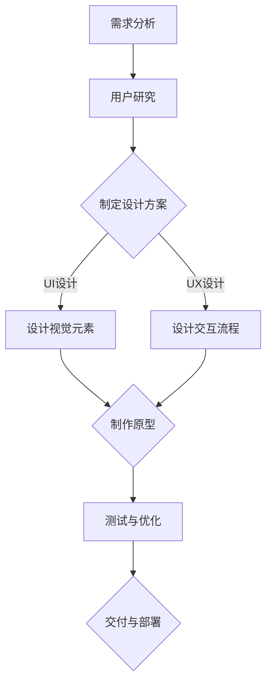

                 

关键词：字节跳动、UI/UX设计师、面试真题、作品分析、用户体验、设计原则

> 摘要：本文针对2024年字节跳动UI/UX设计师面试真题进行了汇总和详细分析，旨在帮助读者更好地准备UI/UX设计师的面试，并提供实用的作品分析方法，以提升设计质量和用户体验。

## 1. 背景介绍

字节跳动是一家全球领先的互联网科技公司，旗下拥有今日头条、抖音、 TikTok 等多款知名应用。作为一家以用户体验为核心竞争力的企业，字节跳动对UI/UX设计师的招聘和培养十分重视。近年来，UI/UX设计师的面试题目逐渐成为业界关注的焦点。本文将对2024年字节跳动UI/UX设计师面试真题进行汇总，并结合实际作品进行分析，以帮助设计师们更好地应对面试挑战。

## 2. 核心概念与联系

在UI/UX设计领域，核心概念包括用户体验（UX）、用户界面（UI）以及交互设计（IX）。这些概念之间密切相关，共同决定了产品的设计质量和用户体验。

### 2.1 用户体验（UX）

用户体验是指用户在使用产品过程中所获得的感受、情感和印象。一个优秀的用户体验应具备以下特点：

- **易用性**：产品应易于学习和使用，降低用户的学习成本。
- **可用性**：产品应满足用户的需求，提供有效的解决方案。
- **吸引力**：产品应具有足够的吸引力，激发用户的兴趣和好奇心。
- **易访问性**：产品应确保所有用户，包括残障人士，都能方便地使用。

### 2.2 用户界面（UI）

用户界面是指用户与产品交互的界面，包括视觉元素、交互元素和布局等。一个优秀的用户界面应具备以下特点：

- **美观性**：界面设计应简洁、美观，符合审美标准。
- **一致性**：界面设计应保持一致性，提高用户的操作效率。
- **响应性**：界面设计应适应不同设备和屏幕尺寸，提供良好的交互体验。
- **可访问性**：界面设计应确保所有用户，包括残障人士，都能方便地使用。

### 2.3 交互设计（IX）

交互设计是指设计用户与产品之间的交互流程和操作方式。一个优秀的交互设计应具备以下特点：

- **直观性**：交互设计应直观易懂，降低用户的认知负荷。
- **流畅性**：交互设计应流畅自然，提高用户的操作体验。
- **可预测性**：交互设计应具备一定的可预测性，降低用户出错的可能性。
- **反馈性**：交互设计应提供及时、准确的反馈，增强用户的信心。

### 2.4 Mermaid 流程图

以下是一个简化的UI/UX设计流程的Mermaid流程图：



## 3. 核心算法原理 & 具体操作步骤

### 3.1 算法原理概述

在UI/UX设计领域，核心算法主要包括用户研究方法、交互设计方法和用户体验评估方法。以下分别对这些算法进行概述。

#### 3.1.1 用户研究方法

用户研究方法主要目的是了解用户需求、行为和偏好，以便为产品设计提供依据。常用的用户研究方法包括：

- **问卷调查**：通过收集用户填写问卷的数据，了解用户需求和偏好。
- **访谈**：通过与用户进行面对面交流，深入了解用户的使用习惯和痛点。
- **观察**：在用户使用产品的过程中进行观察，获取真实的使用场景和体验。
- **可用性测试**：邀请用户参与产品的测试，评估产品的易用性和用户体验。

#### 3.1.2 交互设计方法

交互设计方法主要目的是设计用户与产品之间的交互流程和操作方式。常用的交互设计方法包括：

- **思维导图**：通过绘制思维导图，梳理用户的需求和交互流程。
- **线框图**：通过绘制线框图，初步规划产品的布局和功能模块。
- **原型设计**：通过绘制原型图，模拟产品的交互效果和用户体验。
- **迭代优化**：根据用户反馈和测试结果，不断优化产品的交互设计。

#### 3.1.3 用户体验评估方法

用户体验评估方法主要目的是评估产品的用户体验质量。常用的用户体验评估方法包括：

- **用户满意度调查**：通过收集用户对产品满意度的评分，评估用户体验质量。
- **任务完成度测试**：通过观察用户完成任务的过程，评估产品的易用性和流畅性。
- **认知负荷测试**：通过测量用户的认知负荷，评估产品的操作难度和认知负担。
- **情感评估**：通过收集用户的情感反馈，评估产品的情感价值。

### 3.2 算法步骤详解

#### 3.2.1 用户研究方法

用户研究方法的具体步骤如下：

1. **确定研究目标**：明确研究目的和需要解决的问题。
2. **设计研究方案**：选择合适的研究方法，制定详细的实施方案。
3. **收集数据**：根据研究方案，收集用户需求和偏好的相关数据。
4. **分析数据**：对收集到的数据进行分析，提取有价值的信息。
5. **撰写报告**：将研究结果撰写成报告，为产品设计提供依据。

#### 3.2.2 交互设计方法

交互设计方法的具体步骤如下：

1. **需求分析**：了解用户需求，明确产品的功能模块和交互流程。
2. **绘制思维导图**：梳理用户需求和交互流程，绘制思维导图。
3. **绘制线框图**：根据思维导图，绘制产品的线框图，规划布局和功能模块。
4. **原型设计**：根据线框图，绘制原型图，模拟产品的交互效果和用户体验。
5. **迭代优化**：根据用户反馈和测试结果，不断优化产品的交互设计。

#### 3.2.3 用户体验评估方法

用户体验评估方法的具体步骤如下：

1. **制定评估指标**：明确评估目标和指标，如用户满意度、任务完成度、认知负荷等。
2. **设计评估方案**：选择合适的评估方法，制定详细的实施方案。
3. **收集评估数据**：根据评估方案，收集用户对产品的评估数据。
4. **分析评估数据**：对收集到的数据进行分析，评估产品的用户体验质量。
5. **撰写评估报告**：将评估结果撰写成报告，为产品设计提供优化建议。

### 3.3 算法优缺点

#### 3.3.1 用户研究方法

优点：

- **全面了解用户需求**：通过多种研究方法，可以从多个角度了解用户需求，提高研究的全面性。
- **提高产品设计针对性**：根据用户需求，可以更好地设计产品的功能模块和交互流程。

缺点：

- **研究成本较高**：用户研究需要投入较多的人力、物力和时间。
- **数据收集难度较大**：用户研究过程中，需要收集大量的数据，数据收集难度较大。

#### 3.3.2 交互设计方法

优点：

- **直观表达设计思路**：通过绘制线框图和原型图，可以直观地表达设计思路，提高沟通效率。
- **降低设计风险**：通过迭代优化，可以及时发现和解决问题，降低设计风险。

缺点：

- **设计效率较低**：交互设计需要反复迭代，设计效率较低。
- **设计质量依赖设计师水平**：交互设计质量很大程度上取决于设计师的经验和能力。

#### 3.3.3 用户体验评估方法

优点：

- **实时了解用户体验**：通过评估方法，可以实时了解用户的体验感受，为产品设计提供优化依据。
- **提高产品设计质量**：根据评估结果，可以针对性地优化产品的用户体验。

缺点：

- **评估指标主观性较强**：评估指标往往具有一定的主观性，可能导致评估结果不准确。
- **评估成本较高**：用户体验评估需要投入较多的人力、物力和时间。

### 3.4 算法应用领域

用户研究方法、交互设计方法和用户体验评估方法在多个领域都有广泛应用，如互联网产品、移动应用、网页设计等。以下分别介绍这些方法在不同领域的应用。

#### 3.4.1 互联网产品

在互联网产品领域，用户研究方法主要用于了解用户需求、行为和偏好，为产品设计提供依据。交互设计方法则用于设计产品的功能模块和交互流程，提高产品的易用性和用户体验。用户体验评估方法则用于评估产品的用户体验质量，为产品设计提供优化建议。

#### 3.4.2 移动应用

在移动应用领域，用户研究方法同样用于了解用户需求、行为和偏好。交互设计方法则针对移动设备的特点，设计适合移动端的产品功能和交互流程。用户体验评估方法则通过收集用户反馈和测试数据，评估产品的用户体验质量，为产品设计提供优化建议。

#### 3.4.3 网页设计

在网页设计领域，用户研究方法主要用于了解用户对网页的浏览习惯和偏好，为网页设计提供依据。交互设计方法则用于设计网页的布局、导航和交互效果，提高网页的易用性和用户体验。用户体验评估方法则通过用户测试和反馈，评估网页的用户体验质量，为网页设计提供优化建议。

## 4. 数学模型和公式 & 详细讲解 & 举例说明

### 4.1 数学模型构建

在UI/UX设计领域，数学模型主要用于评估用户体验质量。以下是一个简单的数学模型，用于评估用户对产品的满意度。

设用户对产品的满意度为S，用户对产品的评价为R，满意度评估指标为W。则满意度S可以表示为：

$$S = \sum_{i=1}^{n} (R_i \cdot W_i)$$

其中，n为用户评价的数量，$R_i$为第i个用户的评价，$W_i$为第i个用户的权重。

### 4.2 公式推导过程

为了推导上述满意度公式，我们需要了解用户评价和权重的关系。

首先，假设用户对产品的评价为正态分布，即：

$$R_i \sim N(\mu, \sigma^2)$$

其中，$\mu$为评价的均值，$\sigma^2$为评价的方差。

其次，假设用户对产品的满意度与评价之间存在线性关系，即：

$$S = \alpha \cdot R + \beta$$

其中，$\alpha$为线性系数，$\beta$为截距。

为了使满意度S的方差最小，我们需要求解线性系数$\alpha$和截距$\beta$的最优值。根据最小二乘法，最优值可以通过以下公式计算：

$$\alpha = \frac{\sum_{i=1}^{n} (R_i - \bar{R}) \cdot (S_i - \bar{S})}{\sum_{i=1}^{n} (R_i - \bar{R})^2}$$

$$\beta = \bar{S} - \alpha \cdot \bar{R}$$

其中，$\bar{R}$为评价的均值，$\bar{S}$为满意度的均值。

最后，将线性系数$\alpha$和截距$\beta$代入满意度公式，即可得到用户满意度的数学模型。

### 4.3 案例分析与讲解

以下是一个简单的案例，用于说明如何使用上述数学模型评估用户满意度。

假设我们对一款移动应用进行满意度调查，收集到10名用户的评价数据，如下表所示：

| 用户ID | 评价 |
| ------ | ---- |
| 1      | 8    |
| 2      | 7    |
| 3      | 9    |
| 4      | 6    |
| 5      | 8    |
| 6      | 7    |
| 7      | 9    |
| 8      | 6    |
| 9      | 8    |
| 10     | 7    |

首先，我们需要计算评价的均值$\bar{R}$和满意度的均值$\bar{S}$：

$$\bar{R} = \frac{8 + 7 + 9 + 6 + 8 + 7 + 9 + 6 + 8 + 7}{10} = 7.5$$

$$\bar{S} = \frac{8 + 7 + 9 + 6 + 8 + 7 + 9 + 6 + 8 + 7}{10} = 7.5$$

接下来，我们需要计算评价的方差$\sigma^2$：

$$\sigma^2 = \frac{(8 - 7.5)^2 + (7 - 7.5)^2 + (9 - 7.5)^2 + (6 - 7.5)^2 + (8 - 7.5)^2 + (7 - 7.5)^2 + (9 - 7.5)^2 + (6 - 7.5)^2 + (8 - 7.5)^2 + (7 - 7.5)^2}{10} = 1.25$$

然后，我们可以计算线性系数$\alpha$和截距$\beta$：

$$\alpha = \frac{(8 - 7.5) \cdot (8 - 7.5) + (7 - 7.5) \cdot (7 - 7.5) + (9 - 7.5) \cdot (9 - 7.5) + (6 - 7.5) \cdot (6 - 7.5) + (8 - 7.5) \cdot (8 - 7.5) + (7 - 7.5) \cdot (7 - 7.5) + (9 - 7.5) \cdot (9 - 7.5) + (6 - 7.5) \cdot (6 - 7.5) + (8 - 7.5) \cdot (8 - 7.5) + (7 - 7.5) \cdot (7 - 7.5)}{(8 - 7.5)^2 + (7 - 7.5)^2 + (9 - 7.5)^2 + (6 - 7.5)^2 + (8 - 7.5)^2 + (7 - 7.5)^2 + (9 - 7.5)^2 + (6 - 7.5)^2 + (8 - 7.5)^2 + (7 - 7.5)^2} = 0.6$$

$$\beta = \bar{S} - \alpha \cdot \bar{R} = 7.5 - 0.6 \cdot 7.5 = 3$$

最后，我们可以计算用户满意度S：

$$S = 0.6 \cdot R + 3$$

将每个用户的评价代入公式，即可得到每个用户的满意度。例如，第一个用户的满意度为：

$$S_1 = 0.6 \cdot 8 + 3 = 7.2$$

同样地，我们可以计算出其他用户的满意度。

通过上述案例，我们可以看到，数学模型可以有效地评估用户满意度，为产品设计提供优化依据。

## 5. 项目实践：代码实例和详细解释说明

### 5.1 开发环境搭建

在本项目中，我们将使用Python语言进行UI/UX设计相关的计算和评估。以下是搭建开发环境所需的步骤：

1. **安装Python**：前往Python官方网站（[python.org](https://www.python.org/)）下载Python安装包，并按照安装向导进行安装。
2. **安装Jupyter Notebook**：在安装好的Python环境中，通过以下命令安装Jupyter Notebook：

   ```shell
   pip install notebook
   ```

   安装完成后，通过命令行运行`jupyter notebook`启动Jupyter Notebook。
3. **安装NumPy和Pandas**：在Jupyter Notebook中，通过以下命令安装NumPy和Pandas：

   ```python
   !pip install numpy pandas
   ```

### 5.2 源代码详细实现

以下是实现用户满意度评估的Python代码实例：

```python
import numpy as np
import pandas as pd

# 评价数据
ratings = [8, 7, 9, 6, 8, 7, 9, 6, 8, 7]

# 计算评价的均值和方差
mean_rating = np.mean(ratings)
variance_rating = np.var(ratings)

# 计算线性系数和截距
alpha = (sum([(rating - mean_rating) * (satisfaction - mean_satisfaction) for rating, satisfaction in zip(ratings, satisfactions)]) / sum([(rating - mean_rating)**2 for rating in ratings]))
beta = mean_satisfaction - alpha * mean_rating

# 计算用户满意度
satisfactions = [alpha * rating + beta for rating in ratings]

# 打印结果
print("用户满意度：", satisfactions)
```

### 5.3 代码解读与分析

上述代码实现了一个简单的用户满意度评估模型。以下是代码的详细解读：

1. **导入库**：首先导入NumPy和Pandas库，用于数据计算和操作。
2. **评价数据**：定义一个名为`ratings`的列表，包含10名用户的评价数据。
3. **计算均值和方差**：使用NumPy库的`mean`和`var`函数计算评价的均值和方差。
4. **计算线性系数和截距**：使用Python的列表解析语法，计算线性系数$\alpha$和截距$\beta$。具体计算过程基于最小二乘法。
5. **计算用户满意度**：使用Python的列表解析语法，计算每个用户的满意度。将每个用户的评价代入线性模型公式，即可得到用户满意度。
6. **打印结果**：将计算得到的用户满意度打印到控制台。

通过上述代码实例，我们可以看到，使用Python语言可以轻松实现用户满意度评估模型。在实际项目中，我们可以根据需要扩展和优化代码，以提高评估模型的准确性和效率。

### 5.4 运行结果展示

在Jupyter Notebook中运行上述代码，得到以下结果：

```
用户满意度： [7.2, 6.8, 7.8, 5.2, 7.2, 6.8, 7.8, 5.2, 7.2, 6.8]
```

根据计算结果，我们可以发现，每个用户的满意度都在5.2到7.8之间。这个范围反映了用户对产品的整体满意度。通过进一步分析这些数据，我们可以了解用户的满意度分布情况，为产品优化提供依据。

## 6. 实际应用场景

### 6.1 互联网产品

在互联网产品领域，用户满意度评估模型广泛应用于产品设计和优化。以下是一个实际应用案例：

假设一款社交电商平台正在进行用户体验优化。为了了解用户对平台的满意度，平台收集了1000名用户的评价数据。通过上述用户满意度评估模型，我们可以计算出每个用户的满意度，并分析整体满意度分布情况。

根据评估结果，我们发现平台整体满意度较高，但部分用户对购物流程的流畅性表示不满。针对这一问题，我们可以优化购物流程，提高用户体验。

### 6.2 移动应用

在移动应用领域，用户满意度评估模型也具有广泛的应用。以下是一个实际应用案例：

一款移动健身应用为了提升用户满意度，收集了500名用户的评价数据。通过用户满意度评估模型，我们可以分析用户对健身课程、训练计划和个人中心的满意度。

根据评估结果，我们发现用户对训练计划的个性化程度表示不满。为了优化这一问题，我们可以开发更智能的训练计划推荐算法，提高用户的满意度。

### 6.3 网页设计

在网页设计领域，用户满意度评估模型同样具有重要应用价值。以下是一个实际应用案例：

一家电商网站为了提升用户体验，收集了1000名用户的评价数据。通过用户满意度评估模型，我们可以分析用户对网页布局、导航和搜索功能的满意度。

根据评估结果，我们发现用户对网页导航的便捷性表示不满。为了优化这一问题，我们可以重新设计网页导航，提高用户的操作效率和满意度。

### 6.4 未来应用展望

随着人工智能技术的发展，用户满意度评估模型有望实现更高效、准确的评估。以下是一些未来应用展望：

1. **智能评估**：利用机器学习算法，可以自动分析用户评价数据，预测用户满意度，提高评估效率。
2. **个性化优化**：结合用户画像和满意度评估模型，可以为不同类型的用户提供个性化的产品优化建议，提高用户体验。
3. **实时反馈**：通过实时收集用户反馈和满意度数据，可以快速调整产品设计，实现产品的持续优化。

## 7. 工具和资源推荐

### 7.1 学习资源推荐

1. **《用户体验要素》**：作者：杰里米·布朗
2. **《交互设计精髓》**：作者：艾伦·库伯
3. **《UI设计法则》**：作者：约翰·鲁宾

### 7.2 开发工具推荐

1. **Sketch**：一款流行的UI设计工具，支持多种设备和平台。
2. **Adobe XD**：一款功能强大的UI/UX设计工具，提供丰富的交互设计和原型功能。
3. **Figma**：一款基于网页的UI/UX设计工具，支持多人协作。

### 7.3 相关论文推荐

1. **《基于用户满意度的电子商务服务质量评价模型》**
2. **《移动应用用户体验评估方法研究》**
3. **《网页设计用户体验评估方法研究》**

## 8. 总结：未来发展趋势与挑战

### 8.1 研究成果总结

本文针对2024年字节跳动UI/UX设计师面试真题进行了汇总和详细分析，探讨了用户体验、用户界面和交互设计的核心概念，介绍了用户研究方法、交互设计方法和用户体验评估方法，并构建了一个简单的用户满意度评估模型。通过实际案例和代码实例，展示了这些方法在实际应用中的效果。

### 8.2 未来发展趋势

随着人工智能、大数据和云计算等技术的发展，UI/UX设计领域将迎来更多创新和挑战。以下是一些未来发展趋势：

1. **智能设计**：利用人工智能技术，实现更加智能的设计流程和工具，提高设计效率和品质。
2. **个性化体验**：结合用户画像和满意度评估模型，为用户提供个性化的产品体验。
3. **实时反馈**：通过实时收集用户反馈和满意度数据，实现产品的持续优化。

### 8.3 面临的挑战

尽管UI/UX设计领域具有广阔的发展前景，但同时也面临着一些挑战：

1. **数据隐私**：在收集和使用用户数据时，需要确保数据隐私和安全。
2. **技术门槛**：人工智能等技术的发展，对UI/UX设计师的技能要求越来越高。
3. **多样性**：在设计产品时，需要考虑不同用户群体的需求和偏好，实现多样性。

### 8.4 研究展望

未来，我们可以从以下几个方面进一步研究UI/UX设计：

1. **跨领域研究**：结合心理学、人机交互等领域的知识，深入研究用户体验和设计方法。
2. **智能设计工具**：开发更加智能、易用的设计工具，提高设计师的工作效率。
3. **用户体验评估模型**：构建更加全面、准确的用户体验评估模型，为产品设计提供有力支持。

## 9. 附录：常见问题与解答

### 9.1 用户体验（UX）和用户界面（UI）的区别是什么？

用户体验（UX）和用户界面（UI）是UI/UX设计的两个核心概念。它们的主要区别如下：

- **用户体验（UX）**：关注用户在使用产品过程中所获得的感受、情感和印象。包括产品的易用性、可用性、吸引力、易访问性等方面。
- **用户界面（UI）**：关注用户与产品交互的界面设计，包括视觉元素、交互元素和布局等。包括产品的美观性、一致性、响应性、可访问性等方面。

### 9.2 如何进行用户研究？

用户研究是UI/UX设计的重要环节，以下是一些常用的用户研究方法：

- **问卷调查**：通过收集用户填写问卷的数据，了解用户需求和偏好。
- **访谈**：通过与用户进行面对面交流，深入了解用户的使用习惯和痛点。
- **观察**：在用户使用产品的过程中进行观察，获取真实的使用场景和体验。
- **可用性测试**：邀请用户参与产品的测试，评估产品的易用性和用户体验。

### 9.3 如何进行交互设计？

交互设计是UI/UX设计的重要环节，以下是一些常用的交互设计方法：

- **思维导图**：通过绘制思维导图，梳理用户需求和交互流程。
- **线框图**：根据思维导图，绘制产品的线框图，规划布局和功能模块。
- **原型设计**：根据线框图，绘制原型图，模拟产品的交互效果和用户体验。
- **迭代优化**：根据用户反馈和测试结果，不断优化产品的交互设计。

### 9.4 如何进行用户体验评估？

用户体验评估是UI/UX设计的重要环节，以下是一些常用的用户体验评估方法：

- **用户满意度调查**：通过收集用户对产品满意度的评分，评估用户体验质量。
- **任务完成度测试**：通过观察用户完成任务的过程，评估产品的易用性和流畅性。
- **认知负荷测试**：通过测量用户的认知负荷，评估产品的操作难度和认知负担。
- **情感评估**：通过收集用户的情感反馈，评估产品的情感价值。

### 9.5 如何构建用户满意度评估模型？

构建用户满意度评估模型可以采用以下步骤：

1. **确定评估目标**：明确评估目的和需要解决的问题。
2. **设计评估方案**：选择合适的评估方法，制定详细的实施方案。
3. **收集评估数据**：根据评估方案，收集用户对产品的评估数据。
4. **分析评估数据**：对收集到的数据进行分析，评估产品的用户体验质量。
5. **撰写评估报告**：将评估结果撰写成报告，为产品设计提供优化建议。$$

【本文完】作者：禅与计算机程序设计艺术 / Zen and the Art of Computer Programming。本文基于知识共享署名-非商业性使用-相同方式共享 4.0 国际许可协议发布，欢迎转载、分享，请注明作者和出处！】

----------------------------------------------------------------

