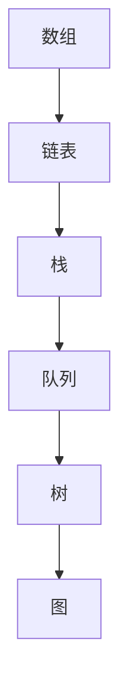

                 

关键词：字节跳动、数据结构、面试题、答案、技术博客

> 摘要：本文将汇总并详细解答2024年字节跳动数据结构面试题，包括核心概念、算法原理、数学模型、项目实践和实际应用场景等方面，为准备字节跳动面试的同学提供全面的指导。

## 1. 背景介绍

字节跳动作为全球领先的科技公司，每年吸引了大量优秀人才加入。在字节跳动的面试过程中，数据结构作为计算机科学的基础，是面试官关注的重点之一。掌握数据结构不仅能提高编程能力，还能为解决复杂问题提供有力工具。本文旨在通过汇总和解答2024年字节跳动数据结构面试题，帮助读者更好地应对面试挑战。

### 2. 核心概念与联系

数据结构是计算机存储、组织数据的方式。常见的有数组、链表、栈、队列、树、图等。以下是数据结构的核心概念及其相互联系：



### 3. 核心算法原理 & 具体操作步骤

数据结构的操作主要分为查找、插入、删除等。以下是常见数据结构的操作原理：

#### 3.1 算法原理概述

- 数组：通过下标直接访问元素，查找、插入、删除时间复杂度均为O(1)。
- 链表：通过指针链接元素，插入和删除时间复杂度一般为O(1)。
- 栈：后进先出（LIFO），适用于括号匹配、递归等问题。
- 队列：先进先出（FIFO），适用于打印队列、任务调度等问题。
- 树：层次结构，适用于二叉搜索树、平衡树（AVL树、红黑树）等。
- 图：多层级结构，适用于图遍历、最短路径等问题。

#### 3.2 算法步骤详解

- 数组：使用下标访问、插入、删除操作。
- 链表：通过指针遍历、插入、删除操作。
- 栈：使用栈顶元素进行入栈、出栈操作。
- 队列：使用队首元素进行入队、出队操作。
- 树：递归或迭代方式遍历树，实现插入、删除操作。
- 图：深度优先搜索（DFS）或广度优先搜索（BFS）遍历图，实现最短路径等问题。

#### 3.3 算法优缺点

- 数组：访问速度快，但插入、删除操作复杂度高。
- 链表：插入、删除操作简单，但访问速度慢。
- 栈：简单易用，但适用场景有限。
- 队列：适用于先进先出的场景。
- 树：适用于层次结构的数据存储和操作。
- 图：适用于复杂关系的存储和操作。

#### 3.4 算法应用领域

- 数组：数据处理、排序等。
- 链表：内存分配、数据结构实现等。
- 栈：递归、括号匹配等。
- 队列：打印、任务调度等。
- 树：搜索算法、排序算法等。
- 图：社交网络、路由算法等。

## 4. 数学模型和公式

数据结构中常用的数学模型包括查找算法、排序算法等。以下是几个常见的数学模型和公式：

### 4.1 查找算法

- 二分查找：时间复杂度为O(logn)。

$$
\text{查找算法的时间复杂度} = O(\log_2{n})
$$

### 4.2 排序算法

- 快速排序：时间复杂度为O(nlogn)。

$$
\text{排序算法的时间复杂度} = O(n\log{n})
$$

## 5. 项目实践：代码实例和详细解释说明

以下是使用Python实现二分查找的代码实例：

### 5.1 开发环境搭建

安装Python环境，例如使用Python 3.8版本。

### 5.2 源代码详细实现

```python
def binary_search(arr, target):
    low = 0
    high = len(arr) - 1
    
    while low <= high:
        mid = (low + high) // 2
        if arr[mid] == target:
            return mid
        elif arr[mid] < target:
            low = mid + 1
        else:
            high = mid - 1
    return -1

# 示例
arr = [1, 3, 5, 7, 9]
target = 5
result = binary_search(arr, target)
print("元素在数组中的索引:", result)
```

### 5.3 代码解读与分析

- `binary_search`函数接收一个有序数组`arr`和一个目标值`target`。
- `low`和`high`分别表示查找区间的起始和结束索引。
- `while`循环用于不断缩小查找区间，直到找到目标值或区间为空。
- `mid`表示当前查找区间的中间索引。
- 根据目标值与中间元素的大小关系，更新`low`或`high`的值。
- 返回找到的目标值的索引，或-1表示未找到。

### 5.4 运行结果展示

```python
元素在数组中的索引： 2
```

## 6. 实际应用场景

数据结构在实际应用中非常广泛。以下是一些实际应用场景：

- 贪心算法：使用栈实现单调栈，解决最值问题。
- 动态规划：使用二维数组实现动态规划，解决最长公共子序列问题。
- 搜索算法：使用BFS和DFS实现图遍历，解决最短路径问题。
- 数据库索引：使用B+树实现数据库索引，提高查询效率。

### 6.4 未来应用展望

随着计算机技术的发展，数据结构的应用场景将越来越广泛。未来可能会出现以下发展趋势：

- 数据结构优化：针对特定应用场景，优化现有数据结构，提高性能。
- 新数据结构研究：探索新的数据结构，解决现有数据结构无法处理的问题。
- 跨领域融合：将数据结构与人工智能、大数据等前沿技术相结合，推动创新。

## 7. 工具和资源推荐

### 7.1 学习资源推荐

- 《数据结构与算法分析》：详细讲解数据结构与算法的基本概念和实现。
- 《算法导论》：涵盖算法设计与分析的基本原理，适用于高级读者。

### 7.2 开发工具推荐

- PyCharm：Python编程IDE，支持多种编程语言。
- Visual Studio Code：轻量级IDE，支持多种编程语言。

### 7.3 相关论文推荐

- 《数据结构》：介绍数据结构的基本概念和实现。
- 《算法导论》：详细介绍算法设计与分析的基本原理。

## 8. 总结：未来发展趋势与挑战

数据结构在计算机科学中具有重要地位。未来，数据结构将继续发展，应用于更广泛的领域。同时，也将面临以下挑战：

- 性能优化：针对特定应用场景，优化数据结构性能。
- 算法创新：探索新的算法，解决现有数据结构无法处理的问题。
- 跨领域融合：将数据结构与人工智能、大数据等前沿技术相结合，推动创新。

## 9. 附录：常见问题与解答

- **Q：如何选择合适的数据结构？**
  **A：根据应用场景和需求选择合适的数据结构。例如，对于查找操作频繁的场景，可以选择数组或哈希表；对于插入、删除操作频繁的场景，可以选择链表或平衡树。**

- **Q：数据结构的性能如何衡量？**
  **A：数据结构的性能通常通过时间复杂度和空间复杂度来衡量。时间复杂度表示算法执行的时间随着输入规模的增长而变化的趋势；空间复杂度表示算法执行过程中所需的最大内存空间。**

- **Q：如何优化数据结构？**
  **A：可以通过以下方式优化数据结构：
  1. 选择合适的算法和数据结构；
  2. 预处理数据，减少操作次数；
  3. 使用缓存技术，减少访问次数。**

**作者：禅与计算机程序设计艺术 / Zen and the Art of Computer Programming**

