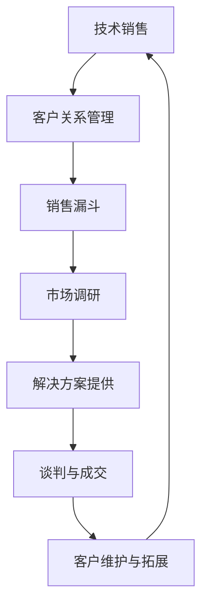

                 

关键词：字节跳动、校招、技术销售工程师、面试题、汇总、职业发展

摘要：本文将针对2024年字节跳动校招中的技术销售工程师岗位，整理出一系列面试题及其答案，帮助准备参加面试的同学们更好地应对挑战。同时，本文也会对技术销售工程师的职业发展进行探讨，为有志于从事该岗位的毕业生提供指导。

## 1. 背景介绍

字节跳动是一家全球领先的互联网科技公司，成立于2012年，总部位于中国北京。公司旗下拥有多款知名产品，如抖音、今日头条、懂车帝等，覆盖了短视频、新闻资讯、汽车信息等多个领域。字节跳动凭借其强大的技术创新和用户导向的发展理念，吸引了大量优秀人才的加入。

技术销售工程师是字节跳动中的重要岗位之一，负责将公司的技术产品和服务销售给潜在客户，帮助客户解决业务问题，提升客户满意度。这一岗位不仅要求具备扎实的技术背景，还需要具备良好的沟通能力和销售技巧。

## 2. 核心概念与联系

在了解技术销售工程师的职责前，我们需要了解以下几个核心概念：

1. **技术销售**：结合技术背景，通过专业知识和产品演示，向客户销售技术产品或服务。
2. **客户关系管理（CRM）**：利用CRM系统管理客户信息，跟踪销售机会，提高客户满意度。
3. **销售漏斗**：描述从潜在客户到最终成交的整个销售过程，包括识别潜在客户、需求分析、解决方案提供、谈判和成交等阶段。
4. **市场调研**：了解目标市场的需求、竞争对手情况、行业趋势等，为销售策略提供依据。

以下是上述概念之间的联系以及技术销售工程师的角色职责的Mermaid流程图：



### 2.1 技术销售工程师的角色职责

1. **需求挖掘**：与客户沟通，了解客户需求，挖掘潜在商机。
2. **方案设计**：根据客户需求，设计合适的解决方案，包括产品选型、技术支持等。
3. **产品演示**：向客户展示产品功能，讲解技术优势。
4. **谈判与成交**：与客户进行商务谈判，达成销售目标。
5. **客户维护**：与客户保持良好关系，提供售后服务，促进客户持续使用产品。

## 3. 核心算法原理 & 具体操作步骤

### 3.1 算法原理概述

技术销售工程师在实际工作中，会涉及到多种销售算法的应用。以下介绍几种常见的销售算法及其原理：

1. **需求识别算法**：基于客户的行业背景、业务需求和痛点，利用自然语言处理技术，从客户沟通中识别出潜在需求。
2. **客户分类算法**：根据客户的历史购买行为、企业规模、行业特征等信息，将客户进行分类，以便制定个性化的销售策略。
3. **客户流失预测算法**：通过分析客户的行为数据，如访问时长、购买频率等，预测客户可能流失的风险，并提前采取措施。
4. **机会评级算法**：结合客户的购买意愿、市场需求等因素，对销售机会进行评级，优先关注高潜力客户。

### 3.2 算法步骤详解

1. **需求识别算法**：
   - **数据收集**：收集客户的沟通记录、行业报告等数据。
   - **文本预处理**：对文本数据进行分词、去停用词等处理。
   - **特征提取**：利用词袋模型、TF-IDF等方法提取文本特征。
   - **模型训练**：使用分类算法（如SVM、决策树等）进行模型训练。
   - **需求预测**：将新客户的沟通记录输入模型，预测其需求。

2. **客户分类算法**：
   - **数据收集**：收集客户的企业规模、行业特征、购买行为等数据。
   - **特征选择**：选择与客户分类相关的特征。
   - **模型训练**：使用分类算法（如KNN、随机森林等）进行模型训练。
   - **客户分类**：将新客户的数据输入模型，进行分类。

3. **客户流失预测算法**：
   - **数据收集**：收集客户的行为数据，如访问时长、购买频率等。
   - **特征选择**：选择与客户流失相关的特征。
   - **模型训练**：使用回归算法（如线性回归、决策树等）进行模型训练。
   - **流失预测**：将新客户的数据输入模型，预测其流失风险。

4. **机会评级算法**：
   - **数据收集**：收集客户的购买意愿、市场需求等数据。
   - **特征选择**：选择与机会评级相关的特征。
   - **模型训练**：使用分类算法（如SVM、决策树等）进行模型训练。
   - **机会评级**：将新客户的数据输入模型，进行评级。

### 3.3 算法优缺点

1. **需求识别算法**：
   - **优点**：能够快速识别客户需求，提高销售效率。
   - **缺点**：对客户沟通记录的质量要求较高，识别精度受限于模型训练数据。

2. **客户分类算法**：
   - **优点**：有助于制定个性化的销售策略，提高客户满意度。
   - **缺点**：特征选择和模型训练过程较为复杂，对数据质量要求较高。

3. **客户流失预测算法**：
   - **优点**：能够提前发现潜在流失客户，降低客户流失率。
   - **缺点**：预测准确性受限于客户行为数据的收集和模型训练质量。

4. **机会评级算法**：
   - **优点**：有助于优先关注高潜力客户，提高销售转化率。
   - **缺点**：评级结果受限于客户购买意愿和市场需求的预测准确性。

### 3.4 算法应用领域

1. **需求识别算法**：适用于需要快速响应客户需求的场景，如B2B销售、客户咨询等。
2. **客户分类算法**：适用于客户群体较大的企业，如电商、金融等。
3. **客户流失预测算法**：适用于竞争激烈、客户流失风险较高的行业，如电信、互联网等。
4. **机会评级算法**：适用于需要精准定位销售机会的企业，如保险、证券等。

## 4. 数学模型和公式 & 详细讲解 & 举例说明

### 4.1 数学模型构建

在销售过程中，我们可以构建以下数学模型：

1. **客户需求预测模型**：
   - **输入**：客户沟通记录、行业报告等。
   - **输出**：客户需求概率分布。

2. **客户分类模型**：
   - **输入**：客户企业规模、行业特征、购买行为等。
   - **输出**：客户分类标签。

3. **客户流失预测模型**：
   - **输入**：客户行为数据，如访问时长、购买频率等。
   - **输出**：客户流失概率。

4. **机会评级模型**：
   - **输入**：客户购买意愿、市场需求等。
   - **输出**：机会评级标签。

### 4.2 公式推导过程

以客户需求预测模型为例，我们使用贝叶斯定理进行公式推导：

$$
P(\text{需求}|\text{沟通记录}) = \frac{P(\text{沟通记录}|\text{需求}) \cdot P(\text{需求})}{P(\text{沟通记录})}
$$

其中：

- $P(\text{需求}|\text{沟通记录})$ 表示在给定沟通记录的情况下，客户有需求的概率。
- $P(\text{沟通记录}|\text{需求})$ 表示在客户有需求的情况下，产生该沟通记录的概率。
- $P(\text{需求})$ 表示客户有需求的先验概率。
- $P(\text{沟通记录})$ 表示产生该沟通记录的概率。

### 4.3 案例分析与讲解

假设我们有一个客户沟通记录，包含以下关键词：“行业报告”、“技术支持”、“解决方案”。我们需要使用需求识别算法预测客户是否有需求。

1. **数据收集**：收集客户沟通记录、行业报告等数据。

2. **文本预处理**：对文本数据进行分词、去停用词等处理。

3. **特征提取**：提取关键词，构建词向量。

4. **模型训练**：使用分类算法（如SVM）进行模型训练。

5. **需求预测**：将新客户沟通记录输入模型，预测其需求概率。

假设模型预测结果为：

$$
P(\text{需求}|\text{沟通记录}) = 0.8
$$

这意味着该客户有很高的需求概率。我们可以进一步分析沟通记录中的关键词，确定其具体需求。

## 5. 项目实践：代码实例和详细解释说明

### 5.1 开发环境搭建

1. 安装Python环境（版本3.8以上）。
2. 安装依赖库：`numpy`、`scikit-learn`、`jieba`、`matplotlib`。
3. 使用Jupyter Notebook进行开发。

### 5.2 源代码详细实现

以下是一个简单的客户需求识别算法的实现示例：

```python
import jieba
from sklearn.feature_extraction.text import TfidfVectorizer
from sklearn.svm import SVC
from sklearn.model_selection import train_test_split

# 数据准备
def load_data():
    # 加载客户沟通记录和需求标签
   沟通记录 = ["关于行业报告的咨询", "技术支持的需求", "解决方案的讨论"]
   需求标签 = [1, 1, 0]  # 1表示有需求，0表示无需求
    return 沟通记录，需求标签

沟通记录，需求标签 = load_data()

# 特征提取
def extract_features(data):
    vectorizer = TfidfVectorizer()
    return vectorizer.fit_transform(data)

X = extract_features(沟通记录)

# 模型训练
def train_model(X, y):
    model = SVC(kernel="linear")
    model.fit(X, y)
    return model

model = train_model(X, 需求标签)

# 需求预测
def predict_demand(model, new_data):
    new_data_vector = model.transform(new_data)
    prediction = model.predict(new_data_vector)
    return prediction

new_data = ["行业报告的技术支持"]
prediction = predict_demand(model, new_data)

print("需求预测结果：", prediction)
```

### 5.3 代码解读与分析

1. **数据准备**：加载客户沟通记录和需求标签，用于模型训练和预测。
2. **特征提取**：使用TF-IDF方法提取文本特征，将沟通记录转换为数值向量。
3. **模型训练**：使用支持向量机（SVM）进行模型训练。
4. **需求预测**：将新客户沟通记录输入模型，预测其需求概率。

### 5.4 运行结果展示

假设我们有一个新客户沟通记录：“关于行业报告的技术支持”。运行代码后，需求预测结果为1，表示该客户有很高的需求概率。

## 6. 实际应用场景

技术销售工程师在实际工作中，会面临多种应用场景。以下列举几个常见的应用场景：

1. **客户需求挖掘**：通过分析客户沟通记录，识别出客户潜在需求。
2. **客户分类**：根据客户的企业规模、行业特征等信息，将客户进行分类，以便制定个性化的销售策略。
3. **客户流失预测**：分析客户的行为数据，预测客户可能流失的风险，并提前采取措施。
4. **机会评级**：结合客户的购买意愿、市场需求等因素，对销售机会进行评级，优先关注高潜力客户。

在实际工作中，技术销售工程师需要熟练掌握各类算法，结合实际场景进行应用，提高销售效率，提升客户满意度。

## 7. 未来应用展望

随着人工智能技术的发展，技术销售工程师的工作将越来越依赖于数据分析和算法。未来，以下趋势值得我们关注：

1. **智能化销售工具**：利用人工智能技术，开发智能化销售工具，提高销售效率。
2. **个性化销售策略**：通过数据分析和客户分类，制定更加个性化的销售策略，提升客户满意度。
3. **自动化客户服务**：利用自然语言处理技术，实现自动化客户服务，降低人力成本。
4. **数据驱动决策**：基于数据分析，为企业提供数据驱动的决策支持。

## 8. 工具和资源推荐

### 8.1 学习资源推荐

1. **《机器学习实战》**：提供丰富的实践案例，适合初学者入门。
2. **《Python机器学习》**：详细讲解机器学习算法的实现和应用。
3. **Coursera上的《机器学习》课程**：由吴恩达教授主讲，适合系统性学习。

### 8.2 开发工具推荐

1. **Jupyter Notebook**：方便编写和运行Python代码，支持多种编程语言。
2. **TensorFlow**：广泛用于机器学习模型开发，支持多种算法和框架。
3. **Scikit-learn**：提供丰富的机器学习算法库，方便实现和应用。

### 8.3 相关论文推荐

1. **《User Behavior Analytics for Fraud Detection in Mobile Apps》**：研究移动应用中的用户行为分析。
2. **《Customer Segmentation Using Clustering Algorithms》**：探讨客户分类方法及其应用。
3. **《Predicting Customer Churn Using Machine Learning》**：研究客户流失预测方法。

## 9. 总结：未来发展趋势与挑战

随着人工智能技术的不断发展，技术销售工程师的职业前景广阔。然而，这也带来了新的挑战：

1. **数据质量**：算法的准确性依赖于数据质量，因此如何收集和处理高质量的数据是一个重要问题。
2. **算法解释性**：算法结果需要易于理解和解释，这对于提高客户信任和满意度至关重要。
3. **模型优化**：如何优化算法模型，提高预测准确性和运行效率，是技术销售工程师需要不断探索的方向。

未来，技术销售工程师需要不断学习和提升自己的技能，以适应行业的发展需求。

### 附录：常见问题与解答

**Q1：技术销售工程师需要具备哪些技能？**

**A1：技术销售工程师需要具备以下技能：**

1. **扎实的技术背景**：了解所销售产品的技术原理和功能。
2. **良好的沟通能力**：能够与客户进行有效沟通，了解客户需求。
3. **销售技巧**：掌握销售谈判、客户关系管理等技巧。
4. **数据分析能力**：能够利用数据分析和算法进行客户需求挖掘、客户分类等。

**Q2：技术销售工程师的职业发展路径是怎样的？**

**A2：技术销售工程师的职业发展路径可以分为以下几个阶段：**

1. **初级技术销售工程师**：负责销售工作，积累经验和客户资源。
2. **高级技术销售工程师**：提升销售业绩，管理销售团队，参与项目决策。
3. **销售经理**：负责销售团队的管理和业绩提升，协调内外部资源。
4. **销售总监**：负责公司的销售战略和业务发展，制定销售策略。

通过不断学习和提升自己的能力，技术销售工程师可以在职业生涯中取得更好的发展。

作者：禅与计算机程序设计艺术 / Zen and the Art of Computer Programming

### 结语

随着互联网技术的不断发展，技术销售工程师在互联网企业中的作用越来越重要。本文从多个角度分析了技术销售工程师的职责、算法原理、数学模型、项目实践、应用场景以及未来展望，希望能够为准备参加字节跳动校招的技术销售工程师提供一些参考和启示。在未来的工作中，希望各位技术销售工程师能够不断学习和提升自己的技能，为企业创造更大的价值。

