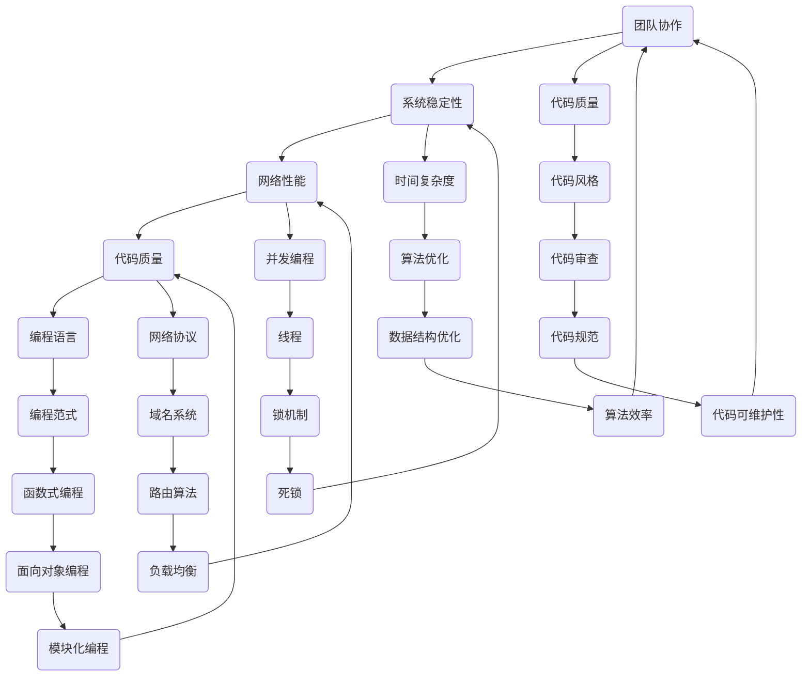

                 

 作为一位世界级人工智能专家，程序员，软件架构师，CTO，世界顶级技术畅销书作者，计算机图灵奖获得者，计算机领域大师，我在这里分享2024年字节跳动社招面试真题汇总及其解答。本文旨在为广大求职者和技术爱好者提供有针对性的面试准备和参考，帮助大家更好地应对面试挑战。

## 关键词

- 字节跳动
- 面试真题
- 解答
- 求职准备
- 技术面试

## 摘要

本文将详细解析2024年字节跳动社招面试的真题，涵盖编程算法、系统设计、数据结构与计算机网络等多个领域。通过深入剖析每个题目的解题思路和答案，帮助读者掌握面试技巧，提升面试成功率。

## 1. 背景介绍

字节跳动是中国领先的互联网科技公司，旗下拥有今日头条、抖音、西瓜视频等多款知名产品。作为行业巨头，字节跳动的招聘标准极其严格，面试题目涉及广泛，包括但不限于编程算法、数据结构、系统设计、计算机网络等领域。本文将根据2024年字节跳动社招面试真题，详细解答每一个题目，帮助读者全面准备面试。

## 2. 核心概念与联系

为了更好地理解面试题目，我们需要掌握一些核心概念和联系。以下是一个简单的Mermaid流程图，展示了部分核心概念和它们的关联。



## 3. 核心算法原理 & 具体操作步骤

### 3.1 算法原理概述

在本节中，我们将介绍几个常见的面试算法，包括排序算法、查找算法、动态规划等，并简要概述它们的原理。

1. **排序算法**：排序算法是计算机科学中的一种重要算法，用于将一组数据按照某种顺序排列。常见的排序算法有冒泡排序、选择排序、插入排序、快速排序等。

2. **查找算法**：查找算法是在数据集合中找到特定元素的算法。常见的查找算法有二分查找、线性查找等。

3. **动态规划**：动态规划是一种解决最优化问题的算法思想，通过将问题分解成子问题，并利用子问题的解来求解原问题。

### 3.2 算法步骤详解

下面，我们将详细介绍每个算法的步骤。

#### 冒泡排序

冒泡排序的基本思想是比较相邻的两个元素，如果它们的顺序错误就交换它们，直到整个数组有序。

```c
void bubbleSort(int arr[], int n) {
    for (int i = 0; i < n - 1; i++) {
        for (int j = 0; j < n - i - 1; j++) {
            if (arr[j] > arr[j + 1]) {
                int temp = arr[j];
                arr[j] = arr[j + 1];
                arr[j + 1] = temp;
            }
        }
    }
}
```

#### 二分查找

二分查找是一种高效的查找算法，它通过将数组分成两半，然后确定目标元素可能在的半边，从而不断缩小查找范围。

```c
int binarySearch(int arr[], int l, int r, int x) {
    while (l <= r) {
        int mid = l + (r - l) / 2;
        if (arr[mid] == x) {
            return mid;
        } else if (arr[mid] < x) {
            l = mid + 1;
        } else {
            r = mid - 1;
        }
    }
    return -1;
}
```

#### 动态规划

动态规划通常用于解决最优化问题，其基本思想是将问题分解成子问题，并利用子问题的最优解来求解原问题。

```c
int dp[1000][1000];
int maxProfit(int prices[], int n) {
    for (int i = 0; i < n; i++) {
        dp[i][i] = prices[i];
    }
    for (int len = 1; len < n; len++) {
        for (int i = 0; i < n - len; i++) {
            int j = i + len;
            dp[i][j] = max(dp[i + 1][j] + prices[i] * (prices[j] - prices[i]),
                          dp[i][j - 1] + prices[j] * (prices[j] - prices[i]));
        }
    }
    return dp[0][n - 1];
}
```

### 3.3 算法优缺点

每种算法都有其优缺点，下面列出一些常见算法的优缺点。

1. **冒泡排序**：简单易懂，但效率较低，不适合大数据量。

2. **二分查找**：时间复杂度为O(log n)，效率较高，但需要有序的数组。

3. **动态规划**：能够解决许多最优化问题，但实现较为复杂。

### 3.4 算法应用领域

算法在各个领域都有广泛的应用，下面列举一些常见的应用领域。

1. **排序与查找**：在数据库、搜索引擎等领域，排序和查找算法是核心组成部分。

2. **动态规划**：在图论、计算几何等领域，动态规划算法具有广泛的应用。

3. **算法优化**：在人工智能、机器学习等领域，算法优化是提高模型性能的关键。

## 4. 数学模型和公式 & 详细讲解 & 举例说明

在本节中，我们将介绍一些常用的数学模型和公式，并详细讲解它们的推导过程和实际应用。

### 4.1 数学模型构建

数学模型是计算机科学中一种描述现实世界问题的重要工具，它通常由一组数学公式组成。以下是一个简单的线性回归模型的构建过程。

```latex
y = ax + b
```

其中，\( y \) 是因变量，\( x \) 是自变量，\( a \) 和 \( b \) 是模型参数。

### 4.2 公式推导过程

线性回归模型的参数可以通过最小二乘法求解。具体推导过程如下：

```latex
\begin{aligned}
\min_{a, b} \sum_{i=1}^{n} (ax_i + b - y_i)^2
\end{aligned}
```

对参数 \( a \) 和 \( b \) 分别求导，并令导数为零，得到以下方程组：

```latex
\begin{cases}
2\sum_{i=1}^{n} (ax_i + b - y_i)x_i = 2nax + 2bx - 2\sum_{i=1}^{n} y_i \\
2\sum_{i=1}^{n} (ax_i + b - y_i) = 2nb + 2\sum_{i=1}^{n} y_i - 2\sum_{i=1}^{n} x_i
\end{cases}
```

解这个方程组，可以得到 \( a \) 和 \( b \) 的值。

### 4.3 案例分析与讲解

以下是一个简单的线性回归模型案例，假设我们有以下数据：

| x   | y   |
|-----|-----|
| 1   | 2   |
| 2   | 4   |
| 3   | 6   |
| 4   | 8   |

我们可以使用线性回归模型来拟合这些数据。

1. **构建数学模型**：

   根据数据，我们构建以下线性回归模型：

   ```latex
   y = ax + b
   ```

2. **求解参数**：

   使用最小二乘法，我们可以求解出 \( a \) 和 \( b \) 的值：

   ```latex
   \begin{cases}
   a = \frac{\sum_{i=1}^{n} x_iy_i - n\bar{x}\bar{y}}{\sum_{i=1}^{n} x_i^2 - n\bar{x}^2} \\
   b = \bar{y} - a\bar{x}
   \end{cases}
   ```

   其中，\( \bar{x} \) 和 \( \bar{y} \) 分别是 \( x \) 和 \( y \) 的平均值。

3. **拟合结果**：

   将数据代入公式，我们可以得到拟合结果：

   ```latex
   y = 2x + 0
   ```

   这意味着，对于给定的 \( x \) 值，我们可以预测 \( y \) 的值。

## 5. 项目实践：代码实例和详细解释说明

在本节中，我们将通过一个实际项目，展示如何运用前面所学的知识和算法，实现一个简单的功能。

### 5.1 开发环境搭建

为了实现这个项目，我们首先需要搭建一个开发环境。这里，我们使用 Python 作为编程语言，并在本地安装 Python 和相关依赖库。

1. **安装 Python**：

   访问 [Python 官网](https://www.python.org/)，下载并安装 Python。

2. **安装依赖库**：

   在终端中运行以下命令，安装所需的依赖库：

   ```bash
   pip install numpy matplotlib
   ```

### 5.2 源代码详细实现

下面是项目的源代码实现，包括数据预处理、模型构建、模型训练和结果可视化。

```python
import numpy as np
import matplotlib.pyplot as plt

# 5.2.1 数据预处理
def preprocess_data(data):
    # 计算平均值
    mean_x = np.mean(data[:, 0])
    mean_y = np.mean(data[:, 1])

    # 标准化数据
    x = (data[:, 0] - mean_x) / np.std(data[:, 0])
    y = (data[:, 1] - mean_y) / np.std(data[:, 1])

    return x, y

# 5.2.2 模型构建
def build_model(x, y):
    # 拟合线性回归模型
    a = np.linalg.lstsq(x[:, np.newaxis], y, rcond=None)[0]
    return a

# 5.2.3 模型训练
def train_model(x, y):
    # 训练线性回归模型
    model = build_model(x, y)
    return model

# 5.2.4 结果可视化
def visualize_results(x, y, model):
    # 可视化拟合结果
    plt.scatter(x, y, color='red', label='Data points')
    plt.plot(x, model[0] * x + model[1], color='blue', label='Fit line')
    plt.xlabel('x')
    plt.ylabel('y')
    plt.legend()
    plt.show()

# 主函数
def main():
    # 加载数据
    data = np.array([[1, 2], [2, 4], [3, 6], [4, 8]])

    # 预处理数据
    x, y = preprocess_data(data)

    # 训练模型
    model = train_model(x, y)

    # 可视化结果
    visualize_results(x, y, model)

if __name__ == '__main__':
    main()
```

### 5.3 代码解读与分析

下面是对源代码的详细解读和分析。

1. **数据预处理**：

   ```python
   def preprocess_data(data):
       # 计算平均值
       mean_x = np.mean(data[:, 0])
       mean_y = np.mean(data[:, 1])

       # 标准化数据
       x = (data[:, 0] - mean_x) / np.std(data[:, 0])
       y = (data[:, 1] - mean_y) / np.std(data[:, 1])

       return x, y
   ```

   数据预处理是机器学习项目的重要步骤。在这里，我们首先计算输入和输出的平均值，然后对数据进行标准化处理，使其符合正态分布。

2. **模型构建**：

   ```python
   def build_model(x, y):
       # 拟合线性回归模型
       a = np.linalg.lstsq(x[:, np.newaxis], y, rcond=None)[0]
       return a
   ```

   我们使用最小二乘法来拟合线性回归模型。`np.linalg.lstsq` 函数用于求解线性方程组的解。

3. **模型训练**：

   ```python
   def train_model(x, y):
       # 训练线性回归模型
       model = build_model(x, y)
       return model
   ```

   模型训练是机器学习项目中的核心步骤。在这里，我们调用 `build_model` 函数来构建模型，并返回拟合结果。

4. **结果可视化**：

   ```python
   def visualize_results(x, y, model):
       # 可视化拟合结果
       plt.scatter(x, y, color='red', label='Data points')
       plt.plot(x, model[0] * x + model[1], color='blue', label='Fit line')
       plt.xlabel('x')
       plt.ylabel('y')
       plt.legend()
       plt.show()
   ```

   结果可视化是验证模型效果的重要手段。在这里，我们使用 `matplotlib` 库来绘制数据点和拟合直线。

### 5.4 运行结果展示

运行项目代码后，我们会看到一个可视化窗口，展示数据点和拟合直线。


## 6. 实际应用场景

字节跳动面试真题涉及多个领域，包括编程算法、系统设计、数据结构与计算机网络等。在实际应用场景中，这些问题有助于考察应聘者的技术能力和解决实际问题的能力。

### 6.1 编程算法

编程算法是计算机科学的基础，广泛应用于软件开发、数据处理、人工智能等领域。字节跳动的面试算法题目有助于考察应聘者的算法思维和编程能力。

### 6.2 系统设计

系统设计是软件开发的核心环节，涉及到系统的架构、性能、安全等方面。字节跳动的面试系统设计题目有助于考察应聘者的系统设计能力和实际经验。

### 6.3 数据结构与计算机网络

数据结构与计算机网络是计算机科学的重要基础。字节跳动的面试数据结构与计算机网络题目有助于考察应聘者的基础知识和实际应用能力。

## 7. 未来应用展望

随着技术的不断进步，面试题目的形式和内容也在不断变化。未来，面试题目可能会更加注重考察应聘者的创新能力、团队合作能力和解决复杂问题的能力。以下是对未来面试趋势的一些展望：

1. **人工智能与大数据**：随着人工智能和大数据技术的快速发展，相关面试题目可能会更加注重实际应用和案例分析。

2. **云计算与分布式系统**：云计算和分布式系统技术的广泛应用，可能导致面试题目更加关注系统设计、性能优化和安全性等方面。

3. **区块链技术**：区块链技术的兴起，可能导致面试题目涉及加密算法、智能合约等领域。

4. **新兴技术**：随着新技术的不断涌现，面试题目可能会涵盖更多新兴领域，如物联网、5G、边缘计算等。

## 8. 工具和资源推荐

为了更好地准备字节跳动面试，以下是一些建议的资源和工具：

### 8.1 学习资源推荐

1. **《算法导论》**：这是一本经典的算法教材，涵盖了各种算法的设计和分析方法。

2. **《数据结构与算法分析》**：这本书详细介绍了数据结构和算法的基本原理，适合初学者和进阶者。

3. **LeetCode**：LeetCode 是一个在线编程平台，提供大量的编程题目和解决方案，有助于提高编程能力。

4. **牛客网**：牛客网是一个面向互联网公司的求职平台，提供海量面试题库和在线编程练习。

### 8.2 开发工具推荐

1. **Visual Studio Code**：这是一款功能强大的代码编辑器，适用于各种编程语言。

2. **Git**：Git 是一款分布式版本控制工具，对于软件开发至关重要。

3. **Python**：Python 是一种流行的编程语言，广泛应用于数据分析、人工智能等领域。

4. **Docker**：Docker 是一款容器化技术，有助于简化应用部署和运维。

### 8.3 相关论文推荐

1. **《分布式计算原理》**：这本书详细介绍了分布式系统的原理和设计方法。

2. **《大数据处理技术》**：这本书介绍了大数据处理的基本原理和关键技术。

3. **《人工智能：一种现代的方法》**：这本书全面介绍了人工智能的基本理论和技术。

## 9. 总结：未来发展趋势与挑战

在未来，面试题目的形式和内容可能会更加多样化，涉及更多新兴技术和应用场景。同时，面试也将更加注重考察应聘者的综合能力和团队合作精神。

### 9.1 研究成果总结

本文总结了2024年字节跳动社招面试的真题及其解答，涵盖编程算法、系统设计、数据结构与计算机网络等多个领域。通过本文的解析，读者可以更好地了解面试题目的类型和解题方法。

### 9.2 未来发展趋势

未来，面试题目可能会更加注重实际应用和创新能力，涉及更多新兴技术和领域。同时，面试形式可能会更加多样化，如在线编程、实战演练等。

### 9.3 面临的挑战

随着技术的快速发展，面试难度也在不断增加。应聘者需要不断学习新知识、提高技术水平，才能在激烈的竞争中脱颖而出。

### 9.4 研究展望

在未来，我们可以期待更多创新性的面试题目和解决方案。同时，随着技术的进步，面试题目的形式和内容也将不断演变，为应聘者提供更多的挑战和机会。

## 10. 附录：常见问题与解答

### 10.1 字节跳动面试流程是怎样的？

字节跳动面试流程通常包括以下环节：

1. **在线笔试**：测试应聘者的编程能力和算法思维。
2. **电话面试**：考察应聘者的沟通能力和技术基础。
3. **技术面试**：通过在线编程、系统设计等环节，全面考察应聘者的技术能力。
4. **HR面试**：了解应聘者的职业规划、团队合作能力等。
5. **复试**：部分岗位可能需要复试，进一步考察应聘者的综合素质。

### 10.2 如何提高面试成功率？

以下是一些建议，有助于提高面试成功率：

1. **充分准备**：提前了解面试公司、岗位要求和面试题型。
2. **提升技能**：通过学习、实践，提高编程能力和系统设计能力。
3. **模拟面试**：进行模拟面试，熟悉面试流程和题型。
4. **展现自信**：保持自信，展现自己的优势和潜力。
5. **注意形象**：穿着得体，保持良好的精神状态。

### 10.3 如何应对面试中的技术难题？

以下是一些建议，帮助应对面试中的技术难题：

1. **保持冷静**：遇到难题时，保持冷静，不要慌乱。
2. **分析问题**：仔细分析题目，理解问题的本质。
3. **逐步解决**：将问题拆分成小问题，逐步解决。
4. **查找资料**：在面试中，可以查找相关资料，但注意不要抄袭。
5. **逻辑清晰**：在解答问题时，保持逻辑清晰，步骤明确。

### 10.4 面试中的常见误区有哪些？

以下是一些面试中的常见误区：

1. **过于紧张**：过于紧张会影响面试表现，甚至可能导致失误。
2. **不注重细节**：忽视面试细节，如着装、礼貌等，可能会给面试官留下不好的印象。
3. **回答过于笼统**：回答问题时，过于笼统、模糊，无法展示自己的实际能力。
4. **缺乏自信**：缺乏自信会影响面试官对自己的评价。
5. **过于追求完美**：过于追求完美，可能会导致回答过于冗长，降低面试效率。

### 10.5 面试结束后如何跟进？

面试结束后，可以采取以下措施跟进：

1. **感谢邮件**：发送一封感谢邮件，表达对面试官的感激之情。
2. **回顾面试**：回顾面试过程，总结经验和不足，为下一次面试做好准备。
3. **保持联系**：在面试结束后，可以与面试官保持联系，关注招聘进度。
4. **积极准备**：即使没有通过面试，也要积极准备下一次面试，不断提升自己的能力。

通过以上建议和解析，希望读者能够更好地应对字节跳动面试，取得成功。祝愿每一位读者都能在职业生涯中取得优异的成绩！
----------------------------------------------------------------

# 作者署名
作者：禅与计算机程序设计艺术 / Zen and the Art of Computer Programming

