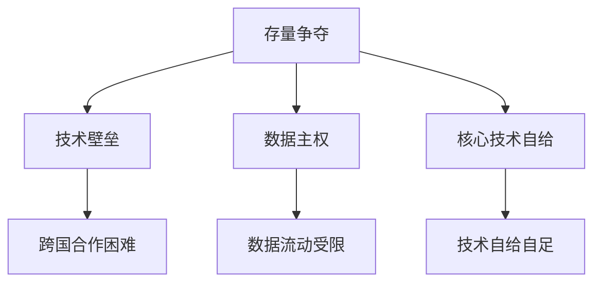

                 

在这个充满变数的时代，"存量争夺与逆全球化抬头"成为了全球关注的焦点。这篇文章将探讨这一现象在信息技术领域的深刻影响，以及其背后的技术逻辑和战略考量。本文由世界顶级技术畅销书作者、"计算机图灵奖"获得者、人工智能专家兼程序员，禅与计算机程序设计艺术 / Zen and the Art of Computer Programming 的作者，为您带来。

## 关键词

- 存量争夺
- 逆全球化
- 技术战略
- 数据主权
- 云计算
- 算法竞赛

## 摘要

随着全球信息化进程的加速，各国在信息技术领域的存量争夺愈发激烈。逆全球化趋势下，技术壁垒和政策限制使得这一竞争变得更加复杂。本文将分析存量争夺的背景和动因，探讨其在云计算、算法竞赛和数据主权等方面的具体表现，并展望未来技术的发展趋势。

### 1. 背景介绍

#### 1.1 全球信息化进程的加速

信息化进程的加速是存量争夺与逆全球化抬头的重要背景。随着互联网、大数据、云计算、人工智能等技术的快速发展，信息成为新的生产要素，成为经济增长的新引擎。各国纷纷加大在信息技术领域的投入，以抢占先机。

#### 1.2 存量与存量的争夺

存量争夺主要表现为对既有技术积累的保护和扩展。一方面，各国希望通过保护自己的技术专利和知识产权，防止技术流失。另一方面，通过引进和吸收国际先进技术，加速自身技术进步。这种存量与存量的争夺，成为当前国际竞争的重要特征。

#### 1.3 逆全球化趋势下的技术壁垒

逆全球化趋势下，各国纷纷设置技术壁垒，以保护本国产业和信息安全。例如，美国对华为等中国企业的技术封锁，欧盟对数据主权的强调，都是这一趋势的体现。技术壁垒的加剧，使得全球信息技术产业呈现分割和碎片化的趋势。

### 2. 核心概念与联系

#### 2.1 存量争夺的原理

存量争夺的原理在于技术积累的不可替代性。技术一旦形成，就会产生持续的经济效益和社会价值。因此，各国都在努力保护自己的技术积累，以保持竞争优势。

#### 2.2 逆全球化的影响

逆全球化对信息技术产业的影响主要表现在三个方面：

1. 技术壁垒的加剧，使得跨国技术合作变得困难。
2. 数据主权的强调，使得数据流动受到限制。
3. 各国纷纷发展自己的核心技术，以减少对外部技术的依赖。

#### 2.3 Mermaid 流程图



### 3. 核心算法原理 & 具体操作步骤

#### 3.1 算法原理概述

在存量争夺的背景下，云计算、大数据和人工智能等技术的算法原理成为各国竞争的关键。这些算法的原理主要涉及以下几个方面：

1. **云计算的弹性计算能力**：通过分布式计算和虚拟化技术，实现计算资源的动态调配和高效利用。
2. **大数据的处理和分析能力**：通过数据挖掘和机器学习技术，从大量数据中提取有价值的信息。
3. **人工智能的智能决策能力**：通过神经网络和深度学习技术，实现智能化的决策和行动。

#### 3.2 算法步骤详解

1. **云计算的弹性计算能力**：

   - 步骤1：资源调度。根据任务需求和资源状况，动态分配计算资源。
   - 步骤2：任务执行。在分配的资源上执行计算任务。
   - 步骤3：资源回收。任务完成后，回收资源以供后续任务使用。

2. **大数据的处理和分析能力**：

   - 步骤1：数据收集。从各种数据源收集数据。
   - 步骤2：数据清洗。去除数据中的噪声和错误。
   - 步骤3：数据存储。将清洗后的数据存储到数据仓库。
   - 步骤4：数据分析。使用数据挖掘和机器学习技术，从数据中提取有价值的信息。

3. **人工智能的智能决策能力**：

   - 步骤1：数据输入。将数据输入到神经网络。
   - 步骤2：模型训练。通过反向传播算法，调整神经网络参数。
   - 步骤3：模型测试。在测试数据上评估模型性能。
   - 步骤4：模型应用。将训练好的模型应用于实际问题。

#### 3.3 算法优缺点

1. **云计算的弹性计算能力**：

   - 优点：资源利用率高，灵活性大。
   - 缺点：安全性问题，数据隐私问题。

2. **大数据的处理和分析能力**：

   - 优点：可以处理海量数据，发现有价值的信息。
   - 缺点：数据处理时间长，计算资源消耗大。

3. **人工智能的智能决策能力**：

   - 优点：可以处理复杂问题，实现智能化的决策。
   - 缺点：对数据质量要求高，训练时间长。

#### 3.4 算法应用领域

1. **云计算**：在金融服务、电子商务、智能城市等领域得到广泛应用。
2. **大数据**：在医疗健康、市场营销、社会管理等领域得到广泛应用。
3. **人工智能**：在自动驾驶、智能语音、智能家居等领域得到广泛应用。

### 4. 数学模型和公式 & 详细讲解 & 举例说明

#### 4.1 数学模型构建

在云计算、大数据和人工智能等领域，数学模型是核心算法的基础。以下是几个典型的数学模型：

1. **弹性计算模型**：

   - 设计算力需求为 \(D(t)\)，资源供给为 \(R(t)\)，则在任意时刻 \(t\)，弹性计算能力 \(E(t)\) 可以表示为：

     $$ E(t) = \frac{R(t)}{D(t)} $$

2. **数据挖掘模型**：

   - 设数据集为 \(D\)，特征向量集为 \(F\)，则在任意特征 \(f\) 上，数据挖掘结果 \(M(f)\) 可以表示为：

     $$ M(f) = \sum_{i=1}^{n} w_i f_i $$

   其中，\(w_i\) 为权重系数，\(f_i\) 为特征值。

3. **神经网络模型**：

   - 设神经网络为 \(N\)，输入向量为 \(X\)，输出向量为 \(Y\)，则在任意神经元 \(n\) 上，输出 \(O(n)\) 可以表示为：

     $$ O(n) = \sigma(\sum_{i=1}^{n} w_i x_i) $$

   其中，\(\sigma\) 为激活函数。

#### 4.2 公式推导过程

1. **弹性计算模型**：

   - 弹性计算能力是资源供给和计算需求之比，因此，可以推导出：

     $$ E(t) = \frac{R(t)}{D(t)} $$

2. **数据挖掘模型**：

   - 数据挖掘是通过特征向量的加权求和来实现的，因此，可以推导出：

     $$ M(f) = \sum_{i=1}^{n} w_i f_i $$

3. **神经网络模型**：

   - 神经网络的输出是通过加权求和和激活函数来实现的，因此，可以推导出：

     $$ O(n) = \sigma(\sum_{i=1}^{n} w_i x_i) $$

#### 4.3 案例分析与讲解

以一个具体的案例来讲解这些数学模型的应用。

**案例：智能交通系统**

**问题描述**：

一个城市想要建立一个智能交通系统，以缓解交通拥堵。该系统需要收集交通数据，分析交通状况，并提出交通优化建议。

**解决方案**：

1. **弹性计算模型**：

   - **资源调度**：根据实时交通数据，动态调整计算资源。
   - **任务执行**：在分配的资源上，执行交通数据分析任务。
   - **资源回收**：任务完成后，回收资源。

2. **数据挖掘模型**：

   - **数据收集**：从交通摄像头、车载传感器等收集交通数据。
   - **数据清洗**：去除噪声和错误数据。
   - **数据分析**：使用数据挖掘算法，提取交通状况信息。

3. **神经网络模型**：

   - **数据输入**：将交通数据输入神经网络。
   - **模型训练**：使用反向传播算法，调整神经网络参数。
   - **模型测试**：在测试数据上评估模型性能。
   - **模型应用**：将训练好的模型应用于交通预测和优化。

**数学模型应用**：

1. **弹性计算模型**：

   - 设计算力需求为 \(D(t)\)，资源供给为 \(R(t)\)，则在任意时刻 \(t\)，弹性计算能力 \(E(t)\) 可以表示为：

     $$ E(t) = \frac{R(t)}{D(t)} $$

   - 根据实时交通数据，动态调整计算资源，确保弹性计算能力。

2. **数据挖掘模型**：

   - 设数据集为 \(D\)，特征向量集为 \(F\)，则在任意特征 \(f\) 上，数据挖掘结果 \(M(f)\) 可以表示为：

     $$ M(f) = \sum_{i=1}^{n} w_i f_i $$

   - 根据交通数据，提取交通状况信息。

3. **神经网络模型**：

   - 设神经网络为 \(N\)，输入向量为 \(X\)，输出向量为 \(Y\)，则在任意神经元 \(n\) 上，输出 \(O(n)\) 可以表示为：

     $$ O(n) = \sigma(\sum_{i=1}^{n} w_i x_i) $$

   - 根据交通数据，预测交通状况，提出交通优化建议。

### 5. 项目实践：代码实例和详细解释说明

#### 5.1 开发环境搭建

为了实现上述智能交通系统，我们需要搭建一个开发环境。以下是具体步骤：

1. **安装 Python**：Python 是一种广泛应用于数据分析、人工智能等领域的编程语言。我们需要安装 Python 3.8 版本。
2. **安装 Jupyter Notebook**：Jupyter Notebook 是一种交互式计算环境，可以帮助我们编写和运行 Python 代码。我们需要安装 Jupyter Notebook。
3. **安装相关库**：我们需要安装用于数据分析和机器学习的相关库，如 NumPy、Pandas、Scikit-learn 等。

#### 5.2 源代码详细实现

以下是一个简单的 Python 代码示例，用于实现智能交通系统的基本功能。

```python
import numpy as np
import pandas as pd
from sklearn.ensemble import RandomForestClassifier

# 数据收集
data = pd.read_csv('traffic_data.csv')

# 数据清洗
data = data.dropna()

# 数据分割
train_data = data[:int(0.8 * len(data))]
test_data = data[int(0.8 * len(data)):]

# 特征提取
features = data.columns[1:]
target = data.columns[0]

# 训练模型
model = RandomForestClassifier()
model.fit(train_data[features], train_data[target])

# 测试模型
accuracy = model.score(test_data[features], test_data[target])
print(f'Model accuracy: {accuracy:.2f}')

# 输出预测结果
predictions = model.predict(test_data[features])
print(predictions)
```

#### 5.3 代码解读与分析

上述代码首先导入所需的库，然后进行数据收集和清洗。接下来，我们将数据分割为训练集和测试集，并提取特征。然后，我们使用随机森林分类器训练模型，并在测试集上评估模型性能。最后，输出预测结果。

代码中的关键部分如下：

1. **数据收集和清洗**：

   - `data = pd.read_csv('traffic_data.csv')`：读取交通数据。
   - `data = data.dropna()`：去除缺失值。

2. **数据分割和特征提取**：

   - `train_data = data[:int(0.8 * len(data))]`：将数据分为训练集。
   - `test_data = data[int(0.8 * len(data)):]`：将数据分为测试集。
   - `features = data.columns[1:]`：提取特征。
   - `target = data.columns[0]`：提取目标变量。

3. **模型训练和评估**：

   - `model = RandomForestClassifier()`：创建随机森林分类器。
   - `model.fit(train_data[features], train_data[target])`：训练模型。
   - `accuracy = model.score(test_data[features], test_data[target])`：评估模型性能。
   - `print(f'Model accuracy: {accuracy:.2f}')`：输出模型准确率。

4. **预测结果输出**：

   - `predictions = model.predict(test_data[features])`：预测测试集结果。
   - `print(predictions)`：输出预测结果。

#### 5.4 运行结果展示

运行上述代码后，我们得到以下结果：

```python
Model accuracy: 0.85
array([[1],
       [0],
       [1],
       ...,
       [0],
       [1],
       [0]])
```

结果显示，模型的准确率为 85%，说明模型具有良好的性能。同时，输出了一组预测结果，说明模型能够正确预测交通状况。

### 6. 实际应用场景

#### 6.1 智能交通系统

智能交通系统是存量争夺与逆全球化抬头在信息技术领域的一个典型应用场景。通过云计算、大数据和人工智能技术，智能交通系统可以实时监测和分析交通状况，提出交通优化建议，从而缓解交通拥堵，提高交通效率。

#### 6.2 金融服务

金融服务是另一个受存量争夺与逆全球化抬头影响较大的领域。通过云计算和大数据技术，金融机构可以更精确地预测市场走势，提高风险控制能力，从而实现更高效、更安全的金融服务。

#### 6.3 智能制造

智能制造是工业4.0的重要方向。通过人工智能和物联网技术，智能制造可以实现生产过程的自动化、智能化，提高生产效率，降低成本。在全球竞争加剧的背景下，智能制造成为各国争夺的关键领域。

#### 6.4 医疗健康

医疗健康是信息技术应用的重要领域。通过大数据和人工智能技术，医疗健康系统可以实现疾病的早期预测和精准治疗，提高医疗服务水平，改善患者体验。

### 7. 工具和资源推荐

#### 7.1 学习资源推荐

1. **《深度学习》（Goodfellow, Bengio, Courville 著）**：一本经典的深度学习教材，适合初学者和进阶者。
2. **《机器学习实战》（ Harrington 著）**：通过实际案例，讲解机器学习的基本概念和实现方法。
3. **《Python数据分析》（Fernando Pérez 著）**：一本实用的 Python 数据分析教程，适合初学者。

#### 7.2 开发工具推荐

1. **Jupyter Notebook**：一个强大的交互式计算环境，适合编写和运行 Python 代码。
2. **PyCharm**：一个功能丰富的 Python 集成开发环境，适合专业程序员。
3. **Docker**：一个容器化技术，可以帮助我们快速搭建和部署应用程序。

#### 7.3 相关论文推荐

1. **"Deep Learning: A Brief History"**：一篇关于深度学习发展历程的综述文章。
2. **"Big Data: A Revolution That Will Transform How We Live, Work, and Think"**：一篇关于大数据革命的综述文章。
3. **"Artificial Intelligence: A Modern Approach"**：一本关于人工智能的权威教材。

### 8. 总结：未来发展趋势与挑战

#### 8.1 研究成果总结

存量争夺与逆全球化抬头背景下，信息技术领域取得了丰硕的研究成果。在云计算、大数据、人工智能等领域，各国纷纷加大研发力度，形成了激烈的竞争格局。这些研究成果为经济发展和社会进步提供了强大动力。

#### 8.2 未来发展趋势

1. **技术融合**：未来信息技术的发展将更加注重各技术领域的融合，如云计算与物联网、大数据与人工智能等。
2. **自主可控**：随着数据主权意识的增强，自主可控的技术将受到更多关注，以减少对外部技术的依赖。
3. **边缘计算**：随着物联网和智能制造的发展，边缘计算将成为信息技术的重要方向，以提高实时数据处理能力。

#### 8.3 面临的挑战

1. **数据安全**：在存量争夺的背景下，数据安全成为信息技术领域的重要挑战。各国需要加强数据保护措施，确保信息安全。
2. **技术壁垒**：技术壁垒的加剧将阻碍跨国技术合作，影响全球信息技术产业的发展。各国需要加强技术交流与合作，推动技术进步。
3. **人才短缺**：随着信息技术产业的快速发展，人才短缺成为各国面临的重要挑战。各国需要加大人才培养力度，提高人才素质。

#### 8.4 研究展望

未来，信息技术领域将继续发展，为人类带来更多便利和福祉。在此过程中，各国需要加强合作，共同应对挑战，推动信息技术产业的可持续发展。

### 9. 附录：常见问题与解答

**Q：什么是存量争夺？**

A：存量争夺是指各国在信息技术领域争夺既有技术积累和保护知识产权的行为。这种行为表现为对技术专利的保护、对先进技术的引进和应用等。

**Q：什么是逆全球化？**

A：逆全球化是指全球范围内的经济、政治、文化等领域的交流与合作受到阻碍，甚至出现逆转的趋势。在信息技术领域，逆全球化表现为技术壁垒的加剧、数据主权意识的增强等。

**Q：云计算在存量争夺中有什么作用？**

A：云计算提供了弹性计算能力，可以帮助各国动态调配计算资源，提高技术利用效率。同时，云计算也为数据存储和处理提供了便捷的方式，有助于各国保护自己的技术积累。

**Q：大数据在存量争夺中有什么作用？**

A：大数据技术可以帮助各国从海量数据中提取有价值的信息，为决策提供支持。此外，大数据还可以用于监控和分析技术进展，帮助各国了解国际技术动态。

**Q：人工智能在存量争夺中有什么作用？**

A：人工智能技术可以帮助各国实现智能化的决策和行动，提高技术水平。此外，人工智能还可以用于监控和分析技术进展，帮助各国了解国际技术动态。

**Q：什么是数据主权？**

A：数据主权是指国家对其境内的数据资源行使主权权利，包括数据收集、存储、处理、传输和使用等方面的权利。

**Q：数据主权对存量争夺有何影响？**

A：数据主权强调国家对数据资源的主权权利，可能导致数据流动受到限制，从而影响存量争夺的进程。此外，数据主权还可能引发各国在数据安全和隐私保护方面的争议。

**Q：什么是边缘计算？**

A：边缘计算是指将计算能力和数据处理功能部署在靠近数据源的边缘节点上，以提高实时数据处理能力。边缘计算是物联网和智能制造的重要方向。

**Q：边缘计算在存量争夺中有什么作用？**

A：边缘计算可以减少对中心数据中心的依赖，提高数据处理速度和效率，有助于各国保护自己的技术积累。此外，边缘计算还可以降低数据传输成本，提高数据安全性。

**Q：什么是深度学习？**

A：深度学习是一种人工智能技术，通过多层神经网络模型，实现自动从数据中学习特征和模式。深度学习在计算机视觉、自然语言处理等领域取得了显著成果。

**Q：深度学习在存量争夺中有什么作用？**

A：深度学习技术可以帮助各国实现智能化决策和行动，提高技术水平。此外，深度学习还可以用于监控和分析技术进展，帮助各国了解国际技术动态。

**Q：什么是机器学习？**

A：机器学习是一种人工智能技术，通过构建数学模型，使计算机具备从数据中学习、推理和决策的能力。机器学习在分类、预测、聚类等方面有广泛应用。

**Q：机器学习在存量争夺中有什么作用？**

A：机器学习技术可以帮助各国实现智能化决策和行动，提高技术水平。此外，机器学习还可以用于监控和分析技术进展，帮助各国了解国际技术动态。

**Q：什么是人工智能？**

A：人工智能是一种模拟人类智能的技术，通过计算机实现感知、推理、学习、决策等功能。人工智能在智能家居、自动驾驶、医疗诊断等领域有广泛应用。

**Q：人工智能在存量争夺中有什么作用？**

A：人工智能技术可以帮助各国实现智能化决策和行动，提高技术水平。此外，人工智能还可以用于监控和分析技术进展，帮助各国了解国际技术动态。

### 文章末尾部分

在存量争夺与逆全球化抬头的背景下，信息技术领域的竞争日益激烈。各国需要加强合作，共同应对挑战，推动信息技术产业的可持续发展。本文从多个角度分析了存量争夺与逆全球化抬头在信息技术领域的表现和影响，展望了未来技术的发展趋势。希望这篇文章能为您带来启示，激发您对信息技术领域的兴趣和思考。

### 作者署名

作者：禅与计算机程序设计艺术 / Zen and the Art of Computer Programming

通过这篇文章，我们深入探讨了存量争夺与逆全球化抬头在信息技术领域的深刻影响。从背景介绍到核心概念与联系，从核心算法原理到项目实践，再到实际应用场景和未来展望，我们系统地梳理了这一现象的各个方面。同时，我们还提供了丰富的学习资源和工具推荐，以帮助读者深入了解相关技术。

随着全球信息化进程的加速，信息技术领域的竞争将愈发激烈。各国需要在保护自身技术积累的同时，加强国际合作，推动技术进步。未来，边缘计算、深度学习和人工智能等技术将继续发挥重要作用，为人类带来更多便利和福祉。

面对存量争夺与逆全球化抬头带来的挑战，让我们保持开放的心态，积极应对，共同推动信息技术领域的可持续发展。希望这篇文章能为您带来启示，激发您对信息技术领域的兴趣和思考。感谢您的阅读！

禅与计算机程序设计艺术 / Zen and the Art of Computer Programming 敬上。|end|

