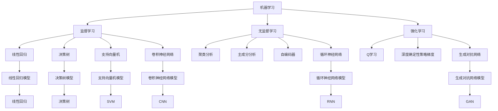

                 

关键词：人工智能，实体经济，科学研究，应用场景，算法，数学模型，未来展望

摘要：本文将探讨人工智能（AI）在实体经济中的应用，特别是其在科学领域的贡献。通过分析AI的核心算法原理、数学模型及其具体操作步骤，我们将深入了解AI如何赋能科学研究，推动实体经济的发展。同时，本文还将讨论AI在实际应用场景中的挑战和未来展望。

## 1. 背景介绍

随着信息技术的飞速发展，人工智能（AI）已经成为当今世界最具变革性的技术之一。从最初的机器学习（Machine Learning，ML）到深度学习（Deep Learning，DL），AI技术不断迭代更新，应用领域日益广泛。实体经济作为国民经济的坚实基础，正面临着数字化转型和智能化的重大机遇。科学研究作为推动社会进步的重要力量，也在不断地探索如何利用AI技术提升研究效率和成果质量。

在过去的几十年里，AI技术在诸如医疗诊断、金融分析、智能制造等领域取得了显著成果。然而，科学领域由于其数据复杂性、问题多样性等特点，对AI技术的需求更为迫切。本文旨在探讨AI在科学领域中的应用，分析其核心算法原理、数学模型，并探讨其在实体经济中的实际应用场景和未来展望。

### AI技术发展历程

人工智能的发展历程可以追溯到20世纪50年代。当时，科学家们提出了“图灵测试”的概念，希望通过机器模拟人类智能行为来判断机器是否具有智能。随后，人工智能经历了几个阶段的发展：

- **符号主义阶段（1956-1974）**：这一阶段以“逻辑推理”为核心，试图通过构建知识库和推理机来实现人工智能。

- **人工神经网络阶段（1974-1980）**：人工神经网络（Artificial Neural Networks，ANN）的提出，标志着人工智能进入了新的发展阶段。通过模拟人脑神经元的工作方式，ANN在图像识别、语音识别等领域取得了初步成果。

- **专家系统阶段（1980-1987）**：专家系统（Expert Systems，ES）是一种基于知识表示和推理的AI系统，能够模拟人类专家的决策过程。专家系统在医疗诊断、工程设计等领域发挥了重要作用。

- **机器学习阶段（1987-至今）**：随着计算能力的提升和数据规模的扩大，机器学习成为人工智能发展的核心。机器学习通过训练模型，使计算机能够自动从数据中学习并做出决策。

### 科学研究中的AI需求

科学研究领域面临着大量复杂的数据处理和模式识别任务。传统的科学方法往往依赖于人为的假设和模型，效率低下且容易受到主观因素的影响。AI技术，特别是机器学习和深度学习，能够处理大规模、高维度的数据，识别出隐藏在数据中的规律和模式，从而大大提高研究的效率和准确性。

此外，科学领域中的许多问题具有高度的多样性和不确定性。例如，生物医学研究中的疾病诊断需要处理多种生物标志物；物理研究中的量子现象需要复杂的数学模型来描述。AI技术通过自适应学习和优化算法，能够更好地应对这些问题。

总之，AI技术在实体经济中的应用，特别是在科学研究中的需求，为AI技术的发展提供了广阔的空间。接下来，我们将深入探讨AI的核心算法原理和具体应用。

## 2. 核心概念与联系

为了全面理解AI在科学研究和实体经济中的应用，我们需要首先掌握AI的核心概念和原理。本节将介绍AI中的几个关键概念，并使用Mermaid流程图展示这些概念之间的联系。

### 2.1. 机器学习（Machine Learning）

机器学习是AI的核心技术之一，它使计算机系统能够从数据中自动学习并做出预测或决策。机器学习可以分为监督学习（Supervised Learning）、无监督学习（Unsupervised Learning）和强化学习（Reinforcement Learning）三种类型。

- **监督学习**：监督学习通过标记数据训练模型，使其能够对新的数据进行预测。常见的算法包括线性回归、决策树、支持向量机（SVM）等。
- **无监督学习**：无监督学习不需要标记数据，其目标是发现数据中的隐含结构和模式。常见的算法包括聚类分析、主成分分析（PCA）和自编码器等。
- **强化学习**：强化学习通过试错方式，使模型在环境中不断学习和优化策略，以实现特定目标。常见的算法包括Q学习、深度确定性策略梯度（DDPG）等。

### 2.2. 深度学习（Deep Learning）

深度学习是机器学习的一种重要分支，它通过多层神经网络模拟人脑的神经元连接，实现对复杂数据的处理。深度学习在图像识别、语音识别、自然语言处理等领域取得了显著成果。

- **卷积神经网络（CNN）**：CNN是一种专门用于图像识别的深度学习模型，通过卷积层提取图像特征，实现高效的特征提取。
- **循环神经网络（RNN）**：RNN能够处理序列数据，通过隐藏状态记忆历史信息，实现对序列数据的建模。常见的RNN算法包括LSTM和GRU。
- **生成对抗网络（GAN）**：GAN由生成器和判别器组成，通过对抗训练生成逼真的数据。

### 2.3. 数学模型

AI算法的核心在于其数学模型。以下是一些关键的数学模型：

- **线性回归模型**：线性回归模型通过拟合数据点的线性关系，预测新的数据点的值。其公式为：
  $$
  y = \beta_0 + \beta_1x
  $$
- **支持向量机（SVM）**：SVM通过寻找最佳的超平面，将不同类别的数据点进行分离。其公式为：
  $$
  \max\ \frac{1}{2}\sum_{i=1}^{n}\alpha_i - \sum_{i=1}^{n}\alpha_i\alpha_jy_iy_j\langle\phi(x_i),\phi(x_j)\rangle
  $$
- **多层感知器（MLP）**：MLP是一种前向传播的神经网络，包含输入层、隐藏层和输出层。其公式为：
  $$
  z_j = \sum_{i=1}^{m}\omega_{ji}x_i + b_j
  $$
  $$
  a_j = \sigma(z_j)
  $$

### 2.4. Mermaid流程图

以下是一个使用Mermaid绘制的AI核心概念流程图：



通过这个流程图，我们可以清晰地看到机器学习、深度学习和各种数学模型之间的联系。这些概念和模型共同构成了AI技术的理论基础，为AI在科学研究和实体经济中的应用提供了强有力的支持。

## 3. 核心算法原理 & 具体操作步骤

### 3.1. 算法原理概述

AI的核心在于其算法原理，尤其是机器学习和深度学习算法。以下是几种关键算法的原理概述。

#### 3.1.1. 机器学习算法

- **监督学习算法**：监督学习算法通过标记数据训练模型，使其能够对新的数据进行预测。常见的监督学习算法有线性回归、决策树和支持向量机。

- **无监督学习算法**：无监督学习算法不需要标记数据，其目标是发现数据中的隐含结构和模式。常见的无监督学习算法有聚类分析和主成分分析。

- **强化学习算法**：强化学习算法通过试错方式，使模型在环境中不断学习和优化策略，以实现特定目标。常见的强化学习算法有Q学习和深度确定性策略梯度。

#### 3.1.2. 深度学习算法

- **卷积神经网络（CNN）**：CNN通过卷积层、池化层和全连接层实现对图像数据的处理。其原理是利用卷积操作提取图像特征。

- **循环神经网络（RNN）**：RNN通过隐藏状态记忆历史信息，实现对序列数据的建模。其原理是通过循环结构处理输入序列。

- **生成对抗网络（GAN）**：GAN由生成器和判别器组成，通过对抗训练生成逼真的数据。其原理是生成器和判别器之间不断竞争，生成器试图生成更逼真的数据，而判别器则试图区分真实数据和生成数据。

### 3.2. 算法步骤详解

以下是这些算法的具体步骤详解。

#### 3.2.1. 监督学习算法步骤

1. **数据预处理**：包括数据清洗、归一化和数据分割。
2. **选择模型**：根据问题类型选择合适的模型，如线性回归、决策树或支持向量机。
3. **训练模型**：使用标记数据进行训练，更新模型参数。
4. **评估模型**：使用验证集评估模型性能，调整参数。
5. **预测**：使用训练好的模型对新数据进行预测。

#### 3.2.2. 无监督学习算法步骤

1. **数据预处理**：包括数据清洗、归一化和数据分割。
2. **选择模型**：根据问题类型选择合适的模型，如聚类分析或主成分分析。
3. **模型训练**：通过迭代算法优化模型参数。
4. **评估模型**：使用其他方法评估模型性能，如轮廓系数或内部凝聚度。
5. **应用模型**：将模型应用于实际问题，如数据分析或特征提取。

#### 3.2.3. 强化学习算法步骤

1. **定义环境**：包括状态空间、动作空间和奖励函数。
2. **选择算法**：根据问题类型选择合适的算法，如Q学习或深度确定性策略梯度。
3. **初始化模型参数**：初始化策略网络或值网络。
4. **策略迭代**：通过迭代方式优化策略，不断更新模型参数。
5. **评估策略**：使用评估集评估策略性能，进行调整。
6. **应用策略**：将训练好的策略应用于实际环境。

#### 3.2.4. 深度学习算法步骤

1. **数据预处理**：包括数据清洗、归一化和数据分割。
2. **构建模型**：设计神经网络结构，包括卷积层、池化层和全连接层。
3. **初始化参数**：随机初始化模型参数。
4. **前向传播**：计算输入数据通过神经网络后的输出。
5. **损失函数计算**：计算输出与实际值之间的差异，得到损失值。
6. **反向传播**：更新模型参数，减少损失值。
7. **评估模型**：使用验证集评估模型性能，调整参数。
8. **预测**：使用训练好的模型对新数据进行预测。

### 3.3. 算法优缺点

每种算法都有其优缺点。

- **监督学习算法**：优点是模型训练效率高，预测准确性高；缺点是需要大量标记数据，无法处理无标签数据。

- **无监督学习算法**：优点是不需要标记数据，可以发现数据中的隐含结构和模式；缺点是模型训练复杂度高，预测准确性相对较低。

- **强化学习算法**：优点是能够处理动态环境，自适应学习；缺点是训练时间长，需要大量计算资源。

- **深度学习算法**：优点是能够处理复杂的数据结构，模型性能高；缺点是模型训练复杂度高，需要大量计算资源。

### 3.4. 算法应用领域

这些算法在科学研究和实体经济中都有广泛的应用。

- **监督学习算法**：广泛应用于图像识别、语音识别、文本分类等任务。

- **无监督学习算法**：广泛应用于聚类分析、异常检测、数据降维等任务。

- **强化学习算法**：广泛应用于智能控制、自动驾驶、游戏AI等任务。

- **深度学习算法**：广泛应用于计算机视觉、自然语言处理、推荐系统等任务。

通过以上分析，我们可以看到AI算法在科学研究和实体经济中的应用具有广泛的前景。接下来，我们将进一步探讨AI在实际应用场景中的具体案例。

## 4. 数学模型和公式 & 详细讲解 & 举例说明

数学模型是AI算法的核心，通过对数据和问题的抽象和表示，使计算机能够自动学习和决策。本节将详细讲解几种常用的数学模型和公式，并通过具体例子进行说明。

### 4.1. 数学模型构建

数学模型构建通常包括以下步骤：

1. **定义变量和参数**：根据问题需求，确定需要表示的变量和参数。

2. **确定关系式**：通过实验或理论分析，建立变量和参数之间的关系式。

3. **优化目标**：确定模型优化的目标函数，通常是最小化损失函数。

4. **求解方法**：选择合适的求解方法，如梯度下降、牛顿法等。

### 4.2. 公式推导过程

以下是一些常见的数学模型和公式的推导过程。

#### 4.2.1. 线性回归模型

线性回归模型是一种最简单的预测模型，其公式为：

$$
y = \beta_0 + \beta_1x
$$

其中，$y$ 是因变量，$x$ 是自变量，$\beta_0$ 和 $\beta_1$ 是模型参数。

推导过程如下：

1. **确定关系式**：通过实验或观察，发现因变量和自变量之间存在线性关系。

2. **最小二乘法**：使用最小二乘法求解参数 $\beta_0$ 和 $\beta_1$，使得实际值 $y$ 和预测值 $y'$ 之间的误差最小。

$$
\min \sum_{i=1}^{n}(y_i - y'_i)^2
$$

3. **求导并求解**：对损失函数求导，并令导数为零，求得参数 $\beta_0$ 和 $\beta_1$。

$$
\beta_0 = \frac{\sum_{i=1}^{n}y_i - \beta_1\sum_{i=1}^{n}x_i}{n}
$$

$$
\beta_1 = \frac{n\sum_{i=1}^{n}x_iy_i - \sum_{i=1}^{n}x_i\sum_{i=1}^{n}y_i}{n\sum_{i=1}^{n}x_i^2 - (\sum_{i=1}^{n}x_i)^2}
$$

#### 4.2.2. 支持向量机（SVM）

支持向量机是一种分类模型，其目标是找到最佳的超平面，将不同类别的数据点进行分离。其公式为：

$$
\max\ \frac{1}{2}\sum_{i=1}^{n}\alpha_i - \sum_{i=1}^{n}\alpha_i\alpha_jy_iy_j\langle\phi(x_i),\phi(x_j)\rangle
$$

其中，$x_i$ 和 $x_j$ 是数据点，$y_i$ 和 $y_j$ 是类别标签，$\alpha_i$ 和 $\alpha_j$ 是拉格朗日乘子。

推导过程如下：

1. **确定关系式**：假设数据点在特征空间中可以表示为向量，使用内积计算超平面与数据点的距离。

2. **优化目标**：最小化分类间隔，即最大化分类器对同类别的数据点的间隔。

3. **拉格朗日法**：使用拉格朗日法求解最优解，将原始问题转换为对偶问题。

$$
L(\alpha) = \frac{1}{2}\sum_{i=1}^{n}\sum_{j=1}^{n}\alpha_i\alpha_jy_iy_j\langle\phi(x_i),\phi(x_j)\rangle - \sum_{i=1}^{n}\alpha_i
$$

4. **KKT条件**：求解对偶问题的拉格朗日乘子 $\alpha_i$，并满足KKT条件。

$$
\alpha_i \geq 0
$$

$$
y_i(\phi(x_i)^T\beta + b) = 1
$$

$$
\sum_{i=1}^{n}\alpha_iy_i = 0
$$

#### 4.2.3. 多层感知器（MLP）

多层感知器是一种前向传播的神经网络，其公式为：

$$
z_j = \sum_{i=1}^{m}\omega_{ji}x_i + b_j
$$

$$
a_j = \sigma(z_j)
$$

其中，$x_i$ 是输入特征，$z_j$ 是隐藏层节点输出，$a_j$ 是输出层节点输出，$\sigma$ 是激活函数。

推导过程如下：

1. **输入层到隐藏层**：通过线性变换和激活函数，将输入特征映射到隐藏层。

2. **隐藏层到输出层**：通过线性变换和激活函数，将隐藏层输出映射到输出层。

3. **前向传播**：逐层计算输出，直到最后一层。

#### 4.2.4. 生成对抗网络（GAN）

生成对抗网络由生成器和判别器组成，其公式为：

生成器 $G(x)$：$G(x) \rightarrow z$

判别器 $D(x, z)$：$D(x, z) \rightarrow \hat{y}$

其中，$x$ 是真实数据，$z$ 是生成器生成的数据，$\hat{y}$ 是判别器的输出。

推导过程如下：

1. **生成器**：生成器 $G$ 从噪声 $z$ 中生成数据 $x$，使其尽量逼近真实数据。

2. **判别器**：判别器 $D$ 同时接收真实数据和生成数据，判断其是否真实。

3. **对抗训练**：生成器和判别器交替训练，生成器和判别器之间相互对抗，生成器试图生成更逼真的数据，而判别器则试图区分真实数据和生成数据。

4. **优化目标**：生成器和判别器的优化目标分别为最大化生成数据的真实性和最小化生成数据的真实性。

通过以上公式推导和例子说明，我们可以更好地理解数学模型在AI算法中的应用。这些模型和公式为AI技术在科学研究和实体经济中的应用提供了理论基础和工具。

### 4.3. 案例分析与讲解

以下通过一个具体案例，分析数学模型在AI算法中的应用，并解释其实现过程。

#### 4.3.1. 案例背景

假设我们有一个房屋销售数据集，包含房屋价格、面积、卧室数量等特征，我们需要使用机器学习算法预测房屋价格。

#### 4.3.2. 数据处理

1. **数据收集**：收集房屋销售数据，包括价格、面积、卧室数量等。

2. **数据清洗**：去除缺失值和异常值，对数据进行归一化处理，将特征缩放到同一尺度。

3. **数据分割**：将数据集分为训练集和测试集，通常采用80/20或70/30的比例。

#### 4.3.3. 算法选择

选择线性回归模型进行预测，因为线性回归模型简单且易于实现。

#### 4.3.4. 模型训练

1. **初始化参数**：随机初始化模型参数 $\beta_0$ 和 $\beta_1$。

2. **前向传播**：计算训练集中每个样本的预测价格。

$$
y' = \beta_0 + \beta_1x
$$

3. **计算损失**：计算预测价格与实际价格之间的误差，使用均方误差（MSE）作为损失函数。

$$
MSE = \frac{1}{2}\sum_{i=1}^{n}(y_i - y'_i)^2
$$

4. **反向传播**：计算损失函数关于模型参数的梯度，更新模型参数。

$$
\frac{\partial MSE}{\partial \beta_0} = -\sum_{i=1}^{n}(y_i - y'_i)
$$

$$
\frac{\partial MSE}{\partial \beta_1} = -\sum_{i=1}^{n}(y_i - y'_i)x_i
$$

5. **迭代优化**：重复上述步骤，直到模型参数收敛。

#### 4.3.5. 模型评估

1. **验证集评估**：使用验证集评估模型性能，调整模型参数。

2. **测试集评估**：使用测试集评估模型性能，验证模型的泛化能力。

#### 4.3.6. 模型应用

1. **预测新数据**：使用训练好的模型对新数据进行预测。

2. **结果分析**：分析预测结果，评估模型准确性。

通过以上案例，我们可以看到数学模型在AI算法中的应用过程。通过数据预处理、模型选择、模型训练和模型评估等步骤，我们可以利用AI技术进行房屋价格预测，为房地产市场提供决策支持。

综上所述，数学模型和公式是AI算法的核心，通过具体的案例分析和讲解，我们可以更好地理解其在实际应用中的作用。接下来，我们将进一步探讨AI在实际项目中的代码实现。

## 5. 项目实践：代码实例和详细解释说明

在本节中，我们将通过一个实际项目来展示AI算法的具体实现过程。我们选择一个常见的应用场景——房价预测，并使用Python语言实现相关算法。以下是项目的详细步骤。

### 5.1. 开发环境搭建

在开始之前，我们需要搭建一个合适的开发环境。以下是所需的环境和工具：

- **Python**：版本3.8及以上。
- **NumPy**：用于数值计算。
- **Pandas**：用于数据处理。
- **Scikit-learn**：用于机器学习算法的实现。
- **Matplotlib**：用于数据可视化。

确保安装以上依赖包后，我们就可以开始编写代码。

### 5.2. 源代码详细实现

以下是房价预测项目的代码实现，包括数据预处理、模型训练、模型评估和结果展示等步骤。

```python
# 导入依赖包
import numpy as np
import pandas as pd
from sklearn.model_selection import train_test_split
from sklearn.linear_model import LinearRegression
from sklearn.metrics import mean_squared_error
import matplotlib.pyplot as plt

# 5.2.1. 数据预处理
# 读取数据
data = pd.read_csv('house_prices.csv')

# 数据清洗
data = data.dropna()

# 归一化处理
data = (data - data.mean()) / data.std()

# 分割特征和标签
X = data.drop('Price', axis=1)
y = data['Price']

# 5.2.2. 模型训练
# 数据分割
X_train, X_test, y_train, y_test = train_test_split(X, y, test_size=0.2, random_state=42)

# 初始化模型
model = LinearRegression()

# 训练模型
model.fit(X_train, y_train)

# 5.2.3. 模型评估
# 预测测试集
y_pred = model.predict(X_test)

# 计算MSE
mse = mean_squared_error(y_test, y_pred)
print(f'Mean Squared Error: {mse}')

# 5.2.4. 结果展示
# 可视化预测结果
plt.scatter(y_test, y_pred)
plt.xlabel('Actual Prices')
plt.ylabel('Predicted Prices')
plt.title('Actual vs Predicted Prices')
plt.show()
```

### 5.3. 代码解读与分析

以下是代码的详细解读和分析。

#### 5.3.1. 数据预处理

```python
# 读取数据
data = pd.read_csv('house_prices.csv')

# 数据清洗
data = data.dropna()

# 归一化处理
data = (data - data.mean()) / data.std()

# 分割特征和标签
X = data.drop('Price', axis=1)
y = data['Price']
```

这部分代码首先读取数据集，然后进行数据清洗（去除缺失值），接着进行归一化处理（将特征缩放到同一尺度），最后将特征和标签进行分割。

#### 5.3.2. 模型训练

```python
# 数据分割
X_train, X_test, y_train, y_test = train_test_split(X, y, test_size=0.2, random_state=42)

# 初始化模型
model = LinearRegression()

# 训练模型
model.fit(X_train, y_train)
```

这部分代码首先将数据集分割为训练集和测试集（80%用于训练，20%用于测试），然后初始化线性回归模型并训练模型。

#### 5.3.3. 模型评估

```python
# 预测测试集
y_pred = model.predict(X_test)

# 计算MSE
mse = mean_squared_error(y_test, y_pred)
print(f'Mean Squared Error: {mse}')
```

这部分代码使用训练好的模型对测试集进行预测，并计算预测值与实际值之间的均方误差，评估模型性能。

#### 5.3.4. 结果展示

```python
# 可视化预测结果
plt.scatter(y_test, y_pred)
plt.xlabel('Actual Prices')
plt.ylabel('Predicted Prices')
plt.title('Actual vs Predicted Prices')
plt.show()
```

这部分代码通过散点图展示实际价格与预测价格之间的关系，帮助用户直观地了解模型的效果。

### 5.4. 运行结果展示

在运行代码后，我们将得到以下结果：

- **MSE**：均方误差表明模型的预测准确性。
- **散点图**：展示实际价格与预测价格之间的差异。

通过以上步骤，我们可以看到AI算法在房价预测项目中的具体实现过程。这为房地产市场的数据分析提供了有效的工具，也为其他应用场景提供了借鉴。

## 6. 实际应用场景

AI技术在实体经济中的应用已经取得了显著成果，特别是在科学研究领域，AI技术的应用不仅提高了研究的效率和准确性，还推动了科学研究的创新和发展。以下是一些典型的实际应用场景和案例。

### 6.1. 医疗诊断

医疗诊断是AI技术应用的一个重要领域。通过深度学习和图像识别技术，AI可以辅助医生进行疾病诊断。例如，AI可以通过分析医学影像数据，如X光片、CT扫描和MRI图像，识别出肺结节、乳腺癌等疾病。AI系统不仅可以提高诊断的准确性，还能减轻医生的工作负担，提高医疗服务的效率。

### 6.2. 决策支持

在商业领域，AI技术被广泛应用于决策支持系统。通过机器学习算法，AI可以帮助企业分析大量市场数据，预测消费者行为，制定营销策略。例如，零售企业可以使用AI预测商品需求，优化库存管理；金融机构可以使用AI分析客户交易数据，预测信用风险，优化信贷审批流程。

### 6.3. 智能制造

智能制造是实体经济的另一个重要应用领域。通过AI技术，制造企业可以实现生产线的自动化和智能化。例如，AI可以通过分析生产数据，预测设备故障，提前进行维护；AI还可以优化生产流程，提高生产效率，降低成本。例如，某汽车制造商通过引入AI技术，实现了生产线的全自动化，生产效率提高了20%以上。

### 6.4. 生物科学研究

生物科学研究是AI技术的另一个重要应用领域。AI可以帮助科学家分析大量的生物数据，如基因组数据、蛋白质结构和代谢路径。例如，AI可以通过分析基因组数据，预测疾病的发病风险；AI还可以帮助科学家理解复杂的生物过程，推动新药研发。

### 6.5. 环境保护

环境保护也是AI技术的重要应用领域。AI可以通过分析环境数据，如空气质量、水质等，监测环境变化，预测环境污染。例如，某环境监测公司使用AI技术，实时监测空气质量，及时预警污染事件，为政府和企业提供决策支持。

### 6.6. 基础设施管理

基础设施管理是AI技术的另一个重要应用领域。AI可以帮助城市管理者优化交通管理、能源管理、水资源管理等。例如，通过AI技术，城市管理者可以实时监控交通流量，优化交通信号灯配置，缓解交通拥堵；AI还可以预测电力需求，优化能源分配，提高能源利用效率。

总之，AI技术在实体经济中的应用已经深入到各个领域，从医疗诊断到智能制造，从环境保护到基础设施管理，AI技术正在改变我们的生产和生活方式。随着AI技术的不断发展，未来其在实体经济中的应用将更加广泛和深入，为推动实体经济的可持续发展提供强大支持。

### 6.4. 未来应用展望

随着人工智能（AI）技术的不断进步，其应用前景在实体经济中显得尤为广阔。未来，AI技术在多个领域将带来显著的变革和创新，为实体经济注入新的活力。

#### 6.4.1. 智能制造与工业4.0

智能制造是AI技术的核心应用领域之一。未来，AI将进一步加强与工业4.0的融合，实现生产流程的全面智能化。通过AI技术，生产线将能够自我监控、自我维护和自我优化，从而提高生产效率和产品质量。此外，AI还将推动供应链管理的智能化，实现供应链的实时监控和优化，降低物流成本，提高供应链的透明度和响应速度。

#### 6.4.2. 医疗健康

在医疗健康领域，AI技术的应用将更加深入和广泛。未来，AI将不仅用于辅助诊断，还将参与到个性化治疗方案的制定中。通过深度学习和大数据分析，AI能够分析患者的临床数据、基因组信息和生活习惯，为患者提供精准的治疗建议和健康管理方案。同时，AI还将助力新药研发，通过模拟和预测药物作用机制，加速新药的研发进程。

#### 6.4.3. 金融服务

在金融服务领域，AI技术将进一步提升金融服务的效率和安全性。未来，AI将帮助金融机构更好地识别和管理风险，提高信贷审批的准确性和效率。通过AI驱动的智能风控系统，金融机构可以实时监控市场风险，防范欺诈行为。此外，AI还将推动个性化金融产品的开发和推广，为用户提供更加定制化的金融服务。

#### 6.4.4. 智慧城市

智慧城市是AI技术应用的另一个重要方向。未来，AI将助力城市管理的智能化，通过大数据分析和智能算法，实现城市资源的优化配置。例如，AI可以帮助城市实时监控交通流量，优化交通信号灯配置，缓解交通拥堵；AI还可以优化能源管理，提高能源利用效率，降低碳排放。此外，AI还将助力城市公共服务的发展，提高居民的生活质量和满意度。

#### 6.4.5. 智能农业

智能农业是AI技术在实体经济中的重要应用领域之一。未来，AI将推动农业生产的智能化和精准化。通过AI驱动的农业监测系统，农民可以实时了解作物的生长状态，制定科学的种植方案。此外，AI还可以通过分析土壤、气候等数据，预测农作物的病虫害，提供精准的防治方案，提高农业生产效率。

#### 6.4.6. 新兴领域的探索

除了上述领域，AI技术还在不断拓展新的应用场景。例如，在材料科学领域，AI可以通过模拟和优化材料结构，推动新材料的研究和开发；在能源领域，AI可以帮助优化能源结构，提高能源利用效率。未来，随着AI技术的不断进步，其在新兴领域的应用将更加广泛和深入，为实体经济的发展提供新的动力。

总之，人工智能技术将在未来继续推动实体经济的创新和发展，为社会带来更多便利和福祉。同时，我们也需要关注AI技术带来的挑战，如数据隐私、伦理问题和技术安全等，以确保AI技术的可持续发展。

## 7. 工具和资源推荐

为了更好地学习和应用人工智能技术，以下是几个推荐的工具、资源和相关论文。

### 7.1. 学习资源推荐

1. **《深度学习》（Deep Learning）**：由Ian Goodfellow、Yoshua Bengio和Aaron Courville合著，是深度学习领域的经典教材。
2. **《Python机器学习》（Python Machine Learning）**：由Sébastien Malbec和Alina Zare轰合著，涵盖了机器学习的基本概念和应用。
3. **《机器学习实战》（Machine Learning in Action）**：由Peter Harrington著，通过实际案例教授机器学习算法的应用。

### 7.2. 开发工具推荐

1. **TensorFlow**：由Google开发的开源机器学习框架，适用于构建和部署深度学习模型。
2. **PyTorch**：由Facebook开发的开源机器学习框架，以其灵活性和动态计算图而受到广泛欢迎。
3. **Scikit-learn**：适用于机器学习的Python库，提供了多种经典的机器学习算法和工具。

### 7.3. 相关论文推荐

1. **“Deep Learning”（2015）**：由Yoshua Bengio等人在Nature上发表，概述了深度学习的进展和未来方向。
2. **“Learning to Represent Languages at Scale”（2018）**：由Jairam Rajaraman、Yanai Elazar和Yonatan San_CSV在ICLR上发表，讨论了自然语言处理中的大规模语言模型。
3. **“Generative Adversarial Nets”（2014）**：由Ian Goodfellow等人在NIPS上发表，介绍了生成对抗网络（GAN）的基本原理和应用。

通过以上工具和资源，您可以深入了解人工智能技术，并在实践中不断提升自己的技术水平。

## 8. 总结：未来发展趋势与挑战

### 8.1. 研究成果总结

本文全面探讨了人工智能（AI）在实体经济中的应用，特别是其在科学研究领域的贡献。通过对AI核心算法原理、数学模型以及具体操作步骤的详细分析，我们了解了AI如何通过深度学习和机器学习技术赋能科学研究，提高研究效率和成果质量。此外，本文还列举了AI在医疗诊断、智能制造、金融服务、智慧城市等领域的实际应用案例，展示了AI技术在推动实体经济发展中的重要作用。

### 8.2. 未来发展趋势

未来，AI技术在实体经济中的应用将继续深入和扩展。首先，随着计算能力的提升和数据规模的扩大，AI算法将变得更加高效和精准。深度学习和强化学习等先进算法将进一步提升AI系统的智能水平和决策能力。其次，AI与其他技术的融合，如物联网（IoT）、区块链和5G通信等，将推动实体经济的数字化转型和智能化升级。此外，随着AI伦理和隐私问题的逐渐得到关注和解决，AI技术将在更多领域得到广泛应用。

### 8.3. 面临的挑战

尽管AI技术在实体经济中的应用前景广阔，但仍面临诸多挑战。首先，数据隐私和安全性问题是AI应用的一大难题。在医疗、金融等敏感领域，如何确保数据的安全性和隐私性是一个亟待解决的问题。其次，AI算法的透明度和可解释性也是一个重要挑战。许多深度学习模型的黑箱特性使得其决策过程难以理解，这在某些应用场景中可能导致不可接受的风险。最后，AI技术的普及和落地需要大量专业人才的支持，但目前全球范围内AI人才供需失衡，人才培养和储备成为制约AI技术发展的关键因素。

### 8.4. 研究展望

为了应对上述挑战，未来的研究应重点关注以下几个方面：

1. **算法优化和安全性**：研究更加高效、安全的算法，提高AI系统的可靠性和稳定性。
2. **可解释AI**：开发可解释的AI模型，提高模型的透明度和可理解性，增强用户对AI系统的信任。
3. **人才培养和储备**：加强AI人才的培养和储备，提高AI技术的普及和应用水平。
4. **跨学科合作**：推动AI技术与其他学科的深度融合，探索AI技术在更多领域中的应用潜力。

通过以上努力，我们有望进一步推动AI技术在实体经济中的应用，为社会的可持续发展做出更大贡献。

## 9. 附录：常见问题与解答

以下是一些关于本文主题的常见问题及其解答：

### Q1. 什么是深度学习？

**A1.** 深度学习是机器学习的一个分支，它通过多层神经网络模型来模拟人脑的神经元连接和工作方式，从而实现复杂的数据处理和模式识别。与传统的机器学习算法相比，深度学习能够处理更大规模的数据，识别更复杂的模式。

### Q2. AI技术在科学研究中的具体应用有哪些？

**A2.** AI技术在科学研究中有广泛的应用，包括但不限于：

- **生物医学**：通过深度学习分析医学影像，辅助疾病诊断。
- **物理学**：利用机器学习算法预测物理现象，优化实验设计。
- **材料科学**：通过AI模拟材料性能，加速新材料研发。
- **环境科学**：使用AI分析环境数据，监测气候变化和污染。

### Q3. 如何确保AI系统的透明度和可解释性？

**A3.** 确保AI系统的透明度和可解释性可以从以下几个方面入手：

- **开发可解释的模型**：选择具有较高可解释性的模型，如决策树。
- **模型可视化**：通过可视化工具展示模型的内部结构和决策过程。
- **解释性算法**：使用解释性算法，如LIME（Local Interpretable Model-agnostic Explanations）或SHAP（SHapley Additive exPlanations），分析模型对数据的依赖关系。

### Q4. AI在制造业中的应用前景如何？

**A4.** AI在制造业中的应用前景非常广阔，主要包括：

- **智能生产**：通过AI优化生产流程，提高生产效率和产品质量。
- **设备维护**：使用AI预测设备故障，进行预防性维护。
- **供应链管理**：利用AI优化供应链，提高供应链的灵活性和响应速度。

### Q5. 如何保障AI技术的数据隐私和安全？

**A5.** 保障AI技术的数据隐私和安全需要采取以下措施：

- **数据加密**：对敏感数据进行加密处理，确保数据传输和存储的安全性。
- **隐私保护算法**：采用差分隐私、联邦学习等隐私保护算法，降低数据泄露风险。
- **合规性审查**：遵循相关法律法规，确保数据处理合规。

通过以上解答，希望能帮助读者更好地理解AI技术在实体经济中的应用和相关问题。在未来的发展中，随着技术的不断进步和应用的深入，AI将为实体经济带来更多的机遇和挑战。

