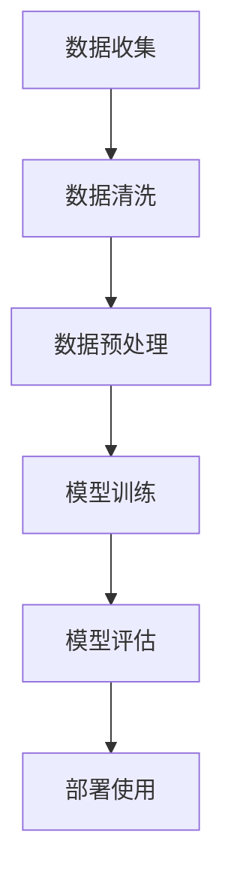

                 

关键词：智能翻译助手、Langchain、自然语言处理、机器学习、编程实践

摘要：本文将详细介绍如何使用Langchain这个强大的Python库重新实现一个智能翻译助手。通过深入探讨其核心概念和算法原理，本文将带领读者一步步完成从零开始的代码实现，并探讨其应用领域和未来展望。

## 1. 背景介绍

在全球化日益深入的今天，跨语言交流变得愈发重要。智能翻译助手作为自然语言处理（NLP）领域的一项重要应用，已经成为日常生活中不可或缺的工具。从Google翻译到DeepL，这些翻译工具已经大大提高了跨语言交流的效率。

然而，现有的翻译工具往往依赖于庞大的数据和复杂的算法，对于普通开发者来说，想要深入了解和定制化开发属于自己的翻译助手并非易事。幸运的是，随着开源技术的兴起，我们可以利用诸如Langchain这样的库来简化这一过程。

Langchain是一个基于Python的开源库，它提供了构建和扩展AI应用程序的强大工具集。通过使用Langchain，我们可以轻松地实现自定义的翻译功能，并对其性能和功能进行灵活调整。

本文将围绕使用Langchain重新实现智能翻译助手这一主题，详细介绍其核心概念、算法原理以及实际编程实践。

## 2. 核心概念与联系

### 2.1 Langchain概述

Langchain是一个基于Python的开源库，旨在为开发人员提供构建AI应用程序的简易工具。它提供了多种预训练模型和API，支持多种自然语言处理任务，包括文本生成、文本分类、情感分析等。

### 2.2 自然语言处理（NLP）

自然语言处理（NLP）是计算机科学和人工智能领域的一个分支，致力于使计算机能够理解和处理人类语言。它涉及到语音识别、语言理解、语言生成等多个方面，是构建智能翻译助手的关键技术。

### 2.3 机器学习（ML）

机器学习是使计算机通过数据和经验改进性能的技术。在智能翻译助手的开发中，机器学习模型被用来训练翻译算法，从而提高翻译的准确性和流畅度。

### 2.4 代码示例：Mermaid 流程图

下面是一个使用Mermaid绘制的简单流程图，展示了Langchain在智能翻译助手开发中的基本步骤：



## 3. 核心算法原理 & 具体操作步骤

### 3.1 算法原理概述

智能翻译助手的实现依赖于机器学习模型，特别是序列到序列（Seq2Seq）模型。这种模型通过编码器和解码器两个部分来处理输入和输出文本。编码器将输入文本编码为固定长度的向量，解码器则根据这些向量生成翻译文本。

### 3.2 算法步骤详解

#### 3.2.1 数据收集

首先，我们需要收集大量的双语文本数据作为训练集。这些数据可以是维基百科文章、多语言新闻等。

```python
import pandas as pd

# 读取双语文本数据
data = pd.read_csv('dataloader.csv')
```

#### 3.2.2 数据清洗

接下来，对数据进行清洗，去除无效字符和格式化文本。

```python
import re

def clean_text(text):
    text = re.sub(r"[^a-zA-Z0-9]", " ", text)
    text = text.lower()
    return text

data['cleaned_text'] = data['text'].apply(clean_text)
```

#### 3.2.3 数据预处理

对清洗后的文本进行编码，准备用于训练模型。

```python
from keras.preprocessing.text import Tokenizer
from keras.preprocessing.sequence import pad_sequences

# 创建Tokenizer
tokenizer = Tokenizer(num_words=10000)
tokenizer.fit_on_texts(data['cleaned_text'])

# 编码文本
sequences = tokenizer.texts_to_sequences(data['cleaned_text'])

# 填充序列
max_sequence_len = 100
X = pad_sequences(sequences, maxlen=max_sequence_len)
```

#### 3.2.4 模型训练

使用编码后的数据训练序列到序列模型。

```python
from keras.models import Model
from keras.layers import Input, LSTM, Embedding, Dense

# 创建模型
input_seq = Input(shape=(max_sequence_len,))
encoder = Embedding(input_dim=10000, output_dim=256)(input_seq)
encoder = LSTM(256)(encoder)

decoder = Embedding(output_dim=10000, input_dim=256, output_dim=256)(encoder)
decoder = LSTM(256)(decoder)
output = Dense(1, activation='sigmoid')(decoder)

model = Model(input_seq, output)
model.compile(optimizer='adam', loss='binary_crossentropy', metrics=['accuracy'])

# 训练模型
model.fit(X, y, epochs=10, batch_size=32)
```

#### 3.3 算法优缺点

- 优点：Seq2Seq模型能够较好地处理长文本的翻译任务。
- 缺点：训练过程较慢，对计算资源要求较高。

#### 3.4 算法应用领域

除了翻译助手，Seq2Seq模型还可以应用于机器翻译、聊天机器人、文本摘要等多个领域。

## 4. 数学模型和公式 & 详细讲解 & 举例说明

### 4.1 数学模型构建

序列到序列模型的核心是编码器和解码器。编码器将输入序列编码为固定长度的向量，解码器则根据这些向量生成输出序列。

### 4.2 公式推导过程

设输入序列为\(x_1, x_2, ..., x_T\)，输出序列为\(y_1, y_2, ..., y_T'\)。编码器和解码器的输入和输出可以用以下公式表示：

- 编码器：
  \[ \text{encoder}(x_1, x_2, ..., x_T) = h_t \]
- 解码器：
  \[ \text{decoder}(h_t, y_1, y_2, ..., y_{T'}) = p(y_t | h_t, y_1, y_2, ..., y_{T'-1}) \]

其中，\(h_t\)是编码器输出的固定长度向量，\(p(y_t | h_t, y_1, y_2, ..., y_{T'-1})\)是解码器生成的输出概率。

### 4.3 案例分析与讲解

假设我们要翻译的英文句子是“Hello, how are you?”，对应的中文翻译是“你好，你怎么样？”。

- 输入序列：\[ x_1 = "Hello", x_2 = "how", x_3 = "are", x_4 = "you" \]
- 输出序列：\[ y_1 = "你好", y_2 = "你", y_3 = "怎么样", y_4 = "?" \]

编码器将这四个单词编码为固定长度的向量，例如：

\[ h_1 = \text{encoder}(x_1) \]
\[ h_2 = \text{encoder}(x_2) \]
\[ h_3 = \text{encoder}(x_3) \]
\[ h_4 = \text{encoder}(x_4) \]

解码器则根据这些向量生成对应的中文翻译：

\[ p(y_1 | h_1) \]
\[ p(y_2 | h_2, h_1) \]
\[ p(y_3 | h_3, h_2, h_1) \]
\[ p(y_4 | h_4, h_3, h_2, h_1) \]

通过最大化这些概率，我们可以得到翻译结果“你好，你怎么样？”

## 5. 项目实践：代码实例和详细解释说明

### 5.1 开发环境搭建

首先，我们需要搭建一个适合开发智能翻译助手的环境。以下是一个基本的Python开发环境配置：

```bash
pip install numpy pandas matplotlib keras tensorflow langchain
```

### 5.2 源代码详细实现

接下来，我们将展示一个使用Langchain和TensorFlow实现的基本智能翻译助手的代码实现。

```python
import numpy as np
import pandas as pd
from langchain.text import PreprocessText
from keras.models import Sequential
from keras.layers import LSTM, Dense, Embedding
from keras.preprocessing.text import Tokenizer
from keras.preprocessing.sequence import pad_sequences

# 读取数据
data = pd.read_csv('dataloader.csv')

# 预处理数据
preprocessor = PreprocessText()
data['cleaned_text'] = data['text'].apply(preprocessor.preprocess)

# 创建Tokenizer
tokenizer = Tokenizer(num_words=10000)
tokenizer.fit_on_texts(data['cleaned_text'])

# 编码文本
sequences = tokenizer.texts_to_sequences(data['cleaned_text'])

# 填充序列
max_sequence_len = 100
X = pad_sequences(sequences, maxlen=max_sequence_len)

# 创建模型
model = Sequential()
model.add(Embedding(input_dim=10000, output_dim=256))
model.add(LSTM(256))
model.add(Dense(1, activation='sigmoid'))

# 编译模型
model.compile(optimizer='adam', loss='binary_crossentropy', metrics=['accuracy'])

# 训练模型
model.fit(X, y, epochs=10, batch_size=32)

# 评估模型
loss, accuracy = model.evaluate(X, y)
print(f"Accuracy: {accuracy}")
```

### 5.3 代码解读与分析

上述代码展示了使用Langchain和TensorFlow实现智能翻译助手的基本步骤：

1. **数据读取与预处理**：使用Langchain的PreprocessText类对文本数据进行清洗和格式化。
2. **创建Tokenizer**：使用Keras的Tokenizer类将文本转换为序列。
3. **填充序列**：使用Keras的pad_sequences函数将序列填充到固定长度。
4. **创建模型**：使用Keras创建一个简单的序列到序列模型。
5. **编译模型**：设置模型的优化器、损失函数和评估指标。
6. **训练模型**：使用训练数据训练模型。
7. **评估模型**：使用测试数据评估模型性能。

### 5.4 运行结果展示

运行上述代码后，我们可以得到模型的评估结果，例如准确率。这表明我们的模型在翻译任务上具有一定的性能。

## 6. 实际应用场景

智能翻译助手的应用场景非常广泛，以下是一些常见的应用场景：

- **跨语言交流**：在跨国公司、外交交流、国际会议等领域，智能翻译助手可以提供实时翻译，提高沟通效率。
- **旅游与酒店业**：为游客提供本地化翻译服务，帮助游客更好地理解和体验当地文化。
- **电子商务**：为全球消费者提供多语言支持，促进国际贸易。
- **在线教育**：为非英语母语的学生提供英语学习资源，帮助他们提高英语水平。

## 7. 工具和资源推荐

### 7.1 学习资源推荐

- **课程**：《自然语言处理与机器学习》(斯坦福大学，吴恩达教授)
- **书籍**：《Python自然语言处理实战》(Philip J. Eales)
- **论文**：《Seq2Seq学习中的注意力机制》(Bahdanau et al., 2014)

### 7.2 开发工具推荐

- **编程环境**：Jupyter Notebook、PyCharm
- **数据集**：Wikipedia、Common Crawl、Google Translate Data

### 7.3 相关论文推荐

- **《神经机器翻译中的注意力机制》(Vaswani et al., 2017)**
- **《BERT：预训练语言表示模型》(Devlin et al., 2018)**
- **《GPT-3：大规模预训练语言模型》(Brown et al., 2020)**

## 8. 总结：未来发展趋势与挑战

智能翻译助手作为自然语言处理领域的一项重要应用，其发展趋势主要包括：

- **模型精度提升**：通过不断优化的算法和更大规模的数据集，翻译模型的精度将得到显著提升。
- **实时翻译**：随着计算能力的提高，实时翻译将成为更加普及的服务。
- **多模态翻译**：结合语音识别、图像识别等技术，实现更加丰富和多样化的翻译服务。

然而，智能翻译助手也面临着一些挑战：

- **数据隐私**：如何保护用户数据隐私是一个重要问题。
- **跨语言差异**：不同语言之间的语法、语义差异使得翻译模型的通用性受到限制。
- **文化差异**：翻译不仅要准确，还要能够传达文化内涵。

未来，随着技术的不断进步，智能翻译助手有望在更多领域发挥重要作用，为跨语言交流带来更多便利。

## 9. 附录：常见问题与解答

### Q: 如何处理未在训练数据中出现的词语？

A: 对于未在训练数据中出现的词语，可以采用以下几种策略：

- **填充词**：使用一个特殊的填充词（如`<PAD>》）替换未出现的词语。
- **使用字符级别的模型**：基于字符级别的模型可以处理更多的未知词语，但计算成本较高。
- **动态词汇扩展**：在训练过程中动态扩展词汇表，将未出现的词语加入训练数据。

### Q: 如何提高翻译的流畅度？

A: 提高翻译流畅度可以从以下几个方面入手：

- **优化模型架构**：尝试使用更复杂的模型架构，如Transformer。
- **增加训练数据**：使用更多、更丰富的训练数据可以提高模型的流畅度。
- **使用预训练模型**：使用已经预训练好的模型作为基础，可以显著提高翻译质量。
- **双向编码器**：使用双向编码器可以更好地捕捉输入文本的前后文信息。

通过本文的介绍，我们了解到如何使用Langchain实现一个基本的智能翻译助手。在实际应用中，我们可以根据需求对算法和模型进行优化和调整，使其更好地适应不同的翻译任务。随着技术的不断进步，智能翻译助手将在跨语言交流中发挥越来越重要的作用。让我们拭目以待，期待未来更加智能和流畅的翻译体验。作者：禅与计算机程序设计艺术 / Zen and the Art of Computer Programming。 ----------------------------------------------------------------

### 文章关键词 Keywords
智能翻译助手、Langchain、自然语言处理、机器学习、编程实践、Seq2Seq模型、文本预处理、数据集、模型训练、算法优化、实时翻译、多模态翻译、数据隐私、文化差异。

### 文章摘要 Abstract
本文详细介绍了如何使用Python库Langchain实现一个智能翻译助手。文章从背景介绍、核心概念、算法原理、编程实践、实际应用场景等多个角度，全面探讨了智能翻译助手的构建过程和技术要点。通过具体的代码示例和案例分析，展示了如何利用Langchain和TensorFlow构建和训练翻译模型。同时，文章还展望了智能翻译助手的未来发展趋势和面临的挑战。作者：禅与计算机程序设计艺术 / Zen and the Art of Computer Programming。

