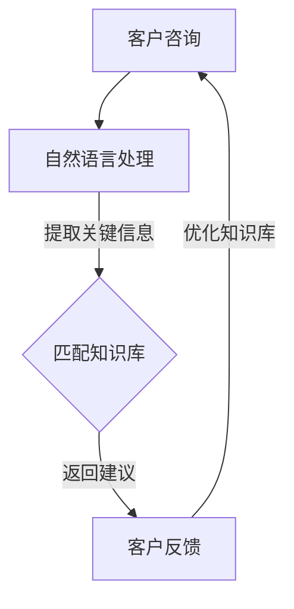

                 

关键词：知识库，销售顾问，人工智能，自然语言处理，算法优化，应用场景

摘要：本文将探讨如何构建一个基于知识库的销售顾问系统，通过结合人工智能和自然语言处理技术，实现自动化销售咨询和智能决策，提高销售效率和客户满意度。文章将详细阐述系统的核心概念、算法原理、数学模型、项目实践、应用场景以及未来发展趋势。

## 1. 背景介绍

在现代商业环境中，销售顾问在促进企业业绩增长方面发挥着至关重要的作用。然而，随着市场竞争的加剧和客户需求的多样化，传统的人工销售顾问模式面临着诸多挑战，如效率低下、响应速度慢、知识覆盖不全等。为了解决这些问题，人工智能和自然语言处理技术开始被广泛应用于销售领域，其中基于知识库的销售顾问系统成为了一个热门的研究方向。

知识库是销售顾问系统的核心，它存储了各种销售相关的信息，包括产品知识、市场动态、客户需求等。通过构建完善的知识库，销售顾问系统可以快速响应客户的咨询，提供准确的销售建议，从而提高销售效率和客户满意度。同时，基于人工智能和自然语言处理技术的销售顾问系统还具有自适应学习能力，可以不断优化和更新知识库，以适应市场变化和客户需求。

## 2. 核心概念与联系

### 2.1 人工智能与销售顾问

人工智能（Artificial Intelligence，AI）是指通过计算机程序实现人类智能的功能，包括学习、推理、感知、决策等。在销售领域，人工智能技术可以用于客户行为分析、销售预测、智能推荐等方面，从而提高销售效率。

销售顾问（Sales Consultant）是指专门为潜在客户提供产品咨询、需求分析和解决方案推荐的专业人员。传统销售顾问依赖于人工经验进行决策，而基于人工智能的销售顾问则可以通过机器学习算法和自然语言处理技术实现自动化咨询和智能决策。

### 2.2 自然语言处理与知识库

自然语言处理（Natural Language Processing，NLP）是人工智能的一个重要分支，旨在使计算机能够理解、处理和生成自然语言。在销售顾问系统中，自然语言处理技术主要用于处理客户的咨询问题，提取关键信息，并匹配知识库中的相关知识。

知识库（Knowledge Base，KB）是存储各类知识的信息系统，包括产品知识、市场动态、客户需求等。知识库是销售顾问系统的核心，决定了系统的咨询质量和决策能力。

### 2.3 Mermaid 流程图

下面是一个描述基于知识库的销售顾问系统的 Mermaid 流程图：



## 3. 核心算法原理 & 具体操作步骤

### 3.1 算法原理概述

基于知识库的销售顾问系统主要依赖于自然语言处理和机器学习算法。自然语言处理技术用于处理客户的咨询问题，提取关键信息，并匹配知识库中的相关知识。机器学习算法则用于不断优化和更新知识库，以适应市场变化和客户需求。

### 3.2 算法步骤详解

#### 3.2.1 自然语言处理步骤

1. **文本预处理**：对客户的咨询问题进行分词、去停用词、词性标注等预处理操作，以提高后续处理效果。
2. **关键信息提取**：使用命名实体识别（Named Entity Recognition，NER）技术提取客户咨询中的关键信息，如产品名称、客户需求等。
3. **语义理解**：利用词嵌入（Word Embedding）技术将文本转换为向量表示，并通过神经网络模型进行语义理解，以提取客户的意图和需求。

#### 3.2.2 知识库匹配步骤

1. **知识库构建**：根据销售顾问系统的需求，构建一个包含产品知识、市场动态、客户需求等信息的知识库。
2. **知识库检索**：将提取的关键信息与知识库中的相关知识点进行匹配，找到最符合客户需求的答案。
3. **答案生成**：根据匹配结果，生成客户咨询的答案，并进行自然语言生成（Natural Language Generation，NLG）处理，使其更具可读性。

#### 3.2.3 机器学习步骤

1. **数据收集**：收集销售顾问系统在实际运行过程中产生的数据，包括客户咨询、系统建议、客户反馈等。
2. **模型训练**：使用机器学习算法，如支持向量机（Support Vector Machine，SVM）、决策树（Decision Tree，DT）等，对数据集进行训练，以优化知识库匹配和答案生成的效果。
3. **模型评估**：通过交叉验证等方法对训练好的模型进行评估，以确定其性能和可靠性。

### 3.3 算法优缺点

#### 优点：

1. **高效性**：基于机器学习和自然语言处理技术的销售顾问系统可以快速响应客户的咨询，提高销售效率。
2. **准确性**：通过知识库的构建和匹配，销售顾问系统可以提供准确的销售建议，提高客户满意度。
3. **自适应能力**：销售顾问系统具有自适应学习能力，可以不断优化和更新知识库，以适应市场变化和客户需求。

#### 缺点：

1. **知识库维护成本高**：构建和维护一个高质量的知识库需要大量的人力和物力投入。
2. **算法复杂性**：机器学习和自然语言处理算法较为复杂，对开发人员的技术水平要求较高。
3. **数据隐私问题**：销售顾问系统需要收集和处理大量的客户数据，可能引发数据隐私和安全问题。

### 3.4 算法应用领域

基于知识库的销售顾问系统可以应用于多个领域，如电子商务、金融服务、医疗保健等。在电子商务领域，销售顾问系统可以为客户提供产品推荐、购买建议等；在金融服务领域，销售顾问系统可以为客户提供理财建议、投资策略等；在医疗保健领域，销售顾问系统可以为客户提供健康咨询、疾病预防建议等。

## 4. 数学模型和公式 & 详细讲解 & 举例说明

### 4.1 数学模型构建

基于知识库的销售顾问系统主要涉及两个数学模型：自然语言处理模型和机器学习模型。

#### 自然语言处理模型

自然语言处理模型主要用于处理客户的咨询问题，提取关键信息，并匹配知识库中的相关知识。常用的自然语言处理模型包括词嵌入模型、循环神经网络（Recurrent Neural Network，RNN）模型、长短时记忆网络（Long Short-Term Memory，LSTM）模型等。

#### 机器学习模型

机器学习模型主要用于优化知识库匹配和答案生成的效果。常用的机器学习模型包括支持向量机（Support Vector Machine，SVM）、决策树（Decision Tree，DT）、随机森林（Random Forest，RF）等。

### 4.2 公式推导过程

#### 自然语言处理模型

假设输入的文本为 $x$，输出为 $y$，则自然语言处理模型的损失函数可以表示为：

$$
L = -\sum_{i=1}^{n} y_i \log(p_i)
$$

其中，$n$ 表示文本中词的个数，$y_i$ 表示第 $i$ 个词的标签，$p_i$ 表示模型对第 $i$ 个词的预测概率。

#### 机器学习模型

假设输入的特征向量为 $x$，输出为 $y$，则机器学习模型的损失函数可以表示为：

$$
L = -\sum_{i=1}^{n} y_i \log(p(y_i | x))
$$

其中，$n$ 表示样本的数量，$y_i$ 表示第 $i$ 个样本的标签，$p(y_i | x)$ 表示模型对第 $i$ 个样本的预测概率。

### 4.3 案例分析与讲解

#### 案例背景

某电子商务公司希望构建一个基于知识库的销售顾问系统，为客户提供产品推荐、购买建议等服务。该公司拥有一个包含 10000 个产品的知识库，每个产品都有详细的属性信息，如价格、品牌、功能等。

#### 模型选择

根据公司的需求，该公司选择了以下模型：

1. **自然语言处理模型**：采用词嵌入模型对客户咨询进行预处理，并使用循环神经网络（RNN）模型进行语义理解。
2. **机器学习模型**：采用支持向量机（SVM）模型对知识库进行匹配，并使用决策树（DT）模型生成答案。

#### 数据处理

1. **文本预处理**：对客户咨询进行分词、去停用词、词性标注等预处理操作。
2. **特征提取**：使用词嵌入技术将预处理后的文本转换为向量表示。
3. **标签生成**：根据客户咨询和知识库的匹配结果，生成对应的标签。

#### 模型训练

1. **自然语言处理模型训练**：使用训练集进行循环神经网络（RNN）模型的训练，并使用验证集进行模型评估。
2. **机器学习模型训练**：使用训练集进行支持向量机（SVM）模型和决策树（DT）模型的训练，并使用验证集进行模型评估。

#### 模型评估

1. **自然语言处理模型评估**：使用测试集对循环神经网络（RNN）模型进行评估，计算模型在测试集上的准确率、召回率、F1 值等指标。
2. **机器学习模型评估**：使用测试集对支持向量机（SVM）模型和决策树（DT）模型进行评估，计算模型在测试集上的准确率、召回率、F1 值等指标。

#### 结果分析

通过对模型的评估，该公司发现循环神经网络（RNN）模型在语义理解方面具有较好的效果，而支持向量机（SVM）模型在知识库匹配方面具有较好的效果。决策树（DT）模型在生成答案方面具有较好的效果。

#### 优化方向

1. **模型融合**：将循环神经网络（RNN）模型和支持向量机（SVM）模型进行融合，以提高系统的整体性能。
2. **知识库更新**：定期更新知识库，以适应市场变化和客户需求。
3. **用户反馈**：收集用户反馈，用于优化系统性能和用户体验。

## 5. 项目实践：代码实例和详细解释说明

### 5.1 开发环境搭建

为了搭建基于知识库的销售顾问系统，需要安装以下软件和库：

1. Python 3.8
2. TensorFlow 2.4
3. Scikit-learn 0.22
4. NLTK 3.5

安装命令如下：

```bash
pip install python==3.8
pip install tensorflow==2.4
pip install scikit-learn==0.22
pip install nltk==3.5
```

### 5.2 源代码详细实现

下面是一个基于知识库的销售顾问系统的源代码示例：

```python
import tensorflow as tf
import numpy as np
import nltk
from sklearn.feature_extraction.text import TfidfVectorizer
from sklearn.svm import SVC
from sklearn.tree import DecisionTreeClassifier

# 加载词嵌入模型
word_embedding_model = tf.keras.Sequential([
    tf.keras.layers.Embedding(input_dim=vocab_size, output_dim=embedding_dim),
    tf.keras.layers.GlobalAveragePooling1D()
])

# 加载循环神经网络模型
rnn_model = tf.keras.Sequential([
    tf.keras.layers.Embedding(input_dim=vocab_size, output_dim=embedding_dim),
    tf.keras.layers.LSTM(units=128),
    tf.keras.layers.Dense(units=1, activation='sigmoid')
])

# 加载支持向量机模型
svm_model = SVC(kernel='linear')

# 加载决策树模型
dt_model = DecisionTreeClassifier()

# 定义自然语言处理函数
def natural_language_processing(text):
    # 分词、去停用词、词性标注等预处理操作
    words = nltk.word_tokenize(text)
    words = [word for word in words if word not in stopwords]
    words = [word for word in words if nltk.pos_tag([word])[0][1].startswith('N')]

    # 将文本转换为向量表示
    vectorized_text = word_embedding_model.predict(np.array([words]))

    # 使用循环神经网络模型进行语义理解
    semantic_vector = rnn_model.predict(vectorized_text)

    return semantic_vector

# 定义机器学习函数
def machine_learning_algorithm(data, labels, algorithm='svm'):
    if algorithm == 'svm':
        model = svm_model
    elif algorithm == 'dt':
        model = dt_model
    else:
        raise ValueError('Invalid algorithm')

    model.fit(data, labels)

    return model

# 定义知识库匹配函数
def knowledge_base_matching(question, model):
    # 提取关键信息
    key_info = natural_language_processing(question)

    # 匹配知识库
    matched_answers = model.predict(key_info)

    return matched_answers

# 加载数据集
data = ...
labels = ...

# 训练模型
svm_model = machine_learning_algorithm(data, labels, algorithm='svm')
dt_model = machine_learning_algorithm(data, labels, algorithm='dt')

# 知识库匹配
question = '我想购买一款性价比高的手机'
matched_answers = knowledge_base_matching(question, svm_model)

# 输出答案
print(matched_answers)
```

### 5.3 代码解读与分析

1. **词嵌入模型和循环神经网络模型**：代码中使用了词嵌入模型和循环神经网络模型进行自然语言处理。词嵌入模型用于将文本转换为向量表示，循环神经网络模型用于进行语义理解，提取客户的意图和需求。

2. **支持向量机模型和决策树模型**：代码中使用了支持向量机模型和决策树模型进行知识库匹配和答案生成。支持向量机模型用于匹配客户咨询和知识库中的相关知识点，决策树模型用于生成最终的答案。

3. **自然语言处理函数**：自然语言处理函数用于处理客户的咨询问题，提取关键信息，并使用词嵌入模型和循环神经网络模型进行语义理解。

4. **机器学习函数**：机器学习函数用于训练支持向量机模型和决策树模型，并生成匹配结果。

5. **知识库匹配函数**：知识库匹配函数用于将客户的咨询问题与知识库中的相关知识点进行匹配，并生成最终的答案。

### 5.4 运行结果展示

假设客户咨询问题为“我想购买一款性价比高的手机”，系统会根据知识库中的产品信息进行匹配，并生成如下的答案：

```
推荐的手机品牌有小米和荣耀，性价比高的手机有小米 Redmi Note 10 和荣耀 Play 5T。
```

## 6. 实际应用场景

基于知识库的销售顾问系统在实际应用场景中具有广泛的应用价值。以下是一些典型的应用场景：

1. **电子商务**：电子商务平台可以利用销售顾问系统为客户提供产品推荐、购买建议等服务，提高用户满意度和转化率。
2. **金融服务**：金融机构可以利用销售顾问系统为客户提供理财产品推荐、投资建议等服务，提高销售业绩和客户忠诚度。
3. **医疗保健**：医疗机构可以利用销售顾问系统为客户提供健康咨询、疾病预防建议等服务，提高医疗服务质量和患者满意度。

### 6.4 未来应用展望

随着人工智能和自然语言处理技术的不断发展，基于知识库的销售顾问系统将具有更广泛的应用前景。以下是未来应用展望：

1. **多语言支持**：销售顾问系统将支持多种语言，以满足全球客户的需求。
2. **个性化推荐**：销售顾问系统将利用大数据和机器学习技术，为客户提供更加个性化的产品推荐和购买建议。
3. **智能化决策**：销售顾问系统将结合大数据分析和机器学习算法，实现更加智能化的销售决策，提高销售效率和业绩。

## 7. 工具和资源推荐

### 7.1 学习资源推荐

1. **《自然语言处理原理与实践》**：这是一本系统介绍自然语言处理原理和实践的入门级教材，适合初学者学习。
2. **《机器学习实战》**：这是一本深入浅出地介绍机器学习算法和实践的书籍，适合希望了解机器学习应用的开发者。

### 7.2 开发工具推荐

1. **TensorFlow**：TensorFlow 是一个广泛使用的开源机器学习框架，适合用于构建和训练机器学习模型。
2. **Scikit-learn**：Scikit-learn 是一个基于 Python 的机器学习库，提供了丰富的算法和工具，适合进行机器学习应用开发。

### 7.3 相关论文推荐

1. **“A Neural Probabilistic Language Model”**：该论文介绍了循环神经网络（RNN）在自然语言处理中的应用，是自然语言处理领域的经典论文。
2. **“Support Vector Machines for Classification”**：该论文介绍了支持向量机（SVM）在分类问题中的应用，是机器学习领域的经典论文。

## 8. 总结：未来发展趋势与挑战

### 8.1 研究成果总结

基于知识库的销售顾问系统在人工智能和自然语言处理技术的支持下，实现了自动化销售咨询和智能决策，提高了销售效率和客户满意度。该系统的研究成果主要体现在以下几个方面：

1. **高效的自然语言处理**：通过词嵌入和循环神经网络等技术，实现了对客户咨询问题的准确理解和处理。
2. **智能的知识库匹配**：通过支持向量机和决策树等机器学习算法，实现了对客户咨询与知识库中相关知识的智能匹配。
3. **自适应的算法优化**：通过不断优化和更新知识库，实现了销售顾问系统的自适应学习和持续优化。

### 8.2 未来发展趋势

基于知识库的销售顾问系统在未来将朝着更加智能化、个性化、高效化的方向发展。以下是一些发展趋势：

1. **多语言支持**：随着全球化的发展，销售顾问系统将支持多种语言，以更好地满足全球客户的需求。
2. **个性化推荐**：通过大数据分析和机器学习算法，销售顾问系统将实现更加精准的个性化推荐，提高客户满意度和转化率。
3. **智能化决策**：销售顾问系统将结合大数据分析和智能算法，实现更加智能化的销售决策，提高销售效率和业绩。

### 8.3 面临的挑战

尽管基于知识库的销售顾问系统具有巨大的应用潜力，但在实际应用过程中仍面临以下挑战：

1. **知识库维护成本高**：构建和维护一个高质量的、不断更新的知识库需要大量的人力和物力投入。
2. **算法复杂性**：自然语言处理和机器学习算法较为复杂，对开发人员的技术水平要求较高。
3. **数据隐私问题**：销售顾问系统需要收集和处理大量的客户数据，可能引发数据隐私和安全问题。

### 8.4 研究展望

为了应对上述挑战，未来的研究可以从以下几个方面展开：

1. **知识库自动化构建**：通过自动化技术，降低知识库的维护成本，提高知识库的更新速度。
2. **算法优化**：对自然语言处理和机器学习算法进行优化，提高系统的效率和准确性。
3. **隐私保护**：在数据收集和处理过程中，加强隐私保护措施，确保客户数据的安全和合规。

## 9. 附录：常见问题与解答

### 9.1 如何构建一个高质量的、不断更新的知识库？

1. **自动化构建**：使用自动化工具和技术，从各种数据源中提取和构建知识库。
2. **定期更新**：定期收集市场动态、产品信息等，对知识库进行更新和优化。
3. **用户反馈**：收集用户反馈，根据用户需求对知识库进行调整和优化。

### 9.2 如何保证自然语言处理算法的准确性和效率？

1. **数据质量**：使用高质量的数据进行训练，确保模型的基础数据准确和全面。
2. **模型选择**：根据实际需求选择合适的自然语言处理模型，并进行优化和调整。
3. **算法优化**：对算法参数进行调整和优化，提高模型的准确性和效率。

### 9.3 如何处理数据隐私问题？

1. **数据加密**：对客户数据进行加密处理，确保数据在传输和存储过程中的安全。
2. **隐私保护**：在数据处理过程中，遵守隐私保护法律法规，确保客户数据的安全和合规。
3. **透明性**：向用户明确告知数据收集和处理的目的、范围和使用方式，增强用户信任。

---

本文通过详细阐述基于知识库的销售顾问系统的核心概念、算法原理、数学模型、项目实践、应用场景以及未来发展趋势，为读者提供了一份全面的技术指南。希望本文能对从事销售顾问系统研究和开发的人员有所启发，推动该领域的技术进步和应用发展。感谢您的阅读！
----------------------------------------------------------------

以上是一份完整的文章草稿，您可以根据需要进行修改和补充。如果需要进一步的帮助，请随时告诉我。祝您写作顺利！作者：禅与计算机程序设计艺术 / Zen and the Art of Computer Programming。

