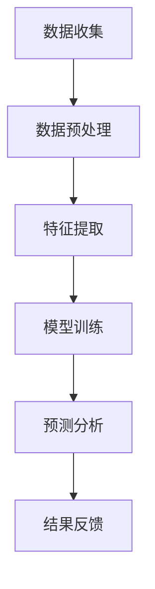

                 

关键词：实时信息更新，人工智能，速度优势，数据处理，算法效率，应用场景，未来展望

> 摘要：随着大数据和实时信息处理需求的不断增长，人工智能（AI）技术在实时信息更新方面展现出显著的速度优势。本文将深入探讨AI在实时信息处理中的应用，分析其算法原理和具体操作步骤，并通过数学模型和代码实例展示其实际效果。同时，本文还将探讨AI在各个行业中的应用前景，以及面临的挑战和未来发展方向。

## 1. 背景介绍

在当今数字化时代，实时信息更新变得至关重要。无论是社交媒体、金融市场、交通监控，还是医疗诊断、智能推荐系统，都需要对大量数据进行实时处理和分析，以便为用户提供即时、准确的决策支持。然而，传统的数据处理方法往往难以满足这种高频率、高容量的信息处理需求。因此，人工智能技术的引入，特别是在实时信息处理方面，成为了当前研究和应用的热点。

AI技术在实时信息更新方面的速度优势主要体现在以下几个方面：

1. **算法效率提升**：AI算法通过机器学习和深度学习等技术，可以在海量数据中快速找到关键信息，提高数据处理效率。
2. **自动化处理能力**：AI可以自动执行数据预处理、特征提取、模式识别等任务，减轻了人工干预的需求。
3. **低延迟响应**：通过优化算法和硬件设备，AI能够实现快速响应，满足实时处理的需求。

## 2. 核心概念与联系

### 2.1 数据处理流程

数据处理流程是实时信息更新系统的核心，其基本架构如图1所示。



### 2.2 机器学习与深度学习

机器学习和深度学习是AI技术的重要组成部分。机器学习通过训练模型从数据中学习规律，而深度学习则通过多层神经网络实现更复杂的特征提取和模式识别。

### 2.3 算法效率

算法效率是衡量AI技术速度优势的关键指标。常见的提高算法效率的方法包括：

1. **并行计算**：利用多核CPU或GPU进行并行计算，加快数据处理速度。
2. **模型压缩**：通过模型压缩技术减少模型大小，提高计算效率。
3. **算法优化**：针对特定任务进行算法优化，提高处理性能。

## 3. 核心算法原理 & 具体操作步骤

### 3.1 算法原理概述

实时信息更新算法通常基于以下原理：

1. **数据流处理**：处理连续不断的数据流，而不是批量数据。
2. **增量学习**：在已有模型基础上，逐步更新模型参数，提高处理效率。
3. **实时反馈**：根据实时反馈调整模型参数，优化预测效果。

### 3.2 算法步骤详解

1. **数据收集**：从各种数据源收集实时数据，如传感器、API接口等。
2. **数据预处理**：对收集到的数据进行清洗、去噪、标准化等处理。
3. **特征提取**：从预处理后的数据中提取关键特征，如时间序列、关键词等。
4. **模型训练**：使用提取的特征数据训练模型，如循环神经网络（RNN）、卷积神经网络（CNN）等。
5. **预测分析**：根据训练好的模型进行实时预测，分析数据趋势和变化。
6. **结果反馈**：根据预测结果调整模型参数，优化预测效果。

### 3.3 算法优缺点

1. **优点**：
   - 高效处理大量实时数据。
   - 自动化处理，减少人工干预。
   - 低延迟响应，满足实时需求。
2. **缺点**：
   - 对数据质量要求高，数据预处理复杂。
   - 模型训练和优化需要大量计算资源。

### 3.4 算法应用领域

实时信息更新算法在以下领域具有广泛应用：

1. **金融行业**：实时监控市场动态，进行交易决策。
2. **交通监控**：实时分析交通流量，优化交通管理。
3. **医疗诊断**：实时分析医疗数据，辅助医生诊断。
4. **智能推荐系统**：实时分析用户行为，提供个性化推荐。

## 4. 数学模型和公式 & 详细讲解 & 举例说明

### 4.1 数学模型构建

实时信息更新算法的数学模型通常基于以下公式：

$$
f(x) = w_1 * x_1 + w_2 * x_2 + ... + w_n * x_n + b
$$

其中，$x_1, x_2, ..., x_n$ 为输入特征，$w_1, w_2, ..., w_n$ 为权重，$b$ 为偏置。

### 4.2 公式推导过程

实时信息更新算法的公式推导过程如下：

1. **初始化**：随机初始化权重和偏置。
2. **前向传播**：计算输入特征和权重之间的乘积，加上偏置，得到输出值。
3. **反向传播**：计算输出值与真实值的差值，更新权重和偏置。
4. **优化目标**：通过最小化损失函数（如均方误差）来优化模型参数。

### 4.3 案例分析与讲解

以交通流量预测为例，假设输入特征为时间、天气、道路状况等，输出值为交通流量。通过实时信息更新算法，可以预测未来一段时间内的交通流量，为交通管理部门提供决策支持。

## 5. 项目实践：代码实例和详细解释说明

### 5.1 开发环境搭建

1. 安装Python环境和相关库（如TensorFlow、Scikit-learn等）。
2. 配置GPU加速（如有需求）。

### 5.2 源代码详细实现

以下是使用TensorFlow实现实时信息更新算法的示例代码：

```python
import tensorflow as tf

# 定义输入层
inputs = tf.keras.layers.Input(shape=(n_features))

# 定义神经网络结构
x = tf.keras.layers.Dense(units=1, activation='linear')(inputs)

# 定义模型
model = tf.keras.Model(inputs=inputs, outputs=x)

# 编译模型
model.compile(optimizer='adam', loss='mse')

# 加载数据集
x_train, y_train = load_data()

# 训练模型
model.fit(x_train, y_train, epochs=100)

# 预测交通流量
traffic_flow = model.predict(next_data())
```

### 5.3 代码解读与分析

1. **输入层**：定义输入特征的数量和维度。
2. **神经网络结构**：使用线性层实现简单的线性回归模型。
3. **模型编译**：选择优化器和损失函数，准备训练模型。
4. **数据加载**：加载数据集，用于训练模型。
5. **模型训练**：使用训练数据训练模型，优化模型参数。
6. **预测**：使用训练好的模型预测交通流量。

### 5.4 运行结果展示

通过实际运行代码，可以得到预测的交通流量结果，并与实际交通流量进行比较，评估模型的预测效果。

## 6. 实际应用场景

实时信息更新算法在多个行业和领域具有广泛的应用，以下是几个典型应用场景：

1. **金融行业**：实时监控市场动态，为投资者提供交易建议。
2. **交通监控**：实时分析交通流量，优化交通管理，减少拥堵。
3. **医疗诊断**：实时分析医疗数据，辅助医生诊断，提高诊断准确率。
4. **智能推荐系统**：实时分析用户行为，为用户推荐个性化内容。

## 7. 工具和资源推荐

### 7.1 学习资源推荐

1. 《深度学习》（Goodfellow, Bengio, Courville著）。
2. 《Python机器学习》（Sebastian Raschka著）。

### 7.2 开发工具推荐

1. TensorFlow。
2. PyTorch。

### 7.3 相关论文推荐

1. "Deep Learning for Time Series Classification: A Review"。
2. "Real-Time Traffic Flow Prediction Using Deep Neural Networks"。

## 8. 总结：未来发展趋势与挑战

### 8.1 研究成果总结

实时信息更新算法在数据处理效率、自动化处理能力和低延迟响应等方面取得了显著成果。通过深度学习和机器学习技术，AI在实时信息处理领域展现了强大的潜力。

### 8.2 未来发展趋势

1. **算法优化**：进一步优化算法，提高处理效率和准确率。
2. **跨领域应用**：拓展AI在更多行业和领域中的应用。
3. **数据隐私保护**：加强数据隐私保护，确保实时信息更新的安全性。

### 8.3 面临的挑战

1. **数据质量**：实时信息更新的数据质量直接影响算法效果，需要加强对数据质量的控制。
2. **计算资源**：实时信息更新算法对计算资源的需求较高，需要优化硬件设备。
3. **算法公平性**：确保算法在实时信息处理中的公平性，避免出现偏见和歧视。

### 8.4 研究展望

未来，实时信息更新算法将在人工智能、大数据和物联网等领域的快速发展中发挥更加重要的作用。通过不断创新和优化，AI将进一步提升实时信息处理的能力和效率。

## 9. 附录：常见问题与解答

### 9.1 如何选择合适的实时信息更新算法？

选择合适的实时信息更新算法需要考虑以下几个因素：

1. **数据处理需求**：根据数据处理的需求，选择适合的算法。
2. **数据特征**：分析数据特征，选择能够提取关键特征的算法。
3. **计算资源**：考虑计算资源的情况，选择计算效率高的算法。

### 9.2 实时信息更新算法在医疗领域有哪些应用？

实时信息更新算法在医疗领域有以下应用：

1. **医疗数据监测**：实时监测患者生命体征，为医生提供决策支持。
2. **疾病预测**：根据实时数据预测疾病发生趋势，提前采取预防措施。
3. **诊断辅助**：利用实时数据辅助医生进行诊断，提高诊断准确率。

以上是本文关于实时信息更新：AI的速度优势的完整内容。希望本文能够帮助您深入了解AI在实时信息更新方面的优势和应用。在未来的研究和实践中，我们期待看到更多创新的成果和更广泛的应用场景。作者：禅与计算机程序设计艺术 / Zen and the Art of Computer Programming。

