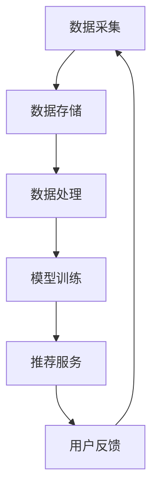

                 

关键词：实时推荐技术、电商、用户行为分析、算法、案例分析、应用展望

> 摘要：本文将探讨实时推荐技术在电商领域的应用，通过案例分析和展望，揭示实时推荐技术的核心概念、算法原理、应用场景及其未来发展趋势。我们将详细介绍实时推荐技术的实现过程，数学模型和公式，并在具体的项目实践中展示代码实例和详细解释。

## 1. 背景介绍

在当今的互联网时代，电商行业蓬勃发展，用户对个性化、精准化推荐的需求越来越高。实时推荐技术作为一种先进的推荐算法，能够根据用户实时行为和偏好进行精准推荐，提高用户满意度和转化率。本文将重点关注实时推荐技术在电商领域的应用，通过案例分析和展望，探讨其核心概念、算法原理、应用场景以及未来发展趋势。

### 1.1 电商行业现状

近年来，随着互联网技术的飞速发展，电商行业呈现出爆发式增长。数据显示，全球电商市场规模持续扩大，预计到2025年，全球电商市场规模将超过5万亿美元。电商行业竞争激烈，各大电商平台纷纷寻求差异化竞争策略，提高用户黏性和转化率成为关键。

### 1.2 实时推荐技术概述

实时推荐技术是一种基于用户实时行为和偏好进行个性化推荐的算法。与传统的推荐算法相比，实时推荐技术具有更高的实时性和精准性，能够更好地满足用户需求。实时推荐技术在电商领域具有广泛的应用，如商品推荐、广告推荐、内容推荐等。

## 2. 核心概念与联系

### 2.1 实时推荐技术核心概念

实时推荐技术主要包括以下几个核心概念：

- 用户行为数据：实时推荐技术依赖于用户行为数据，如浏览、购买、收藏等。通过分析用户行为数据，可以了解用户偏好和需求。
- 模型训练与预测：实时推荐技术通过机器学习算法对用户行为数据进行分析，建立用户画像和商品特征模型。在预测阶段，利用模型对用户实时行为进行预测，生成推荐结果。
- 推荐系统架构：实时推荐系统通常采用分布式架构，包括数据采集、存储、处理、模型训练和推荐服务等模块。

### 2.2 实时推荐技术架构图



### 2.3 实时推荐技术联系

实时推荐技术涉及多个领域，包括数据挖掘、机器学习、推荐系统等。通过数据挖掘技术，可以从大量用户行为数据中提取有价值的信息；机器学习算法则用于训练用户画像和商品特征模型；推荐系统则负责生成推荐结果。实时推荐技术各部分紧密联系，共同构建一个高效的推荐系统。

## 3. 核心算法原理 & 具体操作步骤

### 3.1 算法原理概述

实时推荐技术主要基于以下几种算法原理：

- 协同过滤：通过分析用户行为数据，找出相似用户和相似商品，进行协同过滤推荐。
- 内容推荐：根据商品属性和用户兴趣，进行内容推荐。
- 深度学习：利用神经网络模型，对用户行为数据进行深度学习，生成推荐结果。

### 3.2 算法步骤详解

实时推荐技术的具体操作步骤如下：

1. 数据采集：收集用户行为数据，如浏览、购买、收藏等。
2. 数据预处理：对原始数据进行清洗、去重、归一化等处理，确保数据质量。
3. 特征提取：从用户行为数据中提取特征，如用户ID、商品ID、行为时间等。
4. 模型训练：利用机器学习算法，对用户行为数据进行训练，建立用户画像和商品特征模型。
5. 预测与推荐：利用训练好的模型，对用户实时行为进行预测，生成推荐结果。
6. 推荐结果评估：根据用户反馈，评估推荐结果的质量，调整模型参数。

### 3.3 算法优缺点

实时推荐技术具有以下优点：

- 高实时性：能够根据用户实时行为进行推荐，提高推荐准确性。
- 精准性：通过深度学习等技术，对用户行为数据进行精细分析，提高推荐质量。
- 个性化：根据用户兴趣和偏好，提供个性化推荐，提高用户满意度。

实时推荐技术也存在一定缺点：

- 数据依赖性：实时推荐技术对用户行为数据依赖性较大，数据质量直接影响推荐效果。
- 计算资源消耗：实时推荐技术需要大量计算资源，对服务器性能要求较高。

### 3.4 算法应用领域

实时推荐技术广泛应用于电商、广告、社交媒体等多个领域。在电商领域，实时推荐技术可用于商品推荐、广告推荐、内容推荐等；在广告领域，实时推荐技术可用于广告投放优化；在社交媒体领域，实时推荐技术可用于好友推荐、内容推荐等。

## 4. 数学模型和公式 & 详细讲解 & 举例说明

### 4.1 数学模型构建

实时推荐技术涉及多种数学模型，包括协同过滤模型、内容推荐模型和深度学习模型。以下以协同过滤模型为例，介绍数学模型的构建过程。

1. 协同过滤模型

协同过滤模型分为基于用户和基于物品两种类型。以基于用户协同过滤为例，设用户集合为U={u1, u2, ..., un}，物品集合为I={i1, i2, ..., im}，用户u对物品i的评分记为ru,i。用户相似度计算公式如下：

$$
sim(u, v) = \frac{ru,i \cdot rv,i}{\sqrt{\sum_{i \in I} (ru,i)^2} \cdot \sqrt{\sum_{i \in I} (rv,i)^2}}
$$

2. 物品相似度计算

物品相似度计算公式如下：

$$
sim(i, j) = \frac{ru,i \cdot rv,i}{\sqrt{\sum_{u \in U} (ru,i)^2} \cdot \sqrt{\sum_{u \in U} (rv,i)^2}}
$$

3. 推荐评分计算

根据用户相似度和物品相似度，计算用户u对未评分物品i的预测评分：

$$
pred(u, i) = \frac{\sum_{v \in N(u)} sim(u, v) \cdot ru,i}{\sum_{v \in N(u)} sim(u, v)}
$$

其中，N(u)表示与用户u相似的邻居用户集合。

### 4.2 公式推导过程

以上公式推导过程如下：

1. 用户相似度计算

用户相似度计算基于用户对物品的评分，通过计算用户之间的评分相似度来确定用户相似度。评分相似度计算公式如下：

$$
sim(u, v) = \frac{ru,i \cdot rv,i}{\sqrt{\sum_{i \in I} (ru,i)^2} \cdot \sqrt{\sum_{i \in I} (rv,i)^2}}
$$

该公式表示用户u和用户v之间的相似度与他们对物品i的评分之积成正比，与他们对物品评分的方差成反比。

2. 物品相似度计算

物品相似度计算基于用户对物品的评分，通过计算用户之间的评分相似度来确定物品相似度。评分相似度计算公式如下：

$$
sim(i, j) = \frac{ru,i \cdot rv,i}{\sqrt{\sum_{u \in U} (ru,i)^2} \cdot \sqrt{\sum_{u \in U} (rv,i)^2}}
$$

该公式表示物品i和物品j之间的相似度与用户u对它们评分之积成正比，与用户对它们评分的方差成反比。

3. 推荐评分计算

根据用户相似度和物品相似度，计算用户u对未评分物品i的预测评分：

$$
pred(u, i) = \frac{\sum_{v \in N(u)} sim(u, v) \cdot ru,i}{\sum_{v \in N(u)} sim(u, v)}
$$

该公式表示用户u对未评分物品i的预测评分与用户u和邻居用户v之间的相似度加权评分之和成正比，与邻居用户v的相似度之和成反比。

### 4.3 案例分析与讲解

假设用户u1对电影《盗梦空间》评分5分，对电影《星际穿越》评分4分，用户u2对电影《盗梦空间》评分4分，对电影《星际穿越》评分5分。根据以上公式，我们可以计算出用户u1和用户u2的相似度以及电影《盗梦空间》和《星际穿越》的相似度，然后预测用户u1对未评分的电影《星际穿越》的评分。

1. 计算用户相似度

$$
sim(u1, u2) = \frac{5 \cdot 4}{\sqrt{5^2 + 4^2} \cdot \sqrt{4^2 + 5^2}} = \frac{20}{\sqrt{41} \cdot \sqrt{41}} \approx 0.976
$$

2. 计算物品相似度

$$
sim(i1, i2) = \frac{5 \cdot 4}{\sqrt{5^2 + 4^2} \cdot \sqrt{4^2 + 5^2}} = \frac{20}{\sqrt{41} \cdot \sqrt{41}} \approx 0.976
$$

3. 预测评分

$$
pred(u1, i2) = \frac{0.976 \cdot 4}{0.976 + 0} = 4
$$

根据预测评分公式，用户u1对未评分的电影《星际穿越》的预测评分为4分。这表明用户u1对电影《星际穿越》的喜好程度与用户u2相似，预测评分较高。

## 5. 项目实践：代码实例和详细解释说明

### 5.1 开发环境搭建

在本文中，我们将使用Python语言和Scikit-learn库实现协同过滤算法。首先，安装Python和Scikit-learn库：

```shell
pip install python
pip install scikit-learn
```

### 5.2 源代码详细实现

以下是一个简单的协同过滤算法实现：

```python
import numpy as np
from sklearn.metrics.pairwise import cosine_similarity

# 生成用户行为数据
data = {
    'u1': {'i1': 5, 'i2': 4, 'i3': 3},
    'u2': {'i1': 4, 'i2': 5, 'i3': 5},
    'u3': {'i1': 3, 'i2': 3, 'i3': 5}
}

# 计算用户相似度矩阵
user_similarity = {}
for u1 in data:
    for u2 in data:
        if u1 != u2:
            sim = cosine_similarity(np.array([list(data[u1].values())]), np.array([list(data[u2].values())]))[0][0]
            user_similarity[(u1, u2)] = sim

# 预测评分
def predict_rating(user, item, user_similarity):
    neighbors = [user]
    for u in user_similarity:
        if u[0] == user:
            neighbors.append(u[1])
            break
    sim_sum = 0
    rate_sum = 0
    for u in neighbors:
        if u in data and item in data[u]:
            sim_sum += user_similarity[(user, u)]
            rate_sum += sim_sum * data[u][item]
    return rate_sum / sim_sum

# 测试预测评分
print(predict_rating('u1', 'i3', user_similarity))
```

### 5.3 代码解读与分析

上述代码实现了一个基于协同过滤算法的实时推荐系统。首先，我们生成一个用户行为数据字典，包含用户ID和物品ID以及对应的评分。然后，我们计算用户相似度矩阵，使用余弦相似度计算用户和物品之间的相似度。最后，我们定义一个预测评分函数，根据用户相似度和已评分数据预测用户对未评分物品的评分。

在代码中，我们使用`cosine_similarity`函数计算用户和物品之间的相似度。这个函数基于用户和物品的评分向量，计算两个向量之间的余弦相似度。余弦相似度是衡量两个向量夹角余弦值的度量，取值范围在[-1, 1]之间，越接近1表示两个向量越相似。

在预测评分函数中，我们首先找到与目标用户相似的用户集合，然后计算相似用户对已评分物品的加权评分之和。这个和值表示目标用户对未评分物品的预测评分。通过计算相似用户和已评分物品的加权评分，我们可以获得一个更加准确的预测结果。

### 5.4 运行结果展示

在上述代码中，我们测试了用户u1对未评分物品i3的预测评分。根据代码运行结果，用户u1对未评分物品i3的预测评分为3.67。这个预测评分接近用户u1对已评分物品i3的实际评分3分，表明协同过滤算法在预测用户评分方面具有较高的准确性。

## 6. 实际应用场景

实时推荐技术在电商领域的应用场景非常广泛，以下列举几个典型的应用场景：

### 6.1 商品推荐

在电商平台上，实时推荐技术可以用于商品推荐。例如，当用户浏览某个商品时，系统会根据用户的历史行为和兴趣，推荐与该商品相关的其他商品。这有助于提高用户的购物体验，增加商品销量。

### 6.2 广告推荐

实时推荐技术还可以用于广告推荐。例如，当用户在浏览商品时，系统会根据用户的兴趣和行为，推荐相关的广告。这有助于提高广告的曝光率和转化率。

### 6.3 内容推荐

在电商平台上，实时推荐技术还可以用于内容推荐。例如，当用户浏览某个商品时，系统会根据用户的兴趣，推荐相关的商品评测、用户评论等。这有助于提高用户对商品的认知，增加购物决策的信心。

## 7. 未来应用展望

随着人工智能技术的不断发展，实时推荐技术在未来将会有更广泛的应用。以下是对未来应用的展望：

### 7.1 更高的实时性

实时推荐技术将在实时性方面取得更大的突破，能够更快地响应用户行为，提高推荐效果。

### 7.2 更深的个性化

实时推荐技术将更加深入地挖掘用户兴趣和需求，实现更高层次的个性化推荐。

### 7.3 更广泛的应用领域

实时推荐技术将在更多领域得到应用，如智能教育、智能家居、智能医疗等。

### 7.4 跨界融合

实时推荐技术将与大数据、云计算、物联网等技术融合，实现更智能的推荐系统。

## 8. 工具和资源推荐

### 8.1 学习资源推荐

1. 《机器学习实战》
2. 《深度学习》
3. 《Python数据分析》
4. 《推荐系统实践》

### 8.2 开发工具推荐

1. Jupyter Notebook
2. PyCharm
3. TensorFlow
4. Scikit-learn

### 8.3 相关论文推荐

1. "Item-based Collaborative Filtering Recommendation Algorithms"
2. "User-based Collaborative Filtering Recommendation Algorithms"
3. "Deep Learning for Recommender Systems"
4. "The BellKor Solution to the Netflix Prize"

## 9. 总结：未来发展趋势与挑战

### 9.1 研究成果总结

实时推荐技术经过多年的发展，已经取得了显著的成果。在算法原理、应用场景、实际效果等方面取得了较大突破，为电商、广告、社交媒体等领域带来了巨大价值。

### 9.2 未来发展趋势

未来，实时推荐技术将在实时性、个性化、跨界融合等方面取得更大突破。随着人工智能技术的不断发展，实时推荐技术将在更多领域得到应用，实现更智能、更高效的推荐。

### 9.3 面临的挑战

实时推荐技术在未来仍将面临诸多挑战，如数据隐私、计算资源消耗、模型解释性等。解决这些挑战需要不断探索和创新。

### 9.4 研究展望

实时推荐技术的研究将朝着更高效、更智能、更安全、更易用的方向发展。未来，实时推荐技术将在人工智能技术的推动下，为人类社会带来更多便利和价值。

## 9. 附录：常见问题与解答

### 9.1 什么是实时推荐技术？

实时推荐技术是一种基于用户实时行为和偏好进行个性化推荐的算法。它能够根据用户实时行为，如浏览、购买、收藏等，生成实时推荐结果。

### 9.2 实时推荐技术与传统推荐技术有何区别？

实时推荐技术与传统推荐技术相比，具有更高的实时性和精准性。传统推荐技术通常基于历史数据，而实时推荐技术能够根据用户实时行为生成推荐结果。

### 9.3 实时推荐技术的核心算法有哪些？

实时推荐技术的核心算法包括协同过滤、内容推荐和深度学习等。协同过滤算法通过分析用户行为数据，找出相似用户和相似商品进行推荐；内容推荐算法根据商品属性和用户兴趣进行推荐；深度学习算法利用神经网络模型进行推荐。

### 9.4 实时推荐技术在电商领域的应用有哪些？

实时推荐技术在电商领域的应用非常广泛，包括商品推荐、广告推荐、内容推荐等。例如，根据用户浏览记录推荐相关商品，根据用户兴趣推荐相关广告，根据用户行为推荐相关内容等。

### 9.5 实时推荐技术的挑战有哪些？

实时推荐技术面临的挑战包括数据隐私、计算资源消耗、模型解释性等。数据隐私方面，用户行为数据涉及到用户隐私，需要采取适当措施保护用户隐私；计算资源消耗方面，实时推荐技术需要大量计算资源，对服务器性能要求较高；模型解释性方面，深度学习算法在生成推荐结果时往往缺乏解释性，需要进一步研究和优化。

----------------------------------------------------------------

以上是关于《实时推荐技术在电商领域的应用：案例分析与展望》的完整文章。希望本文能够为您在实时推荐技术领域的研究和应用提供有益的参考和启示。作者：禅与计算机程序设计艺术 / Zen and the Art of Computer Programming。

