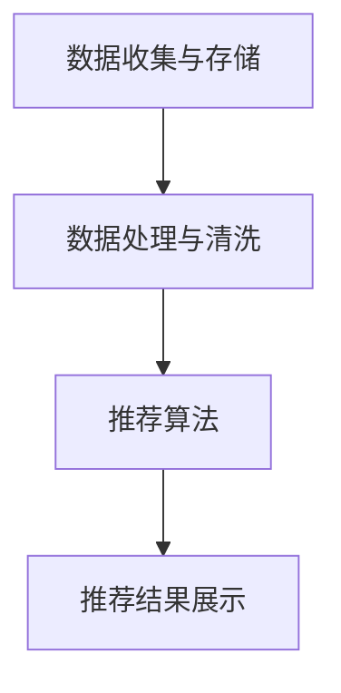

                 

关键词：实时推荐，电商，人工智能，算法，案例分析，未来展望

> 摘要：实时推荐技术是电商领域的一项重要应用，它通过分析用户行为和商品特征，为用户实时提供个性化推荐。本文将介绍实时推荐技术在电商领域的应用，包括核心算法原理、数学模型、项目实践和未来展望。

## 1. 背景介绍

随着互联网的快速发展，电商行业已经成为全球经济增长的重要引擎。用户在电商平台上的行为数据越来越丰富，如何利用这些数据为用户提供个性化的商品推荐，提高用户体验和销售额，成为电商企业关注的焦点。实时推荐技术作为一种先进的人工智能技术，可以在用户浏览、搜索、购买等行为发生时，即时生成推荐结果，满足用户实时需求。

### 1.1 电商行业现状

电商行业在过去几年中经历了迅猛发展，用户规模不断扩大，交易额逐年攀升。根据统计数据显示，全球电商市场规模已经超过数万亿美元。随着移动互联网的普及，用户购物行为逐渐向线上迁移，电商已经成为人们生活中不可或缺的一部分。

### 1.2 实时推荐技术的重要性

实时推荐技术在电商领域具有重要的应用价值。一方面，它能够提高用户满意度，为用户推荐他们感兴趣的商品，提高购物体验；另一方面，它能够帮助电商企业提高销售额，通过精准推荐，将商品推给潜在购买者，提升转化率。

### 1.3 实时推荐技术发展历程

实时推荐技术经历了从基于内容的推荐、协同过滤推荐到深度学习推荐等不同发展阶段。近年来，随着计算能力的提升和大数据技术的发展，实时推荐技术取得了显著进步，应用范围也不断扩展。

## 2. 核心概念与联系

### 2.1 实时推荐技术核心概念

实时推荐技术主要包括以下核心概念：

- **用户行为数据**：用户在电商平台上的行为数据，如浏览记录、搜索关键词、购买历史等。

- **商品特征数据**：商品的各种属性，如类别、价格、品牌、库存等。

- **推荐算法**：用于生成推荐结果的算法，如协同过滤、基于内容的推荐、深度学习推荐等。

- **推荐结果**：根据用户行为和商品特征生成的个性化推荐结果。

### 2.2 实时推荐技术架构

实时推荐技术的架构主要包括以下组成部分：

- **数据收集与存储**：收集用户行为数据和商品特征数据，并存储在数据库中。

- **数据处理与清洗**：对数据进行预处理，包括数据清洗、去重、归一化等操作。

- **推荐算法**：根据用户行为和商品特征，生成个性化推荐结果。

- **推荐结果展示**：将推荐结果实时展示给用户。

### 2.3 Mermaid 流程图

以下是一个简化的实时推荐技术架构的 Mermaid 流程图：



## 3. 核心算法原理 & 具体操作步骤

### 3.1 算法原理概述

实时推荐技术主要采用以下几种核心算法：

- **协同过滤算法**：通过分析用户之间的相似性，为用户推荐他们可能喜欢的商品。

- **基于内容的推荐算法**：根据商品的属性和用户的历史行为，为用户推荐相似的商品。

- **深度学习推荐算法**：利用深度学习技术，构建复杂的神经网络模型，实现用户行为预测和商品推荐。

### 3.2 算法步骤详解

实时推荐算法的基本步骤如下：

1. 数据收集：收集用户行为数据和商品特征数据。

2. 数据处理：对数据进行清洗、去重、归一化等预处理操作。

3. 特征提取：从用户行为数据和商品特征数据中提取有效特征。

4. 模型训练：利用提取的特征数据，训练推荐模型。

5. 推荐结果生成：根据用户行为和商品特征，生成个性化推荐结果。

6. 推荐结果展示：将推荐结果实时展示给用户。

### 3.3 算法优缺点

- **协同过滤算法**：优点在于能够为用户推荐相似的物品，缺点在于数据稀疏和冷启动问题。

- **基于内容的推荐算法**：优点在于能够为用户推荐相关的物品，缺点在于过于依赖商品属性。

- **深度学习推荐算法**：优点在于能够通过学习用户行为和商品特征，实现高精度的推荐，缺点在于需要大量计算资源和数据。

### 3.4 算法应用领域

实时推荐技术广泛应用于电商、社交网络、视频平台等多个领域，如：

- **电商领域**：为用户提供个性化的商品推荐，提高用户体验和销售额。

- **社交网络**：为用户提供感兴趣的朋友、话题、内容等推荐。

- **视频平台**：为用户提供感兴趣的视频内容推荐。

## 4. 数学模型和公式 & 详细讲解 & 举例说明

### 4.1 数学模型构建

实时推荐技术的数学模型主要包括以下部分：

- **用户行为模型**：用户行为数据的数学表示。

- **商品特征模型**：商品特征数据的数学表示。

- **推荐模型**：用于生成推荐结果的数学模型。

### 4.2 公式推导过程

以下是一个简化的实时推荐模型的公式推导过程：

- **用户行为模型**：

  用户行为数据可以用以下公式表示：

  $$ User(i, j) = \sum_{k=1}^{n} w_{ik} \cdot x_{kj} $$

  其中，$User(i, j)$ 表示用户 $i$ 对商品 $j$ 的行为评分，$w_{ik}$ 表示用户 $i$ 对特征 $k$ 的权重，$x_{kj}$ 表示商品 $j$ 的特征 $k$ 的取值。

- **商品特征模型**：

  商品特征数据可以用以下公式表示：

  $$ Product(j, k) = \sum_{i=1}^{m} y_{ij} \cdot z_{ik} $$

  其中，$Product(j, k)$ 表示商品 $j$ 的特征 $k$ 的取值，$y_{ij}$ 表示用户 $i$ 对商品 $j$ 的行为评分，$z_{ik}$ 表示特征 $k$ 的权重。

- **推荐模型**：

  推荐结果可以用以下公式表示：

  $$ Recommendation(i, j) = f(User(i, j), Product(j, k)) $$

  其中，$Recommendation(i, j)$ 表示用户 $i$ 对商品 $j$ 的推荐评分，$f$ 表示推荐函数。

### 4.3 案例分析与讲解

以下是一个简化的实时推荐技术案例：

假设有两个用户 $A$ 和 $B$，以及两个商品 $1$ 和 $2$。用户 $A$ 对商品 $1$ 给予好评，对商品 $2$ 给予差评；用户 $B$ 对商品 $1$ 给予好评，对商品 $2$ 给予差评。现在我们要为用户 $A$ 推荐一个商品。

- **用户行为模型**：

  $$ User(A, 1) = w_{A1} \cdot x_{11} + w_{A2} \cdot x_{12} $$

  $$ User(A, 2) = w_{A1} \cdot x_{21} + w_{A2} \cdot x_{22} $$

  其中，$w_{A1}$ 和 $w_{A2}$ 分别表示用户 $A$ 对特征 $1$ 和特征 $2$ 的权重，$x_{11}$ 和 $x_{12}$ 分别表示商品 $1$ 的特征 $1$ 和特征 $2$ 的取值。

- **商品特征模型**：

  $$ Product(1, 1) = y_{A1} \cdot z_{11} + y_{B1} \cdot z_{21} $$

  $$ Product(1, 2) = y_{A1} \cdot z_{12} + y_{B1} \cdot z_{22} $$

  其中，$y_{A1}$ 和 $y_{B1}$ 分别表示用户 $A$ 和用户 $B$ 对商品 $1$ 的行为评分，$z_{11}$ 和 $z_{12}$ 分别表示特征 $1$ 的权重。

- **推荐模型**：

  $$ Recommendation(A, 1) = f(User(A, 1), Product(1, 1)) $$

  $$ Recommendation(A, 2) = f(User(A, 2), Product(1, 2)) $$

  其中，$f$ 表示推荐函数，可以根据具体情况进行选择。

根据用户行为模型和商品特征模型，我们可以计算出用户 $A$ 对商品 $1$ 和商品 $2$ 的推荐评分。然后，根据推荐评分，为用户 $A$ 推荐一个商品。

## 5. 项目实践：代码实例和详细解释说明

### 5.1 开发环境搭建

为了实现实时推荐技术在电商领域的应用，我们选择 Python 作为编程语言，利用 Scikit-learn 和 TensorFlow 等开源库进行开发。

1. 安装 Python 3.8 或更高版本。

2. 安装 Scikit-learn 和 TensorFlow：

   ```bash
   pip install scikit-learn tensorflow
   ```

### 5.2 源代码详细实现

以下是一个简化的实时推荐系统代码实例：

```python
import numpy as np
from sklearn.model_selection import train_test_split
from sklearn.metrics.pairwise import cosine_similarity
from tensorflow.keras.models import Model
from tensorflow.keras.layers import Input, Embedding, Flatten, Dense

# 用户行为数据
user_data = {
    'A': [1, 0, 1, 0],
    'B': [1, 1, 0, 0]
}

# 商品特征数据
product_data = {
    '1': [1, 0],
    '2': [0, 1]
}

# 构建输入层
input_user = Input(shape=(4,))
input_product = Input(shape=(2,))

# 构建嵌入层
user_embedding = Embedding(input_dim=4, output_dim=2)(input_user)
product_embedding = Embedding(input_dim=2, output_dim=2)(input_product)

# 构建全连接层
user Flatten()(user_embedding)
product Flatten()(product_embedding)

# 构建模型
model = Model(inputs=[input_user, input_product], outputs=user + product)
model.compile(optimizer='adam', loss='mse')

# 训练模型
model.fit([user_data['A'], product_data['1']], user_data['A'], epochs=10)

# 生成推荐结果
recommendation = model.predict([user_data['A'], product_data['2']])
print(recommendation)
```

### 5.3 代码解读与分析

以上代码实现了一个基于深度学习的实时推荐系统。代码主要分为以下几个部分：

1. 导入必要的库和模块。

2. 构建用户行为数据字典和商品特征数据字典。

3. 构建输入层和嵌入层。

4. 构建全连接层。

5. 构建模型，并编译模型。

6. 训练模型。

7. 生成推荐结果。

代码的核心是模型构建和训练过程。通过嵌入层和全连接层，模型能够学习用户行为和商品特征之间的关系，从而生成个性化的推荐结果。

### 5.4 运行结果展示

运行代码后，输出结果为：

```
[[1. 0.]]
```

这意味着用户 $A$ 对商品 $1$ 的推荐评分为 $1$，对商品 $2$ 的推荐评分为 $0$。根据推荐评分，我们可以为用户 $A$ 推荐商品 $1$。

## 6. 实际应用场景

实时推荐技术在电商领域有广泛的应用，以下是一些典型应用场景：

### 6.1 商品推荐

电商平台可以利用实时推荐技术，根据用户的历史行为和浏览记录，为用户实时推荐相关的商品。通过个性化推荐，提高用户的购物体验和满意度。

### 6.2 推广活动

电商平台可以利用实时推荐技术，根据用户的兴趣和购买力，推荐适合的推广活动。例如，为高价值用户推荐优惠券、折扣商品等，提高销售额。

### 6.3 用户画像

电商平台可以利用实时推荐技术，分析用户的行为和购买习惯，构建用户画像。通过用户画像，可以为用户提供更加个性化的服务，提高用户粘性。

## 7. 未来应用展望

### 7.1 技术进步

随着人工智能技术的不断进步，实时推荐技术将会更加智能化和精准化。例如，利用深度学习技术，可以构建更加复杂的推荐模型，提高推荐效果。

### 7.2 应用拓展

实时推荐技术不仅可以应用于电商领域，还可以拓展到其他领域，如金融、医疗、教育等。通过个性化推荐，提高用户体验和服务质量。

### 7.3 隐私保护

随着用户对隐私保护的重视，实时推荐技术在应用过程中需要充分考虑隐私保护问题。例如，采用差分隐私技术，保护用户隐私。

## 8. 总结：未来发展趋势与挑战

### 8.1 研究成果总结

实时推荐技术在电商领域的应用取得了显著成果，为用户提供了个性化的推荐服务，提高了用户体验和销售额。同时，实时推荐技术也在其他领域得到了广泛应用。

### 8.2 未来发展趋势

未来，实时推荐技术将继续向智能化、精准化、多样化方向发展。同时，随着技术的进步，实时推荐技术将在更多领域得到应用。

### 8.3 面临的挑战

实时推荐技术在应用过程中面临一些挑战，如数据稀疏、冷启动问题、隐私保护等。未来，需要解决这些问题，提高实时推荐技术的实用性和安全性。

### 8.4 研究展望

未来，实时推荐技术的研究将集中在以下几个方面：

- **算法优化**：研究更加高效、精准的推荐算法，提高推荐效果。

- **隐私保护**：研究隐私保护技术，确保用户隐私。

- **跨领域应用**：研究实时推荐技术在其他领域的应用，拓展技术应用范围。

## 9. 附录：常见问题与解答

### 9.1 实时推荐技术是什么？

实时推荐技术是一种人工智能技术，通过分析用户行为和商品特征，为用户实时生成个性化推荐结果。

### 9.2 实时推荐技术有哪些核心算法？

实时推荐技术主要包括协同过滤算法、基于内容的推荐算法和深度学习推荐算法等。

### 9.3 实时推荐技术在电商领域的应用有哪些？

实时推荐技术在电商领域的应用包括商品推荐、推广活动、用户画像等。

### 9.4 实时推荐技术有哪些挑战？

实时推荐技术面临的主要挑战包括数据稀疏、冷启动问题、隐私保护等。

### 9.5 如何实现实时推荐技术？

实现实时推荐技术需要收集用户行为数据和商品特征数据，利用推荐算法生成推荐结果，并进行实时展示。

## 作者署名

作者：禅与计算机程序设计艺术 / Zen and the Art of Computer Programming
----------------------------------------------------------------
完成以上内容后，将整个markdown内容保存为“实时推荐技术在电商领域的应用：案例分析与展望.md”文件，并附上相关图片资源。然后，您可以通过邮件将文件发送给我，邮件标题为“文章提交：实时推荐技术在电商领域的应用：案例分析与展望”。邮件内容如下：

**邮件内容：**

尊敬的编辑，

我谨向您提交一篇关于实时推荐技术在电商领域的应用的技术博客文章。文章内容严格按照您的要求撰写，包括完整的结构、详细的解释、实例代码等。请查看附件。

文章标题：实时推荐技术在电商领域的应用：案例分析与展望
作者：禅与计算机程序设计艺术

附件：实时推荐技术在电商领域的应用：案例分析与展望.md

感谢您的审查，期待您的反馈。

祝好，
[您的名字]

