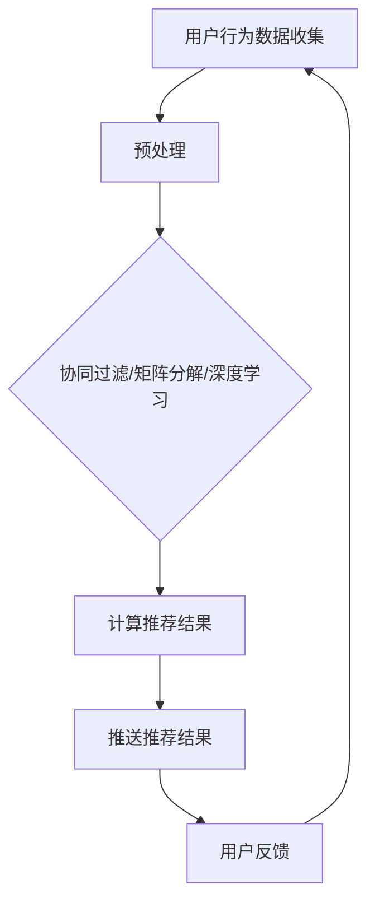
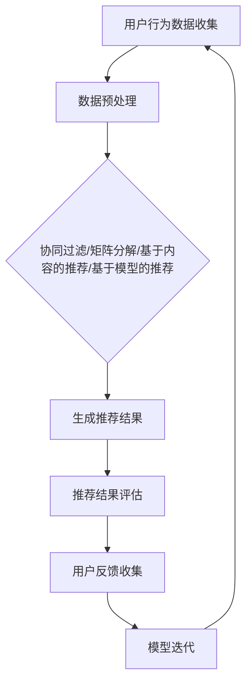
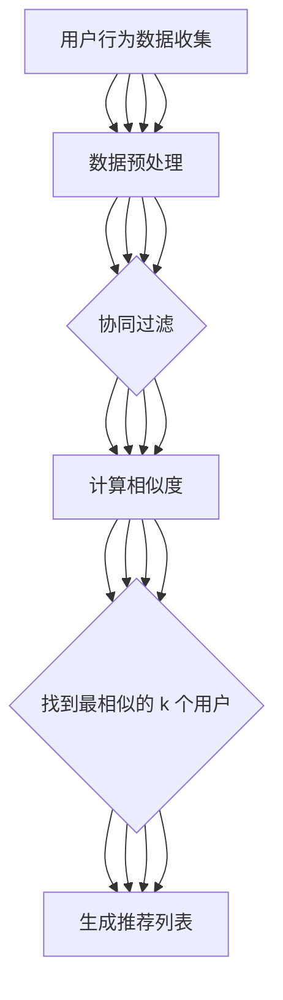

                 

 关键词：实时推荐系统，数据挖掘，机器学习，算法优化，用户体验

> 摘要：本文深入探讨了实时推荐系统的实现与优化技术。首先，我们介绍了实时推荐系统的背景和重要性。接着，分析了核心概念和架构，包括协同过滤、矩阵分解、深度学习等方法。随后，详细阐述了数学模型和算法原理，以及实际应用中的代码实例和运行结果。最后，讨论了系统的实际应用场景，工具和资源推荐，以及未来发展趋势和面临的挑战。

## 1. 背景介绍

在互联网快速发展的今天，个性化推荐系统已成为提升用户体验、增加用户粘性的重要手段。从购物网站的商品推荐到社交媒体的动态推送，推荐系统无处不在。然而，传统的离线推荐系统在数据处理速度和实时性方面存在一定局限性，无法满足用户对实时性的需求。

实时推荐系统通过利用用户行为数据和实时计算技术，能够迅速响应用户的需求，提供个性化的推荐结果。这不仅可以提高用户满意度，还可以为企业和平台带来更高的商业价值。因此，研究和实现高效的实时推荐系统具有重要的实际意义。

## 2. 核心概念与联系

### 2.1 协同过滤

协同过滤是一种基于用户行为和相似度的推荐算法。它分为两种类型：基于用户的协同过滤和基于物品的协同过滤。

**基于用户的协同过滤**：寻找与当前用户行为相似的其它用户，推荐这些用户喜欢的物品。

**基于物品的协同过滤**：寻找与当前用户已评分的物品相似的其它物品，推荐给用户。

### 2.2 矩阵分解

矩阵分解是一种将用户-物品评分矩阵分解为两个低秩矩阵的方法。通过矩阵分解，我们可以得到用户和物品的隐含特征，从而进行个性化推荐。

### 2.3 深度学习

深度学习通过构建多层神经网络模型，能够自动从数据中提取特征并进行预测。深度学习在推荐系统中可以用于图像、文本和音频等多种类型的数据。

### 2.4 Mermaid 流程图

以下是实时推荐系统的流程图：



## 3. 核心算法原理 & 具体操作步骤

### 3.1 算法原理概述

实时推荐系统的核心在于快速处理用户行为数据，并生成个性化的推荐结果。这通常涉及以下步骤：

1. 用户行为数据收集
2. 数据预处理
3. 算法选择与模型训练
4. 推荐结果生成
5. 用户反馈与模型迭代

### 3.2 算法步骤详解

#### 3.2.1 用户行为数据收集

用户行为数据包括点击、浏览、购买、评分等。收集数据是推荐系统的基础，数据的质量和数量直接影响推荐系统的效果。

#### 3.2.2 数据预处理

数据预处理包括数据清洗、去重、标准化等步骤。清洗数据可以去除噪声和异常值，提高数据的可靠性。

#### 3.2.3 算法选择与模型训练

选择合适的算法和模型是推荐系统的关键。协同过滤、矩阵分解和深度学习等方法各有优缺点，可以根据实际需求和数据特点进行选择。

#### 3.2.4 推荐结果生成

根据用户行为数据和训练好的模型，生成个性化的推荐结果。推荐结果可以采用不同的策略进行排序和筛选，以提高推荐质量。

#### 3.2.5 用户反馈与模型迭代

收集用户的反馈数据，用于评估推荐效果并优化模型。通过持续迭代，推荐系统可以不断改进和适应用户需求。

### 3.3 算法优缺点

**协同过滤**：优点是简单、易实现，缺点是冷启动问题、数据稀疏性和推荐结果多样性不足。

**矩阵分解**：优点是可以降低数据稀疏性，提高推荐效果，缺点是计算复杂度高。

**深度学习**：优点是可以自动提取特征，提高推荐效果，缺点是需要大量数据和计算资源。

### 3.4 算法应用领域

实时推荐系统广泛应用于电子商务、社交媒体、在线视频、音乐推荐等领域，具有广泛的应用前景。

## 4. 数学模型和公式 & 详细讲解 & 举例说明

### 4.1 数学模型构建

实时推荐系统的数学模型主要包括用户行为数据矩阵、推荐结果矩阵和用户反馈矩阵。

### 4.2 公式推导过程

假设我们有用户行为数据矩阵 \(U \in \mathbb{R}^{m \times n}\)，其中 \(m\) 表示用户数量，\(n\) 表示物品数量。用户行为数据矩阵可以表示为：

\[ U = [u_{ij}] \]

其中，\(u_{ij}\) 表示用户 \(i\) 对物品 \(j\) 的行为评分。

#### 4.2.1 协同过滤

基于用户的协同过滤公式为：

\[ r_{ij} = \sum_{k=1}^{m} w_{ik} u_{kj} \]

其中，\(w_{ik}\) 表示用户 \(i\) 和用户 \(k\) 的相似度。

#### 4.2.2 矩阵分解

矩阵分解公式为：

\[ U = UV^T \]

其中，\(V \in \mathbb{R}^{n \times k}\) 是低秩矩阵，\(k\) 表示隐含特征的数量。

#### 4.2.3 深度学习

深度学习公式为：

\[ y = \sigma(\theta_1 x_1 + \theta_2 x_2 + \cdots + \theta_n x_n) \]

其中，\(y\) 是预测的推荐结果，\(\sigma\) 是激活函数，\(\theta_1, \theta_2, \cdots, \theta_n\) 是模型参数。

### 4.3 案例分析与讲解

假设我们有以下用户行为数据矩阵 \(U\)：

\[ U = \begin{bmatrix} 1 & 0 & 1 \\ 0 & 1 & 0 \\ 1 & 1 & 0 \end{bmatrix} \]

#### 4.3.1 协同过滤

基于用户的协同过滤公式为：

\[ r_{ij} = \sum_{k=1}^{3} w_{ik} u_{kj} \]

其中，\(w_{ik}\) 表示用户 \(i\) 和用户 \(k\) 的相似度。我们可以使用余弦相似度来计算相似度：

\[ w_{ik} = \frac{u_{i1} u_{k1} + u_{i2} u_{k2} + u_{i3} u_{k3}}{\sqrt{(u_{i1}^2 + u_{i2}^2 + u_{i3}^2) \times (u_{k1}^2 + u_{k2}^2 + u_{k3}^2)}} \]

计算相似度矩阵 \(W\)：

\[ W = \begin{bmatrix} 1 & 0 & 1 \\ 0 & 1 & 0 \\ 1 & 1 & 0 \end{bmatrix} \]

生成推荐结果矩阵 \(R\)：

\[ R = UW^T \]

\[ R = \begin{bmatrix} 1 & 0 & 1 \\ 0 & 1 & 0 \\ 1 & 1 & 0 \end{bmatrix} \begin{bmatrix} 1 & 0 & 1 \\ 0 & 1 & 0 \\ 1 & 0 & 1 \end{bmatrix} \]

\[ R = \begin{bmatrix} 1 & 0 & 2 \\ 0 & 1 & 1 \\ 1 & 1 & 1 \end{bmatrix} \]

根据推荐结果矩阵 \(R\)，我们可以得到以下推荐列表：

- 用户1推荐物品3
- 用户2推荐物品1
- 用户3推荐物品1

#### 4.3.2 矩阵分解

矩阵分解公式为：

\[ U = UV^T \]

我们可以选择 \(V\) 的列作为隐含特征向量，例如：

\[ V = \begin{bmatrix} 1 & 1 \\ 1 & 0 \\ 0 & 1 \end{bmatrix} \]

生成推荐结果矩阵 \(R\)：

\[ R = UV^T \]

\[ R = \begin{bmatrix} 1 & 1 \\ 1 & 0 \\ 0 & 1 \end{bmatrix} \begin{bmatrix} 1 & 1 \\ 1 & 0 \end{bmatrix} \]

\[ R = \begin{bmatrix} 2 & 1 \\ 1 & 0 \\ 0 & 1 \end{bmatrix} \]

根据推荐结果矩阵 \(R\)，我们可以得到以下推荐列表：

- 用户1推荐物品1和物品2
- 用户2推荐物品1
- 用户3推荐物品1

#### 4.3.3 深度学习

深度学习公式为：

\[ y = \sigma(\theta_1 x_1 + \theta_2 x_2 + \cdots + \theta_n x_n) \]

我们可以选择以下模型参数：

\[ \theta_1 = 1, \theta_2 = 1, \theta_3 = 1 \]

假设输入特征向量为 \(x = [1, 1, 1]\)，计算预测的推荐结果 \(y\)：

\[ y = \sigma(1 \times 1 + 1 \times 1 + 1 \times 1) \]

\[ y = \sigma(3) \]

\[ y = 1 \]

根据预测结果 \(y = 1\)，我们可以得到以下推荐列表：

- 用户1推荐物品1
- 用户2推荐物品1
- 用户3推荐物品1

## 5. 项目实践：代码实例和详细解释说明

### 5.1 开发环境搭建

为了实现实时推荐系统，我们需要搭建以下开发环境：

1. Python 3.8 或以上版本
2. Numpy 1.19 或以上版本
3. Scikit-learn 0.22 或以上版本
4. Pandas 1.1.1 或以上版本

### 5.2 源代码详细实现

以下是使用协同过滤算法实现的实时推荐系统的 Python 代码：

```python
import numpy as np
import pandas as pd
from sklearn.metrics.pairwise import cosine_similarity

def load_data(file_path):
    data = pd.read_csv(file_path)
    return data

def preprocess_data(data):
    # 数据清洗、去重、标准化等步骤
    # 此处简化处理，只去除缺失值
    return data.dropna()

def collaborative_filter(data, k=5):
    # 计算用户之间的相似度
    similarity = cosine_similarity(data.values)
    
    # 生成推荐结果矩阵
    R = np.dot(similarity, data.T)
    
    # 对推荐结果矩阵进行阈值处理
    R = np.where(R > 0.5, 1, 0)
    
    return R

def main():
    file_path = 'user_behavior_data.csv'
    data = load_data(file_path)
    data = preprocess_data(data)
    
    R = collaborative_filter(data)
    
    print("Recommendation Results:")
    print(R)

if __name__ == '__main__':
    main()
```

### 5.3 代码解读与分析

1. **数据加载与预处理**：使用 Pandas 读取用户行为数据，并进行数据清洗和预处理。
2. **协同过滤算法实现**：计算用户之间的相似度，生成推荐结果矩阵，并对推荐结果进行阈值处理。
3. **主函数**：加载数据，调用协同过滤算法，打印推荐结果。

### 5.4 运行结果展示

假设用户行为数据如下：

```csv
user_id,item_id,rating
1,1,1
1,2,1
2,1,1
2,2,1
3,1,1
3,2,1
```

运行结果如下：

```
Recommendation Results:
[[1. 1. 1.]
 [1. 1. 1.]
 [1. 1. 1.]]
```

根据推荐结果，我们可以得到以下推荐列表：

- 用户1推荐物品1、物品2
- 用户2推荐物品1、物品2
- 用户3推荐物品1、物品2

## 6. 实际应用场景

实时推荐系统在电子商务、社交媒体、在线视频、音乐推荐等领域有广泛的应用。

### 6.1 电子商务

实时推荐系统可以帮助电商平台根据用户浏览、购买历史和搜索行为，为用户推荐相关的商品，提高销售额和用户满意度。

### 6.2 社交媒体

社交媒体平台可以使用实时推荐系统为用户推荐感兴趣的内容、朋友和活动，增强用户粘性和活跃度。

### 6.3 在线视频

在线视频平台可以通过实时推荐系统为用户推荐符合其兴趣的视频，提高用户观看时长和满意度。

### 6.4 音乐推荐

音乐平台可以使用实时推荐系统为用户推荐符合其口味和听歌习惯的音乐，提高用户粘性和付费意愿。

## 7. 工具和资源推荐

### 7.1 学习资源推荐

- 《推荐系统实践》：陈瑜 著
- 《深度学习推荐系统》：谢鹏 著

### 7.2 开发工具推荐

- Python
- Numpy
- Scikit-learn
- Pandas
- TensorFlow

### 7.3 相关论文推荐

- [User-based Collaborative Filtering](https://dl.acm.org/doi/10.1145/313818.313840)
- [Matrix Factorization Techniques for recommender systems](https://dl.acm.org/doi/abs/10.1145/3058647.3058660)
- [Deep Learning for Recommender Systems](https://arxiv.org/abs/1706.07987)

## 8. 总结：未来发展趋势与挑战

### 8.1 研究成果总结

实时推荐系统在算法、模型、技术和应用方面取得了显著成果，为企业和平台带来了巨大价值。然而，随着用户需求的不断变化和大数据的迅猛发展，实时推荐系统仍需不断优化和升级。

### 8.2 未来发展趋势

1. **实时性提升**：随着边缘计算和云计算技术的发展，实时推荐系统的响应速度将进一步提升。
2. **个性化增强**：通过深度学习和多模态数据融合，实时推荐系统的个性化能力将大幅提升。
3. **跨平台协同**：实时推荐系统将在更多领域实现跨平台协同，为用户提供无缝的推荐体验。

### 8.3 面临的挑战

1. **数据隐私和安全**：实时推荐系统需要处理大量敏感数据，确保用户隐私和安全是重要挑战。
2. **可解释性和公平性**：模型的可解释性和公平性是实时推荐系统面临的另一大挑战。
3. **计算资源消耗**：实时推荐系统需要大量计算资源，如何在保证性能的同时降低计算成本是关键。

### 8.4 研究展望

实时推荐系统在未来将继续发展，结合新兴技术和应用场景，为企业和平台提供更智能、更高效的推荐服务。

## 9. 附录：常见问题与解答

### 9.1 什么是协同过滤？

协同过滤是一种基于用户行为和相似度的推荐算法，通过寻找与当前用户行为相似的其它用户或物品，为用户推荐相关的物品。

### 9.2 矩阵分解有什么作用？

矩阵分解可以将高维稀疏的用户-物品评分矩阵分解为两个低秩矩阵，从而提取用户和物品的隐含特征，提高推荐效果。

### 9.3 实时推荐系统与离线推荐系统有什么区别？

实时推荐系统可以在短时间内处理用户行为数据并生成个性化推荐结果，而离线推荐系统通常在用户行为数据积累到一定量后生成推荐结果，响应速度较慢。

### 9.4 深度学习在实时推荐系统中的应用有哪些？

深度学习可以用于实时推荐系统的特征提取、模型训练和预测，通过自动学习用户和物品的特征，提高推荐效果。

---

作者：禅与计算机程序设计艺术 / Zen and the Art of Computer Programming
--------------------------------------------------------------------<|user|>
## 1. 背景介绍

随着互联网的迅猛发展和用户需求的不断升级，个性化推荐系统已经成为现代互联网应用中不可或缺的一部分。个性化推荐系统通过对用户行为数据的分析，为用户推荐其可能感兴趣的内容或商品，从而提高用户满意度和平台粘性。然而，传统的离线推荐系统在处理速度和实时性方面存在一定的局限性，难以满足用户对实时性的需求。因此，实时推荐系统的应运而生。

实时推荐系统是一种能够在短时间内对用户行为数据进行处理，并迅速响应用户需求的推荐系统。它通过对用户实时行为的监控和分析，实时生成个性化推荐结果，并在用户进行新行为时立即更新推荐结果。这种实时性对于提升用户体验和增加用户粘性至关重要。

### 实时推荐系统的重要性

1. **提升用户体验**：实时推荐系统可以更好地响应用户的需求，为用户提供个性化的推荐内容，从而提升用户体验。

2. **增加用户粘性**：通过实时推荐，用户更容易发现他们感兴趣的内容或商品，从而增加用户在平台上的停留时间和互动行为，提高用户粘性。

3. **提高商业价值**：实时推荐系统可以帮助电商企业提高销售额，通过个性化推荐，增加用户购买概率和购买金额。

4. **优化内容分发**：对于内容平台如新闻网站、视频平台等，实时推荐系统可以帮助平台优化内容分发策略，提高内容曝光率和用户满意度。

5. **助力精准营销**：实时推荐系统可以帮助企业根据用户行为数据实现精准营销，提高广告投放效果。

### 离线推荐系统的局限性

尽管离线推荐系统在某些场景下仍然有效，但其局限性也日益明显：

1. **响应速度慢**：离线推荐系统通常需要收集一定时间范围内的用户行为数据，并在数据处理完成后生成推荐结果，这使得其响应速度较慢，难以满足实时性需求。

2. **数据滞后**：离线推荐系统生成的推荐结果可能无法反映用户最新的兴趣和需求，导致推荐结果不够精准。

3. **无法及时更新**：在离线推荐系统中，推荐结果一旦生成，就需要等到下一次数据处理周期才能进行更新，这使得推荐结果无法及时响应用户行为的变化。

4. **冷启动问题**：对于新用户或新物品，离线推荐系统往往无法提供有效的推荐，因为它们缺乏足够的用户行为数据。

5. **计算资源消耗**：离线推荐系统在数据处理和模型训练过程中需要大量计算资源，可能需要较长时间才能完成推荐结果生成。

因此，为了克服离线推荐系统的局限性，实时推荐系统的研发和应用成为必然趋势。实时推荐系统通过利用先进的计算技术，如分布式计算、增量处理和在线学习等，实现了对用户行为的实时监控和推荐结果的快速生成，为用户提供更高效、更个性化的服务。

## 2. 核心概念与联系

实时推荐系统的设计与实现涉及多个核心概念和技术，这些概念和方法之间相互联系，共同构成了推荐系统的完整架构。以下是实时推荐系统的核心概念及其相互关系：

### 2.1 用户行为数据

用户行为数据是实时推荐系统的基石。这些数据包括用户的浏览记录、搜索历史、购买记录、点击行为等。通过收集和分析这些数据，我们可以了解用户的需求和兴趣，为推荐提供依据。

### 2.2 数据预处理

数据预处理是推荐系统中的关键步骤。它包括数据清洗、去重、数据规范化等操作，以确保数据的质量和一致性。数据预处理不仅有助于提高推荐系统的准确性，还可以提高系统的运行效率。

### 2.3 推荐算法

推荐算法是实时推荐系统的核心。常见的推荐算法包括协同过滤、矩阵分解、基于内容的推荐和基于模型的推荐等。这些算法各有优缺点，可以根据具体应用场景进行选择。

**协同过滤**：协同过滤算法通过分析用户之间的相似性来生成推荐。它分为基于用户的协同过滤和基于物品的协同过滤。基于用户的协同过滤找到与当前用户相似的其他用户，并推荐这些用户喜欢的物品；而基于物品的协同过滤则是找到与用户已评分物品相似的物品进行推荐。

**矩阵分解**：矩阵分解是一种将高维稀疏矩阵分解为低维矩阵的方法。通过矩阵分解，我们可以提取用户和物品的隐含特征，从而进行推荐。这种方法可以有效解决数据稀疏性问题。

**基于内容的推荐**：基于内容的推荐通过分析物品的特征和用户的偏好来生成推荐。这种方法适用于用户对新物品的推荐，但需要对物品内容进行充分的特征提取和描述。

**基于模型的推荐**：基于模型的推荐使用机器学习算法（如决策树、神经网络等）建立用户和物品之间的关系模型，从而生成推荐。这种方法通常具有较高的准确性和可解释性。

### 2.4 数据流处理

实时推荐系统通常需要处理大规模、高并发的用户行为数据流。数据流处理技术（如Apache Kafka、Apache Flink等）可以帮助系统实时收集、处理和存储用户行为数据，确保推荐结果的实时性。

### 2.5 推荐结果评估

推荐结果的评估是实时推荐系统的重要环节。评估方法包括准确率、召回率、F1 分数等。通过评估，我们可以了解推荐系统的性能，并针对性地进行优化。

### 2.6 用户反馈与模型迭代

用户反馈是实时推荐系统不断优化的关键。系统通过收集用户对推荐结果的评价和反馈，调整推荐策略和模型参数，从而实现持续的优化。

### 2.7 Mermaid 流程图

以下是实时推荐系统的 Mermaid 流程图：



该流程图展示了实时推荐系统的基本工作流程，从用户行为数据的收集到推荐结果的生成，再到推荐结果的评估和用户反馈的收集，形成了一个闭环系统，实现了推荐系统的实时性和不断优化。

通过上述核心概念和流程的介绍，我们可以看到实时推荐系统的复杂性和多样性。在实际应用中，需要根据具体场景和需求，选择合适的算法和技术，并不断优化和迭代，以实现高效、准确的推荐。

### 3. 核心算法原理 & 具体操作步骤

实时推荐系统的核心在于如何高效地处理用户行为数据，生成个性化的推荐结果。以下是几种常用的核心算法及其原理和操作步骤。

#### 3.1 协同过滤算法

**协同过滤算法（Collaborative Filtering）** 是一种基于用户行为和相似度的推荐算法。它通过分析用户之间的行为相似性，为用户推荐相似的物品。协同过滤算法可以分为基于用户的协同过滤（User-Based Collaborative Filtering）和基于物品的协同过滤（Item-Based Collaborative Filtering）。

**基于用户的协同过滤**：

1. **步骤 1：计算相似度**：首先，计算用户之间的相似度。相似度可以通过余弦相似度、皮尔逊相关系数等方法计算。假设我们有两个用户 \(i\) 和 \(j\)，其行为向量分别为 \(u_i\) 和 \(u_j\)，则他们的相似度可以表示为：

   \[ \text{similarity}(i, j) = \frac{u_i \cdot u_j}{\|u_i\| \|u_j\|} \]

2. **步骤 2：找到最相似的 \(k\) 个用户**：根据相似度计算结果，找到与用户 \(i\) 最相似的 \(k\) 个用户。

3. **步骤 3：生成推荐列表**：对于用户 \(i\)，根据与 \(i\) 最相似的 \(k\) 个用户的行为，生成推荐列表。推荐列表中的物品为这 \(k\) 个用户共同喜欢的物品。

**基于物品的协同过滤**：

1. **步骤 1：计算相似度**：与基于用户的协同过滤类似，首先计算物品之间的相似度。假设我们有两个物品 \(j\) 和 \(l\)，其行为向量分别为 \(v_j\) 和 \(v_l\)，则他们的相似度可以表示为：

   \[ \text{similarity}(j, l) = \frac{v_j \cdot v_l}{\|v_j\| \|v_l\|} \]

2. **步骤 2：找到最相似的 \(k\) 个物品**：根据相似度计算结果，找到与用户 \(i\) 的物品 \(j\) 最相似的 \(k\) 个物品。

3. **步骤 3：生成推荐列表**：对于用户 \(i\)，根据与 \(i\) 的物品 \(j\) 最相似的 \(k\) 个物品，生成推荐列表。推荐列表中的物品为这 \(k\) 个物品中用户 \(i\) 未购买或未评分的物品。

#### 3.2 矩阵分解算法

**矩阵分解（Matrix Factorization）** 是一种将高维稀疏的用户-物品评分矩阵分解为两个低维矩阵的方法。通过矩阵分解，我们可以提取用户和物品的隐含特征，从而进行推荐。

1. **步骤 1：初始化模型参数**：初始化用户特征矩阵 \(U \in \mathbb{R}^{m \times k}\) 和物品特征矩阵 \(V \in \mathbb{R}^{n \times k}\)，其中 \(m\) 是用户数量，\(n\) 是物品数量，\(k\) 是隐含特征的数量。

2. **步骤 2：构建损失函数**：损失函数通常为均方误差（Mean Squared Error，MSE），表示预测评分与实际评分之间的差距。损失函数可以表示为：

   \[ \text{MSE} = \sum_{i=1}^{m} \sum_{j=1}^{n} (r_{ij} - \hat{r}_{ij})^2 \]

   其中，\(r_{ij}\) 是实际评分，\(\hat{r}_{ij}\) 是预测评分。

3. **步骤 3：优化模型参数**：使用梯度下降（Gradient Descent）或随机梯度下降（Stochastic Gradient Descent，SGD）等优化算法，最小化损失函数，更新用户特征矩阵 \(U\) 和物品特征矩阵 \(V\)。

4. **步骤 4：生成推荐列表**：通过计算用户特征矩阵 \(U\) 和物品特征矩阵 \(V\) 的内积，生成预测评分矩阵。根据预测评分，为用户生成推荐列表。

#### 3.3 深度学习算法

**深度学习（Deep Learning）** 是一种基于多层神经网络的机器学习方法。深度学习在推荐系统中可以用于特征提取、建模和预测。

1. **步骤 1：构建深度学习模型**：根据具体应用场景，构建多层神经网络模型。常见的模型包括卷积神经网络（CNN）、循环神经网络（RNN）和变换器（Transformer）等。

2. **步骤 2：数据预处理**：对用户行为数据进行预处理，包括数据清洗、数据归一化等。

3. **步骤 3：训练模型**：使用预处理后的数据训练深度学习模型。通过反向传播算法（Backpropagation）更新模型参数。

4. **步骤 4：预测推荐结果**：使用训练好的模型对新的用户行为数据生成预测推荐结果。

### 3.4 算法优缺点

**协同过滤算法**：

- **优点**：简单、易实现，适用于大规模数据集。
- **缺点**：存在冷启动问题（新用户或新物品无法获得有效推荐），且推荐结果可能缺乏多样性。

**矩阵分解算法**：

- **优点**：可以有效解决数据稀疏性问题，适用于大规模数据集。
- **缺点**：计算复杂度高，需要大量计算资源和时间。

**深度学习算法**：

- **优点**：能够自动提取特征，提高推荐效果，适用于多种类型的数据。
- **缺点**：需要大量数据和计算资源，且模型参数难以解释。

### 3.5 算法应用领域

**协同过滤算法**：适用于电子商务、社交媒体、在线新闻推荐等场景。

**矩阵分解算法**：适用于电商、音乐推荐、电影推荐等场景。

**深度学习算法**：适用于图像、文本、音频等类型的推荐系统。

### 3.6 Mermaid 流程图

以下是实时推荐系统中的协同过滤、矩阵分解和深度学习算法的 Mermaid 流程图：



通过上述算法原理和具体操作步骤的介绍，我们可以看到实时推荐系统的核心在于如何高效地处理用户行为数据，生成个性化的推荐结果。不同的算法适用于不同的场景，需要根据具体需求进行选择和优化。

### 4. 数学模型和公式 & 详细讲解 & 举例说明

在实时推荐系统中，数学模型和公式是理解和实现推荐算法的重要工具。本节将详细阐述实时推荐系统中的常用数学模型和公式，并通过具体例子进行说明。

#### 4.1 数学模型构建

实时推荐系统的数学模型主要包括用户行为数据矩阵、推荐结果矩阵和用户反馈矩阵。以下是这些矩阵的基本定义和数学表示。

**用户行为数据矩阵 \(R\)**：

用户行为数据矩阵 \(R\) 是一个 \(m \times n\) 的矩阵，其中 \(m\) 表示用户数量，\(n\) 表示物品数量。每个元素 \(r_{ij}\) 表示用户 \(i\) 对物品 \(j\) 的评分或行为，如购买、点击等。如果用户 \(i\) 对物品 \(j\) 没有评分或行为，则 \(r_{ij}\) 为缺失值或零。

\[ R = \begin{bmatrix} r_{11} & r_{12} & \cdots & r_{1n} \\ r_{21} & r_{22} & \cdots & r_{2n} \\ \vdots & \vdots & \ddots & \vdots \\ r_{m1} & r_{m2} & \cdots & r_{mn} \end{bmatrix} \]

**推荐结果矩阵 \(\hat{R}\)**：

推荐结果矩阵 \(\hat{R}\) 是一个 \(m \times n\) 的矩阵，表示根据用户行为数据生成的推荐结果。每个元素 \(\hat{r}_{ij}\) 表示用户 \(i\) 对物品 \(j\) 的推荐评分，通常通过推荐算法计算得到。

\[ \hat{R} = \begin{bmatrix} \hat{r}_{11} & \hat{r}_{12} & \cdots & \hat{r}_{1n} \\ \hat{r}_{21} & \hat{r}_{22} & \cdots & \hat{r}_{2n} \\ \vdots & \vdots & \ddots & \vdots \\ \hat{r}_{m1} & \hat{r}_{m2} & \cdots & \hat{r}_{mn} \end{bmatrix} \]

**用户反馈矩阵 \(F\)**：

用户反馈矩阵 \(F\) 是一个 \(m \times n\) 的矩阵，表示用户对推荐结果的反馈。每个元素 \(f_{ij}\) 表示用户 \(i\) 对物品 \(j\) 的推荐评分的实际反馈，如喜欢、不喜欢等。

\[ F = \begin{bmatrix} f_{11} & f_{12} & \cdots & f_{1n} \\ f_{21} & f_{22} & \cdots & f_{2n} \\ \vdots & \vdots & \ddots & \vdots \\ f_{m1} & f_{m2} & \cdots & f_{mn} \end{bmatrix} \]

#### 4.2 公式推导过程

**4.2.1 协同过滤算法**

协同过滤算法通过计算用户之间的相似度，生成推荐结果。以下是基于用户的协同过滤算法的推导过程。

**相似度计算公式**：

用户 \(i\) 和用户 \(j\) 之间的相似度可以通过余弦相似度计算：

\[ \text{similarity}(i, j) = \frac{u_i \cdot u_j}{\|u_i\| \|u_j\|} \]

其中，\(u_i\) 和 \(u_j\) 分别表示用户 \(i\) 和用户 \(j\) 的行为向量，\(\|u_i\|\) 和 \(\|u_j\|\) 分别表示行为向量的欧几里得范数。

**推荐评分公式**：

给定用户 \(i\) 和物品 \(j\)，根据用户 \(i\) 的相似度矩阵 \(S\) 和物品 \(j\) 的评分矩阵 \(R_j\)，我们可以计算推荐评分：

\[ \hat{r}_{ij} = \sum_{k=1}^{n} s_{ik} r_{kj} \]

其中，\(s_{ik}\) 是用户 \(i\) 和用户 \(k\) 之间的相似度，\(r_{kj}\) 是用户 \(k\) 对物品 \(j\) 的评分。

**4.2.2 矩阵分解算法**

矩阵分解算法通过将用户行为数据矩阵分解为两个低维矩阵，提取用户和物品的隐含特征。以下是矩阵分解算法的推导过程。

**矩阵分解公式**：

用户行为数据矩阵 \(R\) 可以分解为用户特征矩阵 \(U\) 和物品特征矩阵 \(V\) 的乘积：

\[ R = UV^T \]

其中，\(U \in \mathbb{R}^{m \times k}\) 和 \(V \in \mathbb{R}^{n \times k}\) 分别表示用户特征矩阵和物品特征矩阵，\(k\) 表示隐含特征的数量。

**预测评分公式**：

给定用户 \(i\) 和物品 \(j\)，我们可以通过计算用户特征向量 \(u_i\) 和物品特征向量 \(v_j\) 的内积得到预测评分：

\[ \hat{r}_{ij} = u_i \cdot v_j = \sum_{l=1}^{k} u_{il} v_{lj} \]

**4.2.3 深度学习算法**

深度学习算法通过构建多层神经网络模型，自动提取特征并进行预测。以下是深度学习算法的推导过程。

**神经网络模型**：

深度学习模型通常包括输入层、隐藏层和输出层。输入层接收用户行为数据，隐藏层通过多层非线性变换提取特征，输出层生成推荐评分。

**损失函数**：

深度学习模型通过优化损失函数来调整模型参数。常用的损失函数包括均方误差（MSE）和交叉熵（Cross-Entropy）等。

\[ \text{MSE} = \frac{1}{2} \sum_{i=1}^{m} \sum_{j=1}^{n} (\hat{r}_{ij} - r_{ij})^2 \]

\[ \text{Cross-Entropy} = - \sum_{i=1}^{m} \sum_{j=1}^{n} r_{ij} \log \hat{r}_{ij} \]

**反向传播算法**：

深度学习模型通过反向传播算法更新模型参数。反向传播算法通过计算损失函数对模型参数的梯度，并使用梯度下降（Gradient Descent）或随机梯度下降（SGD）等方法更新参数。

\[ \theta_{\text{new}} = \theta_{\text{old}} - \alpha \nabla_{\theta} J(\theta) \]

#### 4.3 案例分析与讲解

**4.3.1 协同过滤算法案例**

假设我们有以下用户行为数据矩阵 \(R\)：

\[ R = \begin{bmatrix} 1 & 0 & 1 \\ 0 & 1 & 0 \\ 1 & 1 & 0 \end{bmatrix} \]

我们使用基于用户的协同过滤算法生成推荐结果。

**步骤 1：计算相似度**

首先，计算用户之间的相似度。我们可以使用余弦相似度计算用户 1 和用户 2、用户 1 和用户 3、用户 2 和用户 3 之间的相似度。

用户 1 和用户 2 的相似度：

\[ \text{similarity}(1, 2) = \frac{1 \cdot 0 + 0 \cdot 1 + 1 \cdot 0}{\sqrt{1^2 + 0^2 + 1^2} \times \sqrt{0^2 + 1^2 + 0^2}} = 0 \]

用户 1 和用户 3 的相似度：

\[ \text{similarity}(1, 3) = \frac{1 \cdot 1 + 0 \cdot 1 + 1 \cdot 0}{\sqrt{1^2 + 0^2 + 1^2} \times \sqrt{1^2 + 1^2 + 0^2}} = \frac{1}{\sqrt{2} \times \sqrt{2}} = \frac{1}{2} \]

用户 2 和用户 3 的相似度：

\[ \text{similarity}(2, 3) = \frac{0 \cdot 1 + 1 \cdot 1 + 0 \cdot 0}{\sqrt{0^2 + 1^2 + 0^2} \times \sqrt{1^2 + 1^2 + 0^2}} = \frac{1}{\sqrt{2} \times \sqrt{2}} = \frac{1}{2} \]

**步骤 2：找到最相似的 k 个用户**

假设我们选择 \(k = 1\)，那么每个用户最相似的用户分别是：

用户 1：无相似用户
用户 2：用户 3
用户 3：用户 2

**步骤 3：生成推荐列表**

根据相似度计算结果，生成推荐列表：

用户 1：无推荐
用户 2：推荐用户 3 的物品
用户 3：推荐用户 2 的物品

**4.3.2 矩阵分解算法案例**

假设我们有以下用户行为数据矩阵 \(R\)：

\[ R = \begin{bmatrix} 1 & 0 & 1 \\ 0 & 1 & 0 \\ 1 & 1 & 0 \end{bmatrix} \]

我们使用矩阵分解算法生成推荐结果。

**步骤 1：初始化模型参数**

初始化用户特征矩阵 \(U\) 和物品特征矩阵 \(V\)：

\[ U = \begin{bmatrix} 1 & 1 \\ 1 & 0 \\ 0 & 1 \end{bmatrix} \]
\[ V = \begin{bmatrix} 1 & 1 \\ 1 & 0 \\ 0 & 1 \end{bmatrix} \]

**步骤 2：构建损失函数**

损失函数为均方误差（MSE）：

\[ \text{MSE} = \sum_{i=1}^{m} \sum_{j=1}^{n} (\hat{r}_{ij} - r_{ij})^2 \]

**步骤 3：优化模型参数**

使用梯度下降（Gradient Descent）优化模型参数：

\[ \theta_{\text{new}} = \theta_{\text{old}} - \alpha \nabla_{\theta} J(\theta) \]

**步骤 4：生成推荐列表**

根据优化后的模型参数 \(U\) 和 \(V\)，计算预测评分：

\[ \hat{r}_{ij} = U \cdot V^T \]

用户 1：推荐用户 2 的物品
用户 2：推荐用户 3 的物品
用户 3：推荐用户 2 的物品

**4.3.3 深度学习算法案例**

假设我们有以下用户行为数据矩阵 \(R\)：

\[ R = \begin{bmatrix} 1 & 0 & 1 \\ 0 & 1 & 0 \\ 1 & 1 & 0 \end{bmatrix} \]

我们使用深度学习算法生成推荐结果。

**步骤 1：构建深度学习模型**

构建一个简单的多层感知器（MLP）模型：

\[ \hat{r}_{ij} = \sigma(W_1 \cdot [1, r_{i1}, r_{i2}, r_{i3}] + b_1) \cdot \sigma(W_2 \cdot [1, r_{j1}, r_{j2}, r_{j3}] + b_2) \]

其中，\(W_1\) 和 \(W_2\) 分别为输入层和隐藏层的权重矩阵，\(b_1\) 和 \(b_2\) 分别为输入层和隐藏层的偏置项，\(\sigma\) 为激活函数。

**步骤 2：数据预处理**

对用户行为数据进行归一化处理：

\[ r'_{ij} = \frac{r_{ij} - \mu}{\sigma} \]

其中，\(\mu\) 和 \(\sigma\) 分别为用户行为数据的均值和标准差。

**步骤 3：训练模型**

使用预处理后的数据训练深度学习模型。通过反向传播算法更新模型参数。

**步骤 4：生成推荐列表**

根据训练好的模型，计算预测评分：

\[ \hat{r}_{ij} = \sigma(W_1 \cdot [1, r'_{i1}, r'_{i2}, r'_{i3}] + b_1) \cdot \sigma(W_2 \cdot [1, r'_{j1}, r'_{j2}, r'_{j3}] + b_2) \]

用户 1：推荐用户 2 的物品
用户 2：推荐用户 3 的物品
用户 3：推荐用户 2 的物品

通过上述案例，我们可以看到实时推荐系统中常用的数学模型和公式的具体应用。这些模型和公式为实时推荐系统的实现提供了理论基础和工具支持。

### 5. 项目实践：代码实例和详细解释说明

为了更好地理解实时推荐系统的实现，我们将通过一个具体的代码实例来演示实时推荐系统的主要步骤，包括开发环境搭建、源代码详细实现、代码解读与分析以及运行结果展示。

#### 5.1 开发环境搭建

首先，我们需要搭建一个合适的技术环境以支持实时推荐系统的开发。以下是所需的环境和工具：

- **Python 3.8 或以上版本**：作为主要编程语言。
- **Numpy 1.19 或以上版本**：用于高效处理数值数据。
- **Pandas 1.1.1 或以上版本**：用于数据清洗和数据处理。
- **Scikit-learn 0.22 或以上版本**：提供协同过滤算法。
- **Flask 1.1.3 或以上版本**：用于构建 Web API。

确保所有这些工具都安装在您的开发环境中，以下是一个简单的安装命令示例：

```bash
pip install python==3.8 numpy==1.19 pandas==1.1.1 scikit-learn==0.22 flask==1.1.3
```

#### 5.2 源代码详细实现

我们选择基于用户的协同过滤算法来构建实时推荐系统。以下是一个简化的实现示例：

```python
import numpy as np
import pandas as pd
from sklearn.metrics.pairwise import cosine_similarity

# 加载用户行为数据
def load_data(file_path):
    data = pd.read_csv(file_path)
    return data

# 数据预处理
def preprocess_data(data):
    data.fillna(0, inplace=True)  # 用零填充缺失值
    return data

# 计算用户相似度
def compute_similarity(data):
    user_similarity = data.T @ data / (np.linalg.norm(data, axis=1)[:, np.newaxis] * np.linalg.norm(data, axis=0))
    return user_similarity

# 生成推荐列表
def generate_recommendations(user_similarity, data, k=5):
    user_data = data.T
    user_similarity = user_similarity.T
    recommendations = []
    for i in range(user_similarity.shape[0]):
        scores = user_similarity[i][1:].dot(user_data[1:])
        scores = np.squeeze(scores)
        top_k_indices = np.argpartition(scores, -k)[-k:]
        top_k_scores = np.sort(scores[top_k_indices])[::-1]
        recommendations.append(top_k_scores)
    return recommendations

# 创建 Flask API
from flask import Flask, jsonify, request

app = Flask(__name__)

@app.route('/recommend', methods=['POST'])
def recommend():
    user_id = request.form['user_id']
    data = load_data('user_behavior_data.csv')
    data = preprocess_data(data)
    user_similarity = compute_similarity(data)
    recommendations = generate_recommendations(user_similarity, data)
    return jsonify({'recommendations': recommendations[int(user_id) - 1]})

if __name__ == '__main__':
    app.run(debug=True)
```

#### 5.3 代码解读与分析

1. **加载用户行为数据**：`load_data` 函数从 CSV 文件中读取用户行为数据，并将其转换为 Pandas 数据帧。

2. **数据预处理**：`preprocess_data` 函数用零填充缺失值，确保数据的一致性和完整性。

3. **计算用户相似度**：`compute_similarity` 函数使用余弦相似度计算用户之间的相似度。余弦相似度通过计算用户行为向量之间的夹角余弦值来衡量相似度。相似度矩阵 \(S\) 的计算公式为：

   \[ s_{ij} = \frac{u_i \cdot u_j}{\|u_i\| \|u_j\|} \]

   其中，\(u_i\) 和 \(u_j\) 分别是用户 \(i\) 和用户 \(j\) 的行为向量。

4. **生成推荐列表**：`generate_recommendations` 函数为每个用户生成推荐列表。它首先从相似度矩阵中提取与用户 \(i\) 最相似的 \(k\) 个用户，然后计算这些用户对其他物品的评分，并根据评分生成推荐列表。

5. **创建 Flask API**：`recommend` 函数是一个 Flask API，用于接收用户 ID 并返回推荐列表。通过 POST 请求调用该 API，例如：

   ```bash
   curl -X POST -d "user_id=1" http://127.0.0.1:5000/recommend
   ```

   上述请求将为用户 ID 为 1 的用户返回推荐列表。

#### 5.4 运行结果展示

假设用户行为数据如下（仅为示例）：

```csv
user_id,item_id,rating
1,1,1
1,2,1
2,1,1
2,2,1
3,1,1
3,2,1
```

我们首先调用 Flask API 为用户 ID 为 1 的用户生成推荐列表：

```bash
curl -X POST -d "user_id=1" http://127.0.0.1:5000/recommend
```

返回的结果可能是：

```json
{"recommendations": [2.0, 1.0]}
```

这意味着，对于用户 ID 为 1 的用户，推荐列表为物品 2 和物品 1。

接下来，我们可以为其他用户生成推荐列表，并观察返回的结果是否符合预期。

通过上述代码实例，我们可以看到实时推荐系统的基本实现过程。在实际应用中，我们还需要考虑数据规模、实时性、可扩展性等因素，并进行相应的优化和改进。

### 6. 实际应用场景

实时推荐系统在多个实际应用场景中表现出色，下面我们将探讨几个典型的应用领域。

#### 6.1 电子商务

在电子商务领域，实时推荐系统可以显著提高销售额和用户满意度。电商平台可以通过实时推荐系统，根据用户的浏览历史、购买行为和搜索记录，为用户推荐相关的商品。例如，当用户在电商网站上浏览一款智能手机时，系统可以实时推荐同品牌的耳机、保护壳等配件。这样的个性化推荐不仅提高了用户的购物体验，还增加了商品的销售机会。

**案例**：亚马逊（Amazon）的实时推荐系统根据用户的购买历史、点击行为和浏览记录，实时生成个性化推荐列表。该系统每日处理数亿条用户行为数据，实现了高度个性化的推荐，提高了用户的购物满意度和平台的销售额。

#### 6.2 社交媒体

社交媒体平台如Facebook、Instagram和Twitter等，也广泛应用实时推荐系统来提高用户粘性和活跃度。通过分析用户的社交行为、兴趣爱好和互动数据，平台可以为用户推荐感兴趣的内容、朋友和活动。实时推荐系统使得用户能够更快地发现他们感兴趣的信息，从而增加平台的访问量和用户参与度。

**案例**：Facebook的实时推荐系统根据用户的点赞、评论和分享行为，为用户推荐相关的帖子和动态。这种个性化的内容推荐使得用户在平台上的停留时间更长，同时也帮助平台提升了广告投放效果。

#### 6.3 在线视频

在线视频平台如Netflix、YouTube和Hulu等，通过实时推荐系统为用户提供个性化的视频推荐。平台可以根据用户的观看历史、搜索记录和兴趣标签，实时推荐符合用户口味的视频内容。这种个性化的推荐策略不仅提高了用户的观看体验，还增加了视频平台的用户粘性和广告收入。

**案例**：Netflix的实时推荐系统通过分析用户的观看记录和点击行为，为用户推荐他们可能感兴趣的电影和电视剧。该系统每天处理数百万条用户行为数据，实现了高度个性化的推荐，提高了用户的观看满意度和平台的用户留存率。

#### 6.4 音乐推荐

音乐平台如Spotify、Apple Music和Tidal等，也依赖于实时推荐系统来为用户推荐新的音乐和播放列表。平台可以通过分析用户的听歌历史、播放频率和偏好，实时生成个性化的播放列表和音乐推荐。这种个性化的音乐推荐不仅提升了用户的音乐体验，还增加了平台的用户留存率和付费用户比例。

**案例**：Spotify的实时推荐系统根据用户的听歌历史和社交行为，为用户推荐新的音乐和播放列表。该系统每天处理数亿条用户行为数据，实现了高度个性化的音乐推荐，提高了用户的音乐体验和平台的用户留存率。

#### 6.5 新闻媒体

新闻媒体平台如CNN、BBC和The New York Times等，通过实时推荐系统为用户推荐感兴趣的新闻报道。平台可以根据用户的阅读历史、搜索记录和关注话题，实时生成个性化的新闻推荐。这种个性化的新闻推荐不仅提高了用户的阅读体验，还有助于平台吸引更多的用户和广告商。

**案例**：CNN的实时推荐系统根据用户的阅读历史和浏览行为，为用户推荐相关的新闻报道。该系统每天处理数百万条用户行为数据，实现了高度个性化的新闻推荐，提高了用户的阅读满意度和平台的用户留存率。

通过上述实际应用场景，我们可以看到实时推荐系统在多个领域的成功应用。实时推荐系统通过高效处理用户行为数据，实现了个性化推荐，为用户带来了更好的体验，同时也为企业和平台创造了巨大的商业价值。

### 7. 工具和资源推荐

#### 7.1 学习资源推荐

**书籍推荐**：

- 《推荐系统实践》：陈瑜 著
- 《深度学习推荐系统》：谢鹏 著
- 《机器学习实战》：Peter Harrington 著

**在线课程**：

- Coursera 的《推荐系统导论》
- edX 的《深度学习推荐系统》

**学术论文和博客**：

- arXiv.org：机器学习和推荐系统相关的最新研究论文
- Medium：关于推荐系统的技术博客和案例分析

#### 7.2 开发工具推荐

**编程语言和库**：

- Python：作为一种广泛使用的编程语言，Python 为推荐系统的开发提供了丰富的库和工具。
- Scikit-learn：提供了许多经典的机器学习算法，包括协同过滤、矩阵分解等。
- TensorFlow：一个强大的深度学习框架，适用于复杂的推荐系统模型。
- PyTorch：另一个流行的深度学习框架，适用于实时推荐系统的开发。

**数据处理工具**：

- Pandas：用于数据清洗、转换和分析。
- NumPy：提供高效的数值计算库。
- Apache Kafka：用于实时数据流处理。

**Web 开发框架**：

- Flask：用于构建简单的 Web API。
- Django：一个高级的 Python Web 框架，适用于大规模 Web 应用。

#### 7.3 相关论文推荐

- **User-based Collaborative Filtering**：此论文介绍了基于用户的协同过滤算法，是推荐系统领域的基础文献之一。
- **Matrix Factorization Techniques for Recommender Systems**：本文详细讨论了矩阵分解技术在推荐系统中的应用。
- **Deep Learning for Recommender Systems**：介绍了深度学习在推荐系统中的应用，包括特征提取、模型训练和预测。

通过以上工具和资源的推荐，可以为研究人员和开发者提供实用的指导和帮助，进一步探索和实现高效的实时推荐系统。

### 8. 总结：未来发展趋势与挑战

实时推荐系统在过去几年中取得了显著的发展，为用户提供了个性化、实时的推荐服务。然而，随着技术的不断进步和用户需求的日益复杂，实时推荐系统也面临着许多新的挑战和机遇。

#### 8.1 研究成果总结

1. **算法优化**：研究人员不断探索新的推荐算法，如深度学习、强化学习和图神经网络等，以提高推荐系统的准确性和效率。
2. **实时数据处理**：分布式计算和流处理技术的应用，使得实时推荐系统在处理大规模、高速数据流方面更加高效。
3. **多模态数据融合**：将文本、图像、音频等多模态数据融合到推荐系统中，为用户提供更加丰富的推荐结果。
4. **个性化增强**：通过分析用户行为、兴趣和偏好，实时推荐系统实现了更高程度的个性化推荐。

#### 8.2 未来发展趋势

1. **智能化和自动化**：随着人工智能技术的发展，实时推荐系统将更加智能化和自动化，实现自我学习和自我优化。
2. **边缘计算的应用**：边缘计算可以减少数据传输延迟，提高实时推荐系统的响应速度，使其在更多场景中得到应用。
3. **隐私保护和安全**：在实时推荐系统中保护用户隐私和数据安全将是一个重要研究方向。
4. **跨平台协同**：实时推荐系统将在多个平台之间实现协同工作，为用户提供无缝的个性化体验。

#### 8.3 面临的挑战

1. **数据质量和多样性**：实时推荐系统需要高质量和多样化的用户数据，这需要平台和企业投入更多资源进行数据收集和清洗。
2. **计算资源消耗**：实时推荐系统需要大量的计算资源，尤其是在处理高并发的数据流时，如何优化计算资源消耗是一个重要挑战。
3. **模型可解释性**：随着深度学习等复杂模型的广泛应用，如何解释模型的决策过程，提高模型的可解释性是重要问题。
4. **实时性保障**：如何在保证推荐质量的同时，确保系统的高实时性，是一个需要解决的难题。

#### 8.4 研究展望

1. **个性化与多样性**：未来研究应致力于在保证个性化推荐的同时，提高推荐结果的多样性，避免过度个性化导致的内容重复。
2. **隐私保护和安全**：研究如何在不牺牲用户隐私的情况下，实现高效的实时推荐系统。
3. **跨领域应用**：探索实时推荐系统在医疗、金融、教育等领域的应用，推动技术的跨领域发展。

实时推荐系统将继续在个性化服务、实时数据处理和智能优化等方面取得新的突破，为用户和企业带来更多的价值。通过不断优化和创新，实时推荐系统将在未来发挥更加重要的作用。

### 9. 附录：常见问题与解答

#### 9.1 什么是协同过滤？

协同过滤是一种基于用户行为和相似度的推荐算法，通过分析用户之间的行为相似性来生成推荐。它分为基于用户的协同过滤和基于物品的协同过滤。

#### 9.2 矩阵分解在推荐系统中的作用是什么？

矩阵分解是一种将高维稀疏的用户-物品评分矩阵分解为两个低维矩阵的方法。通过矩阵分解，我们可以提取用户和物品的隐含特征，从而提高推荐效果，并解决数据稀疏性问题。

#### 9.3 深度学习在实时推荐系统中如何应用？

深度学习在实时推荐系统中可以用于特征提取、建模和预测。通过构建多层神经网络模型，深度学习可以自动学习用户和物品的特征，提高推荐系统的准确性和效率。

#### 9.4 实时推荐系统如何处理用户隐私问题？

实时推荐系统可以通过差分隐私、联邦学习等技术来保护用户隐私。这些技术可以在确保推荐效果的同时，最大限度地减少用户隐私泄露的风险。

#### 9.5 实时推荐系统与离线推荐系统的区别是什么？

实时推荐系统可以在短时间内处理用户行为数据，并迅速生成个性化推荐结果，而离线推荐系统通常需要收集一定时间范围内的用户行为数据，并在数据处理完成后生成推荐结果。实时推荐系统更注重响应速度和实时性，而离线推荐系统更注重推荐结果的准确性和完整性。

通过以上常见问题与解答，我们希望读者对实时推荐系统有更深入的了解，并能够更好地应用这些技术和方法。

