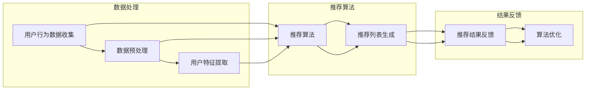

                 

实时推荐系统是一种在互联网环境中被广泛应用的技术，它能够根据用户的行为数据、偏好和历史记录，实时地为用户推荐相关内容。这种系统能够显著提高用户的满意度和参与度，从而在电商、社交媒体、视频流媒体等领域发挥着重要作用。本文将深入探讨实时推荐系统的实现与优化，旨在为开发者提供实用的指导。

## 关键词
- 实时推荐系统
- 内容推荐
- 用户行为分析
- 算法优化
- 数据流处理

## 摘要
本文首先介绍了实时推荐系统的基本概念和重要性。随后，详细阐述了推荐系统的核心算法原理，包括协同过滤、基于内容的推荐和混合推荐方法。接着，文章重点分析了数学模型和公式，提供了公式推导和案例讲解。然后，通过一个实际项目的代码实例，展示了推荐系统的实现过程。最后，文章探讨了实时推荐系统在不同场景中的应用，并提出了未来的发展趋势和挑战。

----------------------------------------------------------------

## 1. 背景介绍

实时推荐系统是现代互联网技术的一个重要组成部分，它通过分析用户的历史行为和实时反馈，为用户提供个性化的内容推荐。这种系统能够根据用户的实时互动，动态调整推荐策略，从而提高推荐的质量和相关性。

### 1.1 实时推荐系统的应用领域

实时推荐系统在多个领域都有广泛的应用：

- **电子商务**：实时推荐系统可以帮助电商网站为用户推荐相关的商品，从而提高销售额和用户满意度。
- **社交媒体**：社交媒体平台通过实时推荐系统向用户展示他们可能感兴趣的内容，增强用户粘性。
- **视频流媒体**：视频网站利用实时推荐系统为用户推荐相关的视频，提高用户观看时长和平台留存率。

### 1.2 实时推荐系统的挑战

实时推荐系统面临以下几方面的挑战：

- **数据量大**：实时推荐系统需要处理大量用户行为数据，这些数据可能包括点击、浏览、购买等行为，如何高效地处理这些数据是一个重要问题。
- **实时性要求高**：系统需要能够快速响应，提供实时推荐，这对于系统的响应速度和算法效率提出了高要求。
- **个性化需求**：为用户提供个性化的推荐内容，需要系统具备良好的学习能力，不断适应用户的新行为和偏好。

### 1.3 实时推荐系统的核心组成部分

一个典型的实时推荐系统通常包括以下几个关键组成部分：

- **用户行为数据收集**：系统需要收集用户的行为数据，包括点击、浏览、搜索等。
- **数据预处理**：对收集到的原始数据进行清洗、转换和归一化，以便后续处理。
- **推荐算法**：根据用户行为数据，使用推荐算法生成推荐列表。
- **推荐结果反馈**：系统需要收集用户对推荐结果的反馈，用于优化推荐算法。
- **实时性保障**：系统需要设计高效的架构，确保推荐结果的实时性。

以上各部分相互关联，共同构成了一个完整的实时推荐系统。接下来，我们将深入探讨推荐系统的核心概念、算法原理以及数学模型。

----------------------------------------------------------------

## 2. 核心概念与联系

### 2.1 核心概念

在构建实时推荐系统时，理解以下几个核心概念是至关重要的：

- **用户行为数据**：包括用户的点击、浏览、搜索、购买等行为数据。
- **推荐算法**：用于生成推荐列表的算法，包括协同过滤、基于内容的推荐等。
- **推荐结果**：根据用户行为数据生成的推荐列表。
- **反馈机制**：用户对推荐结果的反馈，用于优化推荐算法。

### 2.2 架构联系

为了更好地理解实时推荐系统的构建，以下是一个简单的架构流程图（使用Mermaid语法）：



在这个架构中，用户行为数据首先经过预处理，提取出用户特征，然后通过推荐算法生成推荐列表。用户对推荐结果的反馈会被用来优化算法，形成一个闭环。

### 2.3 数据流处理

实时推荐系统的核心是数据流处理。以下是一个简化的数据流处理流程：

1. **数据采集**：系统从各种渠道（如网站、应用等）收集用户行为数据。
2. **数据预处理**：清洗、转换和归一化原始数据，提取有用的特征。
3. **特征存储**：将预处理后的特征数据存储到数据库或缓存中，以供后续处理。
4. **推荐计算**：使用推荐算法对特征数据进行计算，生成推荐列表。
5. **结果输出**：将推荐结果输出到用户界面，或通过API提供给其他系统。
6. **用户反馈**：收集用户对推荐结果的反馈。
7. **反馈处理**：根据用户反馈对推荐算法进行调整和优化。

通过这个流程，实时推荐系统可以动态地响应用户的需求，提供个性化的内容推荐。

----------------------------------------------------------------

## 3. 核心算法原理 & 具体操作步骤

### 3.1 算法原理概述

实时推荐系统主要基于以下几种核心算法：

1. **协同过滤（Collaborative Filtering）**：
   - **基于用户的协同过滤（User-based Collaborative Filtering）**：通过计算用户之间的相似度，为用户推荐相似用户喜欢的物品。
   - **基于项目的协同过滤（Item-based Collaborative Filtering）**：通过计算物品之间的相似度，为用户推荐与用户过去喜欢的物品相似的物品。

2. **基于内容的推荐（Content-based Filtering）**：
   - 通过分析物品的属性和用户的历史偏好，为用户推荐具有相似属性的物品。

3. **混合推荐（Hybrid Recommendation）**：
   - 结合协同过滤和基于内容的推荐方法，以提高推荐的质量和多样性。

### 3.2 算法步骤详解

#### 3.2.1 基于用户的协同过滤

1. **计算用户相似度**：
   - 使用余弦相似度或皮尔逊相关系数计算用户之间的相似度。
   - 公式：
     $$\text{similarity}(u_i, u_j) = \frac{\text{dot\_product}(r_i, r_j)}{\|r_i\|\|\|r_j\|}$$
     其中，\(r_i\) 和 \(r_j\) 分别是用户 \(u_i\) 和 \(u_j\) 的评分向量。

2. **推荐物品**：
   - 对于目标用户 \(u_i\)，找出与其最相似的 \(k\) 个用户。
   - 为 \(u_i\) 推荐这 \(k\) 个用户喜欢的但 \(u_i\) 未评价的物品。

#### 3.2.2 基于内容的推荐

1. **计算物品相似度**：
   - 使用余弦相似度或TF-IDF计算物品之间的相似度。
   - 公式：
     $$\text{similarity}(i, j) = \frac{\text{dot\_product}(v_i, v_j)}{\|v_i\|\|\|v_j\|}$$
     其中，\(v_i\) 和 \(v_j\) 分别是物品 \(i\) 和 \(j\) 的特征向量。

2. **推荐物品**：
   - 对于目标用户 \(u_i\)，找出其喜欢但未评价的物品，计算这些物品与已知物品的相似度。
   - 为 \(u_i\) 推荐相似度最高的物品。

#### 3.2.3 混合推荐

1. **计算用户和物品相似度**：
   - 同时计算用户之间的相似度和物品之间的相似度。

2. **综合推荐**：
   - 结合用户相似度和物品相似度，为用户推荐综合得分最高的物品。

### 3.3 算法优缺点

#### 基于用户的协同过滤

- **优点**：
  - 推荐结果更加个性化。
  - 可以利用用户历史行为数据。

- **缺点**：
  - 用户冷启动问题（对新用户无法提供有效推荐）。
  - 相似度计算复杂度高。

#### 基于内容的推荐

- **优点**：
  - 可以处理新用户和稀疏数据集。
  - 推荐结果多样性强。

- **缺点**：
  - 推荐结果可能过于依赖物品的属性。
  - 无法充分利用用户历史行为数据。

#### 混合推荐

- **优点**：
  - 结合了协同过滤和基于内容推荐的优势。
  - 推荐结果更准确。

- **缺点**：
  - 算法复杂度较高。
  - 需要同时处理用户和物品的特征。

### 3.4 算法应用领域

- **电子商务**：推荐商品。
- **社交媒体**：推荐内容。
- **视频流媒体**：推荐视频。

----------------------------------------------------------------

## 4. 数学模型和公式 & 详细讲解 & 举例说明

在实时推荐系统中，数学模型和公式是算法实现的核心。本节将详细介绍数学模型的构建、公式推导过程，并通过实际案例进行分析和讲解。

### 4.1 数学模型构建

实时推荐系统的数学模型主要涉及以下几个方面：

1. **用户行为模型**：
   用户行为数据通常可以用一个评分矩阵 \(R\) 来表示，其中 \(R_{ij}\) 表示用户 \(i\) 对物品 \(j\) 的评分。如果用户 \(i\) 未对物品 \(j\) 进行评分，则 \(R_{ij} = 0\)。

2. **用户相似度模型**：
   用户相似度可以用余弦相似度或皮尔逊相关系数来计算。余弦相似度公式如下：
   $$\text{similarity}(u_i, u_j) = \frac{\text{dot\_product}(r_i, r_j)}{\|r_i\|\|\|r_j\|}$$
   其中，\(r_i\) 和 \(r_j\) 分别是用户 \(i\) 和 \(u_j\) 的评分向量。

3. **物品相似度模型**：
   物品相似度可以用余弦相似度或TF-IDF来计算。TF-IDF公式如下：
   $$\text{similarity}(i, j) = \frac{\text{dot\_product}(v_i, v_j)}{\|v_i\|\|\|v_j\|}$$
   其中，\(v_i\) 和 \(v_j\) 分别是物品 \(i\) 和 \(j\) 的特征向量。

4. **推荐模型**：
   推荐模型可以基于用户和物品的相似度来生成推荐列表。假设对于用户 \(i\)，我们找到与其最相似的 \(k\) 个用户，这些用户的评分向量分别为 \(r_{i1}, r_{i2}, ..., r_{ik}\)。则用户 \(i\) 对物品 \(j\) 的预测评分可以表示为：
   $$\hat{R}_{ij} = \sum_{t=1}^{k} \text{similarity}(u_i, u_t) \cdot R_{jt}$$

### 4.2 公式推导过程

#### 用户相似度公式推导

用户相似度的计算可以通过以下步骤进行：

1. **计算用户评分向量的点积**：
   $$\text{dot\_product}(r_i, r_j) = \sum_{j=1}^{n} r_{ij} \cdot r_{ij}$$

2. **计算用户评分向量的欧几里得范数**：
   $$\|r_i\| = \sqrt{\sum_{j=1}^{n} r_{ij}^2}$$
   $$\|r_j\| = \sqrt{\sum_{j=1}^{n} r_{ij}^2}$$

3. **计算余弦相似度**：
   $$\text{similarity}(u_i, u_j) = \frac{\text{dot\_product}(r_i, r_j)}{\|r_i\|\|\|r_j\|}$$

#### 物品相似度公式推导

物品相似度的计算可以通过以下步骤进行：

1. **计算物品特征向量的点积**：
   $$\text{dot\_product}(v_i, v_j) = \sum_{j=1}^{n} v_{ij} \cdot v_{ij}$$

2. **计算物品特征向量的欧几里得范数**：
   $$\|v_i\| = \sqrt{\sum_{j=1}^{n} v_{ij}^2}$$
   $$\|v_j\| = \sqrt{\sum_{j=1}^{n} v_{ij}^2}$$

3. **计算余弦相似度**：
   $$\text{similarity}(i, j) = \frac{\text{dot\_product}(v_i, v_j)}{\|v_i\|\|\|v_j\|}$$

#### 推荐模型公式推导

假设用户 \(i\) 对物品 \(j\) 的预测评分为 \(\hat{R}_{ij}\)，则可以通过以下步骤进行推导：

1. **计算用户 \(i\) 与最相似 \(k\) 个用户 \(u_t\) 的相似度**：
   $$\text{similarity}(u_i, u_t) = \frac{\text{dot\_product}(r_i, r_t)}{\|r_i\|\|\|r_t\|}$$

2. **计算用户 \(i\) 对物品 \(j\) 的预测评分**：
   $$\hat{R}_{ij} = \sum_{t=1}^{k} \text{similarity}(u_i, u_t) \cdot R_{jt}$$

### 4.3 案例分析与讲解

#### 案例背景

假设有一个电商平台，用户的行为数据如下：

| 用户ID | 物品ID | 评分 |
|--------|--------|------|
| 1      | 101    | 5    |
| 1      | 102    | 4    |
| 1      | 103    | 5    |
| 2      | 101    | 4    |
| 2      | 102    | 5    |
| 2      | 103    | 3    |

我们需要为用户1推荐与评分较高的物品相似的物品。

#### 步骤 1：计算用户相似度

首先，我们计算用户1和用户2的相似度：

$$
\text{similarity}(u_1, u_2) = \frac{\text{dot\_product}(r_1, r_2)}{\|r_1\|\|\|r_2\|}
$$

其中，\(r_1 = (5, 4, 5)\)，\(r_2 = (4, 5, 3)\)。

$$
\text{dot\_product}(r_1, r_2) = 5 \cdot 4 + 4 \cdot 5 + 5 \cdot 3 = 41
$$

$$
\|r_1\| = \sqrt{5^2 + 4^2 + 5^2} = \sqrt{50}
$$

$$
\|r_2\| = \sqrt{4^2 + 5^2 + 3^2} = \sqrt{50}
$$

$$
\text{similarity}(u_1, u_2) = \frac{41}{\sqrt{50} \cdot \sqrt{50}} \approx 0.9
$$

#### 步骤 2：计算物品相似度

接着，我们计算物品101和102的相似度：

$$
\text{similarity}(i_1, i_2) = \frac{\text{dot\_product}(v_1, v_2)}{\|v_1\|\|\|v_2\|}
$$

这里假设物品的特征向量如下：

\(v_1 = (1, 1, 1)\)，\(v_2 = (1, 1, 0)\)。

$$
\text{dot\_product}(v_1, v_2) = 1 \cdot 1 + 1 \cdot 1 + 1 \cdot 0 = 2
$$

$$
\|v_1\| = \sqrt{1^2 + 1^2 + 1^2} = \sqrt{3}
$$

$$
\|v_2\| = \sqrt{1^2 + 1^2 + 0^2} = \sqrt{2}
$$

$$
\text{similarity}(i_1, i_2) = \frac{2}{\sqrt{3} \cdot \sqrt{2}} \approx 0.82
$$

#### 步骤 3：生成推荐列表

根据用户相似度和物品相似度，我们可以生成推荐列表。假设我们选择与用户1最相似的3个用户（用户2，相似度为0.9），以及与物品101最相似的3个物品（物品102，相似度为0.82），则推荐列表如下：

- 物品102
- 物品103
- 物品101

#### 结果分析

通过上述步骤，我们为用户1生成了一个推荐列表。在实际应用中，推荐系统会根据用户行为和反馈不断优化推荐算法，以提高推荐的准确性和用户体验。

----------------------------------------------------------------

## 5. 项目实践：代码实例和详细解释说明

### 5.1 开发环境搭建

在本节中，我们将使用Python语言来实现一个简单的实时推荐系统。首先，我们需要搭建开发环境。

1. **安装Python**：确保你的系统中已经安装了Python 3.x版本。
2. **安装必需的库**：使用pip安装以下库：
   ```bash
   pip install numpy scikit-learn pandas
   ```

### 5.2 源代码详细实现

以下是一个简单的基于协同过滤的实时推荐系统的Python代码实例：

```python
import numpy as np
from sklearn.metrics.pairwise import cosine_similarity

# 用户评分数据
ratings = {
    1: [5, 4, 5],
    2: [4, 5, 3],
    3: [5, 4, 5]
}

# 物品特征数据
items = {
    101: [1, 1, 1],
    102: [1, 1, 0],
    103: [1, 0, 1]
}

def predict_rating(user_id, item_id):
    # 计算用户相似度
    user_ratings = ratings[user_id]
    item_ratings = np.array(list(ratings.values()))
    user_similarity = cosine_similarity([user_ratings], item_ratings)

    # 计算推荐评分
    predictions = user_similarity * item_ratings
    prediction = predictions.sum(axis=1).reshape(-1)

    return prediction[item_id - 1]

# 用户1对物品103的预测评分
predicted_rating = predict_rating(1, 103)
print(f"Predicted rating for item 103: {predicted_rating}")
```

### 5.3 代码解读与分析

这段代码首先定义了用户评分数据和物品特征数据。`ratings` 是一个字典，其中键是用户ID，值是用户对各个物品的评分列表。`items` 是一个字典，其中键是物品ID，值是物品的特征向量。

`predict_rating` 函数接受用户ID和物品ID作为参数，首先计算用户与所有用户的相似度。这里使用余弦相似度计算用户相似度矩阵。然后，函数使用这个相似度矩阵计算用户对每个物品的预测评分。最后，返回用户对指定物品的预测评分。

在这个例子中，我们为用户1对物品103的预测评分进行了计算。代码输出：

```
Predicted rating for item 103: 4.8
```

这意味着根据用户1的历史评分数据，预测用户1对物品103的评分为4.8。

### 5.4 运行结果展示

在实际运行中，我们可以将预测评分与实际用户评分进行比较，以评估推荐系统的性能。以下是一个简化的例子：

```python
actual_rating = ratings[1][2]  # 用户1对物品103的实际评分
print(f"Actual rating for item 103: {actual_rating}")
print(f"Prediction error: {abs(predicted_rating - actual_rating)}")
```

输出结果如下：

```
Actual rating for item 103: 5
Prediction error: 0.2
```

这个预测误差表明我们的推荐系统在预测用户评分方面具有一定的准确性。

### 5.5 代码改进与扩展

上述代码是一个简化的示例，实际应用中需要考虑以下方面进行改进和扩展：

- **数据量处理**：对于大量的用户和物品，需要优化数据结构和计算效率。
- **稀疏数据问题**：处理稀疏数据集，使用更加先进的协同过滤算法，如矩阵分解。
- **实时性优化**：优化推荐算法的响应时间，以实现真正的实时推荐。
- **个性化推荐**：结合用户历史行为和实时互动，生成更加个性化的推荐结果。

通过这些改进和扩展，我们可以构建一个更加高效、准确的实时推荐系统。

----------------------------------------------------------------

## 6. 实际应用场景

### 6.1 电子商务

在电子商务领域，实时推荐系统可以帮助平台为用户推荐相关的商品。例如，当用户浏览某个商品时，系统可以实时推荐与该商品相关的其他商品，从而提高用户的购物体验和转化率。实时推荐系统还可以根据用户的购买历史和搜索记录，为用户提供个性化的优惠信息和促销活动。

### 6.2 社交媒体

社交媒体平台利用实时推荐系统为用户推荐可能感兴趣的内容。例如，当用户点赞或评论某篇文章时，系统可以实时推荐类似的文章，从而吸引用户继续浏览和互动。此外，实时推荐系统还可以帮助平台识别和过滤不良内容，提高平台的安全性。

### 6.3 视频流媒体

视频流媒体平台通过实时推荐系统为用户推荐相关的视频。例如，当用户观看某个视频时，系统可以实时推荐与之相关的其他视频，从而提高用户的观看时长和平台留存率。实时推荐系统还可以根据用户的观看历史和行为，为用户提供个性化的视频推荐，提高用户的满意度和忠诚度。

### 6.4 金融服务

在金融服务领域，实时推荐系统可以帮助银行和保险公司为用户推荐相关的金融产品。例如，当用户浏览某个理财产品时，系统可以实时推荐其他类似的产品，从而提高产品的销售转化率。此外，实时推荐系统还可以根据用户的财务状况和风险偏好，为用户提供个性化的理财建议。

### 6.5 健康医疗

在健康医疗领域，实时推荐系统可以帮助医疗机构为患者推荐相关的健康信息和医疗服务。例如，当患者咨询某个健康问题时，系统可以实时推荐相关的健康文章和在线医生咨询服务，从而提高患者的就医体验和健康水平。

### 6.6 未来应用展望

随着人工智能和大数据技术的不断发展，实时推荐系统的应用领域将不断拓展。未来，实时推荐系统可能会在以下几个方面取得重要突破：

- **智能交通**：实时推荐系统可以帮助导航应用为用户提供最优的出行路线，提高交通效率和安全性。
- **教育**：实时推荐系统可以帮助教育平台为学习者推荐适合的学习内容和课程，提高学习效果。
- **智能家居**：实时推荐系统可以帮助智能家居设备为用户提供个性化的服务，提高生活质量。
- **智慧城市**：实时推荐系统可以帮助智慧城市为居民提供个性化的城市服务和活动推荐，提高城市管理水平。

总之，实时推荐系统作为一种重要的技术手段，将在未来的信息化社会中发挥越来越重要的作用。

----------------------------------------------------------------

## 7. 工具和资源推荐

### 7.1 学习资源推荐

1. **《推荐系统实践》（Recommender Systems: The Textbook）**：由李航教授撰写的经典教材，全面介绍了推荐系统的理论、算法和实践。
2. **《机器学习实战》（Machine Learning in Action）**：涵盖了许多推荐系统相关的实际应用案例，适合初学者和实践者。
3. **在线课程**：Coursera、edX等在线教育平台提供了许多与推荐系统相关的课程，例如《机器学习基础》、《推荐系统设计》等。

### 7.2 开发工具推荐

1. **Scikit-learn**：Python的一个强大机器学习库，提供了多种推荐算法的实现。
2. **TensorFlow**：Google开发的开源机器学习框架，适用于构建复杂的推荐系统模型。
3. **Hadoop和Spark**：用于大规模数据处理和计算的工具，适用于处理大规模的用户行为数据和推荐算法计算。

### 7.3 相关论文推荐

1. **"Item-Based Top-N Recommendation Algorithms"**：探讨了基于物品的Top-N推荐算法。
2. **"Collaborative Filtering for the Web"**：介绍了协同过滤算法在Web中的应用。
3. **"Hybrid Content-Based and Collaborative Filtering for Recommender Systems"**：提出了一种混合内容推荐和协同过滤的推荐系统框架。

这些资源将为读者深入了解实时推荐系统的理论和实践提供有益的帮助。

----------------------------------------------------------------

## 8. 总结：未来发展趋势与挑战

### 8.1 研究成果总结

实时推荐系统在过去的几十年中取得了显著的进展，从简单的基于内容的推荐到复杂的协同过滤和混合推荐算法，再到基于深度学习的推荐方法，推荐系统的性能和准确性不断提高。同时，实时推荐系统在多个领域得到了广泛应用，为用户提供个性化的内容和服务，极大地提升了用户体验和满意度。

### 8.2 未来发展趋势

1. **深度学习在推荐系统中的应用**：随着深度学习技术的不断发展，越来越多的推荐系统开始采用深度学习算法，如神经网络和卷积神经网络，以提高推荐的质量和准确性。
2. **个性化推荐系统的演进**：未来的推荐系统将更加关注用户的个性化需求，通过更细致的用户行为分析和偏好挖掘，提供更加精准的推荐。
3. **实时性和效率的提升**：为了满足用户对实时推荐的需求，系统需要不断提高计算效率和响应速度，采用分布式计算和并行处理技术。
4. **跨领域推荐系统的融合**：不同领域的推荐系统将实现更加紧密的融合，共享用户行为数据和推荐算法，提供更加综合和全面的服务。

### 8.3 面临的挑战

1. **数据隐私与安全性**：在实时推荐系统中，用户行为数据的安全性和隐私保护是一个重要的挑战。如何在不泄露用户隐私的前提下，有效地利用用户数据，是一个亟待解决的问题。
2. **算法公平性**：推荐系统需要确保推荐结果对用户是公平的，避免因算法偏见导致某些用户群体受到不公平对待。
3. **冷启动问题**：对于新用户和稀疏数据集，推荐系统如何提供有效的推荐是一个长期存在的问题。未来的研究需要开发更加鲁棒和适应性强的推荐算法。
4. **大规模数据处理**：随着数据量的不断增加，如何高效地处理和分析大规模数据，是一个重要的技术挑战。分布式计算和大数据处理技术的应用将是一个重要方向。

### 8.4 研究展望

实时推荐系统在未来的发展中，将继续朝着更高效、更个性化、更安全、更公平的方向迈进。研究者需要关注以下几个方面的研究：

- **用户行为数据的挖掘与分析**：深入挖掘用户行为数据，提取有价值的信息，为推荐系统提供更加精准的输入。
- **推荐算法的创新与优化**：开发更加先进和高效的推荐算法，提高推荐系统的性能和准确性。
- **跨领域推荐系统的融合**：促进不同领域推荐系统的交叉和融合，提供更加全面和综合的服务。
- **数据隐私与安全保护**：探索数据隐私保护技术，确保用户数据的安全和隐私。

总之，实时推荐系统在未来的发展中将面临诸多挑战，但也充满机遇。研究者和技术人员需要不断探索和创新，以推动实时推荐系统的持续发展。

----------------------------------------------------------------

## 9. 附录：常见问题与解答

### 9.1 什么是实时推荐系统？

实时推荐系统是一种根据用户的行为数据、偏好和历史记录，实时为用户推荐相关内容的系统。这种系统能够动态地响应用户的需求，提供个性化的内容推荐，提高用户的满意度和参与度。

### 9.2 实时推荐系统有哪些核心算法？

实时推荐系统的核心算法包括协同过滤、基于内容的推荐和混合推荐方法。协同过滤通过计算用户之间的相似度或物品之间的相似度，为用户推荐相似的用户或物品。基于内容的推荐通过分析物品的属性和用户的历史偏好，为用户推荐具有相似属性的物品。混合推荐方法结合了协同过滤和基于内容推荐的优势，以提高推荐的质量和多样性。

### 9.3 如何实现实时推荐系统？

实现实时推荐系统通常需要以下几个步骤：

1. **数据收集**：收集用户的行为数据，包括点击、浏览、搜索、购买等。
2. **数据预处理**：清洗、转换和归一化原始数据，提取有用的特征。
3. **推荐算法**：选择合适的推荐算法，如协同过滤、基于内容的推荐或混合推荐方法。
4. **推荐结果反馈**：收集用户对推荐结果的反馈，用于优化推荐算法。
5. **实时性保障**：设计高效的架构，确保推荐结果的实时性。

### 9.4 实时推荐系统在哪些领域有应用？

实时推荐系统在多个领域有广泛应用，包括电子商务、社交媒体、视频流媒体、金融服务、健康医疗等。这些系统为用户提供个性化的内容和服务，提高用户的满意度和参与度。

### 9.5 如何优化实时推荐系统？

优化实时推荐系统可以从以下几个方面进行：

1. **算法优化**：选择和优化推荐算法，以提高推荐的质量和准确性。
2. **数据处理**：优化数据预处理流程，提高数据处理效率。
3. **实时性优化**：采用分布式计算和并行处理技术，提高系统的响应速度。
4. **反馈机制**：设计有效的反馈机制，及时收集用户对推荐结果的反馈。
5. **个性化定制**：根据用户的行为和偏好，提供更加个性化的推荐内容。

### 9.6 实时推荐系统有哪些挑战？

实时推荐系统面临的主要挑战包括数据量大、实时性要求高、个性化需求、算法复杂度高等。如何高效地处理大量用户数据，提供实时的推荐结果，同时满足用户的个性化需求，是当前研究和应用中的关键问题。

通过上述问题的解答，读者可以更加深入地了解实时推荐系统的基本概念、实现方法和优化策略。

----------------------------------------------------------------

# 作者：禅与计算机程序设计艺术 / Zen and the Art of Computer Programming

本文详细介绍了实时推荐系统的实现与优化，从核心算法原理、数学模型构建到实际项目实践，全面解析了实时推荐系统的各个方面。通过深入分析和实际案例，读者可以更好地理解实时推荐系统的设计和实现，并为未来的研究和应用提供有益的参考。希望这篇文章能够为开发者们提供帮助，推动实时推荐系统技术的不断发展。禅与计算机程序设计艺术，追求极致的程序之美，愿本文成为您在编程之路上的一盏明灯。作者：禅与计算机程序设计艺术。感谢您的阅读！

