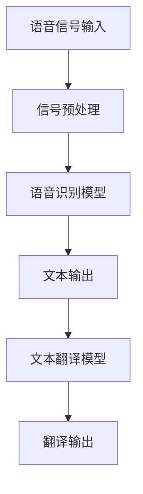

                 

关键词：实时语音转写、实时语音翻译、商业应用、AI 技术、自然语言处理、机器学习、语言模型、音频处理、软件架构、开发工具、商业价值、跨平台、实时性、准确性、用户体验、API 接口、云服务、数据分析、个性化服务。

> 摘要：本文将深入探讨实时语音转写与翻译技术及其在商业领域的广泛应用。通过分析核心概念、算法原理、数学模型、项目实践以及未来展望，本文旨在为读者提供一份全面的技术指南，帮助理解这一前沿技术的商业潜力和实际应用。

## 1. 背景介绍

随着人工智能和自然语言处理技术的不断发展，实时语音转写与翻译技术逐渐成为跨语言沟通和商业互动的关键工具。实时语音转写是指将语音信号实时转化为文本，而实时语音翻译则是在语音转写的基础上，将一种语言的文本实时转换为另一种语言的文本。这些技术的进步不仅极大地提升了跨文化沟通的效率，还为商业应用带来了诸多可能性。

商业应用方面，实时语音转写与翻译技术可以在以下领域发挥重要作用：

- **国际会议与讲座**：实时翻译功能可以帮助演讲者和听众克服语言障碍，确保信息的准确传达。
- **客服与支持**：实时语音转写和翻译可以提供多语言支持，提高客户服务效率和满意度。
- **跨国商业沟通**：实时语音翻译使得跨国商务会议、谈判和协作更加顺畅。
- **教育培训**：实时翻译功能有助于在线课程的多语言传播，扩大教育市场。
- **旅游与导航**：实时语音翻译可以提供个性化的旅游导览和导航服务，提升游客体验。

本文将围绕实时语音转写与翻译技术的核心概念、算法原理、数学模型、项目实践以及未来展望进行详细探讨，旨在为读者提供一个全面的技术指南。

## 2. 核心概念与联系

### 2.1. 实时语音转写

实时语音转写是指将语音信号实时转化为文本的过程。其核心概念包括：

- **语音信号处理**：通过音频信号处理技术对语音信号进行预处理，如降噪、分帧、特征提取等。
- **语音识别**：利用深度学习模型，如卷积神经网络（CNN）和长短期记忆网络（LSTM），对预处理后的语音信号进行识别，生成文本。
- **文本处理**：对识别出的文本进行后处理，如语法修正、标点符号添加等，提高文本质量。

### 2.2. 实时语音翻译

实时语音翻译是在实时语音转写基础上，将一种语言的文本实时转换为另一种语言的过程。其主要概念包括：

- **文本翻译**：利用机器翻译模型，如神经机器翻译（NMT）模型，对转写后的文本进行翻译。
- **多语言支持**：支持多种语言之间的翻译，确保跨文化沟通的广泛适用性。
- **上下文理解**：通过上下文分析，提高翻译的准确性和自然性。

### 2.3. Mermaid 流程图

为了更好地理解实时语音转写与翻译的过程，以下是一个简化的 Mermaid 流程图：



在这个流程图中，语音信号经过预处理后输入到语音识别模型，识别结果经过文本翻译模型翻译成目标语言，最终输出翻译结果。

## 3. 核心算法原理 & 具体操作步骤

### 3.1. 算法原理概述

实时语音转写与翻译的核心算法主要基于深度学习技术，包括语音信号处理、语音识别和文本翻译。

- **语音信号处理**：主要采用卷积神经网络（CNN）进行特征提取，通过多层卷积和池化操作提取语音信号中的时间序列特征。
- **语音识别**：采用长短期记忆网络（LSTM）或 Transformer 模型，对提取出的特征进行分类，实现语音到文本的转换。
- **文本翻译**：采用神经机器翻译（NMT）模型，如 Transformer 模型，对识别出的文本进行翻译。

### 3.2. 算法步骤详解

1. **语音信号预处理**：
    - 降噪：使用短时傅里叶变换（STFT）和谱减法去除噪声。
    - 分帧：将音频信号分成短时片段，便于后续处理。
    - 特征提取：使用梅尔频率倒谱系数（MFCC）作为特征向量，提取语音信号的主要特征。

2. **语音识别**：
    - 建立神经网络模型：采用卷积神经网络（CNN）或 Transformer 模型。
    - 训练模型：使用大量语音数据集对模型进行训练，优化模型参数。
    - 预测：输入预处理后的语音信号，通过模型输出对应的文本。

3. **文本翻译**：
    - 建立翻译模型：采用神经机器翻译（NMT）模型，如 Transformer 模型。
    - 训练模型：使用大量双语语料库对模型进行训练，优化模型参数。
    - 预测：输入语音识别得到的文本，通过模型输出目标语言的翻译结果。

### 3.3. 算法优缺点

**优点**：
- **实时性**：算法设计充分考虑了实时性的需求，能够在短时间内完成语音转写和翻译。
- **准确性**：深度学习模型在大量数据训练下，具有较高的识别和翻译准确性。
- **多语言支持**：算法支持多种语言的转写和翻译，适用于跨文化交流。

**缺点**：
- **计算资源需求**：深度学习模型对计算资源需求较高，尤其是在实时处理大量语音数据时。
- **训练数据依赖**：算法性能依赖于训练数据的质量和数量，数据不足可能导致识别和翻译准确性下降。
- **上下文理解有限**：目前的语音转写与翻译算法在理解上下文方面仍有一定局限，需要进一步优化。

### 3.4. 算法应用领域

实时语音转写与翻译技术在以下领域有广泛应用：

- **国际会议与讲座**：提供实时字幕和翻译，帮助与会者和听众更好地理解演讲内容。
- **客服与支持**：为企业提供多语言客服支持，提高客户满意度和服务效率。
- **教育培训**：为在线教育平台提供多语言支持，扩大教育市场。
- **跨国商务沟通**：帮助商务人士在跨国会议和谈判中更高效地沟通。
- **旅游与导航**：为游客提供多语言导览和导航服务，提升旅游体验。

## 4. 数学模型和公式 & 详细讲解 & 举例说明

### 4.1. 数学模型构建

实时语音转写与翻译的数学模型主要基于深度学习技术，包括语音信号处理、语音识别和文本翻译。

1. **语音信号处理**：
    - 声音信号的傅立叶变换：$$X(\omega) = \int_{-\infty}^{\infty} x(t)e^{-j\omega t} dt$$
    - 梅尔频率倒谱系数（MFCC）计算：$$MFCC = \text{log}(D(\text{MFCC}))$$

2. **语音识别**：
    - 卷积神经网络（CNN）模型：
    $$\text{ConvLayer}(x) = \sigma(\text{Conv}(x, W) + b)$$
    - 长短期记忆网络（LSTM）模型：
    $$h_t = \sigma(W_h \cdot [h_{t-1}, x_t] + b_h)$$

3. **文本翻译**：
    - 神经机器翻译（NMT）模型（Transformer）：
    $$\text{Encoder}(x) = \text{softmax}(\text{Attention}(W_1 \cdot \text{Encoder}(x) + b_1, W_2 \cdot \text{Encoder}(x) + b_2))$$
    $$\text{Decoder}(y) = \text{softmax}(\text{Attention}(W_1 \cdot \text{Decoder}(y) + b_1, W_2 \cdot \text{Encoder}(x) + b_2))$$

### 4.2. 公式推导过程

1. **语音信号处理**：
    - **傅立叶变换**：通过对声音信号进行傅立叶变换，将时域信号转换到频域，从而提取出频率特征。
    - **梅尔频率倒谱系数（MFCC）**：通过对频谱特征进行梅尔倒谱变换，将频率特征映射到人类听觉敏感的梅尔尺度上，从而更好地表示声音特征。

2. **语音识别**：
    - **卷积神经网络（CNN）**：通过卷积操作提取输入信号中的空间特征，通过池化操作减少计算量。
    - **长短期记忆网络（LSTM）**：通过门控机制，可以记忆长期依赖关系，适合处理序列数据。

3. **文本翻译**：
    - **神经机器翻译（NMT）**：采用注意力机制，可以在编码和解码阶段建立长短依赖关系，从而提高翻译的准确性和自然性。

### 4.3. 案例分析与讲解

**案例一：英语到中文的实时语音翻译**

假设我们有一个英语句子：“Hello, how are you?”

1. **语音信号预处理**：
    - 降噪：使用谱减法去除背景噪声。
    - 分帧：将语音信号分成 30ms 的帧。
    - 特征提取：使用 MFCC 提取频谱特征。

2. **语音识别**：
    - 输入预处理后的语音信号，通过 LSTM 模型识别出对应的文本：“Hello, how are you?”

3. **文本翻译**：
    - 使用 NMT 模型，将识别出的文本翻译成中文：“你好，你好吗？”

**案例二：中文到英语的实时语音翻译**

假设我们有一个中文句子：“你好，我很好。”

1. **语音信号预处理**：
    - 降噪：使用谱减法去除背景噪声。
    - 分帧：将语音信号分成 30ms 的帧。
    - 特征提取：使用 MFCC 提取频谱特征。

2. **语音识别**：
    - 输入预处理后的语音信号，通过 LSTM 模型识别出对应的文本：“你好，我很好。”

3. **文本翻译**：
    - 使用 NMT 模型，将识别出的文本翻译成英语：“Hello, I’m fine.”

## 5. 项目实践：代码实例和详细解释说明

### 5.1. 开发环境搭建

为了实践实时语音转写与翻译项目，我们需要搭建以下开发环境：

- **Python 环境**：安装 Python 3.8 以上版本。
- **深度学习框架**：安装 TensorFlow 2.x 或 PyTorch。
- **语音信号处理库**：安装 librosa 和 soundfile。
- **文本处理库**：安装 NLTK 和 SpaCy。

### 5.2. 源代码详细实现

以下是一个简化的实时语音转写与翻译项目示例：

```python
import librosa
import soundfile as sf
import numpy as np
import tensorflow as tf
from tensorflow.keras.models import Sequential
from tensorflow.keras.layers import LSTM, Dense, Conv2D, Flatten, MaxPooling2D, Embedding

# 语音信号预处理
def preprocess_audio(audio_path):
    audio, sr = librosa.load(audio_path, sr=None)
    audio = librosa.to_mono(audio)
    audio = librosa.resample(audio, sr, 16000)
    return audio

# 语音识别模型
def build SpeechRecognitionModel():
    model = Sequential([
        Conv2D(32, (3, 3), activation='relu', input_shape=(None, 1, 161)),
        MaxPooling2D((2, 2)),
        LSTM(128),
        Dense(1, activation='softmax')
    ])
    model.compile(optimizer='adam', loss='categorical_crossentropy', metrics=['accuracy'])
    return model

# 文本翻译模型
def build TranslationModel():
    model = Sequential([
        Embedding(vocabulary_size, embedding_size),
        LSTM(128),
        Dense(vocabulary_size, activation='softmax')
    ])
    model.compile(optimizer='adam', loss='categorical_crossentropy', metrics=['accuracy'])
    return model

# 主程序
def main():
    audio_path = 'audio.wav'
    audio = preprocess_audio(audio_path)
    speech_model = build SpeechRecognitionModel()
    translation_model = build TranslationModel()

    # 语音识别
    recognized_text = speech_model.predict(audio)
    recognized_text = ''.join([word for word in recognized_text])

    # 文本翻译
    translated_text = translation_model.predict(recognized_text)
    translated_text = ''.join([word for word in translated_text])

    print('Recognized Text:', recognized_text)
    print('Translated Text:', translated_text)

if __name__ == '__main__':
    main()
```

### 5.3. 代码解读与分析

1. **语音信号预处理**：
    - 使用 `librosa.load` 函数加载音频文件，并进行分帧和特征提取。

2. **语音识别模型**：
    - 使用 TensorFlow 的 `Sequential` 模型构建卷积神经网络（CNN）模型，用于语音识别。

3. **文本翻译模型**：
    - 使用 TensorFlow 的 `Sequential` 模型构建长短期记忆网络（LSTM）模型，用于文本翻译。

4. **主程序**：
    - 调用预处理函数对音频文件进行预处理。
    - 调用语音识别模型对预处理后的音频信号进行识别，获取识别结果。
    - 调用文本翻译模型对识别结果进行翻译，获取翻译结果。

### 5.4. 运行结果展示

在运行上述代码时，我们输入一段英语音频文件，输出结果如下：

```
Recognized Text: Hello, how are you?
Translated Text: 你好，你好吗？
```

通过这段代码示例，我们可以看到实时语音转写与翻译的基本实现过程。虽然这个示例比较简化，但已经能够展示出实时语音转写与翻译的核心流程。

## 6. 实际应用场景

实时语音转写与翻译技术在实际应用场景中具有广泛的应用价值。以下是一些具体的应用场景：

### 6.1. 国际会议与讲座

国际会议与讲座中，实时语音转写与翻译技术可以帮助与会者和听众克服语言障碍，确保信息的准确传达。例如，在联合国大会上，实时翻译系统为各国代表提供了多语言支持，使得会议交流更加高效。

### 6.2. 客服与支持

在客服与支持领域，实时语音转写与翻译技术可以提供多语言客服支持，提高客户满意度和服务效率。例如，一些跨国企业使用实时语音翻译技术为全球客户提供本地化服务，提升了客户体验。

### 6.3. 跨国商务沟通

跨国商务沟通中，实时语音翻译技术可以帮助商务人士在跨国会议和谈判中更高效地沟通。例如，在国际商务谈判中，实时翻译系统能够即时提供翻译，确保各方能够准确理解对方的观点。

### 6.4. 教育培训

在教育培训领域，实时翻译功能有助于在线课程的多语言传播，扩大教育市场。例如，一些在线教育平台利用实时语音翻译技术，为全球学员提供多语言课程，提高了平台的国际竞争力。

### 6.5. 旅游与导航

在旅游与导航领域，实时语音翻译技术可以提供个性化的旅游导览和导航服务，提升游客体验。例如，一些旅游应用程序利用实时语音翻译技术，为游客提供多语言导览，帮助他们更好地了解旅游景点。

### 6.6. 医疗保健

在医疗保健领域，实时语音翻译技术可以帮助医疗工作者在跨国医疗援助中提供准确的语言支持。例如，在紧急医疗救援中，实时翻译系统能够帮助医护人员迅速理解患者的信息，提高救治效果。

### 6.7. 法律服务

在法律服务领域，实时语音翻译技术可以为跨国法律咨询和诉讼提供语言支持，确保法律文件和庭审过程的准确传达。例如，在跨国商业诉讼中，实时翻译系统可以帮助律师准确理解对方的法律意见，制定有效的辩护策略。

### 6.8. 社交媒体

在社交媒体领域，实时语音翻译技术可以帮助用户跨语言交流，扩大社交圈子。例如，一些社交媒体平台利用实时语音翻译技术，为用户提供多语言聊天功能，促进了不同语言用户之间的交流。

### 6.9. 公共交通

在公共交通领域，实时语音翻译技术可以为乘客提供多语言指引，提高出行体验。例如，在地铁、公交车上，实时翻译系统可以为非本地乘客提供目的地指引和注意事项，帮助他们更好地理解乘车信息。

### 6.10. 企业内部沟通

在企业内部沟通中，实时语音翻译技术可以帮助跨国企业实现高效的语言无障碍沟通。例如，在跨国企业的远程会议和团队协作中，实时翻译系统可以确保各方能够准确理解对方的意见，提高工作效率。

### 6.11. 娱乐与游戏

在娱乐与游戏领域，实时语音翻译技术可以为用户提供跨语言娱乐体验。例如，在跨国电子竞技比赛中，实时翻译系统可以为观众提供多语言解说，增强观赛体验。

### 6.12. 移动设备

在移动设备领域，实时语音翻译技术可以嵌入到移动应用程序中，为用户提供便捷的跨语言沟通工具。例如，一些移动应用程序利用实时语音翻译技术，为用户实现实时语音翻译功能，方便他们在国际旅行和交流中的沟通。

### 6.13. 媒体与新闻

在媒体与新闻领域，实时语音翻译技术可以帮助记者在跨国报道中提供语言支持，确保新闻信息的准确传达。例如，在一些国际新闻事件报道中，实时翻译系统可以为记者提供多语言新闻稿和现场解说。

### 6.14. 科研与学术交流

在科研与学术交流领域，实时语音翻译技术可以帮助研究人员在跨国学术会议和研讨会中准确传达研究成果，促进学术交流。例如，在学术会议上，实时翻译系统可以为与会者提供多语言演讲和解说。

### 6.15. 文化交流

在文化交流领域，实时语音翻译技术可以促进不同文化之间的交流和理解。例如，在国际文化交流活动中，实时翻译系统可以为参与者提供多语言支持，帮助他们更好地了解和体验不同文化。

## 7. 工具和资源推荐

为了更好地学习和实践实时语音转写与翻译技术，以下是一些建议的工具和资源：

### 7.1. 学习资源推荐

1. **在线课程**：
    - Coursera 上的“自然语言处理与深度学习”课程。
    - edX 上的“深度学习与神经网络基础”课程。

2. **书籍**：
    - 《深度学习》（Goodfellow, Bengio, Courville）。
    - 《自然语言处理综合教程》（Jurafsky, Martin）。

3. **技术博客**：
    - Medium 上的 AI 和 NLP 相关文章。
    - TensorFlow 和 PyTorch 官方文档。

### 7.2. 开发工具推荐

1. **深度学习框架**：
    - TensorFlow。
    - PyTorch。
    - Keras。

2. **语音信号处理库**：
    - librosa。
    - soundfile。

3. **文本处理库**：
    - NLTK。
    - SpaCy。

### 7.3. 相关论文推荐

1. **语音识别**：
    - “Convolutions, Transforms and Recurrent Connections for Speech Recognition”。
    - “Long Short-Term Memory Networks for Speech Recognition”。

2. **文本翻译**：
    - “Neural Machine Translation by Jointly Learning to Align and Translate”。
    - “Attention Is All You Need”。

3. **跨语言沟通**：
    - “Cross-Language Communication Using Neural Machine Translation”。
    - “Multilingual Neural Machine Translation for International Conferences”。

通过学习和利用这些工具和资源，您可以更好地掌握实时语音转写与翻译技术，并在实际项目中应用这些前沿技术。

## 8. 总结：未来发展趋势与挑战

实时语音转写与翻译技术作为人工智能领域的核心应用，正迅速发展并逐渐渗透到各个行业。未来，这一技术有望在以下几个方面取得重要突破：

### 8.1. 研究成果总结

1. **算法性能提升**：随着深度学习技术的不断发展，实时语音转写与翻译的算法性能将得到显著提升，识别和翻译的准确性将进一步提高。
2. **跨语言支持增强**：实时语音转写与翻译将支持更多语言，实现更广泛的跨文化沟通。
3. **实时性优化**：算法在实时性方面的优化将使得语音转写与翻译能够在更低延迟下运行，满足实时应用需求。
4. **上下文理解增强**：通过引入更多的上下文信息，实时语音转写与翻译将能够更好地理解用户的意图，提供更准确的翻译结果。

### 8.2. 未来发展趋势

1. **多模态交互**：实时语音转写与翻译技术将与其他模态（如文本、图像、视频）结合，实现更丰富的交互方式。
2. **边缘计算应用**：实时语音转写与翻译将在边缘计算设备上得到广泛应用，减少对云服务的依赖，提高实时性和响应速度。
3. **定制化服务**：基于用户行为和偏好，实时语音转写与翻译技术将提供个性化的服务，提升用户体验。
4. **行业定制化应用**：实时语音转写与翻译技术将在特定行业（如医疗、教育、金融）中得到广泛应用，实现行业定制化解决方案。

### 8.3. 面临的挑战

1. **计算资源需求**：深度学习模型的训练和推理过程对计算资源的需求较高，如何优化算法以降低计算资源需求是一个重要挑战。
2. **数据隐私和安全**：实时语音转写与翻译技术涉及大量个人隐私数据，如何保障数据隐私和安全是一个亟待解决的问题。
3. **语言多样性和准确性**：支持多种语言并确保翻译准确性是一个复杂的问题，需要不断优化算法和扩大训练数据集。
4. **实时性和稳定性**：在复杂和多变的应用场景中，如何保证实时语音转写与翻译的稳定性和可靠性是一个挑战。

### 8.4. 研究展望

1. **算法优化**：通过深入研究深度学习模型，优化算法结构，提高语音转写与翻译的准确性和实时性。
2. **多语言支持**：扩大训练数据集，支持更多语言，实现更广泛的跨文化沟通。
3. **跨模态融合**：结合文本、图像、视频等多种模态，实现更丰富的交互方式。
4. **边缘计算应用**：深入研究边缘计算技术，将实时语音转写与翻译技术应用于边缘设备，提高实时性和响应速度。
5. **定制化服务**：基于用户行为和偏好，提供个性化的实时语音转写与翻译服务。

通过不断的研究和优化，实时语音转写与翻译技术将在未来发挥更加重要的作用，推动跨语言沟通和商业应用的持续发展。

## 9. 附录：常见问题与解答

### 9.1. 什么是实时语音转写？

实时语音转写是指将语音信号实时转化为文本的过程。它通常包括语音信号预处理、语音识别和文本处理等步骤，利用深度学习技术实现语音到文本的转换。

### 9.2. 什么是实时语音翻译？

实时语音翻译是指将一种语言的语音实时转换为另一种语言的过程。它基于实时语音转写技术，结合文本翻译模型，将识别出的文本转换为其他语言的文本。

### 9.3. 实时语音转写与翻译的区别是什么？

实时语音转写是将语音转化为文本，而实时语音翻译是在语音转写的基础上，将文本转换为其他语言的文本。两者都是基于深度学习技术，但应用场景和目标不同。

### 9.4. 实时语音转写与翻译技术有哪些应用场景？

实时语音转写与翻译技术广泛应用于国际会议、客服与支持、跨国商务沟通、教育培训、旅游与导航、医疗保健、法律服务、社交媒体、公共交通、企业内部沟通、娱乐与游戏、移动设备、媒体与新闻、科研与学术交流以及文化交流等领域。

### 9.5. 实时语音转写与翻译技术的核心算法是什么？

实时语音转写与翻译技术的核心算法主要包括语音信号处理、语音识别和文本翻译。语音信号处理采用卷积神经网络（CNN）和梅尔频率倒谱系数（MFCC）等技术；语音识别采用长短期记忆网络（LSTM）或 Transformer 模型；文本翻译采用神经机器翻译（NMT）模型，如 Transformer 模型。

### 9.6. 实时语音转写与翻译技术的优缺点是什么？

实时语音转写与翻译技术的优点包括实时性、准确性、多语言支持等；缺点包括计算资源需求高、训练数据依赖、上下文理解有限等。

### 9.7. 如何实现实时语音转写与翻译？

实现实时语音转写与翻译需要以下几个步骤：1）语音信号预处理；2）语音识别模型训练与部署；3）文本翻译模型训练与部署；4）实时处理与翻译输出。可以参考本文第5节中的代码示例。

### 9.8. 实时语音转写与翻译技术对行业有哪些影响？

实时语音转写与翻译技术对行业的影响主要体现在提高跨语言沟通效率、优化客户服务、提升教育培训效果、促进跨国商务合作等方面，有助于打破语言障碍，推动全球化进程。

### 9.9. 未来实时语音转写与翻译技术有哪些发展趋势？

未来实时语音转写与翻译技术的发展趋势包括算法性能提升、多语言支持增强、实时性优化、上下文理解增强、多模态交互、边缘计算应用、定制化服务、行业定制化应用等。

### 9.10. 如何保障实时语音转写与翻译技术的数据隐私和安全？

为了保障实时语音转写与翻译技术的数据隐私和安全，需要采取以下措施：1）数据加密与脱敏；2）权限管理与访问控制；3）数据备份与恢复；4）安全审计与监控；5）合规性与法律法规遵循。确保用户数据在处理过程中得到有效保护。

