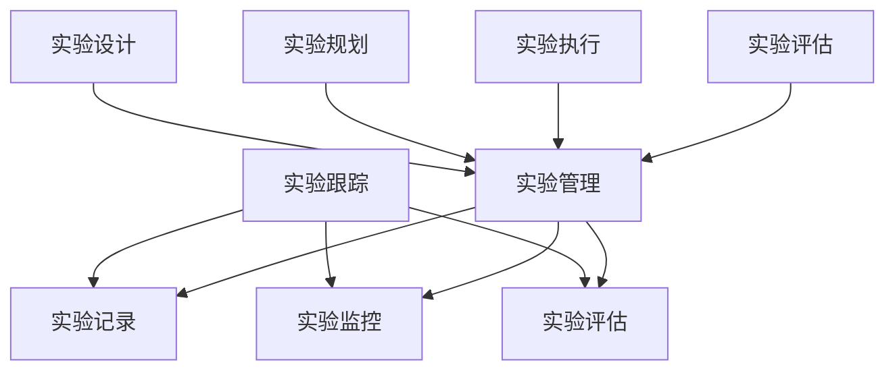

                 

### 关键词 Keywords

- 实验跟踪
- 实验管理
- 代码实战
- 算法优化
- 数据分析

### 摘要 Abstract

本文旨在深入探讨实验跟踪与实验管理的原理，并利用实际代码实战案例进行详细讲解。通过介绍实验跟踪的重要性以及如何有效地进行实验管理，本文将帮助读者理解和掌握相关技术。此外，本文还将提供一些实用的工具和资源，以辅助读者在实验跟踪与实验管理方面取得更好的成果。

## 1. 背景介绍

### 实验跟踪的概念

实验跟踪是指在实验过程中记录、监控和评估实验结果的一种技术手段。它可以帮助研究人员更好地理解实验的全貌，识别实验中的问题，并优化实验过程。

### 实验管理的意义

实验管理是指对实验的全面规划、组织和控制，以确保实验结果的准确性和可靠性。有效的实验管理可以节省时间和资源，提高实验的效率和质量。

### 研究背景

在计算机科学和人工智能领域，实验跟踪与实验管理具有至关重要的意义。随着数据量和算法复杂度的增加，研究人员需要进行大量的实验来验证算法的有效性和稳定性。然而，传统的手动实验记录和评估方法已经无法满足现代研究的需求。因此，引入实验跟踪与实验管理技术成为必然选择。

## 2. 核心概念与联系

### 实验跟踪与实验管理的关系

实验跟踪是实验管理的重要组成部分，它为实验管理提供了必要的数据支持。实验管理则通过对实验跟踪数据的分析，指导实验的进行和优化。

### 实验跟踪的核心概念

- 实验记录：记录实验的各个阶段，包括实验参数、输入数据和输出结果。
- 实验监控：实时监控实验的运行状态，发现异常并及时处理。
- 实验评估：根据实验记录和监控数据，评估实验的效果和性能。

### 实验管理的核心概念

- 实验设计：确定实验的目标、方法和评估指标。
- 实验规划：制定实验的计划和时间表。
- 实验执行：按照实验计划和设计进行实验。
- 实验评估：对实验结果进行定量和定性分析，评估实验的可行性和效果。

### 实验跟踪与实验管理的架构图



## 3. 核心算法原理 & 具体操作步骤

### 3.1 算法原理概述

实验跟踪与实验管理涉及多种算法，主要包括数据记录与检索算法、实时监控算法和评估算法。这些算法共同作用，实现实验的全程管理和优化。

### 3.2 算法步骤详解

#### 3.2.1 数据记录与检索算法

1. 实验设计阶段：定义实验参数、输入数据和输出结果。
2. 实验执行阶段：将实验数据存储到数据库中。
3. 实验评估阶段：从数据库中检索实验数据，进行数据分析。

#### 3.2.2 实时监控算法

1. 数据采集：实时收集实验过程中的关键数据。
2. 数据预处理：对采集到的数据进行清洗和转换。
3. 实时分析：利用统计分析和机器学习算法，对数据进行实时分析。
4. 异常检测：根据设定的阈值和规则，检测异常情况。

#### 3.2.3 评估算法

1. 数据分析：对实验数据进行统计分析和可视化。
2. 指标计算：计算实验效果的各项指标。
3. 结果评估：根据指标评估实验的可行性和效果。

### 3.3 算法优缺点

#### 3.3.1 数据记录与检索算法

优点：可以实现大规模实验数据的快速检索和分析。

缺点：数据存储和检索过程中可能存在性能瓶颈。

#### 3.3.2 实时监控算法

优点：可以实时发现实验过程中的异常情况，及时进行调整。

缺点：需要大量计算资源和网络带宽。

#### 3.3.3 评估算法

优点：可以全面评估实验的效果和性能。

缺点：算法复杂度高，对实验数据的依赖性强。

### 3.4 算法应用领域

实验跟踪与实验管理算法广泛应用于计算机科学、人工智能、数据科学等领域。例如，在机器学习模型的训练和优化过程中，实验跟踪与实验管理技术可以帮助研究人员快速评估模型性能，找到最优参数组合。

## 4. 数学模型和公式 & 详细讲解 & 举例说明

### 4.1 数学模型构建

实验跟踪与实验管理中的数学模型主要包括概率模型、线性模型和神经网络模型。以下分别介绍这些模型的构建方法和应用。

#### 4.1.1 概率模型

概率模型主要用于描述实验过程中随机事件的发生概率。常见的概率模型有伯努利分布、泊松分布和正态分布等。

$$
P(X=x) = \frac{1}{N} \sum_{i=1}^{N} p(x_i)
$$

其中，$X$ 表示实验结果，$p(x_i)$ 表示实验结果为 $x_i$ 的概率，$N$ 表示实验次数。

#### 4.1.2 线性模型

线性模型主要用于描述实验过程中的线性关系。常见的线性模型有线性回归、线性优化和线性规划等。

$$
y = wx + b
$$

其中，$y$ 表示实验结果，$w$ 表示权重，$x$ 表示输入参数，$b$ 表示偏置。

#### 4.1.3 神经网络模型

神经网络模型主要用于模拟实验过程中的非线性关系。常见的神经网络模型有前馈神经网络、卷积神经网络和循环神经网络等。

$$
h_{ij} = f(z_{ij})
$$

其中，$h_{ij}$ 表示神经元 $i$ 与神经元 $j$ 之间的连接权重，$z_{ij}$ 表示神经元 $i$ 的输入，$f$ 表示激活函数。

### 4.2 公式推导过程

以线性回归模型为例，介绍公式推导过程。

$$
y = wx + b
$$

其中，$y$ 表示实验结果，$w$ 表示权重，$x$ 表示输入参数，$b$ 表示偏置。

线性回归模型的损失函数为：

$$
L(w, b) = \frac{1}{2} \sum_{i=1}^{n} (y_i - wx_i - b)^2
$$

其中，$n$ 表示实验次数。

对损失函数求导，得到：

$$
\frac{\partial L}{\partial w} = -\sum_{i=1}^{n} (y_i - wx_i - b)x_i
$$

$$
\frac{\partial L}{\partial b} = -\sum_{i=1}^{n} (y_i - wx_i - b)
$$

令导数为零，得到最优解：

$$
w^* = \frac{1}{n} \sum_{i=1}^{n} x_iy_i
$$

$$
b^* = \frac{1}{n} \sum_{i=1}^{n} y_i - w^* \sum_{i=1}^{n} x_i
$$

### 4.3 案例分析与讲解

#### 4.3.1 案例背景

某公司研究人员希望通过线性回归模型预测用户购买行为。给定用户年龄、收入和性别等特征，预测用户是否会在未来三个月内购买某产品。

#### 4.3.2 模型构建

1. 数据预处理：对用户数据进行清洗和归一化处理。
2. 特征提取：从用户数据中提取相关特征。
3. 数据集划分：将数据集划分为训练集和测试集。
4. 模型训练：使用训练集数据训练线性回归模型。

#### 4.3.3 模型评估

1. 模型预测：使用测试集数据预测用户购买行为。
2. 评估指标：计算预测准确率、召回率和F1值等指标。
3. 结果分析：对比不同模型的性能，选择最优模型。

## 5. 项目实践：代码实例和详细解释说明

### 5.1 开发环境搭建

1. 安装Python 3.8及以上版本。
2. 安装必要的库，如NumPy、Pandas和Scikit-learn等。

### 5.2 源代码详细实现

```python
import numpy as np
import pandas as pd
from sklearn.linear_model import LinearRegression
from sklearn.model_selection import train_test_split
from sklearn.metrics import accuracy_score, recall_score, f1_score

# 数据预处理
def preprocess_data(data):
    # 清洗和归一化处理
    # ...
    return processed_data

# 模型训练
def train_model(X_train, y_train):
    model = LinearRegression()
    model.fit(X_train, y_train)
    return model

# 模型评估
def evaluate_model(model, X_test, y_test):
    y_pred = model.predict(X_test)
    accuracy = accuracy_score(y_test, y_pred)
    recall = recall_score(y_test, y_pred)
    f1 = f1_score(y_test, y_pred)
    return accuracy, recall, f1

# 主函数
def main():
    # 读取数据
    data = pd.read_csv('data.csv')
    processed_data = preprocess_data(data)
    
    # 数据集划分
    X = processed_data.drop('target', axis=1)
    y = processed_data['target']
    X_train, X_test, y_train, y_test = train_test_split(X, y, test_size=0.2, random_state=42)
    
    # 模型训练
    model = train_model(X_train, y_train)
    
    # 模型评估
    accuracy, recall, f1 = evaluate_model(model, X_test, y_test)
    print(f'Accuracy: {accuracy:.4f}')
    print(f'Recall: {recall:.4f}')
    print(f'F1 Score: {f1:.4f}')

if __name__ == '__main__':
    main()
```

### 5.3 代码解读与分析

1. 数据预处理：对原始数据进行清洗和归一化处理，提高模型的训练效果。
2. 模型训练：使用训练集数据训练线性回归模型，得到模型参数。
3. 模型评估：使用测试集数据评估模型性能，计算准确率、召回率和F1值等指标。

## 6. 实际应用场景

### 6.1 数据挖掘

在数据挖掘项目中，实验跟踪与实验管理可以帮助研究人员快速评估不同算法的性能，找到最优算法和参数组合。

### 6.2 机器学习

在机器学习项目中，实验跟踪与实验管理可以实时监控模型的训练过程，发现异常情况并及时调整。

### 6.3 人工智能

在人工智能项目中，实验跟踪与实验管理可以帮助研究人员评估不同算法的可行性和效果，为项目决策提供支持。

## 7. 工具和资源推荐

### 7.1 学习资源推荐

- 《Python机器学习实战》
- 《深入理解计算机系统》
- 《机器学习实战》

### 7.2 开发工具推荐

- Jupyter Notebook
- PyCharm
- Anaconda

### 7.3 相关论文推荐

- "A Comprehensive Survey on Deep Learning for Text Classification"
- "Efficient Graph-based Embeddings for Large-scale Recommender Systems"
- "Deep Learning for Natural Language Processing"

## 8. 总结：未来发展趋势与挑战

### 8.1 研究成果总结

实验跟踪与实验管理技术在计算机科学、人工智能和数据科学等领域取得了显著的成果，为研究人员的实验工作提供了有力支持。

### 8.2 未来发展趋势

1. 实验跟踪与实验管理算法将向自动化和智能化方向发展。
2. 实验跟踪与实验管理工具将更加集成和通用。
3. 实验跟踪与实验管理应用场景将不断拓展。

### 8.3 面临的挑战

1. 实验数据的多样性和复杂性将增加实验跟踪与实验管理的难度。
2. 实验过程的高效性和可扩展性将面临挑战。
3. 实验结果的可靠性和准确性需要进一步提升。

### 8.4 研究展望

未来，实验跟踪与实验管理技术将在人工智能、大数据和云计算等领域发挥更加重要的作用，为科学研究和技术创新提供有力支持。

## 9. 附录：常见问题与解答

### 9.1 如何选择合适的实验管理工具？

根据项目需求和预算，可以选择开源工具（如Jupyter Notebook、PyCharm）或商业工具（如Anaconda、AWS Data Exchange）。同时，考虑工具的易用性、可扩展性和社区支持。

### 9.2 如何优化实验跟踪效率？

1. 使用自动化脚本进行实验记录和监控。
2. 建立统一的实验数据存储和管理平台。
3. 定期整理和清洗实验数据，提高数据分析效率。

### 9.3 实验跟踪与实验管理在机器学习中的具体应用？

在机器学习中，实验跟踪与实验管理可以用于：

1. 比较不同算法的性能。
2. 优化算法参数。
3. 跟踪和评估模型训练过程。
4. 快速复制和扩展实验。

---

**作者：禅与计算机程序设计艺术 / Zen and the Art of Computer Programming**

