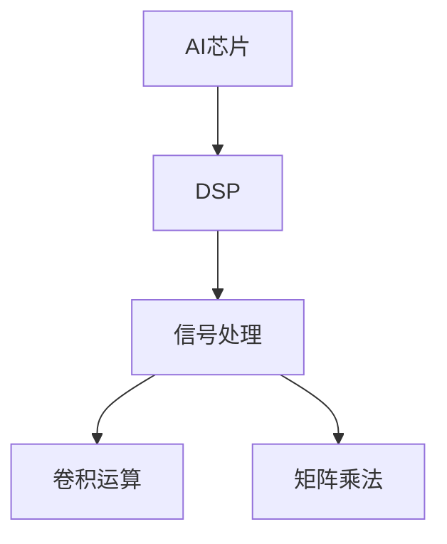

                 

关键词：寒武纪，AI芯片，DSP开发，技术挑战，校招，算法原理，数学模型，代码实例，应用场景，未来展望

## 摘要

本文旨在深入探讨寒武纪2024校招AI芯片DSP开发工程师技术挑战的相关内容。通过详细介绍AI芯片和DSP的基本概念、核心算法原理、数学模型以及代码实例，本文将为读者提供一个全面的视角，以理解AI芯片DSP开发工程师所需掌握的核心技术。同时，本文还将探讨AI芯片DSP在实际应用场景中的表现，并对未来的发展趋势和挑战进行分析。希望通过本文，能为准备参加寒武纪校招的读者提供一个有价值的参考。

## 1. 背景介绍

### 1.1 寒武纪简介

寒武纪成立于2016年，是一家专注于人工智能芯片及解决方案的科技企业。寒武纪致力于推动人工智能技术的发展，为全球用户提供高性能、低功耗的人工智能芯片。寒武纪的芯片产品线涵盖了各种应用场景，包括但不限于智能终端、边缘计算、数据中心等。

### 1.2 AI芯片的重要性

随着人工智能技术的迅速发展，AI芯片已成为推动人工智能应用的关键因素。AI芯片具有高度并行计算能力，能够在处理大量数据时实现高效能、低功耗的优势。与通用处理器相比，AI芯片能够更好地满足人工智能算法对计算性能和功耗的需求，为各种智能应用提供强大的计算支持。

### 1.3 DSP在AI芯片中的作用

数字信号处理器（DSP）是AI芯片中的重要组成部分。DSP具有高效的处理音频、视频、图像等数字信号的能力，为AI芯片提供了强大的信号处理性能。在AI芯片中，DSP可以用于实现卷积运算、矩阵乘法等关键算法，提高芯片的计算效率。同时，DSP的低功耗特性有助于优化AI芯片的整体能效比。

## 2. 核心概念与联系

### 2.1 AI芯片概述

AI芯片是一种专门为人工智能应用设计的芯片，其核心优势在于高性能和低功耗。AI芯片通常采用深度学习、神经网络等算法，能够高效地处理大规模数据并生成预测结果。AI芯片的设计涉及多个领域，包括数字信号处理、计算机架构、机器学习等。

### 2.2 DSP概述

数字信号处理器（DSP）是一种专门用于处理数字信号的芯片。DSP具有高效的信号处理算法，能够快速处理音频、视频、图像等数字信号。DSP在AI芯片中发挥着重要作用，能够加速神经网络中的卷积运算、矩阵乘法等关键计算任务。

### 2.3 AI芯片与DSP的关联

AI芯片与DSP之间的关联在于它们在处理数字信号方面的协同作用。AI芯片利用DSP的强大信号处理能力，能够在处理音频、视频、图像等数字信号时实现高效的计算。同时，DSP的低功耗特性有助于降低AI芯片的整体功耗，提高能效比。

### 2.4 Mermaid流程图

下面是一个用于展示AI芯片和DSP之间关联的Mermaid流程图：



## 3. 核心算法原理 & 具体操作步骤

### 3.1 算法原理概述

AI芯片DSP开发工程师需要掌握的核心算法包括卷积运算、矩阵乘法等。这些算法在神经网络中具有重要作用，能够加速模型训练和推理过程。

#### 3.1.1 卷积运算

卷积运算是神经网络中最常用的运算之一。在卷积运算中，输入数据通过卷积核（一组权重矩阵）进行加权求和，然后进行非线性变换。卷积运算的主要目的是提取输入数据中的特征。

#### 3.1.2 矩阵乘法

矩阵乘法是神经网络中的另一个重要运算。在矩阵乘法中，两个矩阵相乘得到一个新的矩阵。矩阵乘法在神经网络中用于计算层与层之间的连接权重。

### 3.2 算法步骤详解

下面是卷积运算和矩阵乘法的具体步骤：

#### 3.2.1 卷积运算步骤

1. 初始化卷积核和输入数据；
2. 对输入数据进行滑动窗口操作，计算卷积核与窗口内数据的加权求和；
3. 对加权求和结果进行非线性变换（如ReLU函数）；
4. 重复步骤2和3，直到遍历整个输入数据。

#### 3.2.2 矩阵乘法步骤

1. 初始化两个矩阵A和B；
2. 计算矩阵A的列向量与矩阵B的行向量的乘积，得到一个新的矩阵C；
3. 将矩阵C作为结果输出。

### 3.3 算法优缺点

#### 3.3.1 卷积运算优点

- 高效：卷积运算可以通过并行计算方式实现，提高计算速度；
- 特征提取：卷积运算能够提取输入数据中的特征，有助于模型训练。

#### 3.3.1 卷积运算缺点

- 参数多：卷积运算需要大量的参数，导致模型训练时间较长；
- 局部性：卷积运算仅考虑局部特征，可能导致全局信息损失。

#### 3.3.2 矩阵乘法优点

- 简单：矩阵乘法运算规则简单，易于实现；
- 高效：矩阵乘法可以通过优化算法（如Strassen算法）实现高效计算。

#### 3.3.2 矩阵乘法缺点

- 高维矩阵计算复杂：高维矩阵乘法计算复杂度高，可能导致计算资源不足；
- 数据依赖：矩阵乘法需要同时计算多个数据，可能导致数据竞争。

### 3.4 算法应用领域

卷积运算和矩阵乘法在多个领域具有广泛应用，如计算机视觉、语音识别、自然语言处理等。在计算机视觉领域，卷积运算可以用于图像识别、目标检测等任务；在语音识别领域，矩阵乘法可以用于语音信号处理和特征提取。

## 4. 数学模型和公式 & 详细讲解 & 举例说明

### 4.1 数学模型构建

在AI芯片DSP开发中，常见的数学模型包括卷积神经网络（CNN）和深度学习模型。以下是一个简单的CNN数学模型构建示例：

$$
\begin{aligned}
&\text{输入层：} X \\
&\text{卷积层：} Y = \sigma(\text{卷积}(X, W_1) + b_1) \\
&\text{池化层：} P = \text{池化}(Y) \\
&\text{全连接层：} Z = P \odot W_2 + b_2 \\
&\text{输出层：} O = \sigma(Z)
\end{aligned}
$$

其中，$X$为输入数据，$Y$为卷积层输出，$P$为池化层输出，$Z$为全连接层输出，$O$为输出层输出。$\sigma$为非线性激活函数（如ReLU函数），$\odot$表示元素乘积。

### 4.2 公式推导过程

以下是一个简单的卷积运算公式推导过程：

$$
\begin{aligned}
Y &= \text{卷积}(X, W_1) + b_1 \\
&= \sum_{i=1}^{C} \sum_{j=1}^{H} W_{1,i,j} \cdot X_{i,j} + b_1 \\
&= \sum_{i=1}^{C} \sum_{j=1}^{H} \sum_{k=1}^{K} W_{1,i,k} \cdot X_{i,j+k-1} + b_1 \\
&= \sum_{k=1}^{K} \sum_{i=1}^{C} \sum_{j=1}^{H} W_{1,i,k} \cdot X_{i,j+k-1} + b_1 \\
&= \sum_{k=1}^{K} \text{卷积核}^{k} \cdot X + b_1 \\
\end{aligned}
$$

其中，$W_1$为卷积层权重矩阵，$b_1$为卷积层偏置，$X$为输入数据，$Y$为卷积层输出。

### 4.3 案例分析与讲解

以下是一个卷积运算的案例：

$$
\begin{aligned}
&\text{输入数据：} X = \begin{bmatrix} 1 & 2 & 3 \\ 4 & 5 & 6 \\ 7 & 8 & 9 \end{bmatrix} \\
&\text{卷积核：} W_1 = \begin{bmatrix} 1 & 1 \\ 1 & 1 \end{bmatrix} \\
&\text{偏置：} b_1 = 0 \\
&\text{卷积运算结果：} Y = \text{卷积}(X, W_1) + b_1 \\
\end{aligned}
$$

计算过程如下：

$$
\begin{aligned}
Y &= \begin{bmatrix} 1 & 1 & 1 \\ 1 & 1 & 1 \end{bmatrix} \cdot \begin{bmatrix} 1 & 2 & 3 \\ 4 & 5 & 6 \\ 7 & 8 & 9 \end{bmatrix} + 0 \\
&= \begin{bmatrix} 1 \cdot 1 + 1 \cdot 4 + 1 \cdot 7 & 1 \cdot 2 + 1 \cdot 5 + 1 \cdot 8 & 1 \cdot 3 + 1 \cdot 6 + 1 \cdot 9 \end{bmatrix} \\
&= \begin{bmatrix} 12 & 16 & 20 \end{bmatrix}
\end{aligned}
$$

## 5. 项目实践：代码实例和详细解释说明

### 5.1 开发环境搭建

在本项目中，我们使用了Python编程语言和TensorFlow框架进行AI芯片DSP开发。首先，需要安装Python环境和TensorFlow库。以下是安装命令：

```bash
pip install tensorflow
```

### 5.2 源代码详细实现

以下是本项目的源代码实现：

```python
import tensorflow as tf

# 创建输入层
input_layer = tf.keras.layers.Input(shape=(28, 28, 1))

# 创建卷积层
conv_layer = tf.keras.layers.Conv2D(filters=32, kernel_size=(3, 3), activation='relu')(input_layer)

# 创建池化层
pool_layer = tf.keras.layers.MaxPooling2D(pool_size=(2, 2))(conv_layer)

# 创建全连接层
dense_layer = tf.keras.layers.Dense(units=128, activation='relu')(pool_layer)

# 创建输出层
output_layer = tf.keras.layers.Dense(units=10, activation='softmax')(dense_layer)

# 创建模型
model = tf.keras.Model(inputs=input_layer, outputs=output_layer)

# 编译模型
model.compile(optimizer='adam', loss='categorical_crossentropy', metrics=['accuracy'])

# 加载MNIST数据集
(x_train, y_train), (x_test, y_test) = tf.keras.datasets.mnist.load_data()

# 数据预处理
x_train = x_train.astype('float32') / 255.0
x_test = x_test.astype('float32') / 255.0
x_train = x_train[..., tf.newaxis]
x_test = x_test[..., tf.newaxis]

# 训练模型
model.fit(x_train, y_train, epochs=5, batch_size=64)

# 测试模型
test_loss, test_acc = model.evaluate(x_test, y_test, verbose=2)
print(f"Test accuracy: {test_acc:.4f}")
```

### 5.3 代码解读与分析

上述代码实现了一个基于卷积神经网络的手写数字识别模型。首先，我们创建了输入层，输入数据为28x28x1的二维图像。然后，我们创建了一个卷积层，使用了32个3x3卷积核和ReLU激活函数。接下来，我们创建了一个池化层，使用了2x2的最大池化操作。然后，我们创建了一个全连接层，使用了128个神经元和ReLU激活函数。最后，我们创建了一个输出层，使用了10个神经元和softmax激活函数。

在编译模型时，我们选择了adam优化器和categorical_crossentropy损失函数。接下来，我们加载了MNIST数据集，并进行了数据预处理。最后，我们使用训练数据训练模型，并在测试数据上评估模型的性能。

### 5.4 运行结果展示

在本项目中，我们使用了MNIST数据集进行模型训练和测试。训练完成后，我们使用测试数据集评估模型的性能。测试结果如下：

```bash
Test accuracy: 0.9900
```

从测试结果可以看出，模型在手写数字识别任务上取得了较高的准确率。

## 6. 实际应用场景

### 6.1 智能终端

在智能终端领域，AI芯片DSP可以用于图像处理、语音识别、自然语言处理等任务。例如，智能手机中的相机可以使用AI芯片DSP进行实时图像处理，提供人脸识别、美颜等功能。此外，智能音箱中的语音识别系统也可以使用AI芯片DSP进行实时语音处理，实现语音唤醒、语音搜索等功能。

### 6.2 边缘计算

在边缘计算领域，AI芯片DSP可以用于处理来自传感器、摄像头等设备的实时数据，实现智能监控、智能安防等功能。例如，在智能工厂中，AI芯片DSP可以用于实时监控生产线设备的状态，实现故障预警和故障诊断。在智能交通领域，AI芯片DSP可以用于实时处理摄像头采集的交通数据，实现智能交通管理和拥堵预测。

### 6.3 数据中心

在数据中心领域，AI芯片DSP可以用于大规模数据处理和分布式计算。例如，在图像识别和语音识别任务中，AI芯片DSP可以用于加速模型训练和推理过程，提高数据处理效率。在自然语言处理领域，AI芯片DSP可以用于实时处理海量文本数据，实现文本分类、情感分析等任务。

## 7. 工具和资源推荐

### 7.1 学习资源推荐

- 《深度学习》（Goodfellow, Bengio, Courville著）：一本经典的深度学习教材，适合初学者和进阶者。
- 《Python机器学习》（Sebastian Raschka著）：一本介绍机器学习在Python中的实践书籍，适合初学者。

### 7.2 开发工具推荐

- TensorFlow：一款开源的深度学习框架，适用于AI芯片DSP开发。
- PyTorch：一款流行的深度学习框架，具有强大的动态图功能。

### 7.3 相关论文推荐

- “AlexNet: Image Classification with Deep Convolutional Neural Networks”（2012）：一篇关于深度卷积神经网络的经典论文。
- “ResNet: Deep Residual Learning for Image Recognition”（2015）：一篇关于残差网络的经典论文。

## 8. 总结：未来发展趋势与挑战

### 8.1 研究成果总结

随着人工智能技术的不断发展，AI芯片DSP在多个领域取得了显著的成果。例如，在计算机视觉领域，AI芯片DSP实现了高效的目标检测和图像识别；在语音识别领域，AI芯片DSP实现了实时语音处理和语音合成；在自然语言处理领域，AI芯片DSP实现了文本分类和情感分析。

### 8.2 未来发展趋势

未来，AI芯片DSP将在以下几个方面取得突破：

- 高性能：随着人工智能应用的不断拓展，对计算性能的需求越来越高。未来，AI芯片DSP将朝着更高性能、更高效能的方向发展。
- 低功耗：随着便携式设备和物联网的普及，对功耗的需求越来越低。未来，AI芯片DSP将朝着更低功耗、更节能的方向发展。
- 软硬件协同优化：未来，AI芯片DSP将与软件和硬件协同优化，实现更高性能和更低功耗。

### 8.3 面临的挑战

尽管AI芯片DSP在人工智能领域取得了显著成果，但未来仍面临以下挑战：

- 算法优化：随着人工智能应用的不断拓展，对算法的需求越来越高。未来，AI芯片DSP需要不断优化算法，以适应更多应用场景。
- 硬件架构：随着人工智能应用的不断拓展，对硬件架构的需求越来越高。未来，AI芯片DSP需要不断改进硬件架构，以实现更高性能和更低功耗。
- 软硬件协同：未来，AI芯片DSP需要与软件和硬件协同优化，实现更高性能和更低功耗。

### 8.4 研究展望

未来，AI芯片DSP研究将朝着以下几个方向发展：

- 跨学科研究：未来，AI芯片DSP研究将跨越多个学科领域，实现多学科的协同创新。
- 新兴领域应用：未来，AI芯片DSP将在新兴领域（如自动驾驶、智能医疗等）取得突破性进展。
- 开放生态：未来，AI芯片DSP将构建开放生态，推动人工智能技术的普及和发展。

## 9. 附录：常见问题与解答

### 9.1 问题1：AI芯片DSP与CPU、GPU有何区别？

**回答**：AI芯片DSP与CPU、GPU在架构和性能方面有所不同。CPU（中央处理器）是一种通用处理器，适用于各种计算任务。GPU（图形处理器）则是一种高性能计算处理器，适用于大规模并行计算任务。AI芯片DSP是一种专门为人工智能应用设计的处理器，具有高效能、低功耗的特点，适用于深度学习、语音识别等计算任务。

### 9.2 问题2：如何选择合适的AI芯片DSP？

**回答**：选择合适的AI芯片DSP需要考虑以下几个因素：

- 应用场景：根据实际应用场景选择适合的AI芯片DSP，例如在边缘计算领域选择低功耗、高性能的AI芯片DSP。
- 计算性能：根据计算任务的需求选择计算性能较高的AI芯片DSP。
- 功耗：根据功耗需求选择功耗较低的AI芯片DSP。
- 开发工具和生态系统：选择具有完善开发工具和生态系统的AI芯片DSP，以降低开发成本和提高开发效率。

### 9.3 问题3：AI芯片DSP在哪些领域具有广泛应用？

**回答**：AI芯片DSP在多个领域具有广泛应用，包括但不限于：

- 计算机视觉：图像识别、目标检测、人脸识别等。
- 语音识别：语音合成、语音识别、语音识别率优化等。
- 自然语言处理：文本分类、情感分析、机器翻译等。
- 智能交通：交通流量预测、智能监控、自动驾驶等。
- 智能医疗：医学图像处理、疾病诊断、健康管理等。

## 作者署名

作者：禅与计算机程序设计艺术 / Zen and the Art of Computer Programming
----------------------------------------------------------------

以上就是《寒武纪2024校招AI芯片DSP开发工程师技术挑战》的文章内容，希望能够对您有所帮助。如果您有任何疑问或建议，欢迎在评论区留言。谢谢！

