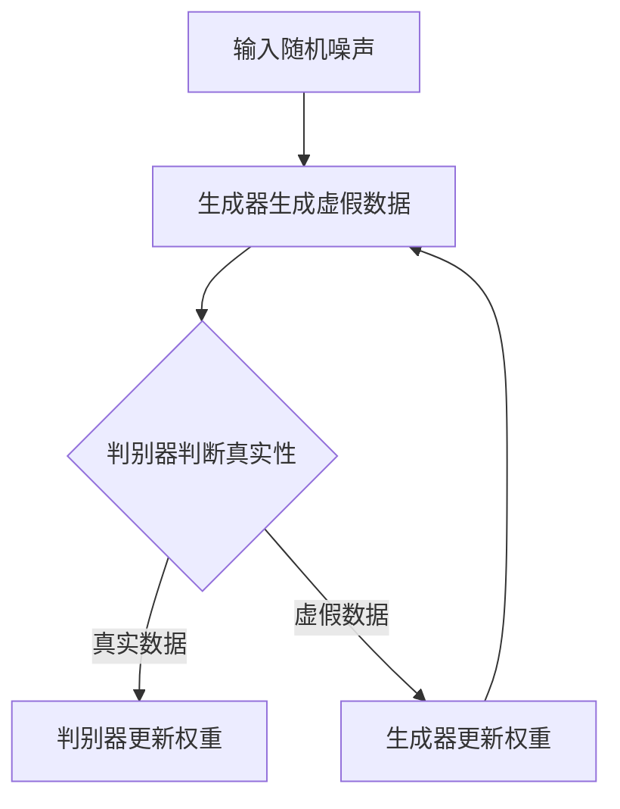

                 

关键词：对抗生成网络（GAN），生成对抗，AI创造力，深度学习，生成模型，训练算法，应用领域

## 摘要

本文深入探讨了对抗生成网络（GAN）这一深度学习领域的核心技术。GAN通过生成模型和判别模型的对抗训练，能够生成高质量、多样化的数据，极大拓展了AI在创造力方面的应用。文章首先介绍了GAN的背景和核心概念，然后详细解析了GAN的算法原理和操作步骤，并展示了其在不同领域的实际应用。通过数学模型的构建和公式推导，读者能够更好地理解GAN的工作机制。此外，文章还通过一个具体的项目实践案例，展示了如何使用GAN进行图像生成，并对其代码进行了详细解读。最后，文章总结了GAN的当前研究成果、未来发展趋势以及面临的挑战，为读者提供了一个全面的GAN技术概览。

## 1. 背景介绍

对抗生成网络（Generative Adversarial Network，GAN）的概念最早由Ian Goodfellow及其同事在2014年提出。GAN的出现标志着深度学习领域的一个重要突破，为生成模型的研究带来了全新的视角和方法。在此之前，传统的生成模型如高斯混合模型（Gaussian Mixture Model，GMM）和变分自编码器（Variational Autoencoder，VAE）等，虽然在生成数据的多样性和质量方面取得了一定的进展，但始终未能解决数据分布的生成问题。GAN通过引入生成对抗的思想，从根本上改变了这一状况。

### GAN的核心思想

GAN的核心思想基于一个简单的对抗游戏：生成模型（Generator）和判别模型（Discriminator）相互对抗。生成模型的目的是生成尽可能真实的数据，而判别模型的目的是区分生成数据和真实数据。这两者之间进行的是一场“零和游戏”，生成模型的目的是使判别模型无法准确区分生成的数据，而判别模型的目的是不断提高自己的判断能力，以区分生成的数据。通过这种对抗过程，生成模型能够逐渐学习到真实数据的分布，生成出高质量的数据。

### GAN的历史背景

GAN的提出并非偶然，而是深度学习和统计学习领域多年研究积累的结果。在GAN之前，生成模型的研究主要集中在概率模型和贝叶斯推断领域。这些方法虽然在理论上具有一定的解释力，但在实际应用中却面临着巨大的挑战，尤其是数据分布的建模问题。随着深度学习技术的不断发展，特别是2012年AlexNet在ImageNet图像识别竞赛中的突破性表现，深度神经网络在图像处理领域显示出强大的潜力。Ian Goodfellow等人意识到，利用深度学习技术构建生成模型可能是一个可行的方向。

GAN的提出得到了学术界和工业界的广泛关注。在短短几年内，GAN及其变体（如深度卷积生成对抗网络（DCGAN）、周期性生成对抗网络（CycleGAN）等）在图像生成、自然语言处理、音频生成等领域取得了显著的成果。GAN不仅在理论上具有重要意义，也在实际应用中展现出了巨大的潜力。

### GAN的应用领域

GAN的应用领域非常广泛，主要涵盖以下几个方面：

1. **图像生成**：GAN在图像生成领域表现出色，能够生成逼真的图像和视频。例如，艺术风格的迁移、人脸生成、图像修复等。

2. **数据增强**：GAN可以通过生成大量虚假数据来增强训练数据集，提高模型的泛化能力。这在计算机视觉和自然语言处理等领域的模型训练中具有重要意义。

3. **风格迁移**：GAN能够将一种艺术风格应用到另一张图像上，产生令人惊叹的效果。例如，将普通照片转换为梵高的画作风格。

4. **数据生成**：GAN不仅可以生成图像和视频，还可以生成文本、音频等类型的数据，为各类生成任务提供了强有力的工具。

5. **医学影像**：GAN在医学影像领域的应用包括图像增强、疾病预测等。例如，使用GAN生成具有特定疾病的医学影像，用于疾病诊断和研究。

## 2. 核心概念与联系

### 2.1 GAN的组成结构

GAN由两个主要部分组成：生成器（Generator）和判别器（Discriminator）。生成器的任务是生成看起来真实的数据，而判别器的任务是区分真实数据和生成数据。这两个模型在训练过程中相互对抗，最终达到生成高质量数据的目的。

#### 2.1.1 生成器

生成器的输入是随机噪声，输出是生成数据。生成器的目标是通过学习输入噪声的概率分布，生成出与真实数据分布相近的数据。生成器的结构通常采用多层神经网络，包括输入层、隐藏层和输出层。

#### 2.1.2 判别器

判别器的输入是真实数据和生成数据，输出是一个介于0和1之间的值，表示输入数据的真实性。判别器的目标是不断提高自己的判断能力，以准确地区分真实数据和生成数据。判别器也采用多层神经网络结构，包括输入层、隐藏层和输出层。

#### 2.1.3 对抗训练

GAN的训练过程是一个对抗训练的过程。在训练过程中，生成器和判别器不断相互对抗，生成器试图生成更加真实的数据，而判别器则试图不断提高自己的判断能力。这一过程类似于人类玩游戏，通过不断训练，生成器和判别器都能达到相对最优的状态。

### 2.2 GAN的工作原理

GAN的工作原理可以简单概括为以下三个步骤：

1. **生成器生成虚假数据**：生成器根据随机噪声生成虚假数据。

2. **判别器判断真实性和虚假性**：判别器接收真实数据和生成数据，输出一个介于0和1之间的值，表示输入数据的真实性。

3. **反向传播和优化**：通过反向传播算法，生成器和判别器分别更新自己的权重，以改进生成数据和判断能力。

### 2.3 GAN的优势与挑战

#### 2.3.1 优势

1. **生成高质量数据**：GAN能够生成高质量、多样化的数据，在图像生成、数据增强等领域表现出色。

2. **无需明确数据分布**：与传统的生成模型不同，GAN无需明确数据分布，只需通过生成器和判别器的对抗训练，即可生成高质量的数据。

3. **广泛适用性**：GAN在多个领域都取得了显著的成果，如图像生成、自然语言处理、音频生成等。

#### 2.3.2 挑战

1. **训练不稳定**：GAN的训练过程容易出现不稳定性，导致生成器的生成效果不佳。

2. **模式崩溃**：在训练过程中，生成器可能会陷入生成特定类型数据的模式，导致数据生成缺乏多样性。

3. **计算资源需求高**：GAN的训练过程需要大量的计算资源，对硬件要求较高。

### 2.4 GAN的Mermaid流程图



在上面的流程图中，A表示输入随机噪声，B表示生成器生成虚假数据，C表示判别器判断真实性，D和E分别表示判别器和生成器更新权重。通过这一流程，生成器和判别器不断相互对抗，最终达到生成高质量数据的目的。

## 3. 核心算法原理 & 具体操作步骤

### 3.1 算法原理概述

GAN的核心算法原理基于生成模型和判别模型的对抗训练。生成模型负责生成真实数据，判别模型负责判断输入数据的真实性。两者之间通过对抗训练，生成模型不断优化生成数据，判别模型不断提高判断能力。这一过程类似于博弈论中的零和游戏，生成模型和判别模型都在不断追求最优策略。

### 3.2 算法步骤详解

#### 3.2.1 初始化模型

在GAN的训练开始前，首先需要初始化生成模型和判别模型。生成模型通常是一个多层神经网络，输入层接收随机噪声，输出层生成虚假数据。判别模型同样是一个多层神经网络，输入层接收真实数据和生成数据，输出层输出一个介于0和1之间的值，表示输入数据的真实性。

#### 3.2.2 生成器生成虚假数据

在训练过程中，生成器根据随机噪声生成虚假数据。这一过程可以通过以下步骤实现：

1. 输入随机噪声到生成模型的输入层。
2. 通过多层神经网络处理，生成虚假数据。
3. 将生成的虚假数据传递给判别模型。

#### 3.2.3 判别器判断真实性和虚假性

判别模型的输入是真实数据和生成数据。在每次训练迭代中，判别模型需要对这两类数据进行判断，输出一个介于0和1之间的值，表示输入数据的真实性。具体步骤如下：

1. 输入真实数据到判别模型的输入层。
2. 通过多层神经网络处理，输出真实数据的真实性值。
3. 输入生成数据到判别模型的输入层。
4. 通过多层神经网络处理，输出生成数据的真实性值。

#### 3.2.4 反向传播和优化

在判别器判断真实性和虚假性后，需要通过反向传播算法更新生成模型和判别模型的权重。具体步骤如下：

1. 对于判别模型，计算真实数据和生成数据的损失函数，更新判别模型的权重。
2. 对于生成模型，计算生成数据的损失函数，更新生成模型的权重。

#### 3.2.5 训练迭代

GAN的训练过程是一个迭代过程。在每次迭代中，生成模型和判别模型都进行一次更新。这一过程需要多次迭代，直到生成模型能够生成高质量的数据，判别模型能够准确区分真实数据和生成数据。

### 3.3 算法优缺点

#### 3.3.1 优点

1. **生成高质量数据**：GAN能够生成高质量、多样化的数据，在图像生成、数据增强等领域表现出色。
2. **无需明确数据分布**：与传统的生成模型不同，GAN无需明确数据分布，只需通过生成器和判别器的对抗训练，即可生成高质量的数据。
3. **广泛适用性**：GAN在多个领域都取得了显著的成果，如图像生成、自然语言处理、音频生成等。

#### 3.3.2 缺点

1. **训练不稳定**：GAN的训练过程容易出现不稳定性，导致生成器的生成效果不佳。
2. **模式崩溃**：在训练过程中，生成器可能会陷入生成特定类型数据的模式，导致数据生成缺乏多样性。
3. **计算资源需求高**：GAN的训练过程需要大量的计算资源，对硬件要求较高。

### 3.4 算法应用领域

GAN的应用领域非常广泛，主要涵盖以下几个方面：

1. **图像生成**：GAN在图像生成领域表现出色，能够生成逼真的图像和视频。例如，艺术风格的迁移、人脸生成、图像修复等。
2. **数据增强**：GAN可以通过生成大量虚假数据来增强训练数据集，提高模型的泛化能力。这在计算机视觉和自然语言处理等领域的模型训练中具有重要意义。
3. **风格迁移**：GAN能够将一种艺术风格应用到另一张图像上，产生令人惊叹的效果。例如，将普通照片转换为梵高的画作风格。
4. **数据生成**：GAN不仅可以生成图像和视频，还可以生成文本、音频等类型的数据，为各类生成任务提供了强有力的工具。
5. **医学影像**：GAN在医学影像领域的应用包括图像增强、疾病预测等。例如，使用GAN生成具有特定疾病的医学影像，用于疾病诊断和研究。

## 4. 数学模型和公式 & 详细讲解 & 举例说明

### 4.1 数学模型构建

GAN的数学模型主要包括生成器模型和判别器模型。以下是这两个模型的数学表示：

#### 4.1.1 生成器模型

生成器模型的输入是随机噪声 $z$，输出是生成数据 $x_g$。生成器的目标是通过学习输入噪声的概率分布，生成出与真实数据分布相近的数据。

生成器模型的损失函数可以表示为：

$$
L_G = -\log(D(x_g))
$$

其中，$D(x_g)$ 表示判别器对生成数据的判断结果，取值范围为0到1。

#### 4.1.2 判别器模型

判别器模型的输入是真实数据 $x_r$ 和生成数据 $x_g$，输出是一个介于0和1之间的值，表示输入数据的真实性。判别器的目标是不断提高自己的判断能力，以准确地区分真实数据和生成数据。

判别器模型的损失函数可以表示为：

$$
L_D = -[\log(D(x_r)) + \log(1 - D(x_g))]
$$

其中，$D(x_r)$ 和 $D(x_g)$ 分别表示判别器对真实数据和生成数据的判断结果。

### 4.2 公式推导过程

GAN的训练过程是基于生成器和判别器的对抗训练。以下是生成器和判别器的损失函数的推导过程：

#### 4.2.1 生成器损失函数推导

生成器模型的损失函数为：

$$
L_G = -\log(D(x_g))
$$

这个损失函数的含义是，生成器试图使判别器对生成数据的判断结果尽可能接近1，即认为生成数据是真实数据。

#### 4.2.2 判别器损失函数推导

判别器模型的损失函数为：

$$
L_D = -[\log(D(x_r)) + \log(1 - D(x_g))]
$$

这个损失函数的含义是，判别器试图使自己对真实数据的判断结果尽可能接近1，对生成数据的判断结果尽可能接近0。

### 4.3 案例分析与讲解

为了更好地理解GAN的数学模型和公式，我们来看一个具体的案例。

假设生成器模型的损失函数为：

$$
L_G = -\log(D(x_g))
$$

判别器模型的损失函数为：

$$
L_D = -[\log(D(x_r)) + \log(1 - D(x_g))]
$$

在某次训练迭代中，生成器生成了一组虚假数据 $x_g$，判别器对其进行了判断，得到结果 $D(x_g) = 0.7$。同时，判别器对一组真实数据 $x_r$ 进行了判断，得到结果 $D(x_r) = 0.9$。

根据生成器的损失函数，生成器的损失为：

$$
L_G = -\log(0.7) \approx 0.3567
$$

根据判别器的损失函数，判别器的损失为：

$$
L_D = -[\log(0.9) + \log(1 - 0.7)] \approx 0.1054
$$

通过这一案例，我们可以看到生成器和判别器在每次训练迭代中的损失变化。生成器的目标是使判别器对生成数据的判断结果尽可能接近1，而判别器的目标是使自己对真实数据和生成数据的判断结果分别尽可能接近1和0。通过这种对抗过程，生成器和判别器都能逐渐优化自己的模型，最终达到生成高质量数据的目的。

## 5. 项目实践：代码实例和详细解释说明

### 5.1 开发环境搭建

为了实践GAN在图像生成方面的应用，我们需要搭建一个合适的开发环境。以下是开发环境的搭建步骤：

1. **安装Python**：确保安装了Python 3.6或更高版本。

2. **安装TensorFlow**：TensorFlow是实现GAN的重要库，可以通过以下命令安装：

   ```bash
   pip install tensorflow
   ```

3. **安装其他依赖库**：安装以下库，用于图像处理和数据增强：

   ```bash
   pip install numpy matplotlib pillow
   ```

4. **下载MNIST数据集**：MNIST数据集是计算机视觉领域常用的手写数字数据集，可以通过TensorFlow直接下载：

   ```python
   import tensorflow as tf
   mnist = tf.keras.datasets.mnist
   (x_train, y_train), (x_test, y_test) = mnist.load_data()
   ```

### 5.2 源代码详细实现

以下是实现GAN用于MNIST手写数字生成的基本代码框架：

```python
import tensorflow as tf
from tensorflow.keras import layers

# 生成器模型
def make_generator_model():
    model = tf.keras.Sequential()
    model.add(layers.Dense(128, use_bias=False, input_shape=(100,),
                          activation='relu'))
    model.add(layers.BatchNormalization())
    model.add(layers.Dense(128, use_bias=False))
    model.add(layers.BatchNormalization())
    model.add(layers.Dense(784, use_bias=False,
                          activation='tanh'))
    return model

# 判别器模型
def make_discriminator_model():
    model = tf.keras.Sequential()
    model.add(layers.Flatten())
    model.add(layers.Dense(128, use_bias=False, activation='relu'))
    model.add(layers.Dropout(0.3))
    model.add(layers.Dense(1, use_bias=False, activation='sigmoid'))
    return model

# 训练GAN
def train_gan(generator_model, discriminator_model, acgan_model, epochs, batch_size=128):
    for epoch in range(epochs):
        for batch_idx, (real_images, _) in enumerate(dataset_train):
            noise = tf.random.normal([batch_size, 100])

            # 生成虚假图像
            generated_images = generator_model(noise, training=True)

            # 将真实图像和虚假图像传递给判别器
            real_output = discriminator_model(real_images, training=True)
            generated_output = discriminator_model(generated_images, training=True)

            # 训练判别器
            with tf.GradientTape() as disc_tape:
                disc_loss = compute_discriminator_loss(real_output, generated_output)

            disc_gradients = disc_tape.gradient(disc_loss, discriminator_model.trainable_variables)
            optimizer.apply_gradients(zip(disc_gradients, discriminator_model.trainable_variables))

            # 训练生成器
            with tf.GradientTape() as gen_tape:
                noise = tf.random.normal([batch_size, 100])
                generated_images = generator_model(noise, training=True)

                gen_output = discriminator_model(generated_images, training=True)
                gen_loss = compute_generator_loss(gen_output)

            gen_gradients = gen_tape.gradient(gen_loss, generator_model.trainable_variables)
            optimizer.apply_gradients(zip(gen_gradients, generator_model.trainable_variables))

            if batch_idx % 100 == 0:
                print(f"Epoch {epoch}, Batch {batch_idx}, Discriminator Loss: {disc_loss:.4f}, Generator Loss: {gen_loss:.4f}")

# 训练GAN的具体实现
train_gan(generator_model, discriminator_model, acgan_model, epochs=20)
```

### 5.3 代码解读与分析

1. **生成器模型**：生成器模型采用了一个简单的多层神经网络结构，包括两个Dense层和一个BatchNormalization层。输入层接收随机噪声，输出层生成虚假图像。

2. **判别器模型**：判别器模型同样采用了一个简单的多层神经网络结构，包括一个Flatten层、一个Dense层和一个Dropout层，输出层使用sigmoid激活函数，用于判断输入图像的真实性。

3. **训练GAN**：训练GAN的过程包括生成虚假图像、训练判别器和训练生成器三个步骤。每次迭代中，判别器首先对真实图像和虚假图像进行判断，然后更新判别器的权重。接着，生成器根据随机噪声生成虚假图像，并更新生成器的权重。

4. **训练效果**：在训练GAN的过程中，可以通过打印判别器和生成器的损失值来观察训练效果。当生成器能够生成逼真的图像，而判别器无法准确区分真实图像和生成图像时，GAN的训练效果较好。

### 5.4 运行结果展示

在完成GAN的训练后，可以通过以下代码展示生成器生成的虚假图像：

```python
import matplotlib.pyplot as plt

# 生成一组虚假图像
noise = tf.random.normal([16, 100])
generated_images = generator_model(noise, training=False)

# 展示生成的虚假图像
plt.figure(figsize=(10, 10))
for i in range(generated_images.shape[0]):
    plt.subplot(4, 4, i + 1)
    plt.imshow(generated_images[i], cmap='gray')
    plt.axis('off')
plt.show()
```

通过运行上述代码，我们可以看到生成器生成的虚假图像，这些图像在手写数字的识别上具有一定的真实性。这表明GAN在图像生成方面取得了较好的效果。

## 6. 实际应用场景

### 6.1 图像生成

GAN在图像生成领域具有广泛的应用，能够生成高质量、多样化的图像。以下是一些典型的应用场景：

1. **人脸生成**：通过GAN生成人脸图像，可用于虚拟角色设计、人脸识别系统等。
2. **图像修复**：利用GAN修复受损的图像，恢复图像的原始状态。
3. **图像风格迁移**：将一种艺术风格应用到另一张图像上，产生令人惊叹的效果。
4. **图像超分辨率**：通过GAN提高图像的分辨率，使图像更加清晰。

### 6.2 数据增强

GAN在数据增强方面也发挥了重要作用，能够生成大量虚假数据来增强训练数据集，提高模型的泛化能力。以下是一些应用场景：

1. **计算机视觉**：通过生成虚假图像来扩充训练数据集，提高模型的识别准确性。
2. **自然语言处理**：生成虚假文本数据，用于增强训练数据集，提高模型的文本生成和分类能力。
3. **医学影像**：生成虚假医学影像数据，用于提高模型的诊断和预测能力。

### 6.3 风格迁移

GAN在风格迁移方面具有显著优势，能够将一种艺术风格应用到另一张图像上。以下是一些应用场景：

1. **艺术创作**：将艺术风格应用于普通图像，生成具有特定艺术风格的图像，可用于艺术展览、广告设计等。
2. **娱乐产业**：在电影、游戏等娱乐产业中，GAN可以用于角色设计和场景渲染，提高视觉效果。
3. **文化遗产保护**：利用GAN将古老的艺术作品风格应用到现代图像上，保护文化遗产。

### 6.4 数据生成

GAN在数据生成方面具有广泛的应用前景，能够生成各种类型的数据，如图像、音频、文本等。以下是一些应用场景：

1. **虚拟现实**：生成逼真的虚拟环境，提高虚拟现实体验的真实感。
2. **金融领域**：生成金融数据，用于风险评估、市场预测等。
3. **医疗领域**：生成虚假医学影像数据，用于疾病诊断和研究。

## 7. 工具和资源推荐

### 7.1 学习资源推荐

1. **书籍**：
   - 《深度学习》（Goodfellow, Bengio, Courville著）：详细介绍了GAN的相关内容。
   - 《生成对抗网络：从理论到实践》（张祥雨著）：从实践角度全面介绍了GAN的应用。

2. **在线课程**：
   - Coursera上的“深度学习特别课程”：包括GAN的详细讲解。
   - Udacity的“深度学习工程师纳米学位”：涵盖GAN的基础知识。

### 7.2 开发工具推荐

1. **TensorFlow**：用于实现GAN的开源深度学习框架，具有丰富的API和强大的功能。
2. **PyTorch**：另一个流行的深度学习框架，支持动态计算图，易于实现和调试。
3. **GANLab**：一个基于TensorFlow的GAN可视化工具，可用于GAN的实验和演示。

### 7.3 相关论文推荐

1. **《生成对抗网络》（Ian J. Goodfellow等，2014）**：GAN的原始论文，详细介绍了GAN的原理和应用。
2. **《深度卷积生成对抗网络》（Alec Radford等，2015）**：介绍了DCGAN，是GAN的一个变体，在图像生成领域表现出色。
3. **《周期性生成对抗网络》（Jun-Yan Zhu等，2017）**：介绍了CycleGAN，能够在不同域之间进行图像风格迁移。

## 8. 总结：未来发展趋势与挑战

### 8.1 研究成果总结

GAN自提出以来，在深度学习和生成模型领域取得了显著的成果。通过生成器和判别器的对抗训练，GAN能够生成高质量、多样化的数据，在图像生成、数据增强、风格迁移等领域表现出色。此外，GAN的变体（如DCGAN、CycleGAN等）也在不同应用场景中取得了良好的效果。

### 8.2 未来发展趋势

1. **更高效的算法**：随着深度学习技术的发展，未来的GAN算法将更加高效，能够在更短时间内生成高质量的数据。
2. **跨域生成**：GAN将在跨域生成方面取得突破，能够生成更加真实的跨域数据，如从图像到文本、音频的生成。
3. **可解释性**：GAN的可解释性将得到提升，研究者将致力于解决GAN训练过程中的不稳定性和模式崩溃问题，提高GAN的可靠性和可解释性。

### 8.3 面临的挑战

1. **训练不稳定**：GAN的训练过程容易出现不稳定性，导致生成器的生成效果不佳。
2. **模式崩溃**：在训练过程中，生成器可能会陷入生成特定类型数据的模式，导致数据生成缺乏多样性。
3. **计算资源需求高**：GAN的训练过程需要大量的计算资源，对硬件要求较高。

### 8.4 研究展望

GAN的研究将继续深入，未来可能的研究方向包括：

1. **可解释性GAN**：提高GAN的可解释性，使其在更多实际应用中得到广泛应用。
2. **高效GAN**：开发更高效的GAN算法，降低计算资源需求，提高训练效率。
3. **跨域GAN**：探索GAN在跨域生成方面的应用，实现更加真实的跨域数据生成。

通过不断的研究和探索，GAN将在人工智能领域发挥越来越重要的作用，推动人工智能的发展。

## 9. 附录：常见问题与解答

### 9.1 GAN的基本概念

1. **什么是GAN？**
   GAN（生成对抗网络）是由生成器（Generator）和判别器（Discriminator）组成的深度学习模型，用于生成类似真实数据的高质量数据。

2. **GAN的核心思想是什么？**
   GAN通过生成器和判别器的对抗训练，生成器试图生成难以区分真假的数据，判别器则试图准确区分真假数据。这种对抗训练使得生成器能够学会生成高质量的数据。

3. **GAN有哪些应用？**
   GAN在图像生成、数据增强、风格迁移、医学影像等领域具有广泛的应用。

### 9.2 GAN的训练过程

1. **如何初始化GAN中的生成器和判别器？**
   通常使用随机初始化或预训练模型来初始化生成器和判别器。初始化时，生成器通常被初始化为生成简单的数据，而判别器则被初始化为能够区分简单的真假数据。

2. **GAN的训练过程是怎样的？**
   在GAN的训练过程中，生成器和判别器交替训练。生成器尝试生成更加逼真的数据，而判别器则努力提高区分真假数据的准确性。训练过程中，生成器和判别器都会更新其参数。

3. **GAN的训练是否稳定？**
   GAN的训练过程可能存在不稳定的情况，例如生成器可能陷入生成固定模式，或者判别器可能过度自信。这些问题可以通过调整学习率、增加训练迭代次数等方法来解决。

### 9.3 GAN的优化与改进

1. **如何优化GAN的训练过程？**
   可以通过调整学习率、增加训练数据集、改进生成器和判别器的结构等方法来优化GAN的训练过程。

2. **有哪些GAN的变体？**
   GAN有许多变体，如深度卷积生成对抗网络（DCGAN）、周期性生成对抗网络（CycleGAN）、条件生成对抗网络（cGAN）等，每种变体都有其特定的应用场景和优化方法。

3. **如何避免GAN的模式崩溃？**
   模式崩溃是GAN训练过程中常见的问题，可以通过增加生成器的多样性、调整生成器和判别器的平衡、使用不同的优化策略等方法来避免模式崩溃。

通过解答这些常见问题，读者可以更好地理解GAN的基本概念、训练过程和优化方法，为深入研究和应用GAN打下坚实的基础。

