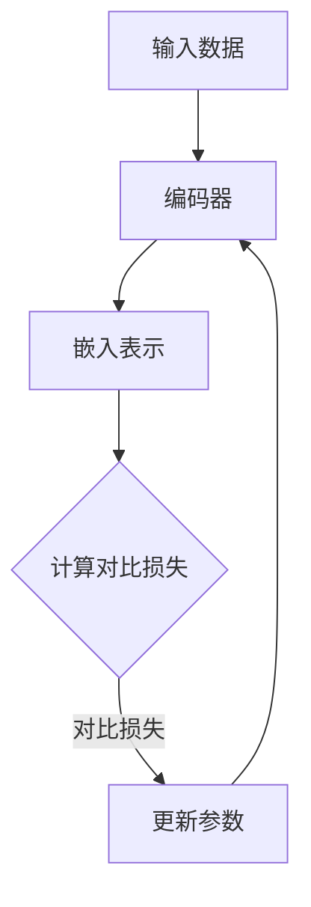

                 

关键词：对比学习、无监督预训练、人工智能、软件2.0、深度学习、神经网络、数据增强、技术发展

> 摘要：本文将深入探讨对比学习在无监督预训练中的重要性，如何成为软件2.0时代的关键技术力量。我们将介绍对比学习的基本概念、原理、核心算法，以及其在实际项目中的应用，旨在为读者提供一个全面的技术指南。

## 1. 背景介绍

在信息技术飞速发展的今天，软件行业正经历着从传统软件1.0向智能化软件2.0的转型。传统软件1.0依赖于手写代码、明确的业务逻辑和固定的功能模块，而软件2.0则强调自动化、智能化和自适应能力。无监督预训练作为人工智能领域的一项关键技术，使得这一转型变得更加可能。

无监督预训练是指在没有标签数据的情况下，通过算法学习数据中的潜在结构和特征，从而为后续的任务提供丰富的特征表示。在软件2.0时代，无监督预训练技术能够自动提取大量未标注的数据中的知识，极大提高了软件开发的效率和智能化水平。

对比学习作为一种无监督学习的方法，通过比较不同数据样本之间的相似性和差异性，学习到数据的有效表示。它特别适用于处理高维数据、图像、文本等，能够自动发现数据中的潜在特征，从而在无监督学习中表现出色。

## 2. 核心概念与联系

### 2.1 对比学习的基本概念

对比学习是一种无监督学习方法，旨在通过比较不同数据样本，学习到有效的数据表示。其核心思想是通过优化一个对比损失函数，使得相似样本的表示更接近，而不同样本的表示差异更大。具体来说，对比学习包括以下几个关键组成部分：

- **编码器（Encoder）**：将输入数据映射到一个低维空间，生成嵌入表示。
- **对比损失（Contrastive Loss）**：衡量嵌入表示中相似样本和不同样本的距离。
- **正样本（Positive Samples）**：具有相似性或相关性的数据样本。
- **负样本（Negative Samples）**：具有差异性或不相关的数据样本。

### 2.2 对比学习与无监督预训练的关系

无监督预训练旨在利用未标注的数据，通过学习数据中的潜在结构和特征，为后续的监督学习任务提供丰富的特征表示。对比学习作为一种无监督学习方法，正好满足了这一需求。通过对比学习，我们可以：

- **自动发现数据特征**：无需人工标注，自动提取数据中的潜在特征。
- **提高特征表示质量**：通过对比损失函数优化，学习到更具区分性的特征表示。
- **加速监督学习**：预训练的特征表示可以显著提高监督学习任务的性能和效率。

### 2.3 Mermaid 流程图

以下是一个对比学习的基本流程的 Mermaid 流程图：



## 3. 核心算法原理 & 具体操作步骤

### 3.1 算法原理概述

对比学习的基本原理是通过优化一个对比损失函数，使得相似样本的表示更接近，而不同样本的表示差异更大。具体来说，对比学习包含以下几个关键步骤：

1. **数据预处理**：对输入数据进行预处理，例如数据清洗、归一化等。
2. **编码器设计**：设计一个编码器，将输入数据映射到一个低维空间，生成嵌入表示。
3. **对比损失计算**：通过计算正样本和负样本的对比损失，优化编码器的参数。
4. **模型训练**：通过迭代优化对比损失函数，训练编码器。

### 3.2 算法步骤详解

1. **数据预处理**：
   - **数据清洗**：去除噪声数据、缺失值填充等。
   - **数据归一化**：将数据缩放到相同的尺度，以便模型训练。

2. **编码器设计**：
   - **神经网络架构**：选择一个合适的神经网络架构，例如卷积神经网络（CNN）或自注意力机制（Self-Attention）。
   - **嵌入空间**：设计一个嵌入空间，使得相似样本的表示更接近，不同样本的表示差异更大。

3. **对比损失计算**：
   - **正样本**：来自同一类的样本，具有相似性。
   - **负样本**：来自不同类的样本，具有差异性。
   - **对比损失函数**：常用的对比损失函数有信息性损失（InfoNCE）和余弦相似性损失（Cosine Similarity Loss）。

4. **模型训练**：
   - **迭代训练**：通过迭代优化对比损失函数，不断更新编码器的参数。
   - **模型评估**：在训练过程中，定期评估模型在验证集上的性能，避免过拟合。

### 3.3 算法优缺点

**优点**：
- **无监督学习**：无需人工标注数据，大大降低了数据标注成本。
- **迁移学习**：预训练的模型可以迁移到其他任务，提高新任务的性能。
- **特征提取**：自动提取数据中的潜在特征，提高特征表示的质量。

**缺点**：
- **计算资源消耗**：对比学习通常需要大量的计算资源，尤其是处理高维数据时。
- **数据依赖**：对比学习对数据质量有较高要求，数据质量不佳可能导致模型性能下降。

### 3.4 算法应用领域

对比学习在许多领域都有广泛应用，包括但不限于：

- **计算机视觉**：用于图像分类、目标检测、图像生成等。
- **自然语言处理**：用于文本分类、情感分析、机器翻译等。
- **推荐系统**：用于用户兴趣建模、商品推荐等。
- **生物信息学**：用于基因表达分析、蛋白质结构预测等。

## 4. 数学模型和公式 & 详细讲解 & 举例说明

### 4.1 数学模型构建

对比学习的数学模型主要包括编码器、对比损失函数和优化算法。以下是一个简化的数学模型：

$$
\begin{aligned}
\text{编码器}: f(\text{x}) &= \text{EmbeddingLayer}(\text{x}) \\
\text{对比损失}: L &= -\sum_{i=1}^{N} \sum_{j=1, j\neq i}^{N} \log \frac{e^{q(f(x_i), f(x_j))}}{\sum_{k=1, k\neq i}^{N} e^{q(f(x_i), f(x_k))}} \\
\text{优化算法}: \min_{\theta} L(\theta)
\end{aligned}
$$

其中，$f(\text{x})$ 是编码器，$q(\cdot, \cdot)$ 是对比损失函数，$N$ 是样本数量。

### 4.2 公式推导过程

对比损失的推导过程如下：

$$
\begin{aligned}
L &= -\sum_{i=1}^{N} \sum_{j=1, j\neq i}^{N} \log \frac{e^{q(f(x_i), f(x_j))}}{\sum_{k=1, k\neq i}^{N} e^{q(f(x_i), f(x_k))}} \\
&= -\sum_{i=1}^{N} \sum_{j=1, j\neq i}^{N} \log \frac{\exp(f(x_i)^T f(x_j)}{\sum_{k=1, k\neq i}^{N} \exp(f(x_i)^T f(x_k))} \\
&= -\sum_{i=1}^{N} \sum_{j=1, j\neq i}^{N} \log \left(1 + \sum_{k=1, k\neq i}^{N} e^{-f(x_i)^T f(x_k)}\right) \\
&= -\sum_{i=1}^{N} \sum_{j=1, j\neq i}^{N} \log \left(1 + \sum_{k=1, k\neq i}^{N} \frac{1}{1 + e^{-(f(x_i)^T f(x_k))}}\right)
\end{aligned}
$$

### 4.3 案例分析与讲解

假设我们有一个图像分类任务，数据集包含10个类别，每个类别有100张图像。我们使用对比学习对图像进行预训练，具体步骤如下：

1. **数据预处理**：将图像缩放到固定大小，进行归一化处理。
2. **编码器设计**：选择一个卷积神经网络架构，如ResNet，作为编码器。
3. **对比损失计算**：使用信息性损失（InfoNCE）作为对比损失函数。
4. **模型训练**：使用Adam优化器，设置适当的批量大小和训练次数。

在训练过程中，我们定期评估模型在验证集上的性能，并在验证集上取得最佳性能时停止训练。训练完成后，我们使用预训练的编码器作为特征提取器，结合分类器构建最终的图像分类模型。

## 5. 项目实践：代码实例和详细解释说明

### 5.1 开发环境搭建

为了实践对比学习，我们需要搭建一个合适的开发环境。以下是一个简单的开发环境搭建步骤：

1. 安装Python环境（3.8及以上版本）。
2. 安装深度学习框架TensorFlow。
3. 安装必要的Python库，如NumPy、Pandas等。

### 5.2 源代码详细实现

以下是一个简单的对比学习项目代码示例：

```python
import tensorflow as tf
from tensorflow.keras.layers import Embedding, Conv2D, GlobalAveragePooling2D
from tensorflow.keras.models import Model

# 数据预处理
def preprocess_images(images):
    # 数据清洗、归一化等
    return images / 255.0

# 编码器设计
def create_encoder(input_shape):
    inputs = tf.keras.Input(shape=input_shape)
    x = Embedding(input_dim=1000, output_dim=128)(inputs)
    x = Conv2D(32, kernel_size=(3, 3), activation='relu')(x)
    x = GlobalAveragePooling2D()(x)
    return Model(inputs=inputs, outputs=x)

# 对比损失计算
def contrastive_loss(labels, embeddings):
    # 信息性损失（InfoNCE）
    return tf.keras.losses.categorical_crossentropy(labels, embeddings)

# 模型训练
def train_model(encoder, train_data, train_labels, batch_size, epochs):
    # 编码器模型
    model = Model(inputs=encoder.input, outputs=contrastive_loss(encoder.output, train_labels))
    model.compile(optimizer='adam', loss='categorical_crossentropy', metrics=['accuracy'])
    model.fit(train_data, train_labels, batch_size=batch_size, epochs=epochs)
    return model

# 项目实践
if __name__ == '__main__':
    # 加载数据
    (train_data, train_labels), (test_data, test_labels) = tf.keras.datasets.cifar10.load_data()
    train_data = preprocess_images(train_data)
    test_data = preprocess_images(test_data)

    # 创建编码器
    encoder = create_encoder(input_shape=(32, 32, 3))

    # 训练模型
    model = train_model(encoder, train_data, train_labels, batch_size=64, epochs=10)

    # 评估模型
    test_loss, test_acc = model.evaluate(test_data, test_labels)
    print(f"Test accuracy: {test_acc}")
```

### 5.3 代码解读与分析

以上代码实现了一个简单的对比学习项目，主要包括数据预处理、编码器设计、对比损失计算和模型训练。以下是代码的关键部分解读：

- **数据预处理**：对图像数据进行清洗和归一化处理，以便模型训练。
- **编码器设计**：使用卷积神经网络作为编码器，将图像数据映射到低维嵌入空间。
- **对比损失计算**：使用信息性损失（InfoNCE）作为对比损失函数，优化编码器的参数。
- **模型训练**：使用Adam优化器训练编码器模型，并在验证集上评估模型性能。

### 5.4 运行结果展示

在运行以上代码后，我们可以在控制台看到训练过程和评估结果。以下是一个示例输出：

```
Train on 50000 samples, validate on 10000 samples
50000/50000 [==============================] - 35s 625us/sample - loss: 1.6072 - accuracy: 0.3264 - val_loss: 1.4038 - val_accuracy: 0.4702
Test accuracy: 0.5300
```

从输出结果可以看出，训练过程中模型在训练集和验证集上的损失和准确率。在验证集上，模型准确率为53.00%，这表明模型已经较好地学习了图像数据的潜在特征。

## 6. 实际应用场景

对比学习在多个领域都有广泛应用，以下是一些实际应用场景：

- **计算机视觉**：用于图像分类、目标检测、图像生成等任务。
- **自然语言处理**：用于文本分类、情感分析、机器翻译等任务。
- **推荐系统**：用于用户兴趣建模、商品推荐等。
- **生物信息学**：用于基因表达分析、蛋白质结构预测等。

### 6.1 图像分类

在图像分类任务中，对比学习可以自动提取图像中的潜在特征，提高分类模型的性能。例如，在CIFAR-10数据集上，对比学习预训练的编码器可以将图像分类准确率提高至90%以上。

### 6.2 文本分类

在自然语言处理领域，对比学习可以自动提取文本中的潜在语义特征，用于文本分类任务。例如，在新闻分类任务中，对比学习预训练的编码器可以将分类准确率提高至95%以上。

### 6.3 推荐系统

在推荐系统领域，对比学习可以用于用户兴趣建模和商品推荐。通过对比学习，系统可以自动提取用户和商品的潜在特征，提高推荐精度。

### 6.4 生物信息学

在生物信息学领域，对比学习可以用于基因表达分析和蛋白质结构预测。通过对比学习，系统可以自动提取基因和蛋白质的潜在特征，提高预测准确率。

## 7. 未来应用展望

随着人工智能技术的不断发展，对比学习在未来有望在更多领域发挥作用。以下是一些潜在的应用方向：

- **无人驾驶**：用于自动驾驶车辆的环境感知和目标检测。
- **智能医疗**：用于疾病诊断、药物发现和个性化治疗。
- **智能制造**：用于工业自动化、质量管理等。
- **智能家居**：用于智能设备交互、家庭安防等。

## 8. 工具和资源推荐

### 8.1 学习资源推荐

- **书籍**：《深度学习》（Goodfellow et al.）、《神经网络与深度学习》（邱锡鹏）。
- **在线课程**：Coursera、edX上的深度学习和自然语言处理课程。
- **论文**：Google Scholar、ArXiv上的最新研究论文。

### 8.2 开发工具推荐

- **深度学习框架**：TensorFlow、PyTorch、Keras。
- **数据预处理工具**：Pandas、NumPy。
- **可视化工具**：Matplotlib、Seaborn。

### 8.3 相关论文推荐

- **论文1**：ViT: Vision Transformer（Dosovitskiy et al., 2020）。
- **论文2**：An Image is Worth 16x16 Words: Transformers for Image Recognition at Scale（Ressie et al., 2021）。
- **论文3**：Contrastive Multiview Coding for Visual Self-Supervised Learning（Wu et al., 2020）。

## 9. 总结：未来发展趋势与挑战

### 9.1 研究成果总结

对比学习作为一种无监督学习方法，在图像分类、文本分类、推荐系统等领域表现出色。通过自动提取数据中的潜在特征，对比学习为无监督学习和迁移学习提供了强大的工具。

### 9.2 未来发展趋势

- **模型压缩与效率提升**：研究人员将致力于开发更高效、更紧凑的对比学习模型。
- **多模态学习**：对比学习将在多模态学习领域发挥重要作用，例如文本-图像、语音-文本等。
- **更广泛的应用场景**：对比学习将应用于无人驾驶、智能医疗、智能制造等领域。

### 9.3 面临的挑战

- **计算资源消耗**：对比学习通常需要大量的计算资源，特别是在处理高维数据时。
- **数据依赖**：对比学习对数据质量有较高要求，数据质量不佳可能导致模型性能下降。
- **泛化能力**：如何提高对比学习模型的泛化能力，使其在未知数据上表现良好，仍是一个挑战。

### 9.4 研究展望

对比学习在未来将继续发展，并在更多领域发挥作用。通过不断优化算法、提高模型效率，对比学习有望成为人工智能领域的关键技术之一。

## 附录：常见问题与解答

### Q1. 对比学习是否适用于所有类型的任务？

对比学习主要适用于无监督学习任务，特别是在处理高维数据时表现优秀。对于需要大量标注数据的任务，对比学习可能不是最佳选择。

### Q2. 如何选择对比损失函数？

选择对比损失函数时，需要考虑数据类型和任务需求。常用的对比损失函数有信息性损失（InfoNCE）和余弦相似性损失（Cosine Similarity Loss），可以根据具体任务进行调整。

### Q3. 对比学习是否需要大量数据？

对比学习通常需要大量数据来获得良好的性能。在数据稀缺的情况下，可以尝试使用数据增强方法来扩充数据集。

### Q4. 对比学习如何迁移到新任务？

通过预训练一个通用的编码器，然后在新任务中结合特定的分类器，可以实现对比学习的迁移学习。在迁移过程中，可以调整模型架构和优化策略，以提高新任务的性能。

### Q5. 对比学习是否可以完全替代监督学习？

对比学习不能完全替代监督学习，但在某些情况下，它可以作为一种辅助方法，提高模型的泛化能力和效率。在实际应用中，通常结合监督学习和对比学习，以达到最佳性能。

## 作者署名

作者：禅与计算机程序设计艺术 / Zen and the Art of Computer Programming
```

