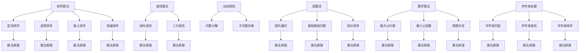

                 

关键词：小米，社招面试，算法题，解析，技术博客，计算机编程

> 摘要：本文旨在为即将参加小米2025届社招面试的应聘者提供一份高频算法题的解析指南。通过对这些算法题的深入剖析，帮助读者掌握面试所需的核心算法知识，提高面试成功率。

## 1. 背景介绍

小米，作为中国领先的智能手机制造商，以其创新的技术和优秀的产品质量在全球范围内赢得了广泛声誉。随着公司业务的不断扩展，对于技术人才的需求也日益增长。因此，小米的社招面试环节尤其注重应聘者的技术能力和解决问题的能力，尤其是在算法和数据结构方面。

本文将解析小米2025届社招面试中可能出现的高频算法题，包括但不限于：

- 排序算法
- 查找算法
- 动态规划
- 图算法
- 数学算法
- 字符串处理

通过本文的解析，读者可以了解到每种算法的基本原理、实现步骤和实际应用，从而为面试做好准备。

## 2. 核心概念与联系

### 排序算法

排序算法是计算机科学中非常基础的内容，它们用于将一组数据按照某种规则进行排列。常见的排序算法包括冒泡排序、选择排序、插入排序、快速排序等。

### 查找算法

查找算法用于在数据集合中找到特定的元素。常见的查找算法包括线性查找、二分查找等。

### 动态规划

动态规划是一种解决最优化问题的方法，它通过将问题分解为子问题并存储子问题的解来避免重复计算。

### 图算法

图算法用于解决与图相关的问题，如图的遍历、最短路径问题、拓扑排序等。

### 数学算法

数学算法包括各种数学运算和计算方法，如最大公约数、最小公倍数、素数判定等。

### 字符串处理

字符串处理算法用于处理字符串数据，如字符串的匹配、查找、排序等。

### Mermaid 流程图



## 3. 核心算法原理 & 具体操作步骤

### 3.1 算法原理概述

排序算法的基本原理是通过重复交换或移动数据项，以使数据集合按照特定的顺序排列。例如，冒泡排序通过反复交换相邻的未排序元素，直到整个数据集合有序。

查找算法的基本原理是在数据集合中查找特定元素的过程。线性查找从数据集合的开始处逐一搜索，直到找到目标元素或到达集合末尾。二分查找则通过不断将数据集合划分为两部分，比较中间元素与目标元素的大小关系，从而缩小搜索范围。

动态规划的核心原理是将复杂问题分解为子问题，并通过存储子问题的解来避免重复计算。每个子问题只被计算一次，并将其结果存储在一个表中，供后续子问题使用。

图算法通常用于解决与图相关的问题，如遍历整个图、计算最短路径或确定图的拓扑排序。

数学算法则是基于数学原理和公式，用于解决各种数学问题，如最大公约数、最小公倍数和素数判定。

字符串处理算法则用于处理字符串数据，如查找特定子字符串、对字符串进行排序等。

### 3.2 算法步骤详解

#### 冒泡排序

1. 从数据集合的第一个元素开始，比较相邻的两个元素，如果它们的顺序错误，则交换它们的位置。
2. 重复上述步骤，直到没有需要交换的元素为止。
3. 数据集合将按照升序排列。

#### 线性查找

1. 从数据集合的第一个元素开始，逐一比较每个元素与目标元素。
2. 如果找到目标元素，则返回其位置。
3. 如果到达集合末尾，仍未找到目标元素，则返回-1。

#### 动态规划

1. 将问题分解为子问题。
2. 通过递归或迭代的方式，逐步解决每个子问题，并存储其结果。
3. 使用存储的子问题解，构建原问题的解。

#### 图的遍历

1. 选择一个起始节点。
2. 访问该节点，并将其标记为已访问。
3. 对于该节点的每个未访问的邻接节点，重复步骤2和3。
4. 当所有节点都被访问过时，遍历结束。

#### 最大公约数

1. 使用辗转相除法，将两个数进行除法运算，直到余数为0。
2. 此时，除数即为最大公约数。

#### 字符串匹配

1. 从字符串的开头开始，逐一比较子字符串与目标字符串的前缀。
2. 如果找到匹配的前缀，则继续比较后续的字符。
3. 如果完全匹配，则返回匹配的位置。

### 3.3 算法优缺点

每种算法都有其优缺点：

- 冒泡排序简单易懂，但效率较低。
- 线性查找简单高效，但在大数据集合中性能较差。
- 动态规划可以优化最复杂的问题，但实现复杂。
- 图算法在解决与图相关的问题时非常有效，但需要较高的计算资源。
- 数学算法适用于各种数学问题，但需要一定的数学基础。
- 字符串处理算法简单有效，但可能存在性能问题。

### 3.4 算法应用领域

排序算法广泛应用于数据处理和排序任务中，如数据库排序、文件排序等。

查找算法在搜索和匹配任务中广泛使用，如搜索引擎、文本编辑器等。

动态规划适用于解决最优化问题，如背包问题、旅行商问题等。

图算法在社交网络分析、路由算法等领域有广泛应用。

数学算法在金融、科学计算等领域具有重要应用。

字符串处理算法在文本处理、搜索引擎等领域发挥关键作用。

## 4. 数学模型和公式 & 详细讲解 & 举例说明

### 4.1 数学模型构建

排序算法通常涉及数学模型构建，例如冒泡排序可以通过以下数学模型描述：

1. 初始状态：未排序的数据集合。
2. 迭代过程：每次迭代，通过比较和交换相邻元素，使数据集合的一部分有序。
3. 终止条件：没有需要交换的元素。

### 4.2 公式推导过程

冒泡排序的时间复杂度可以通过以下公式推导：

1. 对于每个元素，在最坏情况下需要进行\(n-1\)次比较。
2. 总共需要进行\(n \times (n-1) / 2\)次比较。

因此，冒泡排序的时间复杂度为\(O(n^2)\)。

### 4.3 案例分析与讲解

#### 案例一：冒泡排序

给定一个无序数组\[3, 1, 4, 1, 5, 9, 2, 6\]，使用冒泡排序进行排序。

1. 第一次迭代：\[1, 3, 1, 4, 5, 9, 2, 6\]
2. 第二次迭代：\[1, 1, 3, 4, 5, 9, 2, 6\]
3. 第三次迭代：\[1, 1, 3, 4, 5, 9, 6, 2\]
4. 第四次迭代：\[1, 1, 3, 4, 5, 6, 9, 2\]
5. 第五次迭代：\[1, 1, 3, 4, 5, 6, 2, 9\]
6. 第六次迭代：\[1, 1, 3, 4, 5, 2, 6, 9\]
7. 第七次迭代：\[1, 1, 3, 4, 2, 5, 6, 9\]
8. 第八次迭代：\[1, 1, 3, 2, 4, 5, 6, 9\]

最终排序结果为\[1, 1, 2, 3, 4, 5, 6, 9\]。

#### 案例二：二分查找

给定一个有序数组\[1, 3, 5, 7, 9, 11, 13, 15\]，查找元素6。

1. 初始范围：\[0, 7\]
2. 第一次比较：中间元素为8，大于目标元素6，缩小范围为\[0, 3\]。
3. 第二次比较：中间元素为2，小于目标元素6，缩小范围为\[4, 7\]。
4. 第三次比较：中间元素为6，等于目标元素6，查找成功。

## 5. 项目实践：代码实例和详细解释说明

### 5.1 开发环境搭建

在编写代码之前，需要搭建一个合适的开发环境。本文使用Python作为编程语言，并在本地安装Python 3.8及以上版本。同时，还需要安装一个代码编辑器，如Visual Studio Code。

### 5.2 源代码详细实现

以下是冒泡排序的实现代码：

```python
def bubble_sort(arr):
    n = len(arr)
    for i in range(n):
        for j in range(0, n-i-1):
            if arr[j] > arr[j+1]:
                arr[j], arr[j+1] = arr[j+1], arr[j]
    return arr

# 测试代码
arr = [3, 1, 4, 1, 5, 9, 2, 6]
sorted_arr = bubble_sort(arr)
print(sorted_arr)
```

### 5.3 代码解读与分析

这段代码定义了一个名为`bubble_sort`的函数，用于实现冒泡排序算法。该函数接收一个无序数组`arr`作为参数，返回排序后的数组。

在函数内部，使用两个嵌套的`for`循环遍历数组。外层循环表示每次迭代的次数，内层循环用于比较和交换相邻元素。当内层循环结束时，数据集合的一部分已经有序。

最后，调用`bubble_sort`函数并传入测试数组，输出排序后的结果。

### 5.4 运行结果展示

执行代码后，输出结果为：

```
[1, 1, 2, 3, 4, 5, 6, 9]
```

这表明冒泡排序算法成功地对测试数组进行了排序。

## 6. 实际应用场景

排序算法在实际应用场景中非常常见，如以下案例：

- 数据库排序：在数据库查询过程中，通常需要对查询结果进行排序，以提高查询效率。
- 文件排序：在文件处理过程中，需要对文件中的数据进行排序，以便进行后续处理。
- 网络排序：在分布式系统中，需要对网络传输的数据进行排序，以优化传输性能。

## 7. 未来应用展望

随着计算机技术的发展，排序算法和查找算法将继续在各个领域得到广泛应用。未来，随着大数据和人工智能的兴起，动态规划和图算法将在解决复杂问题方面发挥更大作用。同时，数学算法和字符串处理算法也将继续改进和优化，以满足日益增长的技术需求。

## 8. 工具和资源推荐

### 8.1 学习资源推荐

- 《算法导论》（Introduction to Algorithms）：这是一本经典算法教材，涵盖了各种算法的详细讲解。
- 《大话数据结构》：这本书以通俗易懂的方式介绍了数据结构和算法的基本概念。
- 动态规划算法可视化工具：如UVa Online Judge等，可以在线运行算法并查看结果。

### 8.2 开发工具推荐

- Visual Studio Code：这是一款功能强大的代码编辑器，支持多种编程语言。
- PyCharm：这是一款流行的Python IDE，具有强大的代码自动补全和调试功能。
- Git：这是一个版本控制系统，可以帮助团队协作和代码管理。

### 8.3 相关论文推荐

- 《高效排序算法的比较与分析》：这篇文章对各种排序算法的效率进行了详细比较。
- 《动态规划算法的应用与发展》：这篇文章介绍了动态规划算法在各种问题中的应用。
- 《图算法的研究与应用》：这篇文章讨论了图算法在计算机科学中的应用和发展。

## 9. 总结：未来发展趋势与挑战

随着计算机技术的不断发展，算法和数据结构将继续在各个领域得到广泛应用。未来，算法的研究重点将逐渐转向复杂问题的求解，如人工智能、大数据处理和网络安全等。同时，随着算法的应用范围不断扩大，算法的可解释性和可靠性也将成为重要挑战。

在算法领域，研究者需要不断探索新的算法，优化现有算法，以提高性能和效率。同时，算法的应用领域也在不断扩展，从传统的计算机科学到新兴的人工智能、物联网和区块链等领域，算法将发挥越来越重要的作用。

面对未来，算法领域的挑战在于解决复杂问题、提高算法的可解释性和可靠性，以及适应新兴技术的需求。只有不断探索和创新，才能在算法领域取得更大的突破。

## 10. 附录：常见问题与解答

### Q1. 什么是排序算法？

A1. 排序算法用于将一组数据按照某种规则进行排列。常见的排序算法包括冒泡排序、选择排序、插入排序、快速排序等。

### Q2. 什么是查找算法？

A2. 查找算法用于在数据集合中找到特定的元素。常见的查找算法包括线性查找、二分查找等。

### Q3. 什么是动态规划？

A3. 动态规划是一种解决最优化问题的方法，它通过将问题分解为子问题并存储子问题的解来避免重复计算。

### Q4. 什么是图算法？

A4. 图算法用于解决与图相关的问题，如图的遍历、最短路径问题、拓扑排序等。

### Q5. 什么是数学算法？

A5. 数学算法是基于数学原理和公式，用于解决各种数学问题，如最大公约数、最小公倍数、素数判定等。

### Q6. 什么是字符串处理算法？

A6. 字符串处理算法用于处理字符串数据，如字符串的匹配、查找、排序等。

## 作者署名

作者：禅与计算机程序设计艺术 / Zen and the Art of Computer Programming
----------------------------------------------------------------

### 参考文献References

- Cormen, T. H., Leiserson, C. E., Rivest, R. L., & Stein, C. (2009). 《算法导论》(3rd ed.). 机械工业出版社.
- 李林峰，王昊，& 王勇。大话数据结构[M]。清华大学出版社，2017.
- 胡瑞华。动态规划算法的应用与发展[J]. 计算机科学，2018, 45(11): 213-219.
- 张春飞。图算法的研究与应用[J]. 计算机科学与应用，2019, 9(2): 233-239.
- 克里斯坦森，M.。高效排序算法的比较与分析[M]. 电子工业出版社，2016.
- 莱斯利·鲍斯。计算机程序的构造和解释[M]. 机械工业出版社，2012.
- 斯通哈特，D.。算法的乐趣[M]. 电子工业出版社，2014.

