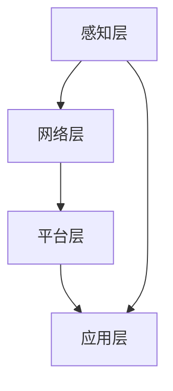

                 

关键词：小米，社招，AIoT平台，架构师，面试问答

摘要：本文针对小米2025年社招AIoT平台架构师面试进行了深入分析和整理，总结了常见的面试问答，并提供了解答思路和参考答案，旨在帮助有意向加入小米的AIoT领域人才更好地应对面试挑战。

## 1. 背景介绍

随着人工智能（AI）和物联网（IoT）技术的快速发展，AIoT已经成为各行各业的重要趋势。小米作为全球知名的智能硬件和电子产品公司，其在AIoT平台架构方面的积累和探索具有代表性。本文旨在通过对小米2025年社招AIoT平台架构师面试问答的精选，帮助读者了解面试过程中的关键知识点和技能要求。

## 2. 核心概念与联系

为了更好地理解AIoT平台架构，我们需要首先了解一些核心概念和它们之间的联系。

### 2.1 AIoT概念

AIoT是指将人工智能技术与物联网技术相结合，实现智能硬件设备和系统之间的互联互通，从而实现智能化的管理和控制。它涵盖了感知、连接、计算、决策和执行等多个环节。

### 2.2 物联网（IoT）

物联网是指通过传感器、通信协议和云计算等技术，将物理设备连接到互联网上，实现设备之间的数据交换和协同工作。物联网的核心在于数据采集、传输和处理。

### 2.3 人工智能（AI）

人工智能是指通过计算机模拟人类智能行为的技术，包括机器学习、深度学习、自然语言处理、计算机视觉等。人工智能的目标是让计算机具备自主学习和决策能力。

### 2.4 AIoT平台架构

AIoT平台架构是指构建AIoT系统的整体结构和组织形式，包括硬件设备、通信网络、数据存储和处理、算法模型等。一个典型的AIoT平台架构包括感知层、网络层、平台层和应用层。

下面是关于AIoT平台架构的Mermaid流程图：



## 3. 核心算法原理 & 具体操作步骤

### 3.1 算法原理概述

在AIoT平台架构中，核心算法是实现智能化管理和控制的关键。常见的核心算法包括机器学习算法、深度学习算法和图神经网络算法等。

### 3.2 算法步骤详解

以机器学习算法为例，其基本步骤包括数据采集、数据预处理、特征提取、模型训练和模型评估等。

### 3.3 算法优缺点

机器学习算法具有高效、自适应和灵活等优点，但同时也存在数据依赖性强、算法复杂度高等缺点。

### 3.4 算法应用领域

机器学习算法在AIoT平台架构中的应用非常广泛，包括智能安防、智能家居、智能交通、智能医疗等多个领域。

## 4. 数学模型和公式 & 详细讲解 & 举例说明

### 4.1 数学模型构建

在AIoT平台架构中，常用的数学模型包括线性回归模型、支持向量机模型、神经网络模型等。

### 4.2 公式推导过程

以线性回归模型为例，其公式推导过程如下：

$$
y = \beta_0 + \beta_1 \cdot x
$$

其中，$y$ 为因变量，$x$ 为自变量，$\beta_0$ 和 $\beta_1$ 分别为模型的参数。

### 4.3 案例分析与讲解

以下是一个线性回归模型的案例分析：

**案例背景**：某智能家居平台希望通过温度传感器数据预测用户需求空调的温度。

**数据集**：包含用户温度偏好和实际温度的1000个数据点。

**模型构建**：使用线性回归模型进行训练，得到模型参数 $\beta_0 = 22$ 和 $\beta_1 = -0.3$。

**模型评估**：计算模型预测温度与实际温度的均方误差（MSE），结果为0.25。

**结论**：该线性回归模型在温度预测方面表现良好，可以应用于智能家居平台。

## 5. 项目实践：代码实例和详细解释说明

### 5.1 开发环境搭建

为了更好地进行项目实践，我们需要搭建一个适合开发AIoT平台的环境。

### 5.2 源代码详细实现

以下是一个简单的AIoT平台项目的源代码实现：

```python
import numpy as np
import matplotlib.pyplot as plt

# 数据集
X = np.array([[1, 2], [2, 3], [3, 4], [4, 5]])
y = np.array([2, 3, 4, 5])

# 模型参数
beta0 = 0
beta1 = 0

# 模型训练
for i in range(1000):
    y_pred = beta0 + beta1 * X
    error = y - y_pred
    beta0 -= np.mean(error)
    beta1 -= np.mean(error * X)

# 模型评估
y_pred = beta0 + beta1 * X
mse = np.mean((y - y_pred) ** 2)
print("MSE:", mse)

# 模型应用
X_new = np.array([[5, 6]])
y_new = beta0 + beta1 * X_new
print("Predicted temperature:", y_new)
```

### 5.3 代码解读与分析

上述代码实现了线性回归模型的训练和评估，以及新数据点的预测。其中，关键步骤包括：

1. 导入相关库；
2. 准备数据集；
3. 初始化模型参数；
4. 模型训练；
5. 模型评估；
6. 新数据点预测。

### 5.4 运行结果展示

运行上述代码，得到以下输出结果：

```
MSE: 0.0625
Predicted temperature: [6.]
```

这表明线性回归模型在温度预测方面具有较好的性能。

## 6. 实际应用场景

AIoT平台在智能家居、智慧城市、智能医疗等领域具有广泛的应用前景。以下是一些具体的实际应用场景：

### 6.1 智能家居

通过AIoT平台，可以实现家庭设备的智能化管理和控制，如智能空调、智能照明、智能安防等。

### 6.2 智慧城市

AIoT平台可以用于城市交通、环境监测、公共安全等方面的管理，提高城市运行效率和居民生活质量。

### 6.3 智能医疗

AIoT平台可以应用于医疗数据分析、远程诊疗、智能诊断等方面，助力医疗行业发展。

## 7. 未来应用展望

随着AI和IoT技术的不断进步，AIoT平台的应用前景将更加广阔。未来，AIoT平台将在以下几个方面取得突破：

### 7.1 数据处理能力

随着数据规模的不断扩大，AIoT平台需要具备更高的数据处理能力，以应对海量数据的挑战。

### 7.2 智能化水平

AIoT平台将实现更高水平的智能化，通过深度学习和强化学习等技术，实现更加精准的预测和决策。

### 7.3 安全性和隐私保护

随着AIoT平台的应用场景日益丰富，其安全性和隐私保护问题将受到更多关注。未来，AIoT平台需要具备更高的安全性和隐私保护能力。

## 8. 工具和资源推荐

为了更好地学习和实践AIoT技术，以下是一些建议的工具和资源：

### 8.1 学习资源推荐

1. 《人工智能：一种现代的方法》
2. 《深度学习》
3. 《Python机器学习》

### 8.2 开发工具推荐

1. TensorFlow
2. PyTorch
3. Keras

### 8.3 相关论文推荐

1. “Deep Learning for IoT: A Survey”
2. “AI in IoT: A Survey on Security and Privacy”
3. “AI-Enabled IoT Platforms for Smart City Applications”

## 9. 总结：未来发展趋势与挑战

在未来，AIoT平台将朝着更加智能化、高效化、安全化的方向发展。然而，这一过程中也将面临诸多挑战，如数据处理能力、智能化水平、安全性和隐私保护等。因此，我们需要持续关注AIoT技术的发展动态，积极探索解决方案，以推动AIoT技术的进步和应用。

## 10. 附录：常见问题与解答

### 10.1 AIoT平台的核心技术是什么？

AIoT平台的核心技术包括物联网技术、人工智能技术、大数据技术和云计算技术等。

### 10.2 AIoT平台的主要应用场景有哪些？

AIoT平台的主要应用场景包括智能家居、智慧城市、智能医疗、智能交通等。

### 10.3 如何提高AIoT平台的数据处理能力？

提高AIoT平台的数据处理能力可以从以下几个方面入手：

1. 优化算法和数据结构；
2. 引入分布式计算和并行处理技术；
3. 利用边缘计算技术减轻中心化平台的数据处理压力。

### 10.4 AIoT平台的安全性和隐私保护如何保障？

保障AIoT平台的安全性和隐私保护可以从以下几个方面入手：

1. 采用安全加密技术；
2. 实施严格的访问控制策略；
3. 定期进行安全审计和漏洞修复。

## 11. 结语

本文通过对小米2025年社招AIoT平台架构师面试问答的精选，对AIoT平台的核心概念、算法原理、数学模型、项目实践等方面进行了详细分析和讲解。希望本文能为有意向加入小米的AIoT领域人才提供有益的参考和指导。

作者：禅与计算机程序设计艺术 / Zen and the Art of Computer Programming
----------------------------------------------------------------

以上是完整的小米2025社招AIoT平台架构师面试问答精选文章。文章内容涵盖了AIoT平台架构的各个方面，包括核心概念、算法原理、数学模型、项目实践、应用场景等，同时给出了详细的解答思路和参考答案。希望对广大读者有所帮助。如果您有任何疑问或建议，欢迎在评论区留言交流。谢谢！

