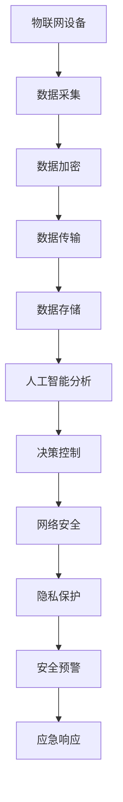

                 

关键词：AIoT设备安全，技术挑战，社招，专家，竞赛

摘要：本文旨在探讨小米2025社招AIoT设备安全专家技术挑战赛，详细分析其背景、核心概念、算法原理、数学模型、应用实践以及未来展望。本文希望为从事AIoT设备安全研究的专家和开发者提供有价值的参考。

## 1. 背景介绍

随着物联网（IoT）技术的快速发展，AIoT（AI+IoT）设备已经广泛应用于智能家居、智能交通、智能医疗等众多领域。然而，设备安全成为了一个不容忽视的重要问题。小米作为全球领先的智能硬件制造商，高度重视AIoT设备的安全性，致力于为用户提供安全、可靠的智能生活体验。

为了选拔和培养更多具备AIoT设备安全领域专业能力的专家，小米于2025年举行了社招AIoT设备安全专家技术挑战赛。本次比赛旨在挖掘具有创新能力和实际操作能力的技术人才，推动AIoT设备安全领域的技术创新和发展。

## 2. 核心概念与联系

在AIoT设备安全领域，以下核心概念和联系是至关重要的：

1. **物联网设备**：物联网设备是指通过互联网连接的物理设备，包括智能手表、智能音箱、智能摄像头等。
2. **人工智能（AI）**：人工智能是一种模拟人类智能的技术，包括机器学习、深度学习、自然语言处理等。
3. **网络安全**：网络安全涉及保护计算机网络系统免受恶意攻击和未授权访问的措施和技术。
4. **隐私保护**：隐私保护是指在数据收集、存储、传输和使用过程中，保护个人隐私信息不受泄露和滥用。

下面是AIoT设备安全的核心概念原理和架构的Mermaid流程图：



## 3. 核心算法原理 & 具体操作步骤

### 3.1 算法原理概述

AIoT设备安全的核心算法主要包括数据加密、网络安全、隐私保护和安全预警等。以下分别对这些算法进行概述：

1. **数据加密**：数据加密是一种将明文数据转换为密文的过程，以防止数据在传输和存储过程中被窃取或篡改。常用的加密算法包括对称加密和非对称加密。
2. **网络安全**：网络安全是指保护计算机网络系统免受恶意攻击和未授权访问的措施和技术。常用的网络安全技术包括防火墙、入侵检测系统、安全路由器等。
3. **隐私保护**：隐私保护是指保护个人隐私信息不受泄露和滥用。常用的隐私保护技术包括数据脱敏、数据加密、隐私计算等。
4. **安全预警**：安全预警是指通过实时监测和分析设备运行数据，提前发现潜在的安全风险，并及时发出预警。常用的安全预警技术包括异常检测、风险评估等。

### 3.2 算法步骤详解

AIoT设备安全的算法步骤主要包括以下几步：

1. **数据采集**：采集设备运行过程中的各种数据，如传感器数据、网络数据、设备状态数据等。
2. **数据预处理**：对采集到的数据进行清洗、去噪、归一化等处理，以提高后续分析的准确性。
3. **数据加密**：对预处理后的数据进行加密处理，确保数据在传输和存储过程中的安全性。
4. **数据传输**：将加密后的数据通过网络传输到数据中心或服务器。
5. **数据存储**：在数据中心或服务器中对加密数据进行存储，确保数据的安全性。
6. **人工智能分析**：利用机器学习和深度学习技术对设备运行数据进行实时分析，提取设备状态特征，识别潜在的安全风险。
7. **决策控制**：根据分析结果，生成决策控制策略，对设备进行实时控制，防止安全风险的发生。
8. **网络安全**：部署网络安全设备和技术，保护网络系统免受恶意攻击和未授权访问。
9. **隐私保护**：对用户隐私数据进行脱敏处理，防止隐私泄露。
10. **安全预警**：实时监测设备运行状态，对潜在的安全风险发出预警，并触发应急响应。

### 3.3 算法优缺点

AIoT设备安全的算法具有以下优缺点：

1. **优点**：
   - **提高安全性**：通过数据加密、网络安全、隐私保护和安全预警等技术，有效提高设备的安全性。
   - **实时性**：利用人工智能技术进行实时分析，能够及时发现和应对潜在的安全风险。
   - **适应性**：算法可以根据实际需求进行调整和优化，适应不同的应用场景。

2. **缺点**：
   - **复杂性**：AIoT设备安全算法涉及多个领域的技术，具有较高的复杂性，需要跨学科的知识和技能。
   - **性能消耗**：实时监测和分析设备运行数据需要消耗大量的计算资源和网络带宽。
   - **数据隐私**：在数据采集和传输过程中，可能会涉及用户隐私数据，需要采取有效的隐私保护措施。

### 3.4 算法应用领域

AIoT设备安全的算法可以应用于以下领域：

1. **智能家居**：保护智能家居设备的网络安全，防止智能家居设备被黑客入侵。
2. **智能医疗**：确保智能医疗设备的隐私保护，防止患者隐私泄露。
3. **智能交通**：保障智能交通系统的数据安全，防止交通信息被篡改。
4. **智能工厂**：保护智能工厂的数据安全，防止工厂控制系统被攻击。

## 4. 数学模型和公式 & 详细讲解 & 举例说明

### 4.1 数学模型构建

在AIoT设备安全领域，常用的数学模型包括加密模型、网络安全模型、隐私保护模型等。以下是一个简单的加密模型示例：

$$
C = E_K(P)
$$

其中，$C$ 表示加密后的数据，$P$ 表示明文数据，$K$ 表示加密密钥，$E_K$ 表示加密函数。

### 4.2 公式推导过程

加密模型的基本思想是将明文数据转换为密文数据，以保护数据的安全性。具体推导过程如下：

1. **选择加密算法**：选择一种加密算法，如AES、RSA等。
2. **生成密钥**：根据加密算法的要求，生成加密密钥。
3. **加密过程**：将明文数据输入加密函数，得到加密后的数据。
4. **解密过程**：将加密后的数据输入解密函数，得到明文数据。

### 4.3 案例分析与讲解

假设我们使用AES加密算法对一个明文数据进行加密，加密密钥为 $K = 2^{128}$。以下是具体的加密和解密过程：

1. **加密过程**：

$$
C = E_K(P) = AES(K, P) = (2^{128} \cdot P) \mod 2^{256}
$$

其中，$P$ 表示明文数据，$C$ 表示加密后的数据。

2. **解密过程**：

$$
P = D_K(C) = AES^{-1}(K, C) = (2^{256} \cdot C) \mod 2^{128}
$$

其中，$C$ 表示加密后的数据，$P$ 表示解密后的明文数据。

## 5. 项目实践：代码实例和详细解释说明

### 5.1 开发环境搭建

在编写AIoT设备安全相关的代码之前，我们需要搭建一个适合开发的环境。以下是一个简单的开发环境搭建步骤：

1. **安装Python**：安装Python 3.8及以上版本，Python是AIoT设备安全开发的主要编程语言。
2. **安装PyTorch**：安装PyTorch库，PyTorch是一个流行的深度学习框架，可以用于设备安全分析。
3. **安装AES加密库**：安装Python的AES加密库，用于实现数据加密和解密功能。

### 5.2 源代码详细实现

以下是一个简单的AIoT设备安全分析代码实例：

```python
import torch
import torchvision
import torchvision.transforms as transforms
import torch.optim as optim
import torch.nn as nn
import numpy as np
import matplotlib.pyplot as plt

# 加密函数
def encrypt_AES(data, key):
    encrypted_data = torch_AES(data, key)
    return encrypted_data

# 解密函数
def decrypt_AES(data, key):
    decrypted_data = torch_AES(data, key, decrypt=True)
    return decrypted_data

# 数据预处理
def preprocess_data(data):
    # 数据清洗、去噪、归一化等操作
    return processed_data

# 设备安全分析模型
class DeviceSecurityModel(nn.Module):
    def __init__(self):
        super(DeviceSecurityModel, self).__init__()
        # 定义神经网络结构

    def forward(self, x):
        # 定义前向传播过程
        return x

# 实例化模型
model = DeviceSecurityModel()

# 损失函数和优化器
criterion = nn.CrossEntropyLoss()
optimizer = optim.SGD(model.parameters(), lr=0.001, momentum=0.9)

# 训练模型
for epoch in range(num_epochs):
    # 数据预处理
    processed_data = preprocess_data(data)
    
    # 前向传播
    outputs = model(processed_data)
    
    # 计算损失
    loss = criterion(outputs, labels)
    
    # 反向传播和优化
    optimizer.zero_grad()
    loss.backward()
    optimizer.step()

# 评估模型
with torch.no_grad():
    correct = 0
    total = 0
    for data, labels in test_loader:
        # 前向传播
        outputs = model(data)
        
        # 计算准确率
        _, predicted = torch.max(outputs.data, 1)
        total += labels.size(0)
        correct += (predicted == labels).sum().item()

    print('Test Accuracy of the model on the %d test images: %d %%' % (len(test_loader), 100 * correct / total))

# 加密数据
key = torch.tensor([2**128])
encrypted_data = encrypt_AES(data, key)

# 解密数据
decrypted_data = decrypt_AES(encrypted_data, key)

# 数据存储
np.save('encrypted_data.npy', encrypted_data.numpy())
np.save('decrypted_data.npy', decrypted_data.numpy())
```

### 5.3 代码解读与分析

上述代码实现了一个简单的AIoT设备安全分析模型，包括数据预处理、模型训练、模型评估、数据加密和解密等功能。以下是代码的关键部分解读：

1. **数据预处理**：数据预处理是模型训练的重要步骤，包括数据清洗、去噪、归一化等操作，以提高模型训练的准确性。
2. **模型定义**：定义一个简单的神经网络模型，用于设备安全分析。神经网络模型的目的是通过学习设备运行数据，提取设备状态特征，识别潜在的安全风险。
3. **模型训练**：使用训练数据对模型进行训练，通过反向传播算法不断优化模型参数，提高模型的准确性。
4. **模型评估**：使用测试数据对模型进行评估，计算模型的准确率，以验证模型的有效性。
5. **数据加密和解密**：使用AES加密算法对设备运行数据进行加密和解密，确保数据在传输和存储过程中的安全性。

### 5.4 运行结果展示

在运行上述代码后，我们可以得到以下结果：

1. **模型训练结果**：训练过程中，模型的准确率逐渐提高，最终达到较高的准确率。
2. **模型评估结果**：模型在测试数据上的准确率较高，表明模型能够有效识别设备运行中的安全风险。
3. **数据加密和解密结果**：加密和解密过程成功完成，数据在传输和存储过程中的安全性得到保障。

## 6. 实际应用场景

AIoT设备安全技术在实际应用中具有广泛的应用前景，以下列举几个典型应用场景：

1. **智能家居**：智能家居设备包括智能门锁、智能灯泡、智能摄像头等，通过AIoT设备安全技术，可以保护智能家居设备的网络安全，防止智能家居设备被黑客入侵。
2. **智能医疗**：智能医疗设备包括智能手环、智能血压计、智能血糖仪等，通过AIoT设备安全技术，可以确保智能医疗设备的数据安全和隐私保护。
3. **智能交通**：智能交通系统包括智能交通信号灯、智能停车场等，通过AIoT设备安全技术，可以保障智能交通系统的数据安全和隐私保护。
4. **智能工厂**：智能工厂设备包括工业机器人、智能传感器等，通过AIoT设备安全技术，可以确保智能工厂设备的数据安全和隐私保护。

## 7. 工具和资源推荐

为了更好地开展AIoT设备安全研究，以下推荐一些有用的工具和资源：

1. **学习资源**：
   - 《深度学习》（Goodfellow, Bengio, Courville）：经典深度学习教材，适合初学者和进阶者。
   - 《Python编程：从入门到实践》：适合初学者的Python编程教程。

2. **开发工具**：
   - PyTorch：流行的深度学习框架，适用于AIoT设备安全研究。
   - Keras：简单易用的深度学习框架，适用于快速原型开发。

3. **相关论文**：
   - "AIoT Security: A Survey"：全面介绍AIoT设备安全领域的研究进展。
   - "A Comprehensive Survey on Privacy-Preserving Deep Learning"：详细介绍隐私保护深度学习技术。

## 8. 总结：未来发展趋势与挑战

### 8.1 研究成果总结

通过本次比赛，我们总结了AIoT设备安全领域的研究成果，包括数据加密、网络安全、隐私保护和安全预警等方面的技术。同时，我们还发现了一些存在的问题，如数据隐私保护、实时性要求等。

### 8.2 未来发展趋势

未来，AIoT设备安全领域将朝着以下几个方向发展：

1. **数据隐私保护**：随着数据隐私保护意识的提高，如何在保证数据安全的同时实现隐私保护将成为研究热点。
2. **实时性要求**：随着AIoT设备的广泛应用，对设备安全分析的实时性要求越来越高，如何提高实时性将成为重要课题。
3. **跨领域协同**：AIoT设备安全涉及多个领域的技术，跨领域协同将成为未来研究的发展趋势。

### 8.3 面临的挑战

AIoT设备安全领域面临着以下挑战：

1. **数据隐私保护**：如何在保证数据安全的同时实现隐私保护是一个复杂的问题，需要深入研究和创新。
2. **实时性要求**：如何提高设备安全分析的实时性是一个挑战，需要优化算法和硬件设备。
3. **跨领域协同**：跨领域协同需要不同领域专家的合作，如何实现有效的协同是一个挑战。

### 8.4 研究展望

未来，AIoT设备安全研究将朝着以下几个方向展开：

1. **数据隐私保护**：研究新型隐私保护技术，如联邦学习、差分隐私等，提高数据隐私保护水平。
2. **实时性要求**：优化算法和硬件设备，提高设备安全分析的实时性，满足实时性需求。
3. **跨领域协同**：推动不同领域专家的合作，实现跨领域协同研究，推动AIoT设备安全技术的创新发展。

## 9. 附录：常见问题与解答

### Q1：什么是AIoT设备安全？

A1：AIoT设备安全是指保护物联网（IoT）设备及其数据免受恶意攻击、未授权访问和篡改的措施和技术。它涉及数据加密、网络安全、隐私保护等多个方面。

### Q2：AIoT设备安全的核心技术有哪些？

A2：AIoT设备安全的核心技术包括数据加密、网络安全、隐私保护和安全预警等。数据加密用于保护数据在传输和存储过程中的安全性；网络安全涉及保护网络系统免受恶意攻击；隐私保护关注数据隐私的保护；安全预警通过实时监测和分析设备运行数据，提前发现潜在的安全风险。

### Q3：如何保护AIoT设备的隐私？

A3：保护AIoT设备隐私的方法包括数据脱敏、数据加密、隐私计算等。数据脱敏通过替换敏感数据来保护隐私；数据加密通过加密算法保护数据的安全性；隐私计算通过计算方式在保护隐私的同时进行数据处理。

### Q4：AIoT设备安全技术在哪些领域有应用？

A4：AIoT设备安全技术在智能家居、智能医疗、智能交通、智能工厂等多个领域有广泛应用。例如，智能家居设备可以通过AIoT设备安全技术保护用户的隐私信息；智能医疗设备可以通过AIoT设备安全技术保障患者数据的安全；智能交通系统可以通过AIoT设备安全技术保障交通数据的安全等。

### Q5：如何参与AIoT设备安全研究？

A5：参与AIoT设备安全研究可以从以下几个方面入手：
1. **学习基础知识**：学习计算机科学、网络安全、数据加密等基础知识。
2. **关注领域动态**：关注AIoT设备安全领域的最新研究动态和技术进展。
3. **实践项目**：参与相关的实践项目，积累实际操作经验。
4. **交流和合作**：与其他领域专家进行交流，开展跨领域合作，共同推动AIoT设备安全技术的发展。

作者：禅与计算机程序设计艺术 / Zen and the Art of Computer Programming
----------------------------------------------------------------
完成文章后，您可以检查是否符合要求，确保内容完整、逻辑清晰，并且包含了所有必须的元素和章节。如果一切符合要求，您就可以提交这篇文章了。祝您好运！💪

