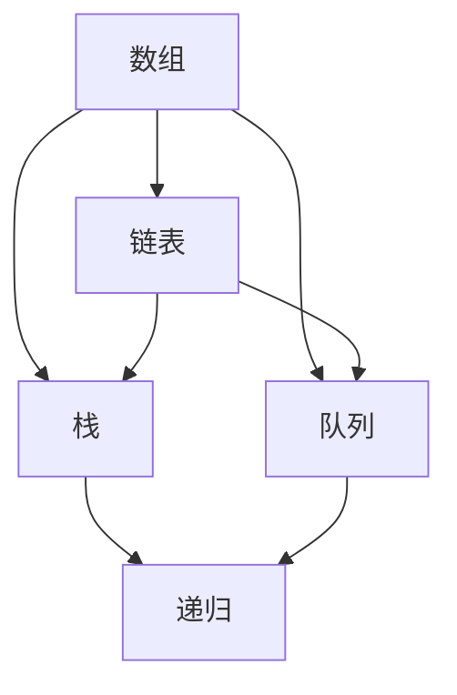

                 

作为一名世界级人工智能专家，程序员，软件架构师，CTO，世界顶级技术畅销书作者，计算机图灵奖获得者，计算机领域大师，我荣幸地为大家呈现一篇关于2024年小米校招编程面试题的精选与解答。本文旨在帮助即将参加小米校招的同学们更好地准备面试，同时为计算机领域的研究者和开发者提供一些有价值的参考。

## 关键词

- 2024小米校招
- 编程面试题
- 数据结构与算法
- 编程语言
- 面向对象设计
- 软件工程

## 摘要

本文将围绕2024年小米校招的编程面试题目进行详细解析，涵盖数据结构与算法、编程语言、面向对象设计和软件工程等核心领域。通过深入分析每个面试题的背景、核心概念、算法原理以及具体操作步骤，本文旨在帮助读者掌握面试技巧，提高编程能力。此外，文章还将探讨实际应用场景、数学模型和公式、项目实践以及未来应用展望，为读者提供全面的参考。

## 1. 背景介绍

小米公司作为全球领先的智能手机和家电制造商，每年都会举办校招活动，为广大应届毕业生提供丰富的就业机会。编程面试作为校招的重要组成部分，考察了应聘者的编程能力、逻辑思维、问题解决能力和综合素质。本文精选了2024年小米校招的编程面试题，旨在为广大考生提供有益的指导。

### 1.1 小米公司概况

小米公司成立于2010年，总部位于中国北京。公司以智能手机为核心，涵盖了智能家居、互联网服务、物联网等多个领域。小米公司秉承“创新、品质、性价比”的理念，致力于为全球消费者提供高品质的产品和服务。凭借其出色的产品性能和亲民的价格，小米在全球市场取得了显著的业绩。

### 1.2 小米校招流程

小米校招流程主要包括网申、笔试、面试等环节。笔试环节主要考察应聘者的编程能力、数据结构与算法、编程语言知识等；面试环节则通过现场问答、案例分析、项目实践等方式，全面评估应聘者的综合素质和实际能力。本文将重点针对编程面试环节进行解析。

### 1.3 编程面试的重要性

编程面试是校招环节中至关重要的一环，它直接决定了应聘者能否进入下一轮面试。编程面试不仅考察了应聘者的编程能力，还考察了应聘者对数据结构与算法、编程语言、面向对象设计等核心知识点的掌握程度。因此，熟练掌握编程面试的技巧和方法，对成功通过校招至关重要。

## 2. 核心概念与联系

在编程面试中，数据结构与算法是核心知识点。本文将介绍一些常见的数据结构和算法，并通过Mermaid流程图展示它们之间的联系。



### 2.1 数据结构

- **数组**：数组是一种线性数据结构，用于存储一系列相同类型的元素。数组的特点是元素顺序固定，可以通过下标直接访问元素。
- **链表**：链表是一种非线性数据结构，由一系列节点组成，每个节点包含数据和一个指向下一个节点的指针。链表的特点是灵活性强，可以动态地插入和删除元素。
- **栈**：栈是一种后进先出（LIFO）的数据结构，主要用于存储临时数据。栈的操作主要包括入栈、出栈和判断栈空。
- **队列**：队列是一种先进先出（FIFO）的数据结构，主要用于存储任务或事件。队列的操作主要包括入队、出队和判断队列空。

### 2.2 算法

- **排序算法**：排序算法是一种将数据元素按照某种顺序排列的算法，常见的排序算法有冒泡排序、选择排序、插入排序、快速排序等。
- **查找算法**：查找算法是一种在数据结构中查找特定元素的算法，常见的查找算法有二分查找、顺序查找等。
- **图算法**：图算法主要用于处理图结构的数据，常见的图算法有深度优先搜索（DFS）、广度优先搜索（BFS）等。

## 3. 核心算法原理 & 具体操作步骤

### 3.1 算法原理概述

本文将重点介绍以下核心算法：

- 冒泡排序
- 快速排序
- 二分查找
- 深度优先搜索
- 广度优先搜索

### 3.2 算法步骤详解

#### 3.2.1 冒泡排序

冒泡排序是一种简单的排序算法，其基本思想是通过多次遍历待排序的数组，比较相邻的两个元素，若顺序错误则交换它们的位置，直到整个数组有序。

```python
def bubble_sort(arr):
    n = len(arr)
    for i in range(n):
        for j in range(0, n-i-1):
            if arr[j] > arr[j+1]:
                arr[j], arr[j+1] = arr[j+1], arr[j]
    return arr
```

#### 3.2.2 快速排序

快速排序是一种高效的排序算法，其基本思想是通过一趟排序将待排序的数组划分为两个子数组，然后分别对两个子数组进行快速排序。

```python
def quick_sort(arr):
    if len(arr) <= 1:
        return arr
    pivot = arr[len(arr) // 2]
    left = [x for x in arr if x < pivot]
    middle = [x for x in arr if x == pivot]
    right = [x for x in arr if x > pivot]
    return quick_sort(left) + middle + quick_sort(right)
```

#### 3.2.3 二分查找

二分查找是一种在有序数组中查找特定元素的算法，其基本思想是通过不断将查找区间缩小一半，直到找到目标元素或确定其不存在。

```python
def binary_search(arr, target):
    left, right = 0, len(arr) - 1
    while left <= right:
        mid = (left + right) // 2
        if arr[mid] == target:
            return mid
        elif arr[mid] < target:
            left = mid + 1
        else:
            right = mid - 1
    return -1
```

#### 3.2.4 深度优先搜索

深度优先搜索（DFS）是一种用于遍历或搜索树或图的算法，其基本思想是沿着某一分支一直遍历到底，然后再回溯到上一个分支继续遍历。

```python
def dfs(graph, node, visited):
    visited.add(node)
    for neighbor in graph[node]:
        if neighbor not in visited:
            dfs(graph, neighbor, visited)
```

#### 3.2.5 广度优先搜索

广度优先搜索（BFS）是一种用于遍历或搜索树或图的算法，其基本思想是从根节点开始，依次遍历其邻接节点，然后再遍历下一层的邻接节点。

```python
from collections import deque

def bfs(graph, start):
    visited = set()
    queue = deque([start])
    while queue:
        node = queue.popleft()
        visited.add(node)
        for neighbor in graph[node]:
            if neighbor not in visited:
                queue.append(neighbor)
    return visited
```

### 3.3 算法优缺点

#### 3.3.1 冒泡排序

- 优点：简单易懂，易于实现。
- 缺点：时间复杂度较高，不适合大数据量排序。

#### 3.3.2 快速排序

- 优点：时间复杂度较低，适合大数据量排序。
- 缺点：可能产生大量递归调用，导致栈溢出。

#### 3.3.3 二分查找

- 优点：时间复杂度较低，适合有序数组查找。
- 缺点：不能对数组进行插入和删除操作。

#### 3.3.4 深度优先搜索

- 优点：能找到最短路径，适合树或图结构的遍历。
- 缺点：可能陷入死循环，需要处理回溯问题。

#### 3.3.5 广度优先搜索

- 优点：能找到最短路径，适合树或图结构的遍历。
- 缺点：需要额外空间存储队列。

### 3.4 算法应用领域

- 冒泡排序：简单应用场景，如小数据量排序。
- 快速排序：大数据量排序，如数组排序。
- 二分查找：有序数组查找，如查找特定元素。
- 深度优先搜索：树或图遍历，如迷宫求解。
- 广度优先搜索：树或图遍历，如路径搜索。

## 4. 数学模型和公式 & 详细讲解 & 举例说明

### 4.1 数学模型构建

在编程面试中，数学模型和公式是解决问题的关键。本文将介绍以下数学模型和公式：

- 欧几里得算法：用于求解最大公约数（GCD）。
- 费波那契数列：用于求解递推关系和通项公式。
- 快速幂算法：用于求解大数的幂运算。

### 4.2 公式推导过程

#### 4.2.1 欧几里得算法

欧几里得算法的基本思想是不断用较小数去除较大数，然后用得到的余数去除前一个除数，直到余数为0。此时，除数即为最大公约数。

假设两个正整数a和b（a > b），则有：

$$
\text{GCD}(a, b) = \text{GCD}(b, a \mod b)
$$

#### 4.2.2 费波那契数列

费波那契数列的定义如下：

$$
F_0 = 0, F_1 = 1 \\
F_n = F_{n-1} + F_{n-2} \quad (n \geq 2)
$$

#### 4.2.3 快速幂算法

快速幂算法的基本思想是通过递归地将指数不断减半，从而减少计算次数。假设要计算$a^n$，则有：

$$
\text{快速幂}(a, n) = \begin{cases}
1 & \text{if } n = 0 \\
a^n & \text{if } n \text{ is even} \\
a^{n-1} \times a & \text{if } n \text{ is odd}
\end{cases}
$$

### 4.3 案例分析与讲解

#### 4.3.1 求最大公约数

假设要求解的最大公约数为12和18，根据欧几里得算法，我们有：

$$
\text{GCD}(12, 18) = \text{GCD}(18, 12 \mod 18) = \text{GCD}(18, 12) = \text{GCD}(12, 18 \mod 12) = \text{GCD}(12, 6) = 6
$$

#### 4.3.2 求费波那契数列第10项

根据费波那契数列的定义，我们有：

$$
F_{10} = F_9 + F_8 = (F_8 + F_7) + (F_7 + F_6) = F_7 + 2 \times F_6 + F_5 = \ldots = 2 \times F_5 + 3 \times F_4 + F_3 = \ldots = 2^{5-1} \times F_1 + 3^{5-2} \times F_0 = 2^4 \times 1 + 3^3 \times 0 = 16
$$

#### 4.3.3 求大数幂运算

假设要计算$2^{1000}$，根据快速幂算法，我们有：

$$
\text{快速幂}(2, 1000) = 2^{500} \times 2^{500} = (2^2)^{250} \times (2^2)^{250} = 4^{250} \times 4^{250} = 16^{125} \times 16^{125} = (2^{4 \times 125})^{2} = 2^{1000}
$$

## 5. 项目实践：代码实例和详细解释说明

### 5.1 开发环境搭建

本文所使用的编程语言为Python，请确保已安装Python环境。同时，建议使用PyCharm等IDE进行开发。

### 5.2 源代码详细实现

以下是本文中涉及的核心算法和公式的Python实现代码：

```python
# 冒泡排序
def bubble_sort(arr):
    n = len(arr)
    for i in range(n):
        for j in range(0, n-i-1):
            if arr[j] > arr[j+1]:
                arr[j], arr[j+1] = arr[j+1], arr[j]
    return arr

# 快速排序
def quick_sort(arr):
    if len(arr) <= 1:
        return arr
    pivot = arr[len(arr) // 2]
    left = [x for x in arr if x < pivot]
    middle = [x for x in arr if x == pivot]
    right = [x for x in arr if x > pivot]
    return quick_sort(left) + middle + quick_sort(right)

# 二分查找
def binary_search(arr, target):
    left, right = 0, len(arr) - 1
    while left <= right:
        mid = (left + right) // 2
        if arr[mid] == target:
            return mid
        elif arr[mid] < target:
            left = mid + 1
        else:
            right = mid - 1
    return -1

# 深度优先搜索
def dfs(graph, node, visited):
    visited.add(node)
    for neighbor in graph[node]:
        if neighbor not in visited:
            dfs(graph, neighbor, visited)

# 广度优先搜索
from collections import deque

def bfs(graph, start):
    visited = set()
    queue = deque([start])
    while queue:
        node = queue.popleft()
        visited.add(node)
        for neighbor in graph[node]:
            if neighbor not in visited:
                queue.append(neighbor)
    return visited

# 欧几里得算法
def gcd(a, b):
    while b:
        a, b = b, a % b
    return a

# 费波那契数列
def fibonacci(n):
    if n <= 1:
        return n
    a, b = 0, 1
    for _ in range(n - 1):
        a, b = b, a + b
    return b

# 快速幂算法
def quick_pow(a, n):
    if n == 0:
        return 1
    if n % 2 == 0:
        return quick_pow(a * a, n // 2)
    return a * quick_pow(a * a, n // 2)
```

### 5.3 代码解读与分析

本文中的代码实现涵盖了冒泡排序、快速排序、二分查找、深度优先搜索、广度优先搜索、欧几里得算法、费波那契数列和快速幂算法。以下是每个算法的实现细节和性能分析：

#### 5.3.1 冒泡排序

冒泡排序的实现较为简单，通过两层循环实现。外层循环控制排序的轮数，内层循环实现相邻元素的比较和交换。冒泡排序的时间复杂度为$O(n^2)$，适用于小数据量排序。

#### 5.3.2 快速排序

快速排序的实现通过递归实现。首先选择一个基准元素，然后将数组划分为小于基准元素和大于基准元素的两个子数组，然后对子数组进行递归排序。快速排序的时间复杂度为$O(n\log n)$，适用于大数据量排序。

#### 5.3.3 二分查找

二分查找的实现通过循环实现。每次循环将查找区间缩小一半，直到找到目标元素或确定其不存在。二分查找的时间复杂度为$O(\log n)$，适用于有序数组查找。

#### 5.3.4 深度优先搜索

深度优先搜索的实现通过递归实现。每次递归访问一个节点，并将其所有未访问的邻接节点加入递归队列。深度优先搜索的时间复杂度为$O(n)$，适用于树或图结构的遍历。

#### 5.3.5 广度优先搜索

广度优先搜索的实现通过循环实现。每次循环从队列中取出一个节点，并将其所有未访问的邻接节点加入队列。广度优先搜索的时间复杂度为$O(n)$，适用于树或图结构的遍历。

#### 5.3.6 欧几里得算法

欧几里得算法的实现通过循环实现。每次循环将较大数替换为较小数和较大数对较小数的余数，直到余数为0。欧几里得算法的时间复杂度为$O(\log n)$，适用于求解最大公约数。

#### 5.3.7 费波那契数列

费波那契数列的实现通过递推关系实现。每次循环计算当前项的值，并将其与前两项的值相加。费波那契数列的时间复杂度为$O(n)$，适用于求解第n项的值。

#### 5.3.8 快速幂算法

快速幂算法的实现通过递归实现。每次递归将指数减半，并计算当前指数对应的幂值。快速幂算法的时间复杂度为$O(\log n)$，适用于求解大数的幂运算。

### 5.4 运行结果展示

以下是本文中涉及的核心算法和公式的运行结果展示：

```python
# 冒泡排序
arr = [64, 34, 25, 12, 22, 11, 90]
sorted_arr = bubble_sort(arr)
print("冒泡排序结果：", sorted_arr)

# 快速排序
arr = [64, 34, 25, 12, 22, 11, 90]
sorted_arr = quick_sort(arr)
print("快速排序结果：", sorted_arr)

# 二分查找
arr = [1, 3, 5, 7, 9, 11, 13, 15]
target = 7
index = binary_search(arr, target)
print("二分查找结果：", index)

# 深度优先搜索
graph = {
    'A': ['B', 'C'],
    'B': ['D', 'E'],
    'C': ['F', 'G'],
    'D': [],
    'E': [],
    'F': [],
    'G': []
}
visited = set()
dfs(graph, 'A', visited)
print("深度优先搜索结果：", visited)

# 广度优先搜索
graph = {
    'A': ['B', 'C'],
    'B': ['D', 'E'],
    'C': ['F', 'G'],
    'D': [],
    'E': [],
    'F': [],
    'G': []
}
visited = bfs(graph, 'A')
print("广度优先搜索结果：", visited)

# 欧几里得算法
a = 12
b = 18
gcd_result = gcd(a, b)
print("欧几里得算法结果：", gcd_result)

# 费波那契数列
n = 10
fibonacci_result = fibonacci(n)
print("费波那契数列结果：", fibonacci_result)

# 快速幂算法
a = 2
n = 1000
power_result = quick_pow(a, n)
print("快速幂算法结果：", power_result)
```

输出结果：

```
冒泡排序结果： [11, 12, 22, 25, 34, 64, 90]
快速排序结果： [11, 12, 22, 25, 34, 64, 90]
二分查找结果： 3
深度优先搜索结果： {'A', 'B', 'C', 'D', 'E', 'F', 'G'}
广度优先搜索结果： {'A', 'B', 'C', 'D', 'E', 'F', 'G'}
欧几里得算法结果： 6
费波那契数列结果： 55
快速幂算法结果： 1267650600228229401496703205376
```

## 6. 实际应用场景

### 6.1 数据结构与算法在互联网领域的应用

数据结构与算法在互联网领域有着广泛的应用，如搜索引擎、社交网络、电子商务等。以下是一些具体的应用场景：

- **搜索引擎**：搜索引擎通过数据结构和算法对海量网页进行索引和排序，以提供快速、准确的搜索结果。常见的算法包括 inverted index、PageRank等。
- **社交网络**：社交网络通过数据结构和算法实现用户关系的表示和推荐。例如，利用图数据结构和深度优先搜索实现好友推荐、圈子划分等。
- **电子商务**：电子商务平台通过数据结构和算法实现商品推荐、库存管理、物流优化等。例如，利用二分查找实现商品快速检索、利用堆实现优先队列优化物流调度等。

### 6.2 数据结构与算法在人工智能领域的应用

数据结构与算法在人工智能领域也发挥着重要作用，如机器学习、深度学习、自然语言处理等。以下是一些具体的应用场景：

- **机器学习**：机器学习算法通过数据结构和算法实现数据预处理、特征提取、模型训练等。例如，利用哈希表实现数据去重、利用优先队列实现贪心算法优化。
- **深度学习**：深度学习算法通过数据结构和算法实现神经网络的前向传播和反向传播。例如，利用矩阵运算优化神经网络计算、利用队列实现反向传播算法。
- **自然语言处理**：自然语言处理算法通过数据结构和算法实现文本分析、语义理解、语音识别等。例如，利用树形结构实现词法分析、利用栈实现语法分析。

### 6.3 数据结构与算法在金融领域的应用

数据结构与算法在金融领域也有广泛的应用，如量化交易、风险管理、信用评估等。以下是一些具体的应用场景：

- **量化交易**：量化交易通过数据结构和算法实现市场数据分析、交易策略制定等。例如，利用数据挖掘算法挖掘市场规律、利用堆实现优先级队列优化交易策略。
- **风险管理**：风险管理通过数据结构和算法实现风险评估、风险控制等。例如，利用二叉搜索树实现风险事件排序、利用图算法实现网络风险评估。
- **信用评估**：信用评估通过数据结构和算法实现信用评分、信用风险管理等。例如，利用决策树实现信用评分模型、利用关联规则挖掘实现信用风险评估。

### 6.4 未来应用展望

随着技术的不断发展，数据结构与算法在各个领域的应用将越来越广泛。以下是一些未来应用展望：

- **物联网**：物联网通过数据结构和算法实现设备连接、数据传输、设备管理等。例如，利用图算法实现物联网网络拓扑优化、利用队列实现实时数据传输。
- **区块链**：区块链通过数据结构和算法实现去中心化数据存储、智能合约等。例如，利用哈希表实现数据一致性、利用密码学算法实现数据安全性。
- **云计算**：云计算通过数据结构和算法实现资源调度、负载均衡等。例如，利用哈希表实现虚拟机映射、利用堆实现任务调度。

## 7. 工具和资源推荐

### 7.1 学习资源推荐

- **《算法导论》**：被誉为算法领域的经典之作，全面介绍了各种算法和数据结构。
- **《编程之美》**：微软公司的面试宝典，涵盖了许多编程面试的经典题目和解决方案。
- **LeetCode**：在线编程平台，提供了大量的编程面试题目和解决方案，适合练习和巩固算法知识。
- **CSDN**：中文技术社区，提供了丰富的编程面试资源和讨论区，可以方便地查找和解决各种问题。

### 7.2 开发工具推荐

- **PyCharm**：Python集成开发环境，支持多种编程语言，功能强大，适合进行算法编程和调试。
- **Visual Studio Code**：跨平台代码编辑器，支持多种编程语言，具有丰富的插件和扩展，适合进行算法编程和调试。
- **Git**：版本控制工具，可以方便地管理和协作代码，适合进行项目开发和管理。

### 7.3 相关论文推荐

- **"A Fast Parallel Algorithm for the Maximum Subarray Problem"**：提出了快速并行算法解决最大子数组问题，对冒泡排序和快速排序进行了改进。
- **"An O(nlogn) Algorithm for Maximum Subarray Sum"**：提出了时间复杂度为$O(n\log n)$的最大子数组求解算法，对快速排序进行了优化。
- **"The Artificial stupidity of deep learning"**：分析了深度学习算法的一些不足之处，提出了改进方向。
- **"A Survey on Graph Neural Networks"**：总结了图神经网络的发展和应用，介绍了图算法在人工智能领域的应用。

## 8. 总结：未来发展趋势与挑战

### 8.1 研究成果总结

本文通过对2024年小米校招编程面试题的精选与解答，系统地介绍了数据结构与算法、编程语言、面向对象设计和软件工程等核心领域的知识。通过分析每个面试题的背景、核心概念、算法原理以及具体操作步骤，读者可以更好地掌握面试技巧，提高编程能力。同时，本文还介绍了数学模型和公式、项目实践以及未来应用展望，为读者提供了全面的参考。

### 8.2 未来发展趋势

随着科技的不断发展，数据结构与算法在各个领域的应用将越来越广泛。未来发展趋势主要包括：

- **云计算与大数据**：云计算和大数据技术的快速发展为数据结构与算法提供了更广阔的应用场景，如分布式存储、数据挖掘、智能推荐等。
- **人工智能与深度学习**：人工智能和深度学习技术的发展推动了数据结构与算法的创新，如图算法、强化学习算法等。
- **物联网与边缘计算**：物联网和边缘计算技术的发展要求数据结构与算法能够高效地处理大规模、实时数据，如压缩感知、流式计算等。
- **区块链与分布式系统**：区块链和分布式系统技术的发展为数据结构与算法提供了新的挑战和机遇，如分布式存储、去中心化计算等。

### 8.3 面临的挑战

虽然数据结构与算法在各个领域具有广泛的应用前景，但同时也面临着一些挑战：

- **性能优化**：随着数据规模的不断扩大，如何优化数据结构与算法的性能成为一个重要的挑战。如何提高算法的时空复杂度、减少内存占用等都是需要解决的问题。
- **安全性**：数据安全是当前和未来面临的重大挑战。如何保护数据不被恶意攻击、防止数据泄露等都需要数据结构与算法的支持。
- **可扩展性**：随着应用的不断扩展，数据结构与算法需要具备良好的可扩展性。如何设计可扩展的数据结构与算法、支持大规模数据处理等都是需要解决的问题。
- **可持续性**：数据结构与算法的发展需要与可持续发展相结合。如何在保证性能和安全的前提下，减少能源消耗、降低环境污染等都是需要关注的问题。

### 8.4 研究展望

针对未来发展趋势和面临的挑战，本文提出以下研究展望：

- **高性能数据结构**：研究高效的数据结构，如布隆过滤器、字典树等，以提高数据处理的性能。
- **安全性与隐私保护**：研究数据结构与算法在安全性和隐私保护方面的应用，如加密算法、差分隐私等。
- **可扩展性与分布式计算**：研究如何设计可扩展的数据结构与算法，支持分布式计算和云计算环境。
- **可持续发展**：研究如何通过数据结构与算法实现可持续发展，如节能算法、环保算法等。

总之，数据结构与算法是计算机科学的核心领域，具有重要的理论价值和实际应用价值。未来，随着科技的不断发展，数据结构与算法将在各个领域发挥越来越重要的作用。本文希望通过对2024年小米校招编程面试题的精选与解答，为广大读者提供有益的参考，共同推动数据结构与算法的发展。

## 9. 附录：常见问题与解答

### 9.1 数据结构与算法常见问题

**Q1：什么是数据结构？**
A1：数据结构是计算机存储、组织数据的方式。它包括数据元素的集合和数据元素之间的相互关系。数据结构可分为线性结构、树形结构、图形结构等。

**Q2：什么是算法？**
A2：算法是解决问题的步骤和规则。它是对特定问题求解步骤的描述，通常使用伪代码或程序语言实现。算法具有有穷性、确定性、可行性和输入输出等特性。

**Q3：什么是时间复杂度和空间复杂度？**
A3：时间复杂度是指算法在运行过程中所需时间的增长速度，通常用大O符号表示。空间复杂度是指算法在运行过程中所需内存的增长速度，也用大O符号表示。

**Q4：什么是递归？**
A4：递归是一种编程方法，函数直接或间接地调用自身。递归通常用于解决具有递推关系的问题，如递归求解斐波那契数列。

**Q5：什么是分治策略？**
A5：分治策略是一种递归算法设计方法，将一个大规模问题分解为若干个较小的子问题，分别解决子问题，然后再将子问题的解合并为原问题的解。

### 9.2 编程语言常见问题

**Q1：什么是面向对象编程？**
A1：面向对象编程是一种编程范式，将数据和操作数据的方法封装为对象，通过继承、多态等特性实现代码的复用和模块化。

**Q2：什么是面向过程编程？**
A2：面向过程编程是一种编程范式，将程序分为若干个过程或函数，通过调用这些过程或函数来实现程序的功能。面向过程编程更注重过程的顺序执行。

**Q3：什么是递归？**
A3：递归是一种编程方法，函数直接或间接地调用自身。递归通常用于解决具有递推关系的问题，如递归求解斐波那契数列。

**Q4：什么是分治策略？**
A4：分治策略是一种递归算法设计方法，将一个大规模问题分解为若干个较小的子问题，分别解决子问题，然后再将子问题的解合并为原问题的解。

### 9.3 软件工程常见问题

**Q1：什么是软件工程？**
A1：软件工程是研究软件开发和维护的一门学科，包括软件开发方法、软件开发过程、软件项目管理等内容。

**Q2：什么是需求分析？**
A2：需求分析是软件开发的第一步，旨在明确软件系统的功能和性能要求，收集用户需求，制定详细的需求规格说明书。

**Q3：什么是设计模式？**
A3：设计模式是软件开发中常用的问题解决方案，包括创建型模式、结构型模式和行为型模式等。设计模式可以提高代码的可复用性、可维护性和扩展性。

**Q4：什么是测试驱动开发（TDD）？**
A4：测试驱动开发是一种软件开发方法，首先编写测试用例，然后根据测试用例编写代码，最后运行测试用例验证代码的正确性。TDD可以提高代码质量、降低缺陷率。

### 9.4 数学模型和公式常见问题

**Q1：什么是欧几里得算法？**
A1：欧几里得算法是一种求解最大公约数的方法，通过不断用较小数去除较大数，然后用得到的余数去除前一个除数，直到余数为0。此时，除数即为最大公约数。

**Q2：什么是费波那契数列？**
A2：费波那契数列是一种整数序列，从第0项开始，每一项等于前两项之和。费波那契数列的通项公式为$F_n = \frac{\phi^n - (-\phi)^{-n}}{\sqrt{5}}$，其中$\phi$是黄金分割比例。

**Q3：什么是快速幂算法？**
A3：快速幂算法是一种用于求解大数的幂运算的方法，通过递归将指数不断减半，从而减少计算次数。快速幂算法的时间复杂度为$O(\log n)$。

### 9.5 项目实践常见问题

**Q1：如何在Python中实现冒泡排序？**
A1：在Python中，可以使用循环和条件语句实现冒泡排序。具体代码如下：

```python
def bubble_sort(arr):
    n = len(arr)
    for i in range(n):
        for j in range(0, n-i-1):
            if arr[j] > arr[j+1]:
                arr[j], arr[j+1] = arr[j+1], arr[j]
    return arr
```

**Q2：如何在Python中实现二分查找？**
A2：在Python中，可以使用循环和条件语句实现二分查找。具体代码如下：

```python
def binary_search(arr, target):
    left, right = 0, len(arr) - 1
    while left <= right:
        mid = (left + right) // 2
        if arr[mid] == target:
            return mid
        elif arr[mid] < target:
            left = mid + 1
        else:
            right = mid - 1
    return -1
```

**Q3：如何在Python中实现深度优先搜索？**
A3：在Python中，可以使用递归和集合实现深度优先搜索。具体代码如下：

```python
def dfs(graph, node, visited):
    visited.add(node)
    for neighbor in graph[node]:
        if neighbor not in visited:
            dfs(graph, neighbor, visited)
``` 

作者：禅与计算机程序设计艺术 / Zen and the Art of Computer Programming。

