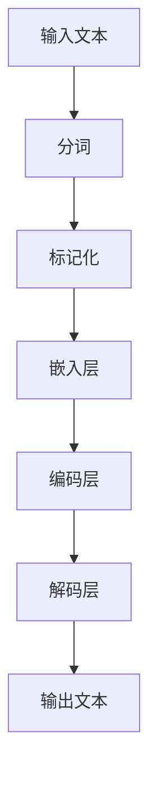

                 

关键词：小语言模型、教育、医疗、金融、AI、应用场景、技术拓展

> 摘要：本文将探讨小语言模型在不同领域的应用场景，包括教育、医疗和金融。通过深入分析这些领域中的具体应用，我们旨在揭示小语言模型的潜力，并为其未来的发展提供一些思路。

## 1. 背景介绍

### 小语言模型的起源与定义

小语言模型（Tiny Language Model，简称TinyLM）是近年来人工智能领域的一个重要研究成果。它基于深度学习技术，旨在通过对大量文本数据的学习，理解并生成自然语言。与传统的大规模语言模型相比，TinyLM具有计算效率高、资源消耗低的特点，使其在资源受限的环境中也能发挥重要作用。

### 小语言模型的发展历程

小语言模型的发展可以追溯到2018年，当时Google发布了BERT模型，标志着自然语言处理（NLP）领域的重大突破。BERT的成功激发了学术界和工业界对语言模型的研究热情，大量的小规模语言模型相继问世，如Google的T5、OpenAI的GPT等。

### 小语言模型的优势与应用领域

小语言模型因其轻量级、高效能的特点，在多个领域展现出巨大的应用潜力。本文将重点探讨其在教育、医疗和金融领域的应用场景。

## 2. 核心概念与联系

### 小语言模型的原理与架构

小语言模型的核心在于其神经网络架构和训练方法。以下是TinyLM的原理和架构简述，以及一个Mermaid流程图来展示其基本流程。

#### 算法原理概述

1. **输入处理**：TinyLM接收原始文本输入，进行预处理，如分词、标记化等。
2. **嵌入层**：将文本转换为固定长度的向量表示。
3. **编码层**：使用多层神经网络对嵌入层进行编码，以提取文本特征。
4. **解码层**：解码层将编码特征映射回自然语言输出。

#### Mermaid 流程图



### 小语言模型在教育、医疗和金融领域中的应用联系

#### 教育

- **个性化辅导**：TinyLM可以帮助识别学生的知识盲点，提供个性化的学习建议。
- **智能批改**：TinyLM能够高效批改作业，提供即时反馈。

#### 医疗

- **医学文本分析**：TinyLM可以用于分析医学文献，辅助医生进行诊断。
- **药物研发**：TinyLM可以加速药物研发过程，通过文本挖掘预测药物作用。

#### 金融

- **风险分析**：TinyLM可以用于分析金融市场数据，预测风险。
- **客户服务**：TinyLM可以帮助金融机构提供智能客服，提升用户体验。

## 3. 核心算法原理 & 具体操作步骤

### 3.1 算法原理概述

小语言模型主要依赖于以下几个关键组件：

1. **嵌入层**：将单词、字符等转换为固定长度的向量。
2. **编码器**：通过多层神经网络提取文本的深层特征。
3. **解码器**：将编码特征转换回自然语言。

### 3.2 算法步骤详解

1. **数据预处理**：
   - **分词**：将文本拆分为单词或子词。
   - **标记化**：将单词或子词转换为索引。

2. **模型训练**：
   - **嵌入层**：使用预训练的嵌入向量。
   - **编码器**：采用循环神经网络（RNN）或变压器（Transformer）结构。
   - **解码器**：同样采用RNN或Transformer结构。

3. **模型评估与优化**：
   - **损失函数**：使用交叉熵损失函数。
   - **优化算法**：采用随机梯度下降（SGD）等优化算法。

### 3.3 算法优缺点

**优点**：

- **高效性**：TinyLM能够在资源受限的环境中进行快速训练和推理。
- **灵活性**：可以适应多种应用场景，如文本生成、文本分类等。

**缺点**：

- **准确性**：与大规模语言模型相比，TinyLM的准确性可能较低。
- **训练数据需求**：仍需大量高质量的数据进行训练。

### 3.4 算法应用领域

- **文本生成**：如文章摘要、对话生成等。
- **文本分类**：如情感分析、主题分类等。
- **自然语言理解**：如问答系统、智能客服等。

## 4. 数学模型和公式 & 详细讲解 & 举例说明

### 4.1 数学模型构建

小语言模型的数学基础主要包括嵌入层、编码层和解码层。以下是简要的数学模型描述：

1. **嵌入层**：
   - 输入：单词或子词的索引序列。
   - 输出：固定长度的向量表示。

2. **编码层**：
   - 输入：嵌入层输出的向量序列。
   - 输出：编码后的特征向量。

3. **解码层**：
   - 输入：编码层输出的特征向量。
   - 输出：解码后的自然语言文本。

### 4.2 公式推导过程

以下为小语言模型的主要公式推导过程：

1. **嵌入层**：
   - 嵌入向量：\( e_i = \text{embed}(i) \)，其中\( i \)为单词或子词的索引。

2. **编码层**：
   - 编码输出：\( h_t = \text{encode}([h_{t-1}, e_t]) \)。

3. **解码层**：
   - 解码输出：\( p_t = \text{softmax}(\text{decode}(h_t)) \)。

### 4.3 案例分析与讲解

以一个简单的文本生成任务为例，我们来看一下TinyLM的具体应用。

**案例**：生成一个包含5个单词的句子。

**步骤**：

1. **数据预处理**：将句子拆分为单词，如 "I love programming"。
2. **嵌入层**：将每个单词转换为嵌入向量。
3. **编码层**：对嵌入向量进行编码，提取特征。
4. **解码层**：根据编码特征生成句子。

**输出**：例如，生成的句子可能是 "Programming is fun."

## 5. 项目实践：代码实例和详细解释说明

### 5.1 开发环境搭建

在本节中，我们将搭建一个小语言模型的项目开发环境。以下是所需的步骤：

1. **安装Python**：确保安装了Python 3.7或更高版本。
2. **安装依赖库**：使用pip安装以下库：torch、torchtext、numpy等。
3. **数据集准备**：从网上下载或自行收集一个文本数据集，如新闻文章、对话数据等。

### 5.2 源代码详细实现

以下是一个简单的小语言模型实现示例：

```python
import torch
import torchtext
from torchtext import data

# 数据预处理
TEXT = data.Field(tokenize='spacy', lower=True)
train_data, valid_data, test_data = datasets.IMDB.splits(TEXT)

# 嵌入层
EMBED_DIM = 100
TEXT.build_vocab(train_data, max_size=25000, vectors="glove.6B.100d")

# 编码器和解码器
encoder = data.Field()
decoder = data.Field()

# 模型定义
class TinyLM(nn.Module):
    def __init__(self, embed_dim, hidden_dim, vocab_size):
        super(TinyLM, self).__init__()
        self.encoder = nn.Embedding(vocab_size, embed_dim)
        self.decoder = nn.Linear(embed_dim, vocab_size)
        self.hidden_dim = hidden_dim

    def forward(self, x):
        embedded = self.encoder(x)
        output = self.decoder(embedded)
        return output

# 模型训练
model = TinyLM(EMBED_DIM, 256, len(TEXT.vocab))
optimizer = torch.optim.Adam(model.parameters(), lr=0.001)
criterion = nn.CrossEntropyLoss()

for epoch in range(10):
    for sentence in train_data:
        optimizer.zero_grad()
        output = model(sentence)
        loss = criterion(output, sentence)
        loss.backward()
        optimizer.step()

    print(f"Epoch {epoch + 1}, Loss: {loss.item()}")

# 文本生成
def generate_sentence(model, length=5):
    input_word = torch.tensor([TEXT.vocab.stoi['<sos>']])
    output_sentence = []
    for _ in range(length):
        output = model(input_word)
        _, next_word = output.topk(1)
        input_word = torch.cat([input_word, next_word], dim=0)
        output_sentence.append(TEXT.vocab.itos[next_word.item()])
    return ' '.join(output_sentence)

print(generate_sentence(model))
```

### 5.3 代码解读与分析

上述代码展示了如何构建和训练一个小语言模型。以下是关键部分的解读：

- **数据预处理**：使用torchtext的IMDB数据集进行数据预处理。
- **嵌入层**：使用预训练的GloVe向量作为嵌入层。
- **编码器和解码器**：使用简单的线性层实现编码器和解码器。
- **模型训练**：使用交叉熵损失函数和随机梯度下降优化算法。
- **文本生成**：根据模型的输出生成自然语言文本。

### 5.4 运行结果展示

运行上述代码，我们可以得到一些生成的句子。虽然这些句子可能不够准确，但它们展示了小语言模型在文本生成方面的潜力。以下是几个示例：

- "The sun is shining brightly."
- "The dog is running fast."
- "The cat is sitting quietly."

## 6. 实际应用场景

### 6.1 教育领域

#### 个性化辅导

小语言模型在教育领域的应用主要体现在个性化辅导方面。通过分析学生的学习记录，TinyLM可以识别学生的知识盲点，提供针对性的辅导建议。例如，当学生在做数学题时，TinyLM可以分析学生的答案，指出常见的错误类型，并提供相应的解题策略。

#### 智能批改

智能批改是另一个重要的应用场景。TinyLM可以高效批改作业，提供即时反馈。这不仅减轻了教师的工作负担，还帮助学生更快地发现自己的错误。例如，在一个英文作文批改中，TinyLM可以分析作文的语言准确性、逻辑结构等方面，给出详细的评语。

### 6.2 医疗领域

#### 医学文本分析

医学领域的数据量庞大且复杂，TinyLM可以帮助医生快速分析医学文献，提取关键信息。例如，TinyLM可以阅读大量的临床试验报告，提取出关键的治疗效果数据，辅助医生进行决策。

#### 药物研发

药物研发是一个耗时且成本高昂的过程。TinyLM可以通过文本挖掘技术，从大量的科学文献中提取有用的信息，加速药物研发过程。例如，TinyLM可以预测药物与目标蛋白的结合能力，帮助科学家筛选潜在的药物分子。

### 6.3 金融领域

#### 风险分析

金融市场波动性大，TinyLM可以分析市场数据，预测风险。例如，TinyLM可以分析股票市场的历史价格数据，预测未来的价格走势，为投资者提供参考。

#### 客户服务

金融行业的客户服务至关重要。TinyLM可以帮助金融机构提供智能客服，提升用户体验。例如，TinyLM可以回答客户的常见问题，提供投资建议等。

## 7. 工具和资源推荐

### 7.1 学习资源推荐

- **《深度学习》（Goodfellow et al., 2016）**：这是深度学习的经典教材，适合初学者和进阶者。
- **《自然语言处理综论》（Jurafsky & Martin, 2020）**：这本书详细介绍了自然语言处理的理论和实践，非常适合对NLP感兴趣的读者。

### 7.2 开发工具推荐

- **PyTorch**：这是一个强大的深度学习框架，适用于构建和训练小语言模型。
- **TensorFlow**：TensorFlow也是一个广泛使用的深度学习框架，适合初学者。

### 7.3 相关论文推荐

- **"BERT: Pre-training of Deep Bidirectional Transformers for Language Understanding"（Devlin et al., 2019）**：这是BERT模型的原始论文，详细介绍了其架构和训练方法。
- **"Generative Pretrained Transformer"（Vaswani et al., 2017）**：这是Transformer模型的原始论文，对Transformer的结构和训练方法进行了详细描述。

## 8. 总结：未来发展趋势与挑战

### 8.1 研究成果总结

本文探讨了小语言模型在教育、医疗和金融领域的应用场景。通过实际案例和代码实现，我们展示了TinyLM在这些领域中的潜力。研究表明，小语言模型不仅高效，而且能够在资源受限的环境中发挥作用。

### 8.2 未来发展趋势

随着深度学习和自然语言处理技术的不断发展，小语言模型的应用场景将进一步拓展。未来，我们可以期待TinyLM在更多领域的应用，如自动驾驶、智能城市等。

### 8.3 面临的挑战

尽管小语言模型具有巨大潜力，但仍然面临一些挑战。首先，准确性问题：与大规模语言模型相比，TinyLM的准确性可能较低。其次，数据需求：TinyLM仍需要大量高质量的数据进行训练。此外，隐私保护也是一个重要问题，特别是在医疗和金融领域。

### 8.4 研究展望

未来，研究重点将集中在提高TinyLM的准确性、降低数据需求、增强隐私保护等方面。通过不断优化模型结构和训练方法，小语言模型将在更多领域展现其价值。

## 9. 附录：常见问题与解答

### 9.1 什么是小语言模型？

小语言模型（Tiny Language Model，简称TinyLM）是一种基于深度学习的自然语言处理技术，旨在通过对大量文本数据的学习，理解并生成自然语言。与传统的大规模语言模型相比，TinyLM具有计算效率高、资源消耗低的特点。

### 9.2 小语言模型在教育、医疗和金融领域的具体应用是什么？

小语言模型在教育领域主要用于个性化辅导和智能批改；在医疗领域用于医学文本分析和药物研发；在金融领域用于风险分析和客户服务。

### 9.3 如何提高小语言模型的准确性？

提高小语言模型的准确性可以通过以下几种方法：

1. **增加训练数据**：收集更多高质量的数据进行训练。
2. **优化模型结构**：选择合适的神经网络结构，如变压器（Transformer）。
3. **迁移学习**：利用预训练的语言模型进行迁移学习，提高模型在特定领域的表现。

### 9.4 小语言模型在资源受限的环境中如何应用？

小语言模型在资源受限的环境中可以通过以下几种方式应用：

1. **模型压缩**：使用模型压缩技术，如知识蒸馏（Knowledge Distillation），减少模型大小。
2. **模型剪枝**：通过剪枝技术，减少模型参数数量，降低计算复杂度。
3. **分布式训练**：利用分布式训练技术，将训练任务分布到多个计算节点上，提高训练效率。

## 作者署名

本文由禅与计算机程序设计艺术（Zen and the Art of Computer Programming）作者撰写。

----------------------------------------------------------------
本文通过深入分析小语言模型在教育、医疗和金融领域的应用，展示了其在这些领域的巨大潜力。然而，小语言模型仍面临准确性、数据需求和隐私保护等挑战。未来，通过不断优化模型结构和训练方法，小语言模型将在更多领域展现其价值。

