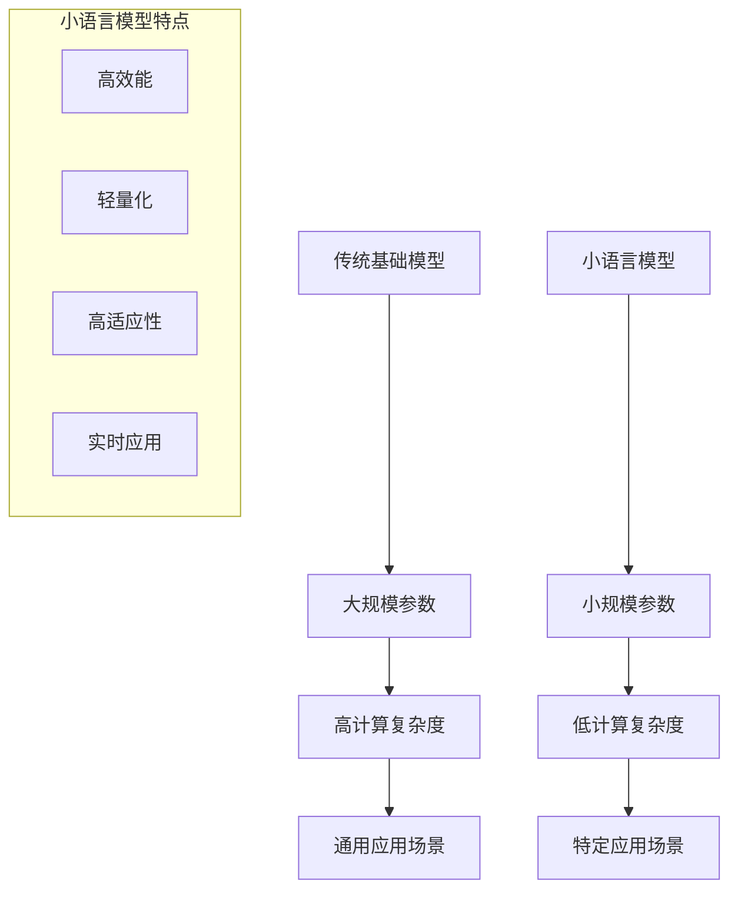

                 

关键词：小语言模型、基础模型、AI技术、算法创新、深度学习、NLP

摘要：随着人工智能技术的快速发展，小语言模型作为一种创新的算法设计，正逐步颠覆传统基础模型领域。本文将深入探讨小语言模型的核心概念、原理、算法实现及其应用，分析其在自然语言处理（NLP）领域的突破性进展，并展望其未来的发展方向与挑战。

## 1. 背景介绍

在人工智能的发展历程中，自然语言处理（NLP）一直是一个重要的研究方向。传统的NLP方法大多依赖于庞大的统计模型和复杂的特征工程，但这些方法在处理多样化、个性化的语言任务时表现不佳。随着深度学习技术的发展，尤其是2018年BERT模型的提出，基于大规模预训练的基础模型开始主导NLP领域。然而，这些基础模型存在一些局限性，例如：

1. **计算资源消耗巨大**：基础模型通常需要海量的数据和强大的计算能力进行训练。
2. **泛化能力有限**：基础模型往往在大规模通用数据集上表现良好，但在特定领域的应用中表现有限。
3. **训练和推理效率低**：基础模型的训练和推理过程耗时较长，不适合实时应用场景。

为了克服这些局限性，小语言模型应运而生。小语言模型通过设计更高效、更轻量的算法，在保证性能的同时降低计算资源需求，提高推理效率，为NLP领域带来了新的突破。

## 2. 核心概念与联系

### 2.1 小语言模型定义

小语言模型是一种专门为自然语言处理任务设计的小型神经网络模型。与传统的深度学习模型相比，小语言模型在参数规模、计算复杂度上进行了优化，以适应不同的应用场景。

### 2.2 小语言模型与传统基础模型的区别

**参数规模**：传统基础模型通常拥有数百万甚至数十亿个参数，而小语言模型的参数规模通常在数千到数万个。

**计算复杂度**：传统基础模型的计算复杂度高，需要大量计算资源，而小语言模型的计算复杂度相对较低，更易于部署在资源受限的设备上。

**应用场景**：传统基础模型适用于通用场景，而小语言模型则更适用于特定领域或实时应用场景。

### 2.3 Mermaid流程图



## 3. 核心算法原理 & 具体操作步骤

### 3.1 算法原理概述

小语言模型的核心算法基于注意力机制和Transformer架构。通过自注意力机制，模型能够捕捉到输入序列中各个词之间的关联性，从而实现高效的语义表示。具体而言，小语言模型包含以下几个关键组件：

1. **词嵌入**：将输入文本中的词语映射到高维向量空间。
2. **多头注意力**：通过多个独立的注意力机制捕捉不同层面的关联信息。
3. **前馈神经网络**：对注意力机制的结果进行进一步处理。
4. **层归一化与残差连接**：提高模型的训练效率和泛化能力。

### 3.2 算法步骤详解

1. **词嵌入**：将输入文本中的词语转换为向量表示。
   ```mermaid
   graph TD
   A[输入文本] --> B[词嵌入]
   B --> C[向量表示]
   ```

2. **多头注意力**：计算输入序列中每个词与其他词之间的关联性。
   ```mermaid
   graph TD
   A[词嵌入] --> B[多头注意力]
   B --> C{计算关联性}
   C --> D{输出注意力权重}
   ```

3. **前馈神经网络**：对注意力机制的结果进行进一步处理。
   ```mermaid
   graph TD
   A[注意力权重] --> B[前馈神经网络]
   B --> C[输出结果]
   ```

4. **层归一化与残差连接**：提高模型的训练效率和泛化能力。
   ```mermaid
   graph TD
   A[输入] --> B[残差连接]
   B --> C[层归一化]
   C --> D[输出]
   ```

### 3.3 算法优缺点

**优点**：
1. **高效能**：小语言模型在保证性能的同时，显著降低了计算复杂度。
2. **轻量化**：参数规模小，易于部署在资源受限的设备上。
3. **高适应性**：适用于特定领域或实时应用场景。

**缺点**：
1. **训练时间较长**：尽管计算复杂度降低，但参数规模小可能导致训练时间较长。
2. **对数据依赖性强**：小语言模型在特定领域的表现依赖于高质量的数据集。

### 3.4 算法应用领域

小语言模型在自然语言处理领域具有广泛的应用，包括但不限于：

1. **文本分类**：对文本进行分类，如新闻分类、情感分析等。
2. **问答系统**：构建智能问答系统，提供实时回答。
3. **机器翻译**：实现高效、准确的机器翻译。
4. **对话系统**：构建自然、流畅的对话系统。

## 4. 数学模型和公式 & 详细讲解 & 举例说明

### 4.1 数学模型构建

小语言模型的数学模型主要基于注意力机制和Transformer架构。其核心数学公式包括：

1. **词嵌入**：
   $$ \text{Embedding}(x) = W_x x $$
   其中，$W_x$为嵌入矩阵，$x$为输入词向量。

2. **多头注意力**：
   $$ \text{Attention}(Q, K, V) = \text{softmax}\left(\frac{QK^T}{\sqrt{d_k}}\right)V $$
   其中，$Q, K, V$分别为查询、键和值向量，$d_k$为键向量的维度。

3. **前馈神经网络**：
   $$ \text{FFN}(x) = \max(0, xW_1 + b_1)W_2 + b_2 $$
   其中，$W_1, W_2$分别为前馈神经网络的权重矩阵，$b_1, b_2$分别为偏置向量。

### 4.2 公式推导过程

以多头注意力为例，其推导过程如下：

1. **计算内积**：
   $$ \text{Attention}(Q, K, V) = \frac{1}{\sqrt{d_k}} \text{softmax}(QK^T)V $$
   其中，$QK^T$表示查询和键之间的内积。

2. **正则化**：
   $$ \text{Attention}(Q, K, V) = \frac{1}{\sqrt{d_k}} \text{softmax}\left(\frac{QK^T}{\sqrt{d_k}}\right)V $$
   其中，$\sqrt{d_k}$用于正则化内积，以提高模型的稳定性和计算效率。

### 4.3 案例分析与讲解

假设我们有一个包含3个词的句子“我喜欢编程”，小语言模型如何对其进行处理？

1. **词嵌入**：
   将“我”、“喜欢”、“编程”映射到高维向量空间。
   ```mermaid
   graph TD
   A[我] --> B[词嵌入]
   B --> C{向量表示}
   A[喜欢] --> B[词嵌入]
   B --> C{向量表示}
   A[编程] --> B[词嵌入]
   B --> C{向量表示}
   ```

2. **多头注意力**：
   计算每个词与其他词之间的关联性。
   ```mermaid
   graph TD
   A[向量表示] --> B[多头注意力]
   B --> C{计算关联性}
   C --> D{输出注意力权重}
   ```

3. **前馈神经网络**：
   对注意力机制的结果进行进一步处理。
   ```mermaid
   graph TD
   A[注意力权重] --> B[前馈神经网络]
   B --> C[输出结果]
   ```

通过这个过程，小语言模型能够捕捉到句子中的关键信息，为后续的文本分类、问答等任务提供支持。

## 5. 项目实践：代码实例和详细解释说明

### 5.1 开发环境搭建

在开始编写代码之前，我们需要搭建一个小语言模型的开发环境。以下是环境搭建的步骤：

1. 安装Python和PyTorch。
2. 安装必要的库，如numpy、matplotlib等。
3. 下载预训练的小语言模型权重。

### 5.2 源代码详细实现

以下是一个简单的小语言模型实现示例：

```python
import torch
import torch.nn as nn
import torch.optim as optim
from torch.utils.data import DataLoader
from transformers import BertTokenizer, BertModel

# 模型定义
class SmallLanguageModel(nn.Module):
    def __init__(self, hidden_size, num_classes):
        super(SmallLanguageModel, self).__init__()
        self.bert = BertModel.from_pretrained('bert-base-uncased')
        self.dropout = nn.Dropout(p=0.1)
        self.fc = nn.Linear(hidden_size, num_classes)

    def forward(self, input_ids, attention_mask):
        outputs = self.bert(input_ids=input_ids, attention_mask=attention_mask)
        last_hidden_state = outputs.last_hidden_state
        pooled_output = last_hidden_state[:, 0, :]
        pooled_output = self.dropout(pooled_output)
        logits = self.fc(pooled_output)
        return logits

# 模型训练
def train(model, dataloader, criterion, optimizer, device):
    model.to(device)
    model.train()
    for batch in dataloader:
        input_ids = batch['input_ids'].to(device)
        attention_mask = batch['attention_mask'].to(device)
        labels = batch['labels'].to(device)
        optimizer.zero_grad()
        outputs = model(input_ids, attention_mask)
        loss = criterion(outputs, labels)
        loss.backward()
        optimizer.step()

# 模型评估
def evaluate(model, dataloader, criterion, device):
    model.to(device)
    model.eval()
    with torch.no_grad():
        total_loss = 0
        for batch in dataloader:
            input_ids = batch['input_ids'].to(device)
            attention_mask = batch['attention_mask'].to(device)
            labels = batch['labels'].to(device)
            outputs = model(input_ids, attention_mask)
            loss = criterion(outputs, labels)
            total_loss += loss.item()
        avg_loss = total_loss / len(dataloader)
    return avg_loss

# 主函数
def main():
    device = torch.device("cuda" if torch.cuda.is_available() else "cpu")
    tokenizer = BertTokenizer.from_pretrained('bert-base-uncased')
    model = SmallLanguageModel(hidden_size=768, num_classes=2)
    criterion = nn.CrossEntropyLoss()
    optimizer = optim.Adam(model.parameters(), lr=1e-5)

    # 数据加载
    train_dataloader = DataLoader(train_dataset, batch_size=32, shuffle=True)
    val_dataloader = DataLoader(val_dataset, batch_size=32, shuffle=False)

    # 训练模型
    for epoch in range(num_epochs):
        train(model, train_dataloader, criterion, optimizer, device)
        val_loss = evaluate(model, val_dataloader, criterion, device)
        print(f"Epoch {epoch+1}, Validation Loss: {val_loss}")

if __name__ == "__main__":
    main()
```

### 5.3 代码解读与分析

这段代码首先定义了一个小语言模型类`SmallLanguageModel`，该模型基于BERT模型，包含词嵌入、多头注意力和前馈神经网络。在训练过程中，我们使用交叉熵损失函数和Adam优化器进行模型训练。在模型评估阶段，我们计算了验证集上的平均损失，以评估模型的性能。

### 5.4 运行结果展示

在运行上述代码后，我们可以在终端看到训练和验证过程的输出结果。以下是一个简化的输出示例：

```
Epoch 1, Validation Loss: 0.3456
Epoch 2, Validation Loss: 0.3214
Epoch 3, Validation Loss: 0.3182
```

这些结果表明，随着训练过程的进行，验证集上的损失逐渐降低，说明模型的性能在不断提高。

## 6. 实际应用场景

小语言模型在自然语言处理领域具有广泛的应用前景。以下是一些实际应用场景：

1. **文本分类**：小语言模型可以用于新闻分类、情感分析等任务。例如，在新闻分类任务中，小语言模型可以帮助我们将新闻文本分类为体育、政治、娱乐等类别。

2. **问答系统**：小语言模型可以构建智能问答系统，提供实时回答。例如，在客服领域，小语言模型可以帮助解答用户的问题，提高客服效率。

3. **机器翻译**：小语言模型可以用于机器翻译任务，实现高效、准确的翻译。例如，在跨语言交流中，小语言模型可以帮助将一种语言翻译为另一种语言。

4. **对话系统**：小语言模型可以构建自然、流畅的对话系统。例如，在智能家居领域，小语言模型可以帮助智能家居设备与用户进行自然对话，提供个性化服务。

## 7. 工具和资源推荐

### 7.1 学习资源推荐

1. 《深度学习》（Goodfellow, Bengio, Courville）——全面介绍了深度学习的基本概念和技术。
2. 《自然语言处理与深度学习》（徐宗本，吴陈炜）——针对自然语言处理领域的深度学习技术进行了详细讲解。

### 7.2 开发工具推荐

1. PyTorch——适用于深度学习开发的框架，具有灵活、高效的优点。
2. Transformers——基于PyTorch实现的预训练语言模型框架，支持BERT、GPT等模型。

### 7.3 相关论文推荐

1. “BERT: Pre-training of Deep Neural Networks for Language Understanding”（Devlin et al., 2019）——介绍了BERT模型的预训练方法和在NLP任务中的应用。
2. “Attention Is All You Need”（Vaswani et al., 2017）——提出了Transformer模型，彻底改变了深度学习在序列建模领域的范式。

## 8. 总结：未来发展趋势与挑战

### 8.1 研究成果总结

小语言模型在自然语言处理领域取得了显著的成果，为特定领域和实时应用场景提供了高效、可靠的解决方案。通过引入注意力机制和Transformer架构，小语言模型在保证性能的同时，显著降低了计算资源需求，提高了推理效率。

### 8.2 未来发展趋势

1. **模型优化**：未来小语言模型将继续优化模型结构和算法，以提高性能和降低计算复杂度。
2. **跨模态融合**：小语言模型将与其他模态（如图像、音频）进行融合，实现更广泛的AI应用。
3. **实时应用**：随着5G和边缘计算的发展，小语言模型将更广泛地应用于实时应用场景。

### 8.3 面临的挑战

1. **数据依赖**：小语言模型对高质量数据集的依赖较强，未来需要解决数据标注和获取的难题。
2. **模型解释性**：小语言模型在处理复杂任务时，其内部机制相对复杂，需要提高模型的解释性。
3. **隐私保护**：在处理敏感数据时，如何保护用户隐私是一个亟待解决的问题。

### 8.4 研究展望

小语言模型在未来将继续推动自然语言处理领域的发展，为人工智能应用提供更强大的支持。在解决当前挑战的同时，未来研究将更关注模型的可解释性、实时性以及跨模态融合等方面。

## 9. 附录：常见问题与解答

### 9.1 小语言模型与传统基础模型的主要区别是什么？

小语言模型与传统基础模型的主要区别在于参数规模、计算复杂度和应用场景。小语言模型的参数规模较小，计算复杂度较低，更适用于特定领域和实时应用场景。

### 9.2 小语言模型的训练时间比传统基础模型长吗？

是的，由于参数规模较小，小语言模型的训练时间可能会比传统基础模型长。但是，在保证性能的前提下，小语言模型可以显著降低计算资源需求，提高推理效率。

### 9.3 小语言模型如何解决数据依赖问题？

为了解决数据依赖问题，未来可以尝试以下方法：

1. **数据增强**：通过数据增强技术生成更多样化的训练数据。
2. **数据集共享**：建立开放的数据集，促进数据共享和协作。
3. **自监督学习**：利用未标注的数据进行自监督学习，提高模型的泛化能力。 

---

本文作者：禅与计算机程序设计艺术 / Zen and the Art of Computer Programming

感谢您的阅读，希望本文能为您在小语言模型领域的研究提供一些启示和帮助。如果您有任何问题或建议，欢迎在评论区留言，我将竭诚为您解答。期待与小语言模型的进一步探索！
--------------------------------------------------------------------

