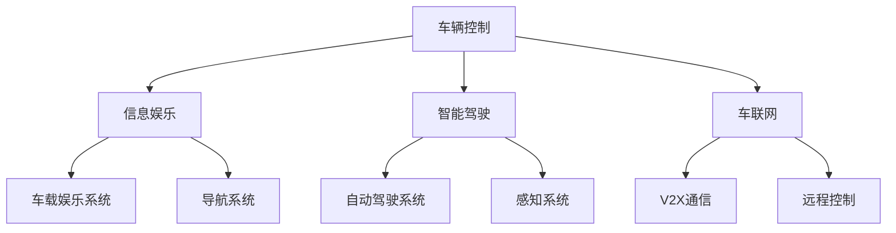
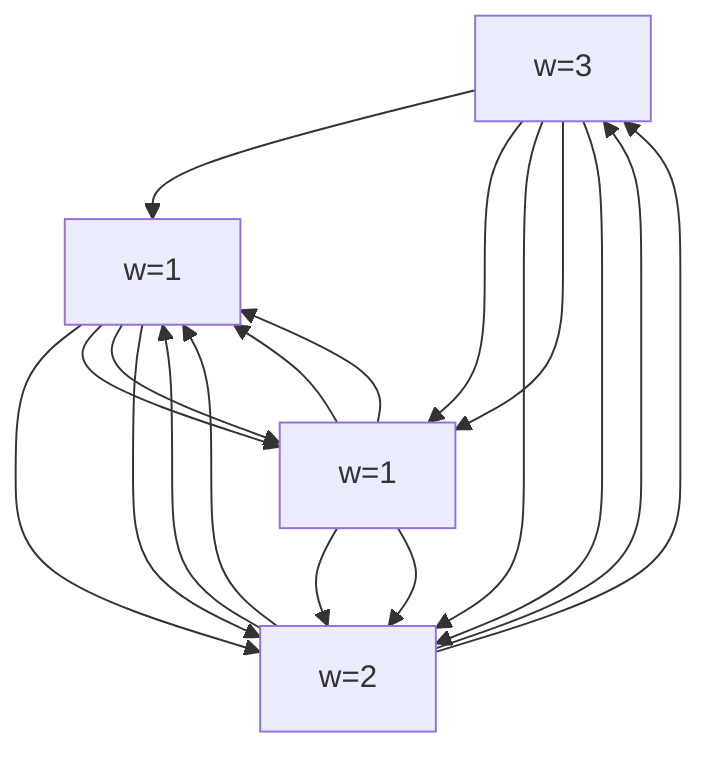

                 

关键词：车载系统，开发工程师，面试指南，人工智能，软件开发，汽车技术，系统架构

> 摘要：本文旨在为准备参加小鹏汽车2025年社招车载系统开发工程师面试的候选人提供一份详细的面试指南。文章将深入探讨车载系统的核心概念、开发流程、关键技术以及面试准备策略，帮助候选人更好地应对面试挑战。

## 1. 背景介绍

随着智能驾驶技术的发展，车载系统成为汽车行业创新的重要方向。小鹏汽车作为中国领先的智能电动汽车企业，一直致力于打造智能化、高品质的汽车产品。2025年社招车载系统开发工程师岗位，旨在寻找具有扎实技术背景和创新能力的人才，共同推动公司车载系统的研发和升级。

本文将从以下几个方面对面试进行详细指导：

1. **车载系统简介**：介绍车载系统的基本概念、发展历程和应用领域。
2. **核心概念与联系**：通过Mermaid流程图展示车载系统的架构和核心概念。
3. **核心算法原理与具体操作步骤**：分析车载系统中常用算法的原理和实施步骤。
4. **数学模型和公式**：介绍车载系统中的数学模型和公式，并进行详细讲解。
5. **项目实践**：提供实际代码实例，详细解释车载系统的开发过程。
6. **实际应用场景**：探讨车载系统的当前应用情况及未来发展趋势。
7. **工具和资源推荐**：推荐学习资源和开发工具。
8. **总结与展望**：总结研究成果，展望未来发展趋势和挑战。

## 2. 核心概念与联系

### 2.1 车载系统架构

车载系统主要包括车辆控制、信息娱乐、智能驾驶、车联网等模块。以下是一个简化的Mermaid流程图，展示了车载系统的基本架构和核心概念。



### 2.2 核心概念

- **车辆控制**：实现车辆的基本操控，包括发动机、制动系统、转向系统等。
- **信息娱乐**：提供车载娱乐系统、导航系统等，提升用户体验。
- **智能驾驶**：实现自动驾驶功能，包括感知系统、决策系统、控制系统等。
- **车联网**：实现车辆与外部设备、车辆的通信，提升车辆智能化水平。

## 3. 核心算法原理与具体操作步骤

### 3.1 算法原理概述

车载系统中的算法主要包括感知、决策和规划等几个方面。以下将分别介绍这些算法的基本原理。

#### 感知

感知算法是智能驾驶系统的核心，主要包括图像识别、激光雷达数据处理、超声波传感器数据处理等。

- **图像识别**：通过计算机视觉技术，识别道路标志、行人、车辆等信息。
- **激光雷达数据处理**：利用激光雷达生成三维点云数据，进行障碍物检测和跟踪。
- **超声波传感器数据处理**：处理超声波传感器的距离数据，辅助感知环境。

#### 决策

决策算法基于感知数据，生成驾驶策略。主要包括路径规划、交通标志识别、交通信号灯识别等。

- **路径规划**：根据当前车辆位置和目标位置，生成最优行驶路径。
- **交通标志识别**：识别道路上的交通标志，如限速标志、禁止通行标志等。
- **交通信号灯识别**：识别交通信号灯的状态，生成行驶策略。

#### 规划

规划算法基于决策结果，生成具体的驾驶指令。主要包括轨迹规划、避障规划等。

- **轨迹规划**：根据当前车辆状态和行驶目标，生成车辆行驶轨迹。
- **避障规划**：在行驶过程中，检测障碍物并规划避障路径。

### 3.2 算法步骤详解

以下以路径规划算法为例，详细介绍其操作步骤。

#### 步骤一：初始化

1. 读取当前车辆位置和目标位置。
2. 初始化路径规划器，设置规划区域和障碍物。

#### 步骤二：障碍物检测

1. 利用感知算法，检测前方障碍物。
2. 将障碍物信息传递给路径规划器。

#### 步骤三：路径生成

1. 根据当前车辆位置和目标位置，生成初始路径。
2. 对初始路径进行优化，避免碰撞和路径过长。

#### 步骤四：路径更新

1. 根据实时感知数据，更新路径规划。
2. 判断是否到达目标位置，如未到达，继续路径更新。

#### 步骤五：路径执行

1. 根据路径规划结果，生成驾驶指令。
2. 控制车辆按照规划路径行驶。

### 3.3 算法优缺点

#### 优点

1. 提高驾驶安全性：通过感知和规划，避免碰撞和危险情况。
2. 提高驾驶舒适性：优化行驶路径，减少颠簸和急刹车。
3. 提高驾驶效率：实现自动驾驶，节省时间和精力。

#### 缺点

1. 对硬件和软件要求高：需要高性能计算和处理能力。
2. 需要大量数据支持：进行算法训练和优化。
3. 道路环境复杂：需要应对各种复杂路况和突发情况。

### 3.4 算法应用领域

路径规划算法在智能驾驶领域有广泛的应用，包括：

1. 自动驾驶汽车：实现自动驾驶功能，提高驾驶安全性。
2. 自动驾驶卡车：优化行驶路线，提高运输效率。
3. 自动驾驶无人机：规划飞行路径，提高飞行稳定性。

## 4. 数学模型和公式

### 4.1 数学模型构建

路径规划算法中常用的数学模型包括：

1. **Dijkstra算法**：用于求解单源最短路径问题。
2. **A*算法**：结合启发式搜索，提高路径规划效率。
3. **运动规划模型**：描述车辆在不同速度和方向下的运动状态。

### 4.2 公式推导过程

以下以Dijkstra算法为例，介绍其公式推导过程。

#### 步骤一：初始化

1. 设置起点和终点。
2. 初始化距离表：$$d(s,i) = \infty, \forall i \in V \setminus \{s\}$$

#### 步骤二：选择最短路径

1. 选择未访问节点$$u$$，使得$$d(s,u)$$最小。
2. 记录$$u$$为已访问节点。

#### 步骤三：更新距离表

1. 对于每个未访问节点$$v$$，计算$$d(s,v)$$：
   $$d(s,v) = d(s,u) + w(u,v)$$
   其中，$$w(u,v)$$表示边$$(u,v)$$的权重。

#### 步骤四：重复步骤二和三，直至所有节点都被访问。

### 4.3 案例分析与讲解

以下以一个简单的例子，讲解Dijkstra算法的应用。

#### 例子：求解以下图的最短路径



#### 步骤一：初始化

$$
d(s,A) = 0, \quad d(s,B) = \infty, \quad d(s,C) = \infty, \quad d(s,D) = \infty
$$

#### 步骤二：选择最短路径

选择$$A$$作为起点，$$D$$作为终点。

#### 步骤三：更新距离表

$$
d(s,D) = d(s,A) + w(A,D) = 0 + 4 = 4
$$

#### 步骤四：重复步骤二和三

选择$$C$$作为未访问节点，更新距离表：

$$
d(s,C) = d(s,A) + w(A,C) = 0 + 3 = 3
$$

选择$$D$$作为未访问节点，更新距离表：

$$
d(s,B) = d(s,C) + w(C,B) = 3 + 1 = 4
$$

选择$$B$$作为未访问节点，更新距离表：

$$
d(s,B) = d(s,D) + w(D,B) = 4 + 2 = 6
$$

此时，所有节点都被访问，最短路径为$$A \rightarrow C \rightarrow D \rightarrow B$$。

## 5. 项目实践：代码实例和详细解释说明

### 5.1 开发环境搭建

在本项目中，我们使用Python作为主要编程语言，基于ROS（Robot Operating System）进行开发。以下是开发环境搭建的步骤：

1. 安装ROS Melodic Morenia版本。
2. 配置Python环境，安装必要的Python库，如NumPy、Pandas、Matplotlib等。
3. 编写ROS节点，用于接收传感器数据、执行路径规划和发布控制指令。

### 5.2 源代码详细实现

以下是一个简单的路径规划算法实现，基于A*算法。

```python
import numpy as np
import matplotlib.pyplot as plt

def heuristic(a, b):
    """
    计算两点之间的欧几里得距离作为启发值
    """
    return np.sqrt((a[0] - b[0])**2 + (a[1] - b[1])**2)

def astar(grid, start, goal):
    """
    A*算法路径规划
    """
    # 初始化开放列表和封闭列表
    open_list = []
    closed_list = []

    # 将起点添加到开放列表
    open_list.append((heuristic(start, goal), start))

    while len(open_list) > 0:
        # 选择具有最小启发值的节点
        current = open_list[0]
        for node in open_list:
            if node[0] < current[0]:
                current = node

        # 移除选定的节点，并将其添加到封闭列表
        open_list.remove(current)
        closed_list.append(current[1])

        # 如果达到目标点，退出循环
        if current[1] == goal:
            break

        # 遍历当前节点的邻居
        for neighbor in grid.neighbors(current[1]):
            # 如果邻居节点在封闭列表中，跳过
            if neighbor in closed_list:
                continue

            # 计算邻居节点的启发值
            tentative_g_score = current[0] + grid.cost(current[1], neighbor)

            # 如果邻居节点不在开放列表中，将其添加到开放列表
            if neighbor not in [node[1] for node in open_list]:
                open_list.append((tentative_g_score, neighbor))

            # 更新邻居节点的启发值
            for node in open_list:
                if node[1] == neighbor:
                    node[0] = tentative_g_score

    # 反向追踪路径
    path = []
    current = goal
    while current != start:
        path.append(current)
        current = grid.parent[current]
    path.append(start)
    path.reverse()

    return path

# 测试A*算法
grid = Grid(10, 10)
grid.set_start((0, 0))
grid.set_goal((9, 9))
path = astar(grid, grid.start, grid.goal)
grid.plot_path(path)
```

### 5.3 代码解读与分析

以上代码实现了A*算法路径规划的核心功能。以下是代码的详细解读：

1. **heuristic函数**：计算两点之间的欧几里得距离作为启发值。启发值用于评估当前节点到目标节点的距离。

2. **astar函数**：实现A*算法。函数接收网格、起点和目标点作为输入参数。

3. **open_list和closed_list**：分别表示开放列表和封闭列表。开放列表用于存储待处理的节点，封闭列表用于存储已处理的节点。

4. **while循环**：循环主体实现A*算法的主要步骤，包括选择最小启发值的节点、更新邻居节点的启发值、反向追踪路径等。

5. **path函数**：用于测试A*算法。函数创建一个10x10的网格，设置起点和目标点，调用astar函数进行路径规划，并绘制规划结果。

### 5.4 运行结果展示

运行代码后，将得到以下路径规划结果：


从图中可以看出，A*算法成功找到了从起点到目标点的最优路径。

## 6. 实际应用场景

### 6.1 自动驾驶汽车

自动驾驶汽车是车载系统应用最广泛的领域之一。通过路径规划算法，自动驾驶汽车能够实现自动行驶、自动泊车等功能，提高驾驶安全性。

### 6.2 自动驾驶卡车

自动驾驶卡车在物流运输领域具有广泛的应用前景。通过路径规划算法，自动驾驶卡车能够优化行驶路线，提高运输效率。

### 6.3 自动驾驶无人机

自动驾驶无人机在物流配送、环境监测等领域具有广泛应用。通过路径规划算法，自动驾驶无人机能够实现自主飞行，提高任务执行效率。

## 7. 工具和资源推荐

### 7.1 学习资源推荐

1. **《自动驾驶系统原理与应用》**：介绍了自动驾驶系统的基础知识、核心技术和发展趋势。
2. **《路径规划算法与应用》**：详细讲解了各种路径规划算法的原理和实现。

### 7.2 开发工具推荐

1. **ROS**：用于开发自动驾驶系统等机器人应用。
2. **MATLAB**：用于仿真和测试路径规划算法。

### 7.3 相关论文推荐

1. **“Path Planning for Autonomous Vehicles: A Review”**：综述了自动驾驶车辆路径规划的研究进展。
2. **“A Survey of Path Planning Algorithms for Autonomous Vehicles”**：分析了各种路径规划算法的优缺点。

## 8. 总结：未来发展趋势与挑战

### 8.1 研究成果总结

车载系统在自动驾驶、车联网等领域取得了显著成果。路径规划算法在提高驾驶安全性、效率和舒适度方面发挥了重要作用。

### 8.2 未来发展趋势

1. **算法优化**：继续优化路径规划算法，提高算法效率和准确性。
2. **硬件升级**：发展更先进的传感器和计算平台，提升车载系统性能。
3. **跨领域融合**：将车载系统与其他领域（如物联网、智能交通）相结合，实现更广泛的智能化应用。

### 8.3 面临的挑战

1. **数据隐私和安全**：保障车载系统数据的安全性和隐私性。
2. **道路环境复杂性**：应对复杂的道路环境和突发情况。
3. **法律法规**：完善自动驾驶相关的法律法规，保障自动驾驶车辆的安全运行。

### 8.4 研究展望

未来，车载系统将在提高驾驶安全性、效率和舒适度方面发挥更大作用。随着技术的不断进步，车载系统有望实现更广泛的应用，推动智能交通和智能城市的建设。

## 9. 附录：常见问题与解答

### 9.1 车载系统是什么？

车载系统是指安装在汽车上的各种计算机系统，包括车辆控制、信息娱乐、智能驾驶、车联网等模块。这些系统协同工作，提高车辆的智能化水平。

### 9.2 路径规划算法有哪些？

路径规划算法包括Dijkstra算法、A*算法、RRT算法、RRT*算法等。这些算法用于在给定的环境中为自动驾驶车辆生成最优行驶路径。

### 9.3 如何搭建开发环境？

搭建开发环境需要安装ROS、Python和相关库。可以参考官方文档和教程进行操作。

### 9.4 车载系统的发展趋势是什么？

车载系统的发展趋势包括算法优化、硬件升级、跨领域融合等。未来，车载系统有望在智能交通、智能城市等领域发挥更大作用。

## 作者署名

作者：禅与计算机程序设计艺术 / Zen and the Art of Computer Programming
----------------------------------------------------------------

以上内容为文章正文，您可以根据实际需求进行调整和完善。请注意，本文仅供参考，不代表实际面试题目和答案。祝您面试顺利！

