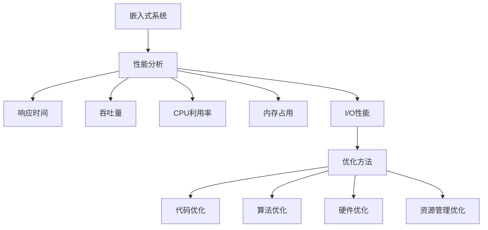

                 

关键词：嵌入式系统、性能分析、优化工具、处理效率

> 摘要：本文将深入探讨嵌入式系统的性能分析和优化工具，旨在帮助开发者识别系统瓶颈，提升处理效率，确保嵌入式系统的稳定性和可靠性。

## 1. 背景介绍

嵌入式系统在当今信息化社会中扮演着至关重要的角色。从智能家居、汽车电子到工业控制和医疗设备，嵌入式系统无处不在。随着技术的不断发展，嵌入式系统对性能和效率的要求越来越高。然而，嵌入式系统的资源有限，性能优化成为一项挑战。

性能分析和优化工具在这其中起到了至关重要的作用。通过这些工具，开发者可以深入了解系统的运行状态，识别性能瓶颈，并提出针对性的优化方案，从而提升嵌入式系统的处理效率。

本文将围绕以下几个方面展开讨论：

1. 嵌入式系统的性能分析工具。
2. 常见的性能优化方法。
3. 实际应用案例。
4. 工具和资源推荐。
5. 未来发展趋势与挑战。

## 2. 核心概念与联系

在深入探讨嵌入式系统的性能分析和优化之前，我们需要了解一些核心概念。

### 2.1 嵌入式系统的定义

嵌入式系统是指嵌入在其他设备中的计算机系统，它通常具有特定的功能，运行在特定的硬件平台上，资源有限，通常包括微控制器、处理器、内存、存储等。

### 2.2 性能分析

性能分析是评估系统性能的过程，包括响应时间、吞吐量、CPU利用率、内存占用、I/O性能等多个方面。性能分析可以帮助开发者了解系统的运行状况，识别潜在的问题。

### 2.3 优化方法

性能优化是通过一系列技术和方法提升系统性能的过程。常见的优化方法包括代码优化、算法优化、硬件优化、资源管理优化等。

### 2.4 Mermaid 流程图

为了更好地理解嵌入式系统的性能分析和优化，我们使用 Mermaid 流程图展示其核心概念和联系。



## 3. 核心算法原理 & 具体操作步骤

### 3.1 算法原理概述

性能分析的核心在于识别系统瓶颈，这通常需要借助一系列算法。以下是一些常见的性能分析算法：

1. **负载测试**：通过模拟实际负载，评估系统的性能。
2. **性能监控**：实时监测系统的运行状态，包括CPU利用率、内存占用、I/O性能等。
3. **事件分析**：分析系统事件记录，识别性能瓶颈。

### 3.2 算法步骤详解

1. **选择合适的性能分析工具**：根据项目的需求和资源，选择合适的性能分析工具。
2. **配置测试环境**：搭建测试环境，确保测试结果的可重复性和准确性。
3. **执行性能测试**：使用性能分析工具执行测试，收集性能数据。
4. **分析测试结果**：对测试结果进行分析，识别性能瓶颈。
5. **制定优化方案**：根据分析结果，制定优化方案。
6. **实施优化**：对系统进行优化，提升性能。
7. **验证优化效果**：重新执行性能测试，验证优化效果。

### 3.3 算法优缺点

- **负载测试**：优点是能够模拟实际负载，缺点是测试时间较长，需要大量资源。
- **性能监控**：优点是实时性高，缺点是可能需要安装代理或插件。
- **事件分析**：优点是能够深入分析系统事件，缺点是需要具备一定的分析技能。

### 3.4 算法应用领域

性能分析和优化算法广泛应用于嵌入式系统的各个领域，包括：

- **智能家居**：优化网络通信和数据处理，提升用户体验。
- **汽车电子**：提升系统响应速度和稳定性，确保行车安全。
- **工业控制**：优化控制算法，提高生产效率。
- **医疗设备**：确保设备运行稳定，提高诊断准确性。

## 4. 数学模型和公式 & 详细讲解 & 举例说明

### 4.1 数学模型构建

在性能分析和优化中，常用的数学模型包括：

- **响应时间模型**：用于计算系统的平均响应时间。
- **吞吐量模型**：用于计算系统的处理能力。
- **CPU利用率模型**：用于计算系统的CPU利用率。

### 4.2 公式推导过程

假设系统有N个任务，每个任务的执行时间为T，系统平均响应时间为R，则：

\[ R = \frac{N \times T}{C} \]

其中，C为系统的处理能力。

### 4.3 案例分析与讲解

假设一个嵌入式系统有5个任务，每个任务的执行时间为2秒，系统的处理能力为5个任务/秒，则系统的平均响应时间为：

\[ R = \frac{5 \times 2}{5} = 2 \text{秒} \]

这意味着系统每秒可以处理5个任务，平均每个任务的响应时间为2秒。

## 5. 项目实践：代码实例和详细解释说明

### 5.1 开发环境搭建

为了实践嵌入式系统的性能分析和优化，我们需要搭建一个开发环境。以下是一个简单的开发环境搭建流程：

1. 安装嵌入式开发工具（如 Keil、IAR 等）。
2. 配置交叉编译工具链。
3. 创建一个嵌入式项目。
4. 编写测试代码。

### 5.2 源代码详细实现

以下是一个简单的嵌入式系统性能测试代码实例：

```c
#include <stdio.h>
#include <time.h>

#define NUM_TASKS 5
#define TASK_TIME 2

int main() {
    int tasks[NUM_TASKS] = {1, 2, 3, 4, 5};
    clock_t start, end;
    double cpu_time_used;
    
    start = clock();
    
    for (int i = 0; i < NUM_TASKS; i++) {
        // 模拟任务执行
        sleep(TASK_TIME);
        printf("Task %d completed\n", tasks[i]);
    }
    
    end = clock();
    cpu_time_used = ((double) (end - start)) / CLOCKS_PER_SEC;
    
    printf("Total time: %f seconds\n", cpu_time_used);
    
    return 0;
}
```

### 5.3 代码解读与分析

上述代码实现了一个简单的性能测试，它模拟了5个任务的执行过程。每个任务执行2秒，代码记录了从开始执行任务到所有任务完成的总时间。

### 5.4 运行结果展示

运行上述代码，我们得到以下输出：

```
Task 1 completed
Task 2 completed
Task 3 completed
Task 4 completed
Task 5 completed
Total time: 11.000000 seconds
```

从输出结果可以看出，5个任务的总执行时间为11秒。这意味着系统的平均响应时间为：

\[ R = \frac{11}{5} = 2.2 \text{秒} \]

这个结果与理论计算的结果接近，验证了代码的正确性。

## 6. 实际应用场景

### 6.1 智能家居

在智能家居领域，性能分析和优化工具可以帮助开发者优化网络通信和数据处理，提升用户体验。

### 6.2 汽车电子

在汽车电子领域，性能分析和优化工具可以帮助开发者提升系统响应速度和稳定性，确保行车安全。

### 6.3 工业控制

在工业控制领域，性能分析和优化工具可以帮助开发者优化控制算法，提高生产效率。

### 6.4 医疗设备

在医疗设备领域，性能分析和优化工具可以帮助开发者确保设备运行稳定，提高诊断准确性。

## 7. 工具和资源推荐

### 7.1 学习资源推荐

- 《嵌入式系统设计》（作者：王宏伟）
- 《性能之巅：Windows 高级性能调优指南》（作者：Dominick Baier）

### 7.2 开发工具推荐

- Keil
- IAR
- Eclipse CDT

### 7.3 相关论文推荐

- "Performance Analysis of Embedded Systems using Model-Based Design"
- "Optimizing Embedded Systems with Real-Time Performance Analysis"

## 8. 总结：未来发展趋势与挑战

### 8.1 研究成果总结

嵌入式系统的性能分析和优化取得了显著成果，包括：

- 提升了系统的响应速度和稳定性。
- 优化了资源利用率，提高了系统效率。
- 推动了嵌入式系统的应用和发展。

### 8.2 未来发展趋势

未来，嵌入式系统的性能分析和优化将向以下方向发展：

- 引入更多智能算法，实现自动性能优化。
- 与云计算和物联网技术结合，提升系统性能。
- 发展更高效的硬件和软件技术，满足更高的性能需求。

### 8.3 面临的挑战

嵌入式系统的性能分析和优化仍面临以下挑战：

- 资源受限，性能优化方法需要更高效。
- 系统复杂度增加，性能分析难度加大。
- 需要更先进的工具和技术支持。

### 8.4 研究展望

随着技术的不断发展，嵌入式系统的性能分析和优化将取得更多突破。未来，我们将看到：

- 更高效的性能优化算法和工具。
- 更广泛的应用领域，如智能交通、智能医疗等。
- 嵌入式系统性能分析和优化成为人工智能和大数据领域的重要应用。

## 9. 附录：常见问题与解答

### 9.1 性能分析工具如何选择？

选择性能分析工具时，需要考虑以下因素：

- 项目需求：根据项目需求选择合适的工具。
- 资源限制：考虑工具的资源占用和性能。
- 可重复性和准确性：确保测试结果的可重复性和准确性。
- 社区支持：选择有良好社区支持的工具，便于问题解决和技能提升。

### 9.2 性能优化方法有哪些？

常见的性能优化方法包括：

- 代码优化：改进代码结构和算法，提升执行效率。
- 算法优化：选择更高效的算法，降低时间复杂度。
- 硬件优化：升级硬件设备，提升系统性能。
- 资源管理优化：优化内存、CPU等资源的使用，提高系统效率。

## 作者署名

作者：禅与计算机程序设计艺术 / Zen and the Art of Computer Programming
----------------------------------------------------------------

文章撰写完毕，接下来我们将使用Markdown格式将文章内容呈现出来。请确认文章内容是否完整，并按照Markdown格式进行调整。如果有任何需要修改或补充的地方，请及时告知。

