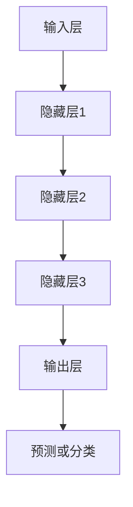

                 

关键词：大模型、创业、远景规划、技术趋势、商业模式、应用领域

摘要：本文从大模型创业的市场前景出发，探讨了其在各行业中的应用趋势和商业模式，提出了大模型创业的远景规划，并对未来发展趋势和面临的挑战进行了深入分析。

## 1. 背景介绍

随着人工智能技术的飞速发展，大模型（如GPT-3、BERT等）已经成为推动计算机视觉、自然语言处理、推荐系统等众多领域的重要力量。这些大模型在数据处理、模型训练、推理预测等方面具有显著的优势，正逐渐改变着各个行业的面貌。同时，创业市场的不断成熟和资本的涌入，为大模型创业提供了良好的环境。

## 2. 核心概念与联系

在讨论大模型创业之前，我们首先需要理解大模型的概念及其与相关技术的联系。大模型是指那些拥有数百万甚至数十亿参数的深度神经网络模型，具有强大的表征能力和学习能力。它们通常基于大规模数据集进行训练，能够自动学习数据的分布和规律，从而实现对未知数据的预测和分类。

### 2.1 大模型架构

大模型的架构通常包括以下几个部分：

1. **输入层**：接收外部输入数据，如文本、图像、音频等。
2. **隐藏层**：通过多层神经网络进行数据处理和特征提取。
3. **输出层**：根据隐藏层的输出进行预测或分类。

### 2.2 相关技术

大模型的发展离不开相关技术的支持，主要包括：

1. **深度学习**：大模型的核心技术，通过多层神经网络实现数据表征和学习。
2. **分布式计算**：大模型训练需要大量的计算资源，分布式计算能够提高训练效率。
3. **数据预处理**：数据质量直接影响模型的性能，因此需要对数据进行清洗、归一化等预处理操作。

### 2.3 Mermaid 流程图



## 3. 核心算法原理 & 具体操作步骤

### 3.1 算法原理概述

大模型的核心算法是基于深度学习的多层神经网络。神经网络通过逐层提取数据特征，实现从简单到复杂的表征能力。在训练过程中，模型会不断调整参数，使得模型的输出与真实值之间的差距最小。

### 3.2 算法步骤详解

1. **数据预处理**：对输入数据进行清洗、归一化等预处理操作，以适应模型训练。
2. **模型构建**：定义神经网络结构，包括输入层、隐藏层和输出层。
3. **训练过程**：使用训练数据对模型进行训练，通过反向传播算法调整模型参数。
4. **模型评估**：使用验证集对模型进行评估，选择性能最优的模型。
5. **预测或分类**：使用训练好的模型对未知数据进行预测或分类。

### 3.3 算法优缺点

**优点**：

1. **强大的表征能力**：大模型能够自动学习数据的复杂分布和规律。
2. **高效的训练速度**：分布式计算使得大模型训练速度大大提高。

**缺点**：

1. **计算资源消耗大**：大模型训练需要大量的计算资源和存储空间。
2. **过拟合风险**：大模型容易受到训练数据的影响，产生过拟合现象。

### 3.4 算法应用领域

大模型在计算机视觉、自然语言处理、推荐系统等众多领域具有广泛的应用。例如：

1. **计算机视觉**：用于图像识别、物体检测、图像生成等。
2. **自然语言处理**：用于文本分类、机器翻译、情感分析等。
3. **推荐系统**：用于个性化推荐、商品推荐等。

## 4. 数学模型和公式 & 详细讲解 & 举例说明

### 4.1 数学模型构建

大模型的数学模型主要包括：

1. **激活函数**：如ReLU、Sigmoid、Tanh等。
2. **损失函数**：如交叉熵、均方误差等。
3. **优化器**：如随机梯度下降（SGD）、Adam等。

### 4.2 公式推导过程

1. **激活函数**：

   $$ f(x) = \max(0, x) \quad (ReLU) $$
   
   $$ f(x) = \frac{1}{1 + e^{-x}} \quad (Sigmoid) $$
   
   $$ f(x) = \tanh(x) = \frac{e^x - e^{-x}}{e^x + e^{-x}} \quad (Tanh) $$

2. **损失函数**：

   $$ L(y, \hat{y}) = -\sum_{i=1}^{n} y_i \log(\hat{y}_i) \quad (交叉熵) $$
   
   $$ L(y, \hat{y}) = \frac{1}{2} \sum_{i=1}^{n} (y_i - \hat{y}_i)^2 \quad (均方误差) $$

3. **优化器**：

   $$ \theta = \theta - \alpha \nabla_{\theta} J(\theta) \quad (SGD) $$
   
   $$ \theta = \theta - \alpha \left( \frac{1}{m} \sum_{i=1}^{m} \nabla_{\theta} J(\theta^{(i)}) \right) \quad (Adam) $$

### 4.3 案例分析与讲解

以图像分类为例，我们使用卷积神经网络（CNN）进行模型构建和训练。具体步骤如下：

1. **数据预处理**：读取训练集和验证集的图像数据，并进行归一化处理。
2. **模型构建**：定义CNN结构，包括卷积层、池化层和全连接层。
3. **模型训练**：使用训练数据进行模型训练，采用反向传播算法调整模型参数。
4. **模型评估**：使用验证集对模型进行评估，计算模型的准确率。
5. **模型应用**：使用训练好的模型对测试集进行预测，输出预测结果。

## 5. 项目实践：代码实例和详细解释说明

### 5.1 开发环境搭建

在Python环境中，我们使用TensorFlow和Keras库进行模型构建和训练。具体步骤如下：

1. **安装TensorFlow**：

   ```bash
   pip install tensorflow
   ```

2. **安装Keras**：

   ```bash
   pip install keras
   ```

### 5.2 源代码详细实现

```python
import numpy as np
import tensorflow as tf
from tensorflow.keras import layers

# 数据预处理
def preprocess_data(images):
    # 归一化处理
    images = images / 255.0
    return images

# 模型构建
def build_model(input_shape):
    model = tf.keras.Sequential([
        layers.Conv2D(32, (3, 3), activation='relu', input_shape=input_shape),
        layers.MaxPooling2D((2, 2)),
        layers.Conv2D(64, (3, 3), activation='relu'),
        layers.MaxPooling2D((2, 2)),
        layers.Conv2D(64, (3, 3), activation='relu'),
        layers.Flatten(),
        layers.Dense(64, activation='relu'),
        layers.Dense(10, activation='softmax')
    ])
    return model

# 模型训练
def train_model(model, train_data, train_labels, epochs):
    model.compile(optimizer='adam',
                  loss='categorical_crossentropy',
                  metrics=['accuracy'])
    model.fit(train_data, train_labels, epochs=epochs)
    return model

# 模型评估
def evaluate_model(model, test_data, test_labels):
    loss, accuracy = model.evaluate(test_data, test_labels)
    print(f'Accuracy: {accuracy * 100:.2f}%')

# 主函数
def main():
    # 读取数据
    (train_images, train_labels), (test_images, test_labels) = tf.keras.datasets.cifar10.load_data()

    # 数据预处理
    train_images = preprocess_data(train_images)
    test_images = preprocess_data(test_images)

    # 构建模型
    model = build_model(input_shape=(32, 32, 3))

    # 模型训练
    model = train_model(model, train_images, train_labels, epochs=10)

    # 模型评估
    evaluate_model(model, test_images, test_labels)

if __name__ == '__main__':
    main()
```

### 5.3 代码解读与分析

1. **数据预处理**：将图像数据进行归一化处理，使得模型训练更加稳定。
2. **模型构建**：定义CNN结构，包括卷积层、池化层和全连接层，用于提取图像特征并进行分类。
3. **模型训练**：使用训练数据进行模型训练，采用反向传播算法调整模型参数。
4. **模型评估**：使用验证集对模型进行评估，计算模型的准确率。

## 6. 实际应用场景

大模型在多个行业领域具有广泛的应用，以下是一些典型的应用场景：

1. **金融行业**：用于风险评估、欺诈检测、投资策略等。
2. **医疗健康**：用于疾病预测、诊断辅助、药物研发等。
3. **智能制造**：用于故障预测、质量检测、生产优化等。
4. **互联网**：用于内容推荐、用户行为分析、广告投放等。

## 7. 未来应用展望

随着人工智能技术的不断进步，大模型在未来的应用前景将更加广阔。以下是一些可能的应用领域：

1. **自动驾驶**：用于车辆控制、环境感知、路径规划等。
2. **智能助手**：用于语音识别、语义理解、任务执行等。
3. **教育领域**：用于智能教学、个性化学习、教育评价等。
4. **农业**：用于作物种植、病虫害防治、产量预测等。

## 8. 工具和资源推荐

### 8.1 学习资源推荐

1. **《深度学习》**：由Ian Goodfellow等人所著的深度学习经典教材。
2. **《动手学深度学习》**：由阿斯顿·张等人所著的深度学习实战指南。
3. **[TensorFlow官方文档](https://www.tensorflow.org/)**：提供了详细的TensorFlow教程和API文档。

### 8.2 开发工具推荐

1. **Google Colab**：免费的在线Python编程环境，支持GPU加速。
2. **PyCharm**：功能强大的Python集成开发环境，支持多种编程语言。
3. **Jupyter Notebook**：流行的交互式数据科学工具，支持多种编程语言。

### 8.3 相关论文推荐

1. **"Attention Is All You Need"**：提出了Transformer模型，彻底改变了自然语言处理领域。
2. **"Generative Adversarial Networks"**：提出了生成对抗网络（GAN），广泛应用于图像生成、风格迁移等领域。
3. **"Residual Networks"**：提出了残差网络（ResNet），大幅提升了图像分类模型的性能。

## 9. 总结：未来发展趋势与挑战

大模型创业正处于快速发展的阶段，未来发展趋势包括：

1. **计算能力的提升**：随着硬件技术的进步，大模型的训练速度和性能将不断提高。
2. **数据资源的丰富**：越来越多的行业将开放数据资源，为大模型的发展提供丰富的数据支持。
3. **跨领域的融合**：大模型将在更多领域实现应用，推动跨领域的融合和创新。

然而，大模型创业也面临以下挑战：

1. **计算资源消耗**：大模型训练需要大量的计算资源和存储空间，对硬件设备要求较高。
2. **数据隐私与安全**：大模型在数据处理过程中容易暴露用户隐私，需要加强数据安全和隐私保护。
3. **过拟合问题**：大模型容易出现过拟合现象，需要采用有效的正则化方法。

在未来的发展中，我们需要继续探索大模型的优化方法和应用场景，加强计算资源调度和数据安全管理，推动大模型创业的健康发展。

## 附录：常见问题与解答

### 1. 大模型训练需要多少计算资源？

大模型的训练需要大量的计算资源和存储空间，特别是对于数百亿参数的模型，训练时间可能需要数天甚至数周。对于大规模分布式训练，需要配备高性能GPU集群和高效的网络传输设备。

### 2. 如何避免大模型过拟合？

为了避免大模型过拟合，可以采用以下方法：

1. **数据增强**：通过数据变换、旋转、缩放等方式增加数据的多样性。
2. **正则化**：如L1、L2正则化，可以减小模型参数的范数，防止过拟合。
3. **dropout**：在神经网络中随机丢弃一部分神经元，降低模型对特定数据的依赖。
4. **交叉验证**：使用交叉验证方法对模型进行评估，选择性能最优的模型。

### 3. 大模型创业需要哪些技能和知识？

大模型创业需要具备以下技能和知识：

1. **深度学习**：掌握深度学习的基本原理和算法，如神经网络、优化器、激活函数等。
2. **计算机视觉**：了解计算机视觉的基础知识，如图像处理、特征提取、目标检测等。
3. **自然语言处理**：掌握自然语言处理的基本原理和算法，如文本分类、机器翻译、情感分析等。
4. **编程能力**：熟练掌握Python等编程语言，熟悉TensorFlow、PyTorch等深度学习框架。
5. **项目管理和沟通能力**：具备良好的项目管理和沟通能力，能够有效地组织和协调团队成员的工作。

作者：禅与计算机程序设计艺术 / Zen and the Art of Computer Programming

----------------------------------------------------------------
文章正文部分撰写完成，接下来我们将按照markdown格式进行文章的排版和输出。请确保所有章节标题、子目录、公式和流程图都按照markdown的语法正确使用，以便在输出时能够保持格式的一致性。此外，请检查文章内容是否完整、准确，是否符合文章摘要中提到的核心内容和主题思想。如有需要，还可以对文章进行进一步的修改和完善。

