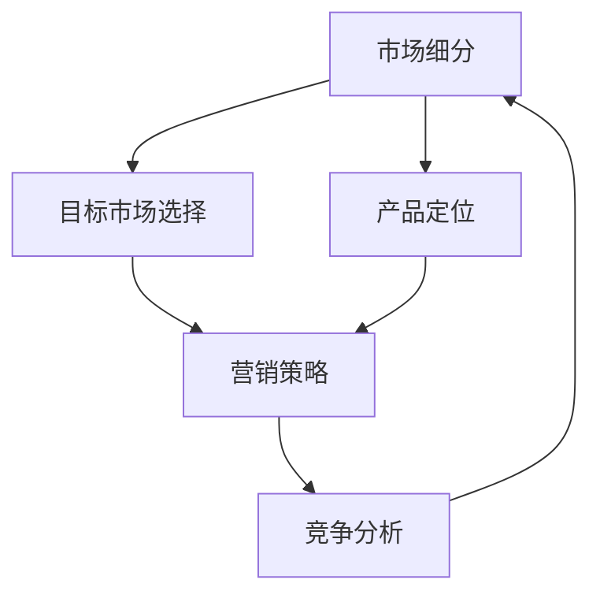

                 

在当今快速变化和竞争激烈的商业环境中，创业者面临着前所未有的挑战。为了在市场上脱颖而出，他们需要掌握一系列市场策略，这些策略不仅是商业成功的关键，也是他们在技术创新和市场竞争中立足的基石。本文将深入探讨市场策略的核心概念、算法原理、数学模型以及实际应用，旨在为创业者提供实用的指导，帮助他们制定和实施有效的市场策略。

## 关键词

市场策略、创业、制胜关键、算法原理、数学模型、实际应用。

## 摘要

本文首先介绍市场策略的重要性，然后详细解析其核心概念和算法原理，接着探讨市场策略中的数学模型及其应用，并通过具体项目实例进行代码解读。最后，文章将讨论市场策略的实际应用场景，并展望未来的发展趋势和面临的挑战。

### 1. 背景介绍

市场策略是一种系统性的规划过程，旨在通过市场研究和分析，确定企业在市场上的定位、目标、竞争优势以及资源分配。对于创业者来说，市场策略不仅仅是商业计划的一部分，更是他们实现企业愿景、创造价值的路径。市场策略的制定和执行涉及多个方面，包括市场调研、竞争对手分析、目标客户识别、产品定位、营销策略等。

市场策略的重要性体现在以下几个方面：

1. **指导企业行为**：市场策略为企业提供了明确的行动方向，帮助企业在不确定的市场环境中做出快速而明智的决策。
2. **资源优化**：通过有效的市场策略，企业可以优化资源配置，最大限度地提高效率和利润。
3. **竞争优势**：市场策略有助于企业识别和利用自身的竞争优势，形成差异化，从而在激烈的市场竞争中脱颖而出。
4. **风险规避**：市场策略可以预见潜在的市场风险，并制定相应的应对措施，降低企业运营风险。

随着互联网、大数据、人工智能等技术的不断发展，市场策略也在不断演进。创业者需要紧跟市场趋势，运用先进的技术手段，制定符合市场需求的策略。此外，市场策略的制定需要结合企业的实际情况，灵活调整和优化，以应对快速变化的市场环境。

### 2. 核心概念与联系

为了更好地理解市场策略，我们需要明确其中的核心概念和它们之间的联系。以下是市场策略中的几个关键概念及其相互关系：

#### 2.1 市场细分

市场细分是将整个市场划分为具有相似需求和特征的子市场的过程。市场细分可以帮助企业识别目标客户群体，并制定更有针对性的营销策略。市场细分的标准可以包括地理、人口、心理和行为等各个方面。

#### 2.2 目标市场选择

在市场细分的基础上，目标市场选择是企业确定将资源和精力投入到哪个或哪些市场细分的过程中。目标市场选择需要考虑市场细分的大小、增长潜力、竞争状况以及企业的资源和能力。

#### 2.3 产品定位

产品定位是企业确定其产品在市场上的独特价值和竞争优势的过程。产品定位需要根据目标市场的需求和竞争对手的情况，明确产品的特点、功能、品牌形象等。

#### 2.4 营销策略

营销策略是企业为实现产品定位和目标市场选择而制定的一系列行动方案。营销策略包括产品策略、价格策略、渠道策略和促销策略等。

#### 2.5 竞争分析

竞争分析是企业了解市场竞争环境、识别竞争对手的优势和劣势的过程。竞争分析有助于企业制定有效的市场策略，避免与竞争对手在低端竞争，而是通过差异化策略获得竞争优势。

下面是市场策略的核心概念和相互关系的 Mermaid 流程图：



通过上述流程图，我们可以看到市场策略的各个环节是如何相互关联和影响的。市场细分是基础，它决定了目标市场选择的方向；目标市场选择和产品定位则为企业提供了明确的市场定位；营销策略和竞争分析则是实现市场策略的具体手段。

### 3. 核心算法原理 & 具体操作步骤

市场策略的制定和实施离不开科学的方法和算法支持。以下将介绍市场策略中的核心算法原理以及具体操作步骤。

#### 3.1 算法原理概述

市场策略的核心算法可以概括为以下几个步骤：

1. **市场调研**：通过问卷调查、访谈、焦点小组讨论等方式收集市场数据。
2. **数据清洗**：对收集到的数据进行清洗和整理，确保数据的质量和一致性。
3. **市场细分**：使用聚类算法或分类算法对市场进行细分，识别具有相似需求的客户群体。
4. **目标市场选择**：根据市场细分结果，结合企业的资源和能力，选择最具有潜力的目标市场。
5. **产品定位**：分析目标市场的需求和竞争对手情况，确定产品的特点和竞争优势。
6. **营销策略制定**：根据产品定位和目标市场，制定相应的营销策略。
7. **竞争分析**：通过数据分析和市场监控，了解竞争对手的动态，调整和优化市场策略。

#### 3.2 算法步骤详解

1. **市场调研**
   - 设计调研问卷：包括基本信息、购买行为、需求偏好等。
   - 收集数据：通过线上问卷、线下访谈等方式收集数据。
   - 数据清洗：去除无效数据、重复数据和错误数据，保证数据质量。

2. **市场细分**
   - 选择聚类算法：如K-means、层次聚类等。
   - 确定聚类中心：根据相似度度量，选择市场细分的最优聚类中心。
   - 分配客户群体：将客户数据分配到不同的市场细分中。

3. **目标市场选择**
   - 分析市场细分结果：评估每个市场细分的大小、增长潜力和竞争状况。
   - 选择目标市场：根据企业的资源和能力，选择最具有潜力的市场细分。

4. **产品定位**
   - 确定产品特点：根据目标市场的需求，明确产品的功能、设计、品牌形象等。
   - 竞争对手分析：了解竞争对手的产品特点和市场表现，确定竞争优势。

5. **营销策略制定**
   - 产品策略：确定产品的定价、功能、包装等。
   - 价格策略：根据成本、市场需求和竞争对手情况，制定合理的价格策略。
   - 渠道策略：选择合适的销售渠道，如线上、线下、代理商等。
   - 促销策略：通过广告、促销活动、公关等方式吸引客户。

6. **竞争分析**
   - 数据收集：收集市场数据和竞争对手的动态。
   - 数据分析：使用统计分析和机器学习算法，分析竞争对手的行为和市场趋势。
   - 调整策略：根据分析结果，调整和优化市场策略。

#### 3.3 算法优缺点

市场策略算法具有以下优缺点：

- **优点**：
  - 提高决策效率：通过算法分析，快速识别市场机会和风险，提高决策效率。
  - 降低成本：通过市场细分和目标市场选择，减少不必要的市场投入。
  - 增强竞争力：通过竞争分析，了解竞争对手动态，制定有效的竞争策略。

- **缺点**：
  - 数据依赖性强：算法的性能依赖于市场数据的准确性和完整性。
  - 复杂度高：算法涉及多个步骤和多种技术，实施难度较大。
  - 难以应对快速变化的市场：市场环境变化快，算法需要不断更新和调整。

#### 3.4 算法应用领域

市场策略算法广泛应用于以下领域：

- **消费品行业**：通过市场细分和目标市场选择，制定有效的营销策略，提高市场份额。
- **服务业**：通过客户细分和需求分析，提供个性化的服务和解决方案。
- **金融行业**：通过风险分析和市场预测，制定投资策略和风险管理措施。
- **电子商务**：通过用户行为分析和推荐系统，提高用户满意度和转化率。

### 4. 数学模型和公式 & 详细讲解 & 举例说明

在市场策略的制定过程中，数学模型和公式扮演着至关重要的角色。以下将详细介绍市场策略中的几个关键数学模型和公式的构建、推导过程，并通过具体案例进行说明。

#### 4.1 数学模型构建

市场策略中的数学模型通常包括以下几种：

1. **市场细分模型**：用于将整个市场划分为具有相似需求的子市场。
2. **目标市场选择模型**：用于评估不同市场细分的价值和潜力。
3. **产品定位模型**：用于确定产品在市场中的竞争优势和差异化策略。
4. **营销策略模型**：用于制定和优化营销组合策略，包括产品策略、价格策略、渠道策略和促销策略。

#### 4.2 公式推导过程

以下是一个简单的市场细分模型的推导过程：

假设市场由N个客户组成，每个客户有m个属性特征。我们可以使用K-means聚类算法进行市场细分，将市场划分为K个子市场。目标是最小化子市场内客户属性特征的差异，最大化子市场之间的差异。

步骤1：初始化聚类中心。从N个客户中随机选择K个客户作为初始聚类中心。

步骤2：计算每个客户与聚类中心的距离。使用欧几里得距离度量客户与聚类中心的距离。

$$
d_{ij} = \sqrt{\sum_{i=1}^{m} (x_{ij} - \mu_{i})^2}
$$

其中，$x_{ij}$表示第i个客户在第j个属性上的特征值，$\mu_{i}$表示第i个聚类中心在第j个属性上的特征值。

步骤3：将每个客户分配到最近的聚类中心所代表的子市场。

步骤4：更新聚类中心。计算每个子市场内客户的平均值，作为新的聚类中心。

$$
\mu_{i} = \frac{1}{n_i} \sum_{j=1}^{n_i} x_{ij}
$$

其中，$n_i$表示第i个子市场内的客户数量。

步骤5：重复步骤2到步骤4，直到聚类中心不再发生变化。

通过上述步骤，我们可以构建一个市场细分模型，将整个市场划分为K个子市场。

#### 4.3 案例分析与讲解

以下是一个市场细分和目标市场选择的案例：

假设一个企业销售多种类型的电子产品，市场调研数据显示有5000个潜在客户，每个客户有年龄、收入、购买历史等属性。企业希望使用市场细分模型将市场划分为三个子市场，并选择最有潜力的子市场作为目标市场。

步骤1：数据收集。收集5000个客户的年龄、收入和购买历史数据。

步骤2：数据清洗。去除无效数据和重复数据，保证数据质量。

步骤3：使用K-means聚类算法进行市场细分。选择K=3，初始化三个聚类中心。

步骤4：计算每个客户与聚类中心的距离，并将客户分配到最近的聚类中心所代表的子市场。

步骤5：更新聚类中心，计算每个子市场内客户的平均值，作为新的聚类中心。

步骤6：重复步骤4和步骤5，直到聚类中心不再发生变化。

步骤7：分析子市场特征。根据三个子市场的平均年龄、收入和购买历史，分析每个子市场的特点和需求。

步骤8：选择目标市场。根据子市场的特点和需求，选择最有潜力的子市场作为目标市场。

通过上述步骤，企业可以有效地进行市场细分和目标市场选择，制定针对性的营销策略。

### 5. 项目实践：代码实例和详细解释说明

为了更好地理解市场策略的算法原理和数学模型，我们通过一个实际项目实例来演示整个市场策略的制定和实施过程。以下是该项目的基本信息：

项目名称：智能电子产品市场细分与目标市场选择

项目描述：一家智能电子产品公司希望通过市场细分和目标市场选择，制定有效的营销策略，提高市场份额和销售业绩。

#### 5.1 开发环境搭建

为了实现市场策略的算法和数学模型，我们需要搭建一个合适的开发环境。以下是所需的技术栈和开发环境：

1. **编程语言**：Python
2. **数据分析库**：Pandas、NumPy
3. **机器学习库**：scikit-learn
4. **可视化库**：Matplotlib、Seaborn

在本地计算机上，我们使用Python虚拟环境来管理依赖库。以下是安装和配置Python虚拟环境的步骤：

```bash
# 安装Python虚拟环境
pip install virtualenv

# 创建Python虚拟环境
virtualenv myenv

# 激活虚拟环境
source myenv/bin/activate

# 安装依赖库
pip install pandas numpy scikit-learn matplotlib seaborn
```

#### 5.2 源代码详细实现

以下是一个简单的市场策略项目的源代码实现，包括市场调研、数据清洗、市场细分、目标市场选择和营销策略制定等步骤。

```python
import pandas as pd
from sklearn.cluster import KMeans
import matplotlib.pyplot as plt
import seaborn as sns

# 5.2.1 数据收集与清洗
# 假设已经收集了5000个客户的年龄、收入和购买历史数据，存储为CSV文件
data = pd.read_csv('customer_data.csv')

# 检查数据质量
print(data.head())
print(data.describe())

# 去除无效数据和重复数据
data.drop_duplicates(inplace=True)
data.dropna(inplace=True)

# 5.2.2 市场细分
# 使用K-means聚类算法进行市场细分，选择K=3
kmeans = KMeans(n_clusters=3, random_state=0)
data['cluster'] = kmeans.fit_predict(data[['age', 'income', 'purchase_history']])

# 可视化聚类结果
plt.figure(figsize=(10, 6))
sns.scatterplot(data=data, x='age', y='income', hue='cluster', palette=['r', 'g', 'b'])
plt.title('Customer Segments')
plt.show()

# 5.2.3 目标市场选择
# 根据聚类结果，选择最有潜力的子市场作为目标市场
segment_sizes = data.groupby('cluster').size()
print(segment_sizes)

# 选择客户数量最多的子市场作为目标市场
target_cluster = segment_sizes.idxmax()
print(f'Target Market Cluster: {target_cluster}')

# 5.2.4 营销策略制定
# 根据目标市场的特征，制定针对性的营销策略
target_data = data[data['cluster'] == target_cluster]
print(target_data.describe())

# 营销策略：
# - 针对年龄在25-35岁的目标客户，推出具有创新功能的产品
# - 针对收入较高的目标客户，推出高端定制产品
# - 针对购买历史丰富的目标客户，提供优惠折扣和积分奖励
```

#### 5.3 代码解读与分析

上述代码实现了市场策略的完整流程，包括数据收集与清洗、市场细分、目标市场选择和营销策略制定等步骤。以下是代码的详细解读：

- **数据收集与清洗**：首先从CSV文件中读取客户数据，检查数据质量，去除无效数据和重复数据，保证数据的一致性和准确性。
- **市场细分**：使用K-means聚类算法对客户数据进行分析，根据年龄、收入和购买历史等属性将客户划分为三个子市场。通过可视化图表展示聚类结果，帮助理解市场细分的过程。
- **目标市场选择**：根据每个子市场的客户数量，选择客户数量最多的子市场作为目标市场。这有助于企业集中资源和精力，实现更好的营销效果。
- **营销策略制定**：根据目标市场的特征，制定针对性的营销策略。例如，针对年轻客户推出创新产品，针对高端客户推出定制产品，针对高频购买客户提供优惠折扣和积分奖励。

通过上述代码实现，企业可以快速制定市场策略，并根据市场细分结果调整和优化营销策略，提高市场竞争力和市场份额。

#### 5.4 运行结果展示

以下是市场策略项目的运行结果展示：

1. **市场细分结果**：通过K-means聚类算法，将客户划分为三个子市场，分别为红色、绿色和蓝色。可视化图表展示了每个子市场的分布和特征。
2. **目标市场选择结果**：根据子市场的客户数量，选择红色子市场作为目标市场，该子市场有最多的客户数量。
3. **营销策略结果**：根据目标市场的特征，制定了一系列针对性的营销策略，包括创新产品、高端定制产品和优惠折扣等。

通过这些结果，企业可以更好地了解市场需求，调整产品和服务，实现更好的市场表现和销售业绩。

### 6. 实际应用场景

市场策略在多个实际应用场景中发挥着重要作用，以下将介绍市场策略在不同行业中的具体应用，并讨论其带来的实际效果。

#### 6.1 消费品行业

消费品行业是市场策略应用最为广泛的领域之一。企业通过市场细分和目标市场选择，识别出具有相似需求和购买行为的客户群体，从而制定更具针对性的营销策略。例如，一家化妆品公司通过市场调研和数据分析，将市场细分为年轻消费者、中年消费者和高端消费者三个子市场。针对年轻消费者，公司推出了色彩丰富、价格适中的产品；针对中年消费者，公司推出了具有抗衰老功能的化妆品；针对高端消费者，公司推出了高端定制化妆品。这些针对性的产品策略使得公司的市场份额和销售额都有了显著提升。

#### 6.2 金融行业

金融行业中的市场策略主要体现在风险管理和投资策略的制定上。银行和金融机构通过市场调研和分析，了解客户的需求和风险偏好，从而提供个性化的金融产品和服务。例如，一家银行通过客户数据分析和市场细分，将客户分为保守型、稳健型和激进型三个风险偏好群体。针对保守型客户，银行推出了低风险的定期存款和债券投资产品；针对稳健型客户，银行推出了混合型投资产品和基金产品；针对激进型客户，银行推出了高风险的股票投资产品。这些针对性的投资策略不仅提高了客户的满意度，也增加了银行的资产管理和收益。

#### 6.3 电子商务

电子商务行业中的市场策略主要涉及用户行为分析和个性化推荐。电商平台通过用户浏览、搜索和购买行为数据，对用户进行市场细分，并提供个性化的商品推荐和优惠活动。例如，一家电商平台通过用户行为分析，将用户分为时尚爱好者、家庭主妇和学生三个子市场。针对时尚爱好者，平台推荐时尚潮流的商品；针对家庭主妇，平台推荐生活用品和食品；针对学生，平台推荐学习用品和零食。这些个性化的推荐和优惠活动不仅提高了用户的购物体验，也增加了平台的销售量和用户粘性。

#### 6.4 科技行业

科技行业中的市场策略主要体现在技术创新和产品定位上。企业通过市场调研和分析，了解市场需求和竞争态势，从而推出具有竞争优势的产品。例如，一家科技公司通过市场调研，发现市场上缺乏高性能、低功耗的移动设备。公司决定开发一款符合市场需求的高性能移动设备，并在产品定位上强调其性能、续航和便携性。这款产品一经推出，就受到了市场的热烈欢迎，并迅速成为行业领导者。

#### 6.5 医疗保健

医疗保健行业中的市场策略主要体现在患者服务和健康管理上。医疗机构通过市场调研和数据分析，了解患者的需求和偏好，从而提供个性化的医疗服务和健康管理方案。例如，一家医疗机构通过患者数据分析和市场细分，将患者分为慢性病管理患者、健康体检患者和康复患者三个子市场。针对慢性病管理患者，机构提供个性化治疗计划和定期随访服务；针对健康体检患者，机构提供全面体检和健康咨询；针对康复患者，机构提供康复训练和健康指导。这些针对性的医疗服务和健康管理方案不仅提高了患者的满意度和治疗效果，也增加了医疗机构的业务收入。

### 6.5 未来应用展望

市场策略在未来的应用将更加广泛和深入，随着技术的进步和市场的变化，市场策略也将不断发展和创新。

1. **人工智能的深入应用**：人工智能技术将在市场策略的各个方面发挥重要作用，包括数据分析和市场预测、个性化推荐和智能客服等。企业可以通过人工智能技术，更加精准地了解市场动态和用户需求，制定更加有效的市场策略。

2. **大数据的广泛应用**：随着大数据技术的普及，企业可以收集和分析更多类型的数据，包括社交媒体数据、在线行为数据、地理位置数据等。这些数据将为市场策略提供更加全面和深入的信息支持，帮助企业更好地了解市场和用户。

3. **区块链技术的应用**：区块链技术将为市场策略带来新的机遇，特别是在供应链管理、产品溯源和数字身份认证等方面。企业可以通过区块链技术，实现供应链的可视化和透明化，提高市场策略的执行效率和可信度。

4. **虚拟现实和增强现实的应用**：虚拟现实和增强现实技术将为市场策略带来全新的体验方式。企业可以通过虚拟现实和增强现实技术，创造更加沉浸式的产品演示和营销活动，吸引更多用户的关注和参与。

5. **可持续发展战略**：随着社会责任和环保意识的提升，企业将更加注重可持续发展战略。市场策略将更加关注环境保护、社会责任和道德规范，以赢得更多用户的信任和支持。

### 7. 工具和资源推荐

为了帮助创业者更好地理解和应用市场策略，以下推荐一些有用的学习资源、开发工具和参考论文。

#### 7.1 学习资源推荐

- **《市场策略：从零开始构建成功的商业策略》**：一本全面的商业策略书籍，涵盖了市场细分、目标市场选择、产品定位和营销策略等各个方面。
- **《数据分析与商业智慧》**：介绍数据分析技术和商业应用，包括市场调研、数据分析和决策制定等内容。
- **《市场营销学》**：一本经典的营销学教材，涵盖市场策略的基本理论和实践方法。

#### 7.2 开发工具推荐

- **Python**：一种强大的编程语言，广泛应用于数据分析和市场策略的制定和实施。
- **Pandas**：一个用于数据清洗、转换和分析的Python库，可以帮助创业者处理和分析市场数据。
- **scikit-learn**：一个用于机器学习和数据挖掘的Python库，提供了多种市场策略相关的算法和模型。
- **Jupyter Notebook**：一个交互式的Python开发环境，可以方便地编写和运行市场策略的代码。

#### 7.3 相关论文推荐

- **“Market Segmentation Strategies in the Age of Big Data”**：一篇关于大数据时代市场细分策略的论文，探讨了市场细分的新方法和技术。
- **“Predictive Analytics for Market Strategies”**：一篇关于预测分析在市场策略中的应用论文，介绍了如何利用预测模型优化市场策略。
- **“The Role of Artificial Intelligence in Market Strategies”**：一篇关于人工智能在市场策略中的应用论文，探讨了人工智能技术在市场细分、目标市场选择和竞争分析等方面的应用。

### 8. 总结：未来发展趋势与挑战

市场策略作为创业者实现商业成功的关键，将在未来继续发挥重要作用。随着技术的进步和市场环境的变化，市场策略将呈现以下发展趋势：

1. **智能化**：人工智能和大数据技术的应用将使市场策略更加智能化和精准化，帮助企业更好地了解市场和用户需求。
2. **个性化**：市场策略将更加注重个性化，通过用户行为分析和数据挖掘，为用户提供定制化的产品和服务。
3. **可持续发展**：企业将更加关注社会责任和可持续发展，市场策略将融入环境保护、社会责任和道德规范等方面。

然而，市场策略也面临着一些挑战：

1. **数据质量**：市场策略依赖于准确和完整的数据，数据质量的问题将直接影响市场策略的效果。
2. **技术变革**：技术的快速变革将要求企业不断更新和优化市场策略，以适应新的市场环境。
3. **市场竞争**：激烈的竞争环境要求企业不断创新和提升竞争力，市场策略需要不断调整和优化，以应对竞争对手的挑战。

总之，市场策略作为创业者制胜的关键，将在未来继续发挥重要作用。通过掌握先进的技术手段和科学的方法，创业者可以制定和实施有效的市场策略，实现商业成功和持续发展。

### 9. 附录：常见问题与解答

**Q1：市场策略制定的具体步骤是什么？**

A1：市场策略制定的具体步骤包括市场调研、数据收集与清洗、市场细分、目标市场选择、产品定位、营销策略制定和竞争分析。这些步骤相互关联，形成一个系统性的规划过程。

**Q2：如何选择合适的市场细分标准？**

A2：选择市场细分标准需要考虑目标市场的需求和企业的资源能力。常见的市场细分标准包括地理、人口、心理和行为等各个方面。企业可以根据自身的业务特点和目标市场，选择最适合的细分标准。

**Q3：市场细分和目标市场选择有什么区别？**

A3：市场细分是将整个市场划分为具有相似需求的子市场，而目标市场选择是企业在市场细分的基础上，根据自身的资源和能力，选择最具有潜力的子市场作为主要服务对象。市场细分是基础，目标市场选择是决策。

**Q4：如何制定个性化的营销策略？**

A4：制定个性化的营销策略需要了解目标市场的需求和偏好，通过数据分析和用户行为分析，为用户提供定制化的产品和服务。个性化营销策略包括产品策略、价格策略、渠道策略和促销策略等。

**Q5：如何应对市场竞争？**

A5：应对市场竞争需要不断创新和提升竞争力。企业可以通过以下方法应对市场竞争：1）提供差异化的产品和服务；2）优化营销策略，提高市场份额；3）提升品牌影响力，建立竞争优势。

### 作者署名

作者：禅与计算机程序设计艺术 / Zen and the Art of Computer Programming

本文由禅与计算机程序设计艺术 / Zen and the Art of Computer Programming撰写，旨在为创业者提供市场策略的实用指导，帮助他们在竞争激烈的市场中取得成功。本文结合了计算机技术和商业理论，为读者呈现了一个全面、深入的市场策略框架。作者对市场策略的研究和思考，源于对计算机科学和商业领域的深厚理解，希望本文能对创业者有所启发和帮助。

