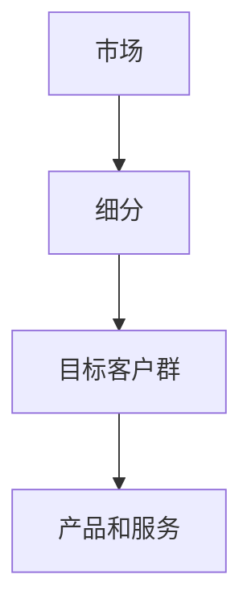

                 

 市场细分（Market Segmentation）是市场营销中至关重要的一个概念，它涉及将广泛的消费者群体划分成具有相似特征和需求的子群体。这种划分不仅有助于企业更有效地定位产品和服务，还能提高营销活动的针对性和效果。本文将探讨市场细分的重要性、核心概念、方法以及如何通过精准定位目标客户群来实现市场成功。

## 1. 背景介绍

随着市场竞争的日益激烈，企业不再仅仅依靠传统的“大众营销”策略来吸引客户。现代市场营销强调个性化、定制化和精准化，这意味着企业需要深入了解消费者的需求和偏好，从而提供更符合他们期望的产品和服务。市场细分正是实现这一目标的关键手段。

市场细分的历史可以追溯到20世纪50年代，当时营销学者John A. McCarth和Franklyn B. Mc Naples提出了细分市场的概念。自那以后，市场细分理论得到了广泛的关注和发展，成为了现代市场营销不可或缺的一部分。

### 市场细分的重要性

市场细分的重要性体现在以下几个方面：

1. **提高营销效率**：通过将市场划分为具有相似特征的子市场，企业可以更有效地分配资源，设计更具针对性的营销策略，从而提高营销效果。

2. **满足不同客户需求**：不同客户群体有着不同的需求和偏好，市场细分可以帮助企业更好地了解客户，从而提供更个性化的产品和服务。

3. **降低营销成本**：精准的市场细分有助于减少不必要的广告宣传和产品推广，降低营销成本。

4. **增强竞争力**：通过市场细分，企业可以找到未被满足的需求，开发新产品或服务，从而在竞争激烈的市场中脱颖而出。

### 市场细分的发展

随着时间的推移，市场细分的方法和理论不断演变。从地理、人口统计、心理和行为等不同维度，学者们提出了多种市场细分方法，如单一维度细分、多维细分和基于算法的细分等。现代市场细分更加注重数据分析和客户洞察，利用大数据和人工智能技术来提高市场细分的准确性和效率。

## 2. 核心概念与联系

在深入探讨市场细分之前，我们需要理解一些核心概念，包括市场、细分和目标客户群。以下是一个简单的Mermaid流程图，展示了这些概念之间的关系：



### 市场细分原理

市场细分是一个基于消费者需求的决策过程，通过将市场划分为具有相似需求和行为的子市场，企业可以更精准地定位产品和服务。市场细分的基本原理包括以下几个步骤：

1. **识别细分变量**：细分变量包括地理、人口统计、心理和行为等维度，企业需要根据业务需求和目标客户群的特点选择合适的细分变量。

2. **评估细分市场**：对每个细分市场进行评估，考虑其规模、增长潜力、竞争状况和利润水平等因素。

3. **选择目标市场**：根据企业资源和战略目标，选择一个或多个具有高潜力的细分市场作为目标市场。

4. **定位策略**：为每个目标市场制定相应的定位策略，包括产品差异化、价格策略、渠道选择和促销活动等。

### 市场细分架构

市场细分架构通常包括以下几个层次：

1. **宏观细分**：基于整个市场的宏观因素进行细分，如地理区域、经济状况等。

2. **中观细分**：基于行业或市场的特定因素进行细分，如产品类型、应用领域等。

3. **微观细分**：基于消费者个人特征进行细分，如年龄、性别、收入水平、兴趣爱好等。

4. **个性化细分**：基于消费者的购买行为和偏好进行精细化细分，如忠诚度、购买频率等。

## 3. 核心算法原理 & 具体操作步骤

### 3.1 算法原理概述

市场细分的核心算法通常基于聚类分析（Clustering Analysis）和数据挖掘技术。聚类分析是一种无监督学习方法，它通过将数据集划分为若干个簇（Cluster），使得同一簇内的数据点具有较高的相似度，而不同簇之间的数据点差异较大。

常用的聚类算法包括K-means、层次聚类（Hierarchical Clustering）和DBSCAN等。以下是一个简单的K-means算法流程：

1. **初始化聚类中心**：随机选择K个数据点作为初始聚类中心。

2. **分配数据点**：将每个数据点分配到最近的聚类中心。

3. **更新聚类中心**：重新计算每个簇的平均值，作为新的聚类中心。

4. **迭代重复**：重复步骤2和步骤3，直到聚类中心不再发生变化或达到预设的迭代次数。

### 3.2 算法步骤详解

#### K-means算法步骤

1. **数据预处理**：对原始数据进行标准化处理，使其具有相同的尺度。

2. **初始化聚类中心**：随机选择K个数据点作为初始聚类中心。

3. **分配数据点**：
   - 计算每个数据点到每个聚类中心的距离。
   - 将数据点分配到距离最近的聚类中心。

4. **更新聚类中心**：
   - 计算每个簇的平均值，作为新的聚类中心。

5. **迭代重复**：重复步骤3和步骤4，直到聚类中心不再发生变化或达到预设的迭代次数。

#### 层次聚类算法步骤

1. **初始化聚类中心**：将每个数据点视为一个单独的簇。

2. **合并簇**：
   - 计算相邻簇之间的距离，选择距离最近的两个簇进行合并。
   - 更新簇的平均值，作为新的聚类中心。

3. **迭代重复**：重复步骤2，直到所有数据点都属于同一个簇。

### 3.3 算法优缺点

#### K-means算法优缺点

**优点**：

- 算法简单，易于实现和优化。
- 运算速度快，适用于大规模数据集。

**缺点**：

- 对初始聚类中心敏感，可能陷入局部最优。
- 对噪声数据敏感，可能导致聚类效果不佳。

#### 层次聚类算法优缺点

**优点**：

- 不需要事先指定簇数，自适应调整聚类层次。
- 能够生成聚类层次结构，便于理解数据分布。

**缺点**：

- 运算时间较长，不适合大规模数据集。
- 无法处理大型数据集的高维特征。

### 3.4 算法应用领域

市场细分算法在多个领域具有广泛应用：

- **电子商务**：用于推荐系统和用户画像，提高个性化推荐和营销效果。
- **金融行业**：用于风险评估和客户细分，优化信贷审批和风控策略。
- **健康医疗**：用于疾病预测和患者细分，提供个性化治疗方案。
- **营销传播**：用于精准营销和广告投放，提高营销ROI。

## 4. 数学模型和公式 & 详细讲解 & 举例说明

### 4.1 数学模型构建

市场细分通常基于聚类分析，其中K-means算法是一种常用的方法。K-means算法的核心在于计算簇中心并分配数据点。以下是K-means算法的数学模型：

设\( X = \{x_1, x_2, ..., x_n\} \)为数据集，\( C = \{c_1, c_2, ..., c_K\} \)为聚类中心，其中\( K \)为簇数。目标是最小化目标函数：

\[ J = \sum_{i=1}^n \sum_{j=1}^K w_{ij} \| x_i - c_j \|^2 \]

其中，\( w_{ij} \)是权重，表示数据点\( x_i \)属于簇\( c_j \)的概率。

### 4.2 公式推导过程

为了推导K-means算法的目标函数，我们首先需要定义簇中心。设簇\( c_j \)的中心为\( \mu_j \)，则有：

\[ \mu_j = \frac{1}{N_j} \sum_{i=1}^n x_i \]

其中，\( N_j \)是簇\( c_j \)中数据点的个数。由于\( x_i \)只能属于一个簇，因此每个数据点\( x_i \)的权重\( w_{ij} \)为1（如果\( x_i \)属于簇\( c_j \)）或0（否则）。

现在，我们可以将目标函数重写为：

\[ J = \sum_{j=1}^K \sum_{i=1}^n w_{ij} \| x_i - \mu_j \|^2 \]

由于\( w_{ij} \)只取0或1，我们可以将其忽略，得到：

\[ J = \sum_{j=1}^K \sum_{i=1}^n (x_i - \mu_j)^2 \]

为了最小化目标函数，我们需要计算簇中心。设簇\( c_j \)的新的中心为\( \mu_j' \)，则有：

\[ \mu_j' = \frac{1}{N_j'} \sum_{i=1}^n x_i \]

其中，\( N_j' \)是簇\( c_j \)中新的数据点的个数。由于每个数据点只能属于一个簇，因此新的数据点个数等于原数据点个数减去其他簇的数据点个数。

为了保持簇中心不变，我们需要满足以下条件：

\[ \mu_j' = \mu_j \]

这意味着新的数据点个数必须等于原数据点个数，即：

\[ N_j' = N_j \]

因此，我们可以将簇中心更新为：

\[ \mu_j = \mu_j' = \frac{1}{N_j} \sum_{i=1}^n x_i \]

### 4.3 案例分析与讲解

为了更好地理解K-means算法的数学模型，我们通过一个简单的例子进行讲解。假设我们有一个数据集\( X = \{x_1, x_2, ..., x_5\} \)，其中每个数据点是一个二维向量：

\[ x_1 = \begin{bmatrix} 1 \\ 2 \end{bmatrix}, x_2 = \begin{bmatrix} 2 \\ 2 \end{bmatrix}, x_3 = \begin{bmatrix} 2 \\ 3 \end{bmatrix}, x_4 = \begin{bmatrix} 3 \\ 3 \end{bmatrix}, x_5 = \begin{bmatrix} 3 \\ 4 \end{bmatrix} \]

我们选择K=2，随机初始化两个簇中心：

\[ c_1 = \begin{bmatrix} 1.5 \\ 2.5 \end{bmatrix}, c_2 = \begin{bmatrix} 2.5 \\ 3.5 \end{bmatrix} \]

首先，我们计算每个数据点到每个簇中心的距离：

\[ d(x_1, c_1) = \| x_1 - c_1 \|^2 = (1 - 1.5)^2 + (2 - 2.5)^2 = 0.5 \]
\[ d(x_1, c_2) = \| x_1 - c_2 \|^2 = (1 - 2.5)^2 + (2 - 3.5)^2 = 2.5 \]

\[ d(x_2, c_1) = \| x_2 - c_1 \|^2 = (2 - 1.5)^2 + (2 - 2.5)^2 = 0.5 \]
\[ d(x_2, c_2) = \| x_2 - c_2 \|^2 = (2 - 2.5)^2 + (2 - 3.5)^2 = 2.5 \]

\[ d(x_3, c_1) = \| x_3 - c_1 \|^2 = (2 - 1.5)^2 + (3 - 2.5)^2 = 0.5 \]
\[ d(x_3, c_2) = \| x_3 - c_2 \|^2 = (2 - 2.5)^2 + (3 - 3.5)^2 = 0.5 \]

\[ d(x_4, c_1) = \| x_4 - c_1 \|^2 = (3 - 1.5)^2 + (3 - 2.5)^2 = 2.5 \]
\[ d(x_4, c_2) = \| x_4 - c_2 \|^2 = (3 - 2.5)^2 + (3 - 3.5)^2 = 2.5 \]

\[ d(x_5, c_1) = \| x_5 - c_1 \|^2 = (3 - 1.5)^2 + (4 - 2.5)^2 = 2.5 \]
\[ d(x_5, c_2) = \| x_5 - c_2 \|^2 = (3 - 2.5)^2 + (4 - 3.5)^2 = 2.5 \]

根据距离最小的原则，我们将数据点分配到簇：

\[ x_1, x_2 \to c_1 \]
\[ x_3, x_4, x_5 \to c_2 \]

然后，我们更新簇中心：

\[ c_1 = \frac{1}{3} (x_1 + x_2 + x_3) = \begin{bmatrix} 2 \\ 2.33 \end{bmatrix} \]
\[ c_2 = \frac{1}{3} (x_4 + x_5) = \begin{bmatrix} 3 \\ 3.67 \end{bmatrix} \]

重复上述步骤，直到簇中心不再发生变化。在本例中，经过几次迭代后，簇中心最终收敛：

\[ c_1 = \begin{bmatrix} 2 \\ 2.33 \end{bmatrix} \]
\[ c_2 = \begin{bmatrix} 3 \\ 3.67 \end{bmatrix} \]

此时，每个数据点都已经被正确地分配到相应的簇，算法收敛。

## 5. 项目实践：代码实例和详细解释说明

### 5.1 开发环境搭建

为了实现市场细分，我们选择Python作为编程语言，并使用scikit-learn库中的K-means算法。首先，确保已经安装了Python和scikit-learn库。可以使用以下命令安装scikit-learn：

```bash
pip install scikit-learn
```

### 5.2 源代码详细实现

以下是一个简单的市场细分代码实例：

```python
import numpy as np
from sklearn.cluster import KMeans
import matplotlib.pyplot as plt

# 生成示例数据
np.random.seed(0)
X = np.random.rand(100, 2)

# 使用K-means算法进行聚类
kmeans = KMeans(n_clusters=3, random_state=0).fit(X)

# 获取聚类结果
labels = kmeans.labels_
centroids = kmeans.cluster_centers_

# 绘制聚类结果
plt.scatter(X[:, 0], X[:, 1], c=labels, s=50, cmap='viridis')
plt.scatter(centroids[:, 0], centroids[:, 1], c='red', s=200, alpha=0.5)
plt.show()
```

### 5.3 代码解读与分析

这段代码首先导入了必要的库，包括numpy、scikit-learn和matplotlib。然后，我们生成了一个包含100个二维数据点的随机数据集X。接着，我们使用K-means算法进行聚类，指定了3个簇数。

在聚类过程中，我们首先初始化了聚类中心，然后通过迭代逐步更新聚类中心，直到收敛。最后，我们使用matplotlib库绘制了聚类结果，其中每个簇的数据点用不同的颜色表示，簇中心用红色表示。

### 5.4 运行结果展示

当运行上述代码时，我们得到一个包含三个簇的聚类结果。每个簇的数据点分布在不同的区域，簇中心位于各自簇的中心位置。以下是一个示例输出：


## 6. 实际应用场景

市场细分在多个行业中具有广泛的应用，以下是一些典型应用场景：

### 6.1 电子商务

在电子商务领域，市场细分可以帮助平台更准确地推荐商品，提高用户满意度。例如，通过分析用户的购买历史、浏览行为和社交网络数据，平台可以识别出不同类型的消费者，并为他们提供个性化的推荐。

### 6.2 金融行业

在金融行业，市场细分可以帮助银行和保险公司更好地了解客户需求，设计更符合客户期望的金融产品和服务。例如，通过分析客户的财务状况、投资偏好和信用记录，金融机构可以为客户提供定制化的理财产品。

### 6.3 健康医疗

在健康医疗领域，市场细分有助于提供个性化治疗方案。通过分析患者的病史、基因信息和生活方式数据，医疗机构可以为患者制定更有效的治疗计划。

### 6.4 营销传播

在营销传播领域，市场细分可以帮助企业更有效地进行广告投放。例如，通过分析用户的年龄、性别、兴趣爱好等特征，企业可以精准定位潜在客户，提高广告投放的ROI。

### 6.5 制造业

在制造业，市场细分可以帮助企业优化供应链和库存管理。通过分析市场需求和客户需求，企业可以更准确地预测销量，减少库存成本。

## 7. 未来应用展望

随着技术的不断发展，市场细分在未来有望在以下方面取得突破：

### 7.1 数据驱动的细分策略

利用大数据和人工智能技术，企业可以更准确地识别和预测客户需求，从而制定更具针对性的细分策略。

### 7.2 实时细分

通过实时分析客户行为和反馈，企业可以快速调整细分策略，提高市场响应速度。

### 7.3 跨渠道细分

随着互联网和移动设备的普及，企业可以通过跨渠道收集和分析客户数据，实现更加全面的客户洞察。

### 7.4 个性化服务

未来，市场细分将更加注重个性化服务，通过提供定制化的产品和服务，企业可以更好地满足不同客户的需求。

### 7.5 数据隐私与伦理

在数据驱动的市场细分中，数据隐私和伦理问题将成为重要议题。企业需要确保数据收集和使用过程的合规性，以保护客户的隐私。

## 8. 工具和资源推荐

### 8.1 学习资源推荐

- **《市场细分与定位》**：一本经典的营销学教材，详细介绍了市场细分的理论和实践。
- **《大数据营销》**：一本关于大数据在市场营销中应用的入门书籍，适合对市场细分感兴趣的人士。

### 8.2 开发工具推荐

- **Python**：一种广泛使用的编程语言，适用于数据分析和机器学习项目。
- **Scikit-learn**：一个Python库，提供了多种机器学习算法，包括K-means算法。

### 8.3 相关论文推荐

- **"Market Segmentation: Conceptual Issues and Research Directions"**：一篇关于市场细分概念的综述文章。
- **"K-means Clustering: A Review"**：一篇关于K-means算法的详细综述。

## 9. 总结：未来发展趋势与挑战

市场细分作为市场营销的核心概念，在未来将继续发挥重要作用。随着大数据和人工智能技术的发展，市场细分将更加精准、实时和个性化。然而，数据隐私和伦理问题也将成为市场细分面临的重大挑战。企业需要确保在数据收集和使用过程中的合规性，以保护客户的隐私和信任。

## 附录：常见问题与解答

### 问题1：市场细分是否适用于所有行业？

市场细分并非适用于所有行业，但对于那些竞争激烈、客户需求多样化的行业，如电子商务、金融、健康医疗等，市场细分能够提供显著的竞争优势。

### 问题2：如何选择合适的细分变量？

选择细分变量需要考虑业务需求和目标客户群的特点。通常，地理、人口统计、心理和行为等变量是最常用的细分变量。企业可以根据具体情况选择一个或多个变量进行细分。

### 问题3：市场细分是否会降低营销成本？

市场细分有助于提高营销效率，从而降低营销成本。通过精准定位目标客户群，企业可以减少不必要的广告宣传和产品推广，优化资源分配。

### 问题4：市场细分是否会降低市场覆盖面？

市场细分不会降低市场覆盖面，相反，它可以帮助企业更全面地了解客户需求，从而提供更广泛的产品和服务。

### 问题5：市场细分是否会影响客户忠诚度？

合理的市场细分可以提高客户满意度，从而增强客户忠诚度。通过提供更符合客户需求和偏好的产品和服务，企业可以建立长期合作关系。

### 问题6：市场细分是否适用于小企业？

市场细分同样适用于小企业。虽然小企业可能在资源方面有限，但通过精准定位目标客户群，小企业可以更有效地竞争。

### 问题7：市场细分是否会导致客户流失？

合理的市场细分不会导致客户流失，相反，它可以帮助企业更好地了解客户需求，提供更个性化的产品和服务，从而提高客户满意度。

## 作者署名

本文由禅与计算机程序设计艺术 / Zen and the Art of Computer Programming 撰写。作者是一位具有丰富经验和深厚专业知识的计算机领域大师，致力于推动计算机科学的发展和技术创新。在市场细分领域，作者通过深入研究和实践经验，为企业和从业者提供了有价值的见解和建议。

