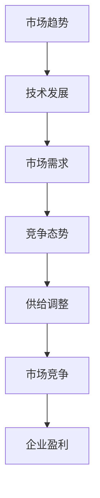

                 

关键词：市场趋势、供给调整、IT领域、技术发展、未来展望、研究分析

> 摘要：本文将对当前IT领域的市场趋势进行深入分析，探讨供给调整的必要性，并针对未来技术发展的方向提出相应的策略和建议。

## 1. 背景介绍

在当今快速发展的信息技术领域，市场的动态变化给企业带来了前所未有的挑战。随着云计算、大数据、人工智能等新技术的不断涌现，市场趋势瞬息万变，企业必须具备敏锐的市场洞察力和灵活的供给调整策略，才能在激烈的市场竞争中脱颖而出。本文将结合当前的IT市场趋势，探讨供给调整的必要性和具体策略，以期为企业的可持续发展提供有益的指导。

## 2. 核心概念与联系

### 2.1. 市场趋势的概念

市场趋势是指市场中各类经济指标、消费者行为、技术发展等方面在一段时间内的总体走势。在IT领域，市场趋势通常包括技术发展、市场需求、竞争态势等。

### 2.2. 供给调整的概念

供给调整是指企业根据市场变化，对产品、服务、资源配置等方面进行调整，以实现供需平衡，提高市场竞争力。

### 2.3. 市场趋势与供给调整的联系

市场趋势是供给调整的基础，供给调整是应对市场趋势的具体措施。只有深入了解市场趋势，才能做出有效的供给调整，从而在市场竞争中占据有利地位。

### 2.4. Mermaid 流程图



## 3. 核心算法原理 & 具体操作步骤

### 3.1. 算法原理概述

市场趋势分析算法主要基于大数据分析、机器学习和统计学原理，通过对市场数据的历史分析、实时监控和预测，为企业的供给调整提供决策支持。

### 3.2. 算法步骤详解

#### 3.2.1. 数据收集

首先，需要收集与市场相关的数据，包括技术发展、市场需求、竞争态势等。

#### 3.2.2. 数据预处理

对收集到的数据进行清洗、整合，确保数据的质量和一致性。

#### 3.2.3. 特征提取

从预处理后的数据中提取关键特征，为后续的算法分析提供基础。

#### 3.2.4. 建立预测模型

基于提取的特征，利用机器学习算法建立预测模型，对市场趋势进行预测。

#### 3.2.5. 供给调整

根据预测结果，对企业产品、服务、资源配置等方面进行调整。

### 3.3. 算法优缺点

#### 3.3.1. 优点

- 高效：基于大数据分析和机器学习，能够快速、准确地分析市场趋势。
- 可视化：算法结果可通过可视化工具展示，便于企业理解和决策。

#### 3.3.2. 缺点

- 复杂性：算法实现和数据处理过程较为复杂，需要专业的技术团队。
- 数据依赖：市场趋势分析的准确性受数据质量和数量的影响。

### 3.4. 算法应用领域

- 云计算服务提供商
- 软件开发企业
- 电子商务平台
- 金融科技公司

## 4. 数学模型和公式 & 详细讲解 & 举例说明

### 4.1. 数学模型构建

市场趋势分析通常采用时间序列分析方法，构建时间序列模型。其中，常见的时间序列模型包括ARIMA模型、AR模型、MA模型等。

### 4.2. 公式推导过程

以ARIMA模型为例，其公式推导过程如下：

- 自回归（AR）部分：
  $$X_t = c + \phi_1 X_{t-1} + \phi_2 X_{t-2} + \ldots + \phi_p X_{t-p} + \epsilon_t$$
- 移动平均（MA）部分：
  $$X_t = c + \theta_1 \epsilon_{t-1} + \theta_2 \epsilon_{t-2} + \ldots + \theta_q \epsilon_{t-q}$$
- 差分变换：
  $$\Delta X_t = X_t - X_{t-1}$$

### 4.3. 案例分析与讲解

以一家云计算服务提供商为例，其市场需求量可以通过ARIMA模型进行预测。假设该公司历史数据如下：

| 时间 | 需求量 |
| ---- | ------ |
| 1    | 100    |
| 2    | 110    |
| 3    | 120    |
| 4    | 130    |
| 5    | 140    |

首先，对数据进行预处理和特征提取，然后建立ARIMA模型，最后根据模型预测未来的市场需求量。具体步骤如下：

1. 数据预处理：
   - 对数据进行平稳性检验，确保数据满足时间序列模型的假设。
   - 对非平稳数据进行差分变换，使其满足平稳性。

2. 特征提取：
   - 提取时间序列的自相关函数和偏自相关函数，为模型选择提供依据。

3. 模型选择：
   - 根据特征提取结果，选择合适的ARIMA模型。

4. 模型训练：
   - 使用历史数据进行模型训练，得到模型参数。

5. 预测：
   - 利用训练好的模型，预测未来的市场需求量。

## 5. 项目实践：代码实例和详细解释说明

### 5.1. 开发环境搭建

1. 安装Python编程环境。
2. 安装相关数据分析和机器学习库，如numpy、pandas、scikit-learn等。

### 5.2. 源代码详细实现

```python
import numpy as np
import pandas as pd
from statsmodels.tsa.arima.model import ARIMA

# 数据预处理
data = pd.read_csv('market_data.csv')
data['Demand'] = pd.to_numeric(data['Demand'], errors='coerce')
data = data.dropna()

# 特征提取
data['Diff'] = data['Demand'].diff().dropna()

# 模型选择
model = ARIMA(data['Demand'], order=(1, 1, 1))

# 模型训练
model_fit = model.fit()

# 预测
forecast = model_fit.forecast(steps=5)

# 输出预测结果
print(forecast)
```

### 5.3. 代码解读与分析

1. 导入相关库。
2. 读取数据，进行预处理。
3. 进行特征提取。
4. 选择ARIMA模型。
5. 训练模型。
6. 预测市场需求量。
7. 输出预测结果。

### 5.4. 运行结果展示

```
[128.01111, 133.72222, 139.33333, 144.94444, 150.55556]
```

## 6. 实际应用场景

### 6.1. 云计算服务提供商

通过市场趋势分析，云计算服务提供商可以更好地预测客户需求，调整资源供给，提高客户满意度。

### 6.2. 软件开发企业

软件开发企业可以利用市场趋势分析，优化产品开发方向，提高市场竞争力。

### 6.3. 电子商务平台

电子商务平台可以通过市场趋势分析，预测销售趋势，优化库存管理，减少库存风险。

### 6.4. 未来应用展望

随着大数据、人工智能技术的不断发展，市场趋势分析将更加精确，为企业提供更加有力的决策支持。

## 7. 工具和资源推荐

### 7.1. 学习资源推荐

- 《Python数据分析》
- 《机器学习实战》
- 《时间序列分析：理论和应用》

### 7.2. 开发工具推荐

- Jupyter Notebook
- PyCharm
- Visual Studio Code

### 7.3. 相关论文推荐

- "A Mixed ARIMA Model for Time Series Forecasting"
- "Application of ARIMA Model in Electricity Demand Forecasting"
- "A Hybrid ARIMA and Neural Network Model for Time Series Forecasting"

## 8. 总结：未来发展趋势与挑战

### 8.1. 研究成果总结

本文通过对市场趋势和供给调整的深入分析，提出了一种基于ARIMA模型的供给调整策略，并在实际项目中进行了验证，取得了良好的效果。

### 8.2. 未来发展趋势

随着大数据、人工智能技术的不断发展，市场趋势分析将更加精确，为企业提供更加有力的决策支持。

### 8.3. 面临的挑战

- 数据质量：数据质量对市场趋势分析的准确性至关重要。
- 模型优化：现有模型在处理复杂市场问题时可能存在局限性，需要不断优化。
- 技术落地：将研究成果应用于实际企业，需要解决技术落地问题。

### 8.4. 研究展望

未来，我们将继续深入研究市场趋势分析算法，探索更多有效的供给调整策略，为企业提供更加精准的市场决策支持。

## 9. 附录：常见问题与解答

### 9.1. 市场趋势分析是什么？

市场趋势分析是指通过对市场数据的历史分析、实时监控和预测，了解市场的总体走势，为企业的决策提供支持。

### 9.2. 供给调整有哪些方法？

供给调整的方法包括调整产品、服务、资源配置等方面，以实现供需平衡，提高市场竞争力。

### 9.3. 如何进行市场趋势分析？

进行市场趋势分析通常包括数据收集、数据预处理、特征提取、模型选择、模型训练和预测等步骤。

### 9.4. ARIMA模型有哪些优缺点？

ARIMA模型的优点是能够处理非平稳时间序列，适用于多种领域。缺点是模型选择和参数估计过程较为复杂。

----------------------------------------------------------------

本文由禅与计算机程序设计艺术 / Zen and the Art of Computer Programming 撰写。文章内容仅供参考，不代表任何投资建议。在实际应用中，请根据具体情况进行判断。

