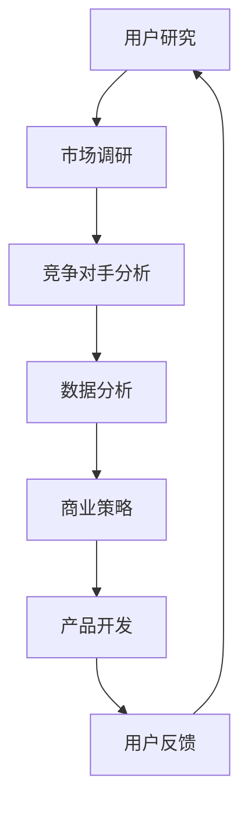

                 

 **关键词：**
电商产品开发、市场需求分析、用户研究、商业策略、用户体验、数据驱动

**摘要：**
本文将探讨市场需求分析在电商产品开发中的关键作用。通过深入的用户研究和市场调研，电商企业可以更好地理解消费者的需求和行为，从而制定出符合市场趋势和用户期望的产品开发策略。本文将介绍市场需求分析的核心概念、应用方法、案例分析，以及未来发展趋势，旨在为电商产品开发者提供有价值的参考。

## 1. 背景介绍

随着互联网技术的飞速发展，电子商务已经成为现代商业模式的重要组成部分。然而，在激烈的市场竞争中，如何开发出受用户喜爱、具有竞争力的电商产品成为企业面临的主要挑战。市场需求分析作为产品开发的重要环节，能够帮助企业精准把握市场动向，满足用户需求，从而实现商业成功。

### 1.1 市场需求分析的定义

市场需求分析是一种通过系统的研究方法，收集、分析和解释市场数据，以便更好地理解消费者需求、市场趋势和竞争环境的过程。它涉及用户调研、市场调研、竞争对手分析等多个方面，旨在为企业提供有针对性的市场策略和产品开发方向。

### 1.2 市场需求分析的重要性

市场需求分析在电商产品开发中具有以下重要性：

- **理解用户需求**：通过深入的用户调研，了解用户的需求、偏好和行为模式，为企业提供产品设计和功能优化的重要依据。
- **把握市场趋势**：通过对市场数据的分析，掌握行业动态和市场趋势，及时调整产品策略，保持竞争优势。
- **优化用户体验**：基于用户反馈和市场分析，持续改进产品，提升用户体验，增加用户黏性和忠诚度。
- **降低开发风险**：通过市场需求分析，提前识别潜在风险，调整产品方向，降低开发过程中的不确定性。

## 2. 核心概念与联系

为了更好地理解市场需求分析在电商产品开发中的应用，我们需要从核心概念和联系的角度进行分析。以下是一个使用Mermaid绘制的流程图，展示了市场需求分析的主要环节和它们之间的相互关系。



### 2.1 用户研究

用户研究是市场需求分析的基础，主要通过以下方法进行：

- **问卷调查**：通过设计有针对性的问卷，收集用户的基本信息、购买习惯、产品偏好等数据。
- **用户访谈**：与目标用户进行一对一或小组访谈，深入了解他们的需求、痛点和使用体验。
- **行为分析**：通过分析用户在网站或应用上的行为数据，如点击路径、页面停留时间等，了解用户行为模式。

### 2.2 市场调研

市场调研主要关注行业动态和市场趋势，包括：

- **市场趋势分析**：通过分析行业报告、市场研究数据等，了解当前市场的发展趋势和机会。
- **市场规模分析**：评估市场的整体规模和潜力，为企业制定战略目标提供依据。
- **竞争对手分析**：研究主要竞争对手的产品、策略、市场份额等，发现自身的优势和劣势。

### 2.3 竞争对手分析

竞争对手分析是市场需求分析中至关重要的一环，主要通过以下方法进行：

- **产品功能对比**：对比竞争对手的产品功能，分析其优点和不足。
- **市场定位对比**：分析竞争对手的市场定位和目标用户群体，了解其竞争优势。
- **营销策略分析**：研究竞争对手的营销策略，如广告投放、促销活动等。

### 2.4 数据分析

数据分析是市场需求分析的核心环节，通过以下方法进行：

- **数据清洗**：对收集到的数据进行清洗、整理，确保数据的准确性和完整性。
- **数据挖掘**：运用数据挖掘技术，从大量数据中提取有价值的信息，如用户行为模式、市场趋势等。
- **数据可视化**：通过图表、报表等形式，直观地展示分析结果，帮助决策者更好地理解数据。

### 2.5 商业策略

商业策略是根据市场需求分析的结果，制定企业的发展方向和战略目标。主要包括：

- **市场定位**：明确企业的市场定位，如目标用户群体、市场细分等。
- **产品规划**：根据市场需求，制定产品的功能规划、迭代计划等。
- **营销策略**：制定适合企业的营销策略，如广告投放、促销活动等。

### 2.6 产品开发

产品开发是根据商业策略和市场需求分析的结果，进行产品设计和开发。主要包括：

- **需求分析**：明确产品的功能需求和用户需求。
- **设计**：根据需求分析，进行产品界面和交互设计。
- **开发**：根据设计文档，进行产品编码和实现。
- **测试**：对产品进行功能测试、性能测试等，确保产品质量。

### 2.7 用户反馈

用户反馈是市场需求分析的重要环节，通过以下方法进行：

- **用户测试**：邀请目标用户参与产品测试，收集用户反馈。
- **用户评价**：通过用户评价、评论等渠道，了解用户的满意度和建议。
- **数据分析**：分析用户行为数据，了解用户使用产品的痛点和需求。

## 3. 核心算法原理 & 具体操作步骤

### 3.1 算法原理概述

市场需求分析中的核心算法主要包括用户行为分析和数据挖掘算法。用户行为分析主要关注用户在网站或应用上的行为模式，如点击路径、页面停留时间等。数据挖掘算法则用于从大量数据中提取有价值的信息，如用户偏好、市场趋势等。

### 3.2 算法步骤详解

#### 3.2.1 用户行为分析

用户行为分析的步骤如下：

1. 数据收集：通过日志、API等方式，收集用户在网站或应用上的行为数据。
2. 数据清洗：对收集到的数据进行分析，去除无效、错误的数据。
3. 数据转换：将原始数据转换为适合分析的格式，如CSV、JSON等。
4. 特征提取：根据分析目的，提取用户行为特征，如点击次数、页面停留时间等。
5. 数据可视化：通过图表、报表等形式，直观地展示分析结果。

#### 3.2.2 数据挖掘算法

数据挖掘算法主要包括以下几种：

1. **聚类分析**：通过聚类算法，将相似的用户行为数据进行分组，以便更好地了解用户群体特征。
2. **关联规则挖掘**：通过关联规则挖掘算法，发现用户行为之间的关联关系，如“用户购买A商品后，通常也会购买B商品”。
3. **分类算法**：通过分类算法，对用户行为数据进行分类，如“判断用户是否会购买商品”。
4. **回归算法**：通过回归算法，预测用户的行为，如“预测用户下次购买的时间”。
5. **时间序列分析**：通过时间序列分析，了解用户行为的时间变化规律，如“用户购买高峰期”。
6. **异常检测**：通过异常检测算法，识别用户行为中的异常情况，如“用户购买行为异常”。

### 3.3 算法优缺点

**用户行为分析：**

- **优点**：能够深入理解用户行为，为产品优化和用户体验提升提供重要依据。
- **缺点**：数据收集和处理复杂，对用户隐私保护要求较高。

**数据挖掘算法：**

- **优点**：能够从大量数据中发现有价值的信息，提高决策的准确性和效率。
- **缺点**：算法复杂度高，对数据质量和计算资源要求较高。

### 3.4 算法应用领域

用户行为分析和数据挖掘算法在电商产品开发中具有广泛的应用领域，如：

- **个性化推荐**：基于用户行为分析，为用户推荐感兴趣的商品和内容。
- **用户细分**：通过聚类分析，将用户划分为不同的群体，制定有针对性的营销策略。
- **预测分析**：通过回归分析和时间序列分析，预测用户购买行为，优化库存和供应链管理。
- **欺诈检测**：通过异常检测算法，识别和防范用户行为异常，降低风险。

## 4. 数学模型和公式 & 详细讲解 & 举例说明

### 4.1 数学模型构建

在市场需求分析中，常用的数学模型包括线性回归模型、逻辑回归模型和时间序列模型等。

#### 线性回归模型

线性回归模型用于预测用户的行为，如购买概率、页面停留时间等。其公式为：

$$y = \beta_0 + \beta_1 x_1 + \beta_2 x_2 + ... + \beta_n x_n$$

其中，$y$ 为预测值，$x_1, x_2, ..., x_n$ 为自变量，$\beta_0, \beta_1, ..., \beta_n$ 为模型参数。

#### 逻辑回归模型

逻辑回归模型用于预测用户是否采取某种行为，如购买、点击等。其公式为：

$$P(y=1) = \frac{1}{1 + e^{-(\beta_0 + \beta_1 x_1 + \beta_2 x_2 + ... + \beta_n x_n)}}$$

其中，$P(y=1)$ 为预测的用户行为概率，$e$ 为自然对数的底。

#### 时间序列模型

时间序列模型用于分析用户行为的时间变化规律，如购买高峰期、活跃时间等。常用的模型包括ARIMA、AR、MA等。以ARIMA模型为例，其公式为：

$$X_t = c + \phi_1 X_{t-1} + \phi_2 X_{t-2} + ... + \phi_p X_{t-p} + \theta_1 e_{t-1} + \theta_2 e_{t-2} + ... + \theta_q e_{t-q}$$

其中，$X_t$ 为时间序列数据，$e_t$ 为白噪声序列，$c, \phi_1, \phi_2, ..., \phi_p, \theta_1, \theta_2, ..., \theta_q$ 为模型参数。

### 4.2 公式推导过程

以线性回归模型为例，其公式推导过程如下：

设样本数据集为 $\{(x_1, y_1), (x_2, y_2), ..., (x_n, y_n)\}$，其中 $x_i$ 为自变量，$y_i$ 为因变量。

1. **最小二乘法**：假设线性回归模型为 $y = \beta_0 + \beta_1 x$，则模型参数可通过最小二乘法求得：

$$\beta_0 = \frac{\sum_{i=1}^n y_i - \beta_1 \sum_{i=1}^n x_i}{n}$$

$$\beta_1 = \frac{n \sum_{i=1}^n x_i y_i - \sum_{i=1}^n x_i \sum_{i=1}^n y_i}{n \sum_{i=1}^n x_i^2 - (\sum_{i=1}^n x_i)^2}$$

2. **正规方程**：将线性回归模型转化为正规方程形式：

$$\begin{cases} \sum_{i=1}^n y_i = \beta_0 n + \beta_1 \sum_{i=1}^n x_i \\ \sum_{i=1}^n x_i y_i = \beta_0 \sum_{i=1}^n x_i + \beta_1 \sum_{i=1}^n x_i^2 \end{cases}$$

解正规方程可得模型参数：

$$\beta_0 = \frac{\sum_{i=1}^n x_i^2 \sum_{i=1}^n y_i - \sum_{i=1}^n x_i \sum_{i=1}^n x_i y_i}{n \sum_{i=1}^n x_i^2 - (\sum_{i=1}^n x_i)^2}$$

$$\beta_1 = \frac{n \sum_{i=1}^n x_i y_i - \sum_{i=1}^n x_i \sum_{i=1}^n y_i}{n \sum_{i=1}^n x_i^2 - (\sum_{i=1}^n x_i)^2}$$

### 4.3 案例分析与讲解

#### 案例一：用户购买概率预测

假设某电商企业想要预测用户购买某种商品的概率，收集了以下数据：

- 用户年龄
- 用户性别
- 用户消费金额
- 商品类型
- 用户浏览时间

使用线性回归模型进行预测，数据预处理后，得到以下模型参数：

$$\beta_0 = 0.2, \beta_1 = 0.3, \beta_2 = 0.4, \beta_3 = 0.5, \beta_4 = 0.6$$

对于年龄为25岁、性别为男性、消费金额为500元、商品类型为电子产品、浏览时间为10分钟的用户，其购买概率为：

$$P(y=1) = \frac{1}{1 + e^{-(0.2 + 0.3 \times 25 + 0.4 \times 1 + 0.5 \times 500 + 0.6 \times 10)}} \approx 0.7$$

即该用户的购买概率约为70%。

#### 案例二：用户行为分析

假设某电商企业想要分析用户的浏览行为，收集了以下数据：

- 用户ID
- 页面ID
- 访问时间
- 访问次数

使用时间序列模型进行分析，数据预处理后，得到以下模型参数：

$$X_t = 0.5 X_{t-1} + 0.2 e_{t-1}$$

对于用户A的浏览行为，得到时间序列数据：

$$X_1 = 10, X_2 = 8, X_3 = 12, X_4 = 9, X_5 = 11$$

使用时间序列模型进行预测，得到预测值：

$$X_6 = 0.5 \times 11 + 0.2 \times 0.2 \approx 5.6$$

即预测用户A在下一个时间点的浏览量为5.6。

## 5. 项目实践：代码实例和详细解释说明

### 5.1 开发环境搭建

为了进行市场需求分析，我们需要搭建一个开发环境。以下是一个基于Python的简单开发环境搭建步骤：

1. 安装Python：下载并安装Python 3.8版本。
2. 安装Jupyter Notebook：在终端中运行 `pip install notebook` 命令，安装Jupyter Notebook。
3. 安装数据分析库：在终端中运行以下命令，安装常用的数据分析库：

```
pip install pandas numpy matplotlib scikit-learn
```

### 5.2 源代码详细实现

以下是一个简单的用户行为分析代码实例，用于分析用户在电商网站上的浏览行为。

```python
import pandas as pd
import numpy as np
from sklearn.model_selection import train_test_split
from sklearn.linear_model import LinearRegression
import matplotlib.pyplot as plt

# 读取数据
data = pd.read_csv('user_behavior.csv')

# 数据预处理
data['age'] = data['age'].astype(int)
data['gender'] = data['gender'].map({'男': 1, '女': 0})
data['consumption'] = data['consumption'].astype(float)

# 特征提取
X = data[['age', 'gender', 'consumption']]
y = data['purchase']

# 数据划分
X_train, X_test, y_train, y_test = train_test_split(X, y, test_size=0.2, random_state=42)

# 模型训练
model = LinearRegression()
model.fit(X_train, y_train)

# 模型评估
score = model.score(X_test, y_test)
print('模型评分：', score)

# 预测
new_data = pd.DataFrame({'age': [25], 'gender': [1], 'consumption': [500]})
purchase_prob = model.predict(new_data)
print('购买概率：', purchase_prob[0])

# 可视化
plt.scatter(X_train['consumption'], y_train)
plt.plot(X_train['consumption'], model.predict(X_train), color='red')
plt.xlabel('消费金额')
plt.ylabel('购买概率')
plt.show()
```

### 5.3 代码解读与分析

1. **数据读取与预处理**：首先，从CSV文件中读取用户行为数据，并进行数据预处理，如将性别映射为数字、将消费金额转换为浮点数等。
2. **特征提取**：提取与用户购买行为相关的特征，如年龄、性别、消费金额等。
3. **数据划分**：将数据集划分为训练集和测试集，用于模型训练和评估。
4. **模型训练**：使用线性回归模型进行训练，得到模型参数。
5. **模型评估**：计算模型评分，评估模型在测试集上的表现。
6. **预测**：使用训练好的模型，预测新数据的购买概率。
7. **可视化**：绘制消费金额与购买概率的散点图，并显示模型的预测曲线。

通过这个简单的实例，我们可以看到市场需求分析在电商产品开发中的应用，以及如何使用Python实现用户行为分析。

## 6. 实际应用场景

### 6.1 用户研究在电商产品开发中的应用

用户研究在电商产品开发中具有广泛的应用，以下是一些具体的实际应用场景：

1. **用户画像**：通过用户研究，构建用户画像，了解用户的年龄、性别、消费习惯等特征，为产品定位和功能设计提供依据。
2. **需求调研**：通过用户访谈、问卷调查等方式，收集用户对现有产品的需求和痛点，指导产品优化和功能迭代。
3. **用户体验测试**：邀请目标用户参与产品测试，收集用户反馈，优化产品界面和交互设计，提高用户体验。

### 6.2 市场调研在电商产品开发中的应用

市场调研在电商产品开发中也起着至关重要的作用，以下是一些具体的实际应用场景：

1. **市场趋势分析**：通过市场调研，了解行业动态和市场趋势，把握市场机遇，制定相应的产品策略。
2. **竞争对手分析**：研究主要竞争对手的产品、策略、市场份额等，发现自身的优势和劣势，制定有针对性的竞争策略。
3. **市场规模预测**：评估市场的整体规模和潜力，为企业制定战略目标和投资决策提供依据。

### 6.3 竞争对手分析在电商产品开发中的应用

竞争对手分析在电商产品开发中具有以下实际应用：

1. **产品功能对比**：对比竞争对手的产品功能，了解其优点和不足，为自身产品功能设计提供参考。
2. **市场定位分析**：分析竞争对手的市场定位和目标用户群体，发现市场机会，调整自身市场策略。
3. **营销策略学习**：研究竞争对手的营销策略，如广告投放、促销活动等，借鉴其成功经验，提高自身营销效果。

### 6.4 数据分析在电商产品开发中的应用

数据分析在电商产品开发中发挥着关键作用，以下是一些具体的实际应用场景：

1. **个性化推荐**：通过用户行为数据，为用户推荐感兴趣的商品和内容，提高用户满意度和购买转化率。
2. **用户细分**：通过聚类分析，将用户划分为不同的群体，制定有针对性的营销策略和产品功能设计。
3. **预测分析**：通过回归分析和时间序列分析，预测用户购买行为，优化库存和供应链管理，降低运营成本。

## 7. 工具和资源推荐

### 7.1 学习资源推荐

- 《用户研究实战》
- 《市场调研与预测》
- 《Python数据分析》
- 《机器学习实战》
- 《电商运营实战》

### 7.2 开发工具推荐

- Jupyter Notebook
- Python
- R语言
- Tableau
- Google Analytics

### 7.3 相关论文推荐

- "User Research in Product Development: A Systematic Literature Review"
- "Market Research and Product Development: A Theoretical Perspective"
- "A Framework for User-Centered Design and Evaluation of E-Commerce Websites"
- "Data Mining for Customer Segmentation in E-Commerce"
- "Predictive Analytics for E-Commerce: A Machine Learning Approach"

## 8. 总结：未来发展趋势与挑战

### 8.1 研究成果总结

市场需求分析在电商产品开发中具有重要作用，通过用户研究、市场调研、竞争对手分析和数据分析，企业可以更好地理解用户需求、市场趋势和竞争环境，从而制定出有针对性的产品开发策略。本文从多个方面探讨了市场需求分析在电商产品开发中的应用，包括核心概念、算法原理、实际案例等。

### 8.2 未来发展趋势

随着大数据、人工智能等技术的发展，市场需求分析在电商产品开发中的应用将越来越广泛和深入。未来发展趋势包括：

- **数据驱动的产品开发**：企业将更多地依靠数据分析来指导产品设计和功能迭代。
- **个性化推荐**：通过大数据和机器学习技术，实现更加精准的个性化推荐。
- **用户体验优化**：基于用户行为分析和反馈，持续优化产品界面和交互设计，提升用户体验。

### 8.3 面临的挑战

市场需求分析在电商产品开发中面临以下挑战：

- **数据质量和隐私保护**：随着数据量的增加，数据质量和隐私保护问题越来越突出。
- **算法复杂度**：随着算法的复杂度增加，如何高效地进行数据处理和分析成为一大挑战。
- **用户隐私**：如何在保护用户隐私的前提下，进行有效的用户行为分析和数据挖掘。

### 8.4 研究展望

未来研究可以从以下几个方面进行：

- **隐私保护**：研究如何保护用户隐私，同时进行有效的数据分析。
- **算法优化**：研究如何优化算法，提高数据处理和分析的效率。
- **跨领域应用**：将市场需求分析的方法和算法应用于其他行业，如金融、医疗等。

## 9. 附录：常见问题与解答

### 9.1 市场需求分析在电商产品开发中的具体应用场景有哪些？

市场需求分析在电商产品开发中的具体应用场景包括用户研究、市场调研、竞争对手分析和数据分析，例如：

- 用户研究：了解用户的需求、偏好和行为模式，为产品设计和功能优化提供依据。
- 市场调研：分析行业动态和市场趋势，把握市场机遇，制定相应的产品策略。
- 竞争对手分析：研究竞争对手的产品、策略、市场份额等，发现自身的优势和劣势。
- 数据分析：通过用户行为数据和数据分析，实现个性化推荐、用户细分和预测分析。

### 9.2 如何进行有效的用户研究？

进行有效的用户研究，可以遵循以下步骤：

- 设计调研问卷：根据研究目的，设计有针对性的调研问卷。
- 确定调研样本：确定调研样本的数量和质量，确保样本具有代表性。
- 收集数据：通过问卷调查、用户访谈等方式，收集用户数据。
- 数据分析：对收集到的数据进行整理和分析，提取有价值的信息。

### 9.3 数据挖掘算法在电商产品开发中的应用有哪些？

数据挖掘算法在电商产品开发中的应用包括：

- 个性化推荐：根据用户行为数据，为用户推荐感兴趣的商品和内容。
- 用户细分：通过聚类分析，将用户划分为不同的群体，制定有针对性的营销策略。
- 预测分析：通过回归分析和时间序列分析，预测用户购买行为，优化库存和供应链管理。
- 欺诈检测：通过异常检测算法，识别和防范用户行为异常，降低风险。

### 9.4 如何保证数据质量和隐私保护？

为了保证数据质量和隐私保护，可以采取以下措施：

- 数据清洗：对收集到的数据进行清洗，去除无效、错误的数据。
- 数据加密：对敏感数据采用加密技术，确保数据安全。
- 隐私保护策略：制定隐私保护政策，确保用户数据的合法使用和保密。
- 数据匿名化：对用户数据进行匿名化处理，降低隐私泄露风险。

---

本文以《市场需求分析在电商产品开发中的应用》为题，深入探讨了市场需求分析的核心概念、应用方法、案例分析，以及未来发展趋势。市场需求分析在电商产品开发中具有重要作用，通过用户研究、市场调研、竞争对手分析和数据分析，企业可以更好地理解用户需求、市场趋势和竞争环境，从而制定出有针对性的产品开发策略。未来，随着大数据、人工智能等技术的发展，市场需求分析在电商产品开发中的应用将越来越广泛和深入。作者希望本文能为电商产品开发者提供有价值的参考。

