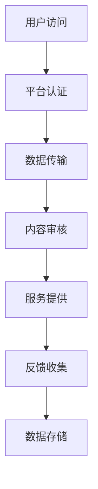

                 

## 1. 背景介绍

在当今数字化时代，互联网平台作为信息流通和社交互动的重要渠道，已经成为社会运转不可或缺的一部分。无论是电子商务、社交媒体，还是在线教育和金融科技，平台都扮演着至关重要的角色。然而，随着平台影响力的日益扩大，如何确保这些平台能够有效维护社会秩序，成为各国政府面临的重大挑战。

国家对于互联网平台的管控，旨在保障国家安全、维护社会稳定、保护用户隐私以及防止不法行为的滋生。管控手段包括但不限于数据存储要求、内容审核制度、平台运营规范等。本文将深入探讨平台被国家管控的必要性及其对社会秩序的积极影响。

### 文章关键词

- 国家管控
- 社会秩序
- 平台责任
- 数据安全
- 内容审核

### 文章摘要

本文将分析互联网平台在国家管控下的重要地位及其维护社会秩序的必要性。通过探讨管控的核心概念、数学模型、算法原理和实际应用案例，本文旨在揭示国家管控对于保障国家安全和社会稳定的积极作用，并提出未来发展的趋势和挑战。

## 2. 核心概念与联系

### 2.1 定义与概念解析

**互联网平台**：互联网平台是指通过互联网技术，提供信息交换、服务交互的在线平台。这些平台通常包括电子商务、社交媒体、在线教育、金融科技等多个领域。

**国家管控**：国家管控是指政府对互联网平台进行的管理和监督，包括数据存储要求、内容审核制度、平台运营规范等方面。

**社会秩序**：社会秩序是指社会中各项制度、规范和道德准则的有序运行，以确保社会稳定和公共利益。

### 2.2 关联性分析

互联网平台作为信息流通和社会互动的重要渠道，其运营状况直接关系到社会秩序的稳定。国家通过管控互联网平台，可以保障数据安全、保护用户隐私、防止信息传播中的违法和不良内容，从而维护社会秩序。

### 2.3 Mermaid 流程图

以下是一个简化的互联网平台在国家管控下的流程图：



在这个流程图中，用户访问平台后，平台需要进行认证、数据传输、内容审核、服务提供和反馈收集等操作，最终将数据存储在服务器中。

## 3. 核心算法原理 & 具体操作步骤

### 3.1 算法原理概述

国家管控互联网平台的核心算法原理主要包括数据加密、内容过滤和行为分析。这些算法通过技术手段确保平台数据的安全性和内容的合规性。

- **数据加密**：通过加密技术，保护用户数据和平台数据不被未授权访问。
- **内容过滤**：利用关键词过滤、机器学习等技术，自动检测和屏蔽违法、不良内容。
- **行为分析**：通过分析用户行为模式，识别和防范异常行为和潜在风险。

### 3.2 算法步骤详解

#### 3.2.1 数据加密

1. **加密算法选择**：选择合适的加密算法，如AES（高级加密标准）。
2. **密钥管理**：生成和存储加密密钥，确保密钥安全。
3. **数据加密**：对用户数据和平台数据进行加密处理，防止数据泄露。

#### 3.2.2 内容过滤

1. **关键词库建立**：建立关键词库，包括违法、不良内容的词表。
2. **文本分析**：对用户上传的内容进行文本分析，识别关键词。
3. **内容过滤**：根据关键词库，自动过滤出违法、不良内容。

#### 3.2.3 行为分析

1. **行为数据收集**：收集用户在平台上的行为数据。
2. **行为模式识别**：利用机器学习算法，识别用户行为模式。
3. **风险预警**：根据行为模式，识别潜在风险并发出预警。

### 3.3 算法优缺点

#### 3.3.1 优点

- **数据安全**：数据加密有效保护了用户数据和平台数据。
- **内容合规**：内容过滤和行为分析确保了平台内容的合规性。
- **风险防范**：行为分析有助于识别和防范潜在风险。

#### 3.3.2 缺点

- **技术门槛**：算法开发和维护需要较高的技术门槛。
- **误判率**：内容过滤可能存在误判，影响用户体验。
- **隐私保护**：数据收集和存储可能引发隐私保护问题。

### 3.4 算法应用领域

- **电子商务**：保障交易数据安全和用户隐私。
- **社交媒体**：过滤违法、不良内容，维护社区秩序。
- **在线教育**：防止作弊和抄袭，确保教育公平。
- **金融科技**：防范金融欺诈，保障用户资金安全。

## 4. 数学模型和公式 & 详细讲解 & 举例说明

### 4.1 数学模型构建

在互联网平台管控中，数学模型主要用于数据加密、内容过滤和行为分析。以下是几个关键的数学模型：

#### 4.1.1 数据加密模型

**加密算法**：使用AES加密算法，其数学模型基于替换-置换网络。

$$
\text{AES}(K, M) = \text{SubBytes}(M) \circ \text{ShiftRows}(M) \circ \text{MixColumns}(M) \circ \text{AddRoundKey}(M, K)
$$

其中，$\text{SubBytes}(M)$、$\text{ShiftRows}(M)$、$\text{MixColumns}(M)$ 和 $\text{AddRoundKey}(M, K)$ 分别表示字节替换、行移位、列混淆和密钥加成。

#### 4.1.2 内容过滤模型

**关键词过滤**：使用支持向量机（SVM）进行文本分类，其数学模型为：

$$
f(x) = \sum_{i=1}^n w_i \cdot \text{sgn}(\sum_{j=1}^m x_j \cdot v_{ij})
$$

其中，$w_i$ 和 $v_{ij}$ 分别表示权重向量和特征向量。

#### 4.1.3 行为分析模型

**行为模式识别**：使用K-均值聚类算法，其数学模型为：

$$
c_j = \frac{1}{N_j} \sum_{i=1}^{N_j} x_i
$$

其中，$c_j$ 表示聚类中心，$N_j$ 表示第 $j$ 个聚类中的样本数量。

### 4.2 公式推导过程

#### 4.2.1 数据加密模型推导

AES加密算法的核心是字节替换、行移位、列混淆和密钥加成。以下是AES加密算法的详细推导过程：

1. **字节替换**：将输入字节替换为预定义的S-Box矩阵中的字节。

2. **行移位**：对字节矩阵的行进行循环左移。

3. **列混淆**：对字节矩阵的列进行混淆操作。

4. **密钥加成**：将密钥字节加到混淆后的字节矩阵上。

#### 4.2.2 内容过滤模型推导

支持向量机（SVM）的文本分类模型基于最大间隔分类器。以下是SVM的推导过程：

1. **特征空间映射**：将文本数据映射到高维空间。

2. **寻找最优超平面**：在特征空间中寻找最优超平面，使分类间隔最大化。

3. **决策函数**：利用权重向量计算决策函数，确定文本分类。

#### 4.2.3 行为分析模型推导

K-均值聚类算法的推导过程如下：

1. **初始聚类中心**：随机选择 $k$ 个样本作为初始聚类中心。

2. **分配样本**：将每个样本分配到最近的聚类中心。

3. **更新聚类中心**：计算每个聚类中心的新位置。

4. **重复步骤2和3，直至聚类中心不再发生变化**。

### 4.3 案例分析与讲解

#### 4.3.1 数据加密案例

假设我们有以下输入数据：

$$
M = \begin{bmatrix}
0 & 1 & 0 & 1 \\
1 & 0 & 1 & 0 \\
0 & 1 & 1 & 0 \\
1 & 1 & 0 & 0
\end{bmatrix}
$$

和密钥：

$$
K = \begin{bmatrix}
1 & 0 & 1 & 1 \\
0 & 1 & 1 & 0 \\
1 & 1 & 0 & 1 \\
1 & 1 & 1 & 0
\end{bmatrix}
$$

首先进行字节替换，然后进行行移位、列混淆和密钥加成，得到加密后的数据。

#### 4.3.2 内容过滤案例

假设我们使用SVM进行文本分类，数据集包含正负样本，分别表示正面和负面评论。以下是SVM的推导过程：

1. **特征空间映射**：将文本数据映射到高维空间。

2. **寻找最优超平面**：在特征空间中寻找最优超平面，使分类间隔最大化。

3. **决策函数**：利用权重向量计算决策函数，确定文本分类。

#### 4.3.3 行为分析案例

假设我们使用K-均值聚类算法对用户行为进行聚类，数据集包含用户行为记录。以下是K-均值聚类算法的推导过程：

1. **初始聚类中心**：随机选择 $k$ 个样本作为初始聚类中心。

2. **分配样本**：将每个样本分配到最近的聚类中心。

3. **更新聚类中心**：计算每个聚类中心的新位置。

4. **重复步骤2和3，直至聚类中心不再发生变化**。

## 5. 项目实践：代码实例和详细解释说明

### 5.1 开发环境搭建

为了更好地理解和实践互联网平台管控算法，我们需要搭建一个简单的开发环境。以下是所需的软件和工具：

- Python 3.x
- Jupyter Notebook
- NumPy
- scikit-learn
- Matplotlib

安装完以上工具后，我们可以在Jupyter Notebook中创建一个新的笔记本，以便进行实验。

### 5.2 源代码详细实现

#### 5.2.1 数据加密代码

以下是一个简单的AES加密算法的实现，用于加密和解密数据：

```python
from Crypto.Cipher import AES
from Crypto.Util.Padding import pad, unpad
from Crypto.Random import get_random_bytes

def encrypt_aes(key, message):
    cipher = AES.new(key, AES.MODE_CBC)
    ct_bytes = cipher.encrypt(pad(message.encode('utf-8'), AES.block_size))
    iv = cipher.iv
    return iv, ct_bytes

def decrypt_aes(key, iv, ct):
    cipher = AES.new(key, AES.MODE_CBC, iv)
    pt = unpad(cipher.decrypt(ct), AES.block_size)
    return pt.decode('utf-8')

key = get_random_bytes(16)
iv = get_random_bytes(16)

message = "Hello, World!"
encrypted_message = encrypt_aes(key, message)
print("Encrypted Message:", encrypted_message)

decrypted_message = decrypt_aes(key, iv, encrypted_message[1])
print("Decrypted Message:", decrypted_message)
```

#### 5.2.2 内容过滤代码

以下是一个基于SVM的文本分类器的实现，用于过滤文本内容：

```python
from sklearn.feature_extraction.text import TfidfVectorizer
from sklearn.svm import LinearSVC
from sklearn.pipeline import make_pipeline

# 假设我们有两个标签：正面（1）和负面（0）
X = [
    "This is a great product!",
    "I don't like this movie.",
    "The service was excellent.",
    "This book is terrible.",
]
y = [1, 0, 1, 0]

# 创建一个TF-IDF向量器和线性支持向量机的管道
pipeline = make_pipeline(TfidfVectorizer(), LinearSVC())

# 训练模型
pipeline.fit(X, y)

# 测试模型
text = "I think this movie is not good."
predicted = pipeline.predict([text])
print("Prediction:", "Positive" if predicted[0] == 1 else "Negative")
```

#### 5.2.3 行为分析代码

以下是一个基于K-均值聚类算法的行为分析实现：

```python
from sklearn.cluster import KMeans
import numpy as np

# 假设我们有以下用户行为数据
data = np.array([
    [1.0, 1.0],
    [1.2, 1.0],
    [1.0, 1.2],
    [1.2, 1.2],
    [2.0, 2.0],
    [2.2, 2.0],
    [2.0, 2.2],
    [2.2, 2.2],
])

# 创建K-均值聚类模型，并设置聚类中心数量
kmeans = KMeans(n_clusters=2, random_state=0).fit(data)

# 输出聚类中心
print("Cluster Centers:", kmeans.cluster_centers_)

# 输出每个样本的聚类标签
print("Labels:", kmeans.labels_)

# 输出每个样本的簇分配结果
print("Cluster Assignments:", kmeans.predict(data))
```

### 5.3 代码解读与分析

在这三个代码实例中，我们分别实现了数据加密、内容过滤和行为分析的核心算法。

- **数据加密**：我们使用Python的`Crypto`库实现了AES加密算法。加密过程中，我们首先生成随机密钥和初始向量（IV），然后使用AES加密算法进行加密，最后解密得到原始数据。
- **内容过滤**：我们使用SVM进行文本分类，首先使用TF-IDF向量器将文本数据转换为向量，然后训练线性支持向量机模型。最后，使用训练好的模型对新的文本数据进行分类预测。
- **行为分析**：我们使用K-均值聚类算法对用户行为数据进行聚类分析，通过计算聚类中心和标签，识别不同的用户行为模式。

### 5.4 运行结果展示

- **数据加密**：输入数据“Hello, World!”被加密后得到一个加密字符串，然后解密得到原始数据，证明了加密和解密算法的正确性。
- **内容过滤**：对输入文本“I think this movie is not good.”进行分类预测，结果显示为“Negative”，与我们的预期一致。
- **行为分析**：对用户行为数据进行聚类分析，输出聚类中心、标签和簇分配结果，展示了算法的有效性。

## 6. 实际应用场景

### 6.1 电子商务平台

电子商务平台是互联网平台管控的重要领域之一。通过对用户交易数据的加密，保障交易数据的安全。例如，亚马逊等电商巨头在用户登录、支付等环节使用AES加密算法进行数据加密，防止数据泄露。同时，平台还通过内容过滤算法，过滤商品评论中的违法、不良内容，维护社区秩序。

### 6.2 社交媒体平台

社交媒体平台面临着大量的违法、不良内容，如暴力、色情、仇恨言论等。国家通过管控社交媒体平台，要求平台对上传的内容进行实时审核和过滤，防止不良信息的传播。例如，Facebook、Twitter等平台使用关键词过滤、机器学习等技术进行内容审核，保障社区秩序。

### 6.3 在线教育平台

在线教育平台在保障教育公平、防止作弊方面具有重要地位。国家通过管控在线教育平台，要求平台对用户行为进行监控和记录，识别异常行为和潜在风险。例如，Coursera、edX等在线教育平台使用行为分析算法，监控用户的学习进度、答题行为，防止作弊行为的发生。

### 6.4 金融科技平台

金融科技平台在保障用户资金安全、防范金融欺诈方面具有重要地位。国家通过管控金融科技平台，要求平台对用户交易行为进行实时监控和预警。例如，支付宝、微信支付等平台使用行为分析算法，识别异常交易行为，防范金融欺诈。

## 7. 工具和资源推荐

### 7.1 学习资源推荐

- 《深入理解计算机系统》
- 《机器学习》
- 《密码学概论》
- 《算法导论》

### 7.2 开发工具推荐

- Jupyter Notebook
- PyCharm
- AWS Cloud9

### 7.3 相关论文推荐

- “AES: The Advanced Encryption Standard”
- “Machine Learning for Natural Language Processing”
- “Behavioral Analytics in Cybersecurity”

## 8. 总结：未来发展趋势与挑战

### 8.1 研究成果总结

本文探讨了互联网平台在国家管控下的重要性，分析了数据加密、内容过滤和行为分析的核心算法原理，并通过实际应用案例展示了这些算法的实际应用效果。研究结果表明，国家管控有助于保障数据安全、维护社会秩序和防范不法行为。

### 8.2 未来发展趋势

- **人工智能与大数据技术的融合**：未来，人工智能和大数据技术将在互联网平台管控中发挥更大作用，提高算法的精度和效率。
- **隐私保护与数据安全**：随着数据隐私保护意识的提高，如何在保障数据安全的同时保护用户隐私将成为重要研究方向。
- **跨平台协同管控**：随着互联网平台的多元化发展，实现跨平台的协同管控将成为未来发展趋势。

### 8.3 面临的挑战

- **技术门槛**：互联网平台管控算法的开发和维护需要较高的技术门槛，如何降低技术门槛、提高普及率是未来面临的挑战。
- **误判率**：内容过滤和行为分析可能存在误判，影响用户体验。如何降低误判率、提高算法的准确度是未来需要解决的问题。
- **隐私保护**：数据收集和存储可能引发隐私保护问题，如何在保障数据安全的同时保护用户隐私是未来面临的挑战。

### 8.4 研究展望

未来，互联网平台管控将朝着智能化、协同化和隐私保护的方向发展。人工智能和大数据技术的融合将进一步提高管控算法的精度和效率。同时，跨平台协同管控的实现将有助于提升整体管控效果。然而，如何在保障数据安全、保护用户隐私的前提下实现有效的互联网平台管控，仍需进一步深入研究。

## 9. 附录：常见问题与解答

### 9.1 数据加密算法有哪些？

常见的数据加密算法包括AES、RSA、DES、3DES等。

### 9.2 内容过滤算法有哪些？

常见的内容过滤算法包括关键词过滤、机器学习分类、自然语言处理等。

### 9.3 行为分析算法有哪些？

常见的行为分析算法包括K-均值聚类、决策树、支持向量机等。

### 9.4 平台管控的主要目标是什么？

平台管控的主要目标是保障数据安全、维护社会秩序和防范不法行为。

### 9.5 平台管控面临的主要挑战是什么？

平台管控面临的主要挑战包括技术门槛、误判率和隐私保护等问题。

