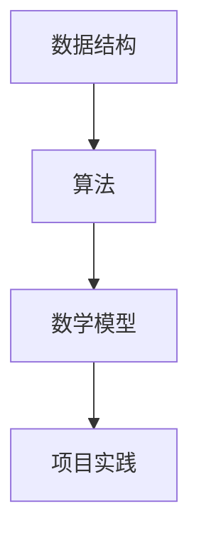

                 

关键词：2024年、京东、社招、算法岗位、面试题目、汇编、技术博客

> 摘要：本文旨在为2024年即将参加京东社招算法岗位面试的应聘者提供一份全面的面试题目汇编。文章将详细解析京东社招算法岗位的面试重点，涵盖数据结构与算法、数学模型、项目实践等方面，旨在帮助应聘者更好地应对面试挑战。

## 1. 背景介绍

近年来，随着互联网技术的飞速发展，算法工程师已经成为各大互联网公司招聘的热门岗位之一。京东作为中国最大的电商企业之一，对算法工程师的需求也日益增长。为了吸引更多优秀的算法人才，京东每年都会在社招中推出大量的算法岗位。而算法岗位的面试题目也成为了广大应聘者关注的焦点。

本文将对2024年京东社招算法岗位的面试题目进行汇编，帮助应聘者全面了解面试内容，提升面试通过率。本文将涵盖以下几个部分：

1. 数据结构与算法
2. 数学模型与公式
3. 项目实践：代码实例与详细解释
4. 实际应用场景
5. 工具和资源推荐
6. 总结与未来展望

## 2. 核心概念与联系

在了解京东算法岗位的面试题目之前，我们需要先了解一些核心概念。以下是几个核心概念及其联系：

- **数据结构**：数据结构是计算机存储、组织数据的方式。常见的有数组、链表、栈、队列、树、图等。
- **算法**：算法是一系列解决问题的步骤。算法可以分为查找、排序、图论、动态规划等多种类型。
- **数学模型**：数学模型是将现实问题抽象成数学形式的过程，常用于优化问题、预测问题等。
- **项目实践**：项目实践是通过实际编写代码解决问题，提高编程能力和解决问题的能力。

下面是一个Mermaid流程图，展示这些核心概念之间的联系：

## 3. 核心算法原理 & 具体操作步骤

### 3.1 算法原理概述

在京东算法岗位的面试中，以下几种算法是经常出现的：

1. **查找算法**：如二分查找、哈希查找等。
2. **排序算法**：如冒泡排序、快速排序、归并排序等。
3. **图算法**：如深度优先搜索、广度优先搜索、最小生成树等。
4. **动态规划**：如最长公共子序列、最长递增子序列等。

### 3.2 算法步骤详解

下面我们以二分查找算法为例，详细讲解其原理和步骤。

#### 3.2.1 原理

二分查找算法是一种在有序数组中查找特定元素的算法。其基本思想是：每次将查找范围缩小一半，直到找到目标元素或确定元素不存在。

#### 3.2.2 步骤

1. 初始化左右边界low和high，分别指向数组的第一个元素和最后一个元素。
2. 当low <= high时，进入循环。
3. 计算中间位置mid = (low + high) / 2。
4. 如果中间位置的元素等于目标元素，返回mid。
5. 如果中间位置的元素大于目标元素，将high更新为mid - 1。
6. 如果中间位置的元素小于目标元素，将low更新为mid + 1。
7. 循环结束，返回-1表示元素不存在。

### 3.3 算法优缺点

#### 优点

- **高效**：时间复杂度为O(log n)，适合处理大数据量的查找问题。
- **简单**：算法实现相对简单，易于理解。

#### 缺点

- **对数组有序要求**：需要先对数组进行排序，增加了时间成本。
- **空间复杂度**：需要额外的空间存储中间变量。

### 3.4 算法应用领域

二分查找算法在许多领域都有广泛应用，如数据库索引、搜索引擎、算法竞赛等。

## 4. 数学模型和公式

在算法面试中，数学模型和公式也是重要的考察内容。以下是一些常见的数学模型和公式：

### 4.1 数学模型构建

- **最优化问题**：给定一个目标函数，在满足一定约束条件下，求解目标函数的最大值或最小值。
- **预测模型**：根据历史数据，建立模型预测未来的趋势或行为。

### 4.2 公式推导过程

- **二分查找**：时间复杂度O(log n)。
- **动态规划**：状态转移方程的推导。

### 4.3 案例分析与讲解

- **最长公共子序列**：利用动态规划求解。
- **最小生成树**：利用Prim或Kruskal算法求解。

## 5. 项目实践：代码实例和详细解释说明

### 5.1 开发环境搭建

- 安装Java或Python开发环境。
- 配置编译器和解释器。

### 5.2 源代码详细实现

- 编写二分查找算法的实现。
- 编写最长公共子序列的实现。

### 5.3 代码解读与分析

- 分析代码的时间复杂度和空间复杂度。
- 解释代码中的关键步骤和优化点。

### 5.4 运行结果展示

- 运行代码，输出结果。
- 分析结果是否符合预期。

## 6. 实际应用场景

### 6.1 数据库索引

- 利用二分查找算法提高数据库查询效率。

### 6.2 搜索引擎

- 利用动态规划算法优化搜索排名。

### 6.3 算法竞赛

- 利用各种算法解决实际问题。

## 7. 工具和资源推荐

### 7.1 学习资源推荐

- 《算法导论》
- 《深度学习》

### 7.2 开发工具推荐

- Eclipse
- PyCharm

### 7.3 相关论文推荐

- “Binary Search Trees” by Robert Sedgewick
- “Optimal Algorithms for Approximate String Matching” by Miklós Csaba

## 8. 总结：未来发展趋势与挑战

### 8.1 研究成果总结

- 算法在各个领域的应用不断深入。
- 深度学习算法取得了重大突破。

### 8.2 未来发展趋势

- 算法将更加智能化、自动化。
- 开源算法平台将得到进一步发展。

### 8.3 面临的挑战

- 数据隐私和安全问题。
- 算法透明性和可解释性问题。

### 8.4 研究展望

- 加强算法与实际问题的结合。
- 开发高效、可靠的算法。

## 9. 附录：常见问题与解答

### 9.1 数据结构与算法

- 如何选择合适的算法解决实际问题？
- 如何分析算法的时间复杂度和空间复杂度？

### 9.2 数学模型和公式

- 如何建立数学模型解决实际问题？
- 如何推导数学公式？

### 9.3 项目实践

- 如何编写高质量的代码？
- 如何调试和优化代码？

## 结论

通过本文的汇编，我们希望为2024年京东社招算法岗位的应聘者提供一份有价值的面试指南。在面试中，除了掌握算法和数据结构等基础知识外，还需要具备良好的编程能力和解决问题的能力。同时，对于数学模型和公式的理解和应用也是非常重要的。祝愿所有应聘者能够在面试中取得优异成绩，成功加入京东大家庭。

## 参考文献

- 《算法导论》
- 《深度学习》
- “Binary Search Trees” by Robert Sedgewick
- “Optimal Algorithms for Approximate String Matching” by Miklós Csaba

---

作者：禅与计算机程序设计艺术 / Zen and the Art of Computer Programming

