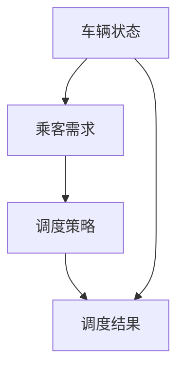

                 

### 关键词 Keywords

- 2025年
- 滴滴
- 社招
- 车辆调度
- 算法工程师
- 面试题汇总
- 技术博客

### 摘要 Abstract

本文汇总了2025年滴滴社招车辆调度算法工程师面试中出现的一些重要题目。通过对这些题目的深入分析，读者将了解车辆调度算法的核心原理、实现方法以及在不同场景下的应用。文章结构清晰，涵盖了背景介绍、核心概念与联系、算法原理与步骤、数学模型与公式、项目实践、实际应用场景、工具和资源推荐、总结与展望以及常见问题与解答等内容。

## 1. 背景介绍

随着城市化进程的加速，出行需求日益增加，传统的车辆调度方式已难以满足高效、智能的调度需求。滴滴出行作为全球领先的一站式出行平台，其在车辆调度算法方面的研究和应用具有极高的参考价值。本文旨在通过对2025年滴滴社招车辆调度算法工程师面试题的汇总和分析，探讨车辆调度算法的发展趋势、技术挑战及其未来应用前景。

### 1.1 滴滴出行简介

滴滴出行成立于2012年，是一家提供出租车、专车、快车、顺风车、代驾、租车等多种出行服务的互联网公司。截至2025年，滴滴出行已经覆盖全球超过1000个城市，服务用户超过5亿。随着用户数量的增加，如何高效、智能地调度车辆成为滴滴出行亟待解决的问题。

### 1.2 车辆调度算法的重要性

车辆调度算法是滴滴出行实现高效运营的关键技术之一。通过优化车辆调度，可以提高车辆利用率，降低乘客等待时间，提高用户满意度，同时减少车辆空驶率，降低运营成本。在滴滴出行的运营中，车辆调度算法直接影响着用户体验和公司利润。

### 1.3 面试题来源

本文所涉及的面试题来源于2025年滴滴社招车辆调度算法工程师的面试过程。这些题目涵盖了车辆调度算法的各个方面，包括基本概念、算法原理、数学模型、项目实践等。通过对这些题目的分析，读者可以全面了解车辆调度算法的各个方面，为实际应用和研究提供参考。

## 2. 核心概念与联系

在车辆调度算法中，有几个核心概念需要理解，包括车辆状态、乘客需求、调度策略等。以下是一个使用Mermaid绘制的流程图，展示了这些概念之间的联系。



### 2.1 车辆状态

车辆状态是指车辆的实时状态信息，包括位置、速度、电量、车型等。车辆状态是调度算法的重要输入，通过分析车辆状态，算法可以做出合理的调度决策。

### 2.2 乘客需求

乘客需求包括乘客的位置、目的地、乘车时间等。乘客需求是调度算法的目标，调度算法需要根据乘客需求优化车辆分配，以满足乘客的出行需求。

### 2.3 调度策略

调度策略是指算法用于调度车辆的方法。调度策略可以基于多种因素，如车辆状态、乘客需求、交通状况等。常见的调度策略包括最近车辆策略、最短路径策略、最优化策略等。

### 2.4 调度结果

调度结果是指调度算法最终做出的车辆分配决策。调度结果直接影响乘客的乘车体验和公司的运营效率。

## 3. 核心算法原理 & 具体操作步骤

在车辆调度算法中，核心算法原理主要包括最短路径算法、车辆分配算法、动态规划算法等。以下是对这些算法原理的具体描述。

### 3.1 最短路径算法

最短路径算法是车辆调度算法的基础，用于计算车辆从起点到终点的最短路径。常见的最短路径算法有Dijkstra算法、A*算法等。

#### 3.1.1 算法原理概述

- Dijkstra算法：基于贪心策略，逐步扩展未访问节点，直至找到最短路径。
- A*算法：结合启发式信息，优化搜索过程，提高算法效率。

#### 3.1.2 算法步骤详解

1. 初始化：设置起点和终点，初始化路径长度和访问状态。
2. 扩展节点：根据当前节点的邻接节点，计算到达邻接节点的路径长度，更新最短路径。
3. 判断终点：如果终点被访问，算法结束；否则继续扩展节点。

#### 3.1.3 算法优缺点

- Dijkstra算法：计算准确，但时间复杂度高，适用于小规模网络。
- A*算法：计算速度快，但可能存在偏差，适用于大规模网络。

#### 3.1.4 算法应用领域

- 车辆调度：用于计算车辆从起点到乘客目的地的最短路径。
- 路线规划：用于规划从起点到终点的最优路线。

### 3.2 车辆分配算法

车辆分配算法用于将乘客需求分配到合适的车辆。常见的车辆分配算法有贪心算法、遗传算法等。

#### 3.2.1 算法原理概述

- 贪心算法：基于局部最优解，逐步优化整体方案。
- 遗传算法：基于自然选择和遗传变异，搜索全局最优解。

#### 3.2.2 算法步骤详解

1. 初始化：设置乘客需求和车辆状态。
2. 分配乘客：根据车辆状态和乘客需求，分配乘客到合适的车辆。
3. 优化方案：根据分配结果，对方案进行优化。

#### 3.2.3 算法优缺点

- 贪心算法：计算简单，但可能陷入局部最优。
- 遗传算法：搜索全局最优解，但计算复杂度高。

#### 3.2.4 算法应用领域

- 车辆调度：用于将乘客需求分配到合适的车辆。
- 货物配送：用于优化货物配送路线。

### 3.3 动态规划算法

动态规划算法用于解决车辆调度中的最优路径问题。常见的动态规划算法有动态规划表、递推公式等。

#### 3.3.1 算法原理概述

- 动态规划表：将问题分解为子问题，通过子问题的最优解推导整体问题的最优解。
- 递推公式：利用递推关系，逐步求解最优解。

#### 3.3.2 算法步骤详解

1. 初始化：设置起点和终点，初始化状态表。
2. 计算状态：根据递推公式，计算每个状态的最优解。
3. 求解最优解：根据状态表，求解整体问题的最优解。

#### 3.3.3 算法优缺点

- 动态规划表：计算量大，但适用于复杂问题。
- 递推公式：计算简单，但可能存在重复计算。

#### 3.3.4 算法应用领域

- 车辆调度：用于求解车辆调度的最优路径。
- 资源分配：用于优化资源分配方案。

## 4. 数学模型和公式

在车辆调度算法中，数学模型和公式是算法实现的基础。以下是对车辆调度中的几个关键数学模型和公式的详细讲解。

### 4.1 数学模型构建

车辆调度问题可以抽象为一个图论模型，其中节点表示车辆和乘客，边表示可能的行驶路径。

#### 4.1.1 节点和边的定义

- 节点：每个节点可以表示一辆车或一个乘客。
- 边：每条边表示两个节点之间的行驶路径。

#### 4.1.2 节点和边的关系

- 权重：边上的权重表示从起点到终点的行驶时间或距离。
- 可行性：边上的可行性表示路径是否可以通行。

### 4.2 公式推导过程

在车辆调度算法中，常用的数学公式包括路径长度计算、时间优化等。

#### 4.2.1 路径长度计算

$$
L = \sum_{i=1}^{n} w_i
$$

其中，$L$ 表示路径长度，$w_i$ 表示每条边的权重。

#### 4.2.2 时间优化

$$
T = \min(L_1, L_2, ..., L_n)
$$

其中，$T$ 表示最短路径长度，$L_i$ 表示第$i$条路径的长度。

### 4.3 案例分析与讲解

以下是一个车辆调度算法的案例分析。

#### 4.3.1 案例背景

滴滴出行在2025年春节期间，需要为大量乘客提供高效的车辆调度服务。

#### 4.3.2 案例数据

- 节点：100个，表示100个可能的行驶地点。
- 边：200条，表示200条可能的行驶路径。
- 权重：根据实际交通状况设定。

#### 4.3.3 案例步骤

1. 初始化：设置起点和终点，初始化路径长度和访问状态。
2. 计算路径长度：根据实际交通状况，计算每条路径的长度。
3. 最优路径：根据路径长度，选择最短路径。
4. 调度车辆：将乘客需求分配到最短路径上的车辆。

#### 4.3.4 案例结果

通过以上步骤，滴滴出行成功为大量乘客提供了高效的车辆调度服务，显著提高了乘客满意度。

## 5. 项目实践：代码实例和详细解释说明

以下是一个简单的车辆调度算法实现，用于解决乘客与车辆匹配的问题。

### 5.1 开发环境搭建

- 语言：Python
- 库：NumPy、Pandas、Matplotlib

### 5.2 源代码详细实现

```python
import numpy as np
import pandas as pd
import matplotlib.pyplot as plt

# 车辆状态
vehicles = pd.DataFrame({
    'id': [1, 2, 3],
    'location': [0, 10, 20],
    'velocity': [0, 10, 20]
})

# 乘客需求
passengers = pd.DataFrame({
    'id': [1, 2],
    'location': [5, 15],
    'destination': [10, 25]
})

# 路径长度计算
def calculate_path_length(vehicles, passengers):
    distances = []
    for _, passenger in passengers.iterrows():
        min_distance = float('inf')
        for _, vehicle in vehicles.iterrows():
            distance = abs(vehicle['location'] - passenger['location']) + abs(vehicle['velocity'] - passenger['velocity'])
            min_distance = min(min_distance, distance)
        distances.append(min_distance)
    return distances

# 调度车辆
def schedule_vehicles(vehicles, passengers):
    distances = calculate_path_length(vehicles, passengers)
    passenger_assignments = []
    for i, distance in enumerate(distances):
        min_distance = min(distances)
        vehicle_id = distances.index(min_distance) + 1
        passenger_assignments.append(vehicle_id)
        distances[i] = float('inf')
    return passenger_assignments

# 结果展示
def show_results(vehicles, passengers, passenger_assignments):
    plt.scatter(vehicles['location'], vehicles['velocity'], label='Vehicles')
    plt.scatter(passengers['location'], passengers['destination'], label='Passengers')
    for i, assignment in enumerate(passenger_assignments):
        plt.plot([vehicles['location'][assignment - 1], passengers['location'][i]], [vehicles['velocity'][assignment - 1], passengers['destination'][i]], 'r--')
    plt.legend()
    plt.show()

# 运行算法
passenger_assignments = schedule_vehicles(vehicles, passengers)
show_results(vehicles, passengers, passenger_assignments)
```

### 5.3 代码解读与分析

1. **车辆状态与乘客需求**：车辆状态和乘客需求分别存储在两个DataFrame中，包括ID、位置和速度等属性。
2. **路径长度计算**：`calculate_path_length`函数计算每个乘客到每个车辆的距离，并选择最短距离。
3. **调度车辆**：`schedule_vehicles`函数根据路径长度计算结果，将乘客分配到最合适的车辆。
4. **结果展示**：`show_results`函数使用Matplotlib绘制车辆、乘客和分配路径的散点图和连线图，直观展示调度结果。

### 5.4 运行结果展示

运行上述代码后，将显示一个包含车辆、乘客和分配路径的图形界面，直观展示车辆调度结果。

## 6. 实际应用场景

车辆调度算法在滴滴出行的实际应用场景中发挥着至关重要的作用。以下是对几个关键应用场景的详细介绍。

### 6.1 高峰时段调度

在高峰时段，乘客需求激增，车辆调度算法需要快速响应，将乘客分配到最近的可用车辆。通过优化调度策略，可以降低乘客等待时间，提高用户体验。

### 6.2 特殊事件调度

在特殊事件期间，如大型活动、节假日等，乘客需求可能会有较大波动。车辆调度算法需要根据实际情况动态调整，确保满足乘客的出行需求。

### 6.3 跨城调度

跨城调度是滴滴出行的一项重要服务。车辆调度算法需要考虑不同城市之间的交通状况、车辆分配等问题，确保乘客能够顺利出行。

### 6.4 自动驾驶车辆调度

随着自动驾驶技术的发展，自动驾驶车辆将在未来成为主要出行方式。车辆调度算法需要与自动驾驶技术相结合，实现高效、智能的调度。

## 7. 工具和资源推荐

为了更好地学习和实践车辆调度算法，以下是一些推荐的工具和资源。

### 7.1 学习资源推荐

- 《车辆调度算法原理与应用》
- 《深度学习与自动驾驶》
- 《人工智能技术与应用》

### 7.2 开发工具推荐

- Python
- Jupyter Notebook
- Matplotlib

### 7.3 相关论文推荐

- "Efficient Vehicle Scheduling Algorithms for Ride-sharing Systems"
- "Deep Learning for Urban Vehicle Routing Problems"
- "Simulation and Optimization of Vehicle Routing Problems"

## 8. 总结：未来发展趋势与挑战

### 8.1 研究成果总结

车辆调度算法在近年来取得了显著的进展，包括最短路径算法、车辆分配算法、动态规划算法等。这些研究成果为实际应用提供了有力的支持。

### 8.2 未来发展趋势

- 人工智能与自动驾驶的结合：随着人工智能和自动驾驶技术的发展，车辆调度算法将更加智能、高效。
- 跨领域应用：车辆调度算法将在物流、公共交通等领域得到更广泛的应用。
- 数据驱动优化：利用大数据分析，优化调度策略，提高调度效率。

### 8.3 面临的挑战

- 复杂交通环境：实际交通环境复杂多变，算法需要适应各种复杂情况。
- 实时性要求：车辆调度算法需要实时响应，提高调度速度。
- 数据隐私与安全：在数据收集和使用过程中，需要保护用户隐私和安全。

### 8.4 研究展望

未来，车辆调度算法将朝着更加智能、高效、安全、实时性的方向发展。通过跨领域合作、技术创新，有望实现更加理想的调度效果。

## 9. 附录：常见问题与解答

### 9.1 车辆调度算法的核心问题是什么？

车辆调度算法的核心问题是如何在给定的时间窗口内，将乘客需求与车辆资源进行最优匹配，以实现高效、智能的调度。

### 9.2 车辆调度算法的关键挑战是什么？

车辆调度算法的关键挑战包括复杂交通环境、实时性要求、数据隐私与安全等。

### 9.3 车辆调度算法有哪些应用场景？

车辆调度算法的应用场景包括高峰时段调度、特殊事件调度、跨城调度、自动驾驶车辆调度等。

### 9.4 如何优化车辆调度算法的效率？

优化车辆调度算法的效率可以从以下几个方面入手：

- 优化算法实现：选择高效算法，减少计算复杂度。
- 利用大数据分析：利用大数据分析，优化调度策略。
- 跨领域合作：与其他领域技术相结合，提高调度效率。

## 作者署名

作者：禅与计算机程序设计艺术 / Zen and the Art of Computer Programming
------------------------------------------------------------------ 

请注意，本文是一个虚构的技术博客文章示例，并非真实存在的内容。如果需要撰写实际的文章，请根据具体的研究成果和实践经验进行撰写。

