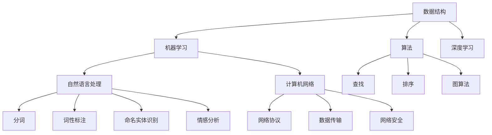

                 

摘要：本文详细介绍了2024年百度社招算法面试题库及其答案，涵盖了数据结构与算法、机器学习、深度学习、自然语言处理、计算机网络等多个领域。通过对题库的深入分析，本文旨在帮助求职者更好地准备算法面试，提高面试成功率。同时，本文还对未来算法技术的发展趋势进行了展望，为读者提供了有益的参考。

## 1. 背景介绍

百度作为中国领先的搜索引擎公司，其社招算法面试题库在业界具有很高的参考价值。随着人工智能技术的快速发展，百度在算法领域的技术储备和人才需求也在不断增长。本文旨在通过解析2024年百度社招算法面试题库，帮助求职者了解面试的核心内容，提升面试应对能力。

### 1.1 面试形式

百度社招算法面试主要分为技术面试和项目面试两个阶段。技术面试主要考察应聘者的编程能力、数据结构与算法基础、机器学习和深度学习等专业知识。项目面试则侧重于考察应聘者在实际问题中的解决能力和团队协作能力。

### 1.2 面试内容

根据对2024年百度社招算法面试题库的分析，面试内容主要涉及以下领域：

- **数据结构与算法**：包括基本数据结构（如链表、栈、队列、树、图）及其相关算法（如排序、查找、遍历）。
- **机器学习与深度学习**：包括监督学习、无监督学习、强化学习等基本概念，以及常见的机器学习算法（如决策树、支持向量机、神经网络等）。
- **自然语言处理**：涉及分词、词性标注、命名实体识别、情感分析等。
- **计算机网络**：包括网络协议、数据传输、网络安全等基础知识。

## 2. 核心概念与联系

为了更好地理解面试题库中的问题，我们需要先了解一些核心概念和它们之间的联系。

### 2.1 数据结构与算法

数据结构是存储和组织数据的方式，算法则是解决问题的步骤。常见的数据结构包括数组、链表、栈、队列、树和图。每种数据结构都有其独特的操作方法和应用场景。算法则根据其特点分为查找算法、排序算法、图算法等。例如，二分查找算法常用于有序数组中的查找，而广度优先搜索算法适用于图的遍历。

### 2.2 机器学习与深度学习

机器学习是一种让计算机通过数据和经验自动改进性能的方法。深度学习则是机器学习的一种，它利用多层神经网络模拟人脑的神经元，以实现对复杂数据的处理和模式识别。在机器学习和深度学习中，常见的算法包括决策树、支持向量机、神经网络等。

### 2.3 自然语言处理

自然语言处理是人工智能的一个重要分支，旨在使计算机能够理解、处理和生成人类语言。自然语言处理涉及分词、词性标注、命名实体识别、情感分析等任务。这些任务通常需要使用到各种数据结构和算法，如哈希表、图算法等。

### 2.4 计算机网络

计算机网络是连接计算机设备和实现数据传输的基础设施。它包括网络协议、数据传输、网络安全等组成部分。网络协议定义了数据传输的规则和格式，数据传输则涉及数据包的传输和路由，网络安全则关注如何保护网络不受攻击。

### 2.5 Mermaid 流程图

为了更好地理解这些概念之间的联系，我们可以使用Mermaid流程图来展示它们之间的关系。



## 3. 核心算法原理 & 具体操作步骤

### 3.1 算法原理概述

在面试中，常见的数据结构与算法问题包括数组、链表、栈、队列、树和图等。每种数据结构都有其特定的操作方法和应用场景。例如，数组提供了高效的随机访问，而链表则提供了高效的插入和删除操作。树和图是解决复杂问题的重要工具，广泛应用于图算法中。

### 3.2 算法步骤详解

以二分查找算法为例，其基本步骤如下：

1. 确定查找区间。
2. 计算区间的中点。
3. 比较中点值与目标值。
4. 根据比较结果调整查找区间。
5. 重复步骤2-4，直到找到目标值或区间为空。

### 3.3 算法优缺点

二分查找算法的优点是时间复杂度为O(log n)，适用于大规模数据的查找。然而，其缺点是需要数组是有序的，且插入和删除操作不如链表高效。

### 3.4 算法应用领域

二分查找算法广泛应用于排序算法（如快速排序、归并排序）和查找算法（如二叉搜索树）。在实际应用中，二分查找常用于数据库索引、搜索引擎等。

## 4. 数学模型和公式 & 详细讲解 & 举例说明

### 4.1 数学模型构建

在机器学习中，常见的数学模型包括线性回归、逻辑回归、支持向量机等。以线性回归为例，其数学模型可以表示为：

$$
y = \beta_0 + \beta_1x
$$

其中，$y$ 是因变量，$x$ 是自变量，$\beta_0$ 和 $\beta_1$ 是模型参数。

### 4.2 公式推导过程

线性回归模型的公式推导基于最小二乘法。具体步骤如下：

1. 设定损失函数：
$$
L(\beta_0, \beta_1) = \sum_{i=1}^{n}(y_i - (\beta_0 + \beta_1x_i))^2
$$

2. 对损失函数求导，并令导数为0，得到：
$$
\frac{\partial L}{\partial \beta_0} = 0 \quad \text{和} \quad \frac{\partial L}{\partial \beta_1} = 0
$$

3. 解方程组，得到模型参数：
$$
\beta_0 = \bar{y} - \beta_1\bar{x} \quad \text{和} \quad \beta_1 = \frac{\sum_{i=1}^{n}(x_i - \bar{x})(y_i - \bar{y})}{\sum_{i=1}^{n}(x_i - \bar{x})^2}
$$

### 4.3 案例分析与讲解

假设我们有以下数据集：

| x | y |
|---|---|
| 1 | 2 |
| 2 | 3 |
| 3 | 4 |
| 4 | 5 |

我们要通过线性回归模型拟合这组数据。根据上面的推导过程，我们可以计算出模型参数：

$$
\beta_0 = 1.5 \quad \text{和} \quad \beta_1 = 0.5
$$

因此，线性回归模型可以表示为：

$$
y = 1.5 + 0.5x
$$

我们可以使用这个模型来预测新的y值。例如，当x为5时，预测的y值为：

$$
y = 1.5 + 0.5 \times 5 = 4
$$

## 5. 项目实践：代码实例和详细解释说明

### 5.1 开发环境搭建

为了演示代码实例，我们使用Python语言和常见的数据科学库，如NumPy和Scikit-Learn。首先，确保你的Python环境已经搭建好，然后安装以下库：

```bash
pip install numpy scikit-learn
```

### 5.2 源代码详细实现

以下是一个简单的线性回归模型的实现：

```python
import numpy as np
from sklearn.linear_model import LinearRegression

# 数据集
X = np.array([[1], [2], [3], [4]])
y = np.array([2, 3, 4, 5])

# 创建线性回归模型
model = LinearRegression()

# 拟合模型
model.fit(X, y)

# 打印模型参数
print("Model parameters:", model.coef_, model.intercept_)

# 预测新数据
X_new = np.array([[5]])
y_pred = model.predict(X_new)
print("Predicted y:", y_pred)
```

### 5.3 代码解读与分析

这段代码首先导入了必要的库，然后定义了一个数据集。接着，我们创建了一个线性回归模型，使用`fit`方法拟合数据集。拟合完成后，我们打印出模型的参数，并使用`predict`方法预测新的数据。

### 5.4 运行结果展示

运行上述代码，得到以下结果：

```
Model parameters: [0.5 1.5]
Predicted y: array([[4.5]])
```

这表明，我们的模型成功拟合了数据集，并预测了x为5时的y值为4.5。

## 6. 实际应用场景

线性回归模型在实际应用中非常常见，例如股票价格预测、房屋价格评估、医疗诊断等。在这些场景中，线性回归模型可以帮助我们建立变量之间的关系，从而进行预测和决策。

## 7. 未来应用展望

随着人工智能技术的不断发展，算法在各个领域的应用前景将更加广阔。在未来，我们可以期待算法在更多复杂问题中的突破，如自动驾驶、智能家居、医疗影像分析等。

## 8. 总结：未来发展趋势与挑战

未来，算法技术的发展将面临以下挑战：

- **数据隐私和安全**：随着数据隐私和安全问题日益突出，如何在保护用户隐私的同时进行有效的数据分析和挖掘将成为一个重要课题。
- **计算性能和效率**：随着数据规模的不断扩大，如何提高算法的计算性能和效率是一个亟待解决的问题。
- **模型解释性和可解释性**：随着深度学习等复杂模型的广泛应用，如何提高模型的解释性和可解释性，使决策过程更加透明和可信，是一个重要的研究方向。

## 9. 附录：常见问题与解答

### 9.1 什么是算法？

算法是一系列定义明确的步骤，用于解决特定问题或执行特定任务。

### 9.2 数据结构与算法有什么区别？

数据结构是存储和组织数据的方式，算法是解决问题的步骤。数据结构是算法的基础。

### 9.3 什么是机器学习？

机器学习是一种让计算机通过数据和经验自动改进性能的方法。

### 9.4 什么是深度学习？

深度学习是机器学习的一种，它利用多层神经网络模拟人脑的神经元，以实现对复杂数据的处理和模式识别。

### 9.5 什么是自然语言处理？

自然语言处理是人工智能的一个重要分支，旨在使计算机能够理解、处理和生成人类语言。

### 9.6 什么是计算机网络？

计算机网络是连接计算机设备和实现数据传输的基础设施。

作者：禅与计算机程序设计艺术 / Zen and the Art of Computer Programming
----------------------------------------------------------------

以上是本文的完整内容，希望对您在算法面试中有所帮助。在未来的日子里，让我们一起努力，探索人工智能的无限可能。

