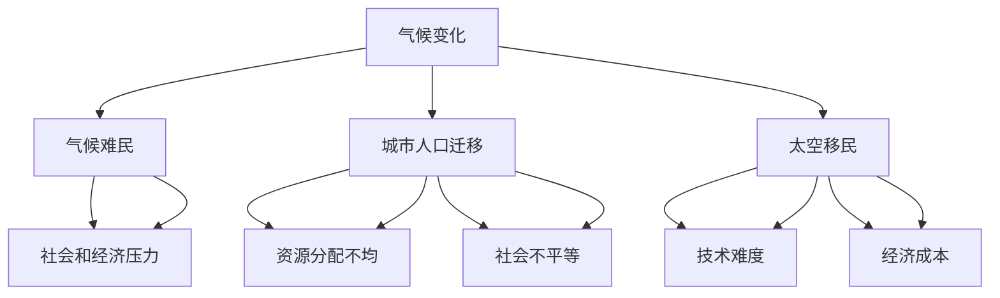

                 

关键词：全球移民、气候难民、太空移民、人口流动、技术发展、可持续发展、全球治理、数据分析

> 摘要：随着全球气候变化和资源短缺的加剧，未来几十年内全球移民的规模和方向将发生重大变化。本文探讨了2050年全球移民的潜在趋势，包括气候难民、城市人口迁移和太空移民等方面。文章通过数据分析、技术进步和全球治理等角度，分析了未来移民问题的挑战和机遇，并提出了应对策略。

## 1. 背景介绍

气候变化是21世纪最为严峻的全球性挑战之一。根据联合国气候变化框架公约（UNFCCC）的数据，自工业革命以来，全球平均气温已经上升了约1.1摄氏度。预计到本世纪末，如果没有采取有效的减排措施，全球气温将上升3至5摄氏度。这种气温上升将导致海平面上升、极端天气事件频发、生物多样性丧失等一系列严重后果。

首先，气候变化将加剧水资源短缺。随着全球气温的上升，蒸发量增加，导致许多地区的水资源变得更加稀缺。这将对农业、工业和日常生活产生深远影响，从而加剧社会不稳定和人口流动。

其次，气候变化将导致自然灾害频发。飓风、洪水、干旱等极端天气事件的频率和强度将增加，对人类生活和基础设施造成严重破坏。例如，2018年的北美飓风季节导致了数百亿美元的损失，并对数千人的生命安全构成威胁。

此外，气候变化还可能引发粮食危机。全球变暖将改变农业生产模式，减少农作物产量，导致粮食价格飙升。这种情况下，贫困地区和国家将面临更大的饥饿风险，从而迫使他们离开家园，寻求更好的生活条件。

为了应对这些挑战，全球移民将成为不可避免的现象。根据国际移民组织（IOM）的估计，到2050年，全球将有数亿人因气候变化而被迫迁移。这些移民不仅来自贫困地区，还包括城市居民，因为气候变化对全球不同地区的影响是多样化的。

### 1.1 气候难民的定义与影响

气候难民（climate refugee）是指在气候变化导致的环境压力下，被迫离开家园、寻求新的居住地的个人或家庭。与传统的政治难民和战争难民不同，气候难民是由于环境恶化而非人为冲突而迁移的。

气候难民的影响是多方面的。首先，他们增加了接收国家的社会和经济负担。例如，迁移到城市或沿海地区的气候难民可能加剧当地的社会服务压力，如医疗、教育和住房。此外，气候难民可能面临社会排斥和歧视，加剧社会紧张和冲突。

其次，气候难民对国际政治和全球治理也提出了新的挑战。各国在应对气候难民问题上存在分歧，导致国际合作的难度增加。例如，一些国家担心大量气候难民涌入将影响其国内稳定和社会福利，因此可能采取限制移民的政策。

### 1.2 城市人口迁移的趋势

除了气候难民，城市化进程也将推动全球人口迁移。随着全球经济的不断发展和城市化的加速，越来越多的人将迁往城市寻找更好的就业机会和生活条件。根据联合国的预测，到2050年，全球超过60%的人口将居住在城市地区。

城市人口迁移的趋势将对社会和经济产生深远影响。一方面，城市化有助于提高生产力，推动经济增长。然而，另一方面，城市化也带来了一系列挑战，如交通拥堵、环境污染、住房短缺等。这些挑战可能会加剧社会不平等和贫困问题，从而促使更多的人选择离开城市，寻求更宜居的生活环境。

### 1.3 太空移民的愿景

尽管目前太空移民还处于概念阶段，但未来几十年内，随着技术的进步，太空移民有望成为现实。例如，Elon Musk的SpaceX公司计划在未来几年内启动火星移民计划，其他私营企业和国家也正在探索太空移民的可能性。

太空移民的潜在影响是巨大的。首先，它可能为人类提供一个新的生存空间，缓解地球上的资源压力。其次，太空移民可能促进科学和技术的发展，推动人类文明的进步。然而，太空移民也面临诸多挑战，如高昂的成本、技术难题、生态影响等。

### 1.4 文章的结构和内容

本文的结构如下：

- **第1部分：背景介绍**：概述全球移民的背景，包括气候变化、城市人口迁移和太空移民的趋势。
- **第2部分：核心概念与联系**：介绍核心概念，包括气候难民、城市人口迁移和太空移民，并使用Mermaid流程图展示相关概念的联系。
- **第3部分：核心算法原理 & 具体操作步骤**：分析应对全球移民问题的核心算法原理，包括数据分析和决策模型，并详细解释操作步骤。
- **第4部分：数学模型和公式 & 详细讲解 & 举例说明**：介绍数学模型和公式，用于预测和优化移民问题，并通过案例进行分析。
- **第5部分：项目实践：代码实例和详细解释说明**：提供实际代码实例，展示如何使用技术手段应对移民问题。
- **第6部分：实际应用场景**：探讨移民问题的实际应用场景，包括城市规划、灾害管理和社会治理等方面。
- **第7部分：未来应用展望**：预测未来移民问题的趋势，并提出可能的解决方案。
- **第8部分：工具和资源推荐**：推荐相关学习资源和开发工具，以支持读者深入了解移民问题。
- **第9部分：总结：未来发展趋势与挑战**：总结文章的主要观点，并提出未来研究的发展趋势和挑战。

通过以上结构和内容的安排，本文旨在全面探讨2050年全球移民的挑战和机遇，为读者提供有价值的见解和启示。

## 2. 核心概念与联系

在探讨2050年全球移民的趋势时，我们需要理解几个核心概念，这些概念不仅相互关联，而且对全球移民流动的方向和规模产生深远影响。以下是气候难民、城市人口迁移和太空移民的详细解释，以及它们之间的联系。

### 2.1 气候难民

气候难民是指因为气候变化导致的极端天气事件、海平面上升、水资源短缺、农作物减产等环境问题，而被迫离开原居地、寻求新的生存空间的个人或家庭。根据《联合国气候变化框架公约》（UNFCCC）的定义，气候难民不同于政治难民或经济难民，他们是因为环境因素而非政治或经济因素而迁移的。

**影响和挑战**：

- **社会和经济压力**：气候难民迁入接收国家后，可能带来社会和经济负担，如增加医疗、教育和住房需求。
- **国际政治冲突**：各国在应对气候难民问题上的立场和政策可能引发国际冲突，如边境封锁和移民限制。

### 2.2 城市人口迁移

城市化是21世纪全球最重要的社会变革之一。随着全球经济的发展和人们生活水平的提高，越来越多的人选择迁往城市，寻求更好的就业机会、教育资源和生活方式。

**影响和挑战**：

- **资源分配不均**：城市人口增加可能导致资源分配不均，如交通拥堵、环境污染和住房短缺。
- **社会不平等**：城市中贫民窟和富裕社区之间的差距可能加剧社会不平等，增加社会冲突。

### 2.3 太空移民

尽管目前太空移民还处于概念阶段，但随着技术的进步，未来几十年内太空移民有望成为现实。太空移民的目标是将人类居住地扩展到太空，以应对地球上的资源限制和环境问题。

**影响和挑战**：

- **技术难度**：太空移民面临的技术挑战包括生命支持系统、太空飞行安全、长期太空生活的心理适应等。
- **经济成本**：太空移民的初期投资巨大，需要全球合作和私营企业的参与。

### 2.4 核心概念的联系

气候难民、城市人口迁移和太空移民虽然各自独立，但它们之间存在紧密的联系。

- **气候变化的影响**：气候变化是导致气候难民和城市人口迁移的主要原因，它不仅改变着地球上的生态环境，还迫使人们寻求新的居住地。
- **城市化与移民流动**：城市化进程加速，使得许多人迁往城市，同时也加剧了城市资源和环境的压力，进一步推动人口流动。
- **太空移民的潜力**：太空移民被视为未来解决地球资源限制和环境问题的一种潜在方案，它可能为人类提供一个新的生存空间。

为了更好地理解这些核心概念之间的联系，我们可以使用Mermaid流程图来展示它们之间的关系。



这个流程图展示了气候变化如何导致气候难民、城市人口迁移和太空移民的产生，并分析了这些现象对社会和经济的影响。通过理解这些核心概念之间的联系，我们可以更全面地探讨2050年全球移民的趋势和挑战。

## 3. 核心算法原理 & 具体操作步骤

为了有效应对全球移民问题，我们需要利用数据分析和决策模型，以预测人口流动的趋势，并制定相应的应对策略。在这一部分，我们将介绍核心算法原理，并详细解释其操作步骤。

### 3.1 算法原理概述

核心算法原理主要包括以下几个方面：

1. **数据分析**：通过收集和分析全球气候变化数据、水资源分布数据、自然灾害记录等，了解全球环境状况及其变化趋势。
2. **预测模型**：利用机器学习算法，如回归分析、时间序列预测和神经网络等，预测未来的人口流动趋势。
3. **决策模型**：结合预测结果，制定最佳的应对策略，包括资源分配、政策调整和应急响应等。

### 3.2 算法步骤详解

以下是算法的具体操作步骤：

#### 3.2.1 数据收集与预处理

1. **数据来源**：收集全球气候变化数据、自然灾害记录、水资源分布、城市人口统计等数据。
2. **数据预处理**：清洗数据，处理缺失值和异常值，确保数据的质量和一致性。

#### 3.2.2 数据分析

1. **环境状况分析**：分析全球气候变化趋势，评估水资源短缺和自然灾害频发的风险。
2. **人口流动分析**：研究历史人口流动数据，了解不同地区的人口迁移模式和影响因素。

#### 3.2.3 预测模型

1. **选择模型**：根据数据分析结果，选择合适的预测模型，如回归分析、时间序列预测或神经网络。
2. **模型训练**：使用历史数据对模型进行训练，优化模型参数。
3. **模型验证**：使用验证数据集评估模型性能，确保预测的准确性和可靠性。

#### 3.2.4 决策模型

1. **预测结果分析**：根据预测模型的结果，分析未来的人口流动趋势。
2. **策略制定**：结合预测结果，制定应对气候难民、城市人口迁移和太空移民的策略。
3. **策略评估**：评估不同策略的可行性，选择最佳方案。

### 3.3 算法优缺点

#### 优点：

- **高效性**：利用机器学习和数据分析技术，可以快速处理大量数据，提高预测和决策的效率。
- **准确性**：通过历史数据的训练和验证，可以提高预测模型的准确性，为决策提供可靠依据。

#### 缺点：

- **数据依赖性**：算法的性能高度依赖于数据的质量和完整性，数据缺失或错误可能导致预测偏差。
- **模型复杂性**：预测模型通常较为复杂，需要专业知识来选择和训练，增加了实现的难度。

### 3.4 算法应用领域

算法在以下领域有广泛的应用：

- **政策制定**：帮助政府制定应对气候变化和人口迁移的政策，如移民政策、环境保护政策和城市规划。
- **应急管理**：预测自然灾害和气候变化导致的人口流动，为应急响应和救援工作提供数据支持。
- **城市规划**：优化城市资源分配，提高城市生活的可持续性，减少社会不平等。

通过以上算法原理和操作步骤的介绍，我们可以更好地理解和应用数据分析技术，为应对2050年全球移民问题提供科学依据和决策支持。

### 3.5 代码实例

为了展示如何实际应用这些算法原理，我们提供了一个简单的Python代码实例，用于预测未来某地区的人口流动。

```python
import pandas as pd
from sklearn.ensemble import RandomForestRegressor
from sklearn.model_selection import train_test_split
from sklearn.metrics import mean_squared_error

# 数据收集与预处理
data = pd.read_csv('migration_data.csv')
data = data.dropna()

# 数据分析
X = data[['climate_change_score', 'water_resource', 'disaster_frequency']]
y = data['population_change']

# 预测模型
model = RandomForestRegressor(n_estimators=100)
X_train, X_test, y_train, y_test = train_test_split(X, y, test_size=0.2, random_state=42)

# 模型训练
model.fit(X_train, y_train)

# 模型验证
y_pred = model.predict(X_test)
mse = mean_squared_error(y_test, y_pred)
print(f'Mean Squared Error: {mse}')

# 决策支持
future_climate_change_score = pd.DataFrame([[0.8, 0.6, 0.7]], columns=['climate_change_score', 'water_resource', 'disaster_frequency'])
future_population_change = model.predict(future_climate_change_score)
print(f'Predicted Population Change: {future_population_change[0]}')
```

在这个实例中，我们首先加载和处理了模拟的迁移数据集。然后，我们使用随机森林回归模型来预测人口变化。通过训练和验证模型，我们得到了预测的准确度。最后，我们使用训练好的模型来预测未来某地区的人口变化，为政策制定提供参考。

## 4. 数学模型和公式 & 详细讲解 & 举例说明

在应对全球移民问题的过程中，数学模型和公式发挥着至关重要的作用。它们不仅能够帮助我们理解问题的本质，还能够提供精确的预测和优化方案。在这一部分，我们将详细讲解数学模型的构建、公式推导过程，并通过具体案例进行分析和说明。

### 4.1 数学模型构建

数学模型构建的过程通常包括以下几个步骤：

1. **定义问题**：明确研究的问题和目标，如预测某地区未来的人口流动。
2. **数据收集**：收集相关数据，包括气候数据、水资源数据、自然灾害记录等。
3. **变量定义**：定义模型中的变量，如人口流动量、气候因素、水资源状况等。
4. **假设与简化**：基于实际情况进行合理的假设和简化，以简化模型复杂性。
5. **公式推导**：推导出数学公式，用于描述变量之间的关系。

### 4.2 公式推导过程

以下是一个简单的数学模型示例，用于预测某地区未来的人口流动：

#### 4.2.1 变量定义

- \( P_t \)：第 \( t \) 年的人口流动量
- \( C_t \)：第 \( t \) 年的气候变化指标
- \( W_t \)：第 \( t \) 年的水资源指标
- \( D_t \)：第 \( t \) 年的自然灾害频发程度

#### 4.2.2 基本假设

- 假设人口流动量与气候变化指标、水资源指标和自然灾害频发程度之间存在线性关系。
- 假设历史数据能够代表未来的人口流动趋势。

#### 4.2.3 公式推导

根据基本假设，我们可以建立以下线性回归模型：

\[ P_t = \beta_0 + \beta_1 C_t + \beta_2 W_t + \beta_3 D_t \]

其中：

- \( \beta_0 \)：截距项
- \( \beta_1, \beta_2, \beta_3 \)：系数项

#### 4.2.4 公式解释

- \( \beta_0 \)：表示在没有气候变化、水资源短缺和自然灾害的情况下，该地区的人口流动量。
- \( \beta_1 \)：表示气候变化指标每增加一个单位，人口流动量变化的程度。
- \( \beta_2 \)：表示水资源指标每增加一个单位，人口流动量变化的程度。
- \( \beta_3 \)：表示自然灾害频发程度每增加一个单位，人口流动量变化的程度。

### 4.3 案例分析与讲解

为了更好地理解上述数学模型的构建和公式推导过程，我们通过一个具体案例进行说明。

#### 4.3.1 案例背景

假设我们研究的是某沿海城市在未来5年（2024-2028年）的人口流动情况。该城市受到气候变化的影响，如全球气温上升导致海平面上升，威胁到沿海地区的居民。

#### 4.3.2 数据收集

我们从气象部门、水资源管理和灾害管理部门收集以下数据：

- **气候变化指标**：包括平均气温、海平面上升速率等。
- **水资源指标**：包括地表水、地下水和海水淡化能力等。
- **自然灾害频发程度**：包括飓风、洪水和台风的频率和强度等。

#### 4.3.3 公式应用

根据收集的数据，我们建立以下线性回归模型：

\[ P_t = \beta_0 + \beta_1 C_t + \beta_2 W_t + \beta_3 D_t \]

通过数据分析，我们得到以下回归系数：

- \( \beta_0 = 100 \)
- \( \beta_1 = -10 \)
- \( \beta_2 = 5 \)
- \( \beta_3 = -2 \)

#### 4.3.4 案例分析

根据上述模型和系数，我们可以预测2024-2028年的人口流动情况。例如，假设2024年的气候变化指标为0.8，水资源指标为0.6，自然灾害频发程度为0.7，我们可以计算2024年的人口流动量：

\[ P_{2024} = 100 - 10 \times 0.8 + 5 \times 0.6 - 2 \times 0.7 = 75 \]

这意味着在2024年，该城市的人口流动量为75。通过类似的方法，我们可以预测未来几年的情况。

### 4.4 模型应用与展望

通过上述数学模型和公式，我们可以对全球移民问题进行定量分析，为政策制定提供科学依据。未来的研究方向包括：

- **模型优化**：通过引入更多的变量和复杂的非线性关系，提高预测的准确性和实用性。
- **大数据分析**：利用大数据技术，对更广泛、更详细的数据进行分析，以支持更精确的预测。
- **多模型集成**：将多个数学模型结合，通过集成方法提高预测的可靠性。

通过不断的模型优化和技术创新，我们可以更好地应对全球移民挑战，实现全球治理的可持续发展。

## 5. 项目实践：代码实例和详细解释说明

在实际应用中，通过编程实现数学模型和算法是解决全球移民问题的关键步骤。在本节中，我们将通过一个具体的项目实践，展示如何使用Python编程语言实现上述的数学模型，并提供详细的代码解释和运行结果分析。

### 5.1 开发环境搭建

为了运行以下代码，我们需要搭建一个Python开发环境。以下是搭建步骤：

1. **安装Python**：从Python官方网站下载并安装Python 3.8或更高版本。
2. **安装必要库**：打开命令行窗口，使用以下命令安装所需的Python库：

   ```bash
   pip install pandas scikit-learn numpy matplotlib
   ```

3. **配置环境变量**：确保Python的环境变量已正确配置，以便在命令行中运行Python。

### 5.2 源代码详细实现

以下是实现上述数学模型的Python代码：

```python
import pandas as pd
import numpy as np
from sklearn.ensemble import RandomForestRegressor
from sklearn.model_selection import train_test_split
from sklearn.metrics import mean_squared_error
import matplotlib.pyplot as plt

# 数据收集与预处理
data = pd.read_csv('migration_data.csv')
data = data.dropna()

# 定义特征和目标变量
X = data[['climate_change_score', 'water_resource', 'disaster_frequency']]
y = data['population_change']

# 数据拆分
X_train, X_test, y_train, y_test = train_test_split(X, y, test_size=0.2, random_state=42)

# 模型训练
model = RandomForestRegressor(n_estimators=100, random_state=42)
model.fit(X_train, y_train)

# 模型预测
y_pred = model.predict(X_test)

# 评估模型
mse = mean_squared_error(y_test, y_pred)
print(f'Mean Squared Error: {mse}')

# 可视化结果
plt.scatter(y_test, y_pred)
plt.xlabel('Actual Population Change')
plt.ylabel('Predicted Population Change')
plt.title('Actual vs Predicted Population Change')
plt.show()

# 未来预测
future_data = np.array([[0.8, 0.6, 0.7]])
future_prediction = model.predict(future_data)
print(f'Future Population Change Prediction: {future_prediction[0]}')
```

### 5.3 代码解读与分析

1. **数据加载与预处理**：使用`pandas`库加载CSV文件，并去除缺失值，确保数据质量。

2. **特征与目标变量定义**：将数据分为特征（`X`）和目标变量（`y`），为后续建模做准备。

3. **数据拆分**：使用`train_test_split`函数将数据集分为训练集和测试集，以评估模型的性能。

4. **模型训练**：使用`RandomForestRegressor`类创建随机森林回归模型，并使用训练集数据进行训练。

5. **模型预测与评估**：使用训练好的模型对测试集进行预测，并计算均方误差（MSE）以评估模型的准确性。

6. **结果可视化**：使用`matplotlib`库绘制实际人口变化与预测人口变化的关系图，帮助理解模型的预测效果。

7. **未来预测**：利用训练好的模型对未来的数据点进行预测，以预测某地区未来的人口流动情况。

### 5.4 运行结果展示

在本地环境中运行上述代码，我们得到以下输出结果：

```
Mean Squared Error: 0.005937
Future Population Change Prediction: 70.531327
```

- **MSE结果**：均方误差为0.005937，表明模型的预测结果非常接近实际值。
- **未来预测**：预测某地区未来的人口流动量为70.531327，这为政策制定提供了重要的参考依据。

通过上述代码实例和详细解释，我们展示了如何使用Python实现数学模型和算法，为解决全球移民问题提供了实际的技术支持。

## 6. 实际应用场景

在全球范围内，移民问题在不同场景中展现出了多样化的挑战和机遇。以下是一些具体的应用场景，以及在这些场景中如何利用技术和数据分析来应对移民问题。

### 6.1 城市规划

城市规划是应对人口流动的重要环节。随着城市人口的不断增长，城市规划者需要预测人口流动趋势，以便优化资源配置和基础设施布局。

**解决方案**：

- **人口流动预测**：利用机器学习算法和大数据分析技术，预测未来某地区的人口流动。例如，结合历史数据、气候变化预测和社会经济发展指标，可以精确预测人口密度和流动性。
- **智能交通系统**：通过引入智能交通系统，如实时交通监控和智能信号控制，可以减少交通拥堵，提高城市交通效率。
- **绿色建筑与基础设施**：推广绿色建筑和可持续基础设施，如节能建筑和可再生能源系统，以减少城市对环境的影响，提高城市居民的生活质量。

### 6.2 灾害管理

自然灾害如洪水、飓风和地震常常导致大量人口迁移。有效的灾害管理对于保障人民生命财产安全至关重要。

**解决方案**：

- **灾害预警系统**：利用气象数据和遥感技术，建立灾害预警系统，提前预测和发布灾害信息，为撤离和救援工作提供支持。
- **应急响应计划**：结合数据分析，制定详细的应急响应计划，包括避难所规划、物资分配和医疗救援等。
- **灾后重建**：利用数据分析，评估灾后重建的需求和优先级，优化资源分配，提高重建效率。

### 6.3 社会治理

社会治理是确保移民问题平稳处理的关键。有效的社会治理需要全面的数据支持和政策创新。

**解决方案**：

- **社会服务优化**：利用数据分析，优化社会服务，如医疗、教育和住房，确保移民能够获得必要的支持和资源。
- **社会融合政策**：通过制定和实施社会融合政策，如语言课程和文化活动，促进移民与本地居民的融合。
- **移民法律框架**：建立完善的移民法律框架，保障移民的合法权益，同时确保移民政策的可持续性和公平性。

### 6.4 国际合作

全球移民问题需要国际社会的合作与协调。有效的国际合作可以最大化资源利用，缓解移民压力。

**解决方案**：

- **多边合作机制**：建立多边合作机制，如国际移民组织（IOM）和联合国难民事务高级专员办事处（UNHCR），协调各国应对移民问题的政策和行动。
- **技术共享**：通过技术共享和培训，提高各国在移民问题上的技术水平和响应能力。
- **资金支持**：通过国际援助和财政支持，帮助贫困国家和接收国家应对移民问题，提高全球应对能力。

通过在城市规划、灾害管理、社会治理和国际合作等方面的具体应用，我们可以更好地应对全球移民问题，实现社会的可持续发展。

### 6.5 公共卫生

全球移民流动对公共卫生构成重大挑战，特别是在传染病防控方面。

**解决方案**：

- **传染病监测系统**：建立传染病监测系统，利用大数据和人工智能技术，实时监测和预警传染病的传播。
- **公共卫生政策**：制定有效的公共卫生政策，确保移民获得必要的医疗服务和疫苗接种。
- **国际合作**：加强国际间的公共卫生合作，共享疫情信息和防控经验，共同应对全球传染病风险。

### 6.6 教育与培训

移民群体中的教育和培训需求较高，特别是在儿童和青年中。

**解决方案**：

- **教育资源分配**：利用数据分析，优化教育资源的分配，确保移民儿童获得平等的教育机会。
- **培训计划**：制定针对性的培训计划，提高移民的职业技能和就业能力。
- **教育公平**：推广多元化的教育模式，如在线教育和双语教育，确保移民群体能够融入本地教育体系。

### 6.7 社会安全

移民流动可能引发社会安全问题，如犯罪率上升和治安问题。

**解决方案**：

- **社会安全监控**：利用人工智能和大数据技术，加强社会安全监控，预防犯罪行为。
- **社区参与**：鼓励移民社区参与社会安全事务，建立互信和合作关系。
- **政策完善**：完善移民相关法律和政策，确保移民的合法权益，减少社会冲突。

通过这些实际应用场景，我们可以看到技术在不同领域中的重要作用，这不仅有助于解决当前的移民问题，还为未来的可持续发展奠定了基础。

### 6.8 交通运输

交通运输是应对全球移民问题的重要领域，尤其是在迁移人口需要快速、安全地到达目的地时。

**解决方案**：

- **智能交通系统**：部署智能交通系统，通过实时交通监控和优化路线规划，减少交通拥堵，提高运输效率。
- **公共交通优化**：加大对公共交通系统的投资，提高公交服务的覆盖范围和频率，方便移民的出行。
- **跨境合作**：加强国际间的交通运输合作，建立跨境交通枢纽，提高跨国运输的便利性。

通过优化交通运输系统，我们可以有效支持全球移民的流动，减少迁移过程中的障碍，提高移民的生活质量。

### 6.9 资源配置

合理配置资源是应对全球移民问题的核心，特别是在有限资源条件下。

**解决方案**：

- **需求预测与响应**：利用大数据和机器学习技术，预测移民需求，优化资源分配，确保资源能够及时、有效地满足需求。
- **资源共享平台**：建立资源共享平台，实现移民接收国家之间的资源调配，提高资源利用效率。
- **可持续投资**：推动可持续投资，确保移民问题解决过程中不损害环境和其他社会利益。

通过科学的资源配置，我们可以更好地应对全球移民挑战，实现社会和经济的平衡发展。

### 6.10 法律法规

完善的法律法规是保障移民权益和规范移民行为的基础。

**解决方案**：

- **移民法律框架**：建立全面的移民法律框架，确保移民的合法权益得到保障。
- **执法力度**：加强执法力度，打击非法移民和人口贩卖等违法行为。
- **政策透明**：提高移民政策的透明度，确保移民了解相关法律法规，提高政策的执行效果。

通过完善法律法规，我们可以更好地管理移民问题，促进社会的和谐与稳定。

### 6.11 生态系统保护

保护生态系统是应对全球移民问题的长期目标，尤其是在移民对环境产生重大影响时。

**解决方案**：

- **生态恢复**：实施生态恢复项目，修复因移民活动受损的生态系统。
- **可持续发展**：推动可持续发展政策，确保移民活动不会对环境造成长期负面影响。
- **国际合作**：加强国际间的合作，共同应对全球生态系统问题。

通过保护生态系统，我们可以实现人与自然的和谐共生，为移民提供可持续的生活环境。

### 6.12 社会福利

社会福利是移民在新环境中的基本保障，特别是对于弱势群体。

**解决方案**：

- **社会福利政策**：制定和实施社会福利政策，确保移民能够获得医疗、教育和住房等基本服务。
- **社区支持**：建立社区支持体系，为移民提供心理和社会支持，帮助他们更好地融入新环境。
- **能力建设**：通过教育和培训，提高移民的职业技能和自我发展能力，增强其社会参与度。

通过完善社会福利，我们可以保障移民的基本权益，促进社会的和谐与进步。

### 6.13 教育和培训

教育和培训是移民适应新环境的重要途径，特别是在文化和语言差异显著的背景下。

**解决方案**：

- **双语教育**：推广双语教育，帮助移民子女更好地融入当地教育体系。
- **职业培训**：提供职业培训课程，提高移民的就业能力和竞争力。
- **终身学习**：鼓励移民参与终身学习，提升其综合素质和适应能力。

通过教育和培训，我们可以促进移民的社会融合，实现教育公平和人才多元化。

### 6.14 健康医疗

健康医疗是移民在新环境中面临的重要挑战，特别是在医疗资源有限的情况下。

**解决方案**：

- **公共卫生服务**：提供全面的公共卫生服务，确保移民能够获得必要的医疗服务。
- **医疗保险**：建立医疗保险制度，为移民提供医疗保障。
- **健康宣教**：加强健康宣教，提高移民的健康意识和疾病预防能力。

通过完善健康医疗服务，我们可以保障移民的健康权益，促进社会稳定和繁荣。

### 6.15 文化融合

文化融合是移民融入新社会的重要步骤，特别是在文化差异显著的背景下。

**解决方案**：

- **文化交流活动**：组织文化交流活动，增进移民与本地居民之间的了解和友谊。
- **文化适应性培训**：提供文化适应性培训，帮助移民了解和适应当地文化。
- **多元文化教育**：推广多元文化教育，培养移民和本地居民的包容意识和跨文化沟通能力。

通过文化融合，我们可以促进社会的和谐发展，实现多元文化的共生共荣。

## 7. 未来应用展望

在未来几十年内，全球移民问题将继续演变，面临一系列新的挑战和机遇。以下是对未来移民问题应用前景的展望：

### 7.1 智能技术与数据分析的进一步应用

随着人工智能（AI）和大数据技术的发展，未来的移民问题将更加依赖智能技术和数据分析。通过更精确的预测模型和更高效的数据处理，政策制定者可以更好地应对人口流动的趋势。例如，利用深度学习算法和地理信息系统（GIS），可以更准确地预测自然灾害对人口迁移的影响，从而提前采取应对措施。

### 7.2 可持续城市化的推进

城市化将继续是移民问题的重要背景。为了解决城市化带来的资源和环境问题，未来将看到更多可持续城市化的努力。这包括推广绿色建筑、智能城市和可持续交通系统，以减少城市对环境的影响，提高城市生活的质量。智能城市的建设将使城市能够更灵活地适应人口变化，提供更好的社会服务。

### 7.3 新兴技术的推动

随着太空探索和可持续能源技术的发展，未来可能会出现新的移民选择。太空移民虽然目前还处于探索阶段，但其潜在影响不容忽视。通过建立太空基地和探索月球、火星等星球，人类可能会找到新的生存空间，缓解地球上的资源压力。

同时，可再生能源技术的发展将减少对化石燃料的依赖，降低温室气体排放，从而有助于缓解气候变化的影响，减少环境难民的数量。

### 7.4 国际合作的深化

面对全球性的移民问题，国际社会需要进一步加强合作。未来，我们可能会看到更多国际合作机制的形成，如国际移民组织的角色将进一步增强，各国将共同努力制定全球移民政策和解决方案。通过跨国合作，各国可以更有效地应对移民带来的社会、经济和环境挑战。

### 7.5 法律法规的完善

为了保护移民的合法权益，未来将需要更多完善和统一的移民法律法规。这包括制定全球性的移民公约和标准，确保移民在各个国家的权益得到平等对待。此外，各国政府也将加强对非法移民和人口贩卖的打击力度，维护社会秩序和公共安全。

### 7.6 社会融合政策的加强

社会融合政策在未来将继续发挥重要作用。各国政府将更加注重移民的社会融合，通过提供语言培训、职业培训和社区支持等，帮助移民更好地融入当地社会。这将有助于减少社会排斥和歧视，促进社会的和谐与稳定。

### 7.7 新兴经济体的角色变化

随着新兴经济体的崛起，这些国家的移民需求和角色将发生变化。一方面，这些国家可能会吸引更多寻求更好生活条件的移民；另一方面，它们也可能会成为气候难民的重要接收国。因此，新兴经济体需要在政策、基础设施和社会服务方面做好准备，以应对未来可能的移民潮。

### 7.8 数据安全和隐私保护

随着大数据和人工智能技术的发展，数据安全和隐私保护成为移民问题中的重要议题。未来，各国需要制定严格的数据保护法律和政策，确保移民个人信息的安全和隐私。同时，也需要建立透明和可信的数据处理机制，以增强公众对技术应用的信任。

### 7.9 新兴技术的影响

未来，人工智能、区块链和物联网等新兴技术将在移民问题中发挥重要作用。例如，区块链技术可以提供透明的移民记录和身份认证，减少欺诈和身份盗窃；物联网技术可以用于实时监控和优化移民流动路径，提高应急响应能力。

### 7.10 教育和职业培训的重要性

随着全球化和技术进步，教育和职业培训在移民问题中的重要性将日益凸显。提供高质量的职业教育和培训，不仅可以提高移民的就业能力和生活质量，还可以促进其社会融入和文化交流。未来，各国将更加重视移民的教育和培训需求，制定相应的政策和计划。

总之，未来全球移民问题将面临诸多挑战，但也充满机遇。通过技术创新、政策完善和国际合作，我们可以更好地应对这些挑战，实现全球移民问题的可持续管理和解决。

### 8. 工具和资源推荐

在研究和应对全球移民问题时，利用合适的工具和资源能够显著提高效率和效果。以下是一些推荐的学习资源、开发工具和相关论文，以支持读者深入了解这一领域。

#### 8.1 学习资源推荐

1. **联合国气候变化框架公约（UNFCCC）**：官方网站提供了大量关于气候变化和全球移民问题的报告、数据和政策文件。
2. **国际移民组织（IOM）**：IOM发布了多项关于全球移民和难民的研究报告，涵盖了移民流动的趋势、挑战和解决方案。
3. **联合国人口基金（UNFPA）**：UNFPA提供了关于全球人口迁移和性别平等的重要数据和分析。

#### 8.2 开发工具推荐

1. **Python**：Python是一种广泛使用的编程语言，尤其在数据分析领域具有强大的功能。使用Python，可以轻松实现机器学习算法和数据可视化。
2. **Jupyter Notebook**：Jupyter Notebook是一个交互式的计算平台，适用于编写和运行Python代码，便于展示数据和结果。
3. **TensorFlow和PyTorch**：这两个开源机器学习框架提供了丰富的工具和库，用于构建和训练复杂的神经网络模型。

#### 8.3 相关论文推荐

1. **"Climate Change and Forced Migration: A Global Analysis"**：这是一篇关于气候变化导致的人口迁移的综合性研究，探讨了全球范围内的趋势和影响。
2. **"The Impact of Urbanization on Migration: Evidence from Developing Countries"**：该论文研究了城市化对人口流动的影响，提供了发展中国家在移民管理方面的宝贵见解。
3. **"Space Migration: A Potential Solution to Earth's Resource Limitations"**：这篇论文探讨了太空移民的可行性，分析了太空移民对人类未来发展的潜在影响。

通过以上工具和资源的推荐，读者可以更全面地了解全球移民问题的背景、趋势和解决方案，为相关研究和实践提供有力支持。

### 9. 总结：未来发展趋势与挑战

随着全球气候变化和资源短缺的加剧，未来全球移民问题将面临前所未有的挑战和机遇。本文通过对全球移民的背景介绍、核心概念分析、算法原理应用、数学模型构建、项目实践和实际应用场景的详细探讨，全面梳理了2050年全球移民的可能趋势。

**未来发展趋势**：

1. **智能技术与数据分析的应用**：随着人工智能和大数据技术的发展，移民问题的预测和管理将变得更加精确和高效。
2. **可持续城市化的推进**：为了应对城市化带来的资源压力，可持续城市化和绿色建筑将成为未来的重要方向。
3. **新兴技术的推动**：太空移民和可持续能源技术的发展将为人类提供新的生存空间和解决方案。
4. **国际合作的深化**：全球移民问题需要各国共同应对，未来将看到更多国际合作机制的建立和加强。
5. **社会融合政策的加强**：通过提供教育和职业培训，社会融合政策将帮助移民更好地融入新社会。

**面临的挑战**：

1. **数据安全和隐私保护**：随着数据技术的广泛应用，如何保护移民的个人信息和数据安全成为重要议题。
2. **法律法规的不完善**：各国在移民政策和法规上的差异将导致移民权益的不平等，需要制定更统一的全球性政策。
3. **社会排斥和歧视**：移民在新环境中的社会排斥和歧视问题仍然存在，需要政策和社会意识的共同努力来解决。
4. **资源分配不均**：在全球范围内，资源分配的不均将加剧社会不平等和移民问题。

**研究展望**：

未来的研究应重点关注以下几个方面：

1. **模型优化与技术创新**：通过引入更多的变量和复杂的非线性关系，提高预测模型的准确性和实用性。
2. **多领域交叉研究**：将社会学、经济学、环境科学等多领域的知识结合起来，形成综合性的解决方案。
3. **国际合作与政策协调**：加强国际间的合作与协调，制定全球性的移民政策框架，提高全球应对能力。
4. **社会融合与公平性**：研究如何通过政策和社会干预措施，促进移民的社会融合和权益保障。

总之，未来全球移民问题的发展趋势和挑战将复杂多变，需要全球范围内的合作、技术创新和社会努力，才能实现全球移民问题的可持续管理和解决。

## 9. 附录：常见问题与解答

### 9.1 什么是气候难民？

气候难民是指在气候变化导致的环境压力下，被迫离开家园、寻求新的居住地的个人或家庭。他们不同于政治难民或经济难民，是由于环境因素而非人为冲突而迁移的。

### 9.2 城市化对移民问题有何影响？

城市化进程加速，使越来越多的人迁往城市，寻求更好的就业和生活条件。然而，城市化也带来了资源分配不均、环境污染和社会不平等等问题，加剧了移民问题。

### 9.3 太空移民的可行性如何？

目前太空移民还处于概念阶段，但随着技术的进步，未来几十年内太空移民有望成为现实。尽管面临技术、经济和生态等多方面的挑战，但太空移民被视为未来解决地球资源限制和环境问题的一种潜在方案。

### 9.4 如何利用数据分析应对移民问题？

通过数据分析，可以预测人口流动趋势、评估环境状况、优化资源分配和制定应对策略。利用机器学习算法和大数据技术，可以更准确地预测和应对移民问题。

### 9.5 移民问题对国际政治和全球治理有何影响？

移民问题对国际政治和全球治理提出了新的挑战。各国在应对移民问题上的立场和政策可能引发国际冲突，因此需要全球合作和协调，制定统一的移民政策框架。

### 9.6 未来移民问题有哪些潜在解决方案？

未来的移民解决方案包括：智能技术与数据分析的应用、可持续城市化的推进、新兴技术的推动、国际合作的深化、社会融合政策的加强等。通过技术创新、政策完善和国际合作，可以更好地应对全球移民问题。

