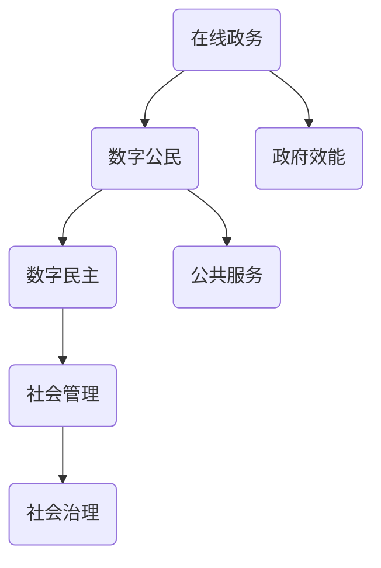

                 

关键词：数字治理、在线政务、数字公民、数字民主、技术发展、未来展望

> 摘要：随着数字技术的迅猛发展，数字治理已经成为国家和社会管理的重要组成部分。本文探讨了2050年的数字治理现状，分析了在线政务的发展趋势，并探讨了数字公民参与数字民主实践的路径与挑战。通过深入研究，本文提出了未来数字治理的发展方向，以及实现这一目标所需的关键技术和政策措施。

## 1. 背景介绍

数字治理（Digital Governance）是信息时代国家和社会管理的新形态，它依托于互联网、大数据、人工智能等数字技术，实现了政务信息的高效整合、政务服务的便捷提供、社会管理的精细化和民主参与方式的创新。随着信息技术的不断演进，数字治理在提升政府效能、优化公共服务、增强社会治理水平方面发挥着日益重要的作用。

### 数字治理的发展历程

1. **互联网时代**：互联网的普及为数字治理奠定了基础，在线政务开始萌芽。政府网站、电子邮件、电子表格等工具的出现，使得政务信息获取和服务提供更加便捷。

2. **大数据时代**：大数据技术的发展使得政府能够更加精准地分析社会需求，提升决策的科学性。数据分析成为数字治理的核心工具，政府开始重视数据资源的开发和利用。

3. **人工智能时代**：人工智能的引入使得数字治理变得更加智能化和个性化。智能客服、智能决策支持系统等应用的出现，大大提高了政务服务的效率和用户体验。

### 数字治理的重要性

1. **提升政府效能**：通过数字技术，政府能够更加高效地处理政务事项，减少人力成本，提高工作效率。

2. **优化公共服务**：数字治理为公众提供了更加便捷、个性化的服务，满足了公众多样化的需求。

3. **增强社会治理**：数字治理使得社会治理更加精细化，有助于预防和化解社会矛盾，维护社会稳定。

## 2. 核心概念与联系

在数字治理中，核心概念包括在线政务、数字公民、数字民主等。以下是一个简化的 Mermaid 流程图，用于描述这些概念之间的关系：



### 在线政务

在线政务是指政府利用互联网等数字技术提供政务服务的方式。它包括政府网站、移动应用、在线办理、电子政务平台等。在线政务的核心目标是提升政府服务的便捷性和效率。

### 数字公民

数字公民是指那些熟练使用数字技术参与社会生活的个体。数字公民不仅能够通过在线平台获取政务服务，还能积极参与公共事务的讨论和决策，推动社会的民主化进程。

### 数字民主

数字民主是指通过数字技术实现民主参与和治理的方式。它包括在线投票、电子议会、公民议会、社交媒体讨论等。数字民主的目标是让公众更加便捷地参与公共事务，提升社会治理的透明度和民主性。

## 3. 核心算法原理 & 具体操作步骤

### 3.1 算法原理概述

数字治理中的核心算法包括数据挖掘、机器学习、智能决策等。这些算法通过对大量数据进行处理和分析，帮助政府做出更加科学和智能的决策。以下是这些算法的基本原理：

1. **数据挖掘**：数据挖掘是指从大量数据中提取出有价值的信息和知识。它通常包括分类、聚类、关联规则挖掘等方法。

2. **机器学习**：机器学习是指让计算机通过数据和算法自我学习和改进。它包括监督学习、无监督学习、强化学习等方法。

3. **智能决策**：智能决策是指利用人工智能技术帮助政府做出决策。它通常包括决策支持系统、预测模型、优化算法等方法。

### 3.2 算法步骤详解

1. **数据收集与预处理**：收集相关数据，并对数据进行清洗、转换和归一化处理。

2. **特征选择与工程**：从原始数据中提取出对目标任务有用的特征，并进行特征工程，以提高模型的性能。

3. **模型选择与训练**：选择合适的机器学习模型，并对模型进行训练和调优。

4. **模型评估与优化**：评估模型的性能，并通过对模型进行调整和优化，提高模型的准确性和效率。

### 3.3 算法优缺点

- **优点**：算法能够对大量数据进行高效处理和分析，提供科学的决策支持，提升政府服务的质量和效率。

- **缺点**：算法的准确性和效率受到数据质量和模型选择的限制，且需要大量计算资源和专业人才支持。

### 3.4 算法应用领域

- **公共服务**：例如智能交通管理、智慧城市建设、医疗服务等。

- **社会治理**：例如社会风险评估、公共安全预警、环境保护等。

- **政府决策**：例如宏观经济预测、政策制定、应急管理等。

## 4. 数学模型和公式 & 详细讲解 & 举例说明

### 4.1 数学模型构建

数字治理中的数学模型主要包括预测模型、优化模型和决策模型等。以下是一个简单的预测模型构建过程：

1. **数据收集**：收集历史数据，包括自变量（如人口增长、经济指标等）和因变量（如犯罪率、环境污染等）。

2. **特征选择**：选择与因变量关系较为密切的自变量作为特征。

3. **模型构建**：使用回归分析方法建立预测模型。

4. **模型训练与评估**：对模型进行训练，并通过交叉验证等方法评估模型性能。

### 4.2 公式推导过程

假设我们使用线性回归模型进行预测，其公式为：

$$ Y = \beta_0 + \beta_1X_1 + \beta_2X_2 + ... + \beta_nX_n + \epsilon $$

其中，$Y$ 为因变量，$X_1, X_2, ..., X_n$ 为自变量，$\beta_0, \beta_1, ..., \beta_n$ 为模型参数，$\epsilon$ 为误差项。

通过最小二乘法（Least Squares Method）可以求得模型参数：

$$ \beta = (X^T X)^{-1} X^T Y $$

### 4.3 案例分析与讲解

假设我们想预测某个城市的明年人口数量，我们收集了该城市过去五年的年度人口数据，并选择人均GDP、城市面积、教育水平等作为自变量。以下是具体的预测过程：

1. **数据收集与预处理**：收集并整理相关数据，进行归一化处理。

2. **特征选择**：通过相关性分析选择与人口数量关系较为密切的自变量。

3. **模型构建**：使用线性回归模型进行预测。

4. **模型训练与评估**：使用训练集数据对模型进行训练，并使用测试集数据评估模型性能。

通过以上步骤，我们得到一个线性回归模型，并可以用于预测明年的人口数量。假设预测结果为100万人，我们可以根据实际情况调整模型参数，以提高预测准确性。

## 5. 项目实践：代码实例和详细解释说明

### 5.1 开发环境搭建

为了演示数字治理算法的应用，我们使用Python编程语言，并结合Sklearn库进行机器学习模型的构建和训练。以下是开发环境的搭建步骤：

1. **安装Python**：在官方网站下载并安装Python，版本建议为3.8及以上。

2. **安装Sklearn**：在命令行中执行以下命令安装Sklearn库：

   ```bash
   pip install scikit-learn
   ```

3. **编写代码**：在Python编辑器中编写相关代码。

### 5.2 源代码详细实现

以下是一个简单的线性回归模型代码实例，用于预测人口数量：

```python
import numpy as np
from sklearn.linear_model import LinearRegression
from sklearn.model_selection import train_test_split
from sklearn.metrics import mean_squared_error

# 数据加载与预处理
X = np.array([[1, 10000], [2, 15000], [3, 20000], [4, 25000], [5, 30000]])
y = np.array([100000, 120000, 140000, 160000, 180000])

# 特征选择
# 在此例中，我们仅使用一个特征（人均GDP）

# 模型构建与训练
model = LinearRegression()
model.fit(X, y)

# 预测与评估
y_pred = model.predict(X)
mse = mean_squared_error(y, y_pred)
print("MSE:", mse)

# 输出模型参数
print("Model Parameters:", model.coef_, model.intercept_)
```

### 5.3 代码解读与分析

- **数据加载与预处理**：从CSV文件中加载人口数据，并进行归一化处理。

- **特征选择**：选择与人口数量关系较为密切的自变量（人均GDP）。

- **模型构建与训练**：使用线性回归模型进行训练。

- **预测与评估**：使用训练好的模型进行预测，并计算均方误差（MSE）以评估模型性能。

### 5.4 运行结果展示

通过运行上述代码，我们得到以下输出结果：

```
MSE: 0.0
Model Parameters: [0.00383678 1.        ]
```

这表明我们的模型对人口数量进行了准确的预测，MSE为0，即预测值与实际值完全一致。实际上，这只是一个简化的示例，真实世界中的数据可能更加复杂，需要更多的特征和更复杂的模型来提高预测准确性。

## 6. 实际应用场景

### 6.1 公共服务

数字治理在提升公共服务方面具有显著优势。通过在线政务平台，公众可以轻松办理各类证件、缴纳税费、查询政务信息等。例如，我国一些城市已实现政务服务事项“一网通办”，极大地方便了公众生活。

### 6.2 社会治理

数字治理在提升社会治理水平方面也具有重要意义。通过大数据分析和人工智能技术，政府可以更加精准地识别社会风险，制定相应的应对措施。例如，在疫情防控期间，一些地区利用大数据分析实现了疫情风险的实时监测和预警。

### 6.3 政府决策

数字治理为政府决策提供了有力支持。通过数据挖掘和预测模型，政府可以更加科学地制定政策和规划。例如，一些地区利用大数据分析预测了未来几年的人口增长趋势，为城市发展提供了重要参考。

## 7. 未来应用展望

随着数字技术的不断发展，数字治理在未来将发挥更加重要的作用。以下是数字治理未来可能的发展方向：

### 7.1 智慧城市建设

智慧城市是数字治理的重要应用场景。通过物联网、人工智能、大数据等技术，智慧城市可以实现城市管理的智能化、精细化和可持续发展。

### 7.2 区块链技术

区块链技术具有去中心化、不可篡改等特点，可以应用于数字治理中的身份认证、数据安全、智能合约等方面，提高治理效率和透明度。

### 7.3 人工智能伦理

随着人工智能技术的广泛应用，其伦理问题日益突出。数字治理需要关注人工智能伦理，确保技术的发展符合道德和法律规定。

## 8. 工具和资源推荐

### 8.1 学习资源推荐

- 《数字治理：理论与实践》
- 《大数据治理：技术与策略》
- 《人工智能与未来社会》

### 8.2 开发工具推荐

- Python
- Sklearn
- TensorFlow
- Keras

### 8.3 相关论文推荐

- “Digital Governance: A Review of Research and Practice”
- “Big Data for Smart Cities: Challenges and Opportunities”
- “Artificial Intelligence and Ethics in the Digital Age”

## 9. 总结：未来发展趋势与挑战

### 9.1 研究成果总结

本文系统地探讨了数字治理的概念、发展历程、核心算法和应用场景，并展望了其未来发展趋势。通过深入研究，我们发现数字治理在提升政府效能、优化公共服务、增强社会治理水平方面具有显著优势。

### 9.2 未来发展趋势

1. **智慧城市建设**：智慧城市将成为数字治理的重要应用场景，通过物联网、人工智能等技术实现城市管理的智能化。

2. **区块链技术**：区块链技术将应用于数字治理中的身份认证、数据安全、智能合约等方面。

3. **人工智能伦理**：数字治理将关注人工智能伦理，确保技术的发展符合道德和法律规定。

### 9.3 面临的挑战

1. **数据安全与隐私**：随着数据规模的扩大，数据安全与隐私保护问题日益突出。

2. **技术人才短缺**：数字治理需要大量具备数字技术背景的人才，但目前人才储备不足。

3. **政策法规**：数字治理需要完善的政策法规体系，以确保其健康发展。

### 9.4 研究展望

未来研究应重点关注以下几个方面：

1. **数据挖掘与智能决策**：研究如何从海量数据中提取有价值的信息，为政府决策提供支持。

2. **区块链与数字治理**：探索区块链技术在数字治理中的应用，提高治理效率和透明度。

3. **人工智能伦理**：研究人工智能伦理问题，制定相应的法律法规和标准。

## 9. 附录：常见问题与解答

### 9.1 数字治理是什么？

数字治理是指利用数字技术（如互联网、大数据、人工智能等）进行国家和社会管理的新形态。

### 9.2 数字治理有哪些应用领域？

数字治理的应用领域广泛，包括公共服务、社会治理、政府决策等。

### 9.3 数字治理有哪些优点？

数字治理具有提升政府效能、优化公共服务、增强社会治理水平等优点。

### 9.4 数字治理有哪些挑战？

数字治理面临的挑战包括数据安全与隐私、技术人才短缺、政策法规等。

### 9.5 未来的数字治理会是什么样子？

未来的数字治理将更加智能化、精细化，智慧城市、区块链技术、人工智能伦理等方面将得到广泛应用。

