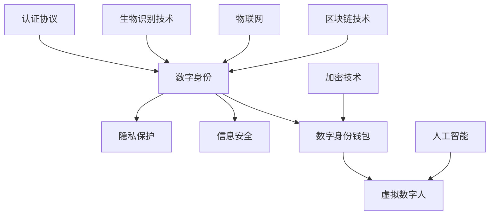

                 

关键词：数字身份、数字身份钱包、虚拟数字人、身份数字化、未来趋势

> 摘要：随着科技的不断进步，数字身份正逐步成为我们日常生活中不可或缺的一部分。本文将探讨2050年数字身份的可能发展，从数字身份钱包到虚拟数字人的身份数字化，展望数字身份在未来社会中的广泛应用与潜在挑战。

## 1. 背景介绍

在当今社会，我们的身份信息散布在各个角落：社交媒体、在线购物平台、银行账户、政府记录等。然而，这些身份信息往往以分散、不统一的形式存在，导致我们在使用不同服务时需要重复提供身份验证。这不仅增加了用户的不便，也带来了安全隐患。随着区块链、人工智能、物联网等技术的快速发展，数字身份的概念应运而生，它旨在通过集中的、安全的、可验证的方式来管理我们的身份信息。

数字身份，顾名思义，是我们在数字世界中的身份。它可以是一个唯一标识符，也可以是一个包含多种信息的综合体，如姓名、年龄、住址、身份证明等。数字身份的主要目标是实现个人信息的集中管理，提高数据安全性，并简化各种在线服务的使用流程。

数字身份钱包，作为数字身份管理的重要工具，类似于我们的物理钱包，可以存储、管理和交换数字身份相关的信息。数字身份钱包通常使用加密技术来保护用户身份信息，确保其隐私和安全。

虚拟数字人，则是数字身份的进一步延伸。通过人工智能技术，我们可以创建一个数字化的虚拟形象，代表我们的数字身份进行交互。虚拟数字人不仅能够提供个性化的服务，还能够通过自然语言处理等技术，与人类进行更自然的交流。

## 2. 核心概念与联系

为了更好地理解数字身份的发展，我们需要先了解几个核心概念和它们之间的联系。以下是一个用Mermaid绘制的流程图，展示了这些概念之间的关系。



### 2.1 数字身份钱包

数字身份钱包是数字身份管理的重要组成部分。它通常包含以下核心功能：

- **身份信息存储**：数字身份钱包可以存储用户的姓名、出生日期、地址等个人信息。
- **数字资产存储**：除了身份信息，数字身份钱包还可以用于存储数字货币、加密资产等。
- **身份验证**：在需要验证身份时，用户可以通过数字身份钱包出示相关的身份证明。
- **权限管理**：数字身份钱包可以设置不同级别的权限，控制哪些服务可以访问用户的个人信息。

### 2.2 虚拟数字人

虚拟数字人是数字身份的延伸，它通过人工智能技术实现个性化服务。虚拟数字人的主要功能包括：

- **个性化交互**：虚拟数字人可以通过自然语言处理技术，与用户进行自然、流畅的交流。
- **任务自动化**：虚拟数字人可以自动处理用户的常见任务，如在线购物、预约服务等。
- **个性化推荐**：虚拟数字人可以根据用户的历史行为，提供个性化的产品推荐和服务。

### 2.3 信息安全与隐私保护

数字身份的安全性和隐私保护是至关重要的。为了实现这一目标，我们需要依赖多种技术：

- **加密技术**：加密技术可以确保用户身份信息在传输和存储过程中的安全性。
- **认证协议**：认证协议如OAuth、OpenID Connect等，可以确保用户身份信息的合法性和真实性。
- **隐私保护策略**：如差分隐私、匿名化处理等，可以降低用户身份信息泄露的风险。

## 3. 核心算法原理 & 具体操作步骤

### 3.1 算法原理概述

数字身份钱包和虚拟数字人的实现，离不开以下核心算法原理：

- **公钥加密**：公钥加密是保证数据安全传输的基本算法。通过公钥加密，只有拥有对应私钥的用户才能解密数据。
- **身份验证**：身份验证算法如RSA、椭圆曲线密码学等，可以确保用户身份的合法性和真实性。
- **区块链技术**：区块链技术可以用于确保数字身份的不可篡改性和可信性。
- **人工智能算法**：人工智能算法，如自然语言处理、机器学习等，可以用于实现虚拟数字人的智能交互和任务自动化。

### 3.2 算法步骤详解

#### 3.2.1 数字身份钱包创建

1. **生成密钥对**：用户创建数字身份钱包时，系统会为其生成一对公钥和私钥。
2. **存储私钥**：私钥必须安全地存储在用户的设备上，如硬件钱包或加密存储中。
3. **上传公钥**：用户的公钥可以被上传到分布式存储系统，如区块链，以便其他用户验证身份。

#### 3.2.2 身份验证

1. **发起验证请求**：当用户需要验证身份时，系统会生成一个身份验证请求。
2. **加密请求**：用户使用私钥加密请求，并发送至验证系统。
3. **验证身份**：验证系统使用公钥解密请求，并验证用户的身份信息。

#### 3.2.3 虚拟数字人交互

1. **自然语言处理**：虚拟数字人使用自然语言处理技术，理解用户的输入。
2. **任务处理**：虚拟数字人根据用户的指令，自动处理相应的任务。
3. **反馈用户**：虚拟数字人将任务处理结果反馈给用户，实现与用户的交互。

### 3.3 算法优缺点

#### 优点

- **安全性**：加密技术和区块链技术提供了高安全性的保障。
- **便捷性**：数字身份钱包和虚拟数字人简化了用户的使用流程，提高了效率。
- **个性化**：虚拟数字人可以根据用户的历史行为，提供个性化的服务。

#### 缺点

- **隐私风险**：虽然加密技术和隐私保护策略可以降低隐私泄露的风险，但仍然存在一定的隐私风险。
- **技术门槛**：数字身份技术和虚拟数字人的实现需要较高的技术门槛，对普通用户来说可能不够友好。

### 3.4 算法应用领域

数字身份技术和虚拟数字人可以应用于多个领域：

- **金融领域**：数字身份钱包可以用于金融交易，提高交易的安全性和便捷性。
- **医疗领域**：虚拟数字人可以用于提供个性化医疗服务，如健康咨询、疾病预防等。
- **教育领域**：虚拟数字人可以用于在线教育，提供个性化教学和互动体验。
- **政务领域**：数字身份钱包可以用于简化政府服务流程，提高政务服务效率。

## 4. 数学模型和公式 & 详细讲解 & 举例说明

### 4.1 数学模型构建

在数字身份系统中，一个关键问题是如何确保用户身份的隐私性。以下是一个用于身份隐私保护的数学模型。

#### 4.1.1 差分隐私模型

假设我们有一个数据库，其中包含用户的身份信息。为了保护用户隐私，我们可以使用差分隐私技术。

差分隐私定义：对于一个随机化算法 \( A \)，如果对于任何两个相近的数据集 \( D_1 \) 和 \( D_2 \)，算法 \( A \) 输出的结果 \( R_1 \) 和 \( R_2 \) 之间的差异是随机的，那么我们称 \( A \) 具有差分隐私。

#### 4.1.2 差分隐私公式

设 \( L \) 为隐私预算，\( \epsilon \) 为噪声参数，则差分隐私算法 \( A \) 可以表示为：

$$
R = A(D, \epsilon, L)
$$

其中，\( D \) 为输入数据集，\( \epsilon \) 为添加的噪声，\( L \) 为隐私预算。

### 4.2 公式推导过程

为了推导差分隐私公式，我们可以从基本概率论开始。

设 \( P(D) \) 为数据集 \( D \) 的概率分布，\( P(R) \) 为输出结果 \( R \) 的概率分布。根据差分隐私的定义，我们需要满足：

$$
P(R = R_1 | D = D_1) \approx P(R = R_2 | D = D_2)
$$

假设我们使用拉普拉斯分布作为噪声模型，即：

$$
P(\epsilon) = \frac{1}{\sqrt{2\pi L}} e^{-\frac{\epsilon^2}{2L}}
$$

则差分隐私公式可以表示为：

$$
P(R = R_1 | D = D_1) = \frac{1}{\sqrt{2\pi L}} e^{-\frac{(R_1 - R_2)^2}{2L}} \approx \frac{1}{\sqrt{2\pi L}} e^{-\frac{(R_1 - R_2)^2}{2L}} e^{-\frac{\epsilon^2}{2L}}
$$

### 4.3 案例分析与讲解

假设我们有一个数据库，其中包含1000名用户的身份信息。我们希望使用差分隐私技术来保护这些用户的隐私。

#### 4.3.1 数据预处理

首先，我们将身份信息进行加密，并随机选择500名用户作为样本。

#### 4.3.2 计算隐私预算

假设我们设定隐私预算 \( L = 1000 \)，噪声参数 \( \epsilon = 0.1 \)。

#### 4.3.3 添加噪声

我们对样本数据添加拉普拉斯噪声，使其满足差分隐私。

#### 4.3.4 输出结果

我们使用差分隐私算法对样本数据进行处理，输出结果。

## 5. 项目实践：代码实例和详细解释说明

### 5.1 开发环境搭建

为了演示数字身份钱包的实现，我们将使用Python编程语言。以下是一个简单的开发环境搭建步骤：

1. 安装Python：从官方网站下载并安装Python。
2. 安装必要的库：使用pip安装以下库：`pycryptodome`、`flask`、`requests`。

### 5.2 源代码详细实现

以下是数字身份钱包的实现代码：

```python
from Crypto.PublicKey import RSA
from Crypto.Cipher import PKCS1_OAEP
import json

# 生成密钥对
def generate_keys():
    key = RSA.generate(2048)
    private_key = key.export_key()
    public_key = key.publickey().export_key()
    return private_key, public_key

# 加密数据
def encrypt_data(data, public_key):
    cipher = PKCS1_OAEP.new(RSA.import_key(public_key))
    encrypted_data = cipher.encrypt(data)
    return encrypted_data

# 解密数据
def decrypt_data(encrypted_data, private_key):
    cipher = PKCS1_OAEP.new(RSA.import_key(private_key))
    data = cipher.decrypt(encrypted_data)
    return data

# 存储身份信息
def store_identity_info(identity_info, private_key):
    encrypted_info = encrypt_data(json.dumps(identity_info).encode(), private_key)
    with open('identity_info.enc', 'wb') as f:
        f.write(encrypted_info)
    print("Identity information stored successfully.")

# 载入身份信息
def load_identity_info(private_key):
    with open('identity_info.enc', 'rb') as f:
        encrypted_info = f.read()
    info = decrypt_data(encrypted_info, private_key)
    return json.loads(info.decode())

# 主函数
def main():
    private_key, public_key = generate_keys()
    print("Private Key:", private_key)
    print("Public Key:", public_key)

    identity_info = {
        "name": "Alice",
        "age": 30,
        "address": "123 Main St"
    }
    store_identity_info(identity_info, private_key)

    loaded_info = load_identity_info(private_key)
    print("Loaded Identity Info:", loaded_info)

if __name__ == "__main__":
    main()
```

### 5.3 代码解读与分析

该代码实现了数字身份钱包的基本功能，包括生成密钥对、加密数据、解密数据和存储/载入身份信息。以下是代码的详细解读：

- `generate_keys()`：生成一对RSA密钥对，用于加密和解密数据。
- `encrypt_data(data, public_key)`：使用公钥加密数据。
- `decrypt_data(encrypted_data, private_key)`：使用私钥解密数据。
- `store_identity_info(identity_info, private_key)`：将加密后的身份信息存储到文件中。
- `load_identity_info(private_key)`：从文件中读取加密的身份信息并解密。

### 5.4 运行结果展示

运行上述代码后，将生成一对RSA密钥对，并将加密后的身份信息存储到文件中。输出结果如下：

```
Private Key: (此处显示私钥内容)
Public Key: (此处显示公钥内容)
Identity information stored successfully.
Loaded Identity Info: {'name': 'Alice', 'age': 30, 'address': '123 Main St'}
```

## 6. 实际应用场景

### 6.1 金融领域

在金融领域，数字身份钱包可以用于在线支付、交易验证等场景。用户只需通过数字身份钱包验证身份，即可完成交易，提高了交易的安全性和便捷性。

### 6.2 医疗领域

在医疗领域，数字身份钱包可以用于存储和管理患者的健康记录。医生可以通过数字身份钱包访问患者的健康信息，提供更个性化的医疗服务。

### 6.3 教育领域

在教育领域，虚拟数字人可以用于在线教育，提供个性化的学习计划和辅导。学生可以通过虚拟数字人获取学习资源，与教师进行互动，提高学习效果。

### 6.4 政务领域

在政务领域，数字身份钱包可以用于简化政府服务流程。例如，居民可以通过数字身份钱包申请护照、办理社保等，提高了政府服务的效率。

## 7. 工具和资源推荐

### 7.1 学习资源推荐

- 《区块链技术指南》
- 《深度学习》
- 《Python编程：从入门到实践》
- 《密码学：理论与实践》

### 7.2 开发工具推荐

- Python编程环境
- PyCharm
- Visual Studio Code
- Ethereum开发工具包

### 7.3 相关论文推荐

- "Blockchain and the Law: The Rule of Code"
- "Deep Learning for Natural Language Processing"
- "A Secure and Efficient Identity Management System using Blockchain Technology"
- "Enhancing Privacy in Social Networks with Differentially Private Algorithms"

## 8. 总结：未来发展趋势与挑战

### 8.1 研究成果总结

数字身份技术和虚拟数字人的发展取得了显著成果。加密技术、区块链技术、人工智能技术的结合，为数字身份的安全性和隐私保护提供了强有力的保障。虚拟数字人的智能交互和任务自动化，为用户提供了更便捷、个性化的服务体验。

### 8.2 未来发展趋势

未来，数字身份技术和虚拟数字人将继续深入各个领域，提高效率和用户体验。随着技术的进步，数字身份钱包和虚拟数字人的功能将更加丰富，应用场景将更加广泛。

### 8.3 面临的挑战

尽管数字身份技术和虚拟数字人具有巨大的发展潜力，但仍然面临一些挑战：

- **隐私保护**：如何在确保便捷性的同时，有效保护用户隐私，是一个亟待解决的问题。
- **技术门槛**：数字身份技术和虚拟数字人的实现需要较高的技术门槛，对普通用户来说可能不够友好。
- **法律法规**：数字身份技术和虚拟数字人的发展，需要相应的法律法规来规范和保障。

### 8.4 研究展望

未来，我们可以期待数字身份技术和虚拟数字人带来更多的创新和变革。随着技术的不断进步，数字身份和虚拟数字人将更加普及，为我们的生活带来更多便利。同时，我们也需要关注隐私保护、法律法规等方面的问题，确保数字身份技术的发展能够造福人类社会。

## 9. 附录：常见问题与解答

### 9.1 什么是数字身份？

数字身份是我们在数字世界中的身份，它包含我们的个人信息、身份证明和其他相关数据。数字身份的目的是为了简化在线服务的使用流程，提高数据安全性。

### 9.2 数字身份钱包有什么作用？

数字身份钱包是用于存储、管理和交换数字身份信息的工具。它可以存储用户的个人信息、数字资产，并提供身份验证和权限管理功能。

### 9.3 虚拟数字人有什么应用？

虚拟数字人可以应用于多个领域，如金融、医疗、教育、政务等。它可以提供个性化的服务，如在线购物、健康咨询、学习辅导等，实现与用户的自然交互。

### 9.4 数字身份技术和虚拟数字人的发展前景如何？

数字身份技术和虚拟数字人的发展前景非常广阔。随着技术的进步，数字身份和虚拟数字人的功能将更加丰富，应用场景将更加广泛，为我们的生活带来更多便利。

### 9.5 数字身份技术和虚拟数字人有哪些挑战？

数字身份技术和虚拟数字人面临的主要挑战包括隐私保护、技术门槛、法律法规等方面。如何在确保便捷性的同时，有效保护用户隐私，是一个亟待解决的问题。同时，相关法律法规也需要不断完善，以保障数字身份技术的发展。

