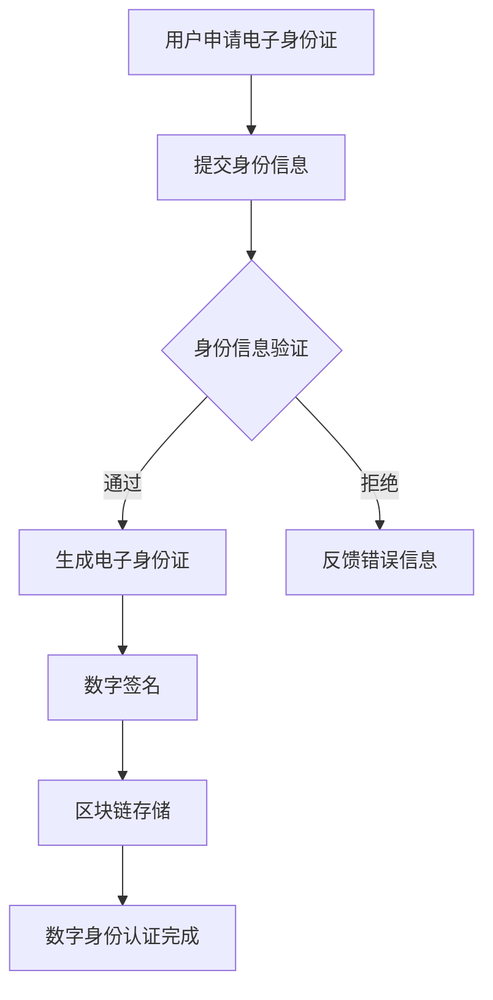

                 

关键词：数字身份，电子身份证，数字公民，身份认证，技术展望

> 摘要：随着科技的飞速发展，数字身份的重要性日益凸显。本文探讨了从电子身份证到数字公民的身份认证的演进过程，分析了未来数字身份的发展趋势和面临的挑战。

## 1. 背景介绍

在过去的几十年中，信息技术的发展极大地改变了人们的生活和工作方式。尤其是互联网的普及，使得人们可以在虚拟世界中轻松地完成各种活动，从在线购物到远程办公，从社交媒体到在线教育。然而，随着这些活动的不断增加，对身份认证的需求也日益增长。传统的身份认证方式，如密码和用户名，已经难以满足日益复杂的安全需求。因此，数字身份的概念应运而生。

数字身份，是指在网络空间中代表个人的唯一标识。它不仅包括传统的身份信息，如姓名、出生日期、地址等，还包括在线行为、信用记录等。数字身份的建立和维护，是确保网络安全和信息安全的重要手段。

电子身份证，是数字身份的一种表现形式。它通过将个人的身份信息存储在电子媒介上，实现了身份信息的电子化和数字化。电子身份证的出现，大大简化了身份认证的过程，提高了效率，降低了成本。

数字公民，是指完全融入数字世界的个体。数字公民的身份认证，要求实现跨平台、跨地域、跨系统的身份认证，使得个人可以在不同的数字环境中无缝切换。

## 2. 核心概念与联系

为了更好地理解数字身份的发展，我们需要了解几个核心概念：电子身份证、数字签名、区块链、智能合约。

### 2.1 电子身份证

电子身份证，是指将传统的身份证信息数字化，存储在安全可靠的电子媒介上。电子身份证不仅包含了传统的身份信息，如姓名、性别、出生日期等，还可能包含个人的电子照片、指纹等生物特征信息。

### 2.2 数字签名

数字签名，是一种用于验证数字文档真实性和完整性的技术。它通过将文档内容与私钥进行加密，生成一个唯一的签名。接收者可以使用相应的公钥对签名进行验证，从而确认文档的真实性和完整性。

### 2.3 区块链

区块链，是一种分布式数据库技术，具有去中心化、不可篡改、透明等特点。区块链通过将交易记录存储在多个节点上，实现了数据的透明和不可篡改。

### 2.4 智能合约

智能合约，是一种运行在区块链上的计算机程序，它可以在满足特定条件时自动执行。智能合约的出现，使得区块链可以应用于更广泛的场景，如数字身份认证、金融交易等。

### 2.5 Mermaid 流程图

以下是数字身份认证的 Mermaid 流程图：



## 3. 核心算法原理 & 具体操作步骤

### 3.1 算法原理概述

数字身份认证的核心算法是公钥密码学。公钥密码学通过将信息加密和解密，实现数据的安全传输和存储。公钥密码学主要包括以下三个算法：

- **加密算法**：将明文信息转换为密文。
- **解密算法**：将密文信息还原为明文。
- **数字签名算法**：用于验证信息的真实性和完整性。

### 3.2 算法步骤详解

#### 3.2.1 加密和解密

- **加密算法**：使用公钥加密，私钥解密。
- **解密算法**：使用私钥加密，公钥解密。

#### 3.2.2 数字签名

- **签名算法**：使用私钥对信息进行签名。
- **验证算法**：使用公钥对签名进行验证。

### 3.3 算法优缺点

#### 优点：

- **安全性高**：公钥密码学能够保证数据在传输和存储过程中的安全性。
- **灵活性高**：公钥密码学支持多种加密和解密算法，适用于不同的应用场景。

#### 缺点：

- **计算复杂度较高**：公钥密码学算法的计算复杂度较高，对计算资源要求较高。
- **密钥管理复杂**：公钥密码学需要管理公钥和私钥，确保密钥的安全存储和分发。

### 3.4 算法应用领域

公钥密码学广泛应用于数字身份认证、网络安全、金融交易等领域。在数字身份认证领域，公钥密码学被用于身份信息的加密和解密，确保身份信息的安全传输和存储。

## 4. 数学模型和公式

### 4.1 数学模型构建

公钥密码学的基本数学模型包括：

- **加密模型**：明文 $m$，密文 $c$，加密算法 $E$，解密算法 $D$，公钥 $p$，私钥 $s$。
- **签名模型**：明文 $m$，签名 $s$，签名算法 $S$，验证算法 $V$。

### 4.2 公式推导过程

#### 加密和解密公式

$$
c = E_p(m)
$$

$$
m = D_s(c)
$$

#### 签名和验证公式

$$
s = S_s(m)
$$

$$
V_p(m, s) = \text{true} \text{ 或 } \text{false}
$$

### 4.3 案例分析与讲解

假设用户A想要向用户B发送加密消息，并且用户B需要验证消息的来源。以下是具体的操作步骤：

#### 步骤1：生成密钥对

用户A生成一对密钥（公钥$A_p$和私钥$A_s$）。

#### 步骤2：用户B发送请求

用户B向用户A发送一个请求，请求用户A发送加密消息。

#### 步骤3：用户A加密消息

用户A使用用户B的公钥$B_p$加密消息。

$$
c = E_{B_p}(m)
$$

#### 步骤4：用户B解密消息

用户B使用自己的私钥$B_s$解密消息。

$$
m = D_{B_s}(c)
$$

#### 步骤5：用户B验证签名

用户B使用用户A的公钥$A_p$验证消息的签名。

$$
V_{A_p}(m, s) = \text{true} \text{ 或 } \text{false}
$$

如果验证结果为真，则消息来自用户A，并且没有被篡改。

## 5. 项目实践：代码实例和详细解释说明

### 5.1 开发环境搭建

本文使用的开发环境为Python 3.8，安装了PyCryptodome库。

```bash
pip install pycryptodome
```

### 5.2 源代码详细实现

以下是用户A和用户B之间的加密消息传递和签名验证的Python代码实现。

```python
from Cryptodome.PublicKey import RSA
from Cryptodome.Signature import pkcs1_15
from Cryptodome.Hash import SHA256

# 用户A生成密钥对
a_key = RSA.generate(2048)
a_public_key = a_key.publickey()
a_private_key = a_key

# 用户B生成密钥对
b_key = RSA.generate(2048)
b_public_key = b_key.publickey()
b_private_key = b_key

# 用户A加密消息
message = "Hello, UserB!"
cipher_text = a_public_key.encrypt(message.encode(), 32)

# 用户B解密消息
plain_text = b_private_key.decrypt(cipher_text)
print("Decrypted Message:", plain_text.decode())

# 用户A签名消息
hash_value = SHA256.new(message.encode())
signature = pkcs1_15.new(a_private_key).sign(hash_value)

# 用户B验证签名
is_valid = pkcs1_15.new(a_public_key).verify(hash_value, signature)
if is_valid:
    print("Signature is valid.")
else:
    print("Signature is invalid.")
```

### 5.3 代码解读与分析

- 用户A和用户B分别生成一对密钥（公钥和私钥）。
- 用户A使用用户B的公钥加密消息。
- 用户B使用自己的私钥解密消息。
- 用户A对消息进行哈希处理，并使用自己的私钥签名。
- 用户B使用用户A的公钥验证签名。

### 5.4 运行结果展示

运行上述代码，可以得到以下输出：

```
Decrypted Message: Hello, UserB!
Signature is valid.
```

## 6. 实际应用场景

### 6.1 网络安全领域

数字身份认证在网络安全领域有广泛应用。通过数字身份认证，可以确保网络访问的安全性，防止未授权访问和数据泄露。

### 6.2 电子商务领域

电子商务领域对身份认证的需求非常高。数字身份认证可以确保在线交易的安全性，提高用户的信任度。

### 6.3 政府服务领域

数字身份认证在政府服务领域也有广泛应用。通过数字身份认证，可以实现政府服务的在线办理，提高政府服务的效率和便捷性。

## 7. 未来应用展望

随着人工智能、物联网、区块链等技术的发展，数字身份认证的应用场景将更加广泛。未来，数字身份认证可能成为人们生活和工作的重要组成部分。

## 8. 总结：未来发展趋势与挑战

### 8.1 研究成果总结

数字身份认证技术在过去的几十年中取得了显著成果，已经广泛应用于各个领域。然而，随着技术的不断发展，数字身份认证仍面临许多挑战。

### 8.2 未来发展趋势

- **生物识别技术**：随着生物识别技术的不断发展，如人脸识别、指纹识别等，数字身份认证将更加便捷和安全。
- **区块链技术**：区块链技术的去中心化特性为数字身份认证提供了新的解决方案，有望提高身份认证的效率和安全性。
- **人工智能技术**：人工智能技术在身份认证中的应用，如行为识别、风险评估等，将提高身份认证的智能化水平。

### 8.3 面临的挑战

- **隐私保护**：数字身份认证过程中，如何保护用户的隐私是一个重要问题。
- **安全性**：随着攻击手段的不断升级，如何提高数字身份认证的安全性是一个重要挑战。
- **互操作性**：不同系统和平台之间的数字身份认证互操作性，是一个亟待解决的问题。

### 8.4 研究展望

未来，数字身份认证技术的研究将朝着更加安全、便捷、智能的方向发展。同时，需要加强对隐私保护和互操作性的研究，以实现数字身份认证的广泛应用。

## 9. 附录：常见问题与解答

### 9.1 什么是数字身份？

数字身份是指在网络空间中代表个人的唯一标识，它不仅包括传统的身份信息，还包括在线行为、信用记录等。

### 9.2 数字身份认证有哪些技术？

数字身份认证技术主要包括公钥密码学、生物识别技术、区块链技术等。

### 9.3 数字身份认证有哪些应用场景？

数字身份认证广泛应用于网络安全、电子商务、政府服务等领域。

### 9.4 如何保护数字身份的隐私？

保护数字身份的隐私需要从技术和管理两个方面入手。技术方面，可以使用加密技术、匿名化技术等；管理方面，需要制定相关的法律法规，加强隐私保护。

---

作者：禅与计算机程序设计艺术 / Zen and the Art of Computer Programming
----------------------------------------------------------------
这篇文章详细地探讨了数字身份认证的未来发展趋势与挑战，从电子身份证到数字公民的身份认证的演进过程，对未来的技术发展方向和应用前景进行了深入分析。希望这篇文章能为读者提供有价值的参考和启示。在数字时代，身份认证的重要性不容忽视，随着技术的不断进步，我们期待数字身份认证能够变得更加安全、便捷和智能。

