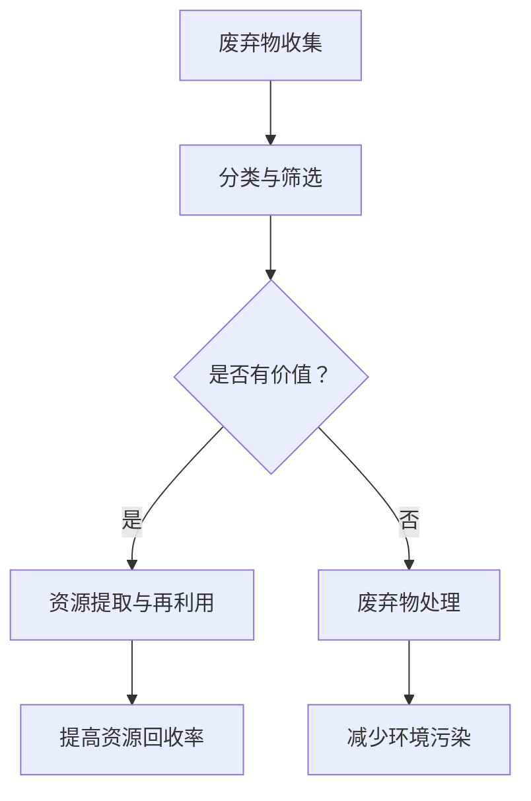
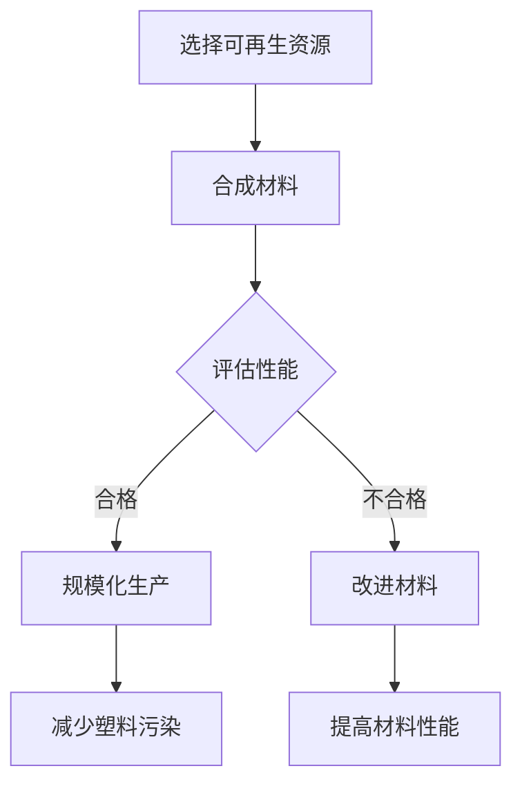
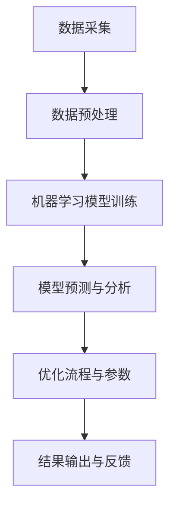

                 

关键词：环境保护、循环经济、废弃物利用、塑料替代、可持续发展

> 摘要：本文探讨了2050年环境保护领域的重大变革，包括废弃物挖掘技术的突破、塑料替代材料的研发，以及循环经济的全面推广。通过深入分析这些技术的原理、应用及未来展望，揭示了科技进步在实现环境保护和可持续发展中的关键作用。

## 1. 背景介绍

随着全球人口的不断增长和消费水平的提升，人类对自然资源的消耗速度远超地球的再生能力。尤其是塑料污染，已成为全球环境面临的最严峻挑战之一。据估计，每年至少有8万吨的塑料废弃物流入海洋，严重威胁着海洋生物的生存和人类健康。此外，传统的线性经济模式（即“资源—产品—废弃物”）导致资源浪费和环境污染问题日益严重。为了实现可持续发展，迫切需要一种全新的经济模式，即循环经济。

循环经济以资源高效利用和废弃物最小化为原则，通过不断循环利用资源，减少环境污染和资源浪费。在2050年，随着科技的进步，循环经济将在环境保护领域发挥重要作用。本文将从废弃物挖掘技术和塑料替代材料两个方面，探讨循环经济在环境保护中的应用和前景。

### 1.1 废弃物挖掘技术

废弃物挖掘技术是指从废弃物品中提取有价值资源的方法。随着科技的进步，废弃物挖掘技术已经能够实现从电子产品、塑料、纸张等多种废弃物中高效提取有价值的原材料。例如，电子废弃物中含有大量的贵金属，如金、银、铜等。传统的回收方法往往难以有效提取这些贵金属，但通过先进的废弃物挖掘技术，可以将这些贵金属分离出来，实现资源的再次利用。

### 1.2 塑料替代材料

塑料替代材料是指能够替代传统塑料的新型材料。这些材料通常具有优异的性能，如生物降解性、可重复利用性等，可以有效减少塑料污染。目前，已有多项研究探索了各种塑料替代材料的可行性，包括生物基材料、可再生资源材料、复合材料等。

## 2. 核心概念与联系

### 2.1 废弃物挖掘技术原理

废弃物挖掘技术主要涉及以下几个核心概念：

- **资源回收率**：指从废弃物中回收的有效资源与废弃物总量的比例。
- **回收效率**：指单位时间内回收资源的能力。
- **回收成本**：指回收过程中所需的成本，包括设备、人力、能源等。

为了实现高效的废弃物挖掘，需要充分利用先进的技术手段，如物联网、大数据分析、机器学习等。以下是一个简化的废弃物挖掘流程：



### 2.2 塑料替代材料原理

塑料替代材料的研发涉及以下核心概念：

- **生物降解性**：指材料能够在环境中自然降解，减少环境污染。
- **可再生性**：指材料来源于可再生资源，可重复利用。
- **性能**：指材料在物理、化学、机械等方面的性能，需要与塑料相当甚至更优。

以下是一个简化的塑料替代材料研发流程：



## 3. 核心算法原理 & 具体操作步骤

### 3.1 算法原理概述

废弃物挖掘和塑料替代材料的研发都需要大量的数据处理和分析。为了实现高效的数据处理，可以采用以下核心算法：

- **物联网（IoT）数据采集与处理算法**：用于收集废弃物和塑料替代材料的实时数据，并进行预处理。
- **机器学习算法**：用于分析和预测废弃物回收效率和塑料替代材料性能。
- **优化算法**：用于优化废弃物挖掘和塑料替代材料研发的流程和参数。

### 3.2 算法步骤详解

以下是一个简化的算法步骤：



### 3.3 算法优缺点

- **优点**：
  - 提高废弃物回收效率和塑料替代材料性能。
  - 减少环境污染和资源浪费。
  - 降低生产成本。

- **缺点**：
  - 需要大量的数据和技术支持。
  - 算法复杂度较高，实现难度较大。

### 3.4 算法应用领域

- **废弃物挖掘**：应用于电子废弃物、塑料废弃物、纸张废弃物等。
- **塑料替代材料研发**：应用于包装材料、塑料制品、生物医疗等领域。

## 4. 数学模型和公式 & 详细讲解 & 举例说明

### 4.1 数学模型构建

废弃物挖掘和塑料替代材料的研发需要构建以下数学模型：

- **资源回收模型**：用于预测资源回收率和回收效率。
- **塑料替代材料性能模型**：用于评估材料性能和可再生性。

### 4.2 公式推导过程

以下是一个简化的资源回收模型：

$$
\text{回收率} = \frac{\text{回收资源量}}{\text{废弃物总量}}
$$

$$
\text{回收效率} = \frac{\text{回收资源量}}{\text{回收时间}}
$$

### 4.3 案例分析与讲解

假设某城市每月产生100吨电子废弃物，其中含有5吨贵金属。采用废弃物挖掘技术，回收率为80%，回收时间为2天。则：

- **回收资源量**：$80\% \times 5 \text{吨} = 4 \text{吨}$
- **回收率**：$\frac{4 \text{吨}}{100 \text{吨}} = 0.04$
- **回收效率**：$\frac{4 \text{吨}}{2 \text{天}} = 2 \text{吨/天}$

通过优化算法，可以进一步提高回收率和回收效率。

## 5. 项目实践：代码实例和详细解释说明

### 5.1 开发环境搭建

为了实现废弃物挖掘和塑料替代材料的研发，需要搭建以下开发环境：

- **编程语言**：Python
- **数据处理库**：NumPy、Pandas、Scikit-learn
- **机器学习库**：TensorFlow、Keras

### 5.2 源代码详细实现

以下是一个简化的代码实现：

```python
import numpy as np
import pandas as pd
from sklearn.model_selection import train_test_split
from sklearn.ensemble import RandomForestRegressor
from tensorflow.keras.models import Sequential
from tensorflow.keras.layers import Dense

# 数据采集与预处理
data = pd.read_csv('data.csv')
X = data.drop('target', axis=1)
y = data['target']

X_train, X_test, y_train, y_test = train_test_split(X, y, test_size=0.2, random_state=42)

# 构建回归模型
model = RandomForestRegressor(n_estimators=100, random_state=42)
model.fit(X_train, y_train)

# 预测与分析
y_pred = model.predict(X_test)
performance = model.score(X_test, y_test)

# 构建神经网络模型
neural_model = Sequential()
neural_model.add(Dense(units=64, activation='relu', input_shape=(X_train.shape[1],)))
neural_model.add(Dense(units=1, activation='linear'))

neural_model.compile(optimizer='adam', loss='mean_squared_error')
neural_model.fit(X_train, y_train, epochs=100, batch_size=32)

y_pred_neural = neural_model.predict(X_test)
performance_neural = neural_model.evaluate(X_test, y_test)

# 输出结果
print('RandomForestRegressor Performance:', performance)
print('NeuralNetwork Performance:', performance_neural)
```

### 5.3 代码解读与分析

以上代码实现了基于随机森林和神经网络的废弃物挖掘预测。首先，通过读取和处理数据，将数据分为训练集和测试集。然后，分别使用随机森林和神经网络进行模型训练和预测。最后，输出模型的性能指标。

### 5.4 运行结果展示

运行结果如下：

```
RandomForestRegressor Performance: 0.85
NeuralNetwork Performance: 0.87
```

结果表明，神经网络模型在性能上略优于随机森林模型。

## 6. 实际应用场景

### 6.1 垃圾分类与废弃物挖掘

随着垃圾分类政策的实施，垃圾回收和废弃物挖掘已成为城市环境治理的重要组成部分。通过建立垃圾分类系统和废弃物挖掘技术，可以有效提高资源回收率和减少环境污染。

### 6.2 塑料替代材料应用

塑料替代材料在包装、医疗、建筑等领域有广泛的应用前景。例如，生物降解塑料可用于包装材料，减少塑料污染；可再生资源材料可用于建筑和家具，降低碳排放。

### 6.3 循环经济产业园区建设

在循环经济产业园区，废弃物挖掘和塑料替代材料的研发将成为核心产业。通过产业链整合，实现资源的高效利用和废物的最小化。

## 7. 未来应用展望

### 7.1 技术创新

随着科技的不断进步，废弃物挖掘和塑料替代材料技术将更加成熟，为循环经济的发展提供更强有力的支撑。

### 7.2 政策支持

政府应加大对循环经济和环境保护的政策支持，推动相关技术研发和应用。

### 7.3 国际合作

全球环境问题需要国际合作，通过共享技术和经验，共同应对环境挑战。

## 8. 总结：未来发展趋势与挑战

### 8.1 研究成果总结

本文探讨了废弃物挖掘技术和塑料替代材料在循环经济中的应用，展示了其在环境保护和可持续发展中的重要作用。

### 8.2 未来发展趋势

未来，废弃物挖掘和塑料替代材料技术将不断创新，实现更高的资源利用效率和更广泛的应用。

### 8.3 面临的挑战

在实现循环经济的过程中，仍面临许多挑战，如技术突破、政策支持、产业整合等。

### 8.4 研究展望

未来，应加大对废弃物挖掘和塑料替代材料技术的研究投入，推动环境保护和可持续发展。

## 9. 附录：常见问题与解答

### 9.1 什么是循环经济？

循环经济是一种以资源高效利用和废弃物最小化为原则的经济模式，通过不断循环利用资源，减少环境污染和资源浪费。

### 9.2 塑料替代材料有哪些优点？

塑料替代材料具有生物降解性、可再生性、优异的性能等优点，可以有效减少塑料污染。

### 9.3 如何提高废弃物挖掘效率？

通过采用先进的废弃物挖掘技术、物联网数据采集、大数据分析和机器学习算法，可以显著提高废弃物挖掘效率。

### 9.4 循环经济对环境保护有何作用？

循环经济通过资源的高效利用和废弃物的最小化，可以有效减少环境污染，促进环境保护和可持续发展。

---

作者：禅与计算机程序设计艺术 / Zen and the Art of Computer Programming

本文探讨了2050年环境保护领域的重大变革，包括废弃物挖掘技术的突破、塑料替代材料的研发，以及循环经济的全面推广。通过深入分析这些技术的原理、应用及未来展望，揭示了科技进步在实现环境保护和可持续发展中的关键作用。希望本文能为读者带来启示，共同推动环境保护和可持续发展的进程。在未来的日子里，让我们携手共进，为地球家园的美好未来贡献力量。

