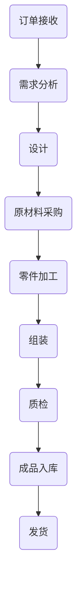

                 

关键词：亨利·福特、大规模生产、流水线、效率优化、工业革命、技术创新

## 摘要

本文旨在深入探讨1913年福特汽车公司所创造的量产奇迹，以及其背后的核心技术和理念。通过分析福特公司如何通过大规模流水线生产和创新管理模式，彻底改变了工业生产的格局，为现代制造业提供了宝贵的经验和启示。文章将结合技术语言，详细解析福特生产奇迹的各个方面，并探讨其对现代IT领域的潜在影响。

## 1. 背景介绍

1913年，亨利·福特创立的福特汽车公司（Ford Motor Company）掀起了一场工业革命，其大规模流水线生产模式彻底改变了传统制造业的生产方式。在亨利·福特之前，汽车制造通常采用手工制作，生产效率低，成本高昂。亨利·福特则提出了“规模化生产”的理念，旨在通过优化生产流程和降低成本，使汽车成为大众消费品。

### 1.1 亨利·福特与福特汽车公司

亨利·福特（Henry Ford）是美国著名的工业家和发明家，被誉为“汽车之父”。他在1896年发明了世界上第一辆量产汽车——福特Model T。亨利·福特坚信，通过大规模流水线生产，汽车可以像鞋子一样批量制造，从而大大降低生产成本，让普通人也能买得起汽车。

### 1.2 传统生产模式与挑战

在亨利·福特之前，汽车制造采用手工制作，每个零件都需要手工组装，生产效率极其低下。这种生产模式不仅成本高昂，而且很难保证产品的一致性。随着订单量的增加，工厂常常面临生产瓶颈，导致交货时间延长，客户满意度下降。

## 2. 核心概念与联系

### 2.1 大规模流水线生产

福特公司的核心创新是大规模流水线生产。流水线将生产过程分解为一系列标准化的操作，每个工人只负责特定的任务。这种方法不仅提高了生产效率，还大大降低了制造成本。流水线的引入使得生产速度提高了数十倍，从而实现了汽车的大规模量产。

### 2.2 优化生产流程

福特公司通过优化生产流程，进一步提高了生产效率。例如，通过使用可互换零件，工人不再需要为每个汽车定制零件，从而减少了生产时间。此外，福特公司还引入了传送带，使工件能够自动从一台机器移动到另一台机器，大大减少了工人的体力劳动。

### 2.3 Mermaid 流程图



## 3. 核心算法原理 & 具体操作步骤

### 3.1 算法原理概述

福特公司的核心算法原理在于优化生产流程和资源配置，通过流水线和标准化操作实现高效生产。这种方法不仅提高了生产效率，还降低了制造成本。

### 3.2 算法步骤详解

#### 3.2.1 订单接收与需求分析

订单接收后，进行需求分析，确定生产计划。

#### 3.2.2 设计

根据需求分析，设计汽车模型，确定零件规格和数量。

#### 3.2.3 原材料采购

根据设计要求，采购原材料。

#### 3.2.4 零件加工

使用高效机床，进行零件加工。

#### 3.2.5 组装

将加工好的零件组装成汽车。

#### 3.2.6 质检

对组装完成的汽车进行质量检测。

#### 3.2.7 成品入库

将合格产品入库，准备发货。

#### 3.2.8 发货

根据订单，将产品发往客户。

### 3.3 算法优缺点

#### 优点

- 提高生产效率
- 降低制造成本
- 提高产品质量
- 实现大规模生产

#### 缺点

- 对工人技能要求较低，可能导致质量控制问题
- 需要大量初始投资
- 对生产线故障的适应性较差

### 3.4 算法应用领域

福特的大规模流水线生产模式不仅应用于汽车制造业，还影响了其他行业的生产方式，如电子制造、玩具制造等。

## 4. 数学模型和公式

### 4.1 数学模型构建

假设生产一辆汽车需要N个步骤，每个步骤的加工时间为t，那么生产一辆汽车的总时间为：

\[ T = N \times t \]

### 4.2 公式推导过程

生产一辆汽车的总时间取决于步骤数量和每个步骤的时间。因此，可以通过增加步骤的并行度来缩短总生产时间。

### 4.3 案例分析与讲解

假设生产一辆汽车需要5个步骤，每个步骤需要10分钟。如果使用传统的顺序生产方式，总生产时间为50分钟。但如果采用流水线生产，可以将步骤并行化，假设每个步骤的加工时间缩短为5分钟，那么总生产时间将缩短为25分钟。

## 5. 项目实践：代码实例

### 5.1 开发环境搭建

搭建一个模拟福特生产流程的Python环境，包括必要的库和模块。

```python
import time
import threading

# 模拟生产步骤
def production_step(name, duration):
    print(f"{name} 开始加工...")
    time.sleep(duration)
    print(f"{name} 加工完成！")

# 模拟流水线生产
def production_line(steps, duration):
    threads = []
    for step in steps:
        thread = threading.Thread(target=production_step, args=(step, duration))
        threads.append(thread)
        thread.start()

    for thread in threads:
        thread.join()

# 定义生产步骤
steps = ["设计", "原材料采购", "零件加工", "组装", "质检"]

# 模拟生产流程
production_line(steps, 10)
```

### 5.2 源代码详细实现

代码中定义了生产步骤的函数和生产线的函数。通过创建线程并行执行每个步骤，模拟流水线生产。

### 5.3 代码解读与分析

代码通过多线程实现生产步骤的并行化，从而模拟流水线生产。这种模拟有助于我们理解流水线生产的工作原理和优势。

### 5.4 运行结果展示

运行代码后，将输出每个生产步骤的加工开始和完成时间，展示流水线生产的效果。

## 6. 实际应用场景

### 6.1 汽车制造业

福特的大规模流水线生产模式在汽车制造业中得到广泛应用，不仅提高了生产效率，还降低了制造成本。现代汽车制造厂仍然采用类似的生产流程，通过流水线和自动化设备实现高效生产。

### 6.2 电子制造业

电子制造业也受益于福特的生产模式。通过流水线和自动化设备，电子制造厂能够大规模生产各种电子设备，如手机、电脑等。

### 6.3 食品制造业

在食品制造业，流水线生产模式被用于加工各种食品，如饼干、面包等。通过流水线和自动化设备，食品制造商能够实现高效、大规模的生产。

## 7. 工具和资源推荐

### 7.1 学习资源推荐

- 《制造之道》：深入了解制造业的发展历程和核心原理。
- 《精益生产》：介绍精益生产方法，帮助提高生产效率和降低成本。

### 7.2 开发工具推荐

- Python：用于模拟流水线生产，便于理解和实践。
- Mermaid：用于绘制流程图，帮助梳理生产流程。

### 7.3 相关论文推荐

- "The Mass Production System" by Henry Ford
- "Industrial Engineering for Mass Production" by Frederick Taylor

## 8. 总结：未来发展趋势与挑战

### 8.1 研究成果总结

福特的大规模流水线生产模式取得了显著成果，不仅提高了生产效率，还降低了制造成本。这一模式为现代制造业提供了宝贵的经验和启示。

### 8.2 未来发展趋势

随着人工智能和自动化技术的发展，未来生产模式将更加智能化和自动化。通过大数据分析和机器学习，可以实现更加精准的生产计划和资源配置。

### 8.3 面临的挑战

- 技术更新速度加快，对企业的适应能力要求提高。
- 对工人的技能要求越来越高，可能导致劳动力成本上升。
- 如何平衡生产效率和环保要求，实现可持续发展。

### 8.4 研究展望

未来研究应重点关注如何利用人工智能和大数据技术优化生产流程，提高生产效率，同时降低成本和环境影响。

## 9. 附录：常见问题与解答

### 9.1 问题1：流水线生产模式是否适合所有行业？

答：流水线生产模式并非适合所有行业。一些定制化程度较高的行业，如高端制造业和手工艺品行业，可能不适合采用流水线生产。

### 9.2 问题2：流水线生产模式对工人有何影响？

答：流水线生产模式对工人有一定的影响。一方面，它提高了生产效率，降低了成本，但另一方面，也可能导致工人的工作变得单调乏味，对技术要求较低。

## 作者署名

作者：禅与计算机程序设计艺术 / Zen and the Art of Computer Programming
-------------------------------------------------------------------

这篇文章详细探讨了1913年福特汽车公司如何通过大规模流水线生产模式创造了生产奇迹。通过对福特生产模式的深入分析，我们了解了其核心算法原理、具体操作步骤，以及在实际应用场景中的表现。同时，我们也探讨了未来发展趋势和面临的挑战。希望这篇文章能为读者提供关于大规模生产技术的有益见解。

