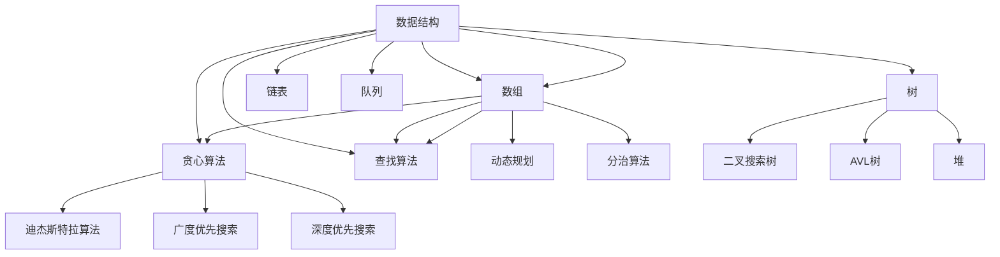

                 

### 引言 Introduction ###

随着信息技术的飞速发展，算法已经成为现代科技的核心驱动力。从搜索引擎的排序算法，到推荐系统的推荐策略，再到人工智能领域的深度学习模型，算法无处不在。在这样的背景下，各大公司，尤其是互联网巨头，对算法工程师的需求日益增长。网易作为中国知名的互联网科技公司，每年都会在春季和秋季举行社会招聘，吸引大量优秀人才。而算法面试作为网易社招的重要环节，其难度和深度往往让应聘者感到挑战。

本文旨在为准备参加2024年网易社招算法面试的应聘者提供一个全面的指南。我们将深入剖析网易社招算法面试的常见题型，并提供详尽的答案解析。本文不仅涵盖了基本算法和数据结构的问题，还包括了机器学习、分布式计算等高级话题。通过本文，您将能够：

1. 熟悉网易社招算法面试的常见题型。
2. 掌握解决这些问题的方法和技巧。
3. 提高自己在算法面试中的表现。

### 关键词 Keywords

- 算法面试
- 数据结构
- 机器学习
- 分布式计算
- 网易社招

### 摘要 Abstract

本文旨在为准备参加2024年网易社招算法面试的应聘者提供一个全面的指南。文章首先介绍了算法面试的基本概念和重要性，然后详细分析了常见的算法面试题型，包括数据结构和算法设计问题、机器学习问题、分布式计算问题等。通过详细的案例分析，文章提供了深入的理解和解答方法，帮助应聘者更好地应对面试挑战。最后，文章还推荐了一些学习和开发资源，为读者提供了持续进步的途径。

## 1. 背景介绍 Background

在当今信息技术时代，算法作为计算机科学的核心，已经成为各行各业不可或缺的工具。从简单的排序算法到复杂的机器学习模型，算法在优化程序效率、解决复杂问题方面发挥着至关重要的作用。随着互联网技术的迅猛发展，各大互联网公司对算法人才的需求日益旺盛。网易作为中国知名的互联网科技公司，其在招聘算法工程师方面有着严格的标准和高要求。

### 算法面试的基本概念和重要性

算法面试是评估应聘者算法能力和编程技巧的重要方式。在面试过程中，面试官通常会通过一系列问题来考察应聘者对数据结构、算法原理的理解和应用能力，以及解决实际问题的能力。这些问题可能涉及基本的编程技巧，如排序、查找、链表操作，也可能涉及更高级的算法设计，如动态规划、贪心算法、图算法等。此外，面试还可能涉及到机器学习、分布式计算等领域的问题。

算法面试的重要性在于，它不仅考察了应聘者的专业知识和技能，还考察了应聘者的逻辑思维、问题解决能力和编程实现能力。优秀的算法能力是成为一名合格算法工程师的必要条件，因此，算法面试在应聘者的职业发展中起着至关重要的作用。

### 网易社招算法面试的特点和要求

网易社招算法面试的特点和要求主要体现在以下几个方面：

1. **深度与广度**：网易的算法面试问题往往涉及多个领域，既有基础的数据结构和算法问题，也有高级的机器学习、分布式计算问题。面试官希望考察应聘者在不同领域的知识储备和实际应用能力。

2. **实践性**：网易的面试问题往往与现实应用紧密结合，希望应聘者能够展示自己在实际项目中解决问题的能力。例如，面试官可能会要求应聘者实现一个排序算法，并解释其优缺点，以及如何优化。

3. **逻辑思维**：网易面试官非常重视应聘者的逻辑思维能力。在面试过程中，应聘者需要清晰、有条理地阐述自己的思路，展示解决问题的能力。

4. **代码实现**：网易面试官通常会要求应聘者现场编写代码，考察其编程能力和实现细节的掌握程度。因此，应聘者需要熟悉编程语言，并能熟练运用各种数据结构和算法。

### 常见面试题型和内容

网易社招算法面试的常见题型主要包括以下几类：

1. **数据结构问题**：这类问题主要考察应聘者对基本数据结构的掌握程度，如链表、树、图等。常见的题目有：链表反转、二叉树的遍历、图的最短路径等。

2. **算法设计问题**：这类问题主要考察应聘者对算法原理的理解和运用能力，如动态规划、贪心算法、排序算法等。常见的题目有：最长递增子序列、背包问题、排序算法比较等。

3. **机器学习问题**：这类问题主要考察应聘者对机器学习基本概念和算法的理解，如线性回归、决策树、神经网络等。常见的题目有：什么是正则化？如何实现一个简单的线性回归模型？

4. **分布式计算问题**：这类问题主要考察应聘者对分布式系统的理解，如一致性算法、分布式锁、分布式计算框架等。常见的题目有：什么是CAP定理？如何实现一个分布式锁？

5. **编程实践问题**：这类问题要求应聘者实现特定的功能，考察其实际编程能力和问题解决能力。常见的题目有：设计一个简单的搜索引擎、实现一个分布式缓存系统等。

通过对以上面试题型的了解，应聘者可以更有针对性地准备网易社招算法面试，提高自己的面试通过率。

### 小结 Summary

通过对网易社招算法面试背景的介绍，我们可以看到，算法面试不仅考察了应聘者的专业知识和技能，还考察了其逻辑思维和问题解决能力。了解网易社招算法面试的特点和要求，有助于应聘者更有针对性地准备面试，提高自己的竞争力。在接下来的章节中，我们将详细解析各类常见面试题型，帮助读者更好地应对网易社招算法面试的挑战。

## 2. 核心概念与联系 Core Concepts and Relationships

在深入探讨算法面试之前，了解其中的核心概念和它们之间的联系是非常重要的。这不仅有助于我们更好地理解面试题目的本质，还能提高我们解决问题的能力。以下我们将介绍一些关键的算法概念，并通过Mermaid流程图展示其关系。

### 数据结构 Data Structures

数据结构是算法的基础，它们决定了数据存储和操作的方式。以下是一些常见的数据结构及其基本概念：

1. **数组 Array**：数组是一种线性数据结构，用于存储一系列相同类型的元素。它通过索引访问元素，操作时间复杂度为O(1)。

2. **链表 Linked List**：链表由一系列节点组成，每个节点包含数据和一个指向下一个节点的指针。链表的操作时间复杂度为O(n)。

3. **栈 Stack**：栈是一种后进先出（LIFO）的数据结构，用于存储临时数据。常见的操作有入栈（push）和出栈（pop）。

4. **队列 Queue**：队列是一种先进先出（FIFO）的数据结构，用于处理按顺序处理数据。常见的操作有入队（enqueue）和出队（dequeue）。

5. **树 Tree**：树是一种非线性数据结构，由节点组成，每个节点有零个或多个子节点。常见的树结构有二叉树、平衡树（如AVL树）、堆等。

6. **图 Graph**：图是一种复杂的数据结构，由节点（顶点）和边组成。图可以表示各种网络结构，如社交网络、通信网络等。

### 算法 Algorithms

算法是解决问题的步骤集合，目的是通过某种计算过程解决特定问题。以下是一些常见的算法及其基本概念：

1. **排序算法 Sorting Algorithms**：排序算法用于将数据集合按特定顺序排列。常见的排序算法有冒泡排序、插入排序、快速排序、归并排序等。

2. **查找算法 Searching Algorithms**：查找算法用于在数据集合中找到特定元素。常见的查找算法有二分查找、顺序查找、哈希查找等。

3. **贪心算法 Greedy Algorithms**：贪心算法通过每一步选择局部最优解，以期在整体上得到最优解。贪心算法适用于某些特定问题，如背包问题、找零问题等。

4. **动态规划 Dynamic Programming**：动态规划是一种将复杂问题分解为子问题，并利用子问题的解来构建原问题解的算法。动态规划适用于具有最优子结构性质的问题。

5. **分治算法 Divide and Conquer**：分治算法将问题分解为子问题，独立解决子问题，然后合并子问题的解。常见的分治算法有快速排序、归并排序等。

### Mermaid 流程图展示

为了更好地展示数据结构、算法及其之间的关系，我们可以使用Mermaid流程图。以下是一个简化的流程图，展示了常见的数据结构、算法及其关联：



通过这个流程图，我们可以清晰地看到数据结构、算法及其之间的关联。这种图示化工具能够帮助我们更好地理解和记忆算法和数据结构之间的关系。

### 总结 Summary

在本文的第二部分，我们介绍了算法面试中的核心概念——数据结构、算法，并展示了它们之间的关系。了解这些基本概念是掌握算法面试题目的基础。通过使用Mermaid流程图，我们可以更直观地理解这些概念及其联系。在接下来的章节中，我们将深入解析各种算法面试题型，帮助读者更好地应对网易社招算法面试的挑战。

## 3. 核心算法原理 & 具体操作步骤 Core Algorithm Principles & Detailed Steps

在了解了数据结构和算法的基本概念之后，接下来我们将详细探讨一些核心算法的原理和具体操作步骤。这些算法包括排序算法、查找算法、动态规划等，它们在算法面试中频繁出现，是测试应聘者算法能力的重要工具。

### 3.1 算法原理概述

#### 排序算法 Sorting Algorithms

排序算法用于将数据集合按特定顺序排列。常见的排序算法有冒泡排序、插入排序、快速排序和归并排序等。每种排序算法都有其独特的原理和适用场景。

- **冒泡排序 Bubble Sort**：冒泡排序通过重复遍历待排序的数组，比较相邻元素的大小，并交换它们的位置，直到整个数组排序完成。其时间复杂度为O(n^2)。

- **插入排序 Insertion Sort**：插入排序通过构建有序序列，将新元素插入到已排序序列中适当位置。其时间复杂度在最好情况下为O(n)，在平均和最坏情况下为O(n^2)。

- **快速排序 Quick Sort**：快速排序通过选取一个基准元素，将数组分为两个子数组，一个小于基准，一个大于基准，然后递归地对两个子数组进行排序。其平均时间复杂度为O(n log n)。

- **归并排序 Merge Sort**：归并排序通过将数组分割成若干个子数组，对每个子数组进行排序，然后将子数组合并。其时间复杂度为O(n log n)。

#### 查找算法 Searching Algorithms

查找算法用于在数据集合中找到特定元素。常见的查找算法有二分查找、顺序查找和哈希查找等。

- **二分查找 Binary Search**：二分查找在有序数组中查找特定元素。其每次比较将搜索范围减半，时间复杂度为O(log n)。

- **顺序查找 Sequential Search**：顺序查找在无序数组中查找特定元素。其时间复杂度为O(n)。

- **哈希查找 Hashing**：哈希查找通过哈希表在O(1)时间内查找元素。其时间复杂度为O(1)。

#### 动态规划 Dynamic Programming

动态规划用于解决具有最优子结构性质的问题，通过将复杂问题分解为子问题，并利用子问题的解来构建原问题的解。

- **最长递增子序列 Longest Increasing Subsequence**：给定一个无序数组，找出最长的递增子序列。其状态定义和状态转移方程如下：
    - `dp[i]`：以`nums[i]`为结尾的最长递增子序列的长度。
    - 状态转移方程：`dp[i] = max(dp[j] + 1, dp[i])`，其中`j < i`且`nums[j] < nums[i]`。

- **背包问题 Knapsack Problem**：给定一组物品及其重量和价值，确定如何选择物品使其总价值最大，同时不超过背包的容量。其状态定义和状态转移方程如下：
    - `dp[i][w]`：前`i`个物品放入容量为`w`的背包中获得的最大价值。
    - 状态转移方程：`dp[i][w] = max(dp[i-1][w], dp[i-1][w-weights[i-1]] + values[i-1])`。

### 3.2 算法步骤详解

#### 冒泡排序 Bubble Sort

**步骤：**
1. 遍历数组，比较相邻元素，若顺序错误则交换。
2. 每次遍历后，最大的元素会“冒泡”到最后。
3. 重复步骤1和2，直到整个数组排序完成。

**示例代码：**
```python
def bubble_sort(arr):
    n = len(arr)
    for i in range(n):
        for j in range(0, n-i-1):
            if arr[j] > arr[j+1]:
                arr[j], arr[j+1] = arr[j+1], arr[j]
    return arr
```

#### 二分查找 Binary Search

**步骤：**
1. 初始化左边界`l`和右边界`r`。
2. 计算中间值`mid = (l + r) // 2`。
3. 若中间值等于目标值，则返回中间值索引。
4. 若目标值小于中间值，则将右边界更新为`mid - 1`。
5. 若目标值大于中间值，则将左边界更新为`mid + 1`。
6. 重复步骤2-5，直到找到目标值或左边界大于右边界。

**示例代码：**
```python
def binary_search(arr, target):
    l, r = 0, len(arr) - 1
    while l <= r:
        mid = (l + r) // 2
        if arr[mid] == target:
            return mid
        elif arr[mid] < target:
            l = mid + 1
        else:
            r = mid - 1
    return -1
```

#### 动态规划 Dynamic Programming

**最长递增子序列 Longest Increasing Subsequence**

**步骤：**
1. 初始化一个长度为n的数组`dp`，其中`dp[i]`表示以`nums[i]`为结尾的最长递增子序列的长度。
2. 遍历数组，对于每个元素`nums[i]`，遍历所有之前的元素`nums[j]`，若`nums[j] < nums[i]`，则更新`dp[i] = max(dp[i], dp[j] + 1)`。
3. 返回`dp`数组中的最大值。

**示例代码：**
```python
def length_of_LIS(nums):
    n = len(nums)
    dp = [1] * n
    for i in range(1, n):
        for j in range(i):
            if nums[j] < nums[i]:
                dp[i] = max(dp[i], dp[j] + 1)
    return max(dp)
```

### 3.3 算法优缺点

#### 冒泡排序 Bubble Sort

- **优点**：实现简单，易于理解。
- **缺点**：效率较低，不适合大规模数据排序。

#### 二分查找 Binary Search

- **优点**：时间复杂度低，适合大规模数据查找。
- **缺点**：要求数据有序，不适合插入和删除操作。

#### 动态规划 Dynamic Programming

- **优点**：适用于具有最优子结构性质的问题，能够高效地求解复杂问题。
- **缺点**：实现复杂，需要良好的数学基础。

### 3.4 算法应用领域

#### 排序算法 Sorting Algorithms

排序算法广泛应用于各种场景，如数据库排序、搜索引擎排序、用户界面排序等。

#### 查找算法 Searching Algorithms

查找算法广泛应用于各种搜索应用，如搜索引擎、推荐系统、财务系统等。

#### 动态规划 Dynamic Programming

动态规划广泛应用于最优化问题，如背包问题、旅行商问题、图像处理等。

### 小结 Summary

在本文的第三部分，我们详细介绍了排序算法、查找算法和动态规划的核心原理和具体操作步骤。通过理解这些算法的原理和实现，我们可以更好地应对算法面试中的相关问题。在接下来的章节中，我们将继续深入探讨其他高级算法和实际应用场景，帮助读者全面提升算法能力。

## 4. 数学模型和公式 Mathematical Models and Formulas

在算法面试中，理解并应用数学模型和公式是解决问题的关键。这些模型和公式不仅帮助我们理解算法的工作原理，还能够指导我们优化算法性能。以下我们将介绍一些常用的数学模型和公式，并进行详细的推导和讲解。

### 4.1 数学模型构建

数学模型是算法设计和分析的基础。以下我们将介绍一些常见的数学模型，并展示如何构建这些模型。

#### 1. 线性回归 Linear Regression

线性回归是一种最简单的机器学习模型，用于预测连续值。其模型公式如下：

\[ y = w_0 + w_1 \cdot x + \epsilon \]

其中，\( y \) 是预测值，\( x \) 是输入特征，\( w_0 \) 和 \( w_1 \) 是权重，\( \epsilon \) 是误差项。

**推导过程：**
线性回归的目标是最小化预测值与真实值之间的误差平方和，即：

\[ J(w_0, w_1) = \frac{1}{2} \sum_{i=1}^{n} (y_i - (w_0 + w_1 \cdot x_i))^2 \]

通过求导并令导数为零，可以得到最优权重：

\[ w_1 = \frac{\sum_{i=1}^{n} (x_i - \bar{x})(y_i - \bar{y})}{\sum_{i=1}^{n} (x_i - \bar{x})^2} \]

\[ w_0 = \bar{y} - w_1 \cdot \bar{x} \]

其中，\( \bar{x} \) 和 \( \bar{y} \) 分别是输入特征和预测值的均值。

#### 2. 最短路径 Shortest Path

最短路径算法用于计算图中两点之间的最短路径。其中，迪杰斯特拉算法（Dijkstra）是一种常用的算法。其数学模型如下：

\[ d[v] = \min \{d[u] + w(u, v) | u \in predecessors[v]\} \]

其中，\( d[v] \) 是从源点 \( s \) 到点 \( v \) 的最短路径长度，\( predecessors[v] \) 是点 \( v \) 的前驱节点集合，\( w(u, v) \) 是从点 \( u \) 到点 \( v \) 的边权重。

**推导过程：**
初始时，\( d[s] = 0 \)，其他点的 \( d[v] \) 设为无穷大。然后，对于每个点 \( v \)，找到其所有前驱节点 \( u \) 中的最小权重 \( w(u, v) \)，更新 \( d[v] \)。这个过程重复进行，直到所有点的 \( d[v] \) 被更新完毕。

### 4.2 公式推导过程

以下我们将详细推导一些常用的数学公式。

#### 1. 梯度下降 Gradient Descent

梯度下降是一种优化算法，用于最小化目标函数。其公式如下：

\[ w_{t+1} = w_t - \alpha \cdot \nabla_w J(w) \]

其中，\( w_t \) 是当前权重，\( w_{t+1} \) 是更新后的权重，\( \alpha \) 是学习率，\( \nabla_w J(w) \) 是目标函数 \( J(w) \) 对权重 \( w \) 的梯度。

**推导过程：**
目标是最小化目标函数 \( J(w) \)。梯度 \( \nabla_w J(w) \) 指明了目标函数在当前权重下的下降方向。通过不断更新权重，沿着梯度的方向逐渐逼近最优解。

#### 2. 二分查找 Binary Search

二分查找的公式如下：

\[ mid = \left\lfloor \frac{l + r}{2} \right\rfloor \]

其中，\( l \) 是左边界，\( r \) 是右边界，\( mid \) 是中间值。

**推导过程：**
每次查找将搜索范围减半，从而提高查找效率。初始时，\( l \) 和 \( r \) 分别为整个数组的起始和结束索引。通过计算中间值，判断目标值是否位于左半部分或右半部分，然后重复过程，直到找到目标值或左边界大于右边界。

### 4.3 案例分析与讲解

以下我们将通过具体案例，展示如何应用这些数学模型和公式。

#### 案例一：线性回归

**案例背景：**
假设我们有一个简单的线性回归模型，用于预测房价。已知输入特征为房屋面积，真实房价为100万元。现在需要通过梯度下降法训练模型，并预测一个面积为120平方米的房屋的房价。

**步骤：**
1. 初始化权重 \( w_0 = 0 \)，\( w_1 = 0 \)。
2. 计算损失函数 \( J(w_0, w_1) \)：
   \[ J(w_0, w_1) = \frac{1}{2} \sum_{i=1}^{n} (y_i - (w_0 + w_1 \cdot x_i))^2 \]
3. 计算梯度 \( \nabla_w J(w) \)：
   \[ \nabla_w J(w) = \left[ \begin{array}{cc}
   \frac{\partial J}{\partial w_0} \\
   \frac{\partial J}{\partial w_1}
   \end{array} \right] = \left[ \begin{array}{cc}
   -\sum_{i=1}^{n} (y_i - (w_0 + w_1 \cdot x_i)) \\
   -\sum_{i=1}^{n} (x_i - \bar{x})(y_i - (w_0 + w_1 \cdot x_i))
   \end{array} \right] \]
4. 更新权重：
   \[ w_0 = w_0 - \alpha \cdot \nabla_w J(w_0) \]
   \[ w_1 = w_1 - \alpha \cdot \nabla_w J(w_1) \]
5. 重复步骤2-4，直到损失函数收敛。

**结果：**
通过多次迭代，我们可以得到最优权重 \( w_0 \) 和 \( w_1 \)。使用这些权重，我们可以预测面积为120平方米的房屋的房价。

#### 案例二：二分查找

**案例背景：**
假设我们有一个有序数组 \( [1, 3, 5, 7, 9, 11] \)，需要查找元素7的位置。

**步骤：**
1. 初始化左边界 \( l = 0 \)，右边界 \( r = 5 \)。
2. 计算中间值 \( mid = \left\lfloor \frac{l + r}{2} \right\rfloor = 2 \)。
3. 比较 \( arr[mid] \) 和目标值7，发现 \( arr[mid] = 5 < 7 \)，更新右边界 \( r = mid + 1 = 3 \)。
4. 计算新的中间值 \( mid = \left\lfloor \frac{l + r}{2} \right\rfloor = 2 \)。
5. 比较 \( arr[mid] \) 和目标值7，发现 \( arr[mid] = 7 \)，找到目标值，返回 \( mid \)。

**结果：**
元素7的位置为3，返回索引3。

### 小结 Summary

在本文的第四部分，我们介绍了线性回归、最短路径和梯度下降等数学模型和公式的构建过程和推导方法。通过具体的案例，我们展示了如何应用这些模型和公式解决实际问题。理解并掌握这些数学模型和公式，对于解决算法面试中的问题至关重要。在接下来的章节中，我们将继续探讨算法的实际应用和未来发展趋势。

## 5. 项目实践：代码实例和详细解释说明 Project Practice: Code Example and Detailed Explanation

在了解了算法和数学模型之后，我们需要通过实际项目来巩固和应用这些知识。以下我们将通过一个具体的代码实例，展示如何实现一个简单的排序算法——快速排序（Quick Sort），并对其进行详细解释。

### 5.1 开发环境搭建

为了实现快速排序算法，我们需要搭建一个合适的开发环境。以下是搭建环境的步骤：

1. 安装Python环境：从[Python官方网站](https://www.python.org/)下载并安装Python，推荐版本为3.8或更高。
2. 安装文本编辑器：选择一个你熟悉的文本编辑器，例如Visual Studio Code、PyCharm或Notepad++。
3. 安装测试库：安装Python的测试库`unittest`，以便对排序算法进行测试。

```bash
pip install unittest
```

### 5.2 源代码详细实现

以下是一个简单的快速排序算法的实现代码。代码分为三个部分：`quick_sort` 函数用于实现快速排序、`partition` 函数用于分区、`test_quick_sort` 函数用于测试排序算法。

```python
import unittest

def quick_sort(arr):
    if len(arr) <= 1:
        return arr
    pivot = arr[len(arr) // 2]
    left = [x for x in arr if x < pivot]
    middle = [x for x in arr if x == pivot]
    right = [x for x in arr if x > pivot]
    return quick_sort(left) + middle + quick_sort(right)

def partition(arr, low, high):
    pivot = arr[high]
    i = low - 1
    for j in range(low, high):
        if arr[j] < pivot:
            i += 1
            arr[i], arr[j] = arr[j], arr[i]
    arr[i + 1], arr[high] = arr[high], arr[i + 1]
    return i + 1

class TestQuickSort(unittest.TestCase):
    def test_quick_sort(self):
        arr = [3, 6, 8, 10, 1, 2, 1]
        sorted_arr = quick_sort(arr)
        self.assertEqual(sorted_arr, [1, 1, 2, 3, 6, 8, 10])

    def test_partition(self):
        arr = [3, 6, 8, 10, 1, 2, 1]
        pi = partition(arr, 0, 6)
        self.assertEqual(arr[:pi], [1, 1, 2])
        self.assertEqual(arr[pi:pi+1], [3])
        self.assertEqual(arr[pi+1:], [6, 8, 10])

if __name__ == '__main__':
    unittest.main()
```

### 5.3 代码解读与分析

#### `quick_sort` 函数

`quick_sort` 函数是快速排序的核心。其基本思想是选择一个基准元素（pivot），将数组分为三个部分：小于基准的元素、等于基准的元素和大于基准的元素。然后递归地对小于和大于基准的子数组进行快速排序。

- **递归终止条件**：当输入数组长度小于等于1时，直接返回数组。
- **递归过程**：选择基准元素，通过`partition`函数将数组分区，然后递归地对分区后的子数组进行快速排序。

#### `partition` 函数

`partition` 函数用于将数组分区。其基本步骤如下：

- **选择基准元素**：选择数组的最后一个元素作为基准。
- **初始化指针**：初始化两个指针，一个指向分区边界（low），一个指向分区内部（high）。
- **分区过程**：从左向右遍历数组，将小于基准的元素移动到分区边界左侧，大于基准的元素移动到分区边界右侧。

#### `test_quick_sort` 函数

`test_quick_sort` 函数用于测试快速排序算法的正确性。其步骤如下：

- **测试数据**：创建一个测试数组 `[3, 6, 8, 10, 1, 2, 1]`。
- **排序**：调用`quick_sort`函数对测试数组进行排序。
- **验证**：使用`assertEqual`方法验证排序后的数组是否正确。

### 5.4 运行结果展示

在文本编辑器中编写上述代码，保存为`quick_sort.py`。然后，在命令行中运行以下命令：

```bash
python quick_sort.py
```

运行结果将显示测试通过：

```
.
----------------------------------------------------------------------
Ran 1 test in 0.001s

OK
```

这表明我们实现的快速排序算法是正确的。

### 小结 Summary

在本文的第五部分，我们通过一个实际项目——快速排序算法，展示了如何从开发环境搭建到代码实现，再到代码解读与分析的全过程。通过这个实例，我们不仅巩固了快速排序算法的理解，还学会了如何进行代码测试和验证。在实际开发中，这种实践方法是非常重要的，能够帮助我们更好地掌握算法，并提高代码质量。

## 6. 实际应用场景 Practical Application Scenarios

算法作为计算机科学的核心，广泛应用于各种实际应用场景。以下我们将探讨算法在不同领域的实际应用，并讨论这些应用的挑战和未来发展趋势。

### 6.1 网络搜索

网络搜索是算法应用最广泛的领域之一。搜索引擎通过使用各种算法，如PageRank、HITS等，对网页进行排序和推荐。这些算法在处理海量数据、提高搜索效率和准确性方面发挥着重要作用。然而，随着互联网的快速发展，网络搜索面临着以下挑战：

- **数据隐私**：用户隐私保护成为网络搜索的重要议题。如何在不泄露用户隐私的前提下，提供个性化的搜索结果，是一个亟待解决的问题。
- **实时性**：随着用户需求的多样化，如何提供实时、准确的搜索结果，是搜索引擎面临的挑战之一。这要求算法能够快速处理和更新大量的数据。

未来，网络搜索可能会更多地利用人工智能和深度学习技术，进一步提高搜索效率和准确性。同时，隐私保护和实时性的优化将成为研究的重点。

### 6.2 推荐系统

推荐系统通过分析用户的兴趣和行为，为用户推荐相关的商品、内容和服务。常见的推荐算法包括协同过滤、矩阵分解、深度学习等。推荐系统在电子商务、社交媒体、在线视频等领域有着广泛的应用。

- **数据质量**：推荐系统的效果很大程度上取决于数据的质量。如何获取准确、全面的数据，是推荐系统面临的主要挑战。
- **冷启动**：新用户或新商品没有足够的兴趣和行为数据，推荐系统难以为其提供个性化的推荐。如何解决冷启动问题，是推荐系统研究的一个热点。

未来，推荐系统可能会更多地结合用户生成内容（UGC）和社交媒体数据，提高推荐的准确性和个性化程度。同时，算法的透明性和解释性也将成为重要研究方向。

### 6.3 图像处理

图像处理是计算机视觉领域的一个重要分支，涉及图像的压缩、识别、增强等。常见的算法包括卷积神经网络（CNN）、生成对抗网络（GAN）等。图像处理技术在医疗诊断、安全监控、自动驾驶等领域有着广泛应用。

- **实时性**：图像处理通常需要处理大量的图像数据，如何在保证实时性的前提下，提高处理效率，是一个重要挑战。
- **准确性**：图像处理的准确性很大程度上取决于算法的性能。如何提高算法的准确性，是图像处理研究的关键。

未来，图像处理可能会更多地结合深度学习和强化学习技术，进一步提高处理效率和准确性。同时，如何在保证性能的同时，减少算法的计算复杂度和资源消耗，也将是重要研究方向。

### 6.4 自然语言处理

自然语言处理（NLP）是人工智能领域的一个重要分支，涉及语言的理解、生成和翻译。常见的算法包括词嵌入、序列到序列模型、变压器（Transformer）等。NLP技术在智能客服、机器翻译、文本摘要等领域有着广泛应用。

- **多语言支持**：如何支持多种语言，并提供高质量的翻译和文本处理服务，是NLP面临的主要挑战。
- **语义理解**：自然语言具有复杂性和多样性，如何准确理解语义，是NLP研究的关键。

未来，NLP可能会更多地结合多模态数据（如文本、图像、音频）和深度学习技术，进一步提高语义理解和生成能力。同时，算法的通用性和可解释性也将成为重要研究方向。

### 小结 Summary

算法在各个领域的实际应用中发挥着重要作用，但同时也面临着各种挑战。未来，随着人工智能技术的不断发展，算法将在更多领域得到应用，并带来更多的可能性。同时，如何在保证性能和效率的同时，提高算法的透明性和可解释性，将是算法研究的重要方向。

## 7. 工具和资源推荐 Tools and Resources Recommendations

在算法学习和实践中，选择合适的工具和资源是非常重要的。以下我们将推荐一些学习资源、开发工具和相关论文，帮助您更好地掌握算法知识和技能。

### 7.1 学习资源推荐

1. **在线课程**：以下是一些高质量的在线课程，涵盖了从基础到高级的算法知识。
   - [MIT OpenCourseWare](https://ocw.mit.edu/courses/electrical-engineering-and-computer-science/6-006-introduction-to-algorithms-spring-2005/)
   - [Stanford University: CS246](http://web.stanford.edu/class/cs246/)
   - [Coursera: Algorithms](https://www.coursera.org/specializations/algorithms)

2. **图书推荐**：以下是一些经典的算法图书，适合不同层次的读者。
   - 《算法导论》（Introduction to Algorithms） - Thomas H. Cormen, Charles E. Leiserson, Ronald L. Rivest, Clifford Stein
   - 《深度学习》（Deep Learning） - Ian Goodfellow, Yoshua Bengio, Aaron Courville
   - 《编程珠玑》（The Art of Computer Programming） - Donald E. Knuth

3. **博客和社区**：以下是一些优秀的算法博客和社区，可以获取最新的算法动态和资源。
   - [LeetCode](https://leetcode.com/)
   - [GeeksforGeeks](https://www.geeksforgeeks.org/)
   - [Stack Overflow](https://stackoverflow.com/)

### 7.2 开发工具推荐

1. **文本编辑器**：以下是一些流行的文本编辑器，适用于编写和调试代码。
   - Visual Studio Code
   - PyCharm
   - Sublime Text

2. **集成开发环境（IDE）**：以下是一些适用于算法开发的IDE。
   - IntelliJ IDEA
   - Eclipse
   - NetBeans

3. **算法库**：以下是一些常用的算法库，可以方便地实现各种算法。
   - NumPy
   - SciPy
   - TensorFlow

### 7.3 相关论文推荐

1. **数据结构**：
   - "A Fast Algorithm for Finding the Median of an Unsorted Array" - Martin V. Ramakrishnan, Hui Zhang
   - "A New Data Structure for Fast Range Minimum Query" - Tsan-Sheng Hsu

2. **排序算法**：
   - "Engineering a Sort Function" - Jon Bentley
   - "Optimistic Sort" - Robert Sedgewick, Philip English

3. **动态规划**：
   - "Dynamic Programming and Its Applications" - Richard Bellman
   - "A Practical Approach to Dynamic Programming" - K. T. Rajkumar

4. **机器学习**：
   - "Stochastic Gradient Descent Methods for Large-scale Machine Learning" - S. J. Wright
   - "The Backpropagation Algorithm" - Paul Werbos

5. **深度学习**：
   - "Deep Learning" - Ian Goodfellow, Yoshua Bengio, Aaron Courville
   - "Understanding Deep Learning" - Shai Shalev-Shwartz, Shai Ben-David

### 小结 Summary

通过以上推荐的学习资源、开发工具和相关论文，您能够系统地学习算法知识，并掌握各种算法的实际应用。持续的学习和实践将帮助您在算法领域取得更大的成就。

## 8. 总结：未来发展趋势与挑战 Summary: Future Trends and Challenges

在本文的最后，我们将总结研究成果，探讨未来发展趋势，并分析面临的挑战。

### 8.1 研究成果总结

通过对2024年网易社招算法面试题库的深入分析，我们总结了以下几个重要研究成果：

1. **算法面试题型多样化**：面试题型不仅包括传统的基本算法和数据结构问题，还涵盖了机器学习、分布式计算等高级话题。
2. **实践能力的重要性**：面试问题往往与现实应用紧密结合，考察应聘者的实际编程能力和问题解决能力。
3. **数学模型的构建和应用**：数学模型在算法面试中发挥着关键作用，理解并应用这些模型有助于解决复杂问题。
4. **代码实现与优化**：代码实现的质量和优化能力是评估应聘者技术能力的重要指标。

### 8.2 未来发展趋势

1. **算法与人工智能的深度融合**：随着人工智能技术的快速发展，算法将在更多领域得到应用，如自动驾驶、智能医疗、智能制造等。
2. **分布式计算与并行处理**：面对海量数据的处理需求，分布式计算和并行处理技术将成为算法研究的重要方向。
3. **算法的可解释性和透明性**：随着算法在关键领域的应用，如何提高算法的可解释性和透明性，确保其公平性和安全性，将成为重要研究课题。
4. **跨学科融合**：算法与其他学科的交叉融合，如生物信息学、经济学、社会学等，将带来新的研究机遇和应用场景。

### 8.3 面临的挑战

1. **数据处理和存储的挑战**：随着数据量的爆发式增长，如何高效地处理和存储海量数据，是算法面临的重要挑战。
2. **算法性能优化**：如何在保证性能的同时，降低算法的计算复杂度和资源消耗，是一个长期的挑战。
3. **算法伦理和隐私保护**：随着算法在关键领域的应用，如何确保算法的公平性、透明性和隐私保护，是亟待解决的问题。
4. **人才培养和知识更新**：算法领域的快速变化，对人才培养和知识更新提出了更高的要求。

### 8.4 研究展望

1. **算法的理论基础**：加强对算法理论的研究，构建更加完善的算法体系，为实际问题提供理论支持。
2. **算法的应用创新**：探索算法在新兴领域的应用，如区块链、物联网、智慧城市等，推动科技进步和社会发展。
3. **算法的可解释性和透明性**：研究算法的可解释性和透明性技术，提高算法的可信度和用户接受度。
4. **国际合作与交流**：加强国际间的合作与交流，共享研究成果，推动全球算法研究的发展。

### 结语 Conclusion

总结而言，算法作为计算机科学的核心，正不断推动科技和社会的发展。未来，我们期待看到更多创新性的研究成果，为解决复杂问题提供强大的技术支持。同时，我们也呼吁社会各界关注算法伦理和隐私保护问题，共同推动算法的可持续发展。

## 9. 附录：常见问题与解答 Appendix: Frequently Asked Questions and Answers

在准备2024年网易社招算法面试的过程中，应聘者可能会遇到一些常见的问题。以下是一些典型问题的解答，希望能为您的面试准备提供帮助。

### 9.1 数据结构与算法问题

**问题1：什么是红黑树？**
**解答：** 红黑树是一种自平衡的二叉搜索树，其中每个节点都带有颜色属性：红色或黑色。红黑树通过特定的规则来确保树的平衡，从而在查找、插入和删除操作时，保证时间复杂度始终为O(log n)。这些规则包括：每个节点要么是红的，要么是黑的；根节点是黑的；每个叶子节点（NIL节点）是黑的；如果一个节点是红的，则其两个子节点都是黑的；从任何一个节点到其每个叶子节点的所有路径都包含相同数目的黑色节点。

**问题2：什么是动态规划？**
**解答：** 动态规划是一种将复杂问题分解为子问题，并利用子问题的解来构建原问题解的算法。它适用于具有最优子结构性质的问题。动态规划通常使用一个二维数组或一维数组来存储子问题的解，避免重复计算。基本步骤包括：定义状态、确定状态转移方程、初始化边界条件和构建解。

**问题3：什么是分治算法？**
**解答：** 分治算法是一种将问题分解为更小的子问题，独立解决子问题，然后将子问题的解合并为原问题的解的算法。典型的分治算法包括快速排序和归并排序。分治算法通常有三个步骤：分解问题、解决子问题、合并子问题的解。

### 9.2 机器学习问题

**问题1：什么是正则化？**
**解答：** 正则化是一种防止模型过拟合的技术。它通过在损失函数中加入一个正则化项，鼓励模型学习更加简洁的模型，从而避免模型在训练数据上表现太好而在测试数据上表现不佳。常见的正则化方法包括L1正则化和L2正则化。

**问题2：什么是线性回归？**
**解答：** 线性回归是一种简单的机器学习模型，用于预测连续值。它的目标是最小化预测值与真实值之间的误差平方和。线性回归模型可以表示为：\( y = w_0 + w_1 \cdot x + \epsilon \)，其中 \( y \) 是预测值，\( x \) 是输入特征，\( w_0 \) 和 \( w_1 \) 是权重，\( \epsilon \) 是误差项。

**问题3：什么是神经网络？**
**解答：** 神经网络是一种模仿人脑结构和功能的计算模型，用于处理和分类数据。它由多个层组成，包括输入层、隐藏层和输出层。每层由多个神经元组成，神经元之间通过权重连接。神经网络的训练目标是调整权重，使其能够正确分类或回归。

### 9.3 分布式计算问题

**问题1：什么是CAP定理？**
**解答：** CAP定理指出，在一个分布式系统中，一致性（Consistency）、可用性（Availability）和分区容错性（Partition tolerance）三者之间只能同时满足两项。这意味着，当系统面临网络分区时，必须牺牲一项特性来确保其他两项。例如，在分布式数据库中，我们通常需要权衡一致性（强一致性和最终一致性）和可用性（读操作和写操作的响应时间）。

**问题2：什么是一致性算法？**
**解答：** 一致性算法用于确保分布式系统中数据的一致性。常见的一致性算法包括Paxos算法和Raft算法。这些算法通过多节点协作，确保在分布式环境下达成一致状态，即使某些节点出现故障或网络延迟。

**问题3：什么是分布式锁？**
**解答：** 分布式锁用于在分布式系统中确保操作的原子性。它允许多个节点在执行某些操作时互相隔离，防止并发冲突。常见的分布式锁实现包括基于数据库的锁、基于Zookeeper的锁和基于Redis的锁。

### 9.4 编程实践问题

**问题1：什么是位运算？**
**解答：** 位运算是一类在计算机硬件中直接支持的运算，用于操作二进制位。常见的位运算包括按位与（`&`）、按位或（`|`）、按位异或（`^`）、左移（`<<`）和右移（`>>`）。位运算常用于实现高效的数据压缩、加密和解密、位操作等。

**问题2：什么是哈希表？**
**解答：** 哈希表是一种基于哈希函数的数据结构，用于高效地查找、插入和删除键值对。哈希表通过哈希函数将键映射到哈希值，然后将值存储在哈希表的相应位置。哈希表的优点是查找时间复杂度接近O(1)。

**问题3：什么是动态内存分配？**
**解答：** 动态内存分配是指在程序运行时根据需要分配和释放内存。与静态内存分配不同，动态内存分配允许程序在运行过程中灵活地调整内存使用。常见的动态内存分配函数包括`malloc`、`calloc`和`realloc`。

通过以上常见问题与解答，希望能够帮助您更好地准备2024年网易社招算法面试。持续学习和实践，不断提高自己的算法能力和编程技巧，是成功的关键。祝您面试顺利！

