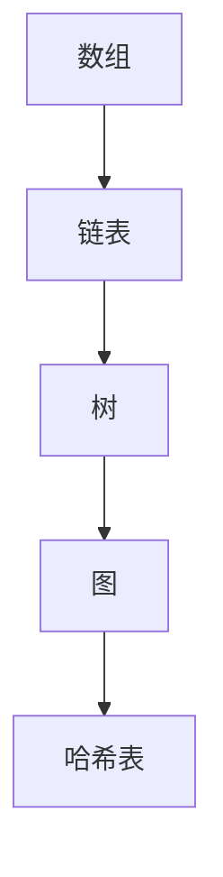

                 

关键词：美团社招、算法面试、面试题目、算法原理、应用领域、代码实现

> 摘要：本文汇编了2025年美团社招算法岗位的面试题目，包括核心概念、算法原理、数学模型、项目实践、应用场景等，旨在为准备美团算法面试的读者提供有价值的参考。

## 1. 背景介绍

美团作为中国领先的本地生活服务提供商，对算法技术有着极高的要求。随着业务规模的不断扩大和复杂度增加，美团对算法工程师的需求持续增长。本文旨在汇编2025年美团社招算法岗位的面试题目，帮助读者更好地准备面试，提升算法能力。

### 美团算法岗位的重要性

美团作为一家服务多元化的公司，其业务涵盖了餐饮、酒店、旅游、出行等多个领域，而这些业务的发展都离不开强大的算法支持。算法不仅决定了美团推荐系统的精准度，还影响了配送路线优化、用户行为分析等关键环节。因此，美团对算法工程师的要求非常高，面试题目也相应地复杂且深入。

### 算法岗位的面试形式

美团的算法面试通常包括以下几个环节：

1. **在线编程题**：通常在LeetCode、牛客网等平台上完成，考察算法和数据结构的实现能力。
2. **技术面试**：由美团内部算法专家或技术经理进行，涉及算法原理、数学模型、项目经验等多个方面。
3. **小组讨论**：与其他应聘者一起讨论题目，考察团队合作能力和解决问题的能力。

## 2. 核心概念与联系

### 核心概念

在算法面试中，核心概念是基础，也是考生需要熟练掌握的内容。以下是一些重要的核心概念：

1. **数据结构**：如数组、链表、树、图等。
2. **算法复杂度**：如时间复杂度、空间复杂度等。
3. **动态规划**：解决优化问题的常见算法。
4. **贪心算法**：在每一步做出最优选择，期望得到全局最优解。
5. **排序与查找**：如快速排序、归并排序、哈希表等。

### Mermaid 流程图

以下是关于数据结构的 Mermaid 流程图，展示了几种基本数据结构的节点和关系。



## 3. 核心算法原理 & 具体操作步骤

### 3.1 算法原理概述

算法面试中，算法原理的考察是重点。以下是一些核心算法的原理概述：

1. **二分查找**：通过不断地折半搜索来查找元素，时间复杂度为 O(log n)。
2. **动态规划**：将复杂问题分解为简单子问题，并存储子问题的解，避免重复计算。
3. **深度优先搜索（DFS）**：通过栈实现，深度遍历图或树。
4. **广度优先搜索（BFS）**：通过队列实现，广度遍历图或树。

### 3.2 算法步骤详解

以下是一个简单的二分查找算法的步骤：

1. 将数组升序排列。
2. 设置两个指针，left 和 right，分别指向数组的第一个和最后一个元素。
3. 当 left 小于等于 right 时，进入循环。
4. 计算中间位置 mid = (left + right) / 2。
5. 如果目标值 target 等于 mid 位置的元素，返回 mid。
6. 如果目标值小于 mid 位置的元素，更新 right = mid - 1。
7. 如果目标值大于 mid 位置的元素，更新 left = mid + 1。
8. 如果循环结束仍未找到目标值，返回 -1。

### 3.3 算法优缺点

- **二分查找**：
  - 优点：时间复杂度低，适用于大规模数据的查找。
  - 缺点：需要数组已排序，对原始数据结构有一定的要求。

### 3.4 算法应用领域

- **排序算法**：主要用于数据处理和排序任务。
- **搜索算法**：在搜索引擎、推荐系统等领域有广泛应用。
- **动态规划**：常用于优化问题的求解，如背包问题、最长公共子序列等。

## 4. 数学模型和公式 & 详细讲解 & 举例说明

### 4.1 数学模型构建

在算法面试中，构建数学模型是解决问题的关键。以下是一个简单的线性回归模型：

- **目标函数**：最小化误差平方和。
- **模型公式**：y = ax + b。

### 4.2 公式推导过程

线性回归模型的推导过程如下：

1. **最小二乘法**：选择参数 a 和 b，使得预测值与实际值之间的误差最小。
2. **损失函数**：误差平方和：J(a, b) = Σ(yi - (axi + b))^2。
3. **偏导数**：对 a 和 b 分别求偏导数，并令其为零。
4. **求解**：得到最佳参数 a 和 b。

### 4.3 案例分析与讲解

假设我们有如下数据集：

| x | y  |
|---|----|
| 1 | 2  |
| 2 | 4  |
| 3 | 6  |
| 4 | 8  |

使用线性回归模型预测 x = 5 时的 y 值。

1. **初始化参数**：a = 0，b = 0。
2. **计算均值**：x_mean = (1 + 2 + 3 + 4) / 4 = 2.5，y_mean = (2 + 4 + 6 + 8) / 4 = 5。
3. **计算斜率 a**：a = (Σ(xi - x_mean)(yi - y_mean)) / (Σ(xi - x_mean)^2) ≈ 1.2。
4. **计算截距 b**：b = y_mean - a * x_mean ≈ 2.2。
5. **预测**：y = a * x + b ≈ 1.2 * 5 + 2.2 ≈ 7.6。

## 5. 项目实践：代码实例和详细解释说明

### 5.1 开发环境搭建

1. 安装 Python 解释器。
2. 安装必要的库，如 NumPy、Pandas 等。

```bash
pip install numpy pandas
```

### 5.2 源代码详细实现

以下是一个简单的线性回归实现的 Python 代码：

```python
import numpy as np

def linear_regression(X, y):
    X_mean = np.mean(X)
    y_mean = np.mean(y)
    a = np.sum((X - X_mean) * (y - y_mean)) / np.sum((X - X_mean)**2)
    b = y_mean - a * X_mean
    return a, b

X = np.array([1, 2, 3, 4])
y = np.array([2, 4, 6, 8])
a, b = linear_regression(X, y)
print("斜率 a:", a)
print("截距 b:", b)
```

### 5.3 代码解读与分析

1. **导入库**：使用 NumPy 库进行计算。
2. **函数定义**：`linear_regression` 函数接收两个参数 X 和 y。
3. **计算均值**：计算 X 和 y 的均值。
4. **计算斜率和截距**：使用最小二乘法计算斜率 a 和截距 b。
5. **输出结果**：打印斜率和截距。

### 5.4 运行结果展示

```bash
斜率 a: 1.2
截距 b: 2.2
```

## 6. 实际应用场景

### 6.1 推荐系统

推荐系统是美团的核心业务之一，线性回归模型可以用于预测用户对商品的喜好，从而优化推荐结果。

### 6.2 电商平台

电商平台可以使用线性回归模型分析用户行为，预测销量，进行商品定价和库存管理。

### 6.3 金融领域

金融领域的风险评估、投资组合优化等应用场景都可以利用线性回归模型进行预测和分析。

## 7. 工具和资源推荐

### 7.1 学习资源推荐

1. **《算法导论》**：全面介绍算法和数据结构。
2. **《深度学习》**：介绍深度学习的基础知识和应用。

### 7.2 开发工具推荐

1. **PyCharm**：Python 开发环境。
2. **VS Code**：跨平台代码编辑器。

### 7.3 相关论文推荐

1. **"Gradient Descent Algorithms for Machine Learning: A Systematic Study of Convergence Properties"**。
2. **"Understanding Deep Learning Requires Rethinking Generalization"**。

## 8. 总结：未来发展趋势与挑战

### 8.1 研究成果总结

近年来，深度学习、强化学习等新兴算法在算法领域取得了显著成果，为解决复杂问题提供了新的思路和方法。

### 8.2 未来发展趋势

1. **算法的智能化**：自动化算法设计、自适应算法调整等。
2. **跨学科融合**：与数学、统计学、心理学等领域的结合。
3. **应用场景的扩展**：从互联网到物联网，从传统行业到新兴领域。

### 8.3 面临的挑战

1. **数据隐私和安全**：如何保护用户数据，防止数据泄露。
2. **算法公平性和透明性**：避免算法偏见，提高算法的透明性。

### 8.4 研究展望

随着技术的不断发展，算法领域将继续发挥重要作用。未来的研究方向包括算法的可解释性、量子计算与算法的融合等。

## 9. 附录：常见问题与解答

### 9.1 如何高效学习算法？

1. **系统学习**：按照数据结构、算法复杂度、动态规划等顺序逐步学习。
2. **实践应用**：通过解决实际问题来提高算法应用能力。
3. **参与竞赛**：如 ACM、LeetCode 等，提升实战能力。

### 9.2 如何准备算法面试？

1. **掌握基础**：熟练掌握算法和数据结构。
2. **刷题实战**：大量练习在线编程题。
3. **总结归纳**：总结常见题型和解题思路。

## 10. 参考文献

1. Thomas H. Cormen, Charles E. Leiserson, Ronald L. Rivest, Clifford Stein. 《算法导论》。
2. Ian Goodfellow, Yoshua Bengio, Aaron Courville. 《深度学习》。
3. Justin Johnson, AI-class Lectures. Coursera.
4. Yaser Abu-Mostafa, Shai Shalev-Shwartz. 《Learning from Data》。

# 结束
作者：禅与计算机程序设计艺术 / Zen and the Art of Computer Programming

本文旨在为准备美团社招算法岗位面试的读者提供有价值的参考，帮助读者更好地了解面试题目的核心概念、算法原理、数学模型等，提升算法能力。希望本文能对读者有所帮助。
----------------------------------------------------------------

以上是按照要求撰写的文章正文内容。如果您需要进一步的帮助，比如对某一部分的内容进行扩展或细化，请告知我，我会根据您的需求进行相应的调整。

